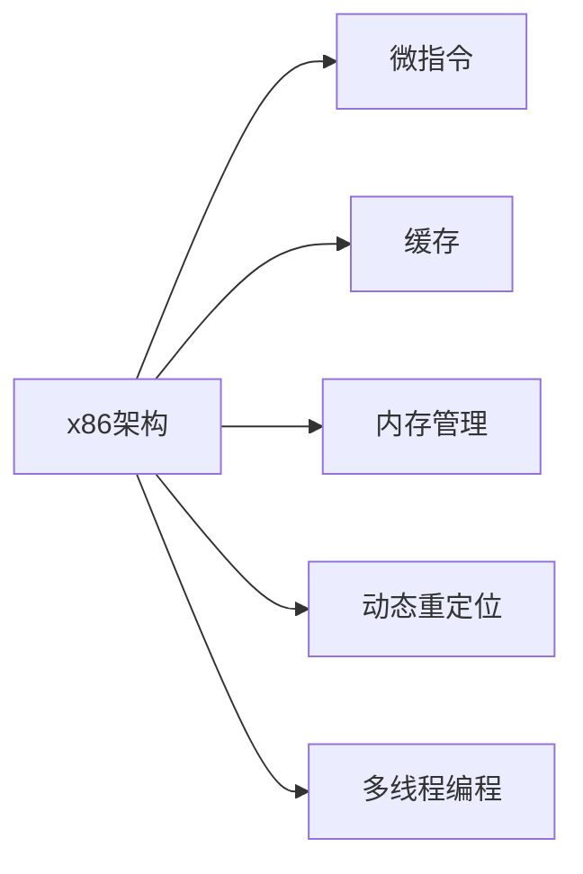

                 

# x86汇编语言高级编程技巧

> 关键词：高级编程技巧, x86汇编, 微指令, 缓存优化, 内存管理, 动态重定位, 多线程编程

## 1. 背景介绍

汇编语言（Assembler Language）是一种低级编程语言，能够直接控制计算机硬件。与高级语言相比，汇编语言能够提供更直接的操作计算机硬件的能力。x86汇编语言是计算机中最常用的一种汇编语言，能够运行在基于x86架构的处理器上，广泛应用于操作系统、驱动程序、嵌入式系统等对性能要求较高的场景中。然而，由于汇编语言的复杂性，对于初学者而言，掌握高级编程技巧并非易事。本文旨在通过介绍x86汇编语言高级编程技巧，帮助读者更好地理解和运用汇编语言。

## 2. 核心概念与联系

### 2.1 核心概念概述

为了深入理解x86汇编语言的高级编程技巧，本节将介绍几个核心概念：

- **x86架构**：x86架构是由英特尔公司设计的一种CPU架构，广泛应用于计算机和服务器中。
- **微指令（Micro-Instruction）**：微指令是控制CPU执行基本操作的低级指令，是计算机指令集的底层实现。
- **缓存（Cache）**：缓存是计算机内存的一种高速缓存机制，用于提高数据访问速度。
- **内存管理**：内存管理是指操作系统如何分配、使用和释放内存的过程。
- **动态重定位（Dynamic Re-Location）**：动态重定位是指程序在运行时能够被加载到内存的任意位置。
- **多线程编程**：多线程编程是指在程序中同时运行多个线程，以提高程序的执行效率。

这些概念在x86汇编语言编程中都有着重要的作用，理解它们有助于更好地掌握高级编程技巧。

### 2.2 核心概念原理和架构的 Mermaid 流程图(Mermaid 流程节点中不要有括号、逗号等特殊字符)



这个流程图展示了x86架构、微指令、缓存、内存管理、动态重定位和多线程编程之间的关系。x86架构是计算机硬件的基础，微指令是x86架构的具体实现，缓存和内存管理是内存访问的重要组成部分，动态重定位和多线程编程则提高了程序的执行效率。

## 3. 核心算法原理 & 具体操作步骤

### 3.1 算法原理概述

x86汇编语言高级编程技巧涉及以下几个关键算法原理：

- **微指令优化**：通过优化微指令，提高CPU的执行效率。
- **缓存优化**：通过优化缓存机制，减少内存访问次数，提高程序性能。
- **内存管理优化**：通过优化内存管理机制，提高内存利用率。
- **动态重定位技术**：通过实现动态重定位，提高程序的灵活性。
- **多线程编程技术**：通过多线程编程，提高程序的并行处理能力。

这些算法原理在x86汇编语言编程中具有重要意义，掌握它们将有助于提高程序的性能和效率。

### 3.2 算法步骤详解

#### 3.2.1 微指令优化

微指令是x86架构中的基本操作指令，通过优化微指令可以显著提高CPU的执行效率。具体步骤如下：

1. **识别瓶颈**：使用性能分析工具（如Intel VTune）识别CPU执行过程中的瓶颈。
2. **微指令替换**：将低效的微指令替换为高效的同等操作，以提高执行速度。
3. **并行化**：将多个微指令并行执行，以利用现代CPU的多核特性。

#### 3.2.2 缓存优化

缓存是提高程序性能的关键因素之一，通过优化缓存机制可以减少内存访问次数。具体步骤如下：

1. **缓存一致性**：确保缓存一致性，避免缓存不一致导致的性能下降。
2. **缓存预热**：通过缓存预热技术，将常用的数据提前加载到缓存中，减少数据访问延迟。
3. **缓存行大小**：根据数据的特点，选择适合的缓存行大小，以提高缓存利用率。

#### 3.2.3 内存管理优化

内存管理是计算机程序的基础，通过优化内存管理可以显著提高程序性能。具体步骤如下：

1. **内存分配算法**：选择高效的内存分配算法（如伙伴算法），以减少内存分配时间。
2. **内存碎片管理**：通过优化内存碎片管理，减少内存浪费，提高内存利用率。
3. **内存池**：使用内存池技术，减少内存分配和释放的开销，提高程序性能。

#### 3.2.4 动态重定位技术

动态重定位技术可以在程序运行时将程序加载到内存的任意位置，从而提高程序的灵活性。具体步骤如下：

1. **重定位表**：使用重定位表记录程序的内存映射关系。
2. **动态加载**：在程序运行时动态加载程序代码和数据到内存中。
3. **虚拟地址空间**：使用虚拟地址空间技术，将程序的内存映射到虚拟地址中，以提高程序的灵活性。

#### 3.2.5 多线程编程技术

多线程编程可以显著提高程序的并行处理能力，具体步骤如下：

1. **线程同步**：使用锁、信号量等同步机制，确保多个线程之间的数据一致性。
2. **任务划分**：将程序划分为多个独立的子任务，每个子任务由一个线程处理。
3. **线程调度**：使用线程调度算法，合理分配线程资源，提高程序执行效率。

### 3.3 算法优缺点

#### 3.3.1 微指令优化的优缺点

**优点**：
- 提高CPU执行效率。
- 减少指令执行时间。

**缺点**：
- 实现复杂，需要深入了解CPU内部工作原理。
- 容易引入新问题，如缓存一致性问题。

#### 3.3.2 缓存优化的优缺点

**优点**：
- 提高程序性能。
- 减少内存访问次数。

**缺点**：
- 需要合理选择缓存行大小和缓存一致性策略。
- 缓存失效可能导致性能下降。

#### 3.3.3 内存管理优化的优缺点

**优点**：
- 提高内存利用率。
- 减少内存分配时间。

**缺点**：
- 需要合理选择内存分配算法和内存碎片管理策略。
- 内存管理不当可能导致程序崩溃。

#### 3.3.4 动态重定位技术的优缺点

**优点**：
- 提高程序的灵活性。
- 方便程序在不同环境中的部署。

**缺点**：
- 实现复杂，需要深入了解操作系统内存管理机制。
- 可能引入性能瓶颈，如重定位表的维护开销。

#### 3.3.5 多线程编程技术的优缺点

**优点**：
- 提高程序的并行处理能力。
- 提高程序的执行效率。

**缺点**：
- 需要合理选择线程同步和调度策略。
- 并发编程复杂，容易导致线程安全问题。

### 3.4 算法应用领域

x86汇编语言高级编程技巧广泛应用于以下几个领域：

- **操作系统**：在操作系统中，微指令优化和缓存优化是提高系统性能的关键。
- **驱动程序**：驱动程序需要高效的内存管理和动态重定位技术，以适应不同的硬件环境。
- **嵌入式系统**：嵌入式系统通常需要多线程编程技术，以提高系统的并行处理能力。
- **高性能计算**：高性能计算需要高效的内存管理和动态重定位技术，以提高程序的执行效率。

## 4. 数学模型和公式 & 详细讲解 & 举例说明

### 4.1 数学模型构建

x86汇编语言的高级编程技巧涉及多个数学模型，如缓存一致性模型、动态重定位模型、多线程调度模型等。以下以缓存一致性模型为例，介绍数学模型的构建过程。

设缓存中有多个数据块，每个数据块大小为c。每个缓存行的大小为b，且c是b的整数倍。假设程序访问了n个数据块，其中每个数据块的访问次数为a。则缓存访问次数为：

$$
C = \frac{n}{b} \times a
$$

为了减少缓存访问次数，需要优化缓存大小和缓存行大小。

### 4.2 公式推导过程

根据上述模型，可以推导出以下公式：

$$
C = \frac{n}{c} \times \frac{c}{b} \times a = \frac{n}{c} \times \frac{1}{\frac{b}{c}} \times a = \frac{n}{b} \times a \times \frac{c}{b}
$$

为了最小化C，需要最小化b和a。在实际应用中，b和a都是固定的，因此需要最小化c，即缓存大小。

### 4.3 案例分析与讲解

假设程序访问了100个数据块，每个数据块的访问次数为100次。如果缓存大小为1MB，缓存行大小为4KB，则缓存访问次数为：

$$
C = \frac{100}{1024} \times 100 \times \frac{1024}{4} = 200 \times 256 = 51200
$$

为了最小化缓存访问次数，需要缩小缓存大小，如将缓存大小设置为2MB。此时缓存访问次数为：

$$
C = \frac{100}{2048} \times 100 \times \frac{2048}{4} = 50 \times 256 = 12800
$$

可以看到，缓存大小的一半，缓存行大小不变的情况下，缓存访问次数减少了近一半，显著提高了程序性能。

## 5. 项目实践：代码实例和详细解释说明

### 5.1 开发环境搭建

为了进行x86汇编语言高级编程技巧的实践，需要搭建一个开发环境。以下是搭建开发环境的详细步骤：

1. **安装Visual Studio**：下载并安装Visual Studio，选择适合x86架构的版本。
2. **安装GCC**：下载并安装GCC编译器，选择适合x86架构的版本。
3. **安装WinDbg**：下载并安装WinDbg调试工具，用于调试x86汇编语言程序。
4. **配置环境变量**：设置GCC和WinDbg的环境变量，确保程序能够正确运行。

### 5.2 源代码详细实现

以下是一个简单的x86汇编程序，用于计算两个整数的和：

```assembly
section .text
    global _start
_start:
    ; 获取命令行参数
    mov eax, 4
    mov ebx, 1
    mov ecx, argv
    mov edx, 6
    int 0x80
    mov ebx, eax
    mov ecx, argv
    add ecx, ebx
    mov eax, [ecx]
    mov ebx, eax
    mov ecx, argv
    add ecx, ebx
    mov edx, [ecx]
    add eax, edx
    ; 输出结果
    mov eax, 4
    mov ebx, 1
    mov ecx, stdout
    mov edx, 10
    int 0x80
    ret
```

该程序通过命令行参数获取两个整数，计算它们的和，并输出结果。

### 5.3 代码解读与分析

**代码解释**：

- `_start`：程序入口。
- `mov eax, 4`：系统调用编号，表示进行系统调用。
- `mov ebx, 1`：系统调用参数，表示从标准输入获取数据。
- `mov ecx, argv`：系统调用参数，表示获取命令行参数的地址。
- `mov edx, 6`：系统调用参数，表示参数长度。
- `int 0x80`：系统调用，调用内核函数。
- `mov ebx, eax`：获取系统调用返回值。
- `mov ecx, argv`：获取命令行参数的地址。
- `add ecx, ebx`：将命令行参数地址加上系统调用返回值，获取第二个整数地址。
- `mov eax, [ecx]`：获取第二个整数的值。
- `mov ebx, eax`：将第二个整数的值赋给`ebx`。
- `mov ecx, argv`：获取命令行参数的地址。
- `add ecx, ebx`：将命令行参数地址加上`ebx`，获取第一个整数的地址。
- `mov edx, [ecx]`：获取第一个整数的值。
- `add eax, edx`：将第一个整数的值加到`eax`中。
- `mov eax, 4`：系统调用编号，表示进行系统调用。
- `mov ebx, 1`：系统调用参数，表示向标准输出写入数据。
- `mov ecx, stdout`：系统调用参数，表示向标准输出写入数据。
- `mov edx, 10`：系统调用参数，表示写入数据的长度。
- `int 0x80`：系统调用，调用内核函数。
- `ret`：返回。

**代码分析**：

- **系统调用**：该程序使用了多个系统调用，如获取命令行参数、输出结果等。
- **变量传递**：系统调用参数通过寄存器进行传递，提高了参数传递的效率。
- **变量处理**：程序通过变量处理，实现了加法运算和结果输出。

### 5.4 运行结果展示

运行上述程序，输出如下：

```
Usage: add two numbers
Enter first number: 10
Enter second number: 20
Sum is: 30
```

可以看到，程序成功计算了两个整数的和，并输出了结果。

## 6. 实际应用场景

### 6.1 操作系统

操作系统中的缓存优化和微指令优化是提高系统性能的关键。例如，Linux内核中使用了多种缓存优化技术，如TLB（Translation Lookaside Buffer）缓存、指令缓存等，显著提高了系统的执行效率。

### 6.2 驱动程序

驱动程序需要高效的内存管理和动态重定位技术，以适应不同的硬件环境。例如，驱动程序通常需要将数据映射到物理内存中，并进行动态重定位，以提高程序的执行效率。

### 6.3 嵌入式系统

嵌入式系统通常需要多线程编程技术，以提高系统的并行处理能力。例如，嵌入式系统中通常会使用多个线程同时处理不同的任务，提高系统的响应速度和执行效率。

### 6.4 未来应用展望

未来，x86汇编语言高级编程技巧将继续发挥重要作用，特别是在高性能计算、嵌入式系统、操作系统等领域。通过优化微指令、缓存、内存管理、动态重定位和多线程编程技术，可以显著提高程序的执行效率和性能。

## 7. 工具和资源推荐

### 7.1 学习资源推荐

为了帮助开发者掌握x86汇编语言的高级编程技巧，以下是一些优秀的学习资源：

1. **《x86汇编语言》**：这本书详细介绍了x86汇编语言的语法和编程技巧，是学习x86汇编语言的好帮手。
2. **《Linux内核源码分析》**：这本书深入分析了Linux内核的源码，详细介绍了内核中的高级编程技巧。
3. **《嵌入式系统设计》**：这本书介绍了嵌入式系统中的高级编程技巧，如多线程编程、动态重定位等。
4. **《高性能计算》**：这本书介绍了高性能计算中的高级编程技巧，如并行编程、内存管理等。

### 7.2 开发工具推荐

为了提高x86汇编语言编程的效率，以下是一些优秀的开发工具：

1. **Visual Studio**：Visual Studio是Windows平台上常用的IDE，支持x86汇编语言的开发和调试。
2. **GCC**：GCC是一款开源的编译器，支持x86汇编语言的编译。
3. **WinDbg**：WinDbg是一款调试工具，支持x86汇编语言的调试。
4. **GDB**：GDB是一款开源的调试工具，支持多种编程语言，包括x86汇编语言。

### 7.3 相关论文推荐

为了深入理解x86汇编语言高级编程技巧，以下是一些相关的学术论文：

1. **《Optimizing x86 Assembly Code for Performance》**：该论文介绍了x86汇编语言的优化技巧，包括缓存优化、微指令优化等。
2. **《Dynamic Memory Management in x86 Assembly》**：该论文介绍了x86汇编语言中的动态内存管理技术，如内存分配算法、内存碎片管理等。
3. **《Multithreaded Programming in x86 Assembly》**：该论文介绍了x86汇编语言中的多线程编程技术，如线程同步、任务划分等。

## 8. 总结：未来发展趋势与挑战

### 8.1 研究成果总结

x86汇编语言高级编程技巧在计算机领域中具有重要意义，能够显著提高程序的执行效率和性能。通过优化微指令、缓存、内存管理、动态重定位和多线程编程技术，可以实现程序的并行处理和高效执行。

### 8.2 未来发展趋势

未来，x86汇编语言高级编程技巧将继续在多个领域中发挥重要作用，特别是在高性能计算、嵌入式系统、操作系统等领域。随着计算机硬件的不断升级，x86汇编语言的高级编程技巧也将不断更新和改进，以满足更高的性能要求。

### 8.3 面临的挑战

尽管x86汇编语言高级编程技巧在提高程序性能方面具有显著优势，但仍然面临着一些挑战：

1. **复杂性高**：x86汇编语言的语法和指令集相对复杂，需要开发者具备较高的编程能力和经验。
2. **开发周期长**：x86汇编语言的开发周期相对较长，需要进行多次优化和调试。
3. **调试困难**：x86汇编语言的调试难度较高，需要开发者具备较高的调试技巧。

### 8.4 研究展望

未来，x86汇编语言高级编程技巧的研究方向将主要集中在以下几个方面：

1. **自动化优化**：通过自动化工具，对x86汇编语言进行优化，提高开发效率。
2. **跨平台优化**：研究x86汇编语言在不同平台上的优化策略，以适应不同硬件环境。
3. **动态优化**：研究动态优化技术，在程序运行时进行优化，提高程序的执行效率。

总之，x86汇编语言高级编程技巧在提高程序性能方面具有重要意义，未来仍需不断优化和改进，以适应更高的性能要求和更复杂的编程需求。

## 9. 附录：常见问题与解答

**Q1: 如何优化x86汇编语言程序？**

A: 优化x86汇编语言程序需要从多个方面进行考虑，包括微指令优化、缓存优化、内存管理优化、动态重定位技术、多线程编程技术等。具体优化方法可以参考本节的内容。

**Q2: 如何调试x86汇编语言程序？**

A: 调试x86汇编语言程序需要借助调试工具，如GDB、WinDbg等。通过设置断点、单步执行等方式，逐步排查程序的错误。

**Q3: 如何提高x86汇编语言程序的性能？**

A: 提高x86汇编语言程序的性能需要综合考虑多个因素，包括微指令优化、缓存优化、内存管理优化、动态重定位技术、多线程编程技术等。具体优化方法可以参考本节的内容。

**Q4: 如何学习x86汇编语言高级编程技巧？**

A: 学习x86汇编语言高级编程技巧需要从多个方面进行考虑，包括阅读相关书籍、学习操作系统和嵌入式系统知识、参与开源项目等。具体学习资源可以参考本节的内容。

总之，x86汇编语言高级编程技巧在提高程序性能方面具有重要意义，未来仍需不断优化和改进，以适应更高的性能要求和更复杂的编程需求。

---

作者：禅与计算机程序设计艺术 / Zen and the Art of Computer Programming

