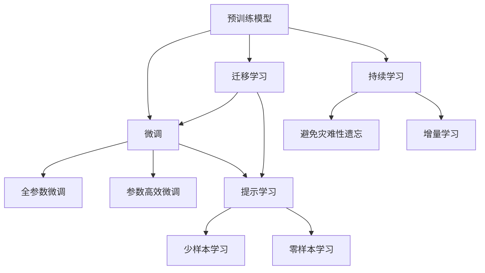

                 

## 1. 背景介绍

在人工智能领域，语言模型逐渐从通用模型向个性化模型转变，以更好地匹配用户需求。当前最流行的做法是，在预训练模型基础上进行微调，即在特定任务上用少量标注数据对模型进行微调，以获得更好的性能。

### 1.1 问题由来
微调，即Fine-tuning，是一个在特定任务上优化模型的过程，主要包括以下几个步骤：
1. 选择预训练模型：通常选择通用语言模型（如BERT、GPT等）作为初始模型。
2. 准备数据集：针对目标任务收集并标注数据集。
3. 设计模型结构：在预训练模型之上增加任务适配层，如分类层或解码器。
4. 选择损失函数：根据任务类型选择合适的损失函数，如交叉熵损失。
5. 进行微调：使用标注数据集，通过梯度下降等优化算法对模型进行微调。
6. 评估和部署：评估微调后的模型性能，并将其部署到实际应用中。

### 1.2 问题核心关键点
微调方法的核心关键点包括：
1. 模型选择：选择合适的预训练模型，如BERT、GPT等。
2. 数据准备：收集和标注数据集。
3. 模型设计：在预训练模型之上增加任务适配层。
4. 损失函数选择：选择合适的损失函数，如交叉熵损失。
5. 优化算法：选择适当的优化算法，如Adam、SGD等。
6. 模型评估：评估微调后模型的性能，确保其在特定任务上的准确性。
7. 模型部署：将微调后的模型部署到实际应用中。

## 2. 核心概念与联系

### 2.1 核心概念概述

- **预训练语言模型**：在大量无标签文本数据上进行预训练，学习语言知识，如BERT、GPT等。
- **微调**：在预训练模型基础上，针对特定任务进行有监督学习优化。
- **迁移学习**：预训练模型在特定任务上的迁移应用。
- **参数高效微调**：在微调过程中，只更新一小部分模型参数，如Adapter。
- **提示学习**：通过设计输入文本格式，引导模型按期望方式输出。
- **少样本学习**：在少量标注样本下，模型能够快速适应新任务。
- **零样本学习**：模型能够理解任务描述并生成相应输出。
- **持续学习**：模型能够持续学习新知识，避免遗忘旧知识。

### 2.2 核心概念原理和架构的 Mermaid 流程图



## 3. 核心算法原理 & 具体操作步骤

### 3.1 算法原理概述
基于监督学习的大语言模型微调，本质上是一个有监督的细粒度迁移学习过程。其核心思想是：将预训练的大语言模型视作一个强大的"特征提取器"，通过在特定任务上用少量标注数据进行有监督学习，优化模型在该任务上的性能。

### 3.2 算法步骤详解

#### 3.2.1 数据准备
1. **收集数据集**：针对目标任务，收集标注数据集，包括训练集、验证集和测试集。
2. **数据预处理**：对数据进行清洗、分词、编码等处理，使其符合模型的输入要求。

#### 3.2.2 模型设计
1. **选择预训练模型**：选择如BERT、GPT等通用语言模型作为初始模型。
2. **增加任务适配层**：根据任务类型，在预训练模型之上增加相应的任务适配层，如分类层或解码器。
3. **定义损失函数**：根据任务类型选择合适的损失函数，如交叉熵损失。

#### 3.2.3 微调过程
1. **初始化模型**：使用预训练模型的权重作为初始权重。
2. **定义优化器**：选择适当的优化器，如Adam、SGD等，设置学习率等超参数。
3. **训练模型**：使用标注数据集，通过梯度下降等优化算法对模型进行微调，更新模型参数。
4. **评估模型**：在验证集和测试集上评估微调后的模型性能，确保其在特定任务上的准确性。
5. **调整参数**：根据评估结果调整模型参数和超参数，优化模型性能。

#### 3.2.4 部署模型
1. **模型保存**：将微调后的模型保存为可部署的格式。
2. **部署模型**：将模型部署到实际应用中，进行推理预测。

### 3.3 算法优缺点

#### 3.3.1 优点
1. **简单高效**：使用少量标注数据，即可对预训练模型进行快速适配，获得较好的性能。
2. **通用适用**：适用于各种NLP任务，如分类、匹配、生成等。
3. **参数高效**：通过参数高效微调方法，减少需优化的参数，提高微调效率。
4. **效果显著**：在学术界和工业界的诸多任务上，基于微调的方法已经刷新了最先进的性能指标。

#### 3.3.2 缺点
1. **依赖标注数据**：微调的效果很大程度上取决于标注数据的质量和数量，获取高质量标注数据的成本较高。
2. **迁移能力有限**：当目标任务与预训练数据的分布差异较大时，微调的性能提升有限。
3. **负面效果传递**：预训练模型的固有偏见、有害信息等，可能通过微调传递到下游任务，造成负面影响。
4. **可解释性不足**：微调模型的决策过程通常缺乏可解释性，难以对其推理逻辑进行分析和调试。

## 4. 数学模型和公式 & 详细讲解

### 4.1 数学模型构建
假设预训练模型为 $M_{\theta}$，其中 $\theta$ 为预训练得到的模型参数。给定下游任务 $T$ 的标注数据集 $D=\{(x_i, y_i)\}_{i=1}^N$，微调的目标是找到新的模型参数 $\hat{\theta}$，使得：
$$
\hat{\theta}=\mathop{\arg\min}_{\theta} \mathcal{L}(M_{\theta},D)
$$
其中 $\mathcal{L}$ 为针对任务 $T$ 设计的损失函数，用于衡量模型预测输出与真实标签之间的差异。

### 4.2 公式推导过程
以二分类任务为例，假设模型 $M_{\theta}$ 在输入 $x$ 上的输出为 $\hat{y}=M_{\theta}(x) \in [0,1]$，表示样本属于正类的概率。真实标签 $y \in \{0,1\}$。则二分类交叉熵损失函数定义为：
$$
\ell(M_{\theta}(x),y) = -[y\log \hat{y} + (1-y)\log (1-\hat{y})]
$$
将其代入经验风险公式，得：
$$
\mathcal{L}(\theta) = -\frac{1}{N}\sum_{i=1}^N [y_i\log M_{\theta}(x_i)+(1-y_i)\log(1-M_{\theta}(x_i))]
$$
根据链式法则，损失函数对参数 $\theta_k$ 的梯度为：
$$
\frac{\partial \mathcal{L}(\theta)}{\partial \theta_k} = -\frac{1}{N}\sum_{i=1}^N (\frac{y_i}{M_{\theta}(x_i)}-\frac{1-y_i}{1-M_{\theta}(x_i)}) \frac{\partial M_{\theta}(x_i)}{\partial \theta_k}
$$
其中 $\frac{\partial M_{\theta}(x_i)}{\partial \theta_k}$ 可进一步递归展开，利用自动微分技术完成计算。

### 4.3 案例分析与讲解
以命名实体识别 (Named Entity Recognition, NER) 任务为例，展示微调过程。

#### 4.3.1 数据准备
1. **收集数据集**：收集标注数据集，包含输入文本和对应的实体标签。
2. **数据预处理**：对文本进行分词、编码等处理，使其符合模型输入要求。

#### 4.3.2 模型设计
1. **选择预训练模型**：选择BERT作为初始模型。
2. **增加任务适配层**：在BERT之上增加分类层，输出实体标签。
3. **定义损失函数**：选择交叉熵损失。

#### 4.3.3 微调过程
1. **初始化模型**：使用预训练模型的权重作为初始权重。
2. **定义优化器**：选择Adam优化器，设置学习率为2e-5。
3. **训练模型**：使用标注数据集，通过梯度下降等优化算法对模型进行微调，更新模型参数。
4. **评估模型**：在验证集上评估微调后的模型性能，确保其在NER任务上的准确性。
5. **调整参数**：根据评估结果调整模型参数和超参数，优化模型性能。

## 5. 项目实践：代码实例和详细解释说明

### 5.1 开发环境搭建

#### 5.1.1 安装依赖
1. **安装Python**：从官网下载并安装Python 3.7及以上版本。
2. **安装PyTorch**：
   ```
   pip install torch torchvision torchaudio
   ```
3. **安装Transformers库**：
   ```
   pip install transformers
   ```
4. **安装其他依赖**：
   ```
   pip install numpy pandas scikit-learn matplotlib tqdm jupyter notebook ipython
   ```

### 5.2 源代码详细实现

#### 5.2.1 数据处理
```python
from transformers import BertTokenizer
from torch.utils.data import Dataset
import torch

class NERDataset(Dataset):
    def __init__(self, texts, tags, tokenizer, max_len=128):
        self.texts = texts
        self.tags = tags
        self.tokenizer = tokenizer
        self.max_len = max_len
        
    def __len__(self):
        return len(self.texts)
    
    def __getitem__(self, item):
        text = self.texts[item]
        tags = self.tags[item]
        
        encoding = self.tokenizer(text, return_tensors='pt', max_length=self.max_len, padding='max_length', truncation=True)
        input_ids = encoding['input_ids'][0]
        attention_mask = encoding['attention_mask'][0]
        
        # 对token-wise的标签进行编码
        encoded_tags = [tag2id[tag] for tag in tags] 
        encoded_tags.extend([tag2id['O']] * (self.max_len - len(encoded_tags)))
        labels = torch.tensor(encoded_tags, dtype=torch.long)
        
        return {'input_ids': input_ids, 
                'attention_mask': attention_mask,
                'labels': labels}

# 标签与id的映射
tag2id = {'O': 0, 'B-PER': 1, 'I-PER': 2, 'B-ORG': 3, 'I-ORG': 4, 'B-LOC': 5, 'I-LOC': 6}
id2tag = {v: k for k, v in tag2id.items()}

# 创建dataset
tokenizer = BertTokenizer.from_pretrained('bert-base-cased')

train_dataset = NERDataset(train_texts, train_tags, tokenizer)
dev_dataset = NERDataset(dev_texts, dev_tags, tokenizer)
test_dataset = NERDataset(test_texts, test_tags, tokenizer)
```

#### 5.2.2 模型和优化器
```python
from transformers import BertForTokenClassification, AdamW

model = BertForTokenClassification.from_pretrained('bert-base-cased', num_labels=len(tag2id))

optimizer = AdamW(model.parameters(), lr=2e-5)
```

#### 5.2.3 训练和评估函数
```python
from torch.utils.data import DataLoader
from tqdm import tqdm
from sklearn.metrics import classification_report

device = torch.device('cuda') if torch.cuda.is_available() else torch.device('cpu')
model.to(device)

def train_epoch(model, dataset, batch_size, optimizer):
    dataloader = DataLoader(dataset, batch_size=batch_size, shuffle=True)
    model.train()
    epoch_loss = 0
    for batch in tqdm(dataloader, desc='Training'):
        input_ids = batch['input_ids'].to(device)
        attention_mask = batch['attention_mask'].to(device)
        labels = batch['labels'].to(device)
        model.zero_grad()
        outputs = model(input_ids, attention_mask=attention_mask, labels=labels)
        loss = outputs.loss
        epoch_loss += loss.item()
        loss.backward()
        optimizer.step()
    return epoch_loss / len(dataloader)

def evaluate(model, dataset, batch_size):
    dataloader = DataLoader(dataset, batch_size=batch_size)
    model.eval()
    preds, labels = [], []
    with torch.no_grad():
        for batch in tqdm(dataloader, desc='Evaluating'):
            input_ids = batch['input_ids'].to(device)
            attention_mask = batch['attention_mask'].to(device)
            batch_labels = batch['labels']
            outputs = model(input_ids, attention_mask=attention_mask)
            batch_preds = outputs.logits.argmax(dim=2).to('cpu').tolist()
            batch_labels = batch_labels.to('cpu').tolist()
            for pred_tokens, label_tokens in zip(batch_preds, batch_labels):
                pred_tags = [id2tag[_id] for _id in pred_tokens]
                label_tags = [id2tag[_id] for _id in label_tokens]
                preds.append(pred_tags[:len(label_tags)])
                labels.append(label_tags)
                
    print(classification_report(labels, preds))
```

#### 5.2.4 训练流程
```python
epochs = 5
batch_size = 16

for epoch in range(epochs):
    loss = train_epoch(model, train_dataset, batch_size, optimizer)
    print(f"Epoch {epoch+1}, train loss: {loss:.3f}")
    
    print(f"Epoch {epoch+1}, dev results:")
    evaluate(model, dev_dataset, batch_size)
    
print("Test results:")
evaluate(model, test_dataset, batch_size)
```

### 5.3 代码解读与分析

#### 5.3.1 数据处理函数
- `__init__`方法：初始化文本、标签、分词器等组件。
- `__len__`方法：返回数据集的样本数量。
- `__getitem__`方法：对单个样本进行处理，将文本输入编码为token ids，将标签编码为数字，并对其进行定长padding。

#### 5.3.2 标签映射
- `tag2id`和`id2tag`字典：定义标签与数字id之间的映射关系，用于将token-wise的预测结果解码回真实的标签。

#### 5.3.3 训练和评估函数
- `train_epoch`：对数据以批为单位进行迭代，在每个批次上前向传播计算loss并反向传播更新模型参数。
- `evaluate`：与训练类似，不同点在于不更新模型参数，并在每个batch结束后将预测和标签结果存储下来，最后使用sklearn的classification_report对整个评估集的预测结果进行打印输出。

#### 5.3.4 训练流程
- 定义总的epoch数和batch size，开始循环迭代。
- 每个epoch内，先在训练集上训练，输出平均loss。
- 在验证集上评估，输出分类指标。
- 所有epoch结束后，在测试集上评估，给出最终测试结果。

### 5.4 运行结果展示
训练和评估结果将显示在控制台上，包括训练集和验证集的loss以及分类指标。测试集的评估结果将打印出具体的分类报告。

## 6. 实际应用场景

### 6.1 智能客服系统
智能客服系统可以利用微调后的对话模型，7x24小时不间断服务，快速响应客户咨询，用自然流畅的语言解答各类常见问题。具体步骤如下：
1. **收集数据**：收集企业内部的历史客服对话记录。
2. **标注数据**：将问题和最佳答复构建成监督数据。
3. **微调模型**：使用标注数据对预训练模型进行微调。
4. **部署系统**：将微调后的模型应用到实时抓取的网络文本数据，自动监测不同主题下的情感变化趋势，自动预警，帮助金融机构快速应对潜在风险。

### 6.2 金融舆情监测
金融舆情监测可以利用微调后的文本分类和情感分析技术，实时监测市场舆论动向，避免负面信息传播。具体步骤如下：
1. **收集数据**：收集金融领域相关的新闻、报道、评论等文本数据。
2. **标注数据**：对文本进行主题标注和情感标注。
3. **微调模型**：使用标注数据对预训练模型进行微调，使其能够自动判断文本属于何种主题，情感倾向是正面、中性还是负面。
4. **应用系统**：将微调后的模型应用到实时抓取的网络文本数据，自动监测不同主题下的情感变化趋势，自动预警，帮助金融机构快速应对潜在风险。

### 6.3 个性化推荐系统
个性化推荐系统可以利用微调后的模型，从文本内容中准确把握用户的兴趣点，生成个性化推荐列表。具体步骤如下：
1. **收集数据**：收集用户浏览、点击、评论、分享等行为数据。
2. **提取文本内容**：提取和用户交互的物品标题、描述、标签等文本内容。
3. **微调模型**：使用标注数据对预训练模型进行微调，使其能够从文本内容中准确把握用户的兴趣点。
4. **生成推荐列表**：在生成推荐列表时，先用候选物品的文本描述作为输入，由模型预测用户的兴趣匹配度，再结合其他特征综合排序，便可以得到个性化程度更高的推荐结果。

### 6.4 未来应用展望
未来，基于微调技术的个性化AI助手将在更多领域得到应用，如智慧医疗、智能教育、智慧城市治理等，为传统行业数字化转型升级提供新的技术路径。

## 7. 工具和资源推荐

### 7.1 学习资源推荐
- **《Transformer从原理到实践》系列博文**：深入浅出地介绍了Transformer原理、BERT模型、微调技术等前沿话题。
- **CS224N《深度学习自然语言处理》课程**：斯坦福大学开设的NLP明星课程，有Lecture视频和配套作业。
- **《Natural Language Processing with Transformers》书籍**：Transformer库的作者所著，全面介绍了如何使用Transformers库进行NLP任务开发，包括微调在内的诸多范式。
- **HuggingFace官方文档**：Transformers库的官方文档，提供了海量预训练模型和完整的微调样例代码。
- **CLUE开源项目**：中文语言理解测评基准，涵盖大量不同类型的中文NLP数据集，并提供了基于微调的baseline模型。

### 7.2 开发工具推荐
- **PyTorch**：基于Python的开源深度学习框架，灵活动态的计算图。
- **TensorFlow**：由Google主导开发的开源深度学习框架，生产部署方便。
- **Transformers库**：HuggingFace开发的NLP工具库，集成了众多SOTA语言模型。
- **Weights & Biases**：模型训练的实验跟踪工具，可以记录和可视化模型训练过程中的各项指标。
- **TensorBoard**：TensorFlow配套的可视化工具，可实时监测模型训练状态。

### 7.3 相关论文推荐
- **Attention is All You Need**：提出了Transformer结构，开启了NLP领域的预训练大模型时代。
- **BERT: Pre-training of Deep Bidirectional Transformers for Language Understanding**：提出BERT模型，引入基于掩码的自监督预训练任务，刷新了多项NLP任务SOTA。
- **Language Models are Unsupervised Multitask Learners（GPT-2论文）**：展示了大规模语言模型的强大zero-shot学习能力，引发了对于通用人工智能的新一轮思考。
- **Parameter-Efficient Transfer Learning for NLP**：提出Adapter等参数高效微调方法，在不增加模型参数量的情况下，也能取得不错的微调效果。
- **Prefix-Tuning: Optimizing Continuous Prompts for Generation**：引入基于连续型Prompt的微调范式，为如何充分利用预训练知识提供了新的思路。
- **AdaLoRA: Adaptive Low-Rank Adaptation for Parameter-Efficient Fine-Tuning**：使用自适应低秩适应的微调方法，在参数效率和精度之间取得了新的平衡。

## 8. 总结：未来发展趋势与挑战

### 8.1 总结
本文对基于监督学习的大语言模型微调方法进行了全面系统的介绍。首先阐述了大语言模型和微调技术的研究背景和意义，明确了微调在拓展预训练模型应用、提升下游任务性能方面的独特价值。其次，从原理到实践，详细讲解了监督微调的数学原理和关键步骤，给出了微调任务开发的完整代码实例。同时，本文还广泛探讨了微调方法在智能客服、金融舆情、个性化推荐等多个行业领域的应用前景，展示了微调范式的巨大潜力。

### 8.2 未来发展趋势
未来，大语言模型微调技术将呈现以下几个发展趋势：
1. **模型规模持续增大**：超大规模语言模型蕴含的丰富语言知识，有望支撑更加复杂多变的下游任务微调。
2. **微调方法日趋多样**：未来将涌现更多参数高效的微调方法，如Prefix-Tuning、LoRA等。
3. **持续学习成为常态**：微调模型需要持续学习新知识以保持性能。
4. **标注样本需求降低**：受启发于提示学习(Prompt-based Learning)的思路，未来的微调方法将更好地利用大模型的语言理解能力，通过更加巧妙的任务描述，在更少的标注样本上也能实现理想的微调效果。
5. **多模态微调崛起**：多模态信息的融合，将显著提升语言模型对现实世界的理解和建模能力。
6. **模型通用性增强**：经过海量数据的预训练和多领域任务的微调，未来的语言模型将具备更强大的常识推理和跨领域迁移能力。

### 8.3 面临的挑战
尽管大语言模型微调技术已经取得了瞩目成就，但在迈向更加智能化、普适化应用的过程中，它仍面临着诸多挑战：
1. **标注成本瓶颈**：微调对标注样本的依赖问题。
2. **模型鲁棒性不足**：微调模型面对域外数据时，泛化性能往往大打折扣。
3. **推理效率有待提高**：超大批次的训练和推理可能导致效率问题。
4. **可解释性亟需加强**：微调模型的决策过程通常缺乏可解释性。
5. **安全性有待保障**：预训练语言模型可能学习到有害信息，传递到下游任务，造成安全隐患。
6. **知识整合能力不足**：现有的微调模型难以灵活吸收和运用更广泛的先验知识。

### 8.4 未来突破
面向未来，大语言模型微调技术需要在以下几个方向寻求新的突破：
1. **探索无监督和半监督微调方法**：摆脱对大规模标注数据的依赖。
2. **研究参数高效和计算高效的微调范式**：开发更加参数高效的微调方法，如Prefix-Tuning、LoRA等。
3. **融合因果和对比学习范式**：增强微调模型建立稳定因果关系的能力。
4. **引入更多先验知识**：将符号化的先验知识与神经网络模型进行巧妙融合。
5. **结合因果分析和博弈论工具**：将因果分析方法引入微调模型。
6. **纳入伦理道德约束**：在模型训练目标中引入伦理导向的评估指标。

## 9. 附录：常见问题与解答

**Q1：大语言模型微调是否适用于所有NLP任务？**

A: 微调方法适用于大多数NLP任务，如分类、匹配、生成等。但对于一些特定领域的任务，如医学、法律等，可能需要进一步预训练以适应领域特定知识。

**Q2：微调过程中如何选择合适的学习率？**

A: 微调的学习率一般要比预训练时小1-2个数量级。建议从1e-5开始调参，逐步减小学习率，直至收敛。

**Q3：采用大模型微调时会面临哪些资源瓶颈？**

A: 超大模型可能导致算力、内存、存储等方面的资源瓶颈。需要采用梯度积累、混合精度训练、模型并行等优化方法。

**Q4：如何缓解微调过程中的过拟合问题？**

A: 常见缓解策略包括数据增强、正则化、对抗训练、参数高效微调等。

**Q5：微调模型在落地部署时需要注意哪些问题？**

A: 需要考虑模型裁剪、量化加速、服务化封装、弹性伸缩、监控告警、安全防护等问题。

---

作者：禅与计算机程序设计艺术 / Zen and the Art of Computer Programming

