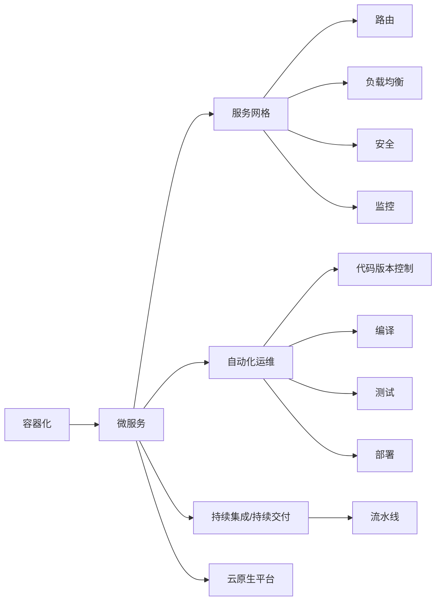

                 

## 1. 背景介绍

### 1.1 问题由来

随着云计算技术的不断进步，越来越多的企业将业务迁移到云端，以实现资源共享、弹性扩展和快速迭代。然而，云环境下分布式系统的高复杂性、高可用性和可扩展性要求，对架构设计提出了新的挑战。传统单体应用架构难以应对大规模分布式系统的高并发、高可扩展性需求，迫切需要一种新的架构模式。

云原生架构（Cloud-Native Architecture）应运而生，它基于容器化、微服务、自动化、持续集成/持续交付等技术，以适应云环境下的应用程序设计、开发、运维需求，帮助企业构建可扩展、高效、弹性的云原生应用程序。

### 1.2 问题核心关键点

云原生架构的核心在于如何构建可扩展的云端应用程序。它包括：

1. 容器化：将应用程序打包在容器镜像中，方便统一管理和调度。
2. 微服务：将单体应用拆分为独立、自治的服务，通过接口通信实现松耦合。
3. 服务网格：基于API网关、服务发现、负载均衡、流量控制等技术，实现服务的灵活组合和管理。
4. 自动化运维：通过CI/CD、自动化测试、自动化部署等技术，提高运维效率，降低运维成本。
5. 持续集成/持续交付：通过自动化流水线，加速软件开发和交付速度，提升系统质量和稳定性。

### 1.3 问题研究意义

云原生架构的推广应用，对提升企业云环境下的应用系统性能、弹性和效率具有重要意义：

1. 提升系统弹性。云原生架构通过微服务拆分，使得应用具备高弹性、高可扩展性，可以动态调整服务实例数量，满足不同场景下的需求。
2. 加速系统交付。云原生架构通过自动化运维和持续集成/持续交付，可以快速迭代开发，缩短从代码到生产环境的交付周期。
3. 降低运维成本。云原生架构通过服务网格和自动化运维技术，减少了人工干预，提高了运维效率，降低了运维成本。
4. 提高系统质量。云原生架构通过持续集成/持续交付技术，确保每次交付都是高质量的，避免了传统发布系统常见的错误和风险。

## 2. 核心概念与联系

### 2.1 核心概念概述

为更好地理解云原生架构，本节将介绍几个密切相关的核心概念：

- 容器化（Containerization）：将应用程序打包在容器中，以便在不同环境中以一致的方式运行。常用的容器引擎有Docker、Kubernetes等。
- 微服务（Microservices）：将单体应用拆分为独立、自治的服务单元，每个服务负责单一职责，通过接口通信实现松耦合。
- 服务网格（Service Mesh）：一种在应用层面的通信基础设施，提供了路由、负载均衡、安全、监控等功能，以提升服务之间的通信效率。
- 自动化运维（AutoOps）：通过自动化工具和流程，实现软件开发生命周期的自动化，包括代码版本控制、编译、测试、部署、监控等。
- 持续集成/持续交付（CI/CD）：通过自动化流水线，将软件开发、测试和部署流程自动化，加速开发和交付速度，提升系统质量。
- 云原生平台（Cloud-Native Platforms）：基于容器化、微服务、服务网格、自动化运维等技术构建的云原生基础设施平台，如Kubernetes、Docker Swarm、OpenShift等。

这些核心概念之间的逻辑关系可以通过以下Mermaid流程图来展示：



这个流程图展示了大规模微服务架构的设计思路：

1. 容器化技术提供了服务实例的标准化运行环境，方便管理和调度。
2. 微服务将单体应用拆分为多个独立的服务单元，通过接口通信实现松耦合。
3. 服务网格提供了一种统一的服务通信基础设施，支持路由、负载均衡、安全、监控等功能。
4. 自动化运维通过流水线实现自动化测试、部署、监控等，提升运维效率。
5. 持续集成/持续交付加速软件开发和交付速度，确保每次交付的高质量。
6. 云原生平台是以上各项技术的集成和抽象，提供了一站式云原生基础设施解决方案。

这些概念共同构成了云原生架构的基础，使得应用程序能够更好地适应云环境下的部署、扩展、运维和交付需求。

## 3. 核心算法原理 & 具体操作步骤
### 3.1 算法原理概述

云原生架构的核心算法原理，主要涉及以下几个方面：

- 容器化技术：通过Docker容器技术，将应用程序打包为容器镜像，实现跨环境一致运行。
- 微服务架构：将单体应用拆分为多个独立的服务单元，每个服务负责单一职责，通过接口通信实现松耦合。
- 服务网格：通过Istio等技术，提供统一的API网关、服务发现、负载均衡、安全、监控等功能，提升服务间的通信效率。
- 自动化运维：通过CI/CD、自动化测试、自动化部署等技术，提升运维效率，降低运维成本。
- 持续集成/持续交付：通过自动化流水线，加速软件开发和交付速度，提升系统质量和稳定性。

### 3.2 算法步骤详解

云原生架构的构建和应用，主要包括以下几个关键步骤：

**Step 1: 服务拆分与设计**

- 识别应用程序中的业务模块，将单体应用拆分为多个独立的服务单元。
- 设计服务间的接口契约，确保服务之间的松耦合和互操作性。
- 定义服务间的通信协议和数据格式，支持服务间的稳定交互。

**Step 2: 容器化和部署**

- 将服务打包为容器镜像，确保服务在各种环境中的一致运行。
- 使用Kubernetes等容器编排工具，管理容器实例的生命周期和资源配置。
- 定义容器的配置文件，包括CPU、内存、存储、网络等参数，确保资源合理分配。

**Step 3: 服务网格和流量管理**

- 引入Istio等服务网格解决方案，实现服务的统一管理和调度。
- 配置API网关、服务发现、负载均衡、路由、安全、监控等功能，提升服务间的通信效率。
- 通过虚拟服务、路由规则、负载均衡策略等，实现灵活的服务组合和管理。

**Step 4: 自动化运维**

- 引入Jenkins、GitLab CI/CD等工具，实现软件开发和交付的自动化。
- 定义自动化测试脚本，覆盖单元测试、集成测试、性能测试等，确保代码质量。
- 使用CI/CD流水线，实现代码的自动编译、构建、测试、部署、监控等，提升交付效率。

**Step 5: 持续集成/持续交付**

- 定义自动化流水线，实现从代码提交到生产环境的快速迭代和交付。
- 配置流水线的各个阶段，包括代码版本控制、编译、测试、部署、监控等。
- 通过持续集成/持续交付技术，确保每次交付都是高质量的，提升系统质量和稳定性。

### 3.3 算法优缺点

云原生架构具有以下优点：

- 灵活性高。服务拆分和微服务架构，使得应用具备高灵活性和可扩展性，可以动态调整服务实例数量，满足不同场景下的需求。
- 稳定性强。服务网格和自动化运维技术，减少了人工干预，提高了系统的稳定性和可靠性。
- 交付速度快。持续集成/持续交付技术，加速了软件开发和交付速度，提升了系统的质量和稳定性。
- 资源利用率高。容器化技术，实现了资源的标准化和高效利用，避免了资源浪费。

同时，该架构也存在以下局限性：

- 复杂度较高。微服务架构和容器化技术，增加了系统的复杂度，带来了运维管理的挑战。
- 网络延迟较高。服务网格和分布式系统的网络通信，增加了一定的延迟，影响了系统的响应速度。
- 架构设计要求高。需要专业的架构设计和运维团队，才能实现良好的云原生架构。

尽管存在这些局限性，但就目前而言，云原生架构仍然是构建可扩展、高效、弹性的云端应用程序的最佳实践。

### 3.4 算法应用领域

云原生架构已经在金融、电商、物流、医疗、教育等多个领域得到了广泛应用，覆盖了从开发、测试、部署到运维的全生命周期：

- 金融行业：金融机构的交易、支付、风控等核心业务，通过微服务架构和容器化技术，实现了系统的弹性扩展和高可用性。
- 电商行业：电商平台的用户下单、订单处理、库存管理等业务，通过云原生架构，实现了系统的快速迭代和高效交付。
- 物流行业：物流公司的运输、仓储、配送等业务，通过微服务架构和服务网格技术，提升了系统处理能力和调度效率。
- 医疗行业：医院的病人信息管理、医疗影像诊断、电子病历等业务，通过云原生架构，实现了系统的稳定性和高效性。
- 教育行业：教育机构的在线课程、学生管理、教师培训等业务，通过云原生架构，实现了系统的灵活性和高效性。

除了这些典型应用场景，云原生架构还被应用于区块链、大数据、物联网、智能家居等多个领域，成为云计算技术的重要组成部分。

## 4. 数学模型和公式 & 详细讲解  
### 4.1 数学模型构建

云原生架构的数学模型，主要涉及以下几个方面：

- 微服务拆分模型：将单体应用拆分为多个独立的服务单元，定义服务间的接口契约和通信协议。
- 容器化部署模型：定义容器的配置文件和资源参数，确保容器的一致性和高效利用。
- 服务网格流量模型：定义服务的路由规则、负载均衡策略、安全控制等，确保服务的稳定通信。
- 自动化运维流水线模型：定义自动化测试、编译、部署、监控等流程，确保交付的高质量和稳定性。

### 4.2 公式推导过程

以下我们以微服务架构为例，推导服务拆分的数学模型。

假设应用A拆分为服务S1、S2、S3，服务间的接口契约为：

$$
S1 \rightarrow S2, S1 \rightarrow S3
$$

其中，$S1$表示调用服务$S2$和$S3$的服务，$S2$和$S3$表示被调用的服务。服务间的通信协议和数据格式为：

$$
(S1, S2, S3) = (JSON, XML, JSON)
$$

服务S1的调用请求格式为：

$$
{method: 'POST', url: '/service/S2', data: 'JSON data'}
$$

服务S2和S3的响应格式为：

$$
{status: '200 OK', data: 'XML data'}
$$

根据上述模型，可以定义服务S1的接口调用流程如下：

1. 调用API网关，路由请求至服务S2。
2. 服务S2处理请求，返回响应数据。
3. 调用API网关，路由响应至服务S3。
4. 服务S3处理响应，返回最终结果。

在服务网格中，可以进一步定义路由规则、负载均衡策略、安全控制等，确保服务的稳定通信。例如，使用Istio的服务网格技术，可以通过虚拟服务和服务发现功能，实现服务的灵活组合和管理：

```yaml
apiVersion: networking.istio.io/v1alpha3
apiVersion: v1
spec:
  selector:
    name: s2
  hosts:
    - s2
  forwardingRules:
    - destination:
        port:
          number: 8080
        host: s2
      route:
        rule: |
          host $$
          substitutions:
            $host: $uri
```

以上配置定义了服务S2的虚拟服务，将请求路由至服务S2的8080端口。

### 4.3 案例分析与讲解

以一个典型的电商平台的订单处理为例，分析云原生架构的构建过程。

1. **订单服务拆分**：将订单系统拆分为订单管理服务、库存管理服务、支付服务、物流服务等独立的服务单元。
2. **服务通信设计**：定义服务间的接口契约，如订单管理服务调用库存管理服务查询库存信息，支付服务调用库存管理服务更新库存状态等。
3. **容器化部署**：将各个服务打包为Docker容器镜像，部署在Kubernetes集群中，确保服务在各种环境中的一致运行。
4. **服务网格配置**：使用Istio等服务网格解决方案，实现订单系统的统一管理和调度。
5. **自动化运维流水线**：引入Jenkins、GitLab CI/CD等工具，实现订单系统的持续集成/持续交付，加速软件开发和交付速度。

## 5. 项目实践：代码实例和详细解释说明
### 5.1 开发环境搭建

在进行云原生架构的实践前，我们需要准备好开发环境。以下是使用Kubernetes和Istio进行云原生应用部署的环境配置流程：

1. 安装Kubernetes：从官网下载并安装Kubernetes，配置master和节点节点。
2. 安装Istio：从官网下载并安装Istio，配置网关、路由、服务发现等功能。
3. 安装Docker：安装Docker，并设置Kubernetes的容器运行环境。
4. 配置CI/CD：使用Jenkins或GitLab CI/CD，配置自动化流水线，实现持续集成/持续交付。
5. 配置数据库：安装MySQL、MongoDB等数据库，确保应用数据的存储和访问。

完成上述步骤后，即可在Kubernetes环境中开始云原生应用部署的实践。

### 5.2 源代码详细实现

下面以电商平台的订单处理为例，给出使用Kubernetes和Istio进行云原生应用部署的Dockerfile和Kubernetes配置文件实现。

```Dockerfile
FROM nginx:latest
COPY index.html /usr/share/nginx/html/
EXPOSE 80
CMD ["nginx", "-g", "daemon off;"]
```

```yaml
apiVersion: v1
kind: Service
metadata:
  name: order-service
spec:
  selector:
    name: order-service
  ports:
    - name: http
      port: 80
      targetPort: 8080
---
apiVersion: networking.istio.io/v1alpha3
apiVersion: v1
kind: VirtualService
metadata:
  name: order-service
spec:
  hosts:
    - "*"
  http:
    - match:
        uri:
          exact: "/*"
      route:
        - destination:
            host: order-service
            port:
              number: 8080
---
apiVersion: networking.istio.io/v1alpha3
apiVersion: v1
kind: Gateway
metadata:
  name: order-gateway
spec:
  selector:
    istio: ingressgateway
  servers:
    - port:
        number: 80
        name: http
      hosts:
        - "*"
```

以上代码定义了订单服务的网络暴露和路由规则，实现了订单服务的统一管理和调度。

### 5.3 代码解读与分析

让我们再详细解读一下关键代码的实现细节：

**Dockerfile**：
- 使用Docker镜像基础库，安装nginx服务。
- 将HTML文件拷贝到nginx的默认目录中。
- 暴露80端口，设置nginx启动参数。

**Kubernetes配置文件**：
- 定义了一个Service对象，将订单服务的网络端口映射到8080端口。
- 定义了一个VirtualService对象，将HTTP请求路由至订单服务。
- 定义了一个Gateway对象，将HTTP请求路由至订单服务网关。

通过这些配置文件，可以实现订单服务的容器化部署、服务网格路由和负载均衡等功能。

### 5.4 运行结果展示

在Kubernetes环境中运行上述配置文件后，可以访问http://order-service，查看订单服务是否正常工作。可以使用curl命令测试服务的响应时间、可用性和吞吐量等性能指标。

## 6. 实际应用场景
### 6.1 金融行业

在金融行业，云原生架构已经被广泛应用于核心业务系统的构建和升级。例如，某银行的交易系统、支付系统、风控系统等，通过微服务架构和容器化技术，实现了系统的弹性扩展和高可用性。

在云原生架构中，服务拆分和微服务架构使得应用具备高灵活性和可扩展性，可以动态调整服务实例数量，满足不同场景下的需求。服务网格和自动化运维技术，减少了人工干预，提高了系统的稳定性和可靠性。持续集成/持续交付技术，加速了软件开发和交付速度，提升了系统的质量和稳定性。

### 6.2 电商行业

在电商行业，云原生架构已经被广泛应用于订单系统、库存管理、物流配送等核心业务的构建和升级。例如，某电商平台的订单系统、库存管理系统、支付系统等，通过微服务架构和容器化技术，实现了系统的快速迭代和高效交付。

在云原生架构中，订单系统拆分为订单管理服务、库存管理服务、支付服务、物流服务等独立的服务单元，通过接口通信实现松耦合。服务网格和自动化运维技术，确保了订单系统的稳定性和高效性。持续集成/持续交付技术，加速了订单系统的软件开发和交付速度，提升了系统的质量和稳定性。

### 6.3 物流行业

在物流行业，云原生架构已经被广泛应用于运输管理、仓储管理、配送管理等核心业务的构建和升级。例如，某物流公司的运输管理系统、仓储管理系统、配送管理系统等，通过微服务架构和服务网格技术，提升了系统处理能力和调度效率。

在云原生架构中，运输管理系统拆分为运输管理服务、仓储管理服务、配送管理服务等独立的服务单元，通过接口通信实现松耦合。服务网格和自动化运维技术，确保了运输管理系统的稳定性和高效性。持续集成/持续交付技术，加速了运输管理系统的软件开发和交付速度，提升了系统的质量和稳定性。

### 6.4 医疗行业

在医疗行业，云原生架构已经被广泛应用于病人信息管理、医疗影像诊断、电子病历等核心业务的构建和升级。例如，某医院的病人信息管理系统、医疗影像诊断系统、电子病历系统等，通过微服务架构和服务网格技术，提升了系统的稳定性和高效性。

在云原生架构中，病人信息管理系统拆分为病人信息管理服务、医疗影像诊断服务、电子病历服务等为独立的服务单元，通过接口通信实现松耦合。服务网格和自动化运维技术，确保了病人信息管理系统的稳定性和高效性。持续集成/持续交付技术，加速了病人信息管理系统的软件开发和交付速度，提升了系统的质量和稳定性。

## 7. 工具和资源推荐
### 7.1 学习资源推荐

为了帮助开发者系统掌握云原生架构的理论基础和实践技巧，这里推荐一些优质的学习资源：

1. Kubernetes官方文档：Kubernetes官方文档详细介绍了Kubernetes的架构、功能、安装和使用方法，是学习云原生架构的基础资料。
2. Istio官方文档：Istio官方文档详细介绍了Istio的架构、功能、安装和使用方法，是学习服务网格技术的必备资料。
3. Cloud-Native Computing Foundation（CNCF）：CNCF是一个致力于推动云原生架构发展的重要组织，提供了大量的开源项目和文档，是学习云原生架构的重要平台。
4. Jenkins官方文档：Jenkins官方文档详细介绍了Jenkins的架构、功能、安装和使用方法，是学习持续集成/持续交付技术的必备资料。
5. GitLab官方文档：GitLab官方文档详细介绍了GitLab的架构、功能、安装和使用方法，是学习持续集成/持续交付技术的必备资料。

通过对这些资源的学习实践，相信你一定能够快速掌握云原生架构的精髓，并用于解决实际的NLP问题。

### 7.2 开发工具推荐

高效的开发离不开优秀的工具支持。以下是几款用于云原生架构开发的常用工具：

1. Kubernetes：基于容器编排的云原生架构基础设施，提供服务部署、调度、监控等功能。
2. Istio：基于服务网格的云原生架构基础设施，提供路由、负载均衡、安全、监控等功能。
3. Jenkins：基于CI/CD的持续集成/持续交付工具，实现代码的自动化编译、测试、部署、监控等。
4. GitLab：基于CI/CD的持续集成/持续交付平台，实现代码的自动化管理、发布、监控等。
5. Docker：基于容器的云原生基础设施，提供应用的标准化和高效利用。

合理利用这些工具，可以显著提升云原生架构的开发效率，加快创新迭代的步伐。

### 7.3 相关论文推荐

云原生架构的发展源于学界的持续研究。以下是几篇奠基性的相关论文，推荐阅读：

1. Containerization: A Strategic Alternative to Platform As a Service (PaaS) – Part I: What and Why：介绍容器化技术的概念和优势，探讨容器化在云原生架构中的应用。
2. Kubernetes: Design and Implementation：Kubernetes的架构设计和技术实现，详细介绍了Kubernetes的架构和功能。
3. Istio: Unified Control Plane：Istio的架构设计和技术实现，详细介绍了Istio的架构和功能。
4. Continuous Delivery: Software is Measured in Terms of Speed and Stability：持续集成/持续交付技术的概念和优势，探讨持续集成/持续交付在云原生架构中的应用。

这些论文代表了大规模微服务架构的研究脉络。通过学习这些前沿成果，可以帮助研究者把握学科前进方向，激发更多的创新灵感。

## 8. 总结：未来发展趋势与挑战

### 8.1 总结

本文对云原生架构进行了全面系统的介绍。首先阐述了云原生架构的研究背景和意义，明确了云原生架构在构建可扩展、高效、弹性的云端应用程序中的重要价值。其次，从原理到实践，详细讲解了云原生架构的核心算法和具体操作步骤，给出了云原生应用部署的完整代码实例。同时，本文还广泛探讨了云原生架构在金融、电商、物流、医疗、教育等多个领域的应用前景，展示了云原生架构的巨大潜力。

通过本文的系统梳理，可以看到，云原生架构已经逐步成为云计算技术的重要组成部分，其灵活性、稳定性和高效性得到了广泛认可。伴随微服务、容器化、服务网格、自动化运维等技术的发展，云原生架构必将在构建高效、弹性的云原生应用程序中发挥越来越重要的作用。

### 8.2 未来发展趋势

展望未来，云原生架构将呈现以下几个发展趋势：

1. 微服务架构的普及。微服务架构将进一步普及，成为构建可扩展、高效、弹性的云端应用程序的默认选择。
2. 容器化技术的成熟。容器化技术将进一步成熟，提供更加标准化、高效的资源管理方式。
3. 服务网格的完善。服务网格将进一步完善，提供更加灵活、高效的微服务通信解决方案。
4. 自动化运维的提升。自动化运维将进一步提升，实现更加高效、可靠的软件交付和运维流程。
5. 持续集成/持续交付的加速。持续集成/持续交付将进一步加速，实现更加快速、可靠的软件发布和迭代。

这些趋势凸显了云原生架构的广阔前景。这些方向的探索发展，必将进一步提升云原生架构的性能和应用范围，为云计算技术的普及和应用提供有力支持。

### 8.3 面临的挑战

尽管云原生架构已经取得了显著进展，但在迈向更加智能化、普适化应用的过程中，仍面临诸多挑战：

1. 架构复杂性。微服务架构和服务网格的引入，增加了系统的复杂性，带来了运维管理的挑战。
2. 网络延迟。服务网格和分布式系统的网络通信，增加了一定的延迟，影响了系统的响应速度。
3. 系统稳定性。云原生架构需要专业团队进行设计和管理，才能实现良好的架构效果。
4. 资源管理。容器化和服务网格技术，需要合理配置资源，避免资源浪费和瓶颈。
5. 安全性。云原生架构需要合理设计安全性机制，防止系统漏洞和攻击。

尽管存在这些挑战，但通过不断的技术改进和实践经验积累，云原生架构必将在构建高效、弹性的云原生应用程序中发挥更大的作用。

### 8.4 研究展望

面对云原生架构所面临的挑战，未来的研究需要在以下几个方面寻求新的突破：

1. 简化架构复杂性。通过技术演进和优化，简化微服务架构和服务网格的复杂性，提升运维效率。
2. 提高系统稳定性。通过优化资源管理和服务治理机制，提升云原生系统的稳定性和可靠性。
3. 增强系统安全性。通过引入安全加固和漏洞检测机制，增强云原生系统的安全性。
4. 提升自动化运维能力。通过引入更智能的自动化工具和流程，提升云原生系统的自动化运维能力。
5. 加速持续集成/持续交付。通过引入更高效的流水线和自动化测试机制，加速软件开发和交付速度。

这些研究方向的探索，必将引领云原生架构技术迈向更高的台阶，为构建高效、弹性的云原生应用程序铺平道路。面向未来，云原生架构还需要与其他云计算技术进行更深入的融合，如Kubernetes、Istio等，多路径协同发力，共同推动云计算技术的普及和应用。只有勇于创新、敢于突破，才能不断拓展云计算技术的应用边界，让云原生架构更好地造福企业和社会。

## 9. 附录：常见问题与解答

**Q1：什么是云原生架构？**

A: 云原生架构是基于容器化、微服务、服务网格、自动化运维等技术构建的云原生基础设施架构，旨在构建可扩展、高效、弹性的云端应用程序。云原生架构的核心在于服务拆分、容器化、自动化运维、持续集成/持续交付等技术的应用。

**Q2：云原生架构与传统架构的区别是什么？**

A: 云原生架构与传统架构的主要区别在于：

1. 服务拆分与微服务：云原生架构将单体应用拆分为多个独立的服务单元，每个服务负责单一职责，通过接口通信实现松耦合。传统架构通常是单体应用，难以满足大规模分布式系统的高并发、高可扩展性需求。
2. 容器化与部署：云原生架构通过容器化技术，将应用程序打包为容器镜像，实现跨环境一致运行。传统架构通常依赖物理服务器或虚拟机，资源管理复杂。
3. 服务网格与流量管理：云原生架构通过服务网格技术，实现服务的统一管理和调度。传统架构通常依赖于monolithic的应用架构，服务间通信复杂。
4. 自动化运维与持续集成/持续交付：云原生架构通过自动化运维和持续集成/持续交付技术，提升运维效率，加速软件开发和交付速度。传统架构通常依赖于手动部署和测试，效率低下。

**Q3：云原生架构的优点是什么？**

A: 云原生架构的优点包括：

1. 灵活性高：微服务架构和服务网格技术，使得应用具备高灵活性和可扩展性，可以动态调整服务实例数量，满足不同场景下的需求。
2. 稳定性强：服务网格和自动化运维技术，减少了人工干预，提高了系统的稳定性和可靠性。
3. 交付速度快：持续集成/持续交付技术，加速了软件开发和交付速度，提升了系统的质量和稳定性。
4. 资源利用率高：容器化技术，实现了资源的标准化和高效利用，避免了资源浪费。

**Q4：云原生架构的缺点是什么？**

A: 云原生架构的缺点包括：

1. 架构复杂性：微服务架构和服务网格的引入，增加了系统的复杂性，带来了运维管理的挑战。
2. 网络延迟：服务网格和分布式系统的网络通信，增加了一定的延迟，影响了系统的响应速度。
3. 系统稳定性：云原生架构需要专业团队进行设计和管理，才能实现良好的架构效果。
4. 资源管理：容器化和服务网格技术，需要合理配置资源，避免资源浪费和瓶颈。
5. 安全性：云原生架构需要合理设计安全性机制，防止系统漏洞和攻击。

**Q5：云原生架构的应用场景有哪些？**

A: 云原生架构已经在金融、电商、物流、医疗、教育等多个领域得到了广泛应用，具体包括：

1. 金融行业：金融机构的交易、支付、风控等核心业务。
2. 电商行业：电商平台的用户下单、订单处理、库存管理等业务。
3. 物流行业：物流公司的运输、仓储、配送等业务。
4. 医疗行业：医院的病人信息管理、医疗影像诊断、电子病历等业务。
5. 教育行业：教育机构的在线课程、学生管理、教师培训等业务。

此外，云原生架构还被广泛应用于区块链、大数据、物联网、智能家居等多个领域。

