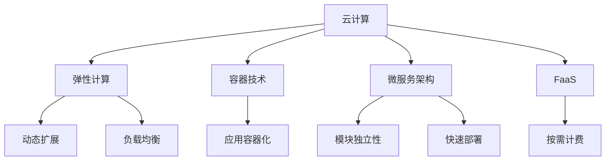

                 

## 1. 背景介绍

### 1.1 问题由来

随着企业数字化转型的不断深入，云计算在企业运营、管理、创新等方面的应用变得越来越广泛。作为推动数字化转型的重要力量，云计算带来的灵活性和可扩展性成为了企业竞争力的关键。然而，云计算在部署和使用过程中面临诸多挑战，如何最大化云计算的价值，已成为企业数字化转型的一项重要课题。

### 1.2 问题核心关键点

云计算的核心优势在于其灵活性和可扩展性，能够在业务需求波动时快速响应，同时具有高度的定制化和灵活配置能力。这一特性使得云计算在企业数字化转型中发挥了重要作用，为企业带来了许多潜在价值。

然而，云计算也存在一些问题，如安全性、数据管理、成本控制等。这些问题需要通过合理的策略和工具来解决，以确保云计算在企业数字化转型中发挥最大的作用。

### 1.3 问题研究意义

研究云计算在企业数字化转型中的作用，有助于企业更好地理解如何利用云计算技术提升运营效率、优化资源配置、加速业务创新。具体来说，可以：

- 提升运营效率：通过云平台实现自动化、自动化运维，降低人力成本，提高工作效率。
- 优化资源配置：灵活配置云资源，根据业务需求动态调整，避免资源浪费。
- 加速业务创新：通过云平台支持的新兴技术，推动业务创新和商业模式变革。
- 数据驱动决策：利用云平台的分析能力，进行大数据分析和洞察，辅助决策。
- 增强安全性：通过云平台提供的安全服务，提升数据和应用的安全性。

## 2. 核心概念与联系

### 2.1 核心概念概述

为更好地理解云计算在企业数字化转型中的作用，本节将介绍几个关键概念：

- 云计算(Cloud Computing)：基于互联网的计算模式，提供按需资源、快速扩展、弹性配置的服务。
- 弹性计算(Elastic Computing)：云计算的核心特性，根据业务需求动态调整计算资源，支持负载均衡和自动扩展。
- 容器技术(Container Technology)：一种轻量级虚拟化技术，支持应用容器化，实现快速部署和横向扩展。
- 微服务架构(Microservices Architecture)：将应用拆分成多个小服务，独立部署和扩展，提升系统可维护性和灵活性。
- 函数即服务(FaaS)：云平台提供的无服务器计算服务，按需计费，无需管理底层基础设施。

这些概念之间的逻辑关系可以通过以下Mermaid流程图来展示：



这个流程图展示了云计算与相关技术的联系：

1. 云计算通过弹性计算、容器技术、微服务架构等支撑其灵活性和可扩展性。
2. 容器技术使应用部署更加轻量级，微服务架构增强了系统的模块独立性和可维护性。
3. 弹性计算实现资源的动态扩展和负载均衡，FaaS提供按需计费的服务，进一步降低了部署成本。

这些概念共同构成了云计算的核心框架，帮助企业更好地理解和应用云计算技术。

## 3. 核心算法原理 & 具体操作步骤
### 3.1 算法原理概述

云计算的核心算法原理主要集中在资源分配和调度上，通过自动化、动态化的算法，确保资源的合理利用和高效使用。其核心思想是：

1. **需求预测**：通过分析业务流量数据，预测未来一段时间内的需求变化，提前进行资源调整。
2. **资源分配**：根据需求预测结果，动态分配计算资源，确保在高负载时能快速扩展，低负载时节约成本。
3. **负载均衡**：将业务流量均匀分布在多个节点上，避免单点故障和资源浪费。
4. **优化算法**：使用各种优化算法，如遗传算法、模拟退火等，在保证性能的同时，优化资源配置。

这些算法在云平台中得到广泛应用，是云计算能够灵活调度和可扩展的基础。

### 3.2 算法步骤详解

云计算平台的核心算法步骤通常包括以下几个关键环节：

1. **数据采集与分析**：采集业务流量数据，进行统计分析和预测，了解资源使用情况。
2. **资源规划与分配**：根据预测结果，规划资源配置，动态分配计算资源。
3. **负载均衡与调度**：将业务流量均衡分布在各个节点上，确保系统稳定运行。
4. **性能监控与优化**：实时监控系统性能，根据负载和资源使用情况，进行动态调整和优化。

以AWS云平台为例，其核心算法步骤主要包括以下几个关键环节：

1. **Auto Scaling**：根据预测需求，动态调整计算资源。
2. **Load Balancer**：将流量均衡分布在多个节点上，防止单点故障。
3. **CloudWatch**：实时监控系统性能，自动触发报警和自动调整。
4. **Elastic Beanstalk**：支持自动部署和管理，确保应用快速上线。

### 3.3 算法优缺点

云计算平台的算法具有以下优点：

1. **灵活性高**：能够根据需求动态调整资源，快速响应业务变化。
2. **可扩展性强**：支持横向扩展和自动扩展，避免资源浪费。
3. **自动化高**：通过自动化管理，减少人工干预，提高运维效率。
4. **成本效益**：按需计费模式，灵活管理资源，避免闲置资源浪费。

然而，云计算平台也存在一些局限性：

1. **安全性问题**：需要依赖云平台的安全机制，存在潜在风险。
2. **复杂性高**：需要管理复杂的配置和依赖关系，需要较高的技术门槛。
3. **延迟问题**：云平台之间的数据传输和计算可能会引入延迟。
4. **数据管理难度大**：多租户环境下的数据隔离和隐私保护问题复杂。

### 3.4 算法应用领域

云计算平台的算法在多个领域得到了广泛应用，具体包括：

- **金融行业**：在金融交易、风险控制、客户服务等方面，云计算提供了高效、稳定的计算和存储能力。
- **零售行业**：在电商、供应链管理、库存控制等方面，云计算支持实时计算和大数据分析，提升了运营效率。
- **医疗行业**：在电子病历、医学影像分析、远程医疗等方面，云计算提供了强大的数据处理和存储能力。
- **教育行业**：在在线教育、教学资源管理、学生管理等方面，云计算支持大数据分析和个性化教学。
- **物流行业**：在货物跟踪、配送路径规划、仓储管理等方面，云计算提供了实时数据处理和分析能力。

此外，云计算平台的算法还在政府、能源、制造等行业得到了广泛应用，为企业数字化转型提供了坚实的基础。

## 4. 数学模型和公式 & 详细讲解 & 举例说明

### 4.1 数学模型构建

假设一个典型的云计算场景，业务流量 $F(t)$ 在时间 $t$ 内的变化符合泊松分布，服务器的响应时间为 $R(t)$，服务器的处理能力为 $C(t)$。根据这些假设，我们可以构建一个基本的数学模型来描述云计算系统的工作流程。

设 $\lambda$ 为单位时间内的请求率，则 $F(t)$ 的概率密度函数为：

$$
P(F(t)) = \frac{\lambda e^{-\lambda t}}{t!} 
$$

其中 $e$ 为自然常数。

假设服务器响应时间为 $R(t)$，服从指数分布，则其概率密度函数为：

$$
P(R(t)) = \frac{1}{R_0} e^{-\frac{t}{R_0}}
$$

其中 $R_0$ 为平均响应时间。

设服务器的处理能力为 $C(t)$，服从线性模型，则有：

$$
C(t) = C_0 + k t
$$

其中 $C_0$ 为初始处理能力，$k$ 为每单位时间内的处理能力提升。

根据以上模型，可以计算出系统的吞吐量 $S(t)$，即单位时间内处理的请求数：

$$
S(t) = \frac{F(t)}{R(t)}
$$

系统负载 $L(t)$ 可以表示为：

$$
L(t) = \frac{S(t)}{C(t)}
$$

### 4.2 公式推导过程

根据以上模型，可以推导出系统的吞吐量和负载的公式。假设 $F(t)$ 和 $R(t)$ 的联合分布为 $P(F(t), R(t))$，则系统的吞吐量为：

$$
S(t) = \int_0^t \int_0^{\infty} F(s) P(F(s), R(t-s)) ds dr
$$

根据泊松分布和指数分布的性质，可以将上述公式进一步简化为：

$$
S(t) = \frac{\lambda}{R_0} \int_0^t e^{-\frac{t-s}{R_0}} (1-e^{-\lambda s}) ds
$$

通过对上述公式进行积分和求解，可以计算出系统的吞吐量 $S(t)$ 的表达式：

$$
S(t) = \frac{\lambda R_0}{1 + (R_0/\lambda)} e^{-\lambda t}
$$

通过上述公式，可以计算出在不同时间 $t$ 下的系统吞吐量。同时，根据 $S(t)$ 和 $C(t)$ 的关系，可以进一步计算出系统的负载 $L(t)$。

### 4.3 案例分析与讲解

以AWS的Auto Scaling为例，其核心算法主要包括以下几个关键环节：

1. **触发条件**：根据预测的业务流量和当前资源使用情况，判断是否需要自动扩展或缩减资源。
2. **扩展策略**：根据业务负载和资源使用情况，决定如何扩展资源，如增加实例数量或调整实例类型。
3. **缩减策略**：在业务负载下降时，决定如何缩减资源，如减少实例数量或调整实例类型。

AWS的Auto Scaling算法使用了一个预测模型来评估业务流量，并根据预测结果动态调整计算资源。具体来说，AWS的预测模型使用机器学习算法，基于历史流量数据训练得到，能够预测未来一段时间内的业务流量变化。根据预测结果，AWS的Auto Scaling算法可以自动调整实例数量和类型，以适应不同的业务需求。

## 5. 项目实践：代码实例和详细解释说明

### 5.1 开发环境搭建

在进行云计算平台开发前，需要先搭建好开发环境。以下是使用Python进行AWS云平台开发的环境配置流程：

1. 安装AWS CLI：
```bash
pip install awscli
```

2. 配置AWS CLI：
```bash
aws configure
```

3. 安装Boto3：
```bash
pip install boto3
```

4. 安装Jupyter Notebook：
```bash
pip install jupyter
```

完成上述步骤后，即可在AWS云平台上进行开发。

### 5.2 源代码详细实现

下面以AWS的Auto Scaling为例，给出使用Python实现自动扩展的代码实现。

首先，定义Auto Scaling的API接口：

```python
from boto3.session import Session
from boto3.client import client

session = Session()
client = client('autoscaling', region_name='us-west-2')

def create_auto_scaling_group(name, min_size, max_size, target_cpu_utilization):
    response = client.create_auto_scaling_group(
        AutoScalingGroupName=name,
        MinSize=min_size,
        MaxSize=max_size,
        DesiredCapacity=0,
        AutoScalingPolicy={
            'PolicyName': 'TargetCPUUtilizationPolicy',
            'PolicyType': 'TargetTrackingScaling',
            'TargetTrackingScalingPolicyConfiguration': {
                'TargetValue': target_cpu_utilization,
                'PredefinedMetricSpecification': {
                    'Metric': {
                        'Name': 'CPUUtilization',
                        'Namespace': 'AWS/EC2',
                        'Dimensions': [
                            {
                                'Name': 'InstanceType',
                                'Value': 't2.micro'
                            }
                        ]
                    }
                }
            }
        }
    )
    print(response)
```

然后，调用API创建Auto Scaling Group：

```python
name = 'MyAutoScalingGroup'
min_size = 1
max_size = 10
target_cpu_utilization = 70

create_auto_scaling_group(name, min_size, max_size, target_cpu_utilization)
```

最后，启动Auto Scaling Group，并在Jupyter Notebook中查看效果：

```python
client.start_auto_scaling_group(
    AutoScalingGroupName='MyAutoScalingGroup'
)
```

以上就是使用Python实现AWS Auto Scaling的代码实现。可以看到，AWS的Auto Scaling算法通过API接口，实现了自动化、动态化的资源管理。

### 5.3 代码解读与分析

**create_auto_scaling_group函数**：
- 定义了创建Auto Scaling Group的函数，接收名字、最小实例数、最大实例数和目标CPU利用率等参数。
- 通过AWS CLI创建Auto Scaling Group，并返回API响应。

**AWS CLI配置**：
- 使用`aws configure`命令配置AWS CLI，输入Access Key ID、Secret Access Key、Region等基本信息。

**Auto Scaling API调用**：
- 使用`boto3.client()`方法创建Auto Scaling API客户端。
- 调用`create_auto_scaling_group()`函数创建Auto Scaling Group，指定实例类型、最小和最大实例数、目标CPU利用率等参数。

**Auto Scaling Group启动**：
- 使用`start_auto_scaling_group()`函数启动Auto Scaling Group，根据当前CPU利用率动态调整实例数量。

可以看到，AWS的Auto Scaling算法通过Python API和AWS CLI的配置，实现了自动化、动态化的资源管理，能够根据业务需求快速扩展或缩减资源。

## 6. 实际应用场景

### 6.1 企业内部应用

云计算在企业内部应用广泛，如企业资源规划(ERP)、客户关系管理(CRM)、人力资源管理(HRM)等。通过云计算平台，企业可以实现跨部门的数据共享和协同工作，提高运营效率和业务响应速度。

例如，在ERP系统中，可以使用AWS的S3、DynamoDB等云服务存储和管理数据，通过AWS Lambda函数处理数据计算和分析任务，使用AWS Auto Scaling自动管理计算资源，确保系统的稳定性和高效性。

### 6.2 云计算平台服务

云计算平台也提供了许多云服务，如AWS的Elastic Compute Cloud (EC2)、Amazon S3、Amazon DynamoDB等，帮助企业快速搭建和管理基础设施。

例如，AWS的EC2服务可以为企业提供弹性的计算资源，支持容器化应用部署和微服务架构，帮助企业快速构建和扩展应用系统。

### 6.3 数据驱动决策

云计算平台的数据分析和AI服务，如AWS的Athena、Amazon SageMaker等，可以帮助企业进行大数据分析和机器学习建模，提升决策的科学性和准确性。

例如，通过AWS Athena和SageMaker，企业可以构建数据仓库和机器学习模型，进行实时数据处理和分析，辅助决策制定，优化资源配置，提升业务效率。

### 6.4 未来应用展望

未来，云计算在企业数字化转型中的作用将更加显著，具体包括以下几个方面：

1. **多云协同**：企业将越来越多地使用多云环境，通过云平台提供的跨云服务和应用，实现资源和服务的灵活调配和协同。
2. **微服务集成**：云计算平台将支持更多的微服务架构，提高系统的模块独立性和可维护性。
3. **自动化运维**：通过自动化工具和脚本，实现云计算平台的自动化运维，减少人工干预，提高运维效率。
4. **边缘计算**：云计算平台将支持边缘计算服务，将计算任务部署到离用户更近的节点上，降低延迟，提升用户体验。
5. **区块链集成**：云计算平台将支持区块链技术，帮助企业构建更加安全、透明、可追溯的业务系统。

## 7. 工具和资源推荐

### 7.1 学习资源推荐

为了帮助开发者系统掌握云计算技术，以下是一些优质的学习资源：

1. AWS官方文档：提供了详细的AWS服务介绍和API文档，是学习AWS云平台的最佳资源。
2. Microsoft Azure文档：提供了Azure云平台的服务介绍和API文档，是学习Azure云平台的最佳资源。
3. Google Cloud文档：提供了Google Cloud平台的服务介绍和API文档，是学习Google Cloud云平台的最佳资源。
4.《云计算概论》课程：多所大学开设的云计算课程，系统讲解云计算的基本概念和核心技术。
5.《云计算实战》书籍：介绍了云计算平台的使用方法和最佳实践，帮助读者实战应用。

通过对这些资源的学习实践，相信你一定能够快速掌握云计算技术，并用于解决实际的业务问题。

### 7.2 开发工具推荐

高效的工具是云计算开发的重要保障，以下是几款常用的云计算开发工具：

1. AWS CLI：提供命令行工具，方便开发者通过脚本自动化管理云资源。
2. Boto3：提供了Python的AWS SDK，方便开发者使用Python语言调用AWS云服务。
3. Terraform：提供了跨云资源管理工具，方便开发者快速搭建和管理云基础设施。
4. Docker：提供了容器化应用部署工具，方便开发者构建和管理容器化应用。
5. Kubernetes：提供了容器编排工具，方便开发者管理容器化应用的部署和扩展。

合理利用这些工具，可以显著提升云计算平台的开发效率，加快创新迭代的步伐。

### 7.3 相关论文推荐

云计算领域的研究十分活跃，以下是几篇具有代表性的相关论文，推荐阅读：

1. Google Cloud Platform: Architecture and Evolution: Google Cloud Platform是一个由Google提供的云服务平台，其架构和演变过程展示了云计算平台的发展轨迹。
2. Amazon Web Services: Architecture Overview: 亚马逊云服务平台（AWS）的架构概述，展示了AWS云平台的核心技术和设计理念。
3. Microsoft Azure: Architecture Overview: 微软云服务平台（Azure）的架构概述，展示了Azure云平台的核心技术和设计理念。
4. Elastic Compute Cloud (EC2) Architecture: AWS的EC2服务架构，展示了EC2服务的核心技术和设计理念。
5. Machine Learning on AWS: 在AWS上进行机器学习的架构和技术介绍，展示了AWS云平台支持机器学习的能力。

这些论文代表了大规模云计算平台的发展脉络，通过学习这些前沿成果，可以帮助研究者把握学科前进方向，激发更多的创新灵感。

## 8. 总结：未来发展趋势与挑战

### 8.1 总结

本文对云计算在企业数字化转型中的作用进行了全面系统的介绍。首先阐述了云计算的核心优势和应用场景，明确了云计算在提升运营效率、优化资源配置、加速业务创新等方面的价值。其次，从原理到实践，详细讲解了云计算的核心算法和具体操作步骤，给出了云计算平台开发的完整代码实例。同时，本文还广泛探讨了云计算在企业数字化转型中的实际应用，展示了云计算平台巨大的潜力和前景。此外，本文精选了云计算技术的各类学习资源，力求为读者提供全方位的技术指引。

通过本文的系统梳理，可以看到，云计算在企业数字化转型中发挥了不可替代的作用，极大地提升了企业的运营效率和业务响应速度。未来，伴随云计算技术的不断演进，云计算平台必将在更多的行业和领域得到应用，推动数字化转型的进程。

### 8.2 未来发展趋势

展望未来，云计算在企业数字化转型中的作用将更加显著，具体包括以下几个方面：

1. **多云协同**：企业将越来越多地使用多云环境，通过云平台提供的跨云服务和应用，实现资源和服务的灵活调配和协同。
2. **微服务集成**：云计算平台将支持更多的微服务架构，提高系统的模块独立性和可维护性。
3. **自动化运维**：通过自动化工具和脚本，实现云计算平台的自动化运维，减少人工干预，提高运维效率。
4. **边缘计算**：云计算平台将支持边缘计算服务，将计算任务部署到离用户更近的节点上，降低延迟，提升用户体验。
5. **区块链集成**：云计算平台将支持区块链技术，帮助企业构建更加安全、透明、可追溯的业务系统。

这些趋势凸显了云计算技术在企业数字化转型中的广阔前景，通过这些方向的探索发展，必将进一步提升云计算平台的性能和应用范围，为数字化转型的实现提供坚实的基础。

### 8.3 面临的挑战

尽管云计算技术在企业数字化转型中发挥了重要作用，但在迈向更加智能化、普适化应用的过程中，它仍面临诸多挑战：

1. **安全性问题**：需要依赖云平台的安全机制，存在潜在风险。
2. **数据管理难度大**：多租户环境下的数据隔离和隐私保护问题复杂。
3. **成本控制困难**：需要灵活管理资源，避免资源浪费。
4. **技术门槛高**：需要管理复杂的配置和依赖关系，需要较高的技术门槛。
5. **延迟问题**：云平台之间的数据传输和计算可能会引入延迟。

这些挑战需要通过合理的策略和工具来解决，才能最大化云计算的价值。

### 8.4 研究展望

未来的云计算研究需要关注以下几个方向：

1. **安全性研究**：研究如何增强云平台的安全机制，避免数据泄露和滥用。
2. **数据管理技术**：研究如何实现多租户环境下的数据隔离和隐私保护。
3. **成本优化策略**：研究如何灵活管理云资源，降低云平台的使用成本。
4. **自动化工具**：研究如何开发更强大的自动化工具，提高云平台的运维效率。
5. **边缘计算技术**：研究如何优化边缘计算服务，提升用户体验。

这些研究方向将推动云计算技术的不断演进，帮助企业更好地应对数字化转型的挑战，实现更高的业务价值。

## 9. 附录：常见问题与解答

**Q1：什么是云计算？**

A: 云计算是基于互联网的计算模式，提供按需资源、快速扩展、弹性配置的服务。

**Q2：云计算有哪些主要服务？**

A: 云计算平台通常提供以下几种主要服务：

1. **基础设施即服务(IaaS)**：提供计算、存储和网络等基础设施。
2. **平台即服务(PaaS)**：提供应用开发和部署所需的平台和工具。
3. **软件即服务(SaaS)**：提供应用软件的即用即服务。

**Q3：云计算的核心优势是什么？**

A: 云计算的核心优势在于其灵活性和可扩展性，能够在业务需求波动时快速响应，同时具有高度的定制化和灵活配置能力。

**Q4：云计算平台有哪些应用场景？**

A: 云计算平台在企业数字化转型中的应用场景包括：

1. **ERP系统**：企业资源规划系统，通过云计算平台实现跨部门的数据共享和协同工作。
2. **CRM系统**：客户关系管理系统，通过云计算平台实现客户管理和营销自动化。
3. **HRM系统**：人力资源管理系统，通过云计算平台实现员工管理和薪酬管理。
4. **数据驱动决策**：通过云计算平台进行大数据分析和机器学习建模，辅助决策制定。

通过本文的系统梳理，可以看到，云计算在企业数字化转型中发挥了不可替代的作用，极大地提升了企业的运营效率和业务响应速度。未来，伴随云计算技术的不断演进，云计算平台必将在更多的行业和领域得到应用，推动数字化转型的进程。

