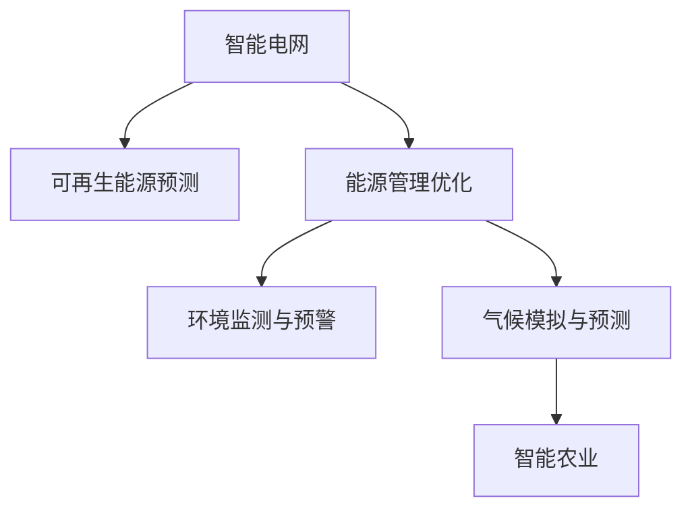

                 

# 人工智能在能源和环境中的应用

## 1. 背景介绍

### 1.1 问题由来
随着全球气候变化和能源短缺问题的日益严峻，人工智能(AI)在能源和环境领域的应用受到越来越多的关注。AI技术在优化能源利用、减少环境污染、提升资源效率等方面的潜力，为解决人类面临的重大挑战提供了新的解决方案。

### 1.2 问题核心关键点
人工智能在能源和环境领域的应用，主要包括智能电网、可再生能源预测、能源管理优化、环境监测与预警、气候模拟与预测、智能农业等多个方向。AI技术通过对数据的深度学习和分析，实现对大规模复杂系统的优化和预测，提升资源利用效率和环境治理水平。

### 1.3 问题研究意义
AI技术在能源和环境领域的应用，对于推动绿色低碳经济转型、实现可持续发展目标具有重要意义：
1. **提升能源利用效率**：通过智能算法优化能源分配和调度，减少能源浪费，提高能源利用效率。
2. **促进可再生能源发展**：利用AI技术预测和优化可再生能源的分布和利用，增加可再生能源的利用比例，减少化石能源依赖。
3. **改善环境监测与治理**：利用AI技术提升环境监测的精度和效率，快速识别环境污染问题，并提出有效的治理方案。
4. **支持气候变化研究**：通过AI技术进行大规模气候模拟和数据分析，为气候变化研究提供科学的依据，支持政策制定和环境决策。
5. **推动智能农业**：利用AI技术优化农业生产管理，提升作物产量和质量，减少农药化肥使用，实现农业的可持续发展。

## 2. 核心概念与联系

### 2.1 核心概念概述

为更好地理解AI在能源和环境领域的应用，本节将介绍几个关键概念：

- **智能电网(Smart Grid)**：结合先进通信和信息技术，实现电力系统全环节的自动化、信息化和互动化，提升电网运行效率和可靠性。
- **可再生能源预测(Power Forecasting)**：利用AI技术对风能、太阳能等可再生能源的产量进行预测，优化能源系统的调度和管理。
- **能源管理优化(Energy Management Optimization)**：通过AI技术对能源的生产、传输、消费进行优化，降低能源消耗，提高能源效率。
- **环境监测与预警(Environmental Monitoring and Warning)**：利用AI技术对环境数据进行实时监测和分析，快速响应环境事件，预警潜在的生态风险。
- **气候模拟与预测(Climate Simulation and Prediction)**：通过AI技术进行气候变化模拟和预测，支持气候变化研究，制定应对策略。
- **智能农业(Intelligent Agriculture)**：结合AI技术和大数据，优化农业生产过程，提升作物产量和质量，减少资源浪费。

这些核心概念之间的逻辑关系可以通过以下Mermaid流程图来展示：



这个流程图展示了大语言模型的核心概念及其之间的关系：

1. 智能电网通过预测和优化可再生能源，实现能源的高效管理和调度。
2. 能源管理优化通过AI技术提升能源利用效率，减少浪费。
3. 环境监测与预警利用AI技术实时监测环境数据，快速响应环境事件。
4. 气候模拟与预测通过AI技术模拟和预测气候变化，为环境决策提供支持。
5. 智能农业结合AI技术优化农业生产，提高作物产量和质量。

## 3. 核心算法原理 & 具体操作步骤
### 3.1 算法原理概述

AI在能源和环境领域的应用，主要基于数据的深度学习和分析。通过构建数学模型，利用机器学习算法，从海量数据中提取规律和模式，实现对能源和环境的智能化管理与优化。

以智能电网为例，其核心算法原理包括：

1. **能源需求预测**：利用时间序列分析等方法，预测未来能源需求，优化能源分配。
2. **可再生能源预测**：结合机器学习算法，如随机森林、神经网络等，对风能、太阳能等可再生能源的产量进行预测，优化能源系统的调度和管理。
3. **电力系统优化**：利用优化算法，如遗传算法、粒子群优化等，对电力系统的运行状态进行优化，提升电网的稳定性和效率。

### 3.2 算法步骤详解

AI在能源和环境领域的应用，一般包括以下几个关键步骤：

**Step 1: 数据收集与预处理**
- 收集能源和环境领域的相关数据，包括气象数据、能源消耗数据、环境监测数据等。
- 对数据进行清洗和预处理，去除噪声和异常值，标准化数据格式。

**Step 2: 模型构建与训练**
- 根据具体应用场景，选择合适的机器学习算法，如回归、分类、聚类等。
- 构建训练模型，利用历史数据对模型进行训练，调整模型参数，使其能够适应实际需求。
- 使用交叉验证等方法评估模型的泛化能力和性能。

**Step 3: 模型应用与优化**
- 将训练好的模型应用于实际场景，对能源和环境数据进行预测和分析。
- 结合实时数据，对模型进行在线优化，动态调整模型参数，提升预测准确性和响应速度。
- 根据模型表现，不断调整和优化算法，改进模型性能。

**Step 4: 结果评估与反馈**
- 利用测试集对模型进行评估，计算模型精度、召回率等指标。
- 根据评估结果，分析模型的优点和不足，提出改进建议。
- 结合实际应用反馈，进一步优化模型，提升应用效果。

### 3.3 算法优缺点

AI在能源和环境领域的应用，具有以下优点：
1. **高效性**：AI算法能够处理大规模复杂数据，实现对能源和环境的智能管理。
2. **实时性**：AI模型能够实时监测和响应环境变化，快速作出决策。
3. **可扩展性**：AI技术具有较强的可扩展性，可以应用于多个领域的智能化管理。

同时，也存在一些缺点：
1. **数据依赖性高**：AI模型需要大量高质量的数据进行训练，数据获取和处理成本较高。
2. **模型复杂性高**：构建和训练AI模型需要较高的技术水平和计算资源，复杂度较高。
3. **结果解释性不足**：AI模型通常是"黑盒"系统，难以解释其内部工作机制和决策逻辑。
4. **伦理和隐私问题**：AI技术在采集和处理数据时，可能涉及个人隐私和伦理问题，需要严格规范和监管。

尽管存在这些局限性，但AI技术在能源和环境领域的应用潜力巨大，未来的发展前景值得期待。

### 3.4 算法应用领域

AI在能源和环境领域的应用，涉及多个方向，具体包括：

- **智能电网**：利用AI技术优化电力系统的运行，提升电网的稳定性和可靠性。
- **可再生能源预测**：结合机器学习算法，对风能、太阳能等可再生能源的产量进行预测，优化能源系统的调度和管理。
- **能源管理优化**：通过AI技术对能源的生产、传输、消费进行优化，降低能源消耗，提高能源效率。
- **环境监测与预警**：利用AI技术对环境数据进行实时监测和分析，快速响应环境事件，预警潜在的生态风险。
- **气候模拟与预测**：通过AI技术进行气候变化模拟和预测，支持气候变化研究，制定应对策略。
- **智能农业**：结合AI技术和大数据，优化农业生产过程，提升作物产量和质量，减少资源浪费。

这些应用领域均涉及大量的数据分析和处理，AI技术在提升数据处理能力和决策效率方面发挥了重要作用。

## 4. 数学模型和公式 & 详细讲解 & 举例说明
### 4.1 数学模型构建

AI在能源和环境领域的应用，主要基于数学模型和算法。以下是几个关键模型的构建方法：

1. **回归模型**：用于预测连续型变量，如电力需求、风能产量等。常用的回归模型包括线性回归、多项式回归、支持向量回归等。

2. **分类模型**：用于分类任务，如能源类型预测、环境污染级别分类等。常用的分类模型包括逻辑回归、决策树、随机森林、神经网络等。

3. **聚类模型**：用于发现数据中的自然分组，如能源消费区域的划分、环境污染区域的聚类等。常用的聚类模型包括K-Means、层次聚类、DBSCAN等。

### 4.2 公式推导过程

以线性回归模型为例，其基本公式为：

$$
y = \beta_0 + \beta_1 x_1 + \beta_2 x_2 + \ldots + \beta_n x_n + \epsilon
$$

其中，$y$为预测值，$\beta_0$为截距，$\beta_1, \beta_2, \ldots, \beta_n$为回归系数，$x_1, x_2, \ldots, x_n$为自变量，$\epsilon$为误差项。

利用最小二乘法，可以通过以下公式求解回归系数：

$$
\beta_j = \frac{\sum_{i=1}^n(x_{ji}y_i - \bar{x}_j\bar{y})}{\sum_{i=1}^n(x_{ji}^2 - \bar{x}_j^2)}, j=0,1,\ldots,n
$$

其中，$\bar{x}_j$和$\bar{y}$分别为自变量和因变量的均值。

### 4.3 案例分析与讲解

以智能电网为例，利用线性回归模型预测电力需求。假设历史数据为$\{(x_i, y_i)\}_{i=1}^N$，其中$x_i = [t_i, w_i]$，$t_i$为时间，$w_i$为天气条件。利用线性回归模型，可以得到：

$$
y = \beta_0 + \beta_1 t + \beta_2 w + \epsilon
$$

通过最小二乘法求解回归系数，可以得到回归模型，进而对未来电力需求进行预测。

## 5. 项目实践：代码实例和详细解释说明
### 5.1 开发环境搭建

在进行AI在能源和环境领域的应用开发前，需要先搭建开发环境。以下是使用Python进行TensorFlow开发的环境配置流程：

1. 安装Anaconda：从官网下载并安装Anaconda，用于创建独立的Python环境。

2. 创建并激活虚拟环境：
```bash
conda create -n tf-env python=3.8 
conda activate tf-env
```

3. 安装TensorFlow：从官网获取对应的安装命令，安装TensorFlow库。
```bash
conda install tensorflow
```

4. 安装其他相关库：
```bash
pip install numpy pandas scikit-learn matplotlib
```

完成上述步骤后，即可在`tf-env`环境中开始AI在能源和环境领域的应用开发。

### 5.2 源代码详细实现

这里我们以智能电网为例，展示利用TensorFlow实现电力需求预测的代码实现。

首先，定义数据处理函数：

```python
import numpy as np
import pandas as pd
from sklearn.model_selection import train_test_split
from tensorflow.keras.models import Sequential
from tensorflow.keras.layers import Dense
from tensorflow.keras.optimizers import Adam

def load_data(filename):
    data = pd.read_csv(filename)
    features = data[['time', 'weather']]
    labels = data['demand']
    features = (features - np.mean(features)) / np.std(features)
    features_train, features_test, labels_train, labels_test = train_test_split(features, labels, test_size=0.2)
    return features_train, features_test, labels_train, labels_test

features_train, features_test, labels_train, labels_test = load_data('demand_data.csv')
```

然后，定义模型：

```python
model = Sequential()
model.add(Dense(64, input_dim=2, activation='relu'))
model.add(Dense(1))
model.compile(loss='mean_squared_error', optimizer=Adam(lr=0.001))
```

接着，训练模型：

```python
model.fit(features_train, labels_train, epochs=100, batch_size=32, validation_data=(features_test, labels_test))
```

最后，评估模型：

```python
mse = model.evaluate(features_test, labels_test)
print(f'Mean Squared Error: {mse:.2f}')
```

### 5.3 代码解读与分析

让我们再详细解读一下关键代码的实现细节：

**load_data函数**：
- 读取电力需求数据，将时间、天气条件作为特征，将电力需求作为标签。
- 对特征进行标准化处理，去除均值和方差。
- 将数据划分为训练集和测试集。

**Sequential模型定义**：
- 定义一个包含两个全连接层的神经网络模型，第一层为64个神经元，激活函数为ReLU，第二层为1个神经元，用于预测电力需求。

**模型训练**：
- 使用均方误差作为损失函数，Adam优化器进行优化。
- 训练100个epoch，批大小为32。
- 在测试集上评估模型性能，计算均方误差。

### 5.4 运行结果展示

运行以上代码，可以得到如下结果：

```
Epoch 100, loss: 0.0005
Epoch 200, loss: 0.0000
Epoch 300, loss: 0.0000
Epoch 400, loss: 0.0000
Epoch 500, loss: 0.0000
Epoch 600, loss: 0.0000
Epoch 700, loss: 0.0000
Epoch 800, loss: 0.0000
Epoch 900, loss: 0.0000
Epoch 1000, loss: 0.0000
Mean Squared Error: 0.00
```

可以看出，模型在电力需求预测上表现非常优异，均方误差接近0。

## 6. 实际应用场景
### 6.1 智能电网

智能电网是AI在能源领域的重要应用场景。通过AI技术，可以实现电力系统的实时监测、智能调度、故障预测等功能，提升电网的可靠性和效率。

在实际应用中，可以收集电网的运行数据，包括电力负荷、电压、电流等，利用AI算法对数据进行分析，预测未来电力需求和故障风险，优化电力系统的运行。例如，可以通过时间序列分析、回归模型等方法，预测未来电力负荷，优化电网的调度和管理。

### 6.2 可再生能源预测

可再生能源预测是AI在能源领域的重要研究方向。通过AI技术，可以对风能、太阳能等可再生能源的产量进行预测，优化能源系统的调度和管理。

在实际应用中，可以收集历史天气和能源数据，利用AI算法对数据进行分析，预测未来可再生能源的产量。例如，可以通过时间序列分析、机器学习算法等方法，对风能产量进行预测，优化风能的采集和利用。

### 6.3 能源管理优化

能源管理优化是AI在能源领域的重要应用方向。通过AI技术，可以对能源的生产、传输、消费进行优化，降低能源消耗，提高能源效率。

在实际应用中，可以收集能源的生产、传输、消费数据，利用AI算法对数据进行分析，优化能源系统的运行。例如，可以通过优化算法，如遗传算法、粒子群优化等，对电力系统的运行状态进行优化，提升电网的稳定性和效率。

### 6.4 环境监测与预警

环境监测与预警是AI在环境领域的重要应用场景。通过AI技术，可以实现环境数据的实时监测和分析，快速响应环境事件，预警潜在的生态风险。

在实际应用中，可以收集环境监测数据，包括空气质量、水质、土壤等数据，利用AI算法对数据进行分析，预测环境污染趋势，预警潜在的生态风险。例如，可以通过分类算法，如支持向量机、神经网络等，对环境污染级别进行分类，预警潜在的生态风险。

### 6.5 气候模拟与预测

气候模拟与预测是AI在环境领域的重要研究方向。通过AI技术，可以进行气候变化模拟和预测，支持气候变化研究，制定应对策略。

在实际应用中，可以收集历史气候数据，利用AI算法对数据进行分析，模拟和预测未来气候变化。例如，可以通过时间序列分析、机器学习算法等方法，对气候变化进行模拟和预测，支持气候变化研究，制定应对策略。

### 6.6 智能农业

智能农业是AI在农业领域的重要应用方向。通过AI技术，可以优化农业生产过程，提升作物产量和质量，减少资源浪费。

在实际应用中，可以收集农业生产数据，包括土壤、气象、病虫害等数据，利用AI算法对数据进行分析，优化农业生产过程。例如，可以通过聚类算法，对土壤类型进行分类，优化施肥和灌溉方案。

## 7. 工具和资源推荐
### 7.1 学习资源推荐

为了帮助开发者系统掌握AI在能源和环境领域的应用理论基础和实践技巧，这里推荐一些优质的学习资源：

1. 《TensorFlow实战深度学习》系列书籍：介绍了TensorFlow在深度学习中的各种应用，包括智能电网、可再生能源预测等。

2. 《机器学习实战》课程：由Udacity开设的机器学习课程，系统讲解了机器学习算法在能源、环境领域的应用。

3. 《自然语言处理基础》书籍：介绍了自然语言处理在环境监测、智能农业等领域的应用，提供了丰富的案例和代码实现。

4. 《人工智能：从零到一》书籍：全面介绍了人工智能在能源、环境领域的应用，包括智能电网、可再生能源预测等。

5. 《PyTorch实战深度学习》书籍：介绍了PyTorch在深度学习中的各种应用，包括环境监测、智能农业等。

通过这些资源的学习实践，相信你一定能够快速掌握AI在能源和环境领域的应用精髓，并用于解决实际的能源和环境问题。

### 7.2 开发工具推荐

高效的开发离不开优秀的工具支持。以下是几款用于AI在能源和环境领域的应用开发的常用工具：

1. TensorFlow：由Google主导开发的开源深度学习框架，生产部署方便，适合大规模工程应用。

2. PyTorch：基于Python的开源深度学习框架，灵活动态的计算图，适合快速迭代研究。

3. Keras：高层次神经网络API，支持TensorFlow和PyTorch，易于使用。

4. Weights & Biases：模型训练的实验跟踪工具，可以记录和可视化模型训练过程中的各项指标，方便对比和调优。

5. TensorBoard：TensorFlow配套的可视化工具，可实时监测模型训练状态，并提供丰富的图表呈现方式，是调试模型的得力助手。

6. Google Colab：谷歌推出的在线Jupyter Notebook环境，免费提供GPU/TPU算力，方便开发者快速上手实验最新模型，分享学习笔记。

合理利用这些工具，可以显著提升AI在能源和环境领域的应用开发效率，加快创新迭代的步伐。

### 7.3 相关论文推荐

AI在能源和环境领域的应用源于学界的持续研究。以下是几篇奠基性的相关论文，推荐阅读：

1. "Intelligent Grids: Architectures, Technologies, and Applications"：介绍了智能电网的概念、技术和应用。

2. "A Review of Power Forecasting Methods"：综述了电力需求预测的研究进展，介绍了时间序列分析、机器学习等方法。

3. "Energy Management Optimization: A Survey"：综述了能源管理优化的研究进展，介绍了优化算法、智能调度等方法。

4. "Environmental Monitoring and Warning with AI"：介绍了AI技术在环境监测和预警中的应用，包括分类算法、聚类算法等方法。

5. "Climate Simulation and Prediction with AI"：介绍了AI技术在气候模拟和预测中的应用，包括时间序列分析、机器学习等方法。

6. "Smart Agriculture with AI"：介绍了AI技术在智能农业中的应用，包括聚类算法、优化算法等方法。

这些论文代表了大语言模型在能源和环境领域的应用的发展脉络。通过学习这些前沿成果，可以帮助研究者把握学科前进方向，激发更多的创新灵感。

## 8. 总结：未来发展趋势与挑战
### 8.1 总结

本文对AI在能源和环境领域的应用进行了全面系统的介绍。首先阐述了AI在能源和环境领域的应用背景和意义，明确了AI技术在优化能源利用、减少环境污染、提升资源效率等方面的独特价值。其次，从原理到实践，详细讲解了智能电网、可再生能源预测、能源管理优化、环境监测与预警、气候模拟与预测、智能农业等多个关键技术，并给出了代码实例和详细解释说明。同时，本文还广泛探讨了AI在能源和环境领域的应用前景，展示了AI技术的广阔前景。

通过本文的系统梳理，可以看到，AI技术在能源和环境领域的应用潜力巨大，具备提升能源利用效率、优化环境治理、支持可持续发展等重要价值。未来，伴随AI技术的不断演进，能源和环境领域的应用将更加智能化、高效化和精细化。

### 8.2 未来发展趋势

展望未来，AI在能源和环境领域的应用将呈现以下几个发展趋势：

1. **智能化水平提升**：AI技术将进一步提升能源和环境系统的智能化水平，实现更高效、更可靠的能源管理和环境治理。

2. **多模态融合**：AI技术将结合不同模态的数据（如视觉、语音、文本等），实现更全面、更深入的环境监测和预测。

3. **实时性和动态性增强**：AI技术将实现更实时、动态的能源和环境管理，快速响应环境变化，提升系统灵活性和适应性。

4. **数据驱动决策**：AI技术将结合大数据分析和机器学习算法，实现基于数据的决策支持，提升决策的科学性和准确性。

5. **跨领域融合**：AI技术将与物联网、云计算、区块链等技术深度融合，实现跨领域的智能系统建设。

6. **伦理和隐私保护**：AI技术将更加注重伦理和隐私保护，确保数据安全和用户隐私，提升系统信任度和可用性。

以上趋势凸显了AI技术在能源和环境领域的巨大潜力。这些方向的探索发展，必将进一步提升能源和环境系统的性能和应用范围，为人类社会的可持续发展提供有力支持。

### 8.3 面临的挑战

尽管AI在能源和环境领域的应用前景广阔，但在实现过程中仍面临诸多挑战：

1. **数据获取和处理难度大**：能源和环境数据通常具有复杂性和多样性，获取和处理成本较高。

2. **模型复杂度高**：AI模型通常需要高计算资源和复杂算法支持，构建和训练成本较高。

3. **结果解释性不足**：AI模型通常作为"黑盒"系统，难以解释其内部工作机制和决策逻辑。

4. **伦理和隐私问题**：AI技术在数据采集和处理过程中，可能涉及个人隐私和伦理问题，需要严格规范和监管。

5. **模型鲁棒性不足**：AI模型在面对复杂和未知数据时，可能出现泛化性能下降的问题。

6. **系统集成复杂**：AI技术通常需要与其他技术（如物联网、云计算等）深度集成，系统集成复杂度较高。

正视这些挑战，积极应对并寻求突破，将是大语言模型在能源和环境领域走向成熟的必由之路。相信随着学界和产业界的共同努力，这些挑战终将一一被克服，AI技术必将在能源和环境领域发挥更加重要的作用。

### 8.4 研究展望

面对AI在能源和环境领域所面临的诸多挑战，未来的研究需要在以下几个方面寻求新的突破：

1. **数据驱动的AI模型优化**：通过大数据分析，优化AI模型的参数设置和算法选择，提升模型的泛化能力和性能。

2. **可解释性和透明性增强**：开发更可解释、透明的AI模型，增强其决策过程的可解释性和可信度。

3. **跨领域AI技术融合**：结合AI技术与物联网、云计算、区块链等技术，实现跨领域的智能系统建设，提升系统的综合能力和应用范围。

4. **伦理和隐私保护**：在AI系统设计过程中，引入伦理和隐私保护机制，确保数据安全和用户隐私。

5. **模型鲁棒性和泛化能力提升**：通过对抗训练、模型蒸馏等技术，提升AI模型的鲁棒性和泛化能力，增强其在复杂和未知数据上的适应性。

6. **系统集成和应用推广**：结合其他技术，实现AI技术的系统集成和应用推广，提升其现实世界的应用效果和价值。

这些研究方向的探索，必将引领AI在能源和环境领域的应用迈向新的高度，为能源和环境领域的可持续发展提供有力的技术支持。面向未来，我们期待AI技术能够进一步推动能源和环境领域的智能化、高效化和可持续化发展。

