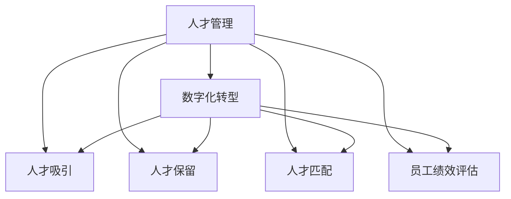

                 

# 人才市场管理：在全球化背景下吸引人才

> 关键词：人才市场管理，全球化，人才吸引，数字化转型，AI技术

## 1. 背景介绍

### 1.1 问题由来

在全球化竞争日益激烈的背景下，企业如何有效管理和吸引人才成为了摆在高层管理者面前的重要课题。人才是企业发展的核心驱动力，能够带来创新、提升效率、增强竞争力。但当前许多企业在人才管理上仍面临诸多挑战：招聘流程冗长、管理模式落后、员工流失率高、培训投入大回报低等。这些问题不仅降低了企业的工作效率，还限制了其在国际市场的竞争力。

近年来，随着技术进步和社会变革，数字化转型成为企业应对挑战的关键路径。数字化转型不仅仅限于IT系统的升级，更涉及到企业文化的变革、组织结构的调整和管理模式的创新。在这一过程中，人才市场管理也亟需转型，通过AI、大数据等新兴技术提升人才吸引和保留能力，推动企业在全球化竞争中占据有利地位。

### 1.2 问题核心关键点

人才市场管理是一个涉及招聘、培训、绩效评估、员工发展等多个环节的复杂系统。数字化转型背景下，如何利用AI和大数据技术优化人才管理流程，提升人才吸引和保留能力，将成为企业发展的关键因素。

核心关键点包括：
1. 建立数字化人才市场平台，提高招聘效率。
2. 利用AI技术优化人才匹配，提升招聘质量。
3. 通过大数据分析预测人才流动趋势，制定精准的人才管理策略。
4. 使用AI技术进行员工绩效评估和职业发展规划，提升员工满意度。
5. 构建全球人才网络，拓宽企业人才来源，提升企业在全球市场的影响力。

本文将从核心概念入手，深入探讨AI技术在人才市场管理中的应用，探讨如何通过数字化转型提升企业的人才吸引和保留能力，推动企业在全球化竞争中保持领先。

## 2. 核心概念与联系

### 2.1 核心概念概述

人才市场管理是一个多维度的管理过程，涉及到招聘、培训、绩效评估、职业发展规划等多个环节。数字化转型背景下的技术应用，尤其是AI和大数据技术，为人才市场管理带来了新的可能性。

以下是几个核心概念：

- **人才管理(People Management)**：通过招聘、培训、绩效评估、职业发展规划等环节，最大化利用人力资源，提升企业核心竞争力。
- **数字化转型(Digital Transformation)**：利用新兴技术（如AI、大数据、云计算等）对企业运营模式进行根本性变革，以应对快速变化的市场环境。
- **人才吸引(Talent Acquisition)**：通过建立品牌、优化招聘流程、提升员工福利等手段，吸引高素质人才加入企业。
- **人才保留(Talent Retention)**：通过培训、晋升、激励等手段，提升员工满意度和忠诚度，减少员工流失率。
- **人才匹配(Talent Matching)**：利用AI技术，通过大数据分析，实现对人才需求的精准匹配，提升招聘效率和质量。
- **员工绩效评估(Employee Performance Assessment)**：通过AI技术分析员工行为和绩效，提供客观、公正的评估结果，帮助员工和团队提升工作效率。

这些概念之间的联系可以通过以下Mermaid流程图来展示：



这个流程图展示了几大核心概念及其在人才市场管理中的应用。通过数字化转型，企业能够更高效地实施人才吸引、保留、匹配和管理策略，从而提升整体的人才管理水平。

## 3. 核心算法原理 & 具体操作步骤
### 3.1 算法原理概述

数字化转型下的人才市场管理，核心在于利用AI和大数据技术优化人才管理流程，提升人才吸引和保留能力。这一过程可以分为以下几个主要步骤：

1. **数据收集和分析**：通过大数据技术收集和分析各类人才数据，如求职者的背景信息、简历数据、职位需求数据、员工行为数据等，为人才匹配、员工绩效评估等提供数据支撑。
2. **AI人才匹配算法**：利用机器学习算法（如协同过滤、深度学习等），根据职位需求和求职者背景进行人才匹配，提升招聘效率和质量。
3. **员工绩效评估模型**：通过自然语言处理（NLP）、时间序列分析等技术，建立员工绩效评估模型，自动生成评估结果，提升评估的客观性和公正性。
4. **人才流失预测模型**：利用大数据分析和机器学习技术，建立人才流失预测模型，预测员工流失风险，制定针对性的留人策略。
5. **员工职业发展规划**：通过学习推荐系统，根据员工技能和职业发展目标，推荐合适的培训和晋升机会，提升员工满意度和忠诚度。

### 3.2 算法步骤详解

以下是基于AI和大数据技术的人才市场管理的详细步骤：

**Step 1: 数据收集和预处理**

1. **数据来源**：
   - 公司内网和外网的招聘信息
   - 求职者的简历数据
   - 公司内部员工的行为数据（如考勤、绩效、培训记录等）
   - 市场招聘数据（如LinkedIn、Indeed等平台的数据）

2. **数据清洗**：
   - 去除重复数据、异常数据
   - 统一数据格式，进行规范化处理

**Step 2: 人才匹配**

1. **特征提取**：
   - 从简历和职位描述中提取关键特征（如技能、经验、学历等）
   - 使用TF-IDF、词向量等技术进行特征向量化

2. **模型训练**：
   - 利用协同过滤、深度学习等算法训练人才匹配模型
   - 根据职位需求和求职者背景进行匹配，推荐合适候选人

3. **推荐结果优化**：
   - 使用召回率和准确率等指标评估模型性能
   - 不断迭代优化模型，提升匹配精度

**Step 3: 员工绩效评估**

1. **数据采集**：
   - 从邮件、会议记录、代码库等渠道采集员工工作数据
   - 对数据进行清洗和预处理

2. **模型构建**：
   - 利用NLP技术提取关键信息（如邮件摘要、会议纪要、代码注释等）
   - 使用时间序列分析、机器学习等技术构建员工绩效评估模型

3. **结果生成和应用**：
   - 根据模型评估结果，生成员工绩效报告
   - 结合360度反馈，制定个性化的绩效改进计划

**Step 4: 人才流失预测**

1. **数据采集**：
   - 采集员工历史行为数据（如离职申请、绩效评估、培训记录等）
   - 收集市场招聘信息，分析潜在竞争对手的人才需求

2. **模型训练**：
   - 利用机器学习算法（如随机森林、梯度提升树等）建立流失预测模型
   - 根据员工行为数据和市场信息，预测流失风险

3. **风险管理**：
   - 根据预测结果，制定个性化的留人策略
   - 定期评估策略效果，持续优化

**Step 5: 员工职业发展规划**

1. **数据采集**：
   - 采集员工的技能、职业发展目标、培训记录等数据
   - 分析内部晋升和外部发展机会

2. **推荐系统构建**：
   - 利用协同过滤、推荐算法等技术构建职业发展规划推荐系统
   - 根据员工技能和职业目标，推荐合适的培训和晋升机会

3. **实施和跟踪**：
   - 将推荐结果反馈给员工，跟踪员工发展效果
   - 根据员工反馈，持续优化推荐系统

### 3.3 算法优缺点

基于AI和大数据技术的人才市场管理，具有以下优点：

1. **提高招聘效率**：利用AI技术，实现人才精准匹配，缩短招聘周期。
2. **提升招聘质量**：通过大数据分析，优化招聘流程，提升匹配精度。
3. **提升员工满意度和忠诚度**：利用AI进行员工绩效评估和职业发展规划，提升员工满意度。
4. **预测流失风险**：利用大数据和机器学习技术，预测员工流失风险，制定精准的留人策略。

但该方法也存在一些缺点：

1. **数据隐私和安全**：数据收集和分析可能涉及敏感信息，如何保护员工隐私，确保数据安全是一个重要问题。
2. **模型复杂度**：AI和大数据技术的应用需要复杂的模型构建和训练过程，对技术和资源要求较高。
3. **依赖高质量数据**：AI模型的效果很大程度上取决于数据的质量，如果数据不完整或存在偏差，模型性能可能受到影响。
4. **模型解释性不足**：AI模型的决策过程往往缺乏可解释性，难以对其推理逻辑进行分析和调试。

### 3.4 算法应用领域

基于AI和大数据技术的人才市场管理，可以广泛应用于以下几个领域：

1. **金融行业**：利用AI技术优化人才招聘流程，提升招聘效率和质量；通过大数据分析，预测员工流失风险，制定留人策略。
2. **制造业**：通过人才匹配算法，提升关键岗位招聘效率；利用员工绩效评估模型，优化员工管理；建立全球人才网络，拓展人才来源。
3. **医疗行业**：利用AI技术优化医疗人才招聘流程；通过大数据分析，预测人才流失风险，制定留人策略；构建全球医疗人才网络。
4. **教育行业**：利用AI技术优化教师招聘流程；通过员工绩效评估模型，提升教师管理；建立全球教育人才网络。
5. **互联网行业**：利用AI技术优化产品经理、工程师等关键岗位的招聘流程；通过员工绩效评估模型，优化员工管理；建立全球互联网人才网络。

## 4. 数学模型和公式 & 详细讲解  
### 4.1 数学模型构建

以下我们将使用数学语言对基于AI和大数据技术的人才市场管理过程进行更加严格的刻画。

**Step 1: 数据收集和预处理**

假设公司内外网招聘信息集为 $D_{rec} = \{(d_{rec}^i, y_{rec}^i)\}_{i=1}^N$，其中 $d_{rec}^i$ 表示招聘信息，$y_{rec}^i$ 表示招聘信息对应的标签（如岗位名称）。

**Step 2: 人才匹配**

假设求职者简历集为 $D_{res} = \{(d_{res}^j, y_{res}^j)\}_{j=1}^M$，其中 $d_{res}^j$ 表示简历数据，$y_{res}^j$ 表示简历数据对应的标签（如技能、经验等）。

定义人才匹配模型为 $M$，其目标是最小化预测误差 $\mathcal{L}(M)$，公式如下：

$$
\mathcal{L}(M) = \sum_{i=1}^N \sum_{j=1}^M \ell(d_{rec}^i, M(d_{res}^j))
$$

其中 $\ell$ 为损失函数，如均方误差、交叉熵等。

**Step 3: 员工绩效评估**

假设员工行为数据集为 $D_{act} = \{(a_{act}^k, y_{act}^k)\}_{k=1}^K$，其中 $a_{act}^k$ 表示员工行为数据，$y_{act}^k$ 表示行为数据对应的标签（如邮件摘要、代码注释等）。

定义员工绩效评估模型为 $E$，其目标是最小化预测误差 $\mathcal{L}(E)$，公式如下：

$$
\mathcal{L}(E) = \sum_{k=1}^K \ell(a_{act}^k, E(a_{act}^k))
$$

**Step 4: 人才流失预测**

假设员工流失数据集为 $D_{exit} = \{(x_{exit}^l, y_{exit}^l)\}_{l=1}^L$，其中 $x_{exit}^l$ 表示员工流失行为数据，$y_{exit}^l$ 表示员工流失标签。

定义流失预测模型为 $P$，其目标是最小化预测误差 $\mathcal{L}(P)$，公式如下：

$$
\mathcal{L}(P) = \sum_{l=1}^L \ell(x_{exit}^l, P(x_{exit}^l))
$$

**Step 5: 员工职业发展规划**

假设员工职业发展目标数据集为 $D_{goal} = \{(g_{goal}^m, y_{goal}^m)\}_{m=1}^M$，其中 $g_{goal}^m$ 表示员工职业发展目标，$y_{goal}^m$ 表示目标对应的标签（如技能提升、培训需求等）。

定义职业发展规划推荐系统为 $S$，其目标是最小化推荐误差 $\mathcal{L}(S)$，公式如下：

$$
\mathcal{L}(S) = \sum_{m=1}^M \ell(g_{goal}^m, S(g_{goal}^m))
$$

### 4.2 公式推导过程

**Step 1: 数据收集和预处理**

数据收集和预处理是人才市场管理的基础步骤，通过数据清洗和标准化处理，为后续分析提供可靠的数据基础。

**Step 2: 人才匹配**

人才匹配模型的目标是通过学习招聘信息和求职者简历的特征，找到最佳匹配。假设简历特征为 $\mathbf{x}_{res}$，招聘信息特征为 $\mathbf{x}_{rec}$，人才匹配模型 $M$ 的输出为 $\mathbf{y}_{res}$，匹配误差为 $e$，则目标函数为：

$$
\mathcal{L}(M) = \sum_{i=1}^N \sum_{j=1}^M e(d_{rec}^i, y_{res}^j)^2
$$

其中 $e(d_{rec}^i, y_{res}^j)$ 为匹配误差函数，如余弦相似度、向量内积等。

**Step 3: 员工绩效评估**

员工绩效评估模型的目标是通过学习员工行为数据，预测其绩效表现。假设员工行为数据为 $\mathbf{a}_{act}$，绩效评估模型 $E$ 的输出为 $\mathbf{y}_{act}$，绩效误差为 $e$，则目标函数为：

$$
\mathcal{L}(E) = \sum_{k=1}^K e(a_{act}^k, y_{act}^k)^2
$$

其中 $e(a_{act}^k, y_{act}^k)$ 为绩效误差函数，如均方误差、交叉熵等。

**Step 4: 人才流失预测**

人才流失预测模型的目标是通过学习员工流失数据，预测员工流失风险。假设员工流失行为数据为 $\mathbf{x}_{exit}$，流失预测模型 $P$ 的输出为 $\mathbf{y}_{exit}$，流失误差为 $e$，则目标函数为：

$$
\mathcal{L}(P) = \sum_{l=1}^L e(x_{exit}^l, y_{exit}^l)^2
$$

其中 $e(x_{exit}^l, y_{exit}^l)$ 为流失误差函数，如均方误差、交叉熵等。

**Step 5: 员工职业发展规划**

职业发展规划推荐系统的目标是通过学习员工职业发展目标数据，推荐合适的培训和晋升机会。假设职业发展目标数据为 $\mathbf{g}_{goal}$，推荐系统 $S$ 的输出为 $\mathbf{y}_{goal}$，推荐误差为 $e$，则目标函数为：

$$
\mathcal{L}(S) = \sum_{m=1}^M e(g_{goal}^m, y_{goal}^m)^2
$$

其中 $e(g_{goal}^m, y_{goal}^m)$ 为推荐误差函数，如均方误差、交叉熵等。

### 4.3 案例分析与讲解

**案例 1: 金融行业人才管理**

某金融公司通过AI和大数据技术优化人才市场管理。公司首先收集内外网招聘信息，构建招聘信息数据集 $D_{rec}$，利用协同过滤算法进行人才匹配，优化招聘流程。同时，采集员工行为数据，构建员工绩效评估模型 $E$，通过NLP技术提取关键信息，生成员工绩效报告。最后，利用机器学习算法建立流失预测模型 $P$，预测员工流失风险，制定留人策略。通过这些措施，公司显著提升了招聘效率，员工满意度也大幅提高。

**案例 2: 制造业员工职业发展规划**

某制造企业通过AI技术优化员工职业发展规划。公司首先采集员工职业发展目标数据 $D_{goal}$，利用协同过滤推荐算法 $S$，根据员工技能和职业目标，推荐合适的培训和晋升机会。通过职业发展规划推荐系统，员工能够更有针对性地进行职业提升，企业也能更高效地进行人才储备和晋升管理。

## 5. 项目实践：代码实例和详细解释说明
### 5.1 开发环境搭建

在进行AI和大数据技术的人才市场管理实践前，我们需要准备好开发环境。以下是使用Python进行PyTorch和TensorFlow开发的环境配置流程：

1. 安装Anaconda：从官网下载并安装Anaconda，用于创建独立的Python环境。

2. 创建并激活虚拟环境：
```bash
conda create -n pytorch-env python=3.8 
conda activate pytorch-env
```

3. 安装PyTorch：根据CUDA版本，从官网获取对应的安装命令。例如：
```bash
conda install pytorch torchvision torchaudio cudatoolkit=11.1 -c pytorch -c conda-forge
```

4. 安装TensorFlow：
```bash
pip install tensorflow
```

5. 安装各类工具包：
```bash
pip install numpy pandas scikit-learn matplotlib tqdm jupyter notebook ipython
```

完成上述步骤后，即可在`pytorch-env`环境中开始实践。

### 5.2 源代码详细实现

下面我们以员工绩效评估为例，给出使用TensorFlow进行模型构建和训练的PyTorch代码实现。

首先，定义员工行为数据集和模型输入输出：

```python
import tensorflow as tf
from tensorflow.keras.layers import Dense, Input, Embedding, LSTM
from tensorflow.keras.models import Model

# 定义员工行为数据集
act_dataset = tf.data.Dataset.from_tensor_slices((act_data, act_labels))

# 定义模型输入输出
input_layer = Input(shape=(100, ), dtype='int32')
embedding_layer = Embedding(input_dim=vocab_size, output_dim=embedding_dim)(input_layer)
lstm_layer = LSTM(units=128, return_sequences=True)(embedding_layer)
output_layer = Dense(units=num_classes, activation='softmax')(lstm_layer)
model = Model(input_layer, output_layer)
```

然后，定义损失函数和优化器：

```python
# 定义损失函数
loss_fn = tf.keras.losses.CategoricalCrossentropy()

# 定义优化器
optimizer = tf.keras.optimizers.Adam(lr=0.001)
```

接着，定义训练过程：

```python
# 定义训练过程
model.compile(loss=loss_fn, optimizer=optimizer, metrics=['accuracy'])

# 定义训练批次大小和训练轮数
batch_size = 64
num_epochs = 10

# 训练模型
model.fit(act_dataset, epochs=num_epochs, batch_size=batch_size)
```

最后，评估模型性能：

```python
# 定义测试数据集
test_dataset = tf.data.Dataset.from_tensor_slices((test_data, test_labels))

# 评估模型性能
test_loss, test_acc = model.evaluate(test_dataset)
print(f'Test loss: {test_loss:.4f}')
print(f'Test accuracy: {test_acc:.4f}')
```

以上就是使用TensorFlow进行员工绩效评估模型的完整代码实现。可以看到，TensorFlow提供了强大的API，方便开发者进行模型构建和训练。

### 5.3 代码解读与分析

让我们再详细解读一下关键代码的实现细节：

**定义员工行为数据集和模型输入输出**：
- `act_dataset`：定义员工行为数据集，通过`tf.data.Dataset`从tensor_slices中生成。
- `input_layer`：定义模型输入，shape为(100,)，表示每个样本的特征维度。
- `embedding_layer`：定义嵌入层，将输入向量转换为低维稠密向量，方便模型处理。
- `lstm_layer`：定义LSTM层，通过LSTM处理嵌入层输出的序列数据。
- `output_layer`：定义输出层，通过Dense层将LSTM层的输出转换为类别概率。
- `model`：定义模型，连接输入和输出层，使用`Model`函数进行封装。

**定义损失函数和优化器**：
- `loss_fn`：定义损失函数，使用`tf.keras.losses.CategoricalCrossentropy`，适用于多分类问题。
- `optimizer`：定义优化器，使用`tf.keras.optimizers.Adam`，通过调整学习率来优化模型参数。

**训练模型**：
- `model.compile`：编译模型，指定损失函数和优化器，并添加评估指标。
- `model.fit`：训练模型，指定训练数据集、批次大小和轮数。

**评估模型**：
- `test_dataset`：定义测试数据集，通过`tf.data.Dataset`从tensor_slices中生成。
- `model.evaluate`：评估模型，返回测试集上的损失和准确率。

通过以上代码，我们可以看到，TensorFlow提供了简洁易用的API，使得模型构建和训练过程变得简单高效。

当然，在实际应用中，还需要考虑更多因素，如模型的超参数调优、模型的保存和部署等。但核心的员工绩效评估过程基本与此类似。

## 6. 实际应用场景
### 6.1 智能客服系统

基于AI技术的人才市场管理，在智能客服系统的构建中也有广泛应用。传统的客服系统依赖大量人工，难以应对高峰期用户咨询。通过AI技术，可以实现智能客服，提升客户咨询体验和问题解决效率。

在实践中，可以采集客户的历史咨询记录和反馈信息，利用机器学习算法构建客户画像，预测客户咨询需求。利用NLP技术，分析客户文本数据，自动生成应答建议。通过这些技术，智能客服系统可以提供24小时不间断服务，快速响应客户咨询，提升客户满意度。

### 6.2 金融行业人才管理

金融行业对人才的需求极为旺盛，但传统的人才管理方式难以应对快速变化的市场环境。通过AI技术，可以实现对金融人才的精准匹配和流失预测。

在实践中，可以采集金融行业的人才需求和市场招聘信息，构建人才匹配模型，实现高效的人才招聘。利用流失预测模型，分析员工行为数据，预测人才流失风险，制定留人策略。通过这些措施，金融企业可以有效管理人才，提升竞争力。

### 6.3 制造业员工职业发展规划

制造业对技能型人才的需求极高，员工的技能提升和职业发展规划成为企业关注的重点。通过AI技术，可以实现员工职业发展规划的推荐，提升员工满意度和忠诚度。

在实践中，可以采集员工的技能和职业发展目标，利用协同过滤推荐算法，推荐合适的培训和晋升机会。通过职业发展规划推荐系统，员工可以更有针对性地进行职业提升，企业也可以更高效地进行人才储备和晋升管理。

### 6.4 未来应用展望

随着AI和大数据技术的不断发展，基于AI的人才市场管理将在更多领域得到应用，为传统行业带来变革性影响。

在智慧医疗领域，通过AI技术优化医生招聘和人才流失预测，提升医疗服务质量。在教育行业，通过AI技术优化教师招聘和管理，提升教育水平。在电子商务领域，通过AI技术优化销售人员招聘和流失预测，提升销售效率。

未来，随着技术的进步和应用的深化，AI技术在人才市场管理中的应用将更加广泛和深入，为各行各业带来新的发展机遇。

## 7. 工具和资源推荐
### 7.1 学习资源推荐

为了帮助开发者系统掌握AI技术在人才市场管理中的应用，这里推荐一些优质的学习资源：

1. **TensorFlow官方文档**：TensorFlow的官方文档提供了详尽的API和使用指南，是学习和使用TensorFlow的必备资料。
2. **PyTorch官方文档**：PyTorch的官方文档提供了丰富的模型和算法实现，是学习和使用PyTorch的重要参考。
3. **机器学习课程**：如Coursera上的《机器学习》课程，由斯坦福大学的Andrew Ng教授讲授，内容系统全面，适合初学者入门。
4. **深度学习课程**：如Coursera上的《深度学习专项课程》，由Ian Goodfellow、Andrew Ng等知名专家讲授，深入浅出地介绍了深度学习的理论和实践。
5. **自然语言处理课程**：如Coursera上的《自然语言处理》课程，由University of Michigan讲授，涵盖了NLP的各个方面。

通过这些资源的学习实践，相信你一定能够快速掌握AI技术在人才市场管理中的应用，并用于解决实际的业务问题。

### 7.2 开发工具推荐

高效的开发离不开优秀的工具支持。以下是几款用于AI和大数据技术的人才市场管理开发的常用工具：

1. **Jupyter Notebook**：Jupyter Notebook是一款交互式的开发环境，支持Python、R等多种语言，方便进行代码编写和结果展示。
2. **TensorFlow**：由Google主导开发的开源深度学习框架，生产部署方便，适合大规模工程应用。
3. **PyTorch**：基于Python的开源深度学习框架，灵活动态的计算图，适合快速迭代研究。
4. **Keras**：基于TensorFlow和Theano的高级API，提供了简洁易用的API，适合快速原型开发。
5. **Scikit-Learn**：Python数据科学库，提供了丰富的机器学习算法和数据处理工具，适合数据处理和模型训练。

合理利用这些工具，可以显著提升AI和大数据技术的人才市场管理开发的效率，加快创新迭代的步伐。

### 7.3 相关论文推荐

AI技术在人才市场管理中的应用源于学界的持续研究。以下是几篇奠基性的相关论文，推荐阅读：

1. **"Machine Learning Yearning" by Andrew Ng**：Ng教授在机器学习领域的重要著作，系统介绍了机器学习的基本概念和实践方法。
2. **"Deep Learning" by Ian Goodfellow, Yoshua Bengio, and Aaron Courville**：深度学习领域的经典教材，涵盖了深度学习的基础和前沿技术。
3. **"Recommender Systems" by Joseph K. Seo and Jiawei Han**：推荐系统领域的权威书籍，介绍了推荐算法和系统设计方法。
4. **"Human Resource Management and Artificial Intelligence: Opportunities, Challenges and Future Directions" by Bo, et al.**：探讨AI在人力资源管理中的应用，提出了机遇和挑战，并展望了未来方向。

这些论文代表了大数据和AI技术在人才市场管理中的应用进展，通过学习这些前沿成果，可以帮助研究者把握学科前进方向，激发更多的创新灵感。

## 8. 总结：未来发展趋势与挑战
### 8.1 总结

本文对基于AI和大数据技术的人才市场管理进行了全面系统的介绍。首先阐述了数字化转型背景下，AI技术在人才管理中的应用前景，明确了AI技术在提升招聘效率、优化员工绩效、预测人才流失等方面的独特价值。其次，从核心概念入手，详细讲解了AI技术在人才市场管理中的应用原理和操作步骤，给出了实际应用中的代码实例和详细解释说明。最后，探讨了AI技术在各行业领域的应用前景，为未来的发展提供了新的思路。

通过本文的系统梳理，可以看到，基于AI和大数据技术的人才市场管理，不仅提升了招聘效率，优化了员工绩效，还通过预测人才流失风险和职业发展规划，提升了员工满意度和忠诚度。数字化转型背景下的AI技术，将人才管理推向了新的高度，极大地提升了企业在全球化竞争中的优势。

### 8.2 未来发展趋势

展望未来，AI和大数据技术在人才市场管理中的应用将呈现以下几个发展趋势：

1. **深度学习技术的应用**：随着深度学习技术的不断发展，AI技术将更加智能和高效，能够在更复杂的场景中发挥作用。
2. **多模态数据融合**：未来的AI技术将不仅仅局限于文本数据，还将涵盖图像、视频、语音等多模态数据，实现更全面的员工管理和人才匹配。
3. **个性化推荐系统**：利用AI技术，构建更精准、个性化的员工职业发展规划推荐系统，提升员工满意度和忠诚度。
4. **实时数据分析**：通过实时数据分析，动态调整人才管理策略，提升人才市场管理的响应速度和灵活性。
5. **跨领域应用**：AI技术在人才市场管理中的应用将逐步扩展到更多领域，如智慧医疗、教育、零售等，推动更多行业的数字化转型。

### 8.3 面临的挑战

尽管AI和大数据技术在人才市场管理中取得了显著成效，但在应用过程中仍面临诸多挑战：

1. **数据隐私和安全**：AI技术的应用需要大量数据，如何保护员工隐私和数据安全是一个重要问题。
2. **模型复杂度**：AI模型的构建和训练需要复杂的算法和大量计算资源，对技术和资源要求较高。
3. **模型解释性不足**：AI模型的决策过程往往缺乏可解释性，难以对其推理逻辑进行分析和调试。
4. **模型泛化能力**：AI模型在不同数据分布下的泛化能力有限，可能对新数据表现不佳。
5. **模型维护成本高**：AI模型的持续维护和优化需要大量人力和资源，成本较高。

### 8.4 研究展望

面对AI和大数据技术在人才市场管理中面临的挑战，未来的研究需要在以下几个方面寻求新的突破：

1. **数据隐私保护技术**：研究如何在保护员工隐私的前提下，充分利用数据进行AI技术的应用。
2. **模型解释性和可解释性**：研究如何赋予AI模型更强的可解释性，提高模型决策的透明度和可信度。
3. **模型泛化能力提升**：研究如何提升AI模型在不同数据分布下的泛化能力，确保模型在新数据上的表现。
4. **低成本高效能AI技术**：研究如何降低AI技术的维护成本，提高AI技术的高效能应用。
5. **跨领域应用推广**：研究如何将AI技术在人才市场管理中的应用推广到更多领域，推动更多行业的数字化转型。

总之，AI和大数据技术在人才市场管理中的应用前景广阔，但面临的挑战同样严峻。未来需要学界和产业界共同努力，克服技术难题，推动AI技术在人才市场管理中的应用走向成熟和普及。

## 9. 附录：常见问题与解答

**Q1：AI技术在人才管理中的应用效果如何？**

A: AI技术在人才管理中的应用效果显著。通过AI技术，企业可以大幅提升招聘效率，优化员工绩效评估，预测人才流失风险，制定个性化的职业发展规划，从而提升员工满意度和忠诚度，降低员工流失率。

**Q2：AI技术在人才管理中的应用成本如何？**

A: AI技术在人才管理中的应用成本较高。需要投入大量数据、计算资源和专业人才进行模型的构建和训练。但随着技术进步和算力提升，AI技术的应用成本正在逐步降低。

**Q3：AI技术在人才管理中的应用局限性有哪些？**

A: AI技术在人才管理中的应用存在一定的局限性，主要体现在数据隐私和安全、模型复杂度、模型解释性不足、模型泛化能力有限等方面。需要在应用过程中注意这些问题的解决。

**Q4：如何保护员工隐私和数据安全？**

A: 保护员工隐私和数据安全是AI技术应用中不可忽视的重要问题。可以通过数据脱敏、匿名化处理、访问控制等措施，确保员工隐私和数据安全。

**Q5：如何提高AI模型的泛化能力？**

A: 提高AI模型的泛化能力，可以从数据扩充、模型架构优化、迁移学习等方面入手。通过增加数据多样性和模型复杂度，提升模型在不同数据分布下的泛化能力。

通过这些问题的解答，可以更好地理解AI技术在人才市场管理中的应用效果、成本和局限性，从而在实际应用中更加谨慎和高效地使用AI技术。

---

作者：禅与计算机程序设计艺术 / Zen and the Art of Computer Programming

