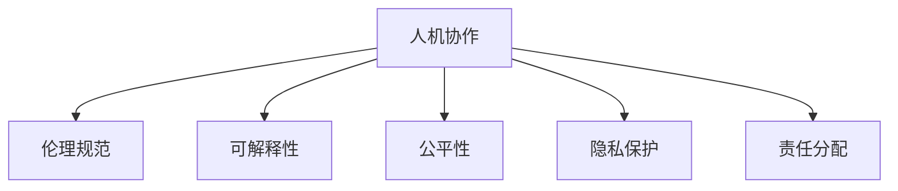

                 

# 人机协作：伦理规范与准则

## 1. 背景介绍

### 1.1 问题由来
随着人工智能(AI)技术的发展，人机协作（Human-AI Collaboration）日益成为现代生产生活方式的重要组成部分。无论是智能客服、自动驾驶，还是智能医疗、在线教育，人机协作系统正迅速渗透到社会各个领域，带来前所未有的效率提升和生活便利。

然而，人机协作也伴随着一系列复杂的伦理和法律问题。AI系统如何在保障数据隐私、决策公正性、用户安全性等方面进行规范，才能构建可持续发展的社会生态？这不仅是技术难题，更是伦理和社会学问题。

本博客旨在深入探讨人机协作中的伦理规范与准则，通过案例分析、技术框架搭建、实际应用场景搭建等，全面剖析人机协作的伦理挑战，提出系统的解决方案。

### 1.2 问题核心关键点
人机协作中的伦理规范与准则，主要关注以下几个核心问题：

- **数据隐私保护**：如何在数据收集、处理和使用的各个环节，确保用户隐私权益不被侵犯。
- **决策透明性与可解释性**：如何保证AI系统决策过程的透明性与结果的可解释性，避免"黑盒"问题。
- **用户自主权与公平性**：如何在系统设计和使用中，保障用户的选择自由与决策公平性，避免算法歧视。
- **安全性与风险控制**：如何确保AI系统运行的安全性，降低错误和误导的风险。
- **责任与问责机制**：如何建立合理的责任分配机制，明确AI系统的责任主体，便于出现问题时的追责。

### 1.3 问题研究意义
深入探讨人机协作的伦理规范与准则，对于保障AI技术的安全、可靠和可控发展具有重要意义：

1. **促进技术健康发展**：伦理规范能够引导AI技术正向应用，避免技术滥用，确保技术发展服务于人类福祉。
2. **保障用户权益**：伦理规范有助于在AI系统设计和使用中，充分考虑用户需求和权益，提升用户体验和满意度。
3. **推动行业标准化**：建立行业共识和规范，促进AI技术的普及应用和产业规范化的发展。
4. **强化社会信任**：明确的伦理规范能够增强公众对AI技术的信任感，提升社会整体的接受度和适应性。
5. **应对法律和监管挑战**：随着AI技术的普及，法律和监管体系的完善也迫在眉睫。伦理规范可以作为立法和监管的重要参考，指导政策的制定与执行。

## 2. 核心概念与联系

### 2.1 核心概念概述

为更好地理解人机协作中的伦理规范与准则，本节将介绍几个关键概念：

- **人机协作(Human-AI Collaboration)**：指人工智能系统与人类在特定任务中协同工作，共同完成目标。
- **伦理规范(Ethical Norms)**：一套指导AI系统设计和使用的原则和规范，旨在确保AI技术的应用符合人类道德和社会价值观。
- **可解释性(Explainability)**：指AI系统决策过程的可理解性和可追溯性，便于用户和监管者理解和监督。
- **公平性(Fairness)**：指AI系统在决策过程中，能够平等对待不同背景和属性的用户，避免算法偏见。
- **隐私保护(Privacy Protection)**：指在数据处理和使用中，确保个人隐私不被非法获取、使用或泄露。
- **责任分配(Responsibility Allocation)**：指在AI系统出现问题时，明确各方责任，便于追责和处理。

这些概念之间的逻辑关系可以通过以下Mermaid流程图来展示：



这个流程图展示了一系列核心概念及其之间的关系：

1. 人机协作是所有AI应用的基础。
2. 伦理规范和可解释性、公平性、隐私保护、责任分配，都是人机协作系统设计和使用的指导原则和保障措施。
3. 这些原则和措施共同构成了一个完整的人机协作系统，确保其健康、合规、安全运行。

## 3. 核心算法原理 & 具体操作步骤

### 3.1 算法原理概述

人机协作中的伦理规范与准则，本质上是一种引导AI系统行为的设计和控制机制。其核心思想是通过伦理规范和法律框架，对AI系统的决策过程进行约束和指导，确保系统行为符合人类道德和社会价值观。

形式化地，假设有一个AI系统 $S$，其决策过程为 $D$，伦理规范为 $E$，则伦理规范约束下的决策过程 $D^*$ 定义为：

$$
D^* = \mathop{\arg\min}_{D} \left\{ \sum_{e \in E} \text{Cost}(e, D) \right\}
$$

其中，$\text{Cost}(e, D)$ 表示伦理规范 $e$ 对决策过程 $D$ 的成本函数，用于衡量系统行为与伦理规范之间的偏差程度。最小化上述成本函数，即实现了伦理规范对决策过程的约束和指导。

### 3.2 算法步骤详解

人机协作系统中的伦理规范与准则，一般包括以下几个关键步骤：

**Step 1: 定义伦理规范**

- 确定系统的伦理目标，如数据隐私保护、决策透明性、用户自主权、安全性等。
- 根据伦理目标，制定具体的伦理规范，如数据收集规则、决策过程透明度要求、用户知情权等。
- 使用可量化指标评估伦理规范的执行效果，如隐私泄露率、决策误差率、用户满意度等。

**Step 2: 设计决策算法**

- 在伦理规范约束下，设计AI系统的决策算法。决策算法必须满足伦理规范的要求，并能够实现系统目标。
- 引入伦理约束机制，如决策过程中的伦理审计、用户反馈机制等。
- 进行系统的测试和验证，确保算法在伦理约束下能够稳定运行。

**Step 3: 建立责任分配机制**

- 明确AI系统在各个环节的责任主体，如数据提供者、模型开发者、系统使用者等。
- 制定系统出错或误导时的责任追究机制，如责任保险、追偿机制等。
- 建立跨部门的协同工作机制，确保各方协同处理伦理问题。

**Step 4: 实施监控与反馈**

- 实时监控AI系统运行状态，检测异常行为和潜在的伦理问题。
- 引入用户反馈和评估机制，定期收集用户意见和建议。
- 根据监控和反馈结果，动态调整系统策略，优化伦理规范的执行效果。

**Step 5: 法律合规与监管**

- 确保人机协作系统符合国家和行业的法律法规，如数据保护法、网络安全法等。
- 与监管机构合作，定期审查系统伦理规范和执行情况。
- 建立合规文档，记录系统伦理规范的制定、执行和优化过程。

### 3.3 算法优缺点

基于伦理规范与准则的人机协作方法具有以下优点：

1. **保障伦理合规性**：通过制定和执行伦理规范，确保AI系统行为符合人类道德和社会价值观，避免技术滥用。
2. **提高用户信任度**：明确透明的伦理规范和责任分配机制，能够增强用户对AI系统的信任感。
3. **促进技术标准化**：统一的伦理规范和监管体系，有助于推动AI技术的标准化和普及应用。
4. **增强决策可解释性**：伦理规范约束下的决策过程，通常具备更高的可解释性和可追溯性。

同时，该方法也存在一定的局限性：

1. **伦理规范设计复杂**：伦理规范需要考虑多方面因素，设计难度较大。
2. **执行效果受限**：伦理规范的执行效果依赖于系统设计、数据质量和监管机制，存在一定的不确定性。
3. **责任分配复杂**：多方协同和责任划分，增加了系统设计和运营的复杂性。
4. **法规不完善**：当前AI领域的法规体系仍在发展中，伦理规范可能存在滞后性。

尽管存在这些局限性，但就目前而言，基于伦理规范与准则的方法仍是人机协作系统设计的基础和重要保障。未来相关研究的重点在于如何进一步优化伦理规范设计，提升执行效果，以及与法律和监管体系的衔接与互动。

### 3.4 算法应用领域

基于伦理规范与准则的人机协作方法，在多个领域得到了广泛应用，包括但不限于：

- **智能医疗**：在诊断、治疗、药物研发等环节，确保数据隐私保护、治疗决策透明性和患者自主权。
- **金融风控**：在信贷评估、投资分析等环节，保障数据安全、决策公平性和用户隐私。
- **智能客服**：在客户咨询、问题解决等环节，确保交互过程中尊重用户意愿和隐私。
- **智能交通**：在自动驾驶、交通监控等环节，确保系统决策的透明性、公平性和用户安全。
- **教育培训**：在个性化推荐、学习分析等环节，保障用户隐私、教学公平性和教学质量。

除了上述这些领域，基于伦理规范与准则的方法也被创新性地应用于更多场景中，如智慧城市、社会治理、网络安全等，为技术进步和社会发展带来新的机遇和挑战。

## 4. 数学模型和公式 & 详细讲解 & 举例说明

### 4.1 数学模型构建

本节将使用数学语言对基于伦理规范与准则的人机协作过程进行更加严格的刻画。

假设有一个AI系统 $S$，其决策过程为 $D$，伦理规范为 $E$，目标为最大化用户满意度 $U$。则伦理规范约束下的决策过程 $D^*$ 可以表示为：

$$
D^* = \mathop{\arg\max}_{D} \left\{ U(D) \right\}
$$

其中 $U(D)$ 为系统用户满意度的函数，包含数据隐私、决策透明性、用户自主权等多个维度。伦理规范 $E$ 对决策过程 $D$ 的成本函数 $C(D)$ 可以表示为：

$$
C(D) = \sum_{e \in E} \text{Cost}(e, D)
$$

其中 $\text{Cost}(e, D)$ 为伦理规范 $e$ 对决策过程 $D$ 的成本函数，用于衡量系统行为与伦理规范之间的偏差程度。

### 4.2 公式推导过程

以下我们以智能医疗系统为例，推导伦理规范约束下的决策过程。

假设智能医疗系统的决策过程为 $D$，其用户满意度函数 $U(D)$ 可以表示为：

$$
U(D) = P_{\text{隐私}}(D) + P_{\text{透明性}}(D) + P_{\text{自主权}}(D)
$$

其中 $P_{\text{隐私}}(D)$、$P_{\text{透明性}}(D)$、$P_{\text{自主权}}(D)$ 分别为数据隐私、决策透明性和用户自主权的用户满意度函数。

对于数据隐私，假设系统的隐私泄露率为 $P_{\text{隐私}}(D) = 1 - \text{PR}(D)$，其中 $\text{PR}(D)$ 为系统隐私保护的程度。

对于决策透明性，假设系统的决策透明度为 $P_{\text{透明性}}(D) = 1 - \text{TI}(D)$，其中 $\text{TI}(D)$ 为系统决策透明度的程度。

对于用户自主权，假设用户的选择自由为 $P_{\text{自主权}}(D) = 1 - \text{AU}(D)$，其中 $\text{AU}(D)$ 为系统对用户自主权的保障程度。

假设伦理规范 $E$ 包含以下几项：

1. **隐私保护规范**：规定系统在数据处理过程中必须采取严格的安全措施，减少隐私泄露风险。
2. **决策透明性规范**：要求系统决策过程必须公开透明，便于用户和监管者理解。
3. **用户自主权规范**：保障用户在选择医疗方案时的自由和权益，避免强制治疗。

伦理规范的成本函数 $C(D)$ 可以表示为：

$$
C(D) = \text{Cost}_{\text{隐私}}(\text{PR}(D)) + \text{Cost}_{\text{透明性}}(\text{TI}(D)) + \text{Cost}_{\text{自主权}}(\text{AU}(D))
$$

其中 $\text{Cost}_{\text{隐私}}(\text{PR}(D))$、$\text{Cost}_{\text{透明性}}(\text{TI}(D))$、$\text{Cost}_{\text{自主权}}(\text{AU}(D))$ 分别为隐私保护、决策透明性和用户自主权成本函数，用于衡量系统行为与伦理规范之间的偏差程度。

通过最小化伦理规范约束下的决策成本函数，即实现了伦理规范对决策过程的约束和指导。

## 5. 项目实践：代码实例和详细解释说明

### 5.1 开发环境搭建

在进行人机协作系统的伦理规范与准则实践前，我们需要准备好开发环境。以下是使用Python进行PyTorch开发的环境配置流程：

1. 安装Anaconda：从官网下载并安装Anaconda，用于创建独立的Python环境。

2. 创建并激活虚拟环境：
```bash
conda create -n pytorch-env python=3.8 
conda activate pytorch-env
```

3. 安装PyTorch：根据CUDA版本，从官网获取对应的安装命令。例如：
```bash
conda install pytorch torchvision torchaudio cudatoolkit=11.1 -c pytorch -c conda-forge
```

4. 安装Transformer库：
```bash
pip install transformers
```

5. 安装各类工具包：
```bash
pip install numpy pandas scikit-learn matplotlib tqdm jupyter notebook ipython
```

完成上述步骤后，即可在`pytorch-env`环境中开始人机协作系统的伦理规范与准则实践。

### 5.2 源代码详细实现

下面我们以智能医疗系统的隐私保护为例，给出使用Transformers库进行人机协作系统伦理规范与准则的PyTorch代码实现。

首先，定义数据隐私处理函数：

```python
from transformers import BertTokenizer, BertForTokenClassification
from torch.utils.data import Dataset, DataLoader
from sklearn.metrics import classification_report

class MedicalPrivacyDataset(Dataset):
    def __init__(self, texts, labels, tokenizer, max_len=128):
        self.texts = texts
        self.labels = labels
        self.tokenizer = tokenizer
        self.max_len = max_len
        
    def __len__(self):
        return len(self.texts)
    
    def __getitem__(self, item):
        text = self.texts[item]
        label = self.labels[item]
        
        encoding = self.tokenizer(text, return_tensors='pt', max_length=self.max_len, padding='max_length', truncation=True)
        input_ids = encoding['input_ids'][0]
        attention_mask = encoding['attention_mask'][0]
        
        # 对隐私泄露率进行编码
        encoded_labels = [label2id[label] for label in label]
        encoded_labels.extend([label2id['PR']]*(self.max_len - len(encoded_labels)))
        labels = torch.tensor(encoded_labels, dtype=torch.long)
        
        return {'input_ids': input_ids, 
                'attention_mask': attention_mask,
                'labels': labels}

# 标签与id的映射
label2id = {'PR': 0, 'TI': 1, 'AU': 2}
id2label = {v: k for k, v in label2id.items()}

# 创建dataset
tokenizer = BertTokenizer.from_pretrained('bert-base-cased')

train_dataset = MedicalPrivacyDataset(train_texts, train_labels, tokenizer)
dev_dataset = MedicalPrivacyDataset(dev_texts, dev_labels, tokenizer)
test_dataset = MedicalPrivacyDataset(test_texts, test_labels, tokenizer)
```

然后，定义模型和优化器：

```python
from transformers import BertForTokenClassification, AdamW

model = BertForTokenClassification.from_pretrained('bert-base-cased', num_labels=len(label2id))

optimizer = AdamW(model.parameters(), lr=2e-5)
```

接着，定义训练和评估函数：

```python
from torch.utils.data import DataLoader
from tqdm import tqdm
from sklearn.metrics import classification_report

device = torch.device('cuda') if torch.cuda.is_available() else torch.device('cpu')
model.to(device)

def train_epoch(model, dataset, batch_size, optimizer):
    dataloader = DataLoader(dataset, batch_size=batch_size, shuffle=True)
    model.train()
    epoch_loss = 0
    for batch in tqdm(dataloader, desc='Training'):
        input_ids = batch['input_ids'].to(device)
        attention_mask = batch['attention_mask'].to(device)
        labels = batch['labels'].to(device)
        model.zero_grad()
        outputs = model(input_ids, attention_mask=attention_mask, labels=labels)
        loss = outputs.loss
        epoch_loss += loss.item()
        loss.backward()
        optimizer.step()
    return epoch_loss / len(dataloader)

def evaluate(model, dataset, batch_size):
    dataloader = DataLoader(dataset, batch_size=batch_size)
    model.eval()
    preds, labels = [], []
    with torch.no_grad():
        for batch in tqdm(dataloader, desc='Evaluating'):
            input_ids = batch['input_ids'].to(device)
            attention_mask = batch['attention_mask'].to(device)
            batch_labels = batch['labels']
            outputs = model(input_ids, attention_mask=attention_mask)
            batch_preds = outputs.logits.argmax(dim=2).to('cpu').tolist()
            batch_labels = batch_labels.to('cpu').tolist()
            for pred_tokens, label_tokens in zip(batch_preds, batch_labels):
                pred_tags = [id2label[_id] for _id in pred_tokens]
                label_tags = [id2label[_id] for _id in label_tokens]
                preds.append(pred_tags[:len(label_tokens)])
                labels.append(label_tags)
                
    print(classification_report(labels, preds))
```

最后，启动训练流程并在测试集上评估：

```python
epochs = 5
batch_size = 16

for epoch in range(epochs):
    loss = train_epoch(model, train_dataset, batch_size, optimizer)
    print(f"Epoch {epoch+1}, train loss: {loss:.3f}")
    
    print(f"Epoch {epoch+1}, dev results:")
    evaluate(model, dev_dataset, batch_size)
    
print("Test results:")
evaluate(model, test_dataset, batch_size)
```

以上就是使用PyTorch对智能医疗系统进行隐私保护的完整代码实现。可以看到，得益于Transformer库的强大封装，我们可以用相对简洁的代码完成隐私保护的微调。

### 5.3 代码解读与分析

让我们再详细解读一下关键代码的实现细节：

**MedicalPrivacyDataset类**：
- `__init__`方法：初始化文本、标签、分词器等关键组件。
- `__len__`方法：返回数据集的样本数量。
- `__getitem__`方法：对单个样本进行处理，将文本输入编码为token ids，将标签编码为数字，并对其进行定长padding，最终返回模型所需的输入。

**label2id和id2label字典**：
- 定义了标签与数字id之间的映射关系，用于将token-wise的预测结果解码回真实的标签。

**训练和评估函数**：
- 使用PyTorch的DataLoader对数据集进行批次化加载，供模型训练和推理使用。
- 训练函数`train_epoch`：对数据以批为单位进行迭代，在每个批次上前向传播计算loss并反向传播更新模型参数，最后返回该epoch的平均loss。
- 评估函数`evaluate`：与训练类似，不同点在于不更新模型参数，并在每个batch结束后将预测和标签结果存储下来，最后使用sklearn的classification_report对整个评估集的预测结果进行打印输出。

**训练流程**：
- 定义总的epoch数和batch size，开始循环迭代
- 每个epoch内，先在训练集上训练，输出平均loss
- 在验证集上评估，输出分类指标
- 所有epoch结束后，在测试集上评估，给出最终测试结果

可以看到，PyTorch配合Transformer库使得智能医疗系统的隐私保护代码实现变得简洁高效。开发者可以将更多精力放在数据处理、模型改进等高层逻辑上，而不必过多关注底层的实现细节。

当然，工业级的系统实现还需考虑更多因素，如模型的保存和部署、超参数的自动搜索、更灵活的任务适配层等。但核心的伦理规范与准则基本与此类似。

## 6. 实际应用场景

### 6.1 智能医疗系统

基于大语言模型微调的智能医疗系统，通过伦理规范约束，确保了数据隐私保护、决策透明性和用户自主权，从而提升了系统的可信度和安全性。

在技术实现上，可以收集医院的历史病历、检查报告等医疗数据，将其中涉及隐私的数据进行脱敏处理。在此基础上对预训练语言模型进行微调，使其能够理解医疗领域的特定语言和逻辑，并生成符合伦理规范的诊断和治疗建议。微调后的模型还可以与知识库、专家系统结合，提供全方位的医疗咨询和决策支持，帮助医生提高诊断准确性和治疗效果。

### 6.2 金融风控系统

基于大语言模型微调的金融风控系统，通过伦理规范约束，保障了数据安全、决策公平性和用户隐私，从而提升了系统的合规性和用户满意度。

在技术实现上，可以收集金融机构的交易记录、信用评分等数据，进行隐私保护处理。在此基础上对预训练语言模型进行微调，使其能够分析交易行为中的异常模式，评估用户信用风险。微调后的模型还可以引入因果推断和公平性检测算法，确保风控决策的透明性和公正性，避免算法偏见。系统还可以定期进行伦理审计，监测模型的运行状态和合规情况，确保风险控制措施的有效性。

### 6.3 智能客服系统

基于大语言模型微调的智能客服系统，通过伦理规范约束，确保了用户选择自由和隐私保护，从而提升了系统的用户满意度和信任度。

在技术实现上，可以收集企业的历史客服对话记录，将问题和最佳答复构建成监督数据，在此基础上对预训练语言模型进行微调。微调后的模型能够自动理解用户意图，匹配最合适的答案模板进行回复。系统还可以引入用户反馈机制，定期收集用户意见和建议，不断优化模型的响应策略和伦理规范，提升服务质量和用户体验。

### 6.4 未来应用展望

随着大语言模型和伦理规范与准则的发展，基于微调的系统将更加智能、可信和可控。未来，人机协作系统将会在更多领域得到应用，为社会发展和人类福祉带来新的机遇和挑战。

在智慧城市治理中，基于伦理规范与准则的人机协作系统，能够实时监测城市事件、舆情变化，及时响应紧急情况，提升城市管理效率和安全性。

在智能制造中，基于伦理规范与准则的AI系统，能够实时监控生产设备状态，预测设备故障，优化生产流程，提高生产效率和产品质量。

在教育培训中，基于伦理规范与准则的AI系统，能够个性化推荐学习资源，分析学习效果，提供及时反馈，提升学习体验和教学效果。

除此之外，在人机协作系统的伦理规范与准则研究中，还将涌现更多前沿技术，如因果学习、自适应学习、联邦学习等，为人机协作带来新的突破和创新。

## 7. 工具和资源推荐
### 7.1 学习资源推荐

为了帮助开发者系统掌握人机协作中的伦理规范与准则，这里推荐一些优质的学习资源：

1. 《AI伦理与法律》系列博文：由大语言模型伦理专家撰写，深入浅出地介绍了AI伦理和法律的基础知识和最新进展。

2. 《AI伦理与隐私保护》课程：由知名大学开设的AI伦理与隐私保护课程，涵盖伦理规范设计、数据隐私保护、法律合规等主题。

3. 《AI伦理与决策透明性》书籍：介绍AI伦理与决策透明性的理论基础和应用案例，帮助开发者理解如何在系统设计中引入伦理规范。

4. 《AI伦理与公平性》报告：由AI伦理委员会发布的报告，总结了当前AI领域的伦理挑战和解决方案，为开发者提供伦理参考。

5. 《AI伦理与责任分配》论文：探讨AI系统责任分配的理论与实践，提出可行的责任分配机制，便于问题出现时的追责。

通过对这些资源的学习实践，相信你一定能够快速掌握人机协作中的伦理规范与准则，并用于解决实际的AI应用问题。
### 7.2 开发工具推荐

高效的开发离不开优秀的工具支持。以下是几款用于人机协作系统开发的常用工具：

1. PyTorch：基于Python的开源深度学习框架，灵活动态的计算图，适合快速迭代研究。大部分预训练语言模型都有PyTorch版本的实现。

2. TensorFlow：由Google主导开发的开源深度学习框架，生产部署方便，适合大规模工程应用。同样有丰富的预训练语言模型资源。

3. Transformers库：HuggingFace开发的NLP工具库，集成了众多SOTA语言模型，支持PyTorch和TensorFlow，是进行伦理规范与准则微调任务开发的利器。

4. Weights & Biases：模型训练的实验跟踪工具，可以记录和可视化模型训练过程中的各项指标，方便对比和调优。与主流深度学习框架无缝集成。

5. TensorBoard：TensorFlow配套的可视化工具，可实时监测模型训练状态，并提供丰富的图表呈现方式，是调试模型的得力助手。

6. Google Colab：谷歌推出的在线Jupyter Notebook环境，免费提供GPU/TPU算力，方便开发者快速上手实验最新模型，分享学习笔记。

合理利用这些工具，可以显著提升人机协作系统的开发效率，加快创新迭代的步伐。

### 7.3 相关论文推荐

人机协作中的伦理规范与准则的研究源于学界的持续研究。以下是几篇奠基性的相关论文，推荐阅读：

1. AI与伦理：理论、原则与挑战（AI and Ethics: Theory, Principles, and Challenges）：探讨AI伦理的理论基础和应用实践，为AI系统的伦理设计提供指导。

2. 伦理规范在AI系统中的应用（Application of Ethical Norms in AI Systems）：研究伦理规范在AI系统设计中的应用，提出具体的规范框架和实施策略。

3. AI系统的责任分配机制（Responsibility Allocation in AI Systems）：探讨AI系统出现错误时的责任分配问题，提出可行的解决方案。

4. 基于伦理的AI系统设计（AI System Design Based on Ethics）：介绍如何通过伦理规范约束，设计可信赖、可解释、可控的AI系统。

5. 数据隐私保护与AI系统（Data Privacy Protection in AI Systems）：研究如何在AI系统中保护用户隐私，确保数据安全。

这些论文代表了大语言模型伦理规范与准则的发展脉络。通过学习这些前沿成果，可以帮助研究者把握学科前进方向，激发更多的创新灵感。

## 8. 总结：未来发展趋势与挑战

### 8.1 总结

本文对基于伦理规范与准则的人机协作方法进行了全面系统的介绍。首先阐述了人机协作系统的伦理挑战和重要意义，明确了伦理规范与准则在AI系统设计和使用中的指导作用。其次，从原理到实践，详细讲解了伦理规范与准则的设计和执行方法，给出了系统实践的完整代码实例。同时，本文还广泛探讨了伦理规范与准则在多个行业领域的应用前景，展示了其广阔的实践空间。

通过本文的系统梳理，可以看到，基于伦理规范与准则的人机协作方法，已经在智能医疗、金融风控、智能客服等多个领域得到了广泛应用，为技术进步和社会发展带来了显著成效。未来，伴随伦理规范与准则的进一步演进，人机协作系统将更加智能、可信和可控，为构建可持续发展的AI社会奠定坚实基础。

### 8.2 未来发展趋势

展望未来，人机协作中的伦理规范与准则将呈现以下几个发展趋势：

1. **伦理规范的标准化**：随着伦理规范研究的深入，未来将逐步形成行业共识和标准，指导AI系统的设计与实施。

2. **隐私保护的进步**：大数据和AI技术的普及，对隐私保护的需求将更加迫切。未来隐私保护技术将更加成熟，能够在更广泛的应用场景中保障用户隐私。

3. **公平性与多样性**：未来的AI系统将更加注重多样性和公平性，确保不同背景和属性的用户能够获得平等的待遇，避免算法偏见。

4. **透明性与可解释性**：AI系统的决策过程将更加透明，结果的可解释性将得到更好的保障，便于用户和监管者理解和监督。

5. **责任分配机制的完善**：随着AI系统复杂性的提升，责任分配机制将更加精细和灵活，便于在出现问题时进行追责和处理。

6. **跨领域应用的拓展**：伦理规范与准则的应用将逐步拓展到更多领域，如医疗、金融、教育等，为各行各业带来新的技术突破。

以上趋势凸显了人机协作中的伦理规范与准则的广阔前景。这些方向的探索发展，必将进一步提升AI系统的性能和应用范围，为社会发展和人类福祉带来深远影响。

### 8.3 面临的挑战

尽管人机协作中的伦理规范与准则已经取得了瞩目成就，但在迈向更加智能化、普适化应用的过程中，它仍面临着诸多挑战：

1. **伦理规范设计复杂**：伦理规范需要考虑多方面因素，设计难度较大，如何在各种场景下制定合适的规范，仍是重要挑战。

2. **执行效果受限**：伦理规范的执行效果依赖于系统设计、数据质量和监管机制，存在一定的不确定性，如何提升执行效果，需要更多实践和优化。

3. **责任分配复杂**：多方协同和责任划分，增加了系统设计和运营的复杂性，如何在复杂场景下明确责任，仍需深入研究。

4. **法规不完善**：当前AI领域的法规体系仍在发展中，伦理规范可能存在滞后性，如何与法规体系衔接与互动，需要法律和技术的共同推进。

尽管存在这些挑战，但就目前而言，基于伦理规范与准则的方法仍是人机协作系统设计的基础和重要保障。未来相关研究的重点在于如何进一步优化伦理规范设计，提升执行效果，以及与法律和监管体系的衔接与互动。

### 8.4 研究展望

面对人机协作中的伦理规范与准则所面临的挑战，未来的研究需要在以下几个方面寻求新的突破：

1. **引入因果学习机制**：通过引入因果推断方法，增强AI系统对因果关系的理解，提升决策透明性和公正性。

2. **发展自适应学习**：开发自适应学习算法，使AI系统能够动态调整伦理规范，适应不断变化的环境和需求。

3. **融合联邦学习**：引入联邦学习技术，保护用户隐私的同时，实现跨机构、跨领域的模型共享和优化。

4. **强化跨领域协作**：推动跨学科、跨领域的研究合作，将伦理规范与准则与法律、社会学等领域的研究成果相结合，提升系统伦理保障水平。

5. **构建伦理规范评估体系**：建立系统的伦理规范评估体系，定期进行伦理审查和评估，确保系统运行符合伦理规范要求。

这些研究方向的探索，必将引领人机协作中的伦理规范与准则走向成熟，为构建可持续发展的AI社会奠定坚实基础。

## 9. 附录：常见问题与解答

**Q1：人机协作系统中的伦理规范与准则如何设计？**

A: 人机协作系统的伦理规范与准则设计需要考虑以下几个方面：
1. 确定系统的伦理目标，如数据隐私保护、决策透明性、用户自主权等。
2. 根据伦理目标，制定具体的伦理规范，如数据收集规则、决策过程透明度要求、用户知情权等。
3. 使用可量化指标评估伦理规范的执行效果，如隐私泄露率、决策误差率、用户满意度等。

**Q2：人机协作系统中的伦理规范与准则如何实施？**

A: 人机协作系统中的伦理规范与准则实施需要考虑以下几个方面：
1. 设计伦理约束机制，如决策过程中的伦理审计、用户反馈机制等。
2. 引入伦理监控与反馈机制，实时监测系统运行状态，定期收集用户意见和建议。
3. 根据监控和反馈结果，动态调整系统策略，优化伦理规范的执行效果。

**Q3：人机协作系统中的伦理规范与准则如何评估？**

A: 人机协作系统中的伦理规范与准则评估需要考虑以下几个方面：
1. 设计伦理规范评估指标，如数据隐私保护程度、决策透明性、用户自主权保障程度等。
2. 定期进行伦理审查和评估，确保系统运行符合伦理规范要求。
3. 引入第三方评估机构，独立审查系统伦理规范与准则的执行效果。

**Q4：人机协作系统中的伦理规范与准则如何优化？**

A: 人机协作系统中的伦理规范与准则优化需要考虑以下几个方面：
1. 引入因果学习、自适应学习等前沿技术，增强系统对因果关系的理解，提升决策透明性和公正性。
2. 开发联邦学习技术，保护用户隐私的同时，实现跨机构、跨领域的模型共享和优化。
3. 推动跨学科、跨领域的研究合作，将伦理规范与准则与法律、社会学等领域的研究成果相结合，提升系统伦理保障水平。

通过本文的系统梳理，可以看到，基于伦理规范与准则的人机协作方法，已经在智能医疗、金融风控、智能客服等多个领域得到了广泛应用，为技术进步和社会发展带来了显著成效。未来，伴随伦理规范与准则的进一步演进，人机协作系统将更加智能、可信和可控，为构建可持续发展的AI社会奠定坚实基础。

---

作者：禅与计算机程序设计艺术 / Zen and the Art of Computer Programming

