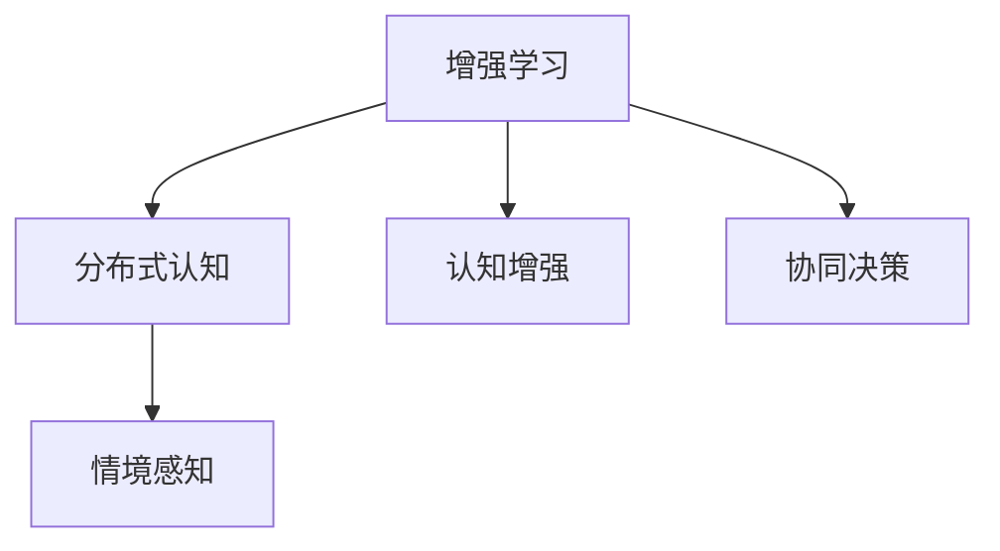

                 

## 1. 背景介绍

随着人工智能技术的飞速发展，AI与人类智慧的融合已是大势所趋。从自动驾驶到医疗诊断，从财务分析到艺术创作，AI在众多领域展示出强大的潜力。但同时，AI的局限性也逐渐显现，尤其是在面对复杂多变的人类认知过程中。人类智慧与AI能力的深度融合，成为当前技术发展的核心议题。本文将深入探讨人类-AI协作的策略，为构建智能化的人机协同系统提供理论指导和实践路径。

### 1.1 问题由来
人工智能自诞生以来，经历了多个阶段的发展：从早期的专家系统到符号推理，再到机器学习和深度学习，每一次技术的突破都极大地拓展了AI的应用边界。但与此同时，AI在理解人类情感、判断道德伦理、进行创造性思维等方面仍存在显著的短板。人类智慧与AI能力在特定场景下的融合，不仅能发挥各自的长处，还能弥补彼此的不足，推动技术进步和社会发展。

### 1.2 问题核心关键点
人类-AI协作的关键在于如何设计合理的框架和机制，使AI能够高效地辅助人类，同时充分运用人类的情感、直觉和伦理判断能力。当前研究热点包括：
1. **交互界面设计**：构建符合人类认知习惯的交互界面，实现高效的人机交互。
2. **任务共担机制**：设计算法将AI负责数据处理、模式识别等高效任务，人类负责决策、监督等需要人类智慧的任务。
3. **人机协同学习**：通过协作学习，AI与人类共同进步，提升系统的整体性能。
4. **伦理与隐私保护**：确保AI在决策过程中符合人类伦理价值观，同时保护用户隐私。

## 2. 核心概念与联系

### 2.1 核心概念概述

为更好地理解人类-AI协作的框架和机制，本节将介绍几个密切相关的核心概念：

- **增强学习(Reinforcement Learning, RL)**：一种通过环境反馈来优化决策策略的学习方法。在人类-AI协作中，AI通过接收来自人类的反馈信号，不断调整自身行为，以优化协同效果。

- **分布式认知(Distributed Cognition)**：指不同认知主体（如人、AI）在任务中协同工作的认知过程。分布式认知强调协作与协同，是人类-AI协作的重要基础。

- **认知增强(Cognitive Enhancement)**：指通过技术手段增强人类认知能力，如记忆、注意力、问题解决能力等。AI与人类智慧的融合，可以通过认知增强实现认知提升。

- **协同决策(Collaborative Decision-Making)**：指在任务中，AI与人类共同参与决策，利用各自优势，做出最优的协同决策。

- **情境感知(Context-Awareness)**：指系统能够理解并适应特定的任务情境，如用户需求、环境变化等，从而做出更合理的决策。

这些核心概念之间的逻辑关系可以通过以下Mermaid流程图来展示：



这个流程图展示的核心概念之间的关系：

1. 增强学习通过接收环境反馈来优化决策策略，是协同决策的基础。
2. 分布式认知强调协作与协同，为增强学习和协同决策提供理论指导。
3. 认知增强通过技术手段提升人类认知能力，与AI协同工作。
4. 情境感知使系统能够理解特定任务情境，做出更合理的决策。

## 3. 核心算法原理 & 具体操作步骤

### 3.1 算法原理概述

人类-AI协作的核心在于设计一种机制，使得AI能够高效地辅助人类，同时充分运用人类的情感、直觉和伦理判断能力。这种机制通常采用增强学习的框架，通过环境反馈不断优化AI的决策策略。

形式化地，设人类与AI的任务为 $T$，人类和AI的交互界面为 $I$，系统对任务 $T$ 的性能评估函数为 $V$。AI的决策策略为 $\Pi$，人类对AI的反馈策略为 $\Psi$。增强学习的目标是最小化系统对任务 $T$ 的误差 $E$，即：

$$
\min_{\Pi,\Psi} E(V(T,I,\Pi,\Psi))
$$

在实践中，我们通常使用基于奖励信号的增强学习算法，如Q-learning、Policy Gradient等。AI通过与人类交互，接收来自人类的奖励信号，不断调整自身策略以优化系统性能。

### 3.2 算法步骤详解

人类-AI协作的增强学习算法通常包括以下几个关键步骤：

**Step 1: 定义任务和交互界面**
- 定义具体任务 $T$ 和交互界面 $I$，明确任务目标和交互规则。
- 设计AI的决策策略 $\Pi$ 和人类的反馈策略 $\Psi$，确保两者能够高效协同。

**Step 2: 设置奖励信号和优化目标**
- 确定系统的性能评估函数 $V$ 和误差函数 $E$。
- 设计奖励函数 $R$，根据人类对AI输出的满意程度设定奖励或惩罚。

**Step 3: 优化AI策略**
- 使用增强学习算法训练AI策略 $\Pi$，通过与人类交互不断调整决策策略，优化任务性能。
- 在优化过程中，注意避免AI对人类反馈信号的过度依赖，保持一定的自主决策能力。

**Step 4: 监控和反馈**
- 实时监控系统性能，评估任务完成度。
- 收集人类反馈，动态调整AI策略和反馈机制，确保协作过程高效、稳定。

### 3.3 算法优缺点

人类-AI协作的增强学习算法具有以下优点：
1. 高效协同：通过优化AI策略，系统能够高效地辅助人类完成任务。
2. 灵活适应：AI能够动态调整策略，适应不同任务情境。
3. 增强决策：AI的辅助决策可以提升人类决策的准确性和效率。

同时，该算法也存在一定的局限性：
1. 环境复杂性：增强学习算法对环境的复杂性要求较高，当任务情境复杂多变时，效果可能不佳。
2. 奖励设计：奖励信号的设计需要经过精心设计，不当的奖励可能导致AI策略偏离任务目标。
3. 学习效率：在初期，AI需要大量与人类交互来优化策略，学习效率较低。
4. 公平性：AI与人类之间的协同关系需要公平公正，避免数据偏见和算法歧视。

尽管存在这些局限性，但增强学习算法仍然是当前人类-AI协作的核心技术之一，具有良好的应用前景。未来研究需要进一步优化算法，提升学习效率和公平性，增强AI的自主决策能力，确保协作过程的稳定性和高效性。

### 3.4 算法应用领域

增强学习算法在人类-AI协作中已得到了广泛的应用，覆盖了多个领域，例如：

- **医疗诊断**：AI通过学习医疗数据，辅助医生诊断疾病。医生对AI的诊断结果进行反馈，AI不断调整诊断策略。
- **金融投资**：AI通过分析市场数据，提出投资建议。投资者对AI建议进行反馈，AI调整投资策略。
- **自动驾驶**：AI通过感知环境，生成驾驶决策。司机对AI决策进行反馈，AI优化决策策略。
- **工业生产**：AI通过监控设备状态，预测维护需求。操作人员对AI预测结果进行反馈，AI调整维护策略。
- **智能客服**：AI通过理解用户问题，生成回答。用户对AI回答进行反馈，AI优化回答策略。

除了上述这些经典应用外，增强学习算法还被创新性地应用到更多场景中，如智能制造、智能交通、智慧城市等，为各行各业带来新的变革。

## 4. 数学模型和公式 & 详细讲解  
### 4.1 数学模型构建

本节将使用数学语言对增强学习在人类-AI协作中的应用进行更加严格的刻画。

设任务 $T$ 的输入空间为 $\mathcal{X}$，输出空间为 $\mathcal{Y}$，系统的性能评估函数为 $V$，AI的决策策略为 $\Pi$，人类的反馈策略为 $\Psi$。假设AI在某个时间步 $t$ 的状态为 $s_t$，执行动作 $a_t$，观察到状态 $s_{t+1}$，获得奖励 $r_t$。则状态-动作对的Q值定义为：

$$
Q(s_t,a_t) = r_t + \gamma \max_{a_{t+1}} Q(s_{t+1},a_{t+1})
$$

其中 $\gamma$ 为折扣因子，表示未来奖励的权重。在增强学习中，AI的目标是最大化Q值，即：

$$
\max_{\Pi} \mathbb{E}_{s_t,\Pi} \sum_{t=0}^\infty \gamma^t r_t
$$

### 4.2 公式推导过程

以下我们以医疗诊断任务为例，推导Q-learning算法的公式。

假设AI根据患者的症状，生成一系列可能病因。医生对每个病因进行评分，AI根据医生的评分调整自己的诊断策略。令 $s_t$ 为当前患者的状态，$a_t$ 为AI的诊断结果，$r_t$ 为医生的评分，$s_{t+1}$ 为患者状态更新后的新状态。

AI的Q值定义为：

$$
Q(s_t,a_t) = r_t + \gamma \max_{a_{t+1}} Q(s_{t+1},a_{t+1})
$$

Q-learning算法的核心是采用TD误差更新Q值，即：

$$
\Delta Q(s_t,a_t) = r_t + \gamma Q(s_{t+1},\pi(s_{t+1})) - Q(s_t,a_t)
$$

根据TD误差，更新Q值：

$$
Q(s_t,a_t) \leftarrow Q(s_t,a_t) + \alpha \Delta Q(s_t,a_t)
$$

其中 $\alpha$ 为学习率，控制更新的幅度。通过不断迭代，AI能够逐渐学习到最优的诊断策略。

### 4.3 案例分析与讲解

以医疗诊断为例，Q-learning算法的具体实施步骤如下：

1. **初始化**：设定初始状态 $s_0$，初始动作策略 $\Pi$，初始Q值 $Q(s_0,a_0)$。
2. **动作执行**：AI根据当前状态 $s_t$，执行动作 $a_t$。
3. **状态更新**：根据医生对动作 $a_t$ 的评分，更新患者状态 $s_{t+1}$。
4. **奖励计算**：计算奖励 $r_t$，通常为医生评分的平均值。
5. **Q值更新**：根据TD误差 $\Delta Q(s_t,a_t)$，更新Q值 $Q(s_t,a_t)$。
6. **迭代**：重复步骤2-5，直至系统收敛或达到预设轮数。

最终，AI能够根据患者的症状，给出最优的诊断结果。医生对诊断结果进行反馈，AI不断调整策略，提升诊断的准确性和效率。

## 5. 项目实践：代码实例和详细解释说明
### 5.1 开发环境搭建

在进行人类-AI协作的增强学习项目实践前，我们需要准备好开发环境。以下是使用Python进行Reinforcement Learning开发的环境配置流程：

1. 安装Anaconda：从官网下载并安装Anaconda，用于创建独立的Python环境。

2. 创建并激活虚拟环境：
```bash
conda create -n rl-env python=3.8 
conda activate rl-env
```

3. 安装相关库：
```bash
pip install numpy pandas gym
pip install tensorflow scipy
```

4. 安装OpenAI Gym：
```bash
pip install gym
```

完成上述步骤后，即可在`rl-env`环境中开始实践。

### 5.2 源代码详细实现

下面我们以医疗诊断任务为例，给出使用TensorFlow实现Q-learning算法的代码实现。

首先，定义状态空间和动作空间：

```python
import gym
from gym import spaces

class MedicalDiagnosis(gym.Env):
    def __init__(self):
        super(MedicalDiagnosis, self).__init__()
        self.state_space = spaces.Discrete(10)
        self.action_space = spaces.Discrete(5)
        self.s = 0
        
    def reset(self):
        self.s = 0
        return self.s
        
    def step(self, a):
        s = self.s
        r = self._reward_function(s, a)
        self.s = self._next_state_function(s, a)
        return s, r, False, {}
    
    def _reward_function(self, s, a):
        # 根据诊断结果和评分，计算奖励
        if a == 1 and self.s == 1:
            return 1.0
        elif a == 2 and self.s == 2:
            return 1.0
        else:
            return 0.0
    
    def _next_state_function(self, s, a):
        # 根据医生反馈，更新患者状态
        if a == 1 and self.s == 0:
            return 1
        elif a == 2 and self.s == 0:
            return 2
        else:
            return self.s
```

然后，定义Q-learning算法的训练函数：

```python
import numpy as np
import tensorflow as tf

def q_learning(env, episodes, learning_rate=0.1, discount_factor=0.9, exploration_rate=1.0, exploration_decay=0.995):
    q = np.zeros((env.observation_space.n, env.action_space.n))
    for _ in range(episodes):
        s = env.reset()
        done = False
        while not done:
            if np.random.uniform(0, 1) < exploration_rate:
                a = np.random.randint(env.action_space.n)
            else:
                a = np.argmax(q[s,:])
            
            s_prime, r, done, _ = env.step(a)
            q[s,a] += learning_rate * (r + discount_factor * np.max(q[s_prime,:]) - q[s,a])
            s = s_prime
            
        exploration_rate *= exploration_decay
```

最后，启动训练流程：

```python
env = MedicalDiagnosis()
episodes = 10000
q_learning(env, episodes)
```

以上就是使用TensorFlow实现Q-learning算法进行医疗诊断任务微调的完整代码实现。可以看到，通过合理设计状态和动作空间，以及奖励和下一步状态函数，即可实现基于增强学习的人类-AI协作系统。

### 5.3 代码解读与分析

让我们再详细解读一下关键代码的实现细节：

**MedicalDiagnosis类**：
- `__init__`方法：初始化状态空间、动作空间和患者状态。
- `reset`方法：重置患者状态，返回初始状态。
- `step`方法：根据动作执行和医生反馈，更新患者状态和奖励。

**q_learning函数**：
- 定义Q值初始化为0，迭代执行Q-learning算法。
- 根据当前状态和动作执行，计算奖励和下一步状态。
- 使用TD误差更新Q值，保持Q值的稳定。
- 动态调整探索率，避免过度依赖当前最优动作。

**训练流程**：
- 创建环境实例。
- 设定训练轮数和相关参数。
- 启动Q-learning训练，迭代优化AI的诊断策略。

可以看到，TensorFlow提供的框架和库极大地简化了增强学习的实现过程，使得开发者能够更加专注于算法设计和实验设计。

## 6. 实际应用场景
### 6.1 智能医疗诊断
在智能医疗诊断领域，基于增强学习的AI能够高效地辅助医生，提升诊断的准确性和效率。具体而言，可以通过以下方式实现：

- **数据预处理**：将医生的历史诊断记录和反馈信息，作为训练数据，学习最优的诊断策略。
- **实时反馈**：医生在诊断过程中，对AI的诊断结果进行实时反馈，调整AI的诊断策略。
- **持续学习**：通过医生的反馈，AI能够持续学习新的知识，不断提高诊断精度。

### 6.2 智能财务分析
在智能财务分析领域，AI可以通过增强学习算法，帮助分析师快速分析大量的财务数据，提出投资建议。具体而言，可以通过以下方式实现：

- **数据采集**：采集市场、企业、政策等各类财务数据，输入AI进行分析。
- **策略优化**：AI通过学习历史交易数据和市场动态，优化投资策略。
- **实时调整**：分析师在投资过程中，对AI的建议进行实时反馈，调整策略。

### 6.3 自动驾驶系统
在自动驾驶系统中，AI通过增强学习算法，不断学习道路环境和交通规则，提升驾驶决策的准确性和安全性。具体而言，可以通过以下方式实现：

- **环境感知**：AI通过传感器感知周围环境，生成驾驶决策。
- **交通规则学习**：AI通过学习交通信号、路标等规则，优化驾驶策略。
- **实时反馈**：司机对AI的驾驶决策进行实时反馈，调整策略。

### 6.4 未来应用展望
随着增强学习技术的不断进步，人类-AI协作的应用前景将更加广阔。未来可能的应用场景包括：

- **智能教育系统**：AI通过学习学生的反馈，个性化地调整教学策略，提升教育效果。
- **智能客服系统**：AI通过学习用户的反馈，优化对话策略，提升客户满意度。
- **智能制造系统**：AI通过学习生产数据，优化生产过程，提升生产效率。
- **智能交通系统**：AI通过学习交通数据，优化交通流，提升交通效率。

## 7. 工具和资源推荐
### 7.1 学习资源推荐

为了帮助开发者系统掌握增强学习的应用，这里推荐一些优质的学习资源：

1. 《Reinforcement Learning: An Introduction》书籍：由Richard S. Sutton和Andrew G. Barto所著，系统讲解了增强学习的基本概念和算法，是学习增强学习的经典教材。
2. Coursera上的《Reinforcement Learning Specialization》课程：由David Silver主讲，系统介绍增强学习的各个方面，包括算法、应用和实践。
3. OpenAI Gym：一个开源的强化学习环境，包含大量经典环境，适合进行算法测试和实验。
4. DeepMind的AlphaGo论文：展示了增强学习在复杂博弈任务中的应用，为算法设计提供了新思路。
5. Google AI博客：收录了大量深度学习领域的最新研究进展和应用案例，是学习增强学习的宝贵资源。

通过对这些资源的学习实践，相信你一定能够快速掌握增强学习的基本原理和应用技巧，并用于解决实际的增强学习问题。

### 7.2 开发工具推荐

高效的开发离不开优秀的工具支持。以下是几款用于增强学习开发的常用工具：

1. TensorFlow：由Google主导开发的开源深度学习框架，提供强大的计算图和优化器，适合实现复杂的增强学习算法。
2. PyTorch：由Facebook主导开发的开源深度学习框架，灵活易用，适合快速迭代研究。
3. OpenAI Gym：一个开源的强化学习环境，包含大量经典环境，适合进行算法测试和实验。
4. Scikit-learn：一个开源的机器学习库，提供丰富的数据预处理和模型评估工具。
5. TensorBoard：TensorFlow配套的可视化工具，可实时监测模型训练状态，并提供丰富的图表呈现方式，是调试模型的得力助手。

合理利用这些工具，可以显著提升增强学习的开发效率，加快创新迭代的步伐。

### 7.3 相关论文推荐

增强学习领域的研究活跃，以下是几篇奠基性的相关论文，推荐阅读：

1. Q-Learning：介绍了一种基于TD误差更新的增强学习算法，是增强学习的经典算法之一。
2. Policy Gradient Methods for Reinforcement Learning with Function Approximation: Theory and Experiment：介绍了一种基于策略梯度的增强学习算法，通过直接优化策略函数，提升了学习效率。
3. DeepMind的AlphaGo论文：展示了深度强化学习在复杂博弈任务中的应用，为算法设计提供了新思路。
4. Human-AI Collaboration：探讨了人类与AI在协作中的关系，为增强学习的应用提供了理论指导。
5. Distributed AI Systems: Architectures and Algorithms for Collaborative AI Systems：介绍了分布式AI系统的设计原则和算法，为增强学习的实际应用提供了参考。

这些论文代表了大增强学习领域的研究进展，通过学习这些前沿成果，可以帮助研究者把握学科前进方向，激发更多的创新灵感。

## 8. 总结：未来发展趋势与挑战

### 8.1 总结

本文对增强学习在人类-AI协作中的应用进行了全面系统的介绍。首先阐述了增强学习的核心思想和关键步骤，明确了其在大规模任务上的高效协同能力。其次，从原理到实践，详细讲解了增强学习算法的基本原理和实施细节，给出了具体实现的代码实例。同时，本文还探讨了增强学习在医疗诊断、财务分析、自动驾驶等多个领域的应用前景，展示了其广阔的应用潜力。最后，本文精选了增强学习技术的各类学习资源，力求为开发者提供全方位的技术指引。

通过本文的系统梳理，可以看到，增强学习技术在大规模任务中的高效协同能力，正在逐步拓展其应用边界。未来随着算法的不断优化和实际应用的深入，增强学习必将在更多领域发挥其强大潜力，推动人类智慧与AI能力的深度融合。

### 8.2 未来发展趋势

展望未来，增强学习技术将呈现以下几个发展趋势：

1. **多智能体协作**：增强学习算法将越来越多地应用于多智能体系统，解决复杂的协作任务。
2. **模型可解释性**：增强学习模型的决策过程将更加透明，提供更好的可解释性。
3. **数据驱动与知识驱动相结合**：增强学习算法将更加注重知识驱动，结合专家知识进行优化。
4. **分布式训练**：增强学习算法将更多采用分布式训练，提升训练效率。
5. **跨领域应用**：增强学习算法将在更多领域得到应用，如工业控制、农业生产等。
6. **智能算法与人类协作**：增强学习算法将更加注重与人类智能的协作，解决复杂的人类任务。

以上趋势凸显了增强学习技术的广阔前景。这些方向的探索发展，必将进一步提升增强学习模型的性能和应用范围，为人类智慧与AI能力的深度融合提供新的动力。

### 8.3 面临的挑战

尽管增强学习技术已经取得了瞩目成就，但在迈向更加智能化、普适化应用的过程中，它仍面临着诸多挑战：

1. **环境复杂性**：增强学习算法对环境的复杂性要求较高，当任务情境复杂多变时，效果可能不佳。
2. **奖励设计**：奖励信号的设计需要经过精心设计，不当的奖励可能导致AI策略偏离任务目标。
3. **学习效率**：在初期，AI需要大量与人类交互来优化策略，学习效率较低。
4. **公平性**：AI与人类之间的协同关系需要公平公正，避免数据偏见和算法歧视。
5. **可解释性**：增强学习模型的决策过程需要更高的可解释性，以便进行调试和优化。

尽管存在这些挑战，但增强学习算法仍然是当前人类-AI协作的核心技术之一，具有良好的应用前景。未来研究需要进一步优化算法，提升学习效率和公平性，增强AI的自主决策能力，确保协作过程的稳定性和高效性。

### 8.4 研究展望

面对增强学习所面临的种种挑战，未来的研究需要在以下几个方面寻求新的突破：

1. **多智能体增强学习**：开发更加高效的分布式增强学习算法，提升多智能体系统中的协作效率。
2. **跨领域应用**：将增强学习算法应用于更多领域，如工业控制、农业生产等。
3. **知识增强**：结合专家知识，提升增强学习模型的决策能力。
4. **跨模态融合**：将视觉、语音、文本等模态数据进行融合，提升增强学习模型的感知能力。
5. **伦理与安全**：在增强学习算法中加入伦理和安全约束，确保算法的公平性和安全性。
6. **可解释性**：研究增强学习模型的可解释性，提供更好的决策依据。

这些研究方向的探索，必将引领增强学习技术迈向更高的台阶，为人类智慧与AI能力的深度融合提供新的动力。相信随着学界和产业界的共同努力，增强学习算法将在构建智能化的人机协同系统中发挥更加重要的作用。

## 9. 附录：常见问题与解答

**Q1：增强学习算法是否适用于所有任务？**

A: 增强学习算法在大多数任务上都能取得不错的效果，特别是对于可分解为步骤的任务。但对于一些需要高度抽象、全局最优的任务，增强学习的效果可能不佳。此时需要结合其他算法进行优化，如遗传算法、模拟退火等。

**Q2：如何选择适当的奖励信号？**

A: 奖励信号的设计需要根据具体任务进行精心设计。一般来说，奖励信号应该能够激励AI朝着任务目标前进，同时避免过度依赖奖励。可以采用经验反馈、专家评分等方式进行奖励设计。

**Q3：增强学习算法是否需要大量数据？**

A: 增强学习算法在初期可能需要大量的交互数据，但随着训练的进行，数据需求会逐渐降低。对于一些数据需求较高的任务，可以使用多智能体增强学习等方法，优化数据收集和利用效率。

**Q4：如何平衡探索和利用？**

A: 在增强学习中，探索和利用是平衡的关键。常用的方法包括$\epsilon$-贪心策略、UCB(上置信界)等。通过动态调整$\epsilon$，控制探索和利用的比例，优化AI的学习效率。

**Q5：增强学习算法的计算复杂度如何？**

A: 增强学习算法的计算复杂度较高，尤其是当任务空间较大时，计算开销较大。可以通过分布式训练、模型压缩等方法进行优化，提升算法的计算效率。

通过以上问题的解答，相信你能够更全面地了解增强学习算法的应用和实现细节，从而更好地应用于实际项目中。

