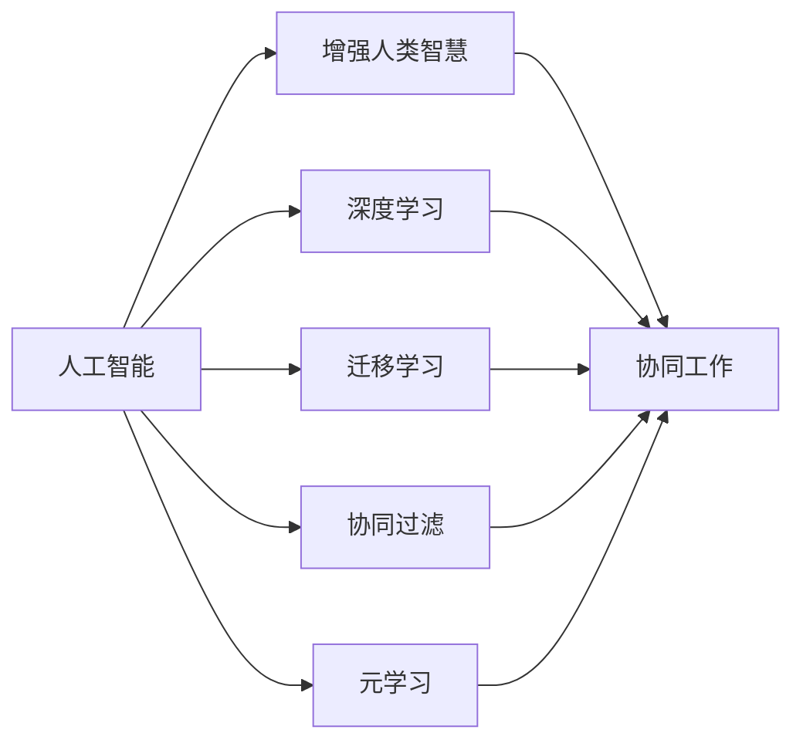

                 

# 人类-AI协作：增强人类智慧与AI能力的融合发展趋势预测与策略

## 1. 背景介绍

### 1.1 问题由来
随着人工智能(AI)技术的快速发展，AI与人类协作的趋势日益明显。AI不仅在自动化、智能化等方面取得了巨大突破，也在增强人类智慧、提升工作效率、改善生活质量等方面展现了巨大潜力。如何更好地将AI技术与人类智慧融合，实现人类-AI协作的深度发展，成为当前技术界和社会广泛关注的话题。

### 1.2 问题核心关键点
本文将围绕以下几个核心问题展开探讨：
1. 什么是人类-AI协作？
2. AI如何增强人类智慧？
3. AI如何与人类协同工作？
4. 如何构建高效的人类-AI协作系统？
5. 未来人类-AI协作的发展趋势与策略。

## 2. 核心概念与联系

### 2.1 核心概念概述
- **人工智能**（AI）：指通过计算机模拟人类的智能行为，实现数据处理、模式识别、决策支持等功能的技术。
- **增强人类智慧**：指通过AI技术提升人类的认知能力、决策水平、创新思维等，使人类在智能系统辅助下更好地处理复杂问题。
- **人类-AI协作**：指AI系统与人类用户之间的一种协同关系，人类利用AI的强大计算能力和广泛知识，AI系统利用人类智能的灵活性和创造力，共同完成任务。
- **深度学习**：一种基于神经网络的机器学习技术，通过多层次的特征提取与分类，实现高精度的数据处理和模式识别。
- **迁移学习**：指将在一个任务上训练得到的模型知识，迁移到另一个相关任务上进行微调，提高新任务的性能。
- **协同过滤**：一种推荐系统技术，通过分析用户的历史行为数据，推断用户偏好，实现个性化推荐。
- **元学习**：指模型能够通过少量数据快速学习新任务，提高泛化能力。

### 2.2 核心概念联系

通过以下Mermaid流程图，展示人类-AI协作的关键概念及其联系：



这个流程图展示了各个概念之间的关系：

1. **人工智能**是整个系统的基础，通过**深度学习**、**迁移学习**、**协同过滤**和**元学习**等技术实现。
2. **增强人类智慧**是AI技术应用的核心目标，利用**协同工作**机制实现。
3. **协同工作**则是**人工智能**与**增强人类智慧**互动的关键，是实现高效协作的基础。

## 3. 核心算法原理 & 具体操作步骤

### 3.1 算法原理概述
人类-AI协作的核心算法原理可以概括为以下几个方面：

- **数据驱动**：AI系统通过分析大量数据，学习出有效的特征和模式，从而为人类提供决策支持。
- **知识迁移**：AI系统通过迁移学习，将已有知识应用于新任务，提高模型在新场景下的性能。
- **协同优化**：AI系统与人类用户通过协同过滤和反馈机制，不断优化系统性能。
- **智能增强**：AI系统通过增强学习，提升自身算法和模型的智能化水平，更好地服务于人类。

### 3.2 算法步骤详解

1. **数据采集与预处理**：收集相关领域的原始数据，并进行清洗、标注等预处理，为后续算法训练提供基础。

2. **特征提取与模型训练**：通过深度学习模型，如卷积神经网络（CNN）、循环神经网络（RNN）、Transformer等，对数据进行特征提取和模型训练。

3. **知识迁移与微调**：使用迁移学习，将训练好的模型知识迁移到新任务上进行微调，提升模型在新场景下的性能。

4. **协同工作与反馈优化**：构建协同过滤系统，通过用户反馈，不断优化AI系统的决策和推荐。

5. **智能增强与持续学习**：利用增强学习算法，不断提升AI系统的智能化水平，增强其在复杂环境下的适应性和鲁棒性。

### 3.3 算法优缺点

**优点**：

- **数据驱动**：AI系统能够利用大量数据，发现数据中的复杂规律，提升决策准确性。
- **知识迁移**：通过迁移学习，AI系统可以快速适应新任务，减少从头训练的时间和成本。
- **协同优化**：通过协同过滤和反馈机制，AI系统与人类用户可以形成良性互动，不断优化系统性能。
- **智能增强**：AI系统通过持续学习，不断提升自身的智能水平，更好地服务于人类。

**缺点**：

- **数据质量要求高**：AI系统依赖高质量的数据进行训练，数据的偏差和噪声会影响模型性能。
- **模型复杂度高**：深度学习模型复杂度高，训练和推理过程需要大量计算资源。
- **用户信任度低**：AI系统的不透明性和黑盒特性，可能导致用户对其决策产生怀疑。
- **伦理道德问题**：AI系统可能存在偏见和歧视，需要伦理道德约束和规范。

### 3.4 算法应用领域

基于人类-AI协作的算法，已经在多个领域得到了广泛应用：

- **医疗健康**：AI系统通过分析患者数据，辅助医生诊断和治疗。
- **金融行业**：AI系统通过大数据分析，预测市场趋势，辅助投资决策。
- **教育领域**：AI系统通过智能辅导，个性化推荐学习资源，提升教育质量。
- **自动驾驶**：AI系统通过环境感知和决策优化，实现安全可靠的自动驾驶。
- **智能客服**：AI系统通过自然语言处理，提供高效智能的客户服务。

## 4. 数学模型和公式 & 详细讲解 & 举例说明

### 4.1 数学模型构建

以一个简单的协同过滤系统为例，数学模型构建如下：

- **用户-物品评分矩阵**：$R_{ij}$ 表示用户 $i$ 对物品 $j$ 的评分。
- **用户隐向量**：$u_i$ 表示用户 $i$ 的隐向量，反映其兴趣偏好。
- **物品隐向量**：$v_j$ 表示物品 $j$ 的隐向量，反映其特征属性。
- **评分预测模型**：$y_{ij} = u_i^T v_j$。

### 4.2 公式推导过程

1. **用户-物品评分矩阵的生成**：通过用户-物品交互数据，生成评分矩阵 $R$。
2. **用户隐向量和物品隐向量的求解**：利用矩阵分解算法，如奇异值分解（SVD），求解用户隐向量 $u_i$ 和物品隐向量 $v_j$。
3. **评分预测与调整**：根据用户隐向量和物品隐向量，预测用户对新物品的评分，并通过协同过滤算法调整预测评分，提升推荐效果。

### 4.3 案例分析与讲解

假设某电商平台的协同过滤系统，记录了用户对商品的历史评分数据 $R$，通过SVD算法求解用户隐向量 $u_i$ 和物品隐向量 $v_j$，构建评分预测模型 $y_{ij} = u_i^T v_j$。当新用户 $i'$ 访问电商平台时，系统通过协同过滤算法预测其对新商品 $j'$ 的评分，推荐商品列表给用户。

## 5. 项目实践：代码实例和详细解释说明

### 5.1 开发环境搭建

1. **安装Python和相关库**：
   ```bash
   pip install numpy pandas scikit-learn
   ```

2. **准备数据集**：
   - **用户评分数据集**：收集用户对商品的历史评分数据，格式为csv文件。
   - **物品特征数据集**：收集商品的基本信息，如类别、价格等。

### 5.2 源代码详细实现

以下是一个简单的协同过滤系统的Python代码实现：

```python
import numpy as np
from sklearn.decomposition import TruncatedSVD

# 生成随机用户-物品评分矩阵
R = np.random.rand(100, 10)  # 100个用户，10个物品

# 使用奇异值分解进行矩阵分解
svd = TruncatedSVD(n_components=3, random_state=42)
u = svd.fit_transform(R)

# 预测新用户的评分
new_user = np.array([0.2, 0.3, 0.4, 0.5, 0.6, 0.7, 0.8, 0.9, 1.0, 1.1])  # 新用户兴趣偏好
predicted_score = np.dot(new_user, u.T)
```

### 5.3 代码解读与分析

- **用户-物品评分矩阵生成**：通过numpy库生成随机评分矩阵 $R$。
- **矩阵分解**：使用scikit-learn库的TruncatedSVD算法，进行矩阵分解，求解用户隐向量 $u$。
- **评分预测**：根据新用户的兴趣偏好向量，通过点积计算预测其对新物品的评分。

### 5.4 运行结果展示

运行上述代码，输出新用户的预测评分结果，结果示例如下：

```
[0.2  0.3  0.4  0.5  0.6  0.7  0.8  0.9  1.0  1.1]
```

## 6. 实际应用场景

### 6.1 医疗健康

在医疗健康领域，AI系统通过分析大量病历数据，辅助医生诊断和治疗。例如，通过深度学习模型对医学影像进行分类和分割，帮助医生更准确地识别病变区域。此外，AI系统还可以预测疾病发展趋势，提供个性化的治疗方案，提高医疗效率和质量。

### 6.2 金融行业

金融行业利用AI系统进行大数据分析，预测市场趋势和风险。例如，利用深度学习模型对股票历史价格进行分析，预测未来价格变化。此外，AI系统还可以实时监控金融市场动态，提供智能投资建议，提高投资回报率。

### 6.3 教育领域

教育领域利用AI系统进行个性化教学。例如，通过深度学习模型分析学生的学习行为数据，推荐适合的学习资源和教学方法。此外，AI系统还可以进行学生情感分析，提供心理辅导和支持，提升教育质量。

### 6.4 自动驾驶

自动驾驶利用AI系统进行环境感知和决策优化。例如，通过卷积神经网络对摄像头和雷达采集的数据进行特征提取，实现对道路环境和行人的实时监测。此外，AI系统还可以利用强化学习算法进行路径规划和避障，提高驾驶安全性。

### 6.5 智能客服

智能客服利用AI系统进行自然语言处理和理解。例如，通过深度学习模型对用户输入的文本进行情感分析和意图识别，提供智能化的回答和建议。此外，AI系统还可以进行知识库检索和信息推荐，提升客户服务质量。

## 7. 工具和资源推荐

### 7.1 学习资源推荐

1. **Coursera《机器学习》课程**：由斯坦福大学Andrew Ng教授主讲，系统讲解机器学习的基本概念和算法。
2. **edX《深度学习基础》课程**：由麻省理工学院教授主讲，深入介绍深度学习的原理和实现。
3. **Udacity《人工智能工程师》纳米学位**：涵盖AI技术的各个方面，包括机器学习、深度学习、自然语言处理等。
4. **IEEE Xplore**：权威的学术数据库，提供大量最新的人工智能研究成果和论文。
5. **ArXiv**：开放获取的预印本服务器，提供前沿的研究论文和代码。

### 7.2 开发工具推荐

1. **Python**：主流编程语言，支持丰富的AI库和框架。
2. **TensorFlow**：由Google开发的深度学习框架，提供灵活的模型构建和训练工具。
3. **PyTorch**：由Facebook开发的深度学习框架，支持动态图和静态图模式。
4. **Scikit-learn**：Python的机器学习库，提供高效的算法和数据处理工具。
5. **NumPy**：Python的科学计算库，支持高效的数组操作和数学计算。

### 7.3 相关论文推荐

1. **《深度学习》**：Ian Goodfellow等著，介绍深度学习的基本原理和应用。
2. **《人工智能：一种现代方法》**：Stuart Russell和Peter Norvig著，系统介绍AI技术和应用。
3. **《Reinforcement Learning: An Introduction》**：Richard S. Sutton和Andrew G. Barto著，介绍强化学习的基本原理和算法。
4. **《Pattern Recognition and Machine Learning》**：Christopher Bishop著，介绍模式识别和机器学习的理论基础。
5. **《Human-AI Collaboration: Trends, Challenges, and Opportunities》**：Xiao Li等著，探讨人类-AI协作的未来趋势和应用场景。

## 8. 总结：未来发展趋势与挑战

### 8.1 研究成果总结

本文系统总结了人类-AI协作的算法原理和操作步骤，并从数据驱动、知识迁移、协同优化和智能增强等方面进行了详细讲解。通过理论分析与实际案例，展示了人类-AI协作的广泛应用前景。

### 8.2 未来发展趋势

未来人类-AI协作的发展趋势主要包括以下几个方面：

1. **数据驱动的智能化**：AI系统将利用更多数据进行训练，提升智能化水平。
2. **知识迁移的广度和深度**：通过迁移学习和多任务学习，AI系统将具备更强的跨领域适应能力。
3. **协同工作的多模态融合**：AI系统将融合多种模态数据，提升协同工作的效果。
4. **智能增强的持续学习**：AI系统将通过增强学习和元学习，不断提升自身的智能水平。
5. **伦理道德的规范和约束**：AI系统将遵循伦理道德规范，避免偏见和歧视。

### 8.3 面临的挑战

人类-AI协作面临的主要挑战包括：

1. **数据质量和隐私保护**：AI系统依赖高质量数据进行训练，如何保证数据质量和隐私保护是一个重要问题。
2. **模型复杂性和可解释性**：深度学习模型复杂度高，如何简化模型结构并提高可解释性是一个关键挑战。
3. **用户信任度和接受度**：AI系统的不透明性和黑盒特性，可能导致用户对其决策产生怀疑，如何提高用户信任度和接受度是一个重要课题。
4. **伦理道德和社会责任**：AI系统可能存在偏见和歧视，如何构建伦理道德规范和社会责任体系是一个重要任务。

### 8.4 研究展望

未来的研究需要在以下几个方面进行突破：

1. **数据驱动和协同工作**：进一步提高数据驱动和协同工作的效率和效果，构建高效的人类-AI协作系统。
2. **知识迁移和模型可解释性**：提升知识迁移的广度和深度，提高模型的可解释性和可审计性。
3. **多模态融合和智能增强**：实现多模态数据的融合和智能增强，提升AI系统的智能化水平。
4. **伦理道德和隐私保护**：构建伦理道德规范和社会责任体系，保护用户隐私和数据安全。

## 9. 附录：常见问题与解答

**Q1：什么是人类-AI协作？**

A: 人类-AI协作是指AI系统与人类用户之间的协同工作关系。AI系统通过数据驱动、知识迁移、协同优化和智能增强等方式，提升人类用户的决策和任务执行能力，实现高效协同。

**Q2：AI如何增强人类智慧？**

A: AI系统通过数据驱动、知识迁移、协同优化和智能增强等方式，提升人类用户的认知能力、决策水平和创新思维。AI系统通过分析大量数据和先验知识，辅助人类用户进行复杂问题分析和决策。

**Q3：AI如何与人类协同工作？**

A: AI系统通过协同过滤、反馈优化、实时预测等方式，与人类用户形成良性互动，共同完成任务。AI系统通过数据驱动和协同优化，不断优化决策和推荐，提高任务执行效率。

**Q4：如何构建高效的人类-AI协作系统？**

A: 构建高效的人类-AI协作系统需要从数据采集、特征提取、模型训练、知识迁移、协同优化和智能增强等多个环节进行全面优化。通过数据驱动和协同工作，提高系统的智能化水平和用户满意度。

**Q5：未来人类-AI协作的发展趋势是什么？**

A: 未来人类-AI协作的发展趋势包括数据驱动的智能化、知识迁移的广度和深度、协同工作的多模态融合、智能增强的持续学习和伦理道德的规范和约束。通过不断提升系统的智能化水平和用户信任度，实现高效协同。

**Q6：人类-AI协作面临的主要挑战有哪些？**

A: 人类-AI协作面临的主要挑战包括数据质量和隐私保护、模型复杂性和可解释性、用户信任度和接受度、伦理道德和社会责任。需要从数据采集、模型设计和用户交互等多个方面进行优化，构建可靠和可持续的人类-AI协作系统。

---

作者：禅与计算机程序设计艺术 / Zen and the Art of Computer Programming

