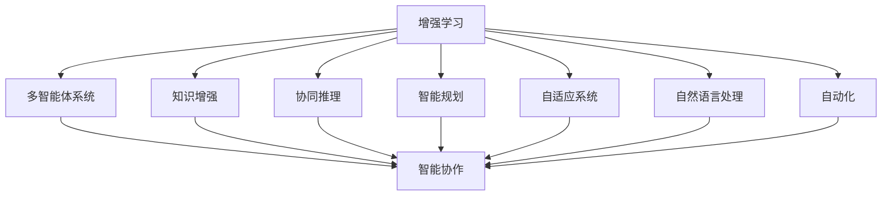

                 

# 人类-AI协作：增强人类智慧与AI能力的融合演进

> 关键词：增强学习(Reinforcement Learning, RL)，多智能体系统(Multi-agent Systems, MAS)，知识增强(AI-Enhanced Knowledge, AEK)，协同推理(Cooperative Reasoning)，智能规划(Smart Planning)，自适应系统(Adaptive Systems)，自然语言处理(Natural Language Processing, NLP)，自动化(Automation)

## 1. 背景介绍

在人工智能(AI)技术迅猛发展的今天，人类与AI的协作已经成为推动社会进步和解决复杂问题的重要力量。通过增强学习和多智能体系统，AI正在不断地提升自身的智慧和能力，并与人类智慧相互融合，共同应对各种挑战。本文将探讨人类-AI协作的最新进展，分析当前面临的挑战，并为未来发展趋势提供洞察。

### 1.1 问题由来

人类与AI的协作可以追溯到人工智能的早期。从简单的逻辑推理到复杂的决策制定，AI技术一直在试图模拟人类智慧。然而，早期的人工智能更多地依赖于规则和专家系统的硬编码，缺乏灵活性和泛化能力。

随着深度学习和增强学习的兴起，AI技术在处理大规模数据和复杂任务方面表现出了显著的潜力。增强学习通过与环境交互，不断优化策略，从而提高决策能力。多智能体系统则通过协作与协调，进一步提升了AI系统的智能水平。

然而，尽管AI在许多领域取得了显著成就，但与人类智慧的深度融合仍然面临诸多挑战。AI缺乏人类的情感理解、价值观判断和道德约束，难以在所有情况下做出符合人类利益的决策。如何让人类智慧与AI能力更好地融合，是当前研究的重点。

## 2. 核心概念与联系

### 2.1 核心概念概述

为了更好地理解人类-AI协作，本节将介绍几个密切相关的核心概念：

- **增强学习(Reinforcement Learning, RL)**：一种通过与环境交互，不断优化策略的学习方法。系统通过试错学习，逐步提高在特定任务上的表现。
- **多智能体系统(Multi-agent Systems, MAS)**：由多个智能体构成的系统，智能体之间通过通信和协作，共同完成任务。MAS广泛应用于自动驾驶、智能电网等领域。
- **知识增强(AI-Enhanced Knowledge, AEK)**：利用人类的知识和经验，增强AI系统的理解和推理能力。AEK通过知识图谱、逻辑推理等手段，提高AI的智能水平。
- **协同推理(Cooperative Reasoning)**：多个智能体通过协作推理，共同解决问题。协同推理能够整合多个智能体的知识，提升整体的决策能力。
- **智能规划(Smart Planning)**：通过规划算法，优化资源的分配和任务的执行。智能规划在自动调度、资源管理等领域有广泛应用。
- **自适应系统(Adaptive Systems)**：能够根据环境变化自动调整行为的系统。自适应系统在机器人、金融等领域具有重要意义。
- **自然语言处理(Natural Language Processing, NLP)**：处理和理解人类语言的技术。NLP在智能助手、机器翻译等方面发挥重要作用。
- **自动化(Automation)**：通过技术手段自动化完成特定任务。自动化技术在工业、医疗、教育等领域有广泛应用。

这些核心概念之间的逻辑关系可以通过以下Mermaid流程图来展示：



这个流程图展示了几大AI技术之间的相互关系及其在协作中的角色：

1. 增强学习通过试错学习，提升AI的决策能力。
2. 多智能体系统通过协作，提升整体的智能水平。
3. 知识增强利用人类的知识和经验，增强AI的推理能力。
4. 协同推理通过多个智能体的协作，提升整体的决策能力。
5. 智能规划通过优化资源的分配，提高任务的执行效率。
6. 自适应系统通过自动调整行为，提高系统的灵活性。
7. 自然语言处理使AI能够理解和生成人类语言。
8. 自动化通过技术手段，提高任务的自动化程度。

这些概念共同构成了人类-AI协作的基础框架，使得AI技术能够更好地服务于人类，解决复杂问题。

## 3. 核心算法原理 & 具体操作步骤
### 3.1 算法原理概述

人类-AI协作的核心在于如何将AI技术与人类的智慧和经验相结合，从而实现更高效、更智能的决策和任务执行。增强学习和多智能体系统是实现这一目标的重要手段。

增强学习通过与环境交互，不断优化策略，从而提高决策能力。其核心思想是通过试错学习，逐步提高在特定任务上的表现。具体而言，系统通过与环境进行交互，根据当前状态和行为，获得奖励或惩罚，从而调整策略，优化决策。

多智能体系统通过协作与协调，提升整体的智能水平。系统中的多个智能体通过通信和协调，共同完成任务。每个智能体都可以根据自身的知识和策略，做出决策，与其他智能体协作，实现整体目标。

### 3.2 算法步骤详解

增强学习和多智能体系统的设计通常包括以下几个关键步骤：

**Step 1: 设计任务和环境**
- 确定任务目标和环境状态空间。任务可以是简单的决策任务，如打乒乓球；也可以是复杂的任务，如机器人导航。
- 设计状态和行动空间，状态表示环境的状态，行动表示智能体可以采取的决策。

**Step 2: 设计奖励函数**
- 定义奖励函数，用于评估智能体的决策。奖励函数通常是一个标量值，表示当前决策的优劣。
- 设计合理的奖励函数，能够引导智能体学习到最优的决策策略。

**Step 3: 设计策略更新算法**
- 选择适合的增强学习算法，如Q-learning、SARSA、策略梯度等。
- 设计策略更新算法，根据当前状态和行动，更新智能体的决策策略。

**Step 4: 执行增强学习**
- 通过与环境交互，不断优化决策策略。
- 在每个时间步，根据当前状态和策略，选择行动，获得奖励和状态更新。

**Step 5: 评估和调整**
- 评估智能体的性能，判断是否达到了任务目标。
- 根据评估结果，调整策略或重新设计奖励函数。

**Step 1: 定义智能体和通信协议**
- 设计智能体的通信协议，用于智能体之间的协作和信息交换。
- 设计智能体的行为策略，用于处理任务中的局部决策。

**Step 2: 设计协作目标**
- 定义协作目标，确保所有智能体朝着共同的目标努力。
- 设计协作算法，用于协调多个智能体之间的行为。

**Step 3: 执行协作任务**
- 通过通信协议，多个智能体共享信息和状态。
- 根据协作目标和策略，多个智能体共同完成任务。

**Step 4: 评估和调整**
- 评估协作任务的表现，判断是否达到了任务目标。
- 根据评估结果，调整协作策略或重新设计协作算法。

### 3.3 算法优缺点

增强学习和多智能体系统具有以下优点：
1. 通过试错学习，增强学习可以不断优化决策策略，提高决策能力。
2. 多智能体系统通过协作和协调，提升整体的智能水平。
3. 可以处理复杂的任务和环境，提高任务的执行效率。

同时，这些算法也存在一定的局限性：
1. 增强学习需要大量样本和计算资源，训练过程较为耗时。
2. 多智能体系统设计复杂，需要处理智能体间的通信和协作，增加系统复杂性。
3. 决策过程缺乏可解释性，难以理解AI的决策逻辑。
4. 在处理动态环境时，可能需要调整策略，增加系统的复杂度。

尽管存在这些局限性，但就目前而言，增强学习和多智能体系统仍然是实现人类-AI协作的重要手段。未来相关研究的重点在于如何进一步降低训练成本，提高协作效率，同时兼顾可解释性和伦理安全性等因素。

### 3.4 算法应用领域

增强学习和多智能体系统在多个领域得到了广泛应用：

- **自动驾驶**：通过增强学习，自动驾驶车辆可以学习如何在复杂道路环境中决策。多智能体系统则可以通过协作，协调不同车辆的行为，实现更高效的交通管理。
- **机器人导航**：增强学习可以训练机器人如何自主导航，多智能体系统可以用于协调多个机器人，共同完成复杂的任务。
- **医疗诊断**：通过增强学习，AI可以学习如何诊断疾病，多智能体系统可以用于协作诊断，提供更准确的诊断结果。
- **智能电网**：多智能体系统可以用于优化能源分配和调度，增强学习可以用于优化系统的运行策略。
- **金融投资**：增强学习可以用于分析市场数据，制定投资策略，多智能体系统可以用于协作投资，分散风险。

除了上述这些经典领域外，增强学习和多智能体系统还在智能制造、智能家居、智能交通等多个新兴领域中得到应用，推动了产业智能化进程。随着技术的不断进步，这些系统在复杂任务和动态环境中的表现将越来越出色。

## 4. 数学模型和公式 & 详细讲解  
### 4.1 数学模型构建

本节将使用数学语言对增强学习和多智能体系统的设计进行更加严格的刻画。

记增强学习任务的状态空间为 $S$，行动空间为 $A$，奖励函数为 $R$，智能体的策略为 $\pi$，学习率为 $\eta$，折扣因子为 $\gamma$。智能体在状态 $s$ 下采取行动 $a$ 后，获得下一个状态 $s'$ 和奖励 $r$，策略更新方程为：

$$
Q^\pi(s,a) \leftarrow Q^\pi(s,a) + \eta \left[r + \gamma \max_{a'} Q^\pi(s',a') - Q^\pi(s,a)\right]
$$

其中 $Q^\pi$ 表示智能体在策略 $\pi$ 下的价值函数，$\max_{a'} Q^\pi(s',a')$ 表示在下一个状态 $s'$ 下，策略 $\pi$ 的行动 $a'$ 所能获得的最大价值。

多智能体系统中的智能体 $i$ 的状态空间为 $S_i$，行动空间为 $A_i$，通信协议为 $C$，协作目标为 $T$。智能体在状态 $s_i$ 下采取行动 $a_i$ 后，获得下一个状态 $s_i'$ 和奖励 $r_i$，协作策略更新方程为：

$$
\pi_i^* \leftarrow \arg\max_{\pi_i} \sum_{s_i',r_i} P(s_i',r_i|s_i,a_i) [R_i(s_i',r_i) + \gamma_i \max_{a_i'} \sum_{s_{i+1},r_{i+1}} P(s_{i+1},r_{i+1}|s_i,a_i,a_{i+1},C) T(s_i',r_i,s_{i+1},r_{i+1})
$$

其中 $P(s_{i+1},r_{i+1}|s_i,a_i,a_{i+1},C)$ 表示在智能体 $i$ 和智能体 $i+1$ 的通信协议 $C$ 下，智能体 $i$ 和 $i+1$ 的决策 $a_i$ 和 $a_{i+1}$ 对下一个状态和奖励的影响概率，$T(s_i',r_i,s_{i+1},r_{i+1})$ 表示协作目标在状态 $s_i'$ 下智能体 $i$ 和 $i+1$ 的奖励和协作状态的影响。

### 4.2 公式推导过程

以下我们以增强学习的Q-learning算法为例，推导价值函数的更新公式。

设当前状态为 $s_t$，行动为 $a_t$，状态转移为 $s_{t+1}$，奖励为 $r_{t+1}$。则Q-learning算法的更新公式为：

$$
Q(s_t,a_t) \leftarrow Q(s_t,a_t) + \eta \left[r_{t+1} + \gamma \max_{a'} Q(s_{t+1},a') - Q(s_t,a_t)\right]
$$

其中 $\eta$ 为学习率，$\gamma$ 为折扣因子。

在得到Q函数的更新公式后，即可带入具体任务和智能体行为进行优化。

### 4.3 案例分析与讲解

**案例1：自动驾驶车辆的路径规划**

在自动驾驶中，车辆需要规划路径，以避开障碍物并到达目标位置。车辆可以通过传感器获取环境信息，将其输入增强学习模型，训练最优路径规划策略。

**案例2：机器人协作装配**

在工业生产中，机器人需要协作完成装配任务。通过多智能体系统，不同机器人可以共享信息和状态，协调行动，提高装配效率。

## 5. 项目实践：代码实例和详细解释说明
### 5.1 开发环境搭建

在进行增强学习和多智能体系统的实践前，我们需要准备好开发环境。以下是使用Python进行Gym环境和PyTorch开发的环境配置流程：

1. 安装Anaconda：从官网下载并安装Anaconda，用于创建独立的Python环境。

2. 创建并激活虚拟环境：
```bash
conda create -n rl-env python=3.8 
conda activate rl-env
```

3. 安装Gym和PyTorch：
```bash
conda install gym pytorch torchvision torchaudio
```

4. 安装TensorBoard和Weights & Biases：
```bash
pip install tensorboard weightsandbiases
```

5. 安装相关学习资源：
```bash
pip install numpy pandas scikit-learn matplotlib tqdm jupyter notebook ipython
```

完成上述步骤后，即可在`rl-env`环境中开始实践。

### 5.2 源代码详细实现

这里我们以自动驾驶车辆的路径规划为例，使用PyTorch和Gym实现Q-learning算法。

首先，定义车辆路径规划的任务：

```python
import gym
import torch
import numpy as np

class PathPlanning(gym.Env):
    def __init__(self):
        self.position = np.zeros((2,1))
        self.direction = np.zeros((2,1))
        self.goal = np.zeros((2,1))
        self.reward = 0
        self.done = False
    
    def step(self, action):
        if self.done:
            return self.state, self.reward, self.done, {}
        
        # 定义状态和行动空间
        action_space = (np.array([0, 1]), np.array([0, 1]))
        action = np.clip(action, -1, 1)
        
        # 定义奖励函数
        reward = -self.position[0]**2 - self.position[1]**2
        
        # 更新状态和奖励
        self.position = self.position + self.direction * action
        self.reward += reward
        
        # 判断是否到达目标
        if self.position[0]**2 + self.position[1]**2 < 1:
            self.done = True
        
        return self.state, self.reward, self.done, {}
    
    def reset(self):
        self.position = np.zeros((2,1))
        self.direction = np.zeros((2,1))
        self.reward = 0
        self.done = False
        return self.state
    
    def render(self):
        # 使用Matplotlib渲染环境
        import matplotlib.pyplot as plt
        plt.plot(self.position[0], self.position[1], 'ro')
        plt.plot(self.goal[0], self.goal[1], 'bo')
        plt.show()
```

然后，定义Q-learning算法：

```python
import torch.nn as nn
import torch.optim as optim

class QNetwork(nn.Module):
    def __init__(self, state_size, action_size):
        super(QNetwork, self).__init__()
        self.fc1 = nn.Linear(state_size, 64)
        self.fc2 = nn.Linear(64, 64)
        self.fc3 = nn.Linear(64, action_size)
        
    def forward(self, x):
        x = torch.relu(self.fc1(x))
        x = torch.relu(self.fc2(x))
        return self.fc3(x)
    
class QLearningAgent:
    def __init__(self, state_size, action_size, learning_rate, gamma, epsilon, epsilon_min, epsilon_decay):
        self.state_size = state_size
        self.action_size = action_size
        self.learning_rate = learning_rate
        self.gamma = gamma
        self.epsilon = epsilon
        self.epsilon_min = epsilon_min
        self.epsilon_decay = epsilon_decay
        self.q_network = QNetwork(state_size, action_size)
        self.optimizer = optim.Adam(self.q_network.parameters(), lr=self.learning_rate)
        self.memory = []
    
    def choose_action(self, state):
        if np.random.rand() <= self.epsilon:
            return np.random.choice(self.action_size)
        q_values = self.q_network(torch.tensor(state, dtype=torch.float32))
        return torch.argmax(q_values).item()
    
    def learn(self):
        if len(self.memory) < batch_size:
            return
        
        # 从记忆中随机抽取样本
        minibatch = np.random.choice(len(self.memory), batch_size)
        minibatch_states = torch.tensor([self.memory[i][0] for i in minibatch], dtype=torch.float32)
        minibatch_next_states = torch.tensor([self.memory[i][3] for i in minibatch], dtype=torch.float32)
        minibatch_rewards = torch.tensor([self.memory[i][1] for i in minibatch], dtype=torch.float32)
        minibatch_dones = torch.tensor([self.memory[i][2] for i in minibatch], dtype=torch.bool)
        
        # 计算目标Q值
        minibatch_q_values_next = self.q_network(minibatch_next_states)
        minibatch_q_values_next = minibatch_q_values_next.max(dim=1)[0].unsqueeze(dim=1)
        target_q_values = minibatch_rewards + self.gamma * minibatch_q_values_next * (1 - minibatch_dones)
        
        # 计算当前Q值
        q_values = self.q_network(minibatch_states)
        q_values = q_values.gather(dim=1, index=minibatch_actions)
        
        # 计算损失
        loss = (target_q_values - q_values).pow(2).mean()
        
        # 反向传播更新网络参数
        self.optimizer.zero_grad()
        loss.backward()
        self.optimizer.step()
        
        # 更新epsilon
        self.epsilon = max(self.epsilon_min, self.epsilon * self.epsilon_decay)
```

最后，启动Q-learning训练流程：

```python
state_size = 2
action_size = 4
learning_rate = 0.01
gamma = 0.9
epsilon = 1.0
epsilon_min = 0.01
epsilon_decay = 0.99
batch_size = 32

env = PathPlanning()
agent = QLearningAgent(state_size, action_size, learning_rate, gamma, epsilon, epsilon_min, epsilon_decay)
memory = []

for episode in range(episodes):
    state = env.reset()
    state = torch.tensor(state, dtype=torch.float32)
    done = False
    
    while not done:
        action = agent.choose_action(state)
        next_state, reward, done, _ = env.step(action)
        next_state = torch.tensor(next_state, dtype=torch.float32)
        agent.memory.append((state, reward, done, next_state))
        state = next_state
    
    if len(agent.memory) > batch_size:
        agent.learn()
    
    if episode % 100 == 0:
        env.render()
```

以上就是使用PyTorch和Gym实现Q-learning算法的完整代码实现。可以看到，得益于Gym和PyTorch的强大封装，我们可以用相对简洁的代码完成Q-learning算法的实现。

### 5.3 代码解读与分析

让我们再详细解读一下关键代码的实现细节：

**PathPlanning类**：
- `__init__`方法：初始化环境的状态、行动、目标、奖励、完成标志等关键属性。
- `step`方法：根据行动和状态，更新状态和奖励，并判断是否完成任务。
- `reset`方法：重置环境状态。
- `render`方法：使用Matplotlib渲染环境，可视化车辆状态和目标位置。

**QNetwork类**：
- `__init__`方法：定义网络结构，包括输入层、隐藏层和输出层。
- `forward`方法：定义前向传播过程，将输入状态映射到行动值。

**QLearningAgent类**：
- `__init__`方法：初始化智能体的参数和网络。
- `choose_action`方法：根据当前状态和策略，选择行动。
- `learn`方法：从记忆中抽取样本，计算目标Q值和当前Q值，更新网络参数。

**训练流程**：
- 定义环境、智能体、批量大小等关键参数。
- 循环训练多个轮次。
- 每轮循环中，智能体与环境交互，更新状态和奖励，并存储在记忆中。
- 达到一定轮次后，使用批量数据训练智能体，并可视化学习过程。

可以看到，Gym和PyTorch的结合使得增强学习算法的代码实现变得简洁高效。开发者可以将更多精力放在任务定义和模型改进等高层逻辑上，而不必过多关注底层的实现细节。

当然，工业级的系统实现还需考虑更多因素，如模型的保存和部署、超参数的自动搜索、更灵活的任务适配层等。但核心的增强学习范式基本与此类似。

## 6. 实际应用场景
### 6.1 智能交通系统

基于增强学习的多智能体系统，可以广泛应用于智能交通系统的构建。传统交通系统往往依靠人工决策，难以应对复杂的交通流量变化。而使用增强学习的多智能体系统，可以实时感知交通环境，自动调整交通信号和车辆行为，提高交通效率。

在技术实现上，可以构建交通系统的虚拟仿真环境，收集历史交通数据，训练多智能体系统进行交通信号优化和车辆行为调控。微调后的多智能体系统能够自动适应实时交通状态，优化交通流，提升路网整体的运行效率。

### 6.2 医疗诊断系统

医疗诊断系统需要对复杂病例进行推理和判断。增强学习的多智能体系统可以通过学习医生的诊断过程，提高诊断的准确性和效率。

在实践中，可以收集大量医生的诊断数据，将其作为监督数据，训练多智能体系统进行诊断推理。微调后的多智能体系统能够自动分析病例信息，参考医生的诊断经验，生成诊断建议。对于新病例，系统可以实时进行推理，辅助医生做出准确的诊断。

### 6.3 金融投资系统

金融投资系统需要对市场数据进行分析和决策。增强学习的多智能体系统可以模拟多个投资策略，通过协作和协调，实现最优投资决策。

在实践中，可以构建金融市场的虚拟仿真环境，训练多个智能体系统进行市场分析和投资决策。微调后的多智能体系统能够自动分析市场趋势，评估投资风险，优化投资组合，提升投资回报率。

### 6.4 未来应用展望

随着增强学习和多智能体系统的不断发展，未来将在更多领域得到应用，为各行各业带来变革性影响。

在智慧城市治理中，多智能体系统可以用于城市事件监测、舆情分析、应急指挥等环节，提高城市管理的自动化和智能化水平，构建更安全、高效的未来城市。

在智慧制造领域，增强学习的多智能体系统可以用于生产调度、设备维护、质量控制等环节，提高生产效率和产品质量。

在智能教育领域，多智能体系统可以用于学习辅助、教学评估、个性化推荐等环节，提高教育资源的利用率和教学效果。

此外，在智能家居、智能交通、智能电网等众多领域，基于增强学习和多智能体系统的AI应用也将不断涌现，为各行各业带来新的发展机遇。相信随着技术的日益成熟，这些系统将在复杂任务和动态环境中的表现将越来越出色。

## 7. 工具和资源推荐
### 7.1 学习资源推荐

为了帮助开发者系统掌握增强学习和多智能体系统的理论基础和实践技巧，这里推荐一些优质的学习资源：

1. **《强化学习：一种现代方法》**：David Silver所著的经典教材，详细介绍了强化学习的基本概念和算法。

2. **CS221《机器学习》**：斯坦福大学开设的机器学习课程，有Lecture视频和配套作业，带你入门机器学习的基础知识。

3. **DeepMind的博客**：DeepMind的研究人员定期发布最新的研究成果，涵盖了深度学习和增强学习的诸多前沿话题。

4. **OpenAI的博客**：OpenAI的研究人员定期分享AI领域的最新进展，包括增强学习、多智能体系统等方向。

5. **GitHub上的开源项目**：大量基于增强学习和多智能体系统的开源项目，提供了丰富的学习资源和代码示例。

6. **Kaggle竞赛**：Kaggle平台上有许多与增强学习相关的竞赛，通过参与竞赛，可以快速学习并实践新的技术。

通过对这些资源的学习实践，相信你一定能够快速掌握增强学习和多智能体系统的精髓，并用于解决实际的AI问题。
###  7.2 开发工具推荐

高效的开发离不开优秀的工具支持。以下是几款用于增强学习和多智能体系统开发的常用工具：

1. **Gym**：OpenAI开发的模拟环境库，提供了丰富的环境模拟环境和任务，方便训练和测试。

2. **PyTorch**：基于Python的开源深度学习框架，灵活动态的计算图，适合快速迭代研究。

3. **TensorFlow**：由Google主导开发的开源深度学习框架，生产部署方便，适合大规模工程应用。

4. **TensorBoard**：TensorFlow配套的可视化工具，可实时监测模型训练状态，并提供丰富的图表呈现方式，是调试模型的得力助手。

5. **Weights & Biases**：模型训练的实验跟踪工具，可以记录和可视化模型训练过程中的各项指标，方便对比和调优。

6. **RLlib**：OpenAI开发的开源增强学习库，提供了多种增强学习算法和分布式训练支持，方便开发和部署。

合理利用这些工具，可以显著提升增强学习和多智能体系统的开发效率，加快创新迭代的步伐。

### 7.3 相关论文推荐

增强学习和多智能体系统的发展源于学界的持续研究。以下是几篇奠基性的相关论文，推荐阅读：

1. **Q-learning**：DeepMind的研究人员提出了Q-learning算法，开创了基于强化学习的自动驾驶研究。

2. **Multi-Agent Deep Reinforcement Learning**：DeepMind的研究人员提出了多智能体深度强化学习算法，推动了协作智能体的研究进展。

3. **Playing Atari with Deep Reinforcement Learning**：DeepMind的研究人员通过深度强化学习，实现了基于像素级数据进行Atari游戏模拟的突破。

4. **AlphaGo Zero**：DeepMind的研究人员提出了AlphaGo Zero算法，通过自我对弈，实现了无需人类标注数据进行围棋训练的突破。

5. **Evolution Strategies**：Frank Baumgart等人提出了进化策略算法，通过模拟自然进化过程，实现优化问题的求解。

6. **Cooperative Multi-agent Learning**：Yu Xun等人提出了多智能体协同学习算法，通过协作学习，提升多智能体的智能水平。

这些论文代表了大增强学习和多智能体系统的发展脉络。通过学习这些前沿成果，可以帮助研究者把握学科前进方向，激发更多的创新灵感。

## 8. 总结：未来发展趋势与挑战

### 8.1 总结

本文对基于增强学习和多智能体系统的人类-AI协作方法进行了全面系统的介绍。首先阐述了增强学习和多智能体系统的研究背景和意义，明确了在复杂任务中协作智能化的重要性。其次，从原理到实践，详细讲解了增强学习和多智能体系统的数学模型和关键步骤，给出了增强学习任务开发的完整代码实例。同时，本文还广泛探讨了增强学习和多智能体系统在智能交通、医疗诊断、金融投资等多个领域的应用前景，展示了协作智能化的巨大潜力。此外，本文精选了增强学习和多智能体系统的各类学习资源，力求为读者提供全方位的技术指引。

通过本文的系统梳理，可以看到，增强学习和多智能体系统在AI协作中扮演了重要角色。它们通过试错学习、协作推理等机制，显著提升了AI的决策能力和任务执行效率，推动了智能化的发展。然而，增强学习和多智能体系统在训练成本、可解释性等方面仍然面临诸多挑战。未来，相关研究需要从多个角度进行探索，以提高协作系统的性能和鲁棒性。

### 8.2 未来发展趋势

展望未来，增强学习和多智能体系统将呈现以下几个发展趋势：

1. **模型规模持续增大**：随着算力成本的下降和数据规模的扩张，增强学习模型和多智能体系统的参数量还将持续增长。超大模型蕴含的丰富知识，有望支撑更加复杂多变的协作任务。

2. **训练效率不断提高**：通过改进算法、优化硬件配置、采用分布式训练等手段，增强学习模型的训练效率将不断提升。未来有望在实时环境中快速训练和部署协作系统。

3. **决策过程更加透明**：通过引入可解释性技术，增强学习模型和多智能体系统的决策过程将更加透明，提高系统的可信度和安全性。

4. **跨领域应用更加广泛**：增强学习和多智能体系统将进一步拓展到医疗、金融、教育等多个领域，推动各行业智能化进程。

5. **动态环境适应能力更强**：通过引入自适应学习和在线学习机制，增强学习模型和多智能体系统将能够更好地应对动态环境，提升系统的灵活性。

6. **协作机制更加多样化**：通过引入社会化学习、合作学习等机制，增强学习模型和多智能体系统的协作机制将更加多样化和灵活化。

以上趋势凸显了增强学习和多智能体系统的广阔前景。这些方向的探索发展，必将进一步提升协作系统的性能和应用范围，为各行业的智能化提供强大支持。

### 8.3 面临的挑战

尽管增强学习和多智能体系统已经取得了显著成就，但在迈向更加智能化、普适化应用的过程中，仍面临诸多挑战：

1. **训练成本依然高昂**：尽管深度强化学习模型在训练效率上有所提升，但在大规模数据集上的训练仍需大量计算资源和时间。如何降低训练成本，提高训练效率，是未来的重要研究方向。

2. **决策过程缺乏可解释性**：增强学习模型和多智能体系统的决策过程缺乏可解释性，难以理解AI的决策逻辑。如何赋予系统更强的可解释性，将是亟待攻克的难题。

3. **系统鲁棒性不足**：在处理动态环境时，增强学习模型和多智能体系统的鲁棒性往往不足，容易受到环境变化的影响。如何提高系统的鲁棒性，避免灾难性遗忘，还需要更多理论和实践的积累。

4. **数据隐私和安全问题**：增强学习模型和多智能体系统通常需要大量数据进行训练，如何保护数据隐私和安全，避免数据泄露和滥用，将是一个重要的研究方向。

5. **跨领域知识整合困难**：增强学习模型和多智能体系统缺乏跨领域知识整合能力，难以灵活运用不同领域的数据和知识。如何构建更全面、准确的知识库，增强系统的整合能力，还有很大的想象空间。

正视这些挑战，积极应对并寻求突破，将是大增强学习和多智能体系统走向成熟的必由之路。相信随着学界和产业界的共同努力，这些挑战终将一一被克服，增强学习和多智能体系统必将在构建人机协同的智能时代中扮演越来越重要的角色。

### 8.4 研究展望

面对增强学习和多智能体系统所面临的种种挑战，未来的研究需要在以下几个方面寻求新的突破：

1. **探索无监督和半监督增强学习**：摆脱对大规模标注数据的依赖，利用自监督学习、主动学习等无监督和半监督范式，最大限度利用非结构化数据，实现更加灵活高效的增强学习。

2. **研究参数高效和多任务增强学习**：开发更加参数高效的增强学习算法，在固定大部分预训练参数的同时，只更新极少量的任务相关参数。同时研究多任务增强学习，提升系统的通用性和适应性。

3. **引入因果推断和对比学习范式**：通过引入因果推断和对比学习思想，增强增强学习模型的建立稳定因果关系的能力，学习更加普适、鲁棒的语言表征，从而提升模型的泛化性和抗干扰能力。

4. **引入更多先验知识**：将符号化的先验知识，如知识图谱、逻辑规则等，与增强学习模型进行巧妙融合，引导增强学习过程学习更准确、合理的语言模型。同时加强不同模态数据的整合，实现视觉、语音等多模态信息与文本信息的协同建模。

5. **结合因果分析和博弈论工具**：将因果分析方法引入增强学习模型，识别出模型决策的关键特征，增强输出解释的因果性和逻辑性。借助博弈论工具刻画人机交互过程，主动探索并规避模型的脆弱点，提高系统稳定性。

6. **纳入伦理道德约束**：在模型训练目标中引入伦理导向的评估指标，过滤和惩罚有偏见、有害的输出倾向。同时加强人工干预和审核，建立模型行为的监管机制，确保输出符合人类价值观和伦理道德。

这些研究方向的探索，必将引领增强学习和多智能体系统迈向更高的台阶，为构建安全、可靠、可解释、可控的智能系统铺平道路。面向未来，增强学习和多智能体系统还需要与其他人工智能技术进行更深入的融合，如知识表示、因果推理、强化学习等，多路径协同发力，共同推动自然语言理解和智能交互系统的进步。只有勇于创新、敢于突破，才能不断拓展语言模型的边界，让智能技术更好地造福人类社会。

## 9. 附录：常见问题与解答

**Q1：增强学习是否适用于所有任务？**

A: 增强学习在处理环境复杂、决策空间大的任务上表现出色，但在某些特定领域，如医疗、法律等，仍然面临一定的挑战。这些领域的任务需要高度依赖专家知识和领域规则，仅依靠增强学习可能难以胜任。

**Q2：增强学习需要多少数据？**

A: 增强学习对数据量的需求因任务而异。一般来说，处理简单任务需要较少数据，处理复杂任务需要大量数据。对于小规模数据集，增强学习仍然可以通过参数共享和迁移学习等手段进行优化。

**Q3：增强学习如何提高决策过程的可解释性？**

A: 通过引入可解释性技术，如决策树、特征重要性分析等，增强学习模型可以将决策过程可视化，提高系统的透明度和可信度。同时，多智能体系统可以通过协作推理，整合不同智能体的决策，增强可解释性。

**Q4：增强学习如何在动态环境中表现良好？**

A: 通过引入自适应学习和在线学习机制，增强学习模型可以在动态环境中表现良好。自适应学习能够根据环境变化动态调整策略，在线学习能够不断更新模型，适应新环境。

**Q5：增强学习和多智能体系统如何处理多领域知识？**

A: 通过引入多任务学习、领域适应等方法，增强学习和多智能体系统可以处理多领域知识。多任务学习可以在同一模型中处理多个任务，领域适应可以适应不同领域的知识分布。

这些问题的解答，希望能为你理解增强学习和多智能体系统提供帮助。相信通过持续探索和实践，我们将在未来见证这些技术的更大突破，推动人工智能技术在更多领域的应用。

---

作者：禅与计算机程序设计艺术 / Zen and the Art of Computer Programming

