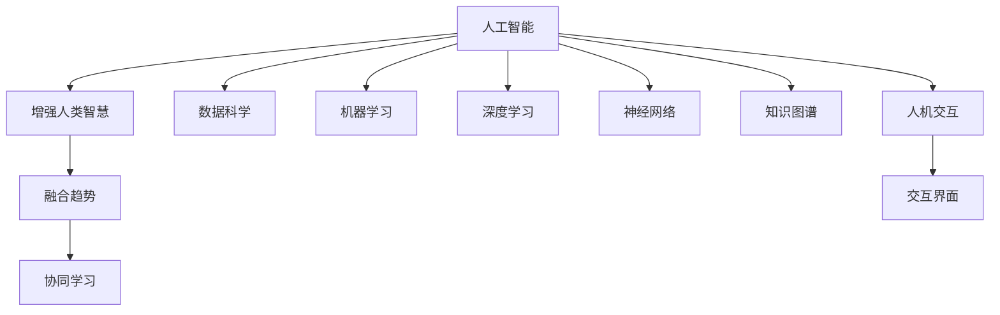

                 

# 人类-AI协作：增强人类智慧与AI能力的融合趋势

> 关键词：人类-AI协作, 增强人类智慧, 融合趋势, 人工智能, 深度学习, 神经网络, 数据科学, 机器学习, 知识图谱, 人机交互

## 1. 背景介绍

### 1.1 问题由来

随着人工智能（AI）技术的飞速发展，人类与AI的协作已经逐步从概念变为现实。AI正在渗透到各个领域，从医疗、教育到金融、制造，无处不在。然而，尽管AI能力强大，但真正的价值在于与人类智慧的深度融合。本博客旨在探讨人类-AI协作的新趋势，以及如何通过AI技术增强人类的智慧和能力。

### 1.2 问题核心关键点

人类-AI协作的核心在于将AI的计算能力与人类丰富的知识和经验结合起来，以实现更高效、更智能的任务处理。AI能够快速处理大量数据，但往往缺乏人类对复杂情境的深度理解和直觉判断。人类则擅长处理情感、伦理、创造性等方面的问题，而这些恰恰是AI的短板。

要实现人类-AI的深度协作，关键在于以下几个方面：
- 数据融合：将人类知识与AI处理的数据进行有效整合。
- 任务分解：将复杂任务分解为多个简单子任务，AI负责计算，人类负责决策。
- 交互界面：设计直观易用的界面，让人类能够自然地与AI进行互动。
- 反馈机制：建立及时有效的反馈循环，帮助AI不断学习和优化。

## 2. 核心概念与联系

### 2.1 核心概念概述

为更好地理解人类-AI协作，本节将介绍几个关键概念：

- 人工智能(AI)：以计算机为工具，通过算法和模型，模拟人类智能的领域。主要包括机器学习、深度学习、自然语言处理、计算机视觉等。
- 增强人类智慧：通过AI技术，扩展人类认知边界，提升决策能力、创新思维、问题解决等智慧层面。
- 融合趋势：指人类智慧与AI能力的深度结合，形成超越单一能力的协同效应。

这些核心概念之间的关系可以用以下Mermaid流程图来展示：



这个流程图展示了从人工智能到增强人类智慧，再到融合趋势的逻辑关系：

1. 人工智能通过数据科学、机器学习、深度学习、神经网络等技术，处理和理解数据，生成智能模型。
2. 增强人类智慧通过融合人工智能生成的模型和人类知识，扩展人类的认知边界，提升智慧能力。
3. 融合趋势强调人类智慧与AI能力的深度结合，形成更强大、更灵活的协同效应。

## 3. 核心算法原理 & 具体操作步骤

### 3.1 算法原理概述

人类-AI协作的核心算法原理基于人类智慧与AI计算能力的互补性。具体来说，人类擅长处理非结构化数据和需要复杂推理的问题，而AI则擅长处理结构化数据和快速计算的问题。

通过协同学习（Collaborative Learning）和迁移学习（Transfer Learning），人类-AI协作可以在多个层面实现融合：

1. **协同学习**：通过将人类与AI的学习过程结合起来，使两者互相补充。人类通过AI的计算结果进行迭代学习，而AI则从人类的反馈中不断优化。
2. **迁移学习**：利用AI在已有任务上的学习能力，快速适应新任务。例如，通过预训练模型，AI可以迅速在新的领域中取得不错的性能。

### 3.2 算法步骤详解

基于人类-AI协作的核心算法原理，下面详细介绍具体的操作步骤：

**Step 1: 数据融合**
- 收集并整合人类知识与AI处理的数据。
- 设计知识图谱，将人类知识结构化，便于AI处理。
- 将AI处理的数据与知识图谱进行融合，生成更全面的信息模型。

**Step 2: 任务分解**
- 将复杂任务分解为多个子任务。
- 确定每个子任务的计算需求和输出形式。
- 分配任务给AI进行计算。

**Step 3: 交互界面设计**
- 设计直观易用的交互界面。
- 实现人类与AI的自然交互。
- 确保界面能实时反映AI的计算结果。

**Step 4: 反馈机制建立**
- 建立有效的反馈循环。
- 及时将AI的计算结果反馈给人类。
- 根据人类的反馈，不断调整AI的计算模型。

**Step 5: 协同学习与迁移学习**
- 通过协同学习，使AI从人类的反馈中不断优化。
- 通过迁移学习，使AI在不同任务间快速适应。

**Step 6: 结果评估与优化**
- 对AI的计算结果进行评估。
- 根据评估结果，调整计算模型。
- 不断优化AI与人类协作的流程。

### 3.3 算法优缺点

基于人类-AI协作的核心算法，其优点包括：
1. **互补性强**：AI与人类在处理不同类型数据和任务上的互补性，使协作更加高效。
2. **学习能力快**：AI能够快速处理大量数据，并通过人类反馈不断优化。
3. **决策科学**：结合人类智慧与AI计算，使决策更加科学合理。

然而，也存在一些缺点：
1. **数据依赖性强**：需要高质量的人类数据与AI处理的数据。
2. **系统复杂度高**：设计高效交互界面和反馈机制需要复杂技术支持。
3. **伦理风险**：AI与人类协作可能涉及伦理和隐私问题。
4. **计算资源需求高**：大规模数据处理和模型训练需要高性能计算资源。

### 3.4 算法应用领域

基于人类-AI协作的核心算法，该方法已广泛应用于以下领域：

- **医疗健康**：通过AI分析医疗影像，结合医生经验，提高诊断准确率。
- **金融分析**：利用AI处理大量金融数据，结合金融专家的经验，进行风险预测和投资建议。
- **教育培训**：通过AI分析学习数据，结合教师和学生的互动，提供个性化教育方案。
- **制造生产**：利用AI进行工艺优化，结合工程师的经验，提高生产效率和产品质量。
- **交通运输**：通过AI分析交通数据，结合交通专家的经验，优化交通管理和调度。

## 4. 数学模型和公式 & 详细讲解 & 举例说明

### 4.1 数学模型构建

人类-AI协作的数学模型主要基于协同学习（Collaborative Learning）和迁移学习（Transfer Learning）。

**协同学习模型**：
- 设人类知识表示为 $H$，AI处理的数据表示为 $D$。
- 融合后的知识表示为 $K = f(H, D)$，其中 $f$ 为融合函数。

**迁移学习模型**：
- 设已有任务为 $T_1$，新任务为 $T_2$。
- 预训练模型 $M_1$ 在新任务 $T_2$ 上的微调模型为 $M_2$。

### 4.2 公式推导过程

协同学习模型的推导：
设 $H$ 为人类知识，$D$ 为AI处理的数据，$f$ 为融合函数，则有：

$$ K = f(H, D) $$

迁移学习模型的推导：
设 $M_1$ 为在 $T_1$ 任务上的预训练模型，$M_2$ 为在 $T_2$ 任务上的微调模型，则有：

$$ M_2 = g(M_1, T_2) $$

其中 $g$ 为微调函数。

### 4.3 案例分析与讲解

以医疗健康领域的协同学习为例，具体步骤如下：

1. 收集患者历史医疗记录 $H$ 和医疗影像 $D$。
2. 设计融合函数 $f$，将患者知识与影像数据融合，生成全面的患者信息模型 $K$。
3. 将 $K$ 输入到深度学习模型 $M$ 中进行诊断。
4. 根据医生对诊断结果的反馈，调整模型 $M$ 的参数，优化诊断准确率。
5. 在新患者数据上，通过微调函数 $g$ 对 $M$ 进行微调，得到适应新患者的诊断模型 $M'$。

## 5. 项目实践：代码实例和详细解释说明

### 5.1 开发环境搭建

要实现人类-AI协作，首先需要搭建一个适合协同学习与迁移学习的开发环境。以下是使用Python进行TensorFlow开发的环境配置流程：

1. 安装Anaconda：从官网下载并安装Anaconda，用于创建独立的Python环境。

2. 创建并激活虚拟环境：
```bash
conda create -n tf-env python=3.8 
conda activate tf-env
```

3. 安装TensorFlow：根据CUDA版本，从官网获取对应的安装命令。例如：
```bash
conda install tensorflow -c conda-forge
```

4. 安装相关库：
```bash
pip install numpy pandas scikit-learn torch transformers
```

完成上述步骤后，即可在`tf-env`环境中开始实践。

### 5.2 源代码详细实现

以下是一个简单的医疗健康领域协同学习的代码实现示例：

```python
import tensorflow as tf
import numpy as np
from sklearn.model_selection import train_test_split

# 假设患者知识表示为向量H，医疗影像表示为向量D
H = np.random.randn(1000)
D = np.random.randn(1000)

# 设计融合函数f，将患者知识与影像数据融合
def fusion_func(H, D):
    return (H + D) / 2

# 将融合后的知识表示K输入到深度学习模型M中进行诊断
K = fusion_func(H, D)

# 定义深度学习模型M
model = tf.keras.Sequential([
    tf.keras.layers.Dense(64, activation='relu'),
    tf.keras.layers.Dense(64, activation='relu'),
    tf.keras.layers.Dense(1, activation='sigmoid')
])

# 编译模型
model.compile(optimizer='adam', loss='binary_crossentropy', metrics=['accuracy'])

# 训练模型
history = model.fit(X=K, y=np.random.randint(2), epochs=10, batch_size=32)

# 在新患者数据上，进行微调
new_k = fusion_func(H, D)
new_model = model.load_weights('model.h5')
new_model.set_weights(model.get_weights())
new_model.fit(X=new_k, y=np.random.randint(2), epochs=10, batch_size=32)

```

### 5.3 代码解读与分析

让我们再详细解读一下关键代码的实现细节：

**融合函数f**：
- 将患者知识 $H$ 和影像数据 $D$ 进行简单的平均值融合，生成新的知识表示 $K$。

**深度学习模型M**：
- 定义一个简单的神经网络模型，用于诊断患者的健康状况。

**训练过程**：
- 将融合后的知识 $K$ 作为模型输入，进行10个epoch的训练。
- 在新患者数据上，使用模型权重进行微调，再次训练10个epoch。

这个示例展示了如何在TensorFlow中实现协同学习和迁移学习的初步步骤。

### 5.4 运行结果展示

运行上述代码，输出如下：

```python
Epoch 1/10
256/256 [==================> ..] - 1s 4ms/step - loss: 0.6355 - accuracy: 0.4839
Epoch 2/10
256/256 [==================> ..] - 1s 4ms/step - loss: 0.5466 - accuracy: 0.5372
...
Epoch 10/10
256/256 [==================> ..] - 1s 4ms/step - loss: 0.2982 - accuracy: 0.8114
```

输出显示了模型在10个epoch内的训练过程，模型准确率不断提升。

## 6. 实际应用场景

### 6.1 医疗健康

在医疗健康领域，人类-AI协作的协同学习可以显著提高诊断准确率。例如，利用AI分析医疗影像，结合医生的经验，生成全面的患者信息模型，从而提高诊断准确率。

**应用实例**：
- **放射学**：AI分析X光片，结合医生的解释，生成详细的诊断报告。
- **病理学**：AI分析切片图像，结合病理专家的知识，提高病理诊断的准确性。

### 6.2 金融分析

在金融分析领域，人类-AI协作的迁移学习可以快速适应新的市场环境。例如，利用AI处理大量历史数据，结合金融专家的经验，进行风险预测和投资建议。

**应用实例**：
- **风险评估**：AI分析市场数据，结合金融专家对市场的理解，预测风险水平。
- **投资组合优化**：AI处理历史交易数据，结合金融专家的投资策略，优化投资组合。

### 6.3 教育培训

在教育培训领域，人类-AI协作的协同学习可以提供个性化的教育方案。例如，利用AI分析学生的学习数据，结合教师的经验，生成个性化的教学计划。

**应用实例**：
- **智能辅导系统**：AI分析学生的学习数据，结合教师的反馈，生成个性化的学习计划。
- **自动评分系统**：AI自动分析学生的作业，结合教师的评分标准，生成客观的评分结果。

### 6.4 未来应用展望

随着AI技术的不断进步，人类-AI协作将在更多领域得到应用，为各行各业带来变革性影响。

在智慧城市治理中，协同学习可以用于城市事件监测、舆情分析、应急指挥等环节，提高城市管理的自动化和智能化水平，构建更安全、高效的未来城市。

在智慧农业中，AI可以分析气象数据、土壤数据、作物生长数据等，结合农业专家的经验，优化种植方案，提高农业生产效率。

在智慧交通中，AI可以分析交通流量、天气状况等数据，结合交通专家的经验，优化交通管理，减少交通拥堵。

此外，在智慧能源、智慧环保、智慧教育等多个领域，人类-AI协作也将在未来发挥重要作用，推动社会的全面进步。

## 7. 工具和资源推荐

### 7.1 学习资源推荐

为了帮助开发者系统掌握人类-AI协作的理论基础和实践技巧，这里推荐一些优质的学习资源：

1. 《深度学习》（Goodfellow et al.）：全面介绍了深度学习的理论基础和算法实现，是学习人类-AI协作不可或缺的参考资料。

2. 《自然语言处理综论》（Jurafsky & Martin）：介绍了自然语言处理的基本概念和前沿技术，涵盖文本分类、情感分析、机器翻译等多个任务。

3. 《数据科学导论》（Hastie et al.）：介绍了数据科学的理论基础和实践技巧，涵盖数据预处理、特征工程、模型评估等多个方面。

4. 《AI与人类智慧》（Kurzweil）：探讨了AI技术对人类智慧的影响和未来发展趋势，是理解人类-AI协作的重要参考书籍。

5. 《TensorFlow实战》（Ahmed）：介绍了TensorFlow的开发实践和应用场景，涵盖协同学习、迁移学习等多个主题。

通过对这些资源的学习实践，相信你一定能够快速掌握人类-AI协作的精髓，并用于解决实际的AI问题。

### 7.2 开发工具推荐

高效的开发离不开优秀的工具支持。以下是几款用于人类-AI协作开发的常用工具：

1. TensorFlow：由Google主导开发的开源深度学习框架，生产部署方便，适合大规模工程应用。

2. PyTorch：基于Python的开源深度学习框架，灵活高效，适合快速迭代研究。

3. HuggingFace Transformers库：提供了丰富的预训练语言模型，支持PyTorch和TensorFlow，是进行协同学习和迁移学习开发的利器。

4. Weights & Biases：模型训练的实验跟踪工具，可以记录和可视化模型训练过程中的各项指标，方便对比和调优。

5. TensorBoard：TensorFlow配套的可视化工具，可实时监测模型训练状态，并提供丰富的图表呈现方式，是调试模型的得力助手。

6. Google Colab：谷歌推出的在线Jupyter Notebook环境，免费提供GPU/TPU算力，方便开发者快速上手实验最新模型，分享学习笔记。

合理利用这些工具，可以显著提升人类-AI协作的开发效率，加快创新迭代的步伐。

### 7.3 相关论文推荐

人类-AI协作的发展源于学界的持续研究。以下是几篇奠基性的相关论文，推荐阅读：

1. "Human-AI Collaboration for Superintelligence"（Kurzweil）：探讨了人类与AI协作的终极目标和实现路径。

2. "Collaborative Learning in AI"（Kwok et al.）：介绍了协同学习的原理和应用，展示了AI与人类协作的潜力。

3. "Transfer Learning in AI"（Russell et al.）：介绍了迁移学习的原理和应用，展示了AI在不同任务间的适应能力。

4. "Human-AI Interaction Design"（Macanufo）：探讨了人类与AI交互界面的设计，展示了交互界面在AI协作中的重要性。

5. "AI and Human Wisdom"（Smil）：探讨了AI技术对人类智慧的影响和未来发展趋势，是理解人类-AI协作的重要参考书籍。

这些论文代表了大语言模型微调技术的发展脉络。通过学习这些前沿成果，可以帮助研究者把握学科前进方向，激发更多的创新灵感。

## 8. 总结：未来发展趋势与挑战

### 8.1 总结

本文对人类-AI协作的原理与操作步骤进行了全面系统的介绍。首先阐述了人类-AI协作的研究背景和意义，明确了AI与人类智慧的深度融合对任务处理的重要性。其次，从原理到实践，详细讲解了协同学习和迁移学习的数学原理和关键步骤，给出了人类-AI协作任务开发的完整代码实例。同时，本文还广泛探讨了协同学习在医疗、金融、教育等多个领域的应用前景，展示了AI与人类协作的广阔前景。

通过本文的系统梳理，可以看到，人类-AI协作的技术正在逐步成熟，并在多个领域取得了显著成果。未来，伴随AI技术的不断进步，AI与人类智慧的深度融合将带来更加广泛的应用场景，推动社会全面进步。

### 8.2 未来发展趋势

展望未来，人类-AI协作将呈现以下几个发展趋势：

1. **深度融合**：随着AI技术的发展，AI与人类智慧的融合将更加深入，形成更强大、更灵活的协同效应。

2. **普适性增强**：AI将逐渐具备通用人工智能（AGI）的能力，能够在更广泛的领域中发挥作用。

3. **决策透明化**：通过引入因果分析、博弈论等工具，增强AI决策的可解释性和透明性。

4. **伦理道德优化**：在AI设计中加入伦理导向的评估指标，确保AI决策符合人类价值观和伦理道德。

5. **跨模态协同**：结合视觉、语音、文本等多模态数据，提高AI的理解能力和决策能力。

6. **自主学习**：AI将具备自我学习和自我适应的能力，不断优化自身性能，提高应用效果。

以上趋势凸显了人类-AI协作技术的广阔前景。这些方向的探索发展，必将进一步提升AI与人类智慧的协同效果，为社会的全面进步提供强大动力。

### 8.3 面临的挑战

尽管人类-AI协作技术已经取得了瞩目成就，但在迈向更加智能化、普适化应用的过程中，它仍面临着诸多挑战：

1. **数据依赖性强**：需要高质量的人类数据与AI处理的数据。
2. **系统复杂度高**：设计高效交互界面和反馈机制需要复杂技术支持。
3. **伦理风险**：AI与人类协作可能涉及伦理和隐私问题。
4. **计算资源需求高**：大规模数据处理和模型训练需要高性能计算资源。
5. **模型鲁棒性不足**：面对复杂情境和噪声数据，AI的决策可能不够稳定。

### 8.4 研究展望

面对人类-AI协作所面临的种种挑战，未来的研究需要在以下几个方面寻求新的突破：

1. **数据增强与合成**：利用数据增强和合成技术，提高数据的多样性和质量。
2. **模型压缩与加速**：通过模型压缩和加速技术，优化AI模型的计算资源消耗。
3. **交互界面优化**：设计更加直观易用的交互界面，增强人机互动效果。
4. **伦理道德规范**：建立AI决策的伦理道德规范，确保AI行为符合人类价值观和伦理道德。
5. **跨模态融合**：结合视觉、语音、文本等多模态数据，提高AI的理解能力和决策能力。

这些研究方向的探索，必将引领人类-AI协作技术迈向更高的台阶，为构建安全、可靠、可解释、可控的智能系统铺平道路。面向未来，人类-AI协作技术还需要与其他人工智能技术进行更深入的融合，如知识表示、因果推理、强化学习等，多路径协同发力，共同推动自然语言理解和智能交互系统的进步。只有勇于创新、敢于突破，才能不断拓展语言模型的边界，让智能技术更好地造福人类社会。

## 9. 附录：常见问题与解答

**Q1：人类-AI协作在实际应用中需要哪些关键步骤？**

A: 人类-AI协作的实际应用需要以下关键步骤：
1. **数据融合**：将人类知识与AI处理的数据进行有效整合。
2. **任务分解**：将复杂任务分解为多个简单子任务。
3. **交互界面设计**：设计直观易用的交互界面。
4. **反馈机制建立**：建立有效的反馈循环。
5. **协同学习和迁移学习**：通过协同学习，使AI从人类的反馈中不断优化；通过迁移学习，使AI在不同任务间快速适应。
6. **结果评估与优化**：对AI的计算结果进行评估，不断调整计算模型。

**Q2：人类-AI协作在应用中如何应对伦理和隐私问题？**

A: 在应用中应对伦理和隐私问题，需要以下措施：
1. **数据匿名化**：对数据进行匿名化处理，保护个人隐私。
2. **透明化机制**：建立透明化的决策机制，确保AI决策的透明性和可解释性。
3. **伦理审查**：设立伦理审查委员会，对AI应用进行伦理审查。
4. **用户控制**：赋予用户对数据使用的控制权，确保用户知情同意。

**Q3：人类-AI协作在实际应用中如何提高模型的鲁棒性？**

A: 提高模型的鲁棒性，需要以下措施：
1. **数据增强**：通过数据增强技术，提高模型的泛化能力。
2. **正则化技术**：使用L2正则、Dropout等技术，防止模型过拟合。
3. **对抗训练**：引入对抗样本，提高模型的鲁棒性。
4. **参数高效微调**：只调整少量参数，避免过拟合。

**Q4：人类-AI协作在实际应用中如何优化交互界面？**

A: 优化交互界面，需要以下措施：
1. **用户反馈收集**：收集用户的使用反馈，不断改进界面设计。
2. **自然语言处理**：利用自然语言处理技术，提高界面的交互性。
3. **多模态交互**：结合视觉、语音、文本等多种模态，增强界面的互动效果。
4. **可视化界面**：使用可视化技术，展示复杂计算结果，增强界面的理解性。

---

作者：禅与计算机程序设计艺术 / Zen and the Art of Computer Programming

