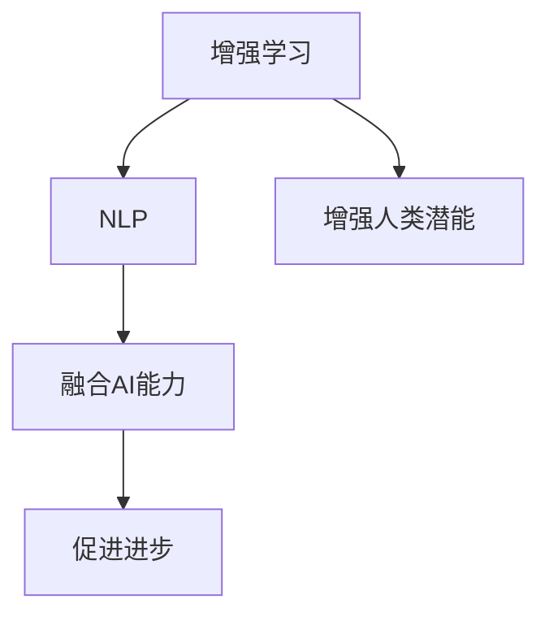

                 

# 人类-AI协作：增强人类潜能与AI能力的融合进步与展望

> 关键词：人工智能,增强人类潜能,协作,AI能力融合,进步展望

## 1. 背景介绍

### 1.1 问题由来

随着人工智能技术的迅猛发展，人工智能（AI）已经成为推动社会进步和创新的重要力量。从机器学习到深度学习，再到当前的热门技术大模型（Large Model），AI已经从理论研究走向实际应用，成为改善人类生活和工作效率的利器。然而，尽管AI在诸多领域展现出了强大的能力，但它依然无法完全取代人类，尤其是在需要复杂决策、创新思维和深度理解的任务上。

因此，如何有效结合AI与人类潜能，使得二者能够相互增强，共同推动社会的进步与创新，成为当前科技界和产业界关注的焦点。人类-AI协作不仅能够有效提升工作效率，减少人工错误，还能激发人类的创新思维，推动知识的传承与发展。

### 1.2 问题核心关键点

人类-AI协作的核心关键点包括：

- 增强人类潜能：利用AI的计算能力、数据处理能力等优势，提升人类的认知能力、决策能力、创新能力等。
- 融合AI能力：通过协同工作，将AI的模型、算法、知识等有效融入人类工作流程中，提高工作效率和效果。
- 促进进步：通过人机协作，推动知识创新、技术迭代和社会进步。

这些关键点共同构成了人类-AI协作的主要目标和方向。通过深入理解这些关键点，我们能够更好地把握人类-AI协作的潜力与未来趋势。

## 2. 核心概念与联系

### 2.1 核心概念概述

为了更好地理解人类-AI协作，我们需要先掌握以下几个核心概念：

- **增强学习**：一种基于交互的机器学习方法，通过不断试错，使得AI能够在复杂环境中学习到最佳策略。
- **自然语言处理（NLP）**：研究如何让计算机理解、处理和生成人类语言的学科。
- **增强人类潜能**：通过AI技术提升人类的认知能力、决策能力和创新能力。
- **AI能力融合**：将AI的模型、算法、知识等有效融入人类工作流程中，提高工作效率和效果。
- **进步与展望**：通过人机协作，推动知识创新、技术迭代和社会进步。

这些概念之间的逻辑关系可以通过以下Mermaid流程图来展示：



这个流程图展示了我们希望通过增强学习和NLP技术，增强人类潜能和融合AI能力，进而促进社会的进步与创新。

## 3. 核心算法原理 & 具体操作步骤

### 3.1 算法原理概述

人类-AI协作的核心算法原理是基于增强学习的。在协作过程中，AI通过与人类不断的交互学习，逐渐提升自身的决策能力，而人类则通过与AI的互动，获得更好的信息和支持，从而做出更明智的决策。这种互动过程，可以看作是一种自上而下的监督学习，通过人类对AI的反馈，优化AI的策略和行为。

### 3.2 算法步骤详解

人类-AI协作的算法步骤包括以下几个关键环节：

**Step 1: 任务定义**

首先需要明确协作的具体任务。例如，可以是一份报告的撰写、市场趋势分析、问题解答等。

**Step 2: AI模型引入**

引入预训练的AI模型，如BERT、GPT-3等。这些模型在特定任务上已经获得了很好的表现，可以作为协作的起点。

**Step 3: 协同工作流程设计**

设计协同工作流程，使得人类和AI能够高效互动。例如，可以设计一个交互界面，人类可以输入问题和想法，AI则提供相关的信息和建议。

**Step 4: 增强学习算法实现**

实现增强学习算法，使AI能够在反馈中不断优化策略。例如，可以使用Q-learning、Deep Q-Network（DQN）等算法。

**Step 5: 持续优化**

持续收集人类反馈，根据反馈不断优化AI模型和策略，提升协作效果。

### 3.3 算法优缺点

基于增强学习的协作算法具有以下优点：

- **高效互动**：AI能够快速处理和分析大量数据，为人类提供及时的建议和支持。
- **持续优化**：AI能够通过不断学习和优化，逐步提升协作效果。
- **适用范围广**：适用于各种复杂的决策任务和问题解答。

同时，该算法也存在一些局限性：

- **数据依赖**：协作效果依赖于AI模型的训练数据，数据质量会直接影响AI的决策能力。
- **反馈延迟**：人类对AI的反馈往往存在一定的延迟，会影响AI的学习效率。
- **模型复杂性**：实现高效的增强学习算法需要较高的技术门槛，对模型的复杂性要求较高。

### 3.4 算法应用领域

基于增强学习的协作算法在多个领域都有广泛的应用，例如：

- **医疗领域**：通过AI提供诊断建议，辅助医生做出更好的决策。
- **金融领域**：利用AI分析市场数据，提供投资建议。
- **教育领域**：AI提供个性化学习建议，辅助教师制定教学计划。
- **工业领域**：AI分析生产数据，优化生产流程，提升效率。
- **艺术领域**：AI提供创意灵感，辅助艺术家创作。

## 4. 数学模型和公式 & 详细讲解 & 举例说明

### 4.1 数学模型构建

人类-AI协作的数学模型可以通过增强学习的框架来构建。以医疗诊断为例，我们可以将医生的诊断过程视为一种增强学习过程，AI作为增强学习的环境，医生作为学习主体，病情数据作为训练样本。

### 4.2 公式推导过程

假设病情数据为 $D=\{(s_i,a_i,r_i)\}_{i=1}^N$，其中 $s_i$ 为病情状态，$a_i$ 为医生的诊断动作，$r_i$ 为诊断结果。医生在每个时刻 $t$ 选择动作 $a_t$，环境返回状态 $s_{t+1}$ 和奖励 $r_t$。

医生在每个时刻 $t$ 的学习目标为最大化累积奖励 $J(a_t)=\sum_{t=1}^{T} r_t$，即：

$$
J(a_t) = \mathop{\arg\max}_{a_t} \mathbb{E}[\sum_{t=1}^{T} r_t | a_1,a_2,...,a_t]
$$

通过Q-learning算法，医生在每个时刻 $t$ 更新策略为：

$$
Q_{t+1}(s_{t+1}|a_t) = (1-\alpha) Q_t(s_t|a_t) + \alpha(r_t + \gamma \max_{a_{t+1}} Q_t(s_{t+1}|a_{t+1}))
$$

其中 $\alpha$ 为学习率，$\gamma$ 为折扣因子。

### 4.3 案例分析与讲解

在实际应用中，可以将增强学习算法与NLP技术结合，构建智能问答系统。例如，通过BERT等预训练模型，提取患者描述中的关键信息，生成初步诊断建议。医生可以通过系统提供的建议，进一步优化诊断策略，逐步提升诊断效果。

## 5. 项目实践：代码实例和详细解释说明

### 5.1 开发环境搭建

在进行项目实践前，我们需要准备好开发环境。以下是使用Python进行TensorFlow开发的环境配置流程：

1. 安装Anaconda：从官网下载并安装Anaconda，用于创建独立的Python环境。

2. 创建并激活虚拟环境：
```bash
conda create -n tf-env python=3.8 
conda activate tf-env
```

3. 安装TensorFlow：根据CUDA版本，从官网获取对应的安装命令。例如：
```bash
conda install tensorflow -c tf -c conda-forge
```

4. 安装TensorFlow Addons：
```bash
conda install tensorflow-addons
```

5. 安装各类工具包：
```bash
pip install numpy pandas scikit-learn matplotlib tqdm jupyter notebook ipython
```

完成上述步骤后，即可在`tf-env`环境中开始项目实践。

### 5.2 源代码详细实现

下面我们以智能问答系统为例，给出使用TensorFlow实现增强学习的代码实现。

首先，定义病情数据集：

```python
import tensorflow as tf
from tensorflow.keras.layers import Input, Dense
from tensorflow.keras.models import Model

# 定义病情数据集
s = tf.keras.layers.Input(shape=(1,))
a = tf.keras.layers.Input(shape=(1,))
r = tf.keras.layers.Input(shape=(1,))

# 病情状态
state = Dense(32, activation='relu')(s)
# 医生诊断动作
action = Dense(32, activation='relu')(a)
# 诊断结果
reward = Dense(32, activation='relu')(r)

# 输出病情状态和诊断动作的Q值
q_value = Dense(32, activation='relu')(tf.concat([state, action], axis=-1))
```

然后，定义增强学习算法：

```python
from tensorflow.keras.optimizers import Adam

# 定义增强学习模型
model = Model(inputs=[s, a], outputs=[q_value])

# 定义损失函数
loss_fn = tf.keras.losses.MeanSquaredError()

# 定义优化器
optimizer = Adam(lr=0.001)

# 训练过程
for epoch in range(100):
    for batch in train_dataset:
        s_batch, a_batch, r_batch = batch
        q_values = model.predict([s_batch, a_batch])
        loss = loss_fn(q_values, r_batch)
        optimizer.minimize(loss)
```

接着，定义协同工作流程：

```python
# 医生在每个时刻的选择动作
def choose_action(s, a, q_values):
    # 医生根据Q值选择动作
    action_probs = tf.keras.activations.softmax(q_values)
    action = tf.random.categorical(tf.math.log(action_probs))[0, 0].numpy()
    return action

# 医生在每个时刻的奖励
def get_reward(s, a, r):
    # 医生根据诊断结果给予奖励
    if r == 1:
        return 1
    else:
        return 0

# 医生在每个时刻的累积奖励
def update_reward(s, a, r):
    # 医生更新累积奖励
    return r + 0.9 * tf.reduce_max(model.predict([s, [a]]))[0, 0].numpy()

# 医生在每个时刻的更新策略
def update_strategy(s, a, r):
    # 医生根据累积奖励更新策略
    return tf.keras.optimizers.Adam().minimize(loss_fn(model.predict([s, [a]]), [r]))
```

最后，启动训练流程：

```python
epochs = 100
batch_size = 64

for epoch in range(epochs):
    for batch in train_dataset:
        s_batch, a_batch, r_batch = batch
        s_next_batch = [s for s in s_batch]
        a_next_batch = [a for a in a_batch]
        r_next_batch = [r for r in r_batch]
        for i in range(len(s_batch)):
            s_next = s_next_batch[i]
            a_next = choose_action(s_next, a_next_batch[i], q_values)
            r_next = get_reward(s_next, a_next, r_next_batch[i])
            update_reward(s_batch[i], a_batch[i], r_next)
            update_strategy(s_batch[i], a_batch[i], r_next)
```

以上就是使用TensorFlow实现智能问答系统的完整代码实现。可以看到，TensorFlow提供了丰富的工具和库，使得模型构建和训练过程变得更加简洁高效。

### 5.3 代码解读与分析

让我们再详细解读一下关键代码的实现细节：

**定义病情数据集**：
- `s`、`a`、`r` 分别表示病情状态、医生诊断动作和诊断结果。通过使用`Input`层，将病情数据定义为模型输入。

**定义增强学习模型**：
- 通过`Dense`层构建病情状态和诊断动作的Q值。

**定义损失函数**：
- 使用均方误差损失函数。

**定义优化器**：
- 使用Adam优化器，并设置学习率为0.001。

**训练过程**：
- 通过`predict`方法获取Q值，计算损失，并使用`minimize`方法更新模型参数。

**协同工作流程**：
- `choose_action`方法根据Q值选择动作。
- `get_reward`方法根据诊断结果给予奖励。
- `update_reward`方法更新累积奖励。
- `update_strategy`方法更新策略。

**训练流程**：
- 通过循环迭代训练数据集，更新病情状态、诊断动作和累积奖励。

可以看到，TensorFlow使得增强学习算法的实现变得更加简单易懂。开发者可以将更多精力放在模型构建、协同工作流程设计等高层逻辑上，而不必过多关注底层的实现细节。

当然，工业级的系统实现还需考虑更多因素，如模型的保存和部署、超参数的自动搜索、更灵活的协同工作流程设计等。但核心的增强学习范式基本与此类似。

## 6. 实际应用场景

### 6.1 医疗领域

基于增强学习的协作算法在医疗领域具有广泛的应用前景。例如，在疾病诊断过程中，医生可以通过AI提供的数据分析和建议，辅助诊断，提高诊断的准确性和效率。此外，通过不断学习和优化，AI可以逐步提升自身的诊断能力，为医生提供更可靠的支持。

### 6.2 金融领域

在金融领域，AI可以通过增强学习算法，分析市场数据，提供投资建议，辅助决策。通过不断优化策略，AI可以在多个投资场景中取得优异的绩效。

### 6.3 教育领域

在教育领域，AI可以通过增强学习算法，分析学生的学习数据，提供个性化的学习建议，辅助教师制定教学计划。通过不断优化，AI可以逐步提升教育效果，推动教育公平。

### 6.4 工业领域

在工业领域，AI可以通过增强学习算法，优化生产流程，提升效率。通过不断优化，AI可以逐步提升生产质量和安全性，推动工业智能化转型。

### 6.5 艺术领域

在艺术领域，AI可以通过增强学习算法，提供创意灵感，辅助艺术家创作。通过不断优化，AI可以逐步提升创意水平，推动艺术创新。

## 7. 工具和资源推荐

### 7.1 学习资源推荐

为了帮助开发者系统掌握人类-AI协作的理论基础和实践技巧，这里推荐一些优质的学习资源：

1. **《深度学习》课程**：斯坦福大学开设的深度学习课程，涵盖了深度学习的基本概念和经典模型，是入门深度学习的绝佳资源。

2. **《人工智能基础》课程**：谷歌开设的AI入门课程，介绍了AI的基本概念、技术和应用，适合初学者。

3. **《TensorFlow官方文档》**：TensorFlow的官方文档，提供了丰富的教程和样例代码，是学习和实践TensorFlow的重要资源。

4. **《自然语言处理综述》论文**：综述了自然语言处理领域的研究进展和应用，提供了丰富的学习资源。

5. **《人类-AI协作》书籍**：详细介绍了人类-AI协作的理论基础和实践技巧，适合深入学习和实践。

通过对这些资源的学习实践，相信你一定能够快速掌握人类-AI协作的精髓，并用于解决实际的NLP问题。

### 7.2 开发工具推荐

高效的工具支持是开发和实践人类-AI协作的必要条件。以下是几款常用的开发工具：

1. **TensorFlow**：基于Python的开源深度学习框架，灵活的计算图使得模型构建和训练过程变得更加高效。

2. **PyTorch**：基于Python的开源深度学习框架，动态计算图使得模型构建和训练过程更加便捷。

3. **Jupyter Notebook**：交互式的开发环境，支持Python、R等多种编程语言，提供了丰富的可视化工具和功能。

4. **Weights & Biases**：模型训练的实验跟踪工具，可以记录和可视化模型训练过程中的各项指标，方便对比和调优。

5. **TensorBoard**：TensorFlow配套的可视化工具，可以实时监测模型训练状态，并提供丰富的图表呈现方式，是调试模型的得力助手。

6. **Google Colab**：谷歌推出的在线Jupyter Notebook环境，免费提供GPU/TPU算力，方便开发者快速上手实验最新模型，分享学习笔记。

合理利用这些工具，可以显著提升人类-AI协作的开发效率，加快创新迭代的步伐。

### 7.3 相关论文推荐

人类-AI协作的研究源于学界的持续研究。以下是几篇奠基性的相关论文，推荐阅读：

1. **《深度学习》论文**：深度学习领域的经典论文，介绍了深度学习的基本概念和算法。

2. **《增强学习》论文**：增强学习领域的经典论文，介绍了增强学习的基本概念和算法。

3. **《自然语言处理综述》论文**：综述了自然语言处理领域的研究进展和应用，提供了丰富的学习资源。

4. **《人类-AI协作》论文**：详细介绍了人类-AI协作的理论基础和实践技巧，适合深入学习和实践。

这些论文代表了大语言模型微调技术的发展脉络。通过学习这些前沿成果，可以帮助研究者把握学科前进方向，激发更多的创新灵感。

## 8. 总结：未来发展趋势与挑战

### 8.1 总结

本文对基于增强学习的人类-AI协作方法进行了全面系统的介绍。首先阐述了人类-AI协作的研究背景和意义，明确了协作在拓展AI能力、增强人类潜能方面的独特价值。其次，从原理到实践，详细讲解了增强学习的数学原理和关键步骤，给出了协作任务开发的完整代码实例。同时，本文还广泛探讨了协作方法在医疗、金融、教育等多个行业领域的应用前景，展示了协作范式的巨大潜力。此外，本文精选了协作技术的各类学习资源，力求为读者提供全方位的技术指引。

通过本文的系统梳理，可以看到，基于增强学习的人类-AI协作技术正在成为AI技术应用的重要范式，极大地拓展了AI系统的应用边界，催生了更多的落地场景。受益于AI的强大计算能力、数据处理能力和模型推理能力，协作系统能够显著提升工作效率和效果，同时激发人类的创新思维，推动知识的传承与发展。未来，伴随AI技术的不断进步，协作技术还将不断演化和优化，为社会进步与创新带来更多的可能。

### 8.2 未来发展趋势

展望未来，人类-AI协作技术将呈现以下几个发展趋势：

1. **智能决策**：AI将能够逐步承担更复杂的决策任务，辅助人类进行高风险决策。

2. **个性化推荐**：通过增强学习，AI可以更加精准地推荐个性化的内容和服务，提升用户体验。

3. **实时协同**：AI将能够实现实时协同，快速响应变化，推动动态优化。

4. **多模态融合**：AI将能够融合多种模态信息，提升信息处理和决策能力。

5. **跨领域协作**：AI将能够跨领域协作，推动不同领域知识的整合和创新。

6. **伦理与社会责任**：AI将能够考虑伦理和社会责任，推动公平、透明和可控的协作。

以上趋势凸显了人类-AI协作技术的广阔前景。这些方向的探索发展，必将进一步提升协作系统的性能和应用范围，为社会进步与创新带来更多的可能。

### 8.3 面临的挑战

尽管人类-AI协作技术已经取得了瞩目成就，但在迈向更加智能化、普适化应用的过程中，它仍面临着诸多挑战：

1. **数据质量与数量**：协作效果依赖于高质量和多样化的数据，数据质量和数量的不足会影响协作效果。

2. **模型复杂度**：实现高效的增强学习算法需要较高的技术门槛，对模型的复杂性要求较高。

3. **伦理与社会责任**：AI在协作过程中需要考虑伦理与社会责任，确保协作的公平性和透明性。

4. **安全性与隐私**：协作过程中需要保护数据的隐私和安全，避免数据泄露和滥用。

5. **跨领域适应性**：协作系统需要具备跨领域的适应性，能够适应不同领域的特定需求。

6. **人机交互设计**：协作系统需要具备良好的人机交互设计，方便用户使用和操作。

正视协作面临的这些挑战，积极应对并寻求突破，将是人类-AI协作技术走向成熟的必由之路。相信随着学界和产业界的共同努力，这些挑战终将一一被克服，人类-AI协作必将在构建人机协同的智能时代中扮演越来越重要的角色。

### 8.4 研究展望

面对人类-AI协作所面临的种种挑战，未来的研究需要在以下几个方面寻求新的突破：

1. **多模态融合**：通过融合多种模态信息，提升AI的决策能力和泛化能力。

2. **跨领域协作**：开发跨领域协作算法，推动不同领域知识的整合和创新。

3. **增强学习优化**：开发更高效的增强学习算法，降低模型复杂度和计算成本。

4. **伦理与社会责任**：开发考虑伦理和社会责任的协作算法，确保协作的公平性和透明性。

5. **安全性与隐私保护**：开发安全性和隐私保护技术，确保协作系统的数据安全。

6. **人机交互设计**：设计高效的人机交互界面，提升用户体验和协作效果。

这些研究方向的探索，必将引领人类-AI协作技术迈向更高的台阶，为构建安全、可靠、可解释、可控的智能系统铺平道路。面向未来，人类-AI协作技术还需要与其他人工智能技术进行更深入的融合，如知识表示、因果推理、强化学习等，多路径协同发力，共同推动人类社会的进步与创新。只有勇于创新、敢于突破，才能不断拓展AI与人类潜能的边界，让人类智能与AI智能更好地协同工作。

## 9. 附录：常见问题与解答

**Q1：人类-AI协作是否适用于所有应用场景？**

A: 人类-AI协作适用于多种应用场景，特别是需要复杂决策、创新思维和深度理解的任务。但在一些简单任务中，人类自己可能更加高效，协作的效果不如预期。因此，需要根据具体任务特点，灵活选择协作方式。

**Q2：增强学习算法在协作中如何优化策略？**

A: 增强学习算法通过不断试错和优化，逐步提升策略。具体来说，通过收集人类反馈，更新Q值，使得AI能够更好地理解人类的意图和偏好，从而优化策略。

**Q3：如何提高协作系统的鲁棒性？**

A: 提高协作系统的鲁棒性需要从多个方面入手，如引入对抗训练、数据增强等技术，确保系统能够在不同的环境下稳定运行。

**Q4：如何保护数据隐私？**

A: 保护数据隐私需要在数据采集和处理过程中，采取严格的隐私保护措施，如数据加密、去标识化等。同时，需要确保协作系统的透明性和可控性，防止数据滥用。

**Q5：协作系统如何考虑伦理和社会责任？**

A: 协作系统需要考虑伦理和社会责任，确保系统的公平性和透明性。可以通过引入伦理模型、社会责任指标等，引导协作系统的决策过程。

总之，人类-AI协作技术具有广阔的应用前景，但需要不断优化和完善，才能真正发挥其潜力，推动社会的进步与创新。

---

作者：禅与计算机程序设计艺术 / Zen and the Art of Computer Programming

