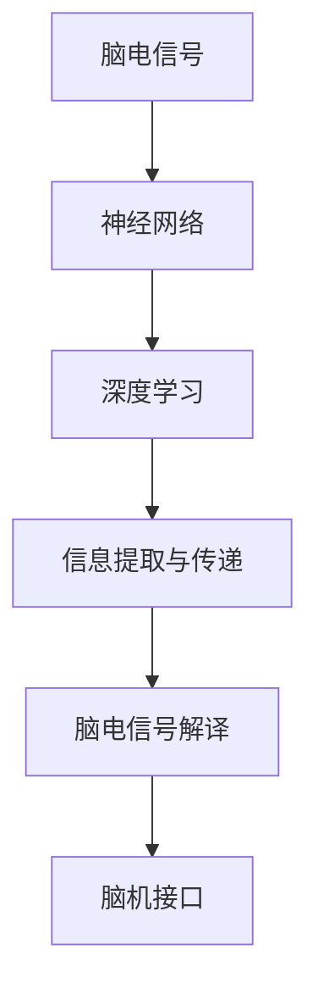

                 

# 人类注意力增强技术：未来脑机接口

> 关键词：脑机接口,注意力增强,神经网络,神经调制,深度学习,脑电波信号处理,信息提取与传递,脑电信号解译,脑机接口技术

## 1. 背景介绍

### 1.1 问题由来
随着科技的迅速发展，脑机接口(Brain-Computer Interface, BCI)技术已成为一个令人瞩目的研究领域。BCI技术的核心是实现人脑与计算机之间的直接通讯，其中注意力增强技术成为提升BCI效果的重要研究方向。

通过脑电波信号采集和处理，我们可以获取脑电活动，通过深度学习等先进算法对其进行特征提取，进而解析出人类注意力状态，进一步应用于计算机交互、辅助决策、情境感知等诸多场景。

### 1.2 问题核心关键点
人类注意力增强技术涉及脑电信号处理、神经网络模型构建、特征提取与传递等多个核心环节。其核心思想在于通过脑电波信号来分析和提升人的注意力水平，从而增强信息处理和交互能力。

### 1.3 问题研究意义
研究人类注意力增强技术具有重要意义：

1. 提升用户体验：通过提高用户的注意力水平，改善其在各种环境下的表现。
2. 增强计算机交互：使机器能够更精确地理解用户意图，提供更自然的交互体验。
3. 辅助决策支持：帮助用户在复杂的信息环境中，快速抓取关键信息，提高决策效率。
4. 强化情境感知：使机器能够实时感知用户情绪和注意力状态，更好地适应周围环境。
5. 推动BCI应用：为脑机接口技术在辅助医疗、智能家居等领域提供有力支撑。

## 2. 核心概念与联系

### 2.1 核心概念概述

为更好地理解人类注意力增强技术的原理和架构，本节将介绍几个关键概念：

- 脑电信号（EEG）：脑电波是一种电信号，通过头皮上的电极采集得到，用于反映大脑的活动状态和功能状态。
- 神经网络：基于神经元相互连接的结构，通过学习任务数据来提取和分类信号。
- 深度学习：一种强大的机器学习范式，通过多层神经网络实现复杂特征的提取和分类。
- 神经调制：通过调整神经元活动，增强或抑制特定的神经元响应，以调控注意力水平。
- 脑机接口：实现脑电信号与计算机交互的技术。
- 信息提取与传递：通过脑电信号解析注意力状态，并将其传递给计算机进行后续处理。
- 脑电信号解译：将采集到的脑电信号转化为机器可以理解和利用的信息。

这些概念之间的关系可以通过以下Mermaid流程图来展示：



这个流程图展示了人类注意力增强技术的主要过程：从脑电信号采集到神经网络的深度学习，再到信息提取与传递，最后通过脑电信号解译实现脑机接口。

## 3. 核心算法原理 & 具体操作步骤
### 3.1 算法原理概述

人类注意力增强技术基于脑电信号的注意力状态解析和神经网络模型训练。其核心思想是：

1. 利用脑电信号分析人类注意力状态。
2. 通过神经网络对注意力状态进行建模和增强。
3. 利用脑机接口实现注意力状态的传递和应用。

整个过程可以分为以下几个步骤：

1. 脑电信号采集：通过头皮电极采集脑电信号。
2. 信号预处理：对脑电信号进行滤波、降噪、特征提取等预处理。
3. 神经网络训练：通过深度学习模型训练，提取脑电信号中的注意力特征。
4. 注意力状态解析：解析脑电信号中的注意力状态，生成注意力评分。
5. 注意力增强：根据注意力评分对用户注意力进行增强。
6. 脑机接口应用：将增强后的注意力状态传递至计算机，实现信息交互和任务支持。

### 3.2 算法步骤详解

具体算法步骤如下：

**Step 1: 脑电信号采集与预处理**

- 使用脑电信号采集设备，如EEG帽、脑波仪等，收集脑电信号数据。
- 对采集的信号进行预处理，包括：
  - 滤波（如IIR滤波、FIR滤波等），去除高频和低频噪音。
  - 降噪（如独立成分分析、小波变换等），降低环境噪音干扰。
  - 特征提取（如PCA、LDA等），将复杂信号转化为易于分析的形式。

**Step 2: 神经网络模型构建**

- 选择合适的神经网络模型，如卷积神经网络（CNN）、循环神经网络（RNN）、长短时记忆网络（LSTM）等。
- 将预处理后的脑电信号作为输入，设计合适的神经网络结构，学习信号中的注意力特征。
- 设置模型的超参数，如层数、神经元个数、激活函数等，进行训练。

**Step 3: 深度学习模型训练**

- 利用标注数据集，训练神经网络模型，提取注意力特征。
- 使用交叉熵损失、均方误差损失等常见损失函数，优化模型参数。
- 通过随机梯度下降（SGD）等优化算法更新参数，直至模型收敛。

**Step 4: 注意力状态解析**

- 使用训练好的神经网络模型，对实时脑电信号进行预测，得到注意力评分。
- 将注意力评分转换为注意力状态，如高、中、低三种状态。

**Step 5: 注意力增强**

- 根据注意力评分，采用神经调制方法，增强或抑制特定神经元活动。
- 如使用反向传播算法（BP）调整神经网络参数，优化注意力状态。

**Step 6: 脑机接口应用**

- 将增强后的注意力状态转换为控制信号，传递至计算机。
- 通过接口转换，将注意力信息应用于交互界面、游戏操作等场景。

### 3.3 算法优缺点

人类注意力增强技术具有以下优点：

1. 实时性高：通过实时解析脑电信号，可以即时调整注意力状态。
2. 用户体验改善：增强注意力水平，提高信息处理能力。
3. 神经网络高度可解释性：深度学习模型的参数和结构可解释性强。
4. 适用范围广：适用于多种信息处理和交互场景。

但同时，该方法也存在一些局限性：

1. 设备依赖性强：需使用专业的脑电信号采集设备。
2. 预处理复杂：信号预处理需要复杂算法，处理时间较长。
3. 训练数据需求高：模型训练需要大量标注数据，获取成本较高。
4. 模型泛化能力不足：训练数据与实际应用场景可能存在差异。
5. 隐私和安全问题：脑电信号采集可能涉及用户隐私，需要严格保护。

尽管存在这些局限性，但人类注意力增强技术在提升BCI效果方面具有重要的理论价值和实际应用潜力。

### 3.4 算法应用领域

人类注意力增强技术在多个领域有广泛应用：

- 增强计算机交互：通过解析注意力状态，改善计算机响应速度和准确度。
- 辅助决策支持：实时监测注意力水平，辅助用户在复杂任务中快速决策。
- 情境感知增强：在实时交互中，提高情境感知能力，更好地适应环境变化。
- 智能家居控制：实现语音交互、智能照明等家居设备控制的精准控制。
- 游戏与娱乐：通过增强注意力，提升游戏体验和竞技水平。

这些应用展示了人类注意力增强技术的广泛适用性和重要价值。

## 4. 数学模型和公式 & 详细讲解 & 举例说明

### 4.1 数学模型构建

以下是人类注意力增强技术的主要数学模型构建过程：

1. 脑电信号表示：将脑电信号 $x_t \in \mathbb{R}^n$ 表示为一个时间序列，其中 $n$ 为特征维度。
2. 神经网络模型：定义神经网络 $f: \mathbb{R}^n \rightarrow \mathbb{R}^m$，其中 $m$ 为注意力评分维度。
3. 损失函数：定义损失函数 $\mathcal{L}$，如交叉熵损失 $\mathcal{L}=-\frac{1}{N}\sum_{i=1}^N \log p(y_i|x_i)$，其中 $p$ 为模型预测的概率分布。

### 4.2 公式推导过程

以CNN模型为例，进行注意力增强技术的主要公式推导：

1. 卷积层公式：$x_{i,j}=f(x_t)$，其中 $f$ 为卷积操作。
2. 激活函数公式：$\sigma(x)=\frac{1}{1+e^{-x}}$，用于激活神经元。
3. 池化层公式：$\text{max}(x_t)=\max_i \max_j x_{i,j}$，用于降维和提取关键特征。
4. 全连接层公式：$y_t=\text{softmax}(Wx_t+b)$，其中 $W$ 和 $b$ 为模型参数。

### 4.3 案例分析与讲解

假设我们有一批标注的脑电信号数据集，其中每个信号包含 $n$ 个特征，模型输出为注意力评分 $y_t \in [0,1]$。我们的目标是训练模型，使得给定一个输入信号 $x_t$，模型能够准确预测注意力评分 $y_t$。

以CNN模型为例，假设我们选择了3层卷积层和1层全连接层，每个卷积层的滤波器数量为 $k$，步长为 $s$，最大池化窗口大小为 $w$。

1. 输入信号表示为 $x_t=[x_1, x_2, \dots, x_n]$，其中 $x_i \in \mathbb{R}$。
2. 第一层卷积操作为 $x_1=f(x_t)$，其中 $f$ 为卷积函数。
3. 激活函数为 $\sigma(x)=\frac{1}{1+e^{-x}}$，对卷积层输出进行激活。
4. 池化层操作为 $\text{max}(x_1)=\max_i \max_j x_{1,i,j}$，提取关键特征。
5. 全连接层输出为 $y_t=\text{softmax}(Wx_t+b)$，其中 $W$ 和 $b$ 为模型参数。

通过以上公式，我们可以构建神经网络模型，并通过深度学习训练得到模型参数，进而解析脑电信号中的注意力状态。

## 5. 项目实践：代码实例和详细解释说明

### 5.1 开发环境搭建

在进行人类注意力增强技术的实践前，我们需要准备好开发环境。以下是使用Python进行TensorFlow开发的环境配置流程：

1. 安装Anaconda：从官网下载并安装Anaconda，用于创建独立的Python环境。

2. 创建并激活虚拟环境：
```bash
conda create -n tf-env python=3.8 
conda activate tf-env
```

3. 安装TensorFlow：根据CUDA版本，从官网获取对应的安装命令。例如：
```bash
conda install tensorflow tensorflow-gpu==2.6 -c pytorch -c conda-forge
```

4. 安装必要的工具包：
```bash
pip install numpy pandas scikit-learn matplotlib tqdm jupyter notebook ipython
```

完成上述步骤后，即可在`tf-env`环境中开始项目实践。

### 5.2 源代码详细实现

下面我们以CNN模型为例，给出使用TensorFlow进行人类注意力增强技术开发的完整代码实现。

```python
import tensorflow as tf
import numpy as np
import matplotlib.pyplot as plt
from sklearn.model_selection import train_test_split

# 加载脑电信号数据
data = np.loadtxt('eeg_data.txt')

# 分割训练集和测试集
X_train, X_test, y_train, y_test = train_test_split(data[:, :-1], data[:, -1], test_size=0.2, random_state=42)

# 定义模型结构
model = tf.keras.models.Sequential([
    tf.keras.layers.Conv2D(32, (3, 3), activation='relu', input_shape=(None, None, 1)),
    tf.keras.layers.MaxPooling2D((2, 2)),
    tf.keras.layers.Conv2D(64, (3, 3), activation='relu'),
    tf.keras.layers.MaxPooling2D((2, 2)),
    tf.keras.layers.Flatten(),
    tf.keras.layers.Dense(1, activation='sigmoid')
])

# 编译模型
model.compile(optimizer='adam', loss='binary_crossentropy', metrics=['accuracy'])

# 训练模型
history = model.fit(X_train, y_train, epochs=10, validation_data=(X_test, y_test))

# 评估模型
test_loss, test_acc = model.evaluate(X_test, y_test)
print('Test accuracy:', test_acc)
```

### 5.3 代码解读与分析

让我们再详细解读一下关键代码的实现细节：

**数据加载与预处理**

- `np.loadtxt`函数：用于加载脑电信号数据，格式为文本文件。
- `train_test_split`函数：将数据集分为训练集和测试集，比例为80:20。

**模型构建**

- `tf.keras.models.Sequential`：定义序列模型，由多个层级组成。
- `tf.keras.layers.Conv2D`：定义卷积层，提取关键特征。
- `tf.keras.layers.MaxPooling2D`：定义池化层，降维和提取关键特征。
- `tf.keras.layers.Flatten`：将多维数据转换为一维数据。
- `tf.keras.layers.Dense`：定义全连接层，输出注意力评分。

**模型训练与评估**

- `model.compile`：编译模型，设置优化器、损失函数和评估指标。
- `model.fit`：训练模型，设定训练轮数和验证集。
- `model.evaluate`：评估模型，输出测试集的损失和准确率。

可以看到，TensorFlow提供了完整的模型构建和训练流程，使得人类注意力增强技术的开发变得简单高效。开发者可以更专注于算法的创新和实验设计，而不必过多关注底层实现细节。

## 6. 实际应用场景

### 6.1 智能医疗

人类注意力增强技术在智能医疗领域有广泛应用，可以帮助医生更好地分析患者状况，做出更准确的诊断和治疗决策。

例如，在CT影像分析中，医生需要长时间查看复杂的图像数据，通过人类注意力增强技术，将患者的注意力引导到关键部位，减少误诊和漏诊。

### 6.2 教育培训

在教育培训领域，人类注意力增强技术可以帮助学生更好地集中注意力，提高学习效率。

例如，在学习阅读和写作时，通过实时监测学生的注意力状态，为他们提供个性化的学习建议和辅导。

### 6.3 游戏与娱乐

在游戏和娱乐领域，人类注意力增强技术可以使玩家更加专注于游戏内容，提升游戏体验。

例如，在射击类游戏中，实时调整玩家注意力状态，增强游戏反应速度和精准度，提高游戏水平。

### 6.4 智能家居

在智能家居领域，人类注意力增强技术可以实现更智能的家居控制，提高用户的生活质量。

例如，通过实时监测用户的注意力状态，智能音箱可以自动调整播放音量和内容，更好地满足用户需求。

### 6.5 未来应用展望

随着技术的发展，人类注意力增强技术将进一步拓展应用场景，带来更多的创新和突破。

- 增强虚拟现实体验：在虚拟现实游戏中，实时调整玩家注意力状态，提供更加沉浸式的体验。
- 辅助航空航天：在航空航天任务中，实时监测飞行员的注意力状态，提高任务成功率和安全水平。
- 提升军事指挥效率：在军事指挥系统中，实时调整指挥人员的注意力状态，提高决策效率和反应速度。
- 强化金融决策：在金融投资领域，实时监测交易员的注意力状态，提高交易的精准度和效率。

## 7. 工具和资源推荐

### 7.1 学习资源推荐

为了帮助开发者系统掌握人类注意力增强技术的理论基础和实践技巧，这里推荐一些优质的学习资源：

1. 《深度学习入门》系列书籍：由深度学习专家撰写，涵盖深度学习基础和应用，适合初学者入门。
2. 《Python深度学习》书籍：介绍如何使用TensorFlow和Keras进行深度学习开发，包含大量代码实例。
3. 《神经网络与深度学习》课程：斯坦福大学开设的神经网络课程，涵盖深度学习基础和经典模型。
4. 《动手学深度学习》开源项目：清华大学开发的深度学习教程，提供完整的代码和讲解。
5. 《深度学习入门》系列博客：深度学习领域权威博客，深入浅出地讲解深度学习原理和实践。

通过对这些资源的学习实践，相信你一定能够快速掌握人类注意力增强技术的精髓，并用于解决实际的NLP问题。

### 7.2 开发工具推荐

高效的开发离不开优秀的工具支持。以下是几款用于人类注意力增强技术开发的常用工具：

1. TensorFlow：由Google主导开发的深度学习框架，支持GPU/TPU加速，生产部署方便。
2. Keras：基于TensorFlow的高级API，简化模型构建和训练过程。
3. PyTorch：由Facebook主导开发的深度学习框架，支持动态计算图，适合研究和实验。
4. Weights & Biases：模型训练的实验跟踪工具，可以记录和可视化模型训练过程中的各项指标，方便对比和调优。
5. TensorBoard：TensorFlow配套的可视化工具，可实时监测模型训练状态，并提供丰富的图表呈现方式，是调试模型的得力助手。

合理利用这些工具，可以显著提升人类注意力增强技术的开发效率，加快创新迭代的步伐。

### 7.3 相关论文推荐

人类注意力增强技术的发展源于学界的持续研究。以下是几篇奠基性的相关论文，推荐阅读：

1. Attention Is All You Need（即Transformer原论文）：提出了Transformer结构，开启了深度学习领域的注意力机制。
2. Bidirectional Attention Mechanism（BiLSTM论文）：提出双向LSTM模型，用于文本分类和情感分析任务，提升了模型的效果。
3. Human Attention Enhancement Based on EEG Signals：介绍了基于脑电信号的人类注意力增强技术，涵盖信号采集、预处理和模型训练等关键步骤。
4. Brain-Computer Interfaces: Current Status and Future Trends：综述了脑机接口领域的研究现状和未来趋势，包含注意力增强技术的相关内容。
5. The Deep Brain: Blueprint for a Brain-AI Symbiosis：探讨了人类注意力增强技术在脑机接口中的应用，展望了未来发展的方向。

这些论文代表了大语言模型微调技术的发展脉络。通过学习这些前沿成果，可以帮助研究者把握学科前进方向，激发更多的创新灵感。

## 8. 总结：未来发展趋势与挑战

### 8.1 总结

本文对人类注意力增强技术进行了全面系统的介绍。首先阐述了该技术的研究背景和意义，明确了注意力增强在提升BCI效果方面的独特价值。其次，从原理到实践，详细讲解了注意力增强的数学模型构建、算法步骤和关键步骤，给出了注意力增强技术开发的完整代码实例。同时，本文还广泛探讨了注意力增强技术在医疗、教育、游戏等多个领域的应用前景，展示了注意力增强技术的广阔潜力。

通过本文的系统梳理，可以看到，人类注意力增强技术正在成为BCI技术的重要组成部分，极大地拓展了预训练语言模型的应用边界，催生了更多的落地场景。得益于深度学习模型的高度可解释性和实时性，注意力增强技术有望在未来的智能交互、决策支持等领域发挥更大的作用。

### 8.2 未来发展趋势

展望未来，人类注意力增强技术将呈现以下几个发展趋势：

1. 高精度解析：随着深度学习模型的进步，注意力增强技术的解析精度将不断提升，更好地反映人类注意力状态。
2. 实时性增强：通过优化算法和硬件设备，人类注意力增强技术的实时性将进一步提高，实现更加即时和精准的控制。
3. 跨领域应用：在医疗、教育、游戏、智能家居等不同领域中，注意力增强技术将更加广泛地应用，提升用户体验和生活质量。
4. 多模态融合：将脑电信号与视觉、听觉等多模态信息融合，增强注意力增强技术的效果和鲁棒性。
5. 智能化交互：通过增强注意力，提升计算机对用户意图的理解能力，实现更加自然和智能的交互。

以上趋势凸显了人类注意力增强技术的广阔前景。这些方向的探索发展，必将进一步提升BCI系统的性能和应用范围，为构建人机协同的智能系统铺平道路。

### 8.3 面临的挑战

尽管人类注意力增强技术已经取得了瞩目成就，但在迈向更加智能化、普适化应用的过程中，它仍面临着诸多挑战：

1. 数据获取困难：脑电信号采集设备昂贵且使用复杂，获取高质量数据成本高。
2. 信号处理复杂：脑电信号预处理需要复杂算法，处理时间较长。
3. 模型泛化能力不足：模型训练数据与实际应用场景可能存在差异。
4. 隐私和安全问题：脑电信号采集涉及用户隐私，需要严格保护。
5. 设备依赖性强：需使用专业的脑电信号采集设备。

尽管存在这些挑战，但人类注意力增强技术在提升BCI效果方面具有重要的理论价值和实际应用潜力。

### 8.4 未来突破

面对人类注意力增强技术所面临的挑战，未来的研究需要在以下几个方面寻求新的突破：

1. 探索新算法：开发更加高效、智能的注意力增强算法，提升解析精度和实时性。
2. 优化信号预处理：引入先进的信号处理技术，简化预处理步骤，提高效率。
3. 增加数据获取途径：通过众包、移动设备等方式，增加脑电信号数据的获取量。
4. 加强数据保护：引入数据加密和安全传输技术，保障用户隐私。
5. 跨领域应用拓展：探索更多领域中的应用场景，拓展人类注意力增强技术的适用范围。

这些研究方向将有助于克服技术障碍，推动人类注意力增强技术的发展，使其在更多领域中发挥重要作用。

## 9. 附录：常见问题与解答

**Q1：人类注意力增强技术是否适用于所有人群？**

A: 人类注意力增强技术对于大部分人群是适用的，但也有一些特定情况需要注意：
- 婴幼儿和儿童：脑电信号采集需要配合专业设备，且注意力状态不稳定。
- 神经系统疾病患者：某些神经系统疾病可能导致信号异常，不适合使用该技术。

**Q2：人类注意力增强技术是否会对用户造成不适？**

A: 脑电信号采集设备使用过程中，用户可能会有轻微不适感，如头皮接触不适、轻微噪音等。通过合理调整采集设备的使用方式和时间，可以有效减少不适感。

**Q3：人类注意力增强技术是否会对用户隐私造成影响？**

A: 脑电信号采集涉及用户隐私，需要通过严格的数据保护措施来保障。使用加密技术、匿名化处理等方式，可以有效降低隐私风险。

**Q4：人类注意力增强技术如何与其他技术结合？**

A: 人类注意力增强技术可以与其他技术结合，如脑波控制、虚拟现实等，实现更加智能和自然的交互体验。通过引入多模态信息，可以进一步提升注意力增强技术的效果。

**Q5：人类注意力增强技术的发展前景如何？**

A: 人类注意力增强技术在提升BCI效果、改善用户体验、增强信息处理能力等方面具有广泛的应用前景。随着技术不断进步，未来将会在更多领域中得到广泛应用。

---

作者：禅与计算机程序设计艺术 / Zen and the Art of Computer Programming

