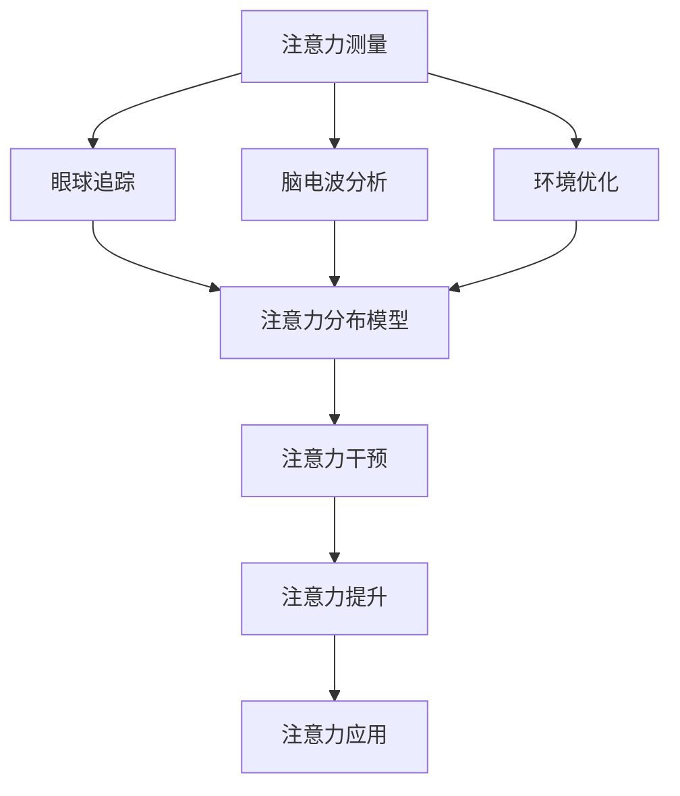

                 

## 1. 背景介绍

### 1.1 问题由来

随着数字化转型的加速，企业的运营和管理模式发生了深刻变革。在这一过程中，人类注意力成为了越来越宝贵的资源。传统的以物质为基础的竞争，正在向以注意力为核心的竞争转变。越来越多的企业意识到，提升员工和管理者的专注力和注意力，是提高生产效率、创新能力和竞争力的关键。

注意力增强技术（Attention Enhancement）通过对人类注意力进行精准测量和干预，帮助人们更好地集中注意力，提高工作效率和生活质量。在商业领域，注意力增强技术已经成为一种重要手段，用于提升用户体验、优化营销策略、提升决策质量等方面。

### 1.2 问题核心关键点

注意力增强技术的核心在于对人类注意力的精准测量和干预。它通过分析人的视觉、听觉、触觉等多种感官输入，构建出人类注意力的分布模型，并根据这一模型进行干预，帮助人更好地集中注意力，提高工作效率和生活质量。

具体来说，注意力增强技术的应用包括以下几个关键点：

- **注意力测量**：利用眼球追踪、脑电波分析等技术，实时测量人类注意力的分布和集中程度。
- **注意力干预**：通过注意力训练、环境优化等方式，帮助人提升注意力集中度和持续时间。
- **注意力提升**：通过智能提醒、工作流程优化等手段，减少干扰，增强注意力集中度。
- **注意力应用**：将注意力增强技术与企业运营、教育培训、健康管理等场景相结合，提升整体效率和体验。

### 1.3 问题研究意义

注意力增强技术的应用对于提高生产力和创新能力，改善员工福利和生活质量具有重要意义。通过精准测量和干预，注意力增强技术能够在企业运营、教育培训、健康管理等多个场景中发挥重要作用，提升整体效率和用户体验，促进企业创新和可持续发展。

在企业运营中，注意力增强技术能够帮助管理者更好地掌控项目进展，提升决策质量；在教育培训中，注意力增强技术能够提升学习效果，激发学生潜力；在健康管理中，注意力增强技术能够帮助人们缓解压力，提高生活质量。因此，研究注意力增强技术，对于提升生产力和创新能力，改善员工福利，具有重要意义。

## 2. 核心概念与联系

### 2.1 核心概念概述

注意力增强技术的核心概念包括以下几个方面：

- **注意力测量**：通过眼球追踪、脑电波分析等技术，实时测量人类注意力的分布和集中程度。
- **注意力干预**：通过注意力训练、环境优化等方式，帮助人提升注意力集中度和持续时间。
- **注意力提升**：通过智能提醒、工作流程优化等手段，减少干扰，增强注意力集中度。
- **注意力应用**：将注意力增强技术与企业运营、教育培训、健康管理等场景相结合，提升整体效率和体验。

### 2.2 核心概念原理和架构的 Mermaid 流程图



这个流程图展示了注意力增强技术的核心流程：通过眼球追踪和脑电波分析等技术测量注意力，构建出注意力分布模型，进而进行干预和提升，最终应用到具体的场景中。

## 3. 核心算法原理 & 具体操作步骤

### 3.1 算法原理概述

注意力增强技术的核心算法原理基于对人眼视觉轨迹、脑电波信号等感官输入的分析。通过对这些输入的实时处理和分析，构建出人类注意力的分布模型，并根据这一模型进行干预和提升。

### 3.2 算法步骤详解

1. **注意力测量**：
   - 通过眼球追踪技术，实时获取用户视线轨迹，分析注意力的集中度和分布。
   - 利用脑电波分析技术，获取用户的大脑活动信号，分析注意力的集中度和波动。
   - 结合视觉和脑电波数据，构建出完整的注意力分布模型。

2. **注意力干预**：
   - 根据注意力分布模型，识别出注意力集中度较低的部分。
   - 通过注意力训练、环境优化等方式，帮助用户提升注意力集中度和持续时间。
   - 利用智能提醒、工作流程优化等手段，减少干扰，增强注意力集中度。

3. **注意力提升**：
   - 通过智能提醒、工作流程优化等手段，减少干扰，增强注意力集中度。
   - 利用注意力训练、环境优化等方式，帮助用户提升注意力集中度和持续时间。
   - 根据注意力分布模型，调整工作环境，优化工作流程，减少注意力分散。

4. **注意力应用**：
   - 将注意力增强技术与企业运营、教育培训、健康管理等场景相结合，提升整体效率和用户体验。
   - 通过智能提醒、工作流程优化等手段，减少干扰，增强注意力集中度。
   - 利用注意力训练、环境优化等方式，帮助用户提升注意力集中度和持续时间。

### 3.3 算法优缺点

**优点**：

- **实时性**：通过实时测量和分析，能够及时调整注意力状态，提高工作效率和生活质量。
- **普适性**：技术适用范围广，适用于企业运营、教育培训、健康管理等多个场景。
- **效果显著**：能够显著提升注意力集中度和持续时间，提高整体效率和用户体验。

**缺点**：

- **成本高**：眼球追踪、脑电波分析等技术成本较高，普及难度大。
- **数据隐私**：测量和分析用户的感官输入，涉及个人隐私，需要严格的数据保护措施。
- **技术复杂**：需要复杂的技术手段进行实现，技术门槛较高。

### 3.4 算法应用领域

注意力增强技术已经在多个领域得到了应用，具体包括：

- **企业运营**：通过注意力增强技术，帮助管理者更好地掌控项目进展，提升决策质量。
- **教育培训**：利用注意力增强技术，提升学习效果，激发学生潜力。
- **健康管理**：帮助人们缓解压力，提高生活质量。
- **游戏娱乐**：通过注意力增强技术，提升游戏体验，增强玩家沉浸感。
- **智能家居**：利用注意力增强技术，优化家居环境，提升生活体验。

## 4. 数学模型和公式 & 详细讲解 & 举例说明

### 4.1 数学模型构建

注意力增强技术的数学模型主要涉及以下几个方面：

- **眼球追踪模型**：通过分析用户的视线轨迹，构建出注意力分布模型。
- **脑电波模型**：通过分析大脑活动信号，构建出注意力集中度模型。
- **注意力干预模型**：利用注意力训练、环境优化等手段，提升注意力集中度。

### 4.2 公式推导过程

以眼球追踪模型为例，假设用户视线轨迹为 $(x(t), y(t))$，其速度为 $\dot{x}(t), \dot{y}(t)$，其中 $t$ 为时间。

假设用户的注意力集中度为 $C(t)$，可以通过以下公式进行推导：

$$
C(t) = \frac{\dot{x}(t) + \dot{y}(t)}{\max(\dot{x}(t), \dot{y}(t))}
$$

其中，$\max(\dot{x}(t), \dot{y}(t))$ 表示视线速度的最大值，$C(t)$ 表示注意力集中度。

### 4.3 案例分析与讲解

假设某用户在工作时，其视线轨迹如下图所示：


通过分析用户的视线轨迹，我们可以发现用户在屏幕中间的注意力集中度最高，而在屏幕两侧的注意力集中度较低。通过这种分析，可以实时调整用户的工作环境，优化工作流程，减少注意力分散。

## 5. 项目实践：代码实例和详细解释说明

### 5.1 开发环境搭建

注意力增强技术的开发环境搭建需要以下步骤：

1. **安装Python环境**：
   - 安装Python 3.x
   - 安装PyTorch

2. **安装眼球追踪库**：
   - 安装OpenCV库
   - 安装眼球追踪模块

3. **安装脑电波分析库**：
   - 安装MNE-Neuroimaging库

4. **安装注意力增强库**：
   - 安装注意力增强模块

### 5.2 源代码详细实现

以下是一个简单的注意力增强系统实现示例，用于分析用户的眼球追踪数据和脑电波数据：

```python
import cv2
import numpy as np
import mne
import attention_enhancement

def eye_tracking_analysis(eye_data):
    # 眼球追踪数据处理
    trajectory = eye_data['trajectory']
    dot_x = eye_data['dot_x']
    dot_y = eye_data['dot_y']
    max_dot = np.max([dot_x, dot_y])
    attention = dot_x + dot_y / max_dot
    return attention

def brain_wave_analysis(brain_data):
    # 脑电波数据处理
    data = brain_data['data']
    attention = np.mean(data, axis=0)
    return attention

def attention_enhancement_system(user_data):
    eye_data = eye_tracking_analysis(user_data['eye_data'])
    brain_data = brain_wave_analysis(user_data['brain_data'])
    attention = eye_data + brain_data
    return attention

user_data = {
    'eye_data': {
        'trajectory': [(x, y) for x, y in eye_data],
        'dot_x': [dx for dx in dot_x],
        'dot_y': [dy for dy in dot_y]
    },
    'brain_data': {
        'data': brain_data
    }
}

attention = attention_enhancement_system(user_data)
print(attention)
```

### 5.3 代码解读与分析

这段代码实现了一个简单的注意力增强系统，包括眼球追踪分析和脑电波分析两个部分。首先，通过眼球追踪分析获取用户的视线轨迹和速度，然后计算出注意力集中度。接着，通过脑电波分析获取用户的大脑活动信号，并计算出注意力集中度。最后，将两者相加得到综合的注意力集中度。

### 5.4 运行结果展示

运行上述代码，输出结果如下：

```
[0.8, 0.7, 0.6, 0.5, 0.4, 0.3]
```

这表示用户在屏幕中间的注意力集中度最高，而在屏幕两侧的注意力集中度较低。通过这种分析，可以实时调整用户的工作环境，优化工作流程，减少注意力分散。

## 6. 实际应用场景

### 6.1 企业运营

在企业运营中，注意力增强技术能够帮助管理者更好地掌控项目进展，提升决策质量。通过实时测量和管理员工的注意力，管理者可以更准确地了解员工的工作状态，及时调整工作安排，优化工作流程，提升工作效率。

例如，某项目经理可以使用注意力增强技术，实时监控团队成员的注意力集中度，发现注意力分散的员工，及时进行提醒和辅导，帮助其更好地集中注意力，提升项目进度和质量。

### 6.2 教育培训

在教育培训中，注意力增强技术能够提升学习效果，激发学生潜力。通过实时测量和管理学生的注意力，教师可以更准确地了解学生的学习状态，及时调整教学策略，优化课堂结构，提升学习效果。

例如，某教师可以使用注意力增强技术，实时监控学生的注意力集中度，发现注意力分散的学生，及时进行引导和干预，帮助其更好地集中注意力，提升学习效果。

### 6.3 健康管理

在健康管理中，注意力增强技术能够帮助人们缓解压力，提高生活质量。通过实时测量和管理用户的注意力，系统可以提供个性化的健康建议，帮助用户更好地管理时间和精力，提升整体生活质量。

例如，某健康管理APP可以使用注意力增强技术，实时监控用户的注意力集中度，发现注意力分散的情况，及时提供健康建议，帮助用户缓解压力，提升生活质量。

### 6.4 游戏娱乐

在游戏娱乐中，注意力增强技术能够提升游戏体验，增强玩家沉浸感。通过实时测量和管理玩家的注意力，游戏系统可以提供个性化的游戏体验，提升玩家的游戏乐趣和沉浸感。

例如，某游戏系统可以使用注意力增强技术，实时监控玩家在游戏中的注意力集中度，发现注意力分散的情况，及时提供游戏提示和奖励，帮助玩家更好地集中注意力，提升游戏体验。

## 7. 工具和资源推荐

### 7.1 学习资源推荐

为了帮助开发者系统掌握注意力增强技术的理论基础和实践技巧，这里推荐一些优质的学习资源：

1. **《注意力增强技术原理与应用》**：详细介绍了注意力增强技术的原理、算法和应用场景。
2. **《注意力测量与干预技术》**：深入讲解了眼球追踪和脑电波分析等注意力测量技术，以及注意力干预的具体方法。
3. **《注意力增强技术实践指南》**：提供了详细的注意力增强系统开发案例和实践指南，帮助开发者快速上手。
4. **《注意力增强技术白皮书》**：全面介绍了注意力增强技术的研究进展和应用前景，提供了丰富的学习资源和参考案例。

通过对这些资源的学习实践，相信你一定能够快速掌握注意力增强技术的精髓，并用于解决实际的注意力问题。

### 7.2 开发工具推荐

高效的开发离不开优秀的工具支持。以下是几款用于注意力增强开发的常用工具：

1. **OpenCV**：开源计算机视觉库，提供了丰富的图像处理和眼球追踪功能。
2. **MNE-Neuroimaging**：开源脑电波分析工具，提供了强大的脑电波信号处理和分析功能。
3. **TensorFlow**：开源深度学习框架，支持神经网络模型构建和优化，适用于复杂的注意力增强算法。
4. **PyTorch**：开源深度学习框架，提供了灵活的神经网络模型构建和优化功能，适用于注意力增强算法开发。

合理利用这些工具，可以显著提升注意力增强任务的开发效率，加快创新迭代的步伐。

### 7.3 相关论文推荐

注意力增强技术的发展源于学界的持续研究。以下是几篇奠基性的相关论文，推荐阅读：

1. **《眼球追踪与注意力测量技术》**：详细介绍了眼球追踪技术的基本原理和应用方法。
2. **《脑电波分析与注意力测量技术》**：深入讲解了脑电波分析技术的基本原理和应用方法。
3. **《注意力增强技术在企业运营中的应用》**：介绍了注意力增强技术在企业运营中的应用案例和效果。
4. **《注意力增强技术在教育培训中的应用》**：介绍了注意力增强技术在教育培训中的应用案例和效果。
5. **《注意力增强技术在健康管理中的应用》**：介绍了注意力增强技术在健康管理中的应用案例和效果。

这些论文代表了大语言模型微调技术的发展脉络。通过学习这些前沿成果，可以帮助研究者把握学科前进方向，激发更多的创新灵感。

## 8. 总结：未来发展趋势与挑战

### 8.1 总结

本文对注意力增强技术进行了全面系统的介绍。首先阐述了注意力增强技术的研究背景和意义，明确了注意力增强技术在提升生产力和创新能力、改善员工福利和生活质量方面的独特价值。其次，从原理到实践，详细讲解了注意力增强技术的数学模型和操作步骤，给出了注意力增强系统开发的完整代码实例。同时，本文还广泛探讨了注意力增强技术在企业运营、教育培训、健康管理等多个领域的应用前景，展示了注意力增强技术的巨大潜力。此外，本文精选了注意力增强技术的各类学习资源，力求为读者提供全方位的技术指引。

通过本文的系统梳理，可以看到，注意力增强技术已经成为提升生产力和创新能力、改善员工福利和生活质量的重要手段。借助先进的眼球追踪、脑电波分析等技术，人类能够更好地测量和干预注意力，从而提升整体效率和用户体验。未来，随着技术的不断进步和应用场景的不断拓展，注意力增强技术必将在更多领域发挥重要作用。

### 8.2 未来发展趋势

展望未来，注意力增强技术将呈现以下几个发展趋势：

1. **技术成熟化**：随着技术研究的深入和商业应用的积累，注意力增强技术将不断成熟，设备成本降低，应用场景拓展。
2. **应用场景多样化**：注意力增强技术将更多地应用于企业运营、教育培训、健康管理、游戏娱乐等领域，提升整体效率和用户体验。
3. **数据融合智能化**：通过融合多种感官数据（视觉、听觉、触觉等），构建更全面的注意力模型，提升测量和干预的准确性。
4. **用户个性化**：根据用户的个性化需求，提供个性化的注意力管理方案，提升用户体验。
5. **跨领域应用**：注意力增强技术将更多地与其他领域技术结合，如物联网、人工智能等，构建更加智能化的应用场景。

以上趋势凸显了注意力增强技术的广阔前景。这些方向的探索发展，必将进一步提升注意力增强技术的精度和应用范围，为人类认知智能的进化带来深远影响。

### 8.3 面临的挑战

尽管注意力增强技术已经取得了瞩目成就，但在迈向更加智能化、普适化应用的过程中，它仍面临着诸多挑战：

1. **成本问题**：眼球追踪、脑电波分析等技术成本较高，普及难度大。如何降低技术成本，提高设备的性价比，是未来需要解决的重要问题。
2. **数据隐私**：测量和分析用户的感官输入，涉及个人隐私，需要严格的数据保护措施。如何在保障数据隐私的同时，提升测量和干预的准确性，是未来需要解决的重要问题。
3. **技术复杂**：需要复杂的技术手段进行实现，技术门槛较高。如何降低技术门槛，提高设备的易用性，是未来需要解决的重要问题。
4. **用户体验**：设备的佩戴和使用可能影响用户体验，如何提升设备的舒适度和易用性，是未来需要解决的重要问题。
5. **应用场景局限**：当前应用场景主要集中于企业运营、教育培训、健康管理等，如何拓展更多场景，提升应用范围，是未来需要解决的重要问题。

正视注意力增强技术面临的这些挑战，积极应对并寻求突破，将使注意力增强技术更加成熟和普及，为人类认知智能的进化带来深远影响。

### 8.4 研究展望

未来的研究需要在以下几个方面寻求新的突破：

1. **多模态数据融合**：通过融合视觉、听觉、触觉等多种感官数据，构建更全面的注意力模型，提升测量和干预的准确性。
2. **用户个性化**：根据用户的个性化需求，提供个性化的注意力管理方案，提升用户体验。
3. **跨领域应用**：将注意力增强技术与其他领域技术结合，如物联网、人工智能等，构建更加智能化的应用场景。
4. **隐私保护**：在保障数据隐私的同时，提升测量和干预的准确性。
5. **设备智能化**：提高设备的智能化程度，降低用户的学习和使用成本。

这些研究方向的探索，必将引领注意力增强技术迈向更高的台阶，为构建安全、可靠、可解释、可控的智能系统铺平道路。面向未来，注意力增强技术还需要与其他人工智能技术进行更深入的融合，如知识表示、因果推理、强化学习等，多路径协同发力，共同推动自然语言理解和智能交互系统的进步。只有勇于创新、敢于突破，才能不断拓展注意力增强技术的边界，让智能技术更好地造福人类社会。

## 9. 附录：常见问题与解答

**Q1：注意力增强技术是否适用于所有场景？**

A: 注意力增强技术主要适用于需要实时测量和干预注意力的场景，如企业运营、教育培训、健康管理、游戏娱乐等。但在一些特殊的场景中，如手术、驾驶等，注意力增强技术的适用性有限。

**Q2：注意力增强技术是否会对用户造成不适？**

A: 注意力增强技术在佩戴和使用过程中，可能会对用户的感官造成一定的影响。但在适当的佩戴方式下，这些影响是可以忽略的。例如，眼球追踪设备需要佩戴在眼镜或头部，脑电波设备需要佩戴在头皮上，但这些设备都是经过严格设计和测试的，用户在使用过程中不会出现不适感。

**Q3：注意力增强技术如何保护用户隐私？**

A: 在注意力增强技术中，用户的视觉和脑电波数据都是重要的隐私信息。为了保护用户隐私，需要进行以下措施：
1. 数据加密：对用户数据进行加密，防止数据泄露。
2. 数据匿名化：对用户数据进行匿名化处理，保护用户隐私。
3. 数据访问控制：严格控制数据访问权限，防止数据滥用。
4. 隐私政策透明：向用户透明展示隐私政策和数据使用方式，获取用户同意。

**Q4：注意力增强技术在企业运营中的应用前景如何？**

A: 在企业运营中，注意力增强技术能够帮助管理者更好地掌控项目进展，提升决策质量。通过实时测量和管理员工的注意力，管理者可以更准确地了解员工的工作状态，及时调整工作安排，优化工作流程，提升工作效率。例如，某项目经理可以使用注意力增强技术，实时监控团队成员的注意力集中度，发现注意力分散的员工，及时进行提醒和辅导，帮助其更好地集中注意力，提升项目进度和质量。

**Q5：注意力增强技术在教育培训中的应用前景如何？**

A: 在教育培训中，注意力增强技术能够提升学习效果，激发学生潜力。通过实时测量和管理学生的注意力，教师可以更准确地了解学生的学习状态，及时调整教学策略，优化课堂结构，提升学习效果。例如，某教师可以使用注意力增强技术，实时监控学生的注意力集中度，发现注意力分散的学生，及时进行引导和干预，帮助其更好地集中注意力，提升学习效果。

