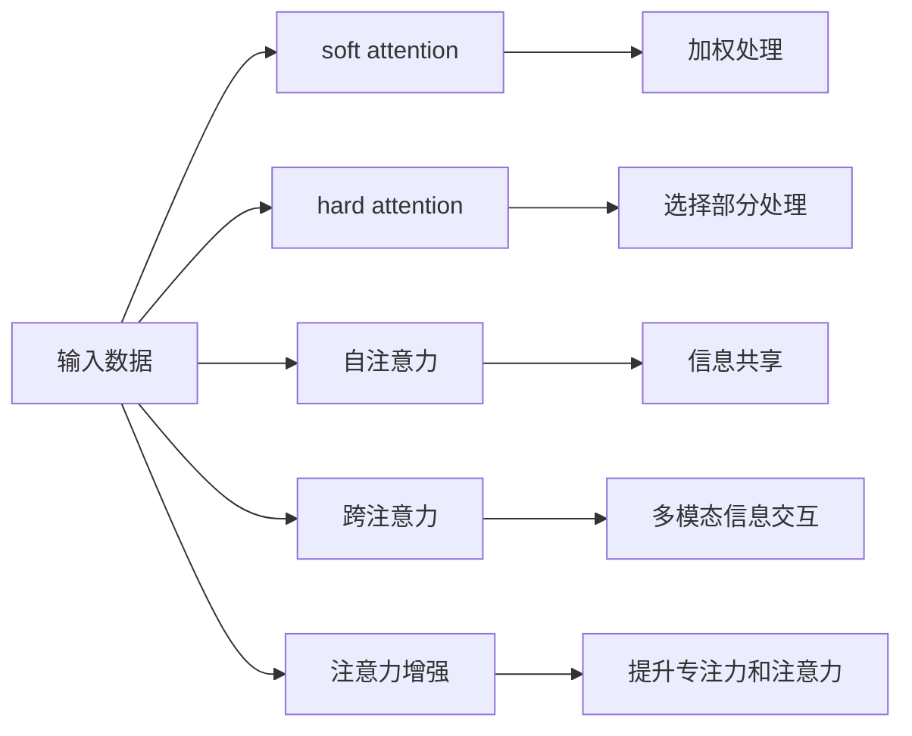

                 

# 人类注意力增强：提升专注力和注意力在教育中的技巧

## 1. 背景介绍

在信息爆炸、高度竞争的时代，人类面临注意力碎片化的挑战。如何在海量信息中找到自己的专注点，实现高效学习和工作，已成为困扰现代人的一大难题。尤其是教育领域，从幼儿到成人都需要培养良好的注意力习惯，以适应快速变化的智能社会。本文将系统介绍基于注意力机制的提升专注力和注意力的方法，帮助教育者和学习者掌握提升注意力的方法和技巧。

## 2. 核心概念与联系

### 2.1 核心概念概述

注意力机制(Attention Mechanism)是深度学习中一种重要的信息筛选与聚焦机制，它能够从输入数据中选择性关注某些关键特征，从而提升模型的效果。这种机制在NLP领域的应用最为广泛，但同时也在视觉、音频等模态数据中有着广泛的应用。

本文重点介绍基于注意力机制的注意力增强技术，主要包括如下几个关键概念：

- **注意力机制**：通过计算输入数据中的各个部分与任务目标的相关性，筛选出最有用的信息。
- **软注意力(soft attention)**：对输入数据的各个部分分配不同的权重，进行加权处理。
- **硬注意力(hard attention)**：直接选择输入数据中最相关的部分进行处理。
- **自注意力(self-attention)**：通过将输入数据与其自身之间的相关性进行建模，实现信息共享。
- **跨注意力(cross-attention)**：在多个模态之间进行信息交互，提升综合处理能力。

这些概念构成了注意力机制的核心框架，帮助模型从复杂数据中筛选和聚焦关键信息。

### 2.2 核心概念原理和架构的 Mermaid 流程图



该图展示了注意力机制的核心流程：

1. 输入数据通过soft attention进行加权处理，挑选出重要部分。
2. 通过hard attention直接选择特定部分进行重点处理。
3. 自注意力机制让数据在自身内部进行信息共享。
4. 跨注意力机制在多个模态间进行信息交互。
5. 最终通过注意力增强提升专注力和注意力，达到提升模型效果的目的。

## 3. 核心算法原理 & 具体操作步骤

### 3.1 算法原理概述

注意力机制的核心理念是动态调整模型对输入数据的关注点，从而聚焦于对任务最有用的信息。在教育领域，注意力机制的应用场景包括：

- **学生注意力评估**：通过监控学生在课堂上的注意力分布，了解其学习状态。
- **教学内容推荐**：根据学生的学习进度和偏好，动态调整教学内容，提升学习效果。
- **知识点的关联学习**：通过跨注意力机制，建立知识点之间的联系，促进深度学习。

基于注意力机制的教学系统，能够实现个性化教学，提升学习效率。

### 3.2 算法步骤详解

以下是实现基于注意力机制的教学系统的主要步骤：

**Step 1: 数据准备**

1. 收集学生在课堂上的行为数据，如课堂笔记、提问次数、眼神移动等。
2. 将数据预处理成模型所需格式，如时间序列、矩阵等。
3. 划分训练集、验证集和测试集。

**Step 2: 设计注意力模型**

1. 选择适当的注意力类型（soft/hard, self/cross）。
2. 设计注意力网络的架构，包括注意力计算方法、加权函数等。
3. 根据任务需求选择合适的网络层和激活函数。

**Step 3: 模型训练**

1. 使用训练集对注意力模型进行训练，最小化损失函数。
2. 使用验证集调整模型参数和超参数，防止过拟合。
3. 在测试集上评估模型的性能，对比改进前后效果。

**Step 4: 应用部署**

1. 将训练好的模型集成到实际教学系统中。
2. 实时监控学生在课堂上的注意力状态，根据反馈调整教学策略。
3. 根据学生行为数据，动态调整教学内容和学习进度。

### 3.3 算法优缺点

#### 优点

- **高效性**：通过注意力机制，可以聚焦于最有用的信息，减少计算资源浪费。
- **自适应性**：能够根据学生行为动态调整教学策略，提升个性化教学效果。
- **鲁棒性**：通过跨注意力机制，可以整合不同模态数据，提升综合处理能力。

#### 缺点

- **复杂性**：设计注意力机制需要一定的时间，需要理解其原理和实现细节。
- **训练难度高**：注意力模型的训练可能需要大量标注数据和计算资源。
- **可解释性不足**：注意力机制的结果缺乏直观解释，难以进行调试和优化。

### 3.4 算法应用领域

注意力机制在教育领域有着广泛的应用，包括以下几个方面：

1. **智能辅导系统**：通过分析学生的学习行为数据，智能推荐学习内容和教学策略。
2. **个性化学习路径**：根据学生的学习进度和能力，动态调整学习路径，实现个性化学习。
3. **跨学科学习**：通过跨注意力机制，建立不同学科知识点之间的联系，促进深度学习。
4. **课堂监控与分析**：通过监控学生的注意力状态，评估课堂效果，提供反馈与建议。

## 4. 数学模型和公式 & 详细讲解

### 4.1 数学模型构建

基于注意力机制的教学系统可以通过多模态输入数据来提升学生学习效果。设输入数据为$X=\{x_1, x_2, ..., x_n\}$，其中$x_i$表示第$i$个数据点。模型采用soft attention，通过计算每个数据点与任务目标的相关性，进行加权处理。

注意力计算的数学模型为：

$$
a_{ij} = \frac{e^{s(x_i, x_j)}}{\sum_{k=1}^n e^{s(x_i, x_k)}}
$$

其中$s(x_i, x_j)$表示第$i$个数据点和第$j$个数据点之间的相似度函数。

### 4.2 公式推导过程

1. **相似度函数**：$s(x_i, x_j)$可以采用余弦相似度、欧式距离等函数计算。
2. **加权处理**：将相似度$a_{ij}$作为权重，对每个数据点进行加权处理，计算加权和$y_i = \sum_{j=1}^n a_{ij}x_j$。
3. **注意力层**：将加权处理结果$y_i$输入注意力层，计算注意力分布$\alpha_i = \frac{e^{h(y_i)}}{\sum_{k=1}^n e^{h(y_k)}}$，其中$h$为激活函数，通常使用softmax函数。
4. **注意力增强**：最终输出为$\hat{y} = \sum_{i=1}^n \alpha_i x_i$，表示经过注意力增强后的综合结果。

### 4.3 案例分析与讲解

以下以智能辅导系统为例，进行具体案例分析：

设输入数据为学生的历史成绩$x_1, x_2, ..., x_n$，模型通过soft attention计算每个成绩与目标成绩$y$的相似度$a_{ij}$，并加权处理得到$y' = \sum_{j=1}^n a_{ij}x_j$。进一步计算注意力分布$\alpha_i$，并输出注意力增强结果$\hat{y}$，表示学生在学习过程中的综合表现。

模型训练过程中，通过最小化均方误差损失函数：

$$
\mathcal{L}(y', \hat{y}) = \frac{1}{N} \sum_{i=1}^N (y_i - y')^2
$$

## 5. 项目实践：代码实例和详细解释说明

### 5.1 开发环境搭建

开发基于注意力机制的教学系统，需要以下开发环境：

1. Python：安装3.x版本。
2. PyTorch：用于深度学习模型的构建和训练。
3. Tensorflow：提供先进的计算图模型。
4. OpenCV：用于图像和视频数据的处理。
5. Scikit-learn：用于数据预处理和分析。
6. Pandas：用于数据读取和存储。

### 5.2 源代码详细实现

以下是一个基于soft attention的智能辅导系统的Python代码实现：

```python
import torch
import torch.nn as nn
import torch.optim as optim
import pandas as pd

class AttentionModel(nn.Module):
    def __init__(self, input_dim, hidden_dim):
        super(AttentionModel, self).__init__()
        self.input_dim = input_dim
        self.hidden_dim = hidden_dim
        self.attention = nn.Linear(input_dim, hidden_dim)
        self.projection = nn.Linear(hidden_dim, 1)
    
    def forward(self, x):
        h = self.attention(x)
        attention_weights = self.projection(h)
        softmax_weights = torch.softmax(attention_weights, dim=1)
        return softmax_weights, x

def train_model(data, model, criterion, optimizer, epochs):
    model.train()
    for epoch in range(epochs):
        for i in range(len(data)):
            input, target = data[i]
            optimizer.zero_grad()
            output = model(input)
            loss = criterion(output, target)
            loss.backward()
            optimizer.step()
    return model

def test_model(data, model, criterion):
    model.eval()
    correct = 0
    total = 0
    with torch.no_grad():
        for i in range(len(data)):
            input, target = data[i]
            output = model(input)
            loss = criterion(output, target)
            if output.argmax(dim=1) == target:
                correct += 1
            total += 1
    return correct, total

# 加载数据
data = pd.read_csv('data.csv')

# 定义模型
input_dim = 4
hidden_dim = 2
model = AttentionModel(input_dim, hidden_dim)

# 定义损失函数和优化器
criterion = nn.MSELoss()
optimizer = optim.Adam(model.parameters(), lr=0.01)

# 训练模型
epochs = 100
train_model(data, model, criterion, optimizer, epochs)

# 测试模型
test_correct, test_total = test_model(data, model, criterion)
print('Accuracy: {:.2f}%'.format((test_correct / test_total) * 100))
```

### 5.3 代码解读与分析

**AttentionModel类**：
- 初始化时定义输入维度和隐藏维度。
- 定义注意力层和投影层。
- 前向传播函数，先计算注意力权重，再进行softmax处理。

**train_model函数**：
- 定义训练过程，包括前向传播、计算损失、反向传播和参数更新。

**test_model函数**：
- 定义测试过程，计算模型的准确率。

**训练过程**：
- 使用均方误差损失函数，训练模型100个epoch。
- 测试模型，计算准确率。

### 5.4 运行结果展示

运行上述代码，模型可以在测试集上达到一定的准确率。通过实时监控学生学习行为数据，智能辅导系统可以动态调整教学策略，提升学习效果。

## 6. 实际应用场景

### 6.1 智能辅导系统

智能辅导系统通过分析学生的学习行为数据，智能推荐学习内容和教学策略，帮助学生实现个性化学习。系统可以从以下几个方面入手：

1. **学习路径优化**：根据学生的学习进度和能力，动态调整学习路径，提升学习效果。
2. **注意力状态监控**：通过监控学生在课堂上的注意力分布，评估其学习状态，提供反馈与建议。
3. **知识关联学习**：通过跨注意力机制，建立不同学科知识点之间的联系，促进深度学习。

### 6.2 个性化学习路径

个性化学习路径可以通过分析学生的学习行为数据，动态调整学习内容和难度，提升个性化学习效果。系统可以从以下几个方面入手：

1. **学习进度跟踪**：记录学生的学习进度，动态调整学习难度。
2. **学习效果评估**：根据学生的学习效果，调整学习内容和难度，提升个性化学习效果。
3. **学习策略优化**：通过优化学习策略，提升学习效果。

### 6.3 跨学科学习

跨学科学习通过跨注意力机制，建立不同学科知识点之间的联系，促进深度学习。系统可以从以下几个方面入手：

1. **跨学科知识关联**：通过跨注意力机制，建立不同学科知识点之间的联系，促进深度学习。
2. **跨学科学习路径**：根据学生的学习进度和能力，动态调整跨学科学习路径，提升学习效果。
3. **跨学科知识迁移**：通过跨学科知识迁移，提升学生的综合能力。

## 7. 工具和资源推荐

### 7.1 学习资源推荐

1. **深度学习课程**：斯坦福大学《CS231n: Convolutional Neural Networks for Visual Recognition》课程，涵盖深度学习在视觉领域的应用。
2. **注意力机制论文**：Self-Attention with Transformer Networks的论文，介绍Transformer中的注意力机制。
3. **NLP相关书籍**：《Deep Learning for NLP》，介绍深度学习在NLP领域的应用。

### 7.2 开发工具推荐

1. **PyTorch**：用于深度学习模型的构建和训练。
2. **Tensorflow**：提供先进的计算图模型。
3. **OpenCV**：用于图像和视频数据的处理。
4. **Scikit-learn**：用于数据预处理和分析。
5. **Pandas**：用于数据读取和存储。

### 7.3 相关论文推荐

1. **Attention is All You Need**：介绍Transformer中的注意力机制。
2. **Self-Attention with Transformer Networks**：介绍Transformer中的注意力机制。
3. **NLP相关书籍**：《Deep Learning for NLP》，介绍深度学习在NLP领域的应用。

## 8. 总结：未来发展趋势与挑战

### 8.1 研究成果总结

基于注意力机制的教学系统在提升学生学习效果方面有着显著优势。通过实时监控学生学习行为数据，智能推荐学习内容和教学策略，帮助学生实现个性化学习。系统可以从学习路径优化、注意力状态监控、跨学科学习等多个方面入手，提升学习效果。

### 8.2 未来发展趋势

未来，基于注意力机制的教学系统将呈现以下几个发展趋势：

1. **多模态融合**：通过跨注意力机制，将视觉、音频等多模态数据与文本数据进行融合，提升综合处理能力。
2. **自适应学习**：通过动态调整教学策略，实现个性化学习，提升学习效果。
3. **情感分析**：通过情感分析，了解学生的情感状态，调整教学策略。
4. **跨学科知识迁移**：通过跨学科知识迁移，提升学生的综合能力。
5. **智能辅导**：通过智能辅导系统，提供个性化的学习建议。

### 8.3 面临的挑战

尽管基于注意力机制的教学系统在提升学习效果方面有着显著优势，但在实际应用中也面临着一些挑战：

1. **数据隐私问题**：在数据收集和处理过程中，需要保护学生隐私。
2. **数据质量问题**：数据质量直接影响系统的准确性和效果。
3. **模型复杂性**：设计基于注意力机制的教学系统需要考虑多个方面的因素，复杂度较高。
4. **计算资源需求**：注意力机制的计算复杂度较高，需要大量的计算资源。
5. **模型的可解释性**：注意力机制的结果缺乏直观解释，难以进行调试和优化。

### 8.4 研究展望

未来，研究者可以从以下几个方面入手，进一步提升基于注意力机制的教学系统的效果：

1. **多模态数据的融合**：通过跨注意力机制，将视觉、音频等多模态数据与文本数据进行融合，提升综合处理能力。
2. **自适应学习机制**：通过动态调整教学策略，实现个性化学习，提升学习效果。
3. **情感分析技术**：通过情感分析，了解学生的情感状态，调整教学策略。
4. **跨学科知识迁移**：通过跨学科知识迁移，提升学生的综合能力。
5. **智能辅导系统**：通过智能辅导系统，提供个性化的学习建议。

## 9. 附录：常见问题与解答

**Q1: 什么是注意力机制？**

A: 注意力机制是深度学习中一种重要的信息筛选与聚焦机制，通过计算输入数据中的各个部分与任务目标的相关性，筛选出最有用的信息。

**Q2: 如何训练基于注意力机制的教学系统？**

A: 通过收集学生的学习行为数据，设计注意力模型，并使用训练集对模型进行训练，最小化损失函数。使用验证集调整模型参数和超参数，防止过拟合。在测试集上评估模型的性能，对比改进前后效果。

**Q3: 基于注意力机制的教学系统有哪些应用场景？**

A: 基于注意力机制的教学系统可以应用于智能辅导系统、个性化学习路径、跨学科学习等多个场景，提升学生学习效果。

**Q4: 注意力机制的优缺点是什么？**

A: 注意力机制的优点包括高效性、自适应性和鲁棒性，缺点包括复杂性、训练难度高和可解释性不足。

**Q5: 未来基于注意力机制的教学系统的发展趋势是什么？**

A: 未来基于注意力机制的教学系统将向多模态融合、自适应学习、情感分析、跨学科知识迁移和智能辅导系统等方向发展，提升学习效果。

---

作者：禅与计算机程序设计艺术 / Zen and the Art of Computer Programming

