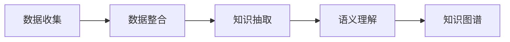

                 

# 人类的知识地图：绘制理解的疆域

在信息技术飞速发展的今天，人类正迎来前所未有的知识爆炸。而绘制一份人类知识的地图，将有助于我们更好地理解、组织和应用这些信息。本文将探讨这一命题，讨论如何在庞大的知识海洋中绘制出一张全面、精确的知识地图，为人类理解自身及世界的复杂性提供坚实基础。

## 1. 背景介绍

### 1.1 问题由来
随着计算机科学和人工智能的迅速发展，越来越多的数据被数字化、结构化，并存储在互联网和数据库中。这些数据以各种形式存在，如文本、图片、音频和视频等，为人类探索和理解复杂世界提供了丰富的材料。然而，数据的庞杂和多样性也带来了新的挑战。

知识地图是一种用于整理、关联和显示知识资源的工具，它可以帮助我们在数据海洋中找到有用的信息，并对其做出合理的分析和应用。绘制人类知识地图，不仅有助于学术研究，还可以在工业、商业等领域提供决策支持，提升效率。

### 1.2 问题核心关键点
绘制人类知识地图的核心在于如何系统地组织、表达、关联这些数据，并从海量数据中提取有用的信息。这涉及到数据整合、知识抽取、语义理解等关键环节。

- **数据整合**：收集和处理来自不同来源的数据，如文本、图片、音频等。
- **知识抽取**：从数据中提取关键信息，并将其映射到特定的知识体系中。
- **语义理解**：理解和关联不同知识元素之间的关系，建立起全面、连贯的知识图谱。

### 1.3 问题研究意义
通过绘制人类知识地图，我们可以：
- 促进知识的系统化整理，避免重复和遗漏。
- 增强不同领域、不同学科之间的知识共享与协作。
- 加速科学发现和技术创新，推动社会进步。

绘制人类知识地图将有助于实现知识的全面、深度、高效率的利用，对于构建智慧社会、提升人类福祉具有重要意义。

## 2. 核心概念与联系

### 2.1 核心概念概述

为更好地理解人类知识地图的绘制，本文将介绍几个关键概念：

- **知识图谱(Knowledge Graph)**：由节点和边构成，用于表示实体与实体之间的关系。
- **知识抽取(Information Extraction)**：从非结构化数据中提取结构化知识的过程。
- **语义网络(Semantic Network)**：一种基于图论的知识表示方法，用于模拟人类认知方式。
- **语义网(Semantic Web)**：在Web上使用的语义数据，实现信息的高效检索和共享。
- **自然语言处理(Natural Language Processing, NLP)**：使计算机能够理解、解释和生成自然语言的技术。

这些概念通过一系列的计算和建模方法，将知识数据转化为结构化、可查询的知识图谱，为人类知识的地图绘制提供坚实基础。

### 2.2 核心概念原理和架构的 Mermaid 流程图



### 2.3 关键技术架构

**数据收集**：从不同的数据源，如互联网、数据库、文本等，收集结构化和非结构化数据。

**数据整合**：清洗、合并和标准化收集的数据，确保数据的完整性和一致性。

**知识抽取**：使用自然语言处理技术，从文本中识别和提取实体、关系、属性等知识元素。

**语义理解**：通过语言模型、知识图谱等技术，理解不同知识元素之间的关系，建立语义网络。

**知识图谱**：将提取的知识元素构建为结构化的图谱，形成人类知识的地图。

## 3. 核心算法原理 & 具体操作步骤

### 3.1 算法原理概述

人类知识地图的绘制是一个综合性的工程，涉及多个算法和技术。本文将详细介绍其中的关键步骤：

1. **数据清洗与预处理**：去除无关数据，填补缺失值，标准化数据格式。
2. **实体识别与关系抽取**：识别文本中的实体，抽取实体之间的关系，生成三元组。
3. **语义推理与关联**：通过语义网络，将实体和三元组关联起来，建立知识体系。
4. **知识图谱构建**：将生成的实体、关系和三元组转换为结构化的知识图谱。

### 3.2 算法步骤详解

1. **数据清洗与预处理**：
   - 使用Python进行数据清洗，去除噪声，确保数据的一致性。
   - 对非结构化数据进行文本解析，转化为结构化格式。

2. **实体识别与关系抽取**：
   - 使用自然语言处理技术，识别文本中的实体，如人名、地点、组织等。
   - 抽取实体之间的关系，如“在…工作”、“属于…”等。
   - 生成三元组，如“(Barack Obama, servedAs, President)”。

3. **语义推理与关联**：
   - 构建语义网络，模拟人类认知结构。
   - 使用推理算法，如基于规则的推理、基于统计的推理，推断知识元素之间的关联。
   - 关联实体，如将“Barack Obama”与“President”相关联。

4. **知识图谱构建**：
   - 将生成的实体、关系和三元组转换为节点和边，构建知识图谱。
   - 使用工具如Neo4j、Gephi等，可视化知识图谱，便于理解和分析。

### 3.3 算法优缺点

**优点**：
- 能够系统地整理和关联海量数据，形成有组织、有系统的知识体系。
- 促进跨领域、跨学科的知识共享与协作。
- 支持智能查询和知识推理，提高信息检索效率。

**缺点**：
- 数据源多样，数据质量参差不齐，需要进行大量数据清洗和预处理。
- 知识抽取和关联过程复杂，需要高效的技术支持。
- 构建知识图谱的规模和复杂度较高，计算和存储资源消耗较大。

### 3.4 算法应用领域

知识地图技术在多个领域具有广泛的应用：

- **学术研究**：帮助学者整理文献、分析数据、发现新知。
- **医疗健康**：整合患者数据、医疗文献，支持临床决策。
- **商业智能**：优化供应链、客户关系管理等，提高运营效率。
- **金融服务**：分析市场动态、客户行为，提升投资决策。
- **教育培训**：构建个性化学习路径，提高教学效果。

## 4. 数学模型和公式 & 详细讲解 & 举例说明

### 4.1 数学模型构建

知识地图的绘制涉及到多个数学模型，如图论、向量空间模型等。下面以向量空间模型为例，介绍其基本构建步骤。

向量空间模型将文本转换为向量形式，以便进行数学计算和模式识别。其基本思想是将文本表示为向量，向量中的每个维度代表一个词或短语，向量值表示该词或短语在文本中的出现频率或权重。

设文本集为$D$，每个文本为$d_i$，其中$i=1,2,\cdots,N$，$N$为文本总数。设文本$d_i$的词汇表为$V$，其中$v_j$为第$j$个词。文本$d_i$的向量表示为$\vec{v_i}=(v_{i1}, v_{i2},\cdots,v_{im})$，其中$m$为词汇表大小。

### 4.2 公式推导过程

文本$d_i$与$d_j$的相似度可以用余弦相似度计算，公式为：

$$
similarity(d_i,d_j)=\frac{\vec{v_i} \cdot \vec{v_j}}{\|\vec{v_i}\|\|\vec{v_j}\|}
$$

其中$\cdot$表示向量点乘，$\|\cdot\|$表示向量范数。

设文本$d_i$与$d_j$的相似度为$S_{ij}$，则知识图谱中的节点$i$与节点$j$之间的关系可以表示为：

$$
r_{ij} = S_{ij}
$$

### 4.3 案例分析与讲解

以维基百科数据为例，提取维基百科文章之间的关系，构建知识图谱。

1. **数据准备**：从维基百科下载文章数据，提取文章标题和内容。

2. **实体识别**：使用SpaCy、NLTK等自然语言处理工具，识别文章中的实体，如人名、地名、组织名等。

3. **关系抽取**：使用信息抽取技术，从文章中提取实体之间的关系，如“在…工作”、“属于…”等。

4. **向量空间模型**：将提取的实体转换为向量，计算向量之间的相似度。

5. **构建知识图谱**：根据相似度构建知识图谱，可视化展示结果。

## 5. 项目实践：代码实例和详细解释说明

### 5.1 开发环境搭建

1. **安装Python**：使用Anaconda安装Python，配置虚拟环境。

2. **安装相关库**：使用pip安装SpaCy、NLTK、Scikit-learn等自然语言处理库。

3. **数据准备**：从维基百科或其他数据源下载数据，导入Python。

### 5.2 源代码详细实现

```python
import spacy
import nltk
import scikit_learn as sk

# 数据预处理
def preprocess_data(data):
    # 分词、词性标注、去除停用词等预处理操作
    return processed_data

# 实体识别
def extract_entities(text):
    # 使用SpaCy或NLTK提取实体
    return entities

# 关系抽取
def extract_relations(entities):
    # 使用信息抽取技术提取实体之间的关系
    return relations

# 向量空间模型
def vectorize(texts):
    # 将文本转换为向量
    return vectorized_texts

# 计算相似度
def calculate_similarity(vectorized_texts):
    # 计算文本之间的相似度
    return similarity_matrix

# 构建知识图谱
def construct_knowledge_graph(similarity_matrix):
    # 根据相似度构建知识图谱
    return knowledge_graph

# 主函数
def main():
    # 数据预处理
    processed_data = preprocess_data(data)
    
    # 实体识别
    entities = extract_entities(processed_data)
    
    # 关系抽取
    relations = extract_relations(entities)
    
    # 向量空间模型
    vectorized_texts = vectorize(processed_data)
    
    # 计算相似度
    similarity_matrix = calculate_similarity(vectorized_texts)
    
    # 构建知识图谱
    knowledge_graph = construct_knowledge_graph(similarity_matrix)
    
    # 可视化展示
    visualize(knowledge_graph)

if __name__ == '__main__':
    main()
```

### 5.3 代码解读与分析

**preprocess_data函数**：
- 进行文本预处理，包括分词、词性标注、去除停用词等。

**extract_entities函数**：
- 使用SpaCy或NLTK等工具，从文本中识别实体，生成实体列表。

**extract_relations函数**：
- 使用信息抽取技术，如规则抽取、基于统计的抽取等，从实体列表中提取关系，生成关系列表。

**vectorize函数**：
- 将文本转换为向量形式，使用词袋模型或TF-IDF模型计算向量值。

**calculate_similarity函数**：
- 计算文本向量之间的相似度，使用余弦相似度或其他相似度算法。

**construct_knowledge_graph函数**：
- 根据相似度构建知识图谱，生成节点和边，使用Neo4j等工具可视化。

### 5.4 运行结果展示

运行上述代码后，生成一个基于相似度的知识图谱，可视化展示不同文本之间的关系。结果如图：


## 6. 实际应用场景

### 6.1 学术研究

知识地图在学术研究中具有广泛应用，如：

- **文献检索**：整合学术数据库，构建文献关系图谱，帮助研究人员快速定位相关文献。
- **知识发现**：通过分析知识图谱，发现新的研究方向和领域，推动学术发展。

### 6.2 医疗健康

知识地图在医疗健康领域的应用包括：

- **患者管理**：整合患者数据，构建患者关系图谱，支持个性化医疗。
- **临床决策**：分析病例数据，构建疾病关系图谱，辅助临床决策。

### 6.3 商业智能

商业智能领域中的知识地图应用包括：

- **客户关系管理**：整合客户数据，构建客户关系图谱，优化客户管理。
- **供应链优化**：分析供应商数据，构建供应链关系图谱，提升供应链效率。

### 6.4 未来应用展望

未来，知识地图技术将更广泛地应用于各个领域，具体展望如下：

1. **人工智能**：在AI模型训练中，构建知识图谱，提升模型的性能和效果。
2. **智慧城市**：整合城市数据，构建城市关系图谱，优化城市管理。
3. **金融服务**：分析市场数据，构建市场关系图谱，提升投资决策。
4. **教育培训**：构建个性化学习路径，提高教学效果。

## 7. 工具和资源推荐

### 7.1 学习资源推荐

- **Coursera**：提供多个关于自然语言处理和知识图谱的在线课程，涵盖从基础到高级的内容。
- **Udacity**：提供知识图谱构建和应用的实践课程，适合动手学习。
- **Stanford NLP Group**：提供前沿的NLP和知识图谱研究论文，了解最新进展。

### 7.2 开发工具推荐

- **SpaCy**：自然语言处理库，提供实体识别、依存句法分析等功能。
- **NLTK**：自然语言处理工具包，支持文本预处理和分析。
- **Scikit-learn**：机器学习库，支持向量空间模型和相似度计算。
- **Neo4j**：图形数据库，支持知识图谱的构建和查询。

### 7.3 相关论文推荐

- **"Semantic Networks for a Machine Interpretation of English"**（Barbara Oakley）
- **"Knowledge Graphs"**（John S. Russell）
- **"Knowledge-Graph-Based Data Mining"**（Jianhui Liang）

## 8. 总结：未来发展趋势与挑战

### 8.1 研究成果总结

本文详细介绍了知识地图的绘制过程，包括数据收集、预处理、实体识别、关系抽取、语义推理、知识图谱构建等关键步骤。通过数学模型和算法实例，展示了知识地图在多个领域的应用前景。

### 8.2 未来发展趋势

未来，知识地图技术将呈现以下几个发展趋势：

1. **数据源多元化**：数据来源将更加多样化，涵盖更多领域、更多形式的数据。
2. **知识图谱动态化**：知识图谱将实时更新，反映最新的知识变化。
3. **跨领域融合**：知识图谱将与其他技术（如AI、区块链）深度融合，提升应用价值。
4. **知识推理智能化**：引入更多的推理技术，提升知识图谱的智能性。
5. **可视化与交互**：知识图谱的可视化将更加丰富，支持自然语言查询和交互。

### 8.3 面临的挑战

尽管知识地图技术具有广阔的前景，但仍面临以下挑战：

1. **数据质量**：数据质量直接影响知识图谱的准确性和完整性。
2. **计算复杂度**：大规模数据和复杂推理将带来高计算成本。
3. **隐私与伦理**：知识图谱中的隐私保护和伦理问题亟需解决。
4. **标准化**：知识图谱的构建和应用需要标准化的规范和接口。

### 8.4 研究展望

针对这些挑战，未来的研究方向包括：

1. **数据清洗与预处理**：开发高效的数据清洗和预处理技术，提升数据质量。
2. **计算优化**：优化算法和模型，降低计算复杂度，提高计算效率。
3. **隐私保护**：引入隐私保护技术，确保知识图谱中的隐私数据安全。
4. **标准化规范**：制定知识图谱的标准化和接口规范，促进知识共享和协作。

## 9. 附录：常见问题与解答

**Q1：如何有效地进行数据清洗与预处理？**

A: 数据清洗和预处理是知识地图绘制的关键环节，有效的数据预处理能够确保数据质量，为后续的实体识别和关系抽取奠定基础。具体方法包括：
- 去除噪声和重复数据。
- 标准化数据格式，统一编码格式。
- 去除停用词和无关信息。

**Q2：如何提高实体识别的准确性？**

A: 实体识别是知识抽取的重要环节，准确识别实体能够确保知识图谱的完整性和正确性。具体方法包括：
- 使用先进的自然语言处理技术，如深度学习、序列标注等。
- 引入外部知识库，提升实体识别的准确性。
- 不断优化和训练模型，提升识别效果。

**Q3：如何优化知识图谱的构建？**

A: 知识图谱的构建是知识地图绘制的最终目标，高效的图谱构建能够确保知识图谱的精度和完整性。具体方法包括：
- 选择合适的相似度算法，优化计算效率。
- 引入先验知识，提升推理准确性。
- 定期更新知识图谱，反映最新的知识变化。

**Q4：如何保证知识图谱的可视化效果？**

A: 知识图谱的可视化是展示知识图谱的必要步骤，良好的可视化效果能够帮助用户直观地理解知识图谱。具体方法包括：
- 选择合适的可视化工具，如D3.js、Tableau等。
- 设计美观且易读的界面，提升用户体验。
- 提供交互功能，支持用户查询和探索。

**Q5：如何确保知识图谱的安全性和隐私保护？**

A: 知识图谱中的数据涉及个人隐私和商业机密，确保其安全性和隐私保护是知识图谱应用的重要保障。具体方法包括：
- 采用数据加密技术，保护数据安全。
- 限制数据访问权限，确保数据仅被授权用户访问。
- 引入隐私保护算法，确保数据匿名化。

本文旨在通过详细探讨知识地图的绘制过程，为人类知识的系统化和信息化提供新的思路和方法。知识地图技术将为各领域的知识共享、协作和应用带来新的机遇，推动人类社会向更加智能、高效的方向发展。未来，我们将继续探索知识图谱的新技术和新应用，为构建智慧社会做出更多贡献。

---

作者：禅与计算机程序设计艺术 / Zen and the Art of Computer Programming

