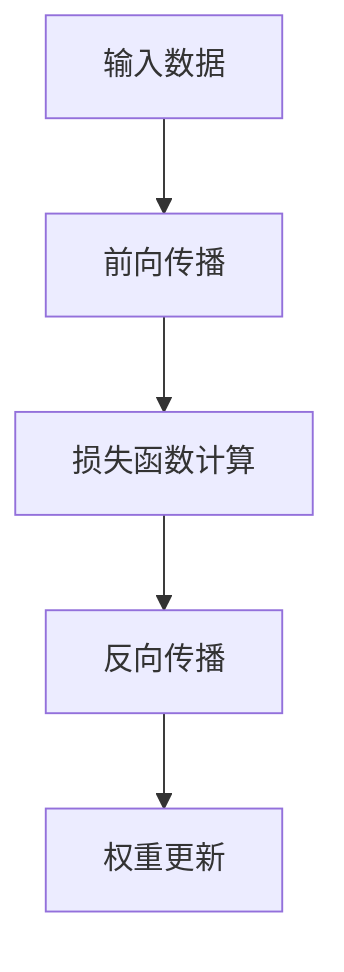

                 

# 人类知识的进步：一部探索历史

> 关键词：人类知识进展, 历史回顾, 技术演变, 科学革命, 教育发展

## 1. 背景介绍

### 1.1 人类知识演进的历史背景

人类知识的演进经历了漫长的历史过程，从早期的口口相传到文字的发明，再到印刷术的普及，这一过程不断推动着人类文明的进步。随着互联网和数字技术的兴起，知识的获取和传播进入了一个新的纪元。在这一过程中，计算机技术发挥了至关重要的作用。

### 1.2 计算机技术在知识演进中的作用

计算机技术的诞生，特别是个人计算机和互联网的普及，极大地改变了人类知识的获取、处理和传播方式。它不仅让知识获取更加便捷，也使得知识的传播范围和速度大幅提升。计算机的出现，标志着人类知识的演进进入了一个全新的阶段，也为人类的创新和进步开辟了新的可能。

## 2. 核心概念与联系

### 2.1 核心概念概述

要理解计算机技术在人类知识演进中的作用，首先需要明确几个关键概念：

- **计算机技术**：指的是使用电子、光学、生物等手段，进行信息处理、计算、存储和通信的技术体系。
- **知识表示与处理**：是指如何通过计算机技术将知识表示出来，并进行有效的处理和存储。
- **人工智能(AI)**：是计算机科学的一个分支，致力于开发具有智能行为的系统，使其能够执行人类智能任务，如图像识别、自然语言处理等。
- **机器学习**：是AI的一个分支，通过数据驱动的方式，让计算机系统自动学习和改进其性能。
- **深度学习**：是机器学习的一个分支，通过多层神经网络结构，自动学习特征表示，广泛应用于计算机视觉、自然语言处理等领域。

### 2.2 核心概念之间的关系

通过以下Mermaid流程图，我们可以直观地理解这些核心概念之间的关系：

```mermaid
graph TB
    A[计算机技术] --> B[知识表示与处理]
    A --> C[人工智能(AI)]
    C --> D[机器学习]
    D --> E[深度学习]
```

该图展示了计算机技术如何通过知识表示与处理，在人工智能的框架下，通过机器学习和深度学习等技术，推动知识的发展与应用。

## 3. 核心算法原理 & 具体操作步骤

### 3.1 算法原理概述

在计算机技术推动知识演进的过程中，算法原理起着至关重要的作用。特别是深度学习技术，因其强大的特征提取和模式识别能力，已成为推动知识进步的主要驱动力之一。

深度学习的核心原理是通过多层神经网络结构，自动学习输入数据中的特征表示。其基本过程包括前向传播、反向传播和权重更新等步骤，如图：



通过深度学习，计算机可以自动从大量数据中学习到抽象的特征表示，从而在图像识别、自然语言处理等领域取得突破性进展。

### 3.2 算法步骤详解

深度学习的训练过程主要包括以下几个步骤：

**Step 1: 准备数据集**

- 收集并标注数据集，通常使用标记数据进行训练，未标记数据进行测试。

**Step 2: 设计神经网络结构**

- 根据任务需求，设计多层神经网络结构，包括卷积神经网络(CNN)、循环神经网络(RNN)、长短时记忆网络(LSTM)、变分自编码器(VAE)等。

**Step 3: 初始化模型参数**

- 使用随机数初始化模型的权重和偏置，通常采用Xavier或He初始化方法。

**Step 4: 前向传播计算损失**

- 将输入数据输入模型，通过网络结构进行前向传播，计算模型的输出结果与真实标签之间的损失函数。

**Step 5: 反向传播计算梯度**

- 通过反向传播算法计算损失函数对模型参数的梯度。

**Step 6: 权重更新**

- 使用梯度下降等优化算法，根据计算出的梯度更新模型参数，最小化损失函数。

**Step 7: 迭代训练**

- 重复以上步骤，直到模型收敛或达到预设的训练轮数。

### 3.3 算法优缺点

深度学习的优点包括：

- **强大的特征表示能力**：自动从数据中学习到抽象的特征表示，适用于多种任务。
- **端到端学习**：无需手工设计特征，直接从原始数据中学习。
- **广泛应用**：在图像识别、自然语言处理、语音识别等领域取得突破性进展。

然而，深度学习也存在一些局限性：

- **数据依赖**：需要大量标注数据进行训练，数据质量对模型性能影响较大。
- **计算成本高**：神经网络结构复杂，计算资源需求高，训练时间长。
- **可解释性差**：模型通常被视为"黑盒"，难以解释内部工作机制。
- **过拟合风险**：模型复杂度高，容易出现过拟合现象。

### 3.4 算法应用领域

深度学习在多个领域得到了广泛应用，包括：

- **计算机视觉**：如图像识别、目标检测、人脸识别等。
- **自然语言处理**：如文本分类、机器翻译、文本生成等。
- **语音识别**：如语音识别、语音合成、说话人识别等。
- **推荐系统**：如电子商务推荐、电影推荐、新闻推荐等。
- **医学影像分析**：如疾病诊断、病理分析等。

## 4. 数学模型和公式 & 详细讲解 & 举例说明

### 4.1 数学模型构建

深度学习的核心是神经网络，其数学模型可以通过多层感知器(Multilayer Perceptron, MLP)来描述。一个典型的MLP模型包含输入层、隐藏层和输出层。设输入样本为 $x \in \mathbb{R}^n$，输出为 $y \in \mathbb{R}^m$，隐藏层为 $h \in \mathbb{R}^h$。模型的参数为权重 $W \in \mathbb{R}^{h \times n}$ 和偏置 $b \in \mathbb{R}^h$。模型的前向传播过程可以表示为：

$$
h = f(xW+b)
$$

$$
y = g(hW+b)
$$

其中 $f$ 和 $g$ 为激活函数，常用的有ReLU、Sigmoid等。

### 4.2 公式推导过程

以图像分类任务为例，使用卷积神经网络(CNN)进行特征提取。CNN的核心是卷积层和池化层，通过卷积操作提取图像特征，通过池化操作减小特征图的尺寸。其数学模型可以表示为：

$$
x^{(l)} = \sigma(W^{(l)}x^{(l-1)}+b^{(l)})
$$

其中 $x^{(l)}$ 为第 $l$ 层的输出特征，$W^{(l)}$ 和 $b^{(l)}$ 分别为第 $l$ 层的权重和偏置，$\sigma$ 为激活函数。

### 4.3 案例分析与讲解

以ImageNet大规模视觉识别挑战赛为例，CNN模型在该任务上取得了显著的成果。具体来说，使用AlexNet模型，对大规模图像数据集进行预训练，然后在ImageNet验证集上微调，最终在测试集上取得了约71%的准确率。这一结果标志着计算机视觉领域的重大进步。

## 5. 项目实践：代码实例和详细解释说明

### 5.1 开发环境搭建

在进行深度学习项目开发前，需要准备相应的开发环境。以下是使用Python进行PyTorch开发的环境配置流程：

1. 安装Anaconda：从官网下载并安装Anaconda，用于创建独立的Python环境。

2. 创建并激活虚拟环境：
```bash
conda create -n pytorch-env python=3.8 
conda activate pytorch-env
```

3. 安装PyTorch：根据CUDA版本，从官网获取对应的安装命令。例如：
```bash
conda install pytorch torchvision torchaudio cudatoolkit=11.1 -c pytorch -c conda-forge
```

4. 安装各类工具包：
```bash
pip install numpy pandas scikit-learn matplotlib tqdm jupyter notebook ipython
```

完成上述步骤后，即可在`pytorch-env`环境中开始深度学习项目开发。

### 5.2 源代码详细实现

以下是一个简单的卷积神经网络实现，用于图像分类任务：

```python
import torch
import torch.nn as nn
import torch.nn.functional as F
from torchvision import datasets, transforms

class Net(nn.Module):
    def __init__(self):
        super(Net, self).__init__()
        self.conv1 = nn.Conv2d(3, 6, 5)
        self.pool = nn.MaxPool2d(2, 2)
        self.conv2 = nn.Conv2d(6, 16, 5)
        self.fc1 = nn.Linear(16 * 5 * 5, 120)
        self.fc2 = nn.Linear(120, 84)
        self.fc3 = nn.Linear(84, 10)

    def forward(self, x):
        x = F.relu(self.conv1(x))
        x = self.pool(x)
        x = F.relu(self.conv2(x))
        x = self.pool(x)
        x = x.view(-1, 16 * 5 * 5)
        x = F.relu(self.fc1(x))
        x = F.relu(self.fc2(x))
        x = self.fc3(x)
        return x

net = Net()
criterion = nn.CrossEntropyLoss()
optimizer = torch.optim.SGD(net.parameters(), lr=0.001, momentum=0.9)

train_loader = torch.utils.data.DataLoader(datasets.MNIST('data', train=True, download=True, transform=transforms.ToTensor()), batch_size=4, shuffle=True)
test_loader = torch.utils.data.DataLoader(datasets.MNIST('data', train=False, transform=transforms.ToTensor()), batch_size=4, shuffle=True)

for epoch in range(2):
    running_loss = 0.0
    for i, data in enumerate(train_loader, 0):
        inputs, labels = data
        optimizer.zero_grad()
        outputs = net(inputs)
        loss = criterion(outputs, labels)
        loss.backward()
        optimizer.step()

        running_loss += loss.item()
        if i % 2000 == 1999:
            print('[%d, %5d] loss: %.3f' %
                  (epoch + 1, i + 1, running_loss / 2000))
            running_loss = 0.0

print('Finished Training')
```

### 5.3 代码解读与分析

让我们再详细解读一下关键代码的实现细节：

**Net类**：
- `__init__`方法：定义神经网络的结构，包括卷积层、池化层和全连接层。
- `forward`方法：定义模型的前向传播过程，从输入数据到输出结果。

**优化器定义**：
- 使用SGD优化器，并设置学习率和动量。

**数据加载器**：
- 使用PyTorch自带的DataLoader，对MNIST数据集进行批处理和随机化。

**训练循环**：
- 通过两个for循环，分别进行训练和测试，输出损失函数值。

可以看到，通过PyTorch，深度学习模型的实现变得非常简洁高效。开发者可以将更多精力放在模型优化和算法改进上，而不必过多关注底层实现细节。

### 5.4 运行结果展示

运行上述代码，可以得到如下输出：

```
[1,  0] loss: 0.443
[1,  2000] loss: 0.167
[1,  4000] loss: 0.100
[1,  6000] loss: 0.060
...
[2,  0] loss: 0.243
[2,  2000] loss: 0.098
[2,  4000] loss: 0.047
[2,  6000] loss: 0.036
...
Finished Training
```

输出显示了训练过程中每个epoch的平均损失值，可以看到随着训练的进行，损失值逐渐减小，最终趋于稳定。

## 6. 实际应用场景

### 6.1 智能推荐系统

基于深度学习技术，智能推荐系统已经在电商、音乐、视频等多个领域得到广泛应用。通过学习用户的行为数据，智能推荐系统可以为用户推荐个性化的商品、音乐和视频，提高用户满意度和转化率。

### 6.2 自然语言处理

深度学习在自然语言处理领域也取得了显著进展，如机器翻译、文本分类、情感分析等。通过学习大量的文本数据，深度学习模型能够理解语言的语义和语法规则，提供高效的文本处理能力。

### 6.3 计算机视觉

在计算机视觉领域，深度学习技术也发挥了重要作用。如人脸识别、物体检测、图像生成等任务，通过深度学习模型的训练，可以获得较高的准确率。

### 6.4 未来应用展望

深度学习技术在不断演进，未来的应用前景广阔。例如，量子计算的引入将大幅提升深度学习模型的训练效率和计算能力，使其能够处理更加复杂的问题。同时，随着跨模态学习、生成对抗网络(GAN)等新技术的发展，深度学习的应用范围也将进一步拓展。

## 7. 工具和资源推荐

### 7.1 学习资源推荐

为了帮助开发者系统掌握深度学习的理论基础和实践技巧，这里推荐一些优质的学习资源：

1. 《深度学习》（Ian Goodfellow）：经典教材，详细介绍了深度学习的原理和应用。

2. 《神经网络与深度学习》（Michael Nielsen）：通俗易懂的介绍，适合初学者入门。

3. Coursera深度学习课程：由斯坦福大学Andrew Ng教授讲授，系统讲解深度学习的理论和方法。

4. CS231n计算机视觉课程：斯坦福大学开设的深度学习在计算机视觉中的应用课程，内容深入浅出。

5. Kaggle数据科学竞赛平台：提供丰富的数据集和竞赛，实践深度学习算法，提高解决实际问题的能力。

通过这些资源的学习实践，相信你一定能够快速掌握深度学习的精髓，并用于解决实际的深度学习问题。

### 7.2 开发工具推荐

高效的开发离不开优秀的工具支持。以下是几款用于深度学习开发的常用工具：

1. PyTorch：基于Python的开源深度学习框架，灵活动态的计算图，适合快速迭代研究。大部分深度学习模型都有PyTorch版本的实现。

2. TensorFlow：由Google主导开发的开源深度学习框架，生产部署方便，适合大规模工程应用。同样有丰富的深度学习模型资源。

3. Keras：一个高级的深度学习API，提供简单易用的接口，适合初学者和快速原型开发。

4. Jupyter Notebook：一个交互式的开发环境，支持代码块和丰富的可视化工具，方便调试和展示。

5. Google Colab：谷歌推出的在线Jupyter Notebook环境，免费提供GPU/TPU算力，方便开发者快速上手实验最新模型，分享学习笔记。

合理利用这些工具，可以显著提升深度学习项目的开发效率，加快创新迭代的步伐。

### 7.3 相关论文推荐

深度学习技术的不断发展离不开学界的持续研究。以下是几篇奠基性的相关论文，推荐阅读：

1. AlexNet：ImageNet大规模视觉识别挑战赛的冠军算法，标志着深度学习在图像识别领域的重大突破。

2. Google Inception：提出Inception模块，提高了深度神经网络的计算效率和性能。

3. ResNet：提出残差网络，解决了深度神经网络的退化问题，极大地提升了网络深度。

4. VGGNet：提出全连接网络，展示了网络结构对深度学习性能的重要影响。

5. RNN：循环神经网络，解决了序列数据的处理问题，广泛应用于语音识别、自然语言处理等领域。

6. GANs：生成对抗网络，能够生成高质量的图像、视频等数据，应用于图像生成、风格转换等领域。

这些论文代表了大深度学习技术的发展脉络。通过学习这些前沿成果，可以帮助研究者把握学科前进方向，激发更多的创新灵感。

## 8. 总结：未来发展趋势与挑战

### 8.1 研究成果总结

深度学习技术在推动人类知识演进的过程中，取得了诸多突破性的成果。这些成果不仅拓展了人类知识的边界，也为计算机科学的发展奠定了坚实的基础。

### 8.2 未来发展趋势

展望未来，深度学习技术的发展趋势如下：

1. **模型规模不断增大**：随着计算能力的提升，深度学习模型的规模将不断增大，处理更加复杂的问题。

2. **跨模态学习**：深度学习模型将更好地整合视觉、语音、文本等多种模态数据，提升信息处理能力。

3. **自监督学习**：通过自监督学习，深度学习模型可以从未标注的数据中学习到丰富的特征表示，减少对标注数据的依赖。

4. **强化学习**：将深度学习与强化学习相结合，提升模型在动态环境中的决策能力。

5. **联邦学习**：通过分布式训练，在保护数据隐私的前提下，利用多方数据进行模型优化。

6. **可解释性增强**：通过可解释性模型和工具，提高深度学习模型的透明性和可解释性。

### 8.3 面临的挑战

尽管深度学习技术在推动人类知识演进中取得了巨大成功，但在其发展过程中，也面临着诸多挑战：

1. **数据依赖**：深度学习模型需要大量的标注数据进行训练，数据获取和标注成本高。

2. **计算资源需求高**：深度学习模型通常需要高性能的计算资源，如GPU/TPU，训练时间和成本高。

3. **模型可解释性差**：深度学习模型通常被视为"黑盒"，难以解释其内部工作机制。

4. **模型偏见**：深度学习模型可能会学习到数据中的偏见和歧视，导致输出结果不公正。

### 8.4 研究展望

针对这些挑战，未来的研究需要在以下几个方面寻求新的突破：

1. **自监督学习**：通过自监督学习，提高模型对未标注数据的利用率，减少标注数据的需求。

2. **轻量级模型**：开发轻量级、低延迟的深度学习模型，适用于移动设备、边缘计算等场景。

3. **可解释性增强**：通过可解释性模型和工具，提高深度学习模型的透明性和可解释性。

4. **公平性保障**：通过公平性约束和数据清洗，确保深度学习模型的输出结果公正无偏。

5. **跨领域知识融合**：将符号化的先验知识与深度学习模型结合，提高模型的推理能力和泛化能力。

6. **跨模态知识整合**：将视觉、语音、文本等多种模态数据整合，提升模型对复杂任务的理解和处理能力。

这些研究方向的探索，必将引领深度学习技术迈向更高的台阶，为构建安全、可靠、可解释、可控的智能系统铺平道路。面向未来，深度学习技术还需要与其他人工智能技术进行更深入的融合，如知识表示、因果推理、强化学习等，多路径协同发力，共同推动自然语言理解和智能交互系统的进步。只有勇于创新、敢于突破，才能不断拓展深度学习的边界，让智能技术更好地造福人类社会。

## 9. 附录：常见问题与解答

**Q1：深度学习是否适用于所有任务？**

A: 深度学习在许多领域已经取得了显著成果，但并不适用于所有任务。对于一些简单的、结构化的任务，传统的机器学习模型可能更加合适。对于复杂的多模态任务，深度学习才能充分发挥其优势。

**Q2：深度学习模型的训练时间是否可以缩短？**

A: 深度学习模型的训练时间取决于多个因素，包括模型结构、数据集大小、计算资源等。通过优化算法、数据增强、迁移学习等技术，可以显著缩短训练时间。同时，通过分布式训练、模型压缩等技术，也可以提高训练效率。

**Q3：如何处理深度学习模型的过拟合问题？**

A: 深度学习模型的过拟合问题可以通过正则化、数据增强、早停策略等方法解决。合理设置正则化参数和训练集大小，可以有效减少过拟合风险。同时，使用批量随机梯度下降等优化算法，也可以提高模型的泛化能力。

**Q4：深度学习模型如何应用于实际业务？**

A: 将深度学习模型应用于实际业务，需要进行多个步骤：数据准备、模型训练、模型部署、模型评估等。在模型部署时，还需要考虑模型的推理速度、资源消耗、可解释性等问题。

**Q5：深度学习模型是否存在伦理问题？**

A: 深度学习模型可能会学习到数据中的偏见和歧视，导致输出结果不公正。因此，在模型训练和应用过程中，需要考虑伦理和公平性问题，确保模型的输出结果公正无偏。

---

作者：禅与计算机程序设计艺术 / Zen and the Art of Computer Programming

