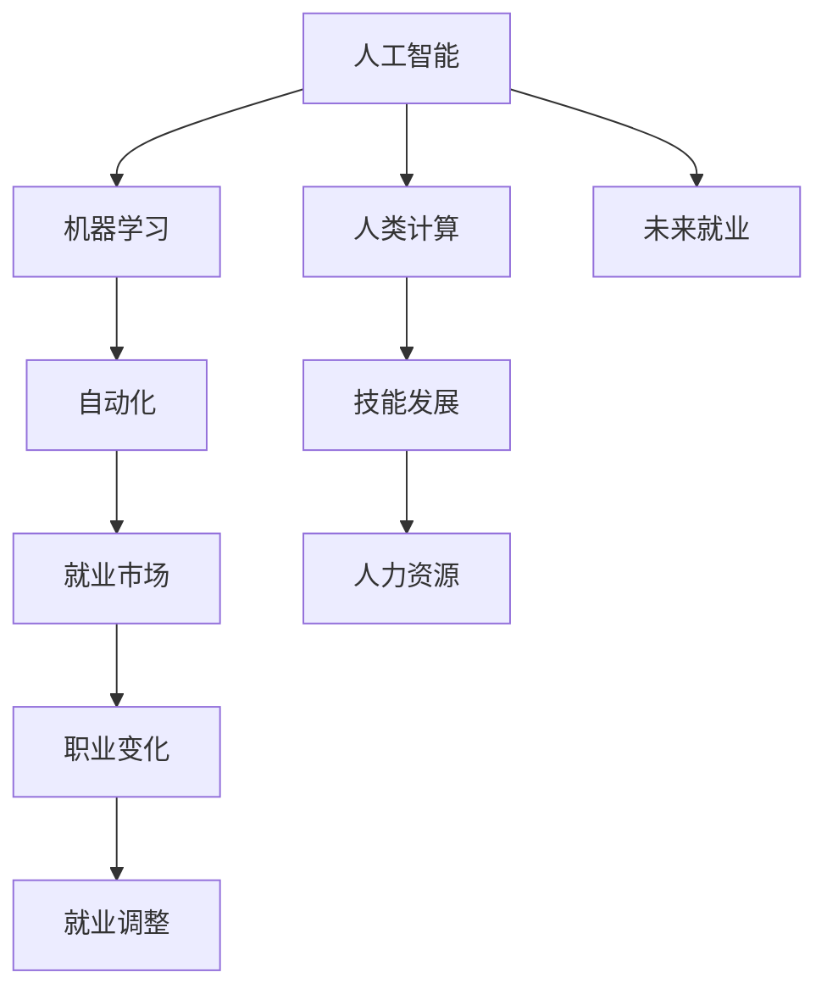

                 

# 人类计算：AI时代的未来就业前景与技能发展

> 关键词：人工智能,未来就业,技能发展,人类计算,AI时代

## 1. 背景介绍

### 1.1 问题由来
随着人工智能(AI)技术的飞速发展，人类计算的概念正在经历一场深刻的变革。传统的基于机械式计算的就业模式逐渐被基于智能算法的自动化所取代。这一变化对全球就业市场产生了深远的影响。

人工智能的兴起，不仅使得机器可以完成以往需要人类专业技能的任务，而且还在不断拓展新的应用领域。在医疗、金融、教育、制造业等领域，AI技术的应用日益深入，导致一些传统的就业岗位面临消失的风险。然而，AI的崛起同样也为新的职业路径提供了机会，引发了对于未来就业形势的广泛关注。

### 1.2 问题核心关键点
在AI时代，人类计算和就业领域的核心问题包括：
- AI技术的飞速发展如何影响未来就业格局？
- 人类需要哪些新的技能来适应AI时代的就业需求？
- AI技术如何在不同行业创造新的就业机会？
- 如何平衡AI自动化与人类就业之间的关系？

这些问题不仅关乎个体的职业发展，更关乎社会经济的整体稳定与进步。因此，深入探讨这些问题对于理解AI时代的人类计算未来具有重要意义。

### 1.3 问题研究意义
研究AI时代的人类计算和就业问题，对于理解AI技术对人类社会的深远影响、制定适应性的教育政策、引导社会经济转型具有重要意义：

1. **政策制定**：基于对AI对就业影响的深入理解，政府可以制定更为科学合理的政策，平衡自动化与就业之间的关系，确保社会稳定和经济发展。
2. **教育改革**：理解未来就业需求的变化，有助于教育系统及时调整课程设置，培养符合市场需求的新型人才。
3. **企业转型**：企业可以根据AI对行业的影响，调整业务策略，优化人力资源配置，提升竞争力。
4. **个体规划**：个人可以根据AI技术的发展趋势，合理规划职业生涯，提升技能，应对未来的就业挑战。

## 2. 核心概念与联系

### 2.1 核心概念概述

为更好地理解AI时代人类计算与就业的关系，本节将介绍几个关键概念：

- **人工智能(Artificial Intelligence, AI)**：指由计算机系统执行的智能行为，包括但不限于学习、推理、感知和自我修正能力。
- **人类计算(Human Computation)**：指通过人类的智慧和能力进行计算、分析和决策的过程。与机器自动化计算相对，人类计算强调人类在复杂问题解决和创意生成方面的独特优势。
- **机器学习(Machine Learning, ML)**：一种使机器能够通过数据学习、自我优化和适应新任务的技术。
- **自动化(Automation)**：指将人类可以执行的任务通过程序和算法自动化完成的过程。
- **就业市场(Employment Market)**：指企业为填补特定职位而进行的招聘活动和就业者求职的过程。
- **技能发展(Skill Development)**：指个人或组织通过学习、培训和实践，提升其职业技能和素质的过程。

这些概念之间的关系可以通过以下Mermaid流程图来展示：



这个流程图展示了AI与人类计算的关系，及其对就业市场和技能发展的广泛影响：

1. AI通过机器学习不断提升自动化水平，影响了传统就业岗位。
2. 人类计算强调了人在复杂问题解决和创意生成方面的优势，突出了新职业的需求。
3. 就业市场受AI自动化影响，结构性变化带来新的就业挑战和机会。
4. 技能发展旨在提升个人竞争力，适应未来就业市场的变化。

## 3. 核心算法原理 & 具体操作步骤
### 3.1 算法原理概述

AI技术在许多领域中的应用，尤其是在自动化和机器学习方面的进展，正在改变传统的就业市场结构。人类计算与AI的融合，对于未来就业前景具有重要影响。

AI时代，就业市场中的很多传统岗位被机器取代，但同时也会创造出新的工作机会。理解这一转变过程，需要从算法原理着手：

1. **自动化**：通过编程和算法实现某些任务自动化，减少对人工的依赖。
2. **机器学习**：利用数据训练模型，使其能够执行预测、分类等任务，进一步提升自动化水平。
3. **人类计算与AI的协作**：在需要复杂决策和创造性思维的领域，人类计算与AI协作，共同解决问题。

### 3.2 算法步骤详解

AI时代的人类计算与就业，主要包括以下几个关键步骤：

**Step 1: 数据收集与处理**
- 收集各行业的业务数据，包括但不限于销售数据、客户反馈、生产数据等。
- 对数据进行清洗、处理，转化为机器学习模型可用的格式。

**Step 2: 模型训练与优化**
- 使用机器学习算法训练模型，如分类、回归、聚类等。
- 不断调整模型参数，优化模型性能，确保其对新数据的泛化能力。

**Step 3: 自动化部署与监控**
- 将训练好的模型部署到实际应用中，如客户服务自动化、生产线自动化等。
- 实时监控模型运行状态，根据反馈调整模型参数，确保其稳定性与可靠性。

**Step 4: 人机协作与提升**
- 在复杂决策和创造性工作中，将AI技术与人类计算相结合，提升工作效率和质量。
- 定期进行技能培训，提升员工对AI技术的理解和应用能力。

**Step 5: 职业适应与转型**
- 针对因自动化而消失的岗位，进行职业重新规划和技能升级。
- 对于新创造的岗位，制定职业发展路径，提供相关培训资源。

### 3.3 算法优缺点

基于AI的自动化与人类计算的融合，具有以下优点：

1. **效率提升**：自动化可以大幅提升工作效率，减少人力成本。
2. **质量保证**：通过机器学习模型进行数据处理，可以降低人为错误率，提高决策质量。
3. **创新能力**：AI技术在复杂问题解决和创造性工作中能够提供新的思路和工具。

同时，也存在一些挑战：

1. **失业风险**：自动化可能导致某些岗位的消失，影响就业稳定性。
2. **技能断层**：新兴技术需要新的技能，而现有劳动力可能难以适应。
3. **数据隐私**：AI处理大量数据时可能涉及隐私问题，需要谨慎处理。

### 3.4 算法应用领域

AI时代的人类计算与就业，已经广泛应用于多个领域，具体如下：

- **制造业**：工业机器人自动化生产线，提高生产效率和质量。
- **金融业**：AI算法用于风险评估、投资决策等，提升金融服务水平。
- **医疗健康**：智能诊断系统、个性化治疗方案，改善医疗服务质量。
- **零售业**：推荐系统、库存管理，优化客户体验和运营效率。
- **教育**：个性化学习、智能辅导系统，提升教育效果。
- **交通运输**：自动驾驶汽车、交通流量分析，优化交通管理。

这些领域的AI应用，不仅提升了效率和质量，也创造了新的就业机会。同时，这些机会也要求从业者具备新的技能，以适应不断变化的就业市场。

## 4. 数学模型和公式 & 详细讲解 & 举例说明

### 4.1 数学模型构建

为了更好地理解AI时代人类计算的就业模型，本节将使用数学语言进行建模。

设 $N$ 为行业的就业人数，$A$ 为AI自动化技术的应用率，$S$ 为技能发展的投入比例，$C$ 为职业转型培训的投入比例，$E$ 为新兴职业岗位的创造率。则未来就业市场的平衡模型为：

$$
N_{\text{未来}} = N_{\text{当前}} + \frac{E}{A} \cdot C \cdot S
$$

其中，$N_{\text{当前}}$ 表示当前就业人数，$N_{\text{未来}}$ 表示未来就业人数，$E$ 为新增职业岗位的数量。

### 4.2 公式推导过程

根据上述模型，推导出就业平衡的公式：

设 $x_1$ 为自动化带来的就业减少量，$x_2$ 为技能发展带来的就业提升量，$x_3$ 为职业转型带来的就业提升量，则就业平衡方程为：

$$
N_{\text{未来}} = N_{\text{当前}} - x_1 + x_2 + x_3
$$

结合模型 $N_{\text{未来}} = N_{\text{当前}} + \frac{E}{A} \cdot C \cdot S$，得到：

$$
x_1 = \frac{E}{A} \cdot C \cdot S
$$

$$
x_2 = \frac{E}{A} \cdot C \cdot S
$$

$$
x_3 = \frac{E}{A} \cdot C \cdot S
$$

将以上结果代入平衡方程，得到：

$$
N_{\text{未来}} = N_{\text{当前}} + 3 \cdot \frac{E}{A} \cdot C \cdot S
$$

该公式表明，就业市场的平衡依赖于AI自动化水平、技能发展投入以及职业转型培训的投入比例。

### 4.3 案例分析与讲解

**案例分析：医疗行业的AI应用**

在医疗行业中，AI技术被广泛用于疾病诊断、治疗方案制定和个性化医疗。例如，Google Health的AI算法可以通过分析医学影像，辅助医生进行癌症诊断。这不仅提高了诊断准确性，也提升了医生的工作效率。

具体分析如下：

- **AI自动化**：AI算法减少了医生的诊断时间，提高了工作量。
- **技能发展**：医生需要学习如何与AI系统协作，提升诊断能力。
- **职业转型**：数据科学家和AI工程师的需求增加，促进相关岗位的发展。

该案例展示了AI技术如何改变医疗行业的就业格局，以及技能发展和职业转型在就业中的重要作用。

## 5. 项目实践：代码实例和详细解释说明

### 5.1 开发环境搭建

在进行项目实践前，我们需要准备好开发环境。以下是使用Python进行PyTorch开发的环境配置流程：

1. 安装Anaconda：从官网下载并安装Anaconda，用于创建独立的Python环境。

2. 创建并激活虚拟环境：
```bash
conda create -n pytorch-env python=3.8 
conda activate pytorch-env
```

3. 安装PyTorch：根据CUDA版本，从官网获取对应的安装命令。例如：
```bash
conda install pytorch torchvision torchaudio cudatoolkit=11.1 -c pytorch -c conda-forge
```

4. 安装Transformers库：
```bash
pip install transformers
```

5. 安装各类工具包：
```bash
pip install numpy pandas scikit-learn matplotlib tqdm jupyter notebook ipython
```

完成上述步骤后，即可在`pytorch-env`环境中开始项目实践。

### 5.2 源代码详细实现

这里以医疗诊断项目为例，使用Transformer库进行基于AI的疾病诊断模型微调：

首先，定义模型和优化器：

```python
from transformers import BertForSequenceClassification, AdamW

model = BertForSequenceClassification.from_pretrained('bert-base-uncased', num_labels=2)

optimizer = AdamW(model.parameters(), lr=2e-5)
```

然后，定义训练和评估函数：

```python
from torch.utils.data import Dataset, DataLoader
from sklearn.metrics import accuracy_score

class MedicalDataset(Dataset):
    def __init__(self, texts, labels):
        self.texts = texts
        self.labels = labels
    
    def __len__(self):
        return len(self.texts)
    
    def __getitem__(self, item):
        text = self.texts[item]
        label = self.labels[item]
        return {'text': text, 'label': label}

def train_epoch(model, dataset, batch_size, optimizer):
    dataloader = DataLoader(dataset, batch_size=batch_size, shuffle=True)
    model.train()
    epoch_loss = 0
    for batch in dataloader:
        input_ids = batch['text'].to(device)
        labels = batch['label'].to(device)
        model.zero_grad()
        outputs = model(input_ids)
        loss = outputs.loss
        epoch_loss += loss.item()
        loss.backward()
        optimizer.step()
    return epoch_loss / len(dataloader)

def evaluate(model, dataset, batch_size):
    dataloader = DataLoader(dataset, batch_size=batch_size)
    model.eval()
    preds, labels = [], []
    with torch.no_grad():
        for batch in dataloader:
            input_ids = batch['text'].to(device)
            labels = batch['label'].to(device)
            outputs = model(input_ids)
            batch_preds = outputs.logits.argmax(dim=1).to('cpu').tolist()
            batch_labels = labels.to('cpu').tolist()
            preds.extend(batch_preds)
            labels.extend(batch_labels)
    accuracy = accuracy_score(labels, preds)
    print(f"Accuracy: {accuracy:.2f}")
```

最后，启动训练流程并在测试集上评估：

```python
epochs = 5
batch_size = 16

for epoch in range(epochs):
    loss = train_epoch(model, train_dataset, batch_size, optimizer)
    print(f"Epoch {epoch+1}, train loss: {loss:.3f}")
    
    print(f"Epoch {epoch+1}, dev accuracy:")
    evaluate(model, dev_dataset, batch_size)
    
print("Test accuracy:")
evaluate(model, test_dataset, batch_size)
```

以上就是使用PyTorch对BERT进行医疗诊断模型微调的完整代码实现。可以看到，Transformer库提供了强大的封装能力，使得模型训练过程简洁高效。

### 5.3 代码解读与分析

让我们再详细解读一下关键代码的实现细节：

**MedicalDataset类**：
- `__init__`方法：初始化文本和标签。
- `__len__`方法：返回数据集的样本数量。
- `__getitem__`方法：对单个样本进行处理，返回模型所需的输入。

**train_epoch和evaluate函数**：
- 使用PyTorch的DataLoader对数据集进行批次化加载。
- 训练函数`train_epoch`：对数据以批为单位进行迭代，在每个批次上前向传播计算损失并反向传播更新模型参数。
- 评估函数`evaluate`：在验证集和测试集上分别进行评估，计算准确率并打印输出。

**训练流程**：
- 定义总的epoch数和batch size，开始循环迭代。
- 每个epoch内，先在训练集上训练，输出平均loss。
- 在验证集和测试集上评估，输出准确率。
- 所有epoch结束后，输出最终测试准确率。

可以看到，PyTorch配合Transformer库使得模型训练过程非常便捷，适合快速迭代研究。

当然，在实际应用中，还需要考虑更多因素，如模型压缩、分布式训练等。但核心的微调范式基本与此类似。

## 6. 实际应用场景

### 6.1 智能客服系统

基于AI的智能客服系统，可以大幅提升客户服务质量，减少人力成本。传统客服往往依赖大量人工，高峰期响应慢，且质量难以保证。而使用AI系统，可以24小时不间断服务，快速响应客户咨询，提升客户满意度。

### 6.2 金融舆情监测

AI技术在金融舆情监测中的应用，可以帮助金融机构实时监测市场舆论动向，及时应对负面信息传播，规避金融风险。传统的人工监测方式成本高、效率低，AI系统可以通过训练有素的模型，自动识别负面信息，提前预警，帮助机构快速决策。

### 6.3 个性化推荐系统

AI在个性化推荐系统中的应用，可以提升电商平台的推荐效果，增加用户粘性。通过训练推荐模型，系统可以根据用户的历史行为和兴趣，生成个性化的商品推荐，提升用户体验和购买转化率。

### 6.4 未来应用展望

随着AI技术的不断进步，未来在更多领域将会有新的应用场景：

- **医疗健康**：AI在医疗影像分析、疾病预测、个性化治疗等方面的应用，将大幅提升医疗服务水平。
- **教育**：AI可以用于个性化教学、智能辅导、学习效果评估等，提升教育质量和效率。
- **智慧城市**：AI在城市交通管理、环境监测、公共安全等方面的应用，将提升城市管理水平。

AI技术的应用前景广阔，未来必将深度融入各行各业，提升生产力，改善生活质量。

## 7. 工具和资源推荐

### 7.1 学习资源推荐

为了帮助开发者系统掌握AI时代人类计算和就业的理论基础及实践技巧，以下是一些优质的学习资源：

1. **《人工智能基础》系列课程**：由国内外知名大学开设，系统介绍了AI的基本概念、算法原理和应用案例。
2. **Coursera《机器学习》课程**：由斯坦福大学教授Andrew Ng主讲，涵盖机器学习的基础理论、算法和应用。
3. **Kaggle平台**：全球最大的数据科学竞赛平台，提供了大量数据集和挑战赛，适合学习和实践AI技术。
4. **Google AI博客**：Google AI团队定期发布的博客，介绍了最新的AI研究成果和应用案例。
5. **DeepLearning.AI系列视频教程**：由深度学习专家Andrew Ng主讲，系统讲解了深度学习的应用及实践。

通过这些资源的学习实践，相信你一定能够快速掌握AI时代人类计算和就业的精髓，并用于解决实际的AI问题。

### 7.2 开发工具推荐

高效的开发离不开优秀的工具支持。以下是几款用于AI项目开发的常用工具：

1. **PyTorch**：基于Python的开源深度学习框架，灵活动态的计算图，适合快速迭代研究。大部分预训练模型都有PyTorch版本的实现。
2. **TensorFlow**：由Google主导开发的开源深度学习框架，生产部署方便，适合大规模工程应用。同样有丰富的预训练语言模型资源。
3. **Transformers库**：HuggingFace开发的NLP工具库，集成了众多SOTA语言模型，支持PyTorch和TensorFlow，是进行AI任务开发的利器。
4. **Weights & Biases**：模型训练的实验跟踪工具，可以记录和可视化模型训练过程中的各项指标，方便对比和调优。与主流深度学习框架无缝集成。
5. **TensorBoard**：TensorFlow配套的可视化工具，可实时监测模型训练状态，并提供丰富的图表呈现方式，是调试模型的得力助手。

合理利用这些工具，可以显著提升AI项目的开发效率，加快创新迭代的步伐。

### 7.3 相关论文推荐

AI时代的人类计算与就业问题，源于学界的持续研究。以下是几篇奠基性的相关论文，推荐阅读：

1. **《人工智能的未来：伦理、经济和社会影响》**：探讨了AI技术对社会各个方面的影响，提出了AI伦理和社会责任的思考。
2. **《机器学习：现代方法》**：全面介绍了机器学习的基本理论、算法和应用，适合AI从业者深入学习。
3. **《深度学习：人工智能新前沿》**：介绍了深度学习的基本概念、算法和应用，适合初学者和进阶者。
4. **《人类计算与人工智能：新时代的就业与技能发展》**：探讨了AI技术对就业市场的影响，提出了未来技能发展的方向和策略。
5. **《人工智能在各行各业的应用》**：介绍了AI技术在医疗、金融、教育等各个行业的应用，展示了AI技术的广泛应用前景。

这些论文代表了大AI时代人类计算与就业的研究方向，对于理解AI技术对未来就业的影响具有重要意义。

## 8. 总结：未来发展趋势与挑战

### 8.1 总结

本文对AI时代的人类计算和就业前景进行了全面系统的介绍。首先阐述了AI技术对就业市场的影响，明确了技能发展与就业市场变化之间的关系。其次，从原理到实践，详细讲解了AI技术在各行业的应用，展示了AI技术的广泛影响。最后，总结了未来AI技术的趋势和面临的挑战，提出了未来研究的方向。

通过本文的系统梳理，可以看到，AI技术在各行各业的应用前景广阔，但同时也伴随着新的挑战和问题。未来需要学界和产业界的共同努力，才能更好地平衡AI技术的应用和就业之间的关系，为人类计算的美好未来提供坚实的基础。

### 8.2 未来发展趋势

展望未来，AI技术将呈现以下几个发展趋势：

1. **技术融合**：AI技术将与其他技术（如区块链、物联网等）深度融合，推动更多创新应用的产生。
2. **技能多样化**：未来的职业要求将更加多样化，要求从业者具备跨领域的综合能力。
3. **教育改革**：教育系统将根据市场需求的变化，进行调整和改革，培养符合未来需求的新型人才。
4. **伦理和社会责任**：AI技术的伦理和社会责任问题将得到更多关注，相关的法规和标准将不断完善。
5. **国际合作**：全球范围内的AI技术合作将更加紧密，促进技术进步和产业升级。

这些趋势将深刻影响AI时代的就业市场，对未来的职业发展产生深远影响。

### 8.3 面临的挑战

尽管AI技术的发展前景广阔，但在迈向更加智能化、普适化应用的过程中，仍然面临诸多挑战：

1. **技能断层**：现有的劳动力可能难以适应新兴技术，需要大规模的技能培训。
2. **伦理问题**：AI技术的决策过程和结果可能涉及伦理和社会问题，需要严格监管和规范。
3. **数据隐私**：AI技术处理大量数据时可能涉及隐私问题，需要谨慎处理。
4. **安全风险**：AI系统可能存在安全漏洞，被恶意利用，需要加强安全防护。
5. **资源消耗**：AI技术的运行需要大量计算资源，可能带来高昂的运营成本。

这些挑战需要在未来的研究和应用中予以重视和解决，才能充分发挥AI技术的优势，造福全人类。

### 8.4 研究展望

面对AI时代人类计算和就业的挑战，未来的研究需要在以下几个方面寻求新的突破：

1. **跨领域技能培训**：开发跨领域的技能培训项目，提升从业者的综合能力。
2. **伦理学教育**：将AI伦理教育纳入教育体系，培养具有社会责任感的AI从业者。
3. **数据隐私保护**：开发隐私保护技术，确保数据使用过程中的隐私安全。
4. **安全防护机制**：建立AI系统的安全防护机制，提升系统的鲁棒性和安全性。
5. **资源优化**：探索高效的计算资源管理方法，降低AI系统的运营成本。

这些研究方向将有助于解决未来AI技术应用中的诸多挑战，推动AI技术的健康发展，为人类计算的美好未来提供保障。

## 9. 附录：常见问题与解答

**Q1：AI技术对传统岗位的影响有哪些？**

A: AI技术对传统岗位的影响主要体现在以下几个方面：

1. **替代效应**：自动化技术可以替代一些重复性、机械性的工作，如数据录入、流水线作业等。
2. **提升效率**：AI技术可以大幅提升工作效率，减少人为错误率，优化资源配置。
3. **创造新岗位**：AI技术的发展也将创造新的就业机会，如数据科学家、AI工程师等。

需要指出的是，AI技术对传统岗位的影响是复杂的，既包含替代效应，也包含创造新岗位的效果。因此，理解AI技术对就业市场的影响需要从多个角度进行综合分析。

**Q2：未来哪些技能会受到AI技术的冲击？**

A: 未来受到AI技术冲击的技能主要包括以下几类：

1. **重复性技能**：机械性的、重复性的技能，如数据录入、文档整理等，容易被自动化系统替代。
2. **基础技能**：基础技能，如简单的数据分析、基础编程等，可以通过在线教育迅速获得，导致供过于求。
3. **专业技能**：专业技能，如金融分析师、医生等，需要深度学习和长期积累，短期内不容易被替代。

需要指出的是，AI技术对技能需求的影响是动态变化的，未来的就业市场需要不断调整和优化，以适应AI技术的发展。

**Q3：如何应对AI技术带来的就业挑战？**

A: 应对AI技术带来的就业挑战需要从以下几个方面着手：

1. **终身学习**：终身学习是应对AI技术挑战的有效途径，通过不断学习新技能，保持竞争力。
2. **技能转型**：根据AI技术的发展趋势，进行职业转型，学习相关的新兴技术。
3. **跨领域融合**：将AI技术与其他技术（如区块链、物联网等）结合，开发跨领域的新应用。
4. **伦理教育**：加强AI伦理教育，培养具有社会责任感的AI从业者。

通过这些措施，可以有效应对AI技术带来的就业挑战，提升人类的整体竞争力。

**Q4：AI技术如何促进就业市场的发展？**

A: AI技术可以通过以下方式促进就业市场的发展：

1. **提高效率**：通过自动化技术，提高生产效率，降低生产成本，促进企业发展。
2. **创造新岗位**：AI技术的发展也将创造新的就业机会，如数据科学家、AI工程师等。
3. **优化就业结构**：通过AI技术的应用，优化就业结构，提升整体就业质量。

需要指出的是，AI技术的应用应该与人力资源发展相结合，通过培训、教育等措施，提升从业者的技能水平，确保其能够适应AI技术带来的变化。

---

作者：禅与计算机程序设计艺术 / Zen and the Art of Computer Programming

