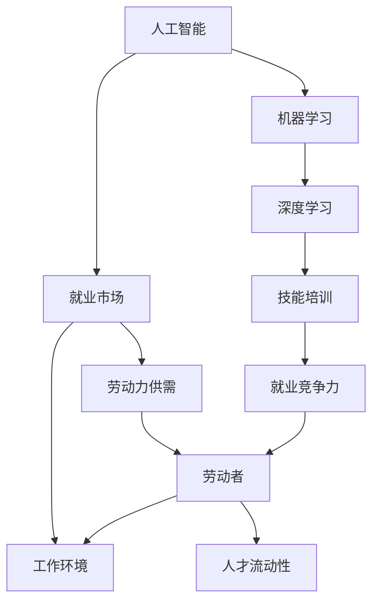
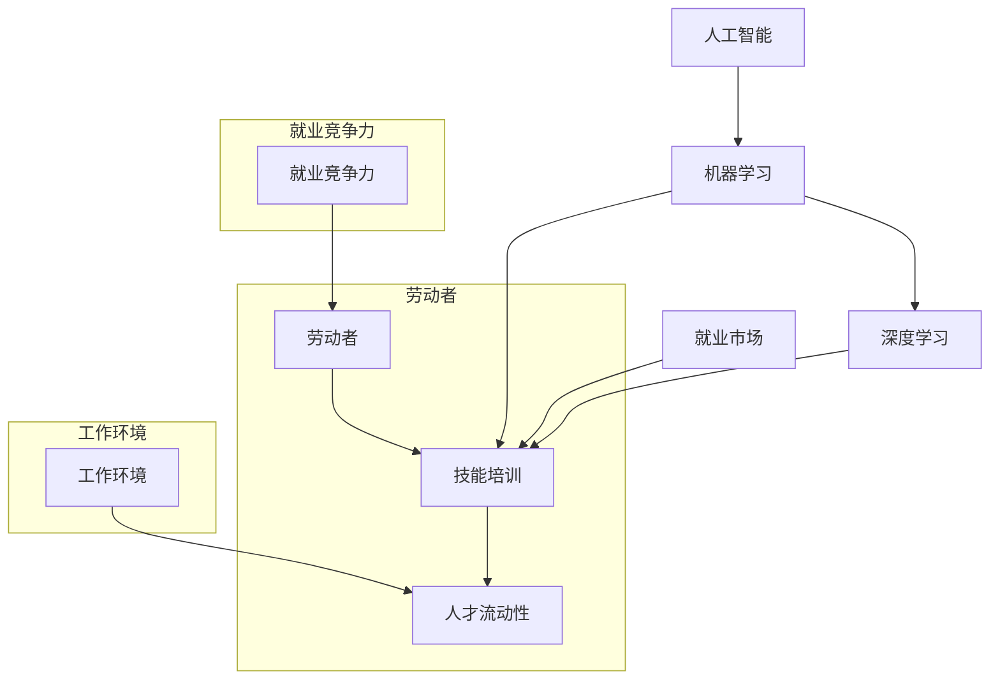

                 

# 人类计算：AI时代的未来就业市场与技能培训发展趋势分析机遇挑战机遇趋势预测分析

## 1. 背景介绍

随着人工智能技术的迅猛发展，尤其是深度学习、自然语言处理、计算机视觉等领域的突破，人类的计算能力正发生深刻的变革。AI的崛起不仅重塑了传统产业，也在就业市场和技能培训领域引发了一系列革命性的变化。本篇文章将深入探讨AI时代下未来就业市场与技能培训的发展趋势，分析其中的机遇与挑战，并预测未来可能的发展方向。

## 2. 核心概念与联系

### 2.1 核心概念概述

在探讨AI对就业市场和技能培训的影响之前，首先需要理解几个核心概念：

- **人工智能(AI)**：通过模拟人类智能行为，实现自主决策、问题解决、模式识别等功能的计算机技术。
- **机器学习(ML)**：一种数据驱动的AI技术，通过训练模型自动提升其预测或决策能力。
- **深度学习(DL)**：一种特殊类型的机器学习，通过多层神经网络模型进行复杂数据处理。
- **就业市场**：劳动者与雇主之间的劳动力供需关系及相应的劳动条件和工作环境。
- **技能培训**：为提高劳动者的专业技能和知识，提升其就业竞争力而进行的系统化教育培训活动。

这些概念间的关系可以通过以下Mermaid流程图来展示：



### 2.2 核心概念原理和架构的 Mermaid 流程图



## 3. 核心算法原理 & 具体操作步骤

### 3.1 算法原理概述

AI时代下，就业市场和技能培训的发展趋势受到多个因素的影响，包括但不限于AI技术的发展、劳动力供需关系的变化、工作环境的演化、以及技能培训体系的演变。这些因素之间存在复杂的互动关系，需要综合考虑。

### 3.2 算法步骤详解

1. **数据收集与分析**：收集全球范围内有关就业市场和技能培训的统计数据，包括劳动力供需状况、行业需求、技能要求、培训课程等。
2. **模型构建**：基于收集到的数据，构建预测模型，用于分析未来的就业趋势和技能需求。
3. **模型训练与验证**：使用历史数据对模型进行训练，并在新的数据上验证模型的准确性和稳健性。
4. **趋势预测**：基于训练好的模型，对未来几年内的就业市场和技能培训趋势进行预测。
5. **策略制定**：根据预测结果，为政策制定者、教育机构、企业提供决策支持，包括但不限于调整培训课程、优化人才招聘策略、提升员工技能等。

### 3.3 算法优缺点

**优点**：
- **数据驱动**：通过大量数据的分析和模型预测，可以较为准确地预判未来的就业趋势和技能需求。
- **动态调整**：模型可以实时更新，反映最新的市场动态和技术变化。
- **跨领域应用**：模型可以应用于不同的行业和领域，帮助制定更具针对性的策略。

**缺点**：
- **数据质量**：模型的预测精度受限于数据的质量和完整性，不准确的数据可能导致错误的预测。
- **模型复杂性**：预测模型的构建和维护需要专业知识，成本较高。
- **动态变化**：市场和技术的变化速度可能超过模型的更新速度，导致预测结果失效。

### 3.4 算法应用领域

AI时代下，就业市场和技能培训的发展趋势分析算法在以下几个领域具有广泛的应用：

- **政策制定**：政府机构可以利用模型预测未来的就业趋势，制定更为科学合理的就业政策。
- **教育培训**：教育机构可以基于预测结果调整课程设置，提高学生的就业竞争力。
- **企业招聘**：企业可以优化招聘策略，通过针对性的技能培训吸引和留住优秀人才。
- **职业指导**：职业指导机构可以利用模型预测未来的就业机会，为求职者提供更准确的职业规划建议。

## 4. 数学模型和公式 & 详细讲解 & 举例说明

### 4.1 数学模型构建

在预测就业市场和技能培训的发展趋势时，可以使用时间序列预测模型，如ARIMA、LSTM等。以LSTM模型为例，其数学模型可以表示为：

$$
\mathcal{L} = \sum_{t=1}^{T} \ell(x_t, \hat{x}_t)
$$

其中，$x_t$ 表示第$t$时刻的就业市场或技能培训数据，$\hat{x}_t$ 表示模型预测的$x_t$。$\ell$ 为损失函数，通常选择均方误差。

### 4.2 公式推导过程

以LSTM模型为例，其预测公式为：

$$
\hat{x}_t = f(x_{t-1}, \theta)
$$

其中，$f$ 为LSTM的隐藏层状态更新函数，$\theta$ 为模型参数。

在实际应用中，LSTM模型的训练过程可以分为两个阶段：前向传播和反向传播。具体步骤如下：

1. **前向传播**：将历史数据输入模型，计算隐藏层状态和输出预测值。
2. **反向传播**：计算预测值与真实值之间的误差，通过链式法则反向传播误差，更新模型参数。

### 4.3 案例分析与讲解

以某技术公司的技能培训课程为例，分析未来技能培训需求的变化趋势。假设模型预测未来五年内，深度学习技术在技术公司中的重要性将显著提升，因此模型建议技术公司增加深度学习相关的培训课程，以提升员工的技能水平。

## 5. 项目实践：代码实例和详细解释说明

### 5.1 开发环境搭建

在进行项目实践前，首先需要准备好开发环境。以下是使用Python进行TensorFlow开发的Python环境配置流程：

1. 安装Anaconda：从官网下载并安装Anaconda，用于创建独立的Python环境。

2. 创建并激活虚拟环境：
```bash
conda create -n tf-env python=3.8 
conda activate tf-env
```

3. 安装TensorFlow：根据CUDA版本，从官网获取对应的安装命令。例如：
```bash
conda install tensorflow -c tf
```

4. 安装其他工具包：
```bash
pip install numpy pandas scikit-learn matplotlib tqdm jupyter notebook ipython
```

完成上述步骤后，即可在`tf-env`环境中开始项目实践。

### 5.2 源代码详细实现

以下是使用TensorFlow构建LSTM模型的Python代码实现：

```python
import tensorflow as tf
from tensorflow.keras.layers import LSTM, Dense
from tensorflow.keras.models import Sequential

# 构建LSTM模型
model = Sequential()
model.add(LSTM(64, input_shape=(None, 1)))
model.add(Dense(1))

# 编译模型
model.compile(loss='mse', optimizer='adam')

# 训练模型
model.fit(x_train, y_train, epochs=100, batch_size=32, validation_data=(x_test, y_test))
```

### 5.3 代码解读与分析

在上述代码中，我们首先导入TensorFlow库和相关的模型层。然后，构建一个包含一个LSTM层和一个Dense层的顺序模型，用于预测未来的技能培训需求。最后，编译模型并使用历史数据进行训练。

## 6. 实际应用场景

### 6.1 智能制造

AI在智能制造中的应用将极大地改变就业市场和技能培训的发展趋势。随着工业机器人和智能设备的普及，对技能型人才的需求将大幅增加。智能制造领域的技能培训课程将围绕机器人编程、智能系统维护、自动化生产线管理等方面展开，培养能够操作和维护智能制造系统的技能人才。

### 6.2 医疗健康

AI在医疗健康领域的应用，将改变医疗服务的提供方式和医生的工作模式。智能诊断系统、个性化医疗推荐、医疗影像分析等技术将需要大量的专业技能人才。医疗健康领域的技能培训将更加注重数据科学、机器学习、医学知识等综合技能的培养，以应对不断变化的需求。

### 6.3 金融服务

AI在金融服务领域的应用，如智能投顾、风险控制、金融数据分析等，将对金融从业人员的技能提出新的要求。金融服务领域的技能培训将更加注重数据分析、编程技能、金融知识等的培养，帮助金融从业者适应新环境。

### 6.4 未来应用展望

随着AI技术的不断发展，未来就业市场和技能培训的发展趋势将呈现以下几个方向：

1. **跨学科技能**：未来的工作将越来越多地要求跨学科技能，如数据科学、编程、业务分析等综合技能。
2. **终身学习**：终身学习将成为就业市场的常态，技能培训将更加注重员工的持续学习和技能更新。
3. **个性化培训**：基于AI的个性化推荐系统，将为员工提供更精准的技能培训建议，提高培训效果。
4. **远程培训**：在线教育和远程培训将成为技能培训的重要组成部分，为全球范围内的人才提供学习机会。
5. **技能评估**：基于AI的技能评估系统，将更加客观、公正地评估员工的技能水平，指导培训计划的制定。

## 7. 工具和资源推荐

### 7.1 学习资源推荐

为了帮助开发者系统掌握AI时代下的就业市场和技能培训的发展趋势，这里推荐一些优质的学习资源：

1. **《人工智能时代：就业与技能的未来》**：一本全面介绍AI对就业市场影响和技能培训的书籍，适合从政策制定者到教育工作者等多个群体阅读。
2. **Coursera《人工智能与就业未来》**：由全球顶尖大学和机构开设的在线课程，深入讲解AI技术对就业市场的影响和应对策略。
3. **LinkedIn Learning**：提供大量与AI相关的课程，涵盖编程、数据分析、机器学习等多个领域，适合职场人士自学提升。
4. **IEEE Xplore**：提供大量与AI相关的学术论文和报告，适合深入研究AI技术及其应用。
5. **Kaggle**：数据科学和机器学习社区，提供丰富的数据集和竞赛，适合实践AI技术的应用。

### 7.2 开发工具推荐

高效的开发离不开优秀的工具支持。以下是几款用于AI时代下就业市场和技能培训开发的常用工具：

1. **TensorFlow**：由Google主导开发的开源深度学习框架，生产部署方便，适合大规模工程应用。
2. **PyTorch**：基于Python的开源深度学习框架，灵活动态的计算图，适合快速迭代研究。
3. **Jupyter Notebook**：支持多种编程语言和工具，提供交互式的代码编写和执行环境，适合数据科学和机器学习开发。
4. **Tableau**：数据可视化工具，支持复杂的数据分析和可视化功能，适合数据分析和展示。
5. **AWS SageMaker**：亚马逊提供的云端机器学习平台，支持模型训练、部署和监控，适合工业应用。

### 7.3 相关论文推荐

AI时代下就业市场和技能培训的发展趋势研究源于学界的持续研究。以下是几篇奠基性的相关论文，推荐阅读：

1. **《人工智能与就业市场：未来的挑战与机遇》**：分析AI技术对就业市场的影响，提出应对策略。
2. **《技能培训与人工智能：未来的技能要求与培训策略》**：探讨AI技术对技能培训的影响，提出未来的技能培训方向。
3. **《跨学科技能：AI时代下的新要求》**：分析AI时代对跨学科技能的需求，提出相关培训策略。
4. **《终身学习：AI时代的教育变革》**：探讨AI时代下的终身学习机制，提出终身学习的实施策略。
5. **《远程培训：AI时代的技能普及新模式》**：分析远程培训在AI时代下的应用，提出未来的远程培训方向。

## 8. 总结：未来发展趋势与挑战

### 8.1 总结

本文对AI时代下未来就业市场与技能培训的发展趋势进行了全面系统的介绍。首先阐述了AI技术对就业市场和技能培训的影响，明确了未来发展的方向。其次，从原理到实践，详细讲解了预测模型构建和训练的过程，给出了实际应用场景和代码实现。同时，本文还广泛探讨了AI时代下的技能培训和就业市场的变化趋势，展示了AI技术的巨大潜力。

通过本文的系统梳理，可以看到，AI技术正深刻改变着就业市场和技能培训的发展方向。未来，AI技术将在多个领域发挥重要作用，带来前所未有的机遇和挑战。唯有积极应对，才能把握AI时代的就业市场和技能培训的未来。

### 8.2 未来发展趋势

展望未来，AI时代下就业市场和技能培训的发展趋势将呈现以下几个方向：

1. **技能融合**：未来的工作将要求跨学科技能融合，技能培训将更加注重综合技能的培养。
2. **技能更新**：随着技术的不断进步，技能更新将成为常态，终身学习机制将更加重要。
3. **技能评估**：基于AI的技能评估系统将更加精准、公正，为培训计划提供科学依据。
4. **技能普及**：远程培训和在线教育将成为技能普及的重要手段，为全球人才提供学习机会。
5. **技能应用**：跨学科技能的应用将更加广泛，技能培训将更加注重实践能力的培养。

### 8.3 面临的挑战

尽管AI时代下的就业市场和技能培训面临诸多机遇，但仍面临诸多挑战：

1. **技术快速变化**：AI技术的快速发展可能使培训内容变得过时，难以跟上技术更新的步伐。
2. **技能缺口**：AI技术的应用可能导致某些技能需求的减少，难以快速填补技能缺口。
3. **技能培训资源不足**：优质的培训资源可能集中在发达地区，导致技能培训资源分配不均。
4. **技能差异**：不同地区和行业的技能需求可能存在差异，难以形成统一的技能培训标准。
5. **技能普及障碍**：部分群体可能缺乏接触AI技术的机会，技能普及面临障碍。

### 8.4 研究展望

面对AI时代下就业市场和技能培训的挑战，未来的研究需要在以下几个方面寻求新的突破：

1. **技能培训模型**：开发更为智能的技能培训模型，基于AI技术提供个性化、动态化的培训建议。
2. **技能评估体系**：建立更为科学、公正的技能评估体系，提供客观的评估标准和评估工具。
3. **技能普及政策**：制定更为公平、合理的人才培养政策，促进技能普及和技能更新。
4. **技能应用指导**：提供跨学科技能应用指导，帮助从业者更好地适应AI技术带来的变化。
5. **技能伦理研究**：探讨AI时代下技能应用的伦理问题，确保技能培训和应用的安全性、公正性。

这些研究方向将为AI时代下就业市场和技能培训的发展提供新的视角和解决方案，推动AI技术更好地服务于社会和经济。

## 9. 附录：常见问题与解答

**Q1：AI技术对就业市场和技能培训有何影响？**

A: AI技术将极大地改变就业市场和技能培训的发展趋势。AI技术的普及将导致某些职位需求的减少，但也会催生新的就业机会，特别是在技术开发、数据分析、智能制造等领域。技能培训将更加注重跨学科技能的培养，如数据科学、编程、业务分析等。

**Q2：如何应对AI技术带来的技能培训挑战？**

A: 应对AI技术带来的技能培训挑战，需要从以下几个方面入手：
1. 更新培训内容：根据AI技术的发展，及时更新培训内容，避免培训内容的过时。
2. 引入跨学科培训：通过跨学科培训，提升学生的综合技能，适应AI时代的就业需求。
3. 加强技能评估：建立科学的评估体系，客观公正地评估学生的技能水平，指导培训计划的制定。
4. 普及远程培训：通过远程培训和在线教育，为全球人才提供学习机会，缩小技能培训资源的差距。
5. 制定公平政策：制定公平合理的人才培养政策，促进技能普及和技能更新。

**Q3：AI技术在就业市场和技能培训中的应用前景如何？**

A: AI技术在就业市场和技能培训中的应用前景广阔。AI技术可以通过数据分析和预测模型，帮助政策制定者、教育机构和企业制定更为科学合理的培训计划和招聘策略。同时，AI技术也可以提供个性化的学习建议，提高培训效果。未来，AI技术将进一步普及，为全球人才提供更多学习和发展机会。

作者：禅与计算机程序设计艺术 / Zen and the Art of Computer Programming

