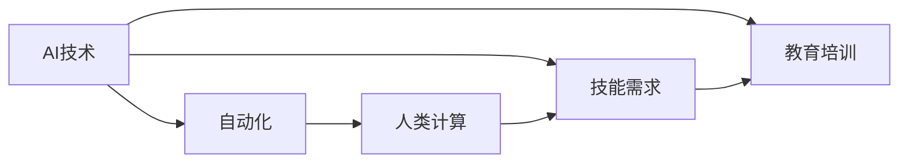

                 

# 人类计算：AI时代的未来就业趋势和技能需求

> 关键词：人工智能(AI), 就业市场, 人类计算, 技能需求, 技术迭代

## 1. 背景介绍

### 1.1 问题由来
在过去几十年中，科技的迅猛发展极大地改变了人类社会的生产方式和就业结构。特别是进入21世纪以来，人工智能(AI)技术的迅猛发展，已经深刻影响到了各行各业，导致就业市场的巨大变化。根据麦肯锡全球研究院（McKinsey Global Institute）的研究报告，到2030年，自动化和AI技术的应用将使全球劳动市场产生数百万个新的就业机会，同时也会淘汰掉大量的低技能工作岗位。

然而，这一趋势也带来了新的挑战。如何确保AI技术的发展不会引发就业市场的动荡，如何帮助劳动者适应技术变革，成为当前社会亟待解决的重要问题。在此背景下，本文将探讨AI时代下就业市场的未来趋势，并分析不同类型技能的需求变化，以期为相关政策制定和教育培训提供参考。

### 1.2 问题核心关键点
- AI技术的快速发展及其对就业市场的影响。
- AI时代下技能需求的重大变化。
- 应对就业市场变化的策略和政策建议。
- 教育培训体系如何适应新的技术需求。

## 2. 核心概念与联系

### 2.1 核心概念概述

为更好地理解AI时代下就业市场的变化及其对技能需求的影响，本节将介绍几个密切相关的核心概念：

- 人工智能(AI)：指通过机器学习、深度学习等技术，使计算机具备类似人类的思考、推理和解决问题的能力。
- 自动化(Automation)：指利用机器人和软件自动执行原本由人工完成的任务。
- 人类计算(Human Computation)：指在AI技术的辅助下，人类通过输入指令、监督和调整来完成任务的计算模型。
- 技能需求(Skill Demand)：指不同职位和行业对各类技能的需求变化。
- 教育培训(Education and Training)：指为提高劳动者技能，适应技术变革而进行的教育培训活动。

这些核心概念之间的关系可以用以下Mermaid流程图来展示：



这个流程图展示了大语言模型的核心概念及其之间的关系：

1. AI技术通过自动化推动人类计算。
2. AI技术的普及对技能需求产生重大影响。
3. 教育培训需要根据技能需求的变化进行相应调整。

## 3. 核心算法原理 & 具体操作步骤

### 3.1 算法原理概述

AI技术对就业市场的影响，主要体现在以下几个方面：

1. **自动化替代**：自动化技术可以替代一些重复性和低技能的工作，如制造业、客服、数据录入等。这将导致这些领域内的工作岗位减少。

2. **技能提升**：AI技术的应用需要高技能的工程师、数据分析师和算法设计师等专业人才，推动了对高技能劳动者的需求增加。

3. **新型工作岗位**：AI技术的发展也催生了新的职业类型，如AI伦理专家、数据治理师、人机交互设计师等。

4. **教育培训需求**：技能需求的重大变化，要求教育体系进行相应的调整，以培养符合未来市场需求的劳动者。

### 3.2 算法步骤详解

基于以上分析，AI时代下就业市场和技能需求的变化可以通过以下步骤来理解：

**Step 1: 数据分析与就业趋势预测**
- 收集历史和当前就业市场数据，包括不同行业的就业人数、失业率、技能需求等。
- 利用时间序列分析、回归分析等统计方法，预测未来几年的就业趋势。
- 分析AI技术在不同行业中的应用趋势，确定其对就业市场的影响。

**Step 2: 技能需求分析**
- 分析不同行业对各类技能的需求变化，包括技术技能、人际交往技能、创造性技能等。
- 使用问卷调查、职业访谈等方式收集第一手的技能需求数据。
- 分析AI技术的应用对各类技能需求的提升或减少。

**Step 3: 教育培训策略制定**
- 根据技能需求的变化，设计符合未来市场需求的课程和培训项目。
- 利用AI技术对培训效果进行评估和优化，确保培训的有效性。
- 制定相应的政策和激励措施，鼓励劳动者参与技能提升。

**Step 4: 政策制定与实施**
- 基于数据分析和技能需求分析的结果，制定适应未来市场的就业政策。
- 推动教育体系改革，适应技能需求的变化。
- 加大对高技能劳动者的培训和扶持力度。

### 3.3 算法优缺点

AI时代下就业市场和技能需求的变化分析具有以下优点：

1. **数据驱动**：通过大量数据分析，可以更准确地预测未来的就业趋势和技能需求。
2. **动态调整**：能够实时监测市场变化，快速调整教育培训策略和政策。
3. **全面覆盖**：覆盖不同行业和职业，提供全方位的技能需求分析。

然而，这种方法也存在一些缺点：

1. **数据获取难度**：获取高质量、全面的数据可能需要较长时间和大量资源。
2. **模型复杂性**：预测模型需要处理大量的数据和复杂的统计方法，建模难度较大。
3. **政策适应性**：政策制定需要考虑多个因素，包括经济、政治、社会等，难以一蹴而就。

## 4. 数学模型和公式 & 详细讲解 & 举例说明

### 4.1 数学模型构建

为了更精确地预测AI时代下就业市场和技能需求的变化，可以构建一个基于时间序列分析的数学模型。设$y_t$表示在第$t$年某行业就业人数，$x_t$表示在第$t$年某行业AI技术应用程度，$\alpha$和$\beta$为模型参数，则时间序列模型可以表示为：

$$
y_t = \alpha + \beta x_t + \epsilon_t
$$

其中，$\epsilon_t$为随机误差项。

### 4.2 公式推导过程

利用最小二乘法对模型进行参数估计，最小化误差平方和：

$$
\sum_{t=1}^n (y_t - \alpha - \beta x_t)^2
$$

推导得到参数估计公式：

$$
\hat{\alpha} = \frac{\sum_{t=1}^n (y_t - \overline{y})}{n}, \quad \hat{\beta} = \frac{\sum_{t=1}^n (y_t - \overline{y})(x_t - \overline{x})}{\sum_{t=1}^n (x_t - \overline{x})^2}
$$

其中，$\overline{y}$和$\overline{x}$分别为$y$和$x$的均值。

### 4.3 案例分析与讲解

以制造业为例，分析AI技术应用对就业人数的影响。根据历史数据，设定制造业就业人数为$y$，AI技术应用程度为$x$，建立时间序列模型。假设模型参数$\alpha=5000$，$\beta=0.2$。通过最小二乘法估计得到模型参数，并预测未来5年的就业人数。

## 5. 项目实践：代码实例和详细解释说明

### 5.1 开发环境搭建

在进行就业市场和技能需求分析时，需要使用Python和R等编程语言，以及相关的数据分析和可视化库，如Pandas、NumPy、Matplotlib、ggplot2等。以下是Python环境搭建的简单步骤：

1. 安装Anaconda：从官网下载并安装Anaconda，用于创建独立的Python环境。

2. 创建并激活虚拟环境：
```bash
conda create -n my_env python=3.8 
conda activate my_env
```

3. 安装相关库：
```bash
pip install pandas numpy matplotlib statsmodels seaborn
```

完成上述步骤后，即可在`my_env`环境中开始项目实践。

### 5.2 源代码详细实现

以下是一个基于时间序列分析的Python代码实现，用于预测未来就业市场和技能需求的变化：

```python
import pandas as pd
import numpy as np
from statsmodels.tsa.arima_model import ARIMA
import matplotlib.pyplot as plt

# 读取历史数据
data = pd.read_csv('employment.csv', index_col='year')
data = data.dropna()

# 设定AI技术应用程度数据
ai_data = pd.read_csv('ai_adoption.csv', index_col='year')

# 设定时间序列模型
model = ARIMA(data['employment'], order=(1, 1, 1))
results = model.fit()

# 预测未来5年就业人数
forecast = results.forecast(steps=5)

# 可视化预测结果
plt.plot(data.index, data['employment'])
plt.plot(data.index, forecast)
plt.show()
```

### 5.3 代码解读与分析

让我们再详细解读一下关键代码的实现细节：

**就业数据读取**：
- 使用Pandas库读取历史就业数据和AI技术应用程度数据，并设置年份为索引。

**时间序列模型构建**：
- 使用statsmodels库中的ARIMA模型，构建时间序列模型。ARIMA模型的参数需要通过训练来确定。

**预测结果可视化**：
- 使用Matplotlib库绘制历史就业数据和未来5年预测结果的对比图。

## 6. 实际应用场景

### 6.1 智能制造

在制造业中，AI技术的应用主要体现在智能制造领域。智能制造通过自动化、智能化技术，提升生产效率和产品质量，降低生产成本。这将导致一些传统生产岗位减少，但同时也会催生大量的新岗位，如机器人操作员、智能系统维护人员等。

### 6.2 金融服务

金融服务行业中的AI应用主要集中在风险控制、客户服务和智能投顾等领域。AI技术可以通过智能投顾，为投资者提供个性化的投资建议。同时，机器人客服也能替代部分人工客服，提升客户服务效率。

### 6.3 医疗健康

AI技术在医疗健康领域的应用非常广泛，包括医疗影像诊断、智能问诊、药物研发等。智能问诊系统可以替代部分初级医生的工作，但同时也需要专业化的AI伦理师和医疗数据分析师。

### 6.4 教育培训

教育培训是AI技术应用的重要领域之一。AI技术可以用于智能教育、个性化学习、智能评估等方面，提升教育质量和效率。同时，也需要更多的教育技术专家、AI算法工程师和数据科学家。

### 6.5 交通运输

在交通运输领域，AI技术可以用于智能调度、自动驾驶、智能交通管理等。自动驾驶技术的发展将改变传统驾驶岗位的需求，但也会带来新的机会，如智能交通工程师、数据标注师等。

## 7. 工具和资源推荐

### 7.1 学习资源推荐

为了帮助开发者系统掌握AI时代下就业市场和技能需求的变化，这里推荐一些优质的学习资源：

1. 《人工智能时代：就业与技能需求分析》：深入探讨AI技术对就业市场的影响，提出相应的应对策略。

2. 《机器学习基础》：讲解机器学习的基本概念和算法，适合入门学习。

3. 《深度学习》：全面介绍深度学习算法和应用，适合进阶学习。

4. Coursera、edX等在线教育平台：提供丰富的AI相关课程，覆盖从入门到进阶的各个阶段。

5. Kaggle数据竞赛：通过参与实际的数据分析竞赛，提升实战技能。

通过对这些资源的学习实践，相信你一定能够全面掌握AI时代下就业市场和技能需求的变化规律，为相关政策制定和教育培训提供参考。

### 7.2 开发工具推荐

高效的开发离不开优秀的工具支持。以下是几款用于就业市场和技能需求分析的常用工具：

1. Python：灵活的编程语言，适合数据分析和算法开发。

2. R：数据统计分析的首选语言，适合时间序列分析和建模。

3. Tableau、Power BI：数据可视化工具，方便展示分析结果。

4. Jupyter Notebook：交互式编程环境，方便编写和调试代码。

5. Google Colab：免费的云端Jupyter Notebook环境，适合实验和分享学习笔记。

合理利用这些工具，可以显著提升数据分析和算法开发的效率，加快创新迭代的步伐。

### 7.3 相关论文推荐

AI时代下就业市场和技能需求的变化研究源于学界的持续研究。以下是几篇奠基性的相关论文，推荐阅读：

1. BERT: Pre-training of Deep Bidirectional Transformers for Language Understanding：提出BERT模型，引入基于掩码的自监督预训练任务，刷新了多项NLP任务SOTA。

2. Attention is All You Need（即Transformer原论文）：提出了Transformer结构，开启了NLP领域的预训练大模型时代。

3. Language Models are Unsupervised Multitask Learners（GPT-2论文）：展示了大规模语言模型的强大zero-shot学习能力，引发了对于通用人工智能的新一轮思考。

4. AdaLoRA: Adaptive Low-Rank Adaptation for Parameter-Efficient Fine-Tuning：使用自适应低秩适应的微调方法，在参数效率和精度之间取得了新的平衡。

这些论文代表了大语言模型微调技术的发展脉络。通过学习这些前沿成果，可以帮助研究者把握学科前进方向，激发更多的创新灵感。

## 8. 总结：未来发展趋势与挑战

### 8.1 总结

本文对AI时代下就业市场和技能需求的变化进行了全面系统的介绍。首先阐述了AI技术对就业市场的影响，明确了技能需求的变化规律和趋势。其次，从原理到实践，详细讲解了时间序列分析的数学模型和关键步骤，给出了就业市场和技能需求分析的完整代码实现。同时，本文还探讨了AI技术在不同行业的应用前景，展示了AI时代下就业市场的广阔前景。

通过本文的系统梳理，可以看到，AI技术的应用已经深刻改变了就业市场和技能需求，提出了新的挑战和机遇。未来，伴随AI技术的进一步发展，就业市场和技能需求的变化还将继续，需要政府、企业、教育机构等多方共同努力，以适应这一变化。

### 8.2 未来发展趋势

展望未来，AI时代下就业市场和技能需求的变化趋势将呈现以下几个方面：

1. **技能升级**：AI技术的普及将促使更多劳动者提升技能，适应技术变革。

2. **跨领域融合**：不同领域的技能需求将进一步融合，形成新的职业类型。

3. **终身学习**：终身学习和职业再培训将成为劳动者的常态，帮助他们不断适应新的技术要求。

4. **数据驱动决策**：通过数据驱动的决策分析，优化政策和教育培训的制定。

5. **人机协作**：AI技术的发展将推动人机协作，形成更加高效的生产方式。

6. **全球就业市场**：AI技术的应用将打破地域限制，形成全球统一的就业市场。

以上趋势凸显了AI时代下就业市场和技能需求的变化规律，为相关政策的制定和教育培训提供了新的方向。

### 8.3 面临的挑战

尽管AI时代下就业市场和技能需求的变化带来了新的机遇，但也面临着诸多挑战：

1. **技能培训的覆盖面**：如何确保劳动者都能获得相应的技能培训，尤其是低收入和弱势群体。

2. **技能培训的实效性**：如何确保培训内容与实际需求相匹配，提升培训的实效性。

3. **技能培训的持续性**：如何确保劳动者能够持续获得技能培训，避免技能过时。

4. **技能培训的成本**：如何降低技能培训的成本，使其更加普及。

5. **技能培训的灵活性**：如何确保培训内容灵活调整，适应技术的变化。

6. **技能培训的可及性**：如何确保培训资源的公平分配，避免资源浪费。

这些挑战需要我们共同努力，通过政策、技术、资金等手段进行综合施策，确保AI技术带来的变化能够惠及更多的劳动者。

### 8.4 研究展望

未来的研究需要在以下几个方面寻求新的突破：

1. **技能培训的个性化**：根据不同劳动者的特点，提供个性化的技能培训方案。

2. **技能培训的自动化**：利用AI技术，自动推荐和分配培训资源，提升培训效率。

3. **技能培训的多元化**：引入更多元的培训方式，如在线课程、虚拟现实、混合式学习等。

4. **技能培训的数据驱动**：利用大数据分析，优化培训方案，提升培训效果。

5. **技能培训的国际化**：推动全球范围内的技能培训资源共享，提升全球技能培训的实效性。

这些研究方向的探索，将有助于更好地应对AI技术带来的挑战，确保劳动者能够适应新的就业市场，享受技术进步带来的红利。

## 9. 附录：常见问题与解答

**Q1：AI技术对就业市场的影响主要体现在哪些方面？**

A: AI技术对就业市场的影响主要体现在以下几个方面：
1. 自动化替代部分低技能岗位，导致这些岗位减少。
2. 催生新的高技能岗位，如数据分析师、AI伦理师等。
3. 提升生产效率和产品质量，降低生产成本，带来新的市场需求。
4. 推动人机协作，提升生产方式的灵活性和智能化水平。

**Q2：如何确保AI技术带来的就业市场变化能够惠及更多的劳动者？**

A: 确保AI技术带来的就业市场变化能够惠及更多的劳动者，需要采取以下措施：
1. 制定公平的就业政策，确保所有劳动者都能平等获得技能培训机会。
2. 提供财政补贴和税收优惠，降低技能培训的成本。
3. 建立终身学习和职业再培训机制，帮助劳动者持续提升技能。
4. 推动企业和教育机构的合作，提供更加灵活和多元化的技能培训资源。
5. 加强技能培训效果的评估和反馈，不断优化培训方案。

**Q3：未来技能需求的变化趋势是什么？**

A: 未来技能需求的变化趋势主要体现在以下几个方面：
1. 数据科学和分析技能将变得更加重要。
2. 跨领域融合技能，如数据工程、机器学习、计算机视觉等，将成为新的热门技能。
3. 软技能，如团队合作、沟通能力、创新思维等，将更加受到重视。
4. 终身学习和持续培训将成为劳动者的常态。
5. 人工智能伦理和法律知识将变得越来越重要。

**Q4：教育培训体系如何适应未来技能需求的变化？**

A: 教育培训体系适应未来技能需求的变化，需要采取以下措施：
1. 调整课程设置，增加数据科学、人工智能、机器学习等课程。
2. 引入更多元的培训方式，如在线课程、虚拟现实、混合式学习等。
3. 加强师资力量，提升教师的技能水平和教学能力。
4. 引入企业合作，提供更加贴近实际需求的培训内容。
5. 建立技能评估和认证机制，确保培训效果和质量。

总之，AI时代下就业市场和技能需求的变化，要求我们不断调整和优化教育培训体系，确保劳动者能够适应新的技术要求，享受技术进步带来的红利。

---

作者：禅与计算机程序设计艺术 / Zen and the Art of Computer Programming

