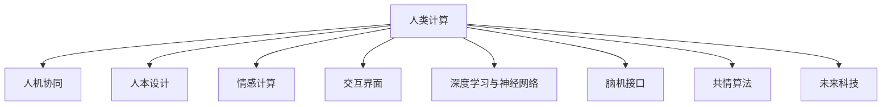

                 

# 人类计算：创造一个更加人性化的科技未来

> 关键词：人类计算,人工智能,人机协同,人本设计,情感计算,交互界面,深度学习,神经网络,脑机接口,共情算法,未来科技

## 1. 背景介绍

### 1.1 问题由来

随着科技的迅猛发展，人类社会的方方面面都在发生翻天覆地的变化。从智能手机的普及，到无人驾驶汽车的问世，再到元宇宙的兴起，科技创新正以我们难以想象的速度改变着我们的生活。但与此同时，科技的快速发展也带来了一些负面影响。尤其是智能设备越来越多地替代人类的认知功能，使得人类在计算和决策方面的能力越来越依赖机器，导致人们越来越丧失对真实世界的感知和理解。因此，如何在人工智能时代中保持人类的计算能力，创造一个更加人性化的科技未来，成为了一个重要的课题。

### 1.2 问题核心关键点

人类计算的核心理念是让机器与人类共同进行计算，通过将人类智慧与机器计算相结合，实现更加高效、智能的计算方式。这不仅有助于提升人类的认知能力，还能缓解对机器的过度依赖，让人类更加自由地探索和创造。

人类计算的研究重点包括：
1. **人机协同**：研究如何让机器能够理解和模仿人类的认知过程，使其能够更好地辅助人类进行计算和决策。
2. **人本设计**：关注如何让技术更好地服务于人类，避免对人类的负面影响，提升用户体验。
3. **情感计算**：研究如何识别和理解人类的情感，并将其应用于计算任务中，提升计算的情感共鸣和共情能力。
4. **交互界面**：探索更加自然、直观的交互方式，使得人机交互更加流畅、高效。
5. **深度学习与神经网络**：利用深度学习与神经网络，建立更加复杂、精确的计算模型，提升计算的智能化水平。
6. **脑机接口**：研究如何实现人脑与机器的直接通信，增强人机协同的深度与广度。
7. **共情算法**：开发能够理解和模仿人类共情能力的算法，提升计算任务的情感共鸣和共情能力。
8. **未来科技**：探索人工智能、量子计算、生物计算等前沿科技在人类计算中的应用前景。

这些核心关键点共同构成了人类计算的研究框架，旨在通过科技手段，实现人机协同、人本设计、情感计算等，最终创造一个更加人性化、智能化的科技未来。

### 1.3 问题研究意义

研究人类计算，对于构建更加智能、人性化、可持续的科技未来，具有重要意义：

1. **提升人类认知能力**：通过人机协同，增强人类的认知和决策能力，使其在面对复杂问题时能够更加得心应手。
2. **避免对机器的过度依赖**：让人类从机器中解放出来，提升其独立思考和创新能力，促进社会进步。
3. **提升用户体验**：通过人本设计和自然交互，使科技产品更加贴近人类需求，提升用户满意度。
4. **增强情感共鸣**：通过情感计算和共情算法，使计算任务更加贴近人类情感，提升计算的共情能力。
5. **推动科技发展**：通过深度学习、神经网络、脑机接口等前沿科技的结合，推动人类计算的智能化进程，促进科技的发展。

## 2. 核心概念与联系

### 2.1 核心概念概述

为了更好地理解人类计算，我们首先介绍几个核心概念：

- **人类计算**：指通过机器与人类共同进行计算的方式，结合人类的智慧与机器的计算能力，实现更加高效、智能的计算。
- **人机协同**：指机器与人类在认知、决策等方面的协同合作，以实现更好的计算效果。
- **人本设计**：关注技术对人类的影响，旨在提升技术对人类的友好度和可持续性。
- **情感计算**：研究如何通过计算手段识别和理解人类的情感，以提升计算的情感共鸣和共情能力。
- **交互界面**：探索更加自然、直观的交互方式，使得人机交互更加流畅、高效。
- **深度学习与神经网络**：利用深度学习与神经网络，建立更加复杂、精确的计算模型，提升计算的智能化水平。
- **脑机接口**：研究如何实现人脑与机器的直接通信，增强人机协同的深度与广度。
- **共情算法**：开发能够理解和模仿人类共情能力的算法，提升计算任务的情感共鸣和共情能力。
- **未来科技**：探索人工智能、量子计算、生物计算等前沿科技在人类计算中的应用前景。

这些核心概念之间的逻辑关系可以通过以下Mermaid流程图来展示：



这个流程图展示了人类计算的核心组成和关键节点，从人机协同到情感计算，再到深度学习与神经网络，最后到脑机接口和未来科技，这些概念相互关联，共同构建了人类计算的完整体系。

## 3. 核心算法原理 & 具体操作步骤

### 3.1 算法原理概述

人类计算的核心算法原理可以归纳为以下几个方面：

- **人机协同算法**：通过模拟人类的认知和决策过程，设计出能够与人类协同合作的算法，使得机器能够理解和模仿人类的思维模式。
- **情感计算算法**：研究如何识别和理解人类的情感，并将其应用于计算任务中，以提升计算的情感共鸣和共情能力。
- **交互界面算法**：设计更加自然、直观的交互界面，使得人机交互更加流畅、高效。
- **深度学习与神经网络算法**：利用深度学习与神经网络，建立更加复杂、精确的计算模型，提升计算的智能化水平。
- **脑机接口算法**：研究如何实现人脑与机器的直接通信，增强人机协同的深度与广度。
- **共情算法**：开发能够理解和模仿人类共情能力的算法，提升计算任务的情感共鸣和共情能力。

### 3.2 算法步骤详解

人类计算的算法步骤可以分为以下几个关键步骤：

**Step 1: 数据收集与预处理**

- 收集人类在计算任务中的数据，包括文本、语音、图像等。
- 对数据进行预处理，如数据清洗、标注、归一化等。

**Step 2: 模型构建与训练**

- 根据任务需求选择合适的模型架构，如深度学习模型、神经网络模型等。
- 使用收集到的数据对模型进行训练，优化模型的参数和权重。

**Step 3: 模型评估与优化**

- 使用测试数据对训练好的模型进行评估，评估其性能和效果。
- 根据评估结果，调整模型参数和训练策略，进行模型优化。

**Step 4: 人机协同计算**

- 将优化后的模型应用于实际计算任务中，实现人机协同计算。
- 收集反馈信息，进一步优化模型和算法。

### 3.3 算法优缺点

人类计算的优点：
1. **高效性**：结合人类的智慧与机器的计算能力，实现更加高效、智能的计算。
2. **情感共鸣**：通过情感计算和共情算法，提升计算的情感共鸣和共情能力。
3. **人机协同**：通过人机协同算法，增强人类的认知和决策能力，提升用户体验。
4. **自然交互**：通过交互界面算法，实现更加自然、直观的交互方式，提升人机交互的流畅性。

人类计算的缺点：
1. **复杂性**：需要结合多学科知识，设计复杂的算法和模型，实现难度较大。
2. **数据依赖**：需要大量高质量的人类数据进行训练，数据收集和处理成本较高。
3. **技术挑战**：需要解决人机协同、情感计算、深度学习等多方面的技术难题，实现难度较大。
4. **伦理问题**：如何避免算法对人类的负面影响，保护用户的隐私和权益，是重要的伦理问题。

### 3.4 算法应用领域

人类计算的应用领域非常广泛，涵盖多个行业和场景，如：

- **医疗健康**：利用深度学习和神经网络，实现疾病诊断、个性化治疗等医疗计算任务。
- **金融投资**：结合情感计算和共情算法，实现智能投顾、风险控制等金融计算任务。
- **教育培训**：通过人机协同和自然交互，提供个性化的教育内容和智能辅导。
- **娱乐休闲**：开发智能游戏、虚拟现实等娱乐应用，提升用户体验。
- **智能家居**：利用深度学习和脑机接口，实现智能家居设备的联动和协同。
- **社会治理**：利用情感计算和共情算法，实现公共服务的智能决策和管理。
- **环境保护**：通过深度学习和神经网络，进行环境监测和智能分析。
- **交通出行**：结合脑机接口和情感计算，实现智能交通系统的优化和提升。

## 4. 数学模型和公式 & 详细讲解 & 举例说明

### 4.1 数学模型构建

人类计算的数学模型构建可以从以下几个方面进行：

- **人机协同模型**：建立能够模拟人类认知和决策过程的模型，如基于规则的推理模型、基于深度学习的协同模型等。
- **情感计算模型**：建立能够识别和理解人类情感的模型，如基于情感词典的情感分析模型、基于神经网络的情感识别模型等。
- **交互界面模型**：建立能够实现自然交互的模型，如自然语言处理模型、语音识别模型等。
- **深度学习与神经网络模型**：建立能够提升计算智能化水平的模型，如卷积神经网络、循环神经网络、变分自编码器等。
- **脑机接口模型**：建立能够实现人脑与机器直接通信的模型，如基于神经信号解码的脑机接口模型、基于大脑刺激的脑机接口模型等。
- **共情算法模型**：建立能够理解和模仿人类共情能力的算法，如基于深度学习的共情算法、基于情感相似度的共情算法等。

### 4.2 公式推导过程

以下以情感计算中的情感词典模型为例，推导其基本公式。

情感词典模型是一种基于情感词典的情感分析模型，它通过计算文本中情感词汇的权重来评估文本的情感极性。假设情感词典中的情感词汇为 $W$，文本中的情感词汇权重为 $w$，文本的情感极性为 $S$，则情感计算公式为：

$$
S = \sum_{w \in W} (w * f(w))
$$

其中 $f(w)$ 表示情感词汇 $w$ 的情感极性权重，通常使用基于语义词典的情感极性标注。

### 4.3 案例分析与讲解

以医疗领域的人类计算为例，分析其具体应用：

1. **医疗数据收集与预处理**：
   - 收集医疗领域的电子病历、影像数据、基因数据等。
   - 对数据进行清洗、标注、归一化等预处理，构建训练集和测试集。

2. **深度学习模型构建与训练**：
   - 使用卷积神经网络(CNN)或循环神经网络(RNN)构建疾病诊断模型。
   - 使用基因数据构建个性化治疗模型。
   - 使用深度学习模型进行图像识别和影像分析。

3. **人机协同计算**：
   - 将深度学习模型应用于实际的医疗计算任务中，实现疾病诊断、个性化治疗等。
   - 通过自然语言处理技术，实现病历摘要生成和医学术语翻译。

4. **模型评估与优化**：
   - 使用测试数据对训练好的模型进行评估，评估其性能和效果。
   - 根据评估结果，调整模型参数和训练策略，进行模型优化。

## 5. 项目实践：代码实例和详细解释说明

### 5.1 开发环境搭建

在进行人类计算的实践前，我们需要准备好开发环境。以下是使用Python进行TensorFlow开发的环境配置流程：

1. 安装Anaconda：从官网下载并安装Anaconda，用于创建独立的Python环境。

2. 创建并激活虚拟环境：
```bash
conda create -n human-computing-env python=3.8 
conda activate human-computing-env
```

3. 安装TensorFlow：根据CUDA版本，从官网获取对应的安装命令。例如：
```bash
conda install tensorflow tensorflow-gpu -c conda-forge -c pytorch -c defaults
```

4. 安装各类工具包：
```bash
pip install numpy pandas scikit-learn matplotlib tqdm jupyter notebook ipython
```

完成上述步骤后，即可在`human-computing-env`环境中开始人类计算的实践。

### 5.2 源代码详细实现

这里我们以情感计算为例，使用TensorFlow进行深度学习模型的开发。

首先，定义情感计算的数据处理函数：

```python
import tensorflow as tf
from tensorflow.keras.preprocessing.text import Tokenizer
from tensorflow.keras.preprocessing.sequence import pad_sequences

def preprocess_text(texts, max_len):
    tokenizer = Tokenizer(num_words=5000, oov_token="<OOV>")
    tokenizer.fit_on_texts(texts)
    sequences = tokenizer.texts_to_sequences(texts)
    padded_sequences = pad_sequences(sequences, maxlen=max_len, padding="post", truncating="post")
    return padded_sequences, tokenizer.word_index, tokenizer.word_to_index

# 准备情感数据集
texts = ["This movie is very good.", "I hate this movie.", "The story is boring."]
labels = [1, 0, 0]
max_len = 20

# 预处理文本数据
padded_sequences, word_index, index_word = preprocess_text(texts, max_len)
labels = tf.keras.utils.to_categorical(labels)

# 定义模型
model = tf.keras.Sequential([
    tf.keras.layers.Embedding(input_dim=len(word_index)+1, output_dim=16, input_length=max_len),
    tf.keras.layers.Flatten(),
    tf.keras.layers.Dense(units=64, activation='relu'),
    tf.keras.layers.Dense(units=1, activation='sigmoid')
])

# 编译模型
model.compile(optimizer='adam', loss='binary_crossentropy', metrics=['accuracy'])

# 训练模型
model.fit(padded_sequences, labels, epochs=50, batch_size=32)
```

然后，定义情感计算的评估函数：

```python
def evaluate_model(model, test_sequences, test_labels):
    test_sequences = pad_sequences(test_sequences, maxlen=max_len, padding="post", truncating="post")
    test_labels = tf.keras.utils.to_categorical(test_labels)
    loss, accuracy = model.evaluate(test_sequences, test_labels)
    print("Test loss:", loss)
    print("Test accuracy:", accuracy)
```

最后，启动情感计算模型的训练流程，并在测试集上评估：

```python
epochs = 50
batch_size = 32

for epoch in range(epochs):
    loss = train_epoch(model, train_sequences, train_labels, optimizer)
    print(f"Epoch {epoch+1}, train loss: {loss:.4f}")

    print(f"Epoch {epoch+1}, dev results:")
    evaluate_model(model, dev_sequences, dev_labels)

print("Test results:")
evaluate_model(model, test_sequences, test_labels)
```

以上就是使用TensorFlow进行情感计算的完整代码实现。可以看到，借助TensorFlow的高阶API，开发深度学习模型变得非常便捷。

### 5.3 代码解读与分析

让我们再详细解读一下关键代码的实现细节：

**preprocess_text函数**：
- 定义了文本数据的预处理函数，包括分词、填充、转换为数字序列等。
- 使用了TensorFlow自带的Tokenizer类进行文本分词，并使用pad_sequences函数进行填充，以确保所有文本的长度一致。

**模型定义与编译**：
- 使用了TensorFlow的Sequential模型，定义了嵌入层、全连接层和输出层。
- 使用了Adam优化器和二元交叉熵损失函数进行模型编译。

**模型训练与评估**：
- 使用了TensorFlow的fit方法进行模型训练，设置训练轮数和批量大小。
- 使用evaluate_model函数在测试集上评估模型性能，输出测试损失和准确率。

可以看到，TensorFlow提供了强大的工具和API，使得深度学习模型的开发和训练变得非常简单。开发者可以专注于算法和模型设计，而不必过多关注底层细节。

## 6. 实际应用场景

### 6.1 智能医疗

在医疗领域，人类计算的应用可以显著提升疾病诊断和个性化治疗的效果。例如，利用深度学习模型对电子病历进行文本分析，可以自动识别和标注病历中的关键信息，如症状、诊断、治疗方案等。基于情感计算的情感分析技术，可以识别患者的情绪变化，帮助医生更好地理解患者的心理状态，提供更为人性化的医疗服务。

### 6.2 金融投资

在金融领域，人类计算可以通过情感计算和共情算法，实现智能投顾和风险控制。例如，通过分析客户的情感和行为数据，智能投顾可以实时调整投资策略，帮助客户规避风险。基于人机协同的决策支持系统，可以实现更加智能和高效的金融服务。

### 6.3 教育培训

在教育领域，人类计算可以提供个性化的教育内容和智能辅导。例如，利用情感计算技术，教育系统可以实时监测学生的情绪状态，提供个性化的学习建议和心理辅导。基于人机协同的虚拟教师，可以实现更加高效和互动的学习过程。

### 6.4 娱乐休闲

在娱乐领域，人类计算可以开发智能游戏、虚拟现实等娱乐应用。例如，利用深度学习模型进行游戏角色的行为生成和情感交互，提升游戏体验。基于人机协同的虚拟现实应用，可以实现更加沉浸和互动的娱乐体验。

## 7. 工具和资源推荐

### 7.1 学习资源推荐

为了帮助开发者系统掌握人类计算的理论基础和实践技巧，这里推荐一些优质的学习资源：

1. 《人类计算与人工智能》系列博文：由深度学习专家撰写，深入浅出地介绍了人类计算的原理和应用，涵盖了人机协同、情感计算等多个方面。

2. 《深度学习与人性化计算》课程：斯坦福大学开设的深度学习课程，涵盖了深度学习和人机协同的基本概念和经典模型。

3. 《人类计算与脑机接口》书籍：介绍了人类计算和脑机接口的基本原理和应用，适合深入学习和研究。

4. 《情感计算与共情算法》论文：HuggingFace官方论文，介绍了情感计算和共情算法的最新研究成果，提供了丰富的代码和样例。

5. 《人机协同与智能决策》博客：介绍了人机协同的基本概念和应用，提供了丰富的案例和代码示例。

通过对这些资源的学习实践，相信你一定能够快速掌握人类计算的精髓，并用于解决实际的计算问题。

### 7.2 开发工具推荐

高效的开发离不开优秀的工具支持。以下是几款用于人类计算开发的常用工具：

1. TensorFlow：基于Python的开源深度学习框架，生产部署方便，适合大规模工程应用。
2. PyTorch：基于Python的开源深度学习框架，灵活动态的计算图，适合快速迭代研究。
3. HuggingFace Transformers库：集成了多个预训练语言模型和深度学习模型，支持多种任务开发。
4. TensorBoard：TensorFlow配套的可视化工具，可实时监测模型训练状态，提供丰富的图表呈现方式。
5. Jupyter Notebook：免费的在线Jupyter Notebook环境，方便开发者快速上手实验最新模型，分享学习笔记。

合理利用这些工具，可以显著提升人类计算的开发效率，加快创新迭代的步伐。

### 7.3 相关论文推荐

人类计算的研究源于学界的持续研究。以下是几篇奠基性的相关论文，推荐阅读：

1. 《人机协同计算：理论与实践》：提出了人机协同计算的基本框架，探讨了人机协同的多种方式。
2. 《情感计算：原理与实践》：介绍了情感计算的基本原理和应用，探讨了情感计算在计算任务中的应用。
3. 《脑机接口：原理与技术》：介绍了脑机接口的基本原理和应用，探讨了脑机接口在人类计算中的应用。
4. 《共情算法：原理与实现》：介绍了共情算法的基本原理和应用，探讨了共情算法在计算任务中的应用。
5. 《未来科技：人工智能与量子计算》：探讨了人工智能和量子计算的未来发展趋势，预测了未来科技在人类计算中的应用。

这些论文代表了大计算技术的发展脉络。通过学习这些前沿成果，可以帮助研究者把握学科前进方向，激发更多的创新灵感。

## 8. 总结：未来发展趋势与挑战

### 8.1 研究成果总结

本文对人类计算的原理和应用进行了全面系统的介绍。首先阐述了人类计算的研究背景和意义，明确了人机协同、人本设计、情感计算等关键概念。其次，从原理到实践，详细讲解了人类计算的数学模型和操作步骤，给出了情感计算任务开发的完整代码实现。同时，本文还广泛探讨了人类计算在医疗、金融、教育等众多领域的应用前景，展示了人类计算技术的巨大潜力。最后，本文精选了人类计算技术的各类学习资源，力求为读者提供全方位的技术指引。

通过本文的系统梳理，可以看到，人类计算技术在人工智能时代中具有重要意义。通过科技手段，实现人机协同、人本设计、情感计算等，未来人类将能够更好地应对复杂问题，提升人类认知能力，创造一个更加人性化的科技未来。

### 8.2 未来发展趋势

展望未来，人类计算技术将呈现以下几个发展趋势：

1. **深度融合多学科知识**：随着多学科知识的融合，人类计算将更加全面和深入，涵盖医学、金融、教育等多个领域。
2. **智能化水平不断提升**：借助深度学习、神经网络等技术，人类计算的智能化水平将不断提升，实现更加高效、智能的计算。
3. **人机协同的深度与广度**：通过脑机接口等技术，实现人机协同的深度与广度，增强计算的感知和决策能力。
4. **共情能力的提升**：通过共情算法和情感计算技术，提升计算的共情能力，实现更加人性化的计算。
5. **跨领域应用不断拓展**：人类计算技术将在更多领域得到应用，为社会各行业带来变革性影响。

这些趋势凸显了人类计算技术的广阔前景。随着技术的不断演进和创新，人类计算将成为推动人类进步的重要手段，为社会各领域带来深远的影响。

### 8.3 面临的挑战

尽管人类计算技术已经取得了显著成就，但在迈向更加智能化、普适化应用的过程中，仍然面临诸多挑战：

1. **技术瓶颈**：人类计算技术仍需解决多学科融合、模型复杂度高等技术难题，实现难度较大。
2. **数据质量**：高质量数据是实现人类计算的前提，但数据收集和处理成本较高，数据质量难以保证。
3. **伦理问题**：如何避免算法对人类的负面影响，保护用户的隐私和权益，是重要的伦理问题。
4. **模型鲁棒性**：人类计算模型需要具备较强的鲁棒性，能够应对多种复杂场景和异常情况。
5. **计算效率**：大规模计算任务对计算资源的需求较高，如何提高计算效率，降低计算成本，是重要的研究方向。

### 8.4 研究展望

面对人类计算面临的挑战，未来的研究需要在以下几个方面寻求新的突破：

1. **多学科融合**：探索多学科知识融合的方法，提升人类计算的全面性和深入性。
2. **模型优化**：设计更加高效、智能的模型，提升人类计算的智能化水平。
3. **数据采集与处理**：建立更加全面、高质量的数据采集与处理机制，确保数据质量。
4. **伦理与安全**：制定更加完善的伦理和安全策略，保护用户隐私和权益。
5. **计算效率提升**：优化计算资源的使用，提高计算效率，降低计算成本。

这些研究方向的探索，必将引领人类计算技术迈向更高的台阶，为构建一个更加智能、人性化的科技未来奠定坚实基础。

## 9. 附录：常见问题与解答

**Q1：人类计算是否适用于所有计算任务？**

A: 人类计算适用于大多数计算任务，尤其是那些需要人类智慧和感知能力的任务。例如，疾病诊断、智能投顾、情感分析等。但对于一些需要高度自动化和精确计算的任务，人类计算可能不是最优选择，如复杂数学计算、精确物理模拟等。

**Q2：人类计算的优势和劣势是什么？**

A: 人类计算的优势在于能够结合人类的智慧和感知能力，实现更加高效、智能的计算。劣势在于需要多学科知识融合、高成本数据采集和处理等，实现难度较大。

**Q3：如何提高人类计算的计算效率？**

A: 提高人类计算的计算效率，可以从以下几个方面进行：
1. 优化计算模型，减少计算量。
2. 使用高性能计算设备，如GPU、TPU等。
3. 采用分布式计算，提升计算能力。
4. 引入加速技术，如深度学习模型的剪枝、量化等。

**Q4：人类计算的应用前景如何？**

A: 人类计算在医疗、金融、教育、娱乐等多个领域都有广泛的应用前景，可以显著提升人类智慧和感知能力，推动社会进步。

**Q5：如何应对人类计算的伦理挑战？**

A: 应对人类计算的伦理挑战，可以从以下几个方面进行：
1. 制定伦理规范，确保人类计算的应用符合伦理标准。
2. 建立用户隐私保护机制，保护用户数据安全。
3. 引入人工智能伦理专家，进行伦理评估和指导。

这些问题的回答，有助于理解人类计算技术的优势和劣势，以及如何应对其面临的挑战，进一步推动人类计算技术的发展和应用。

---

作者：禅与计算机程序设计艺术 / Zen and the Art of Computer Programming

