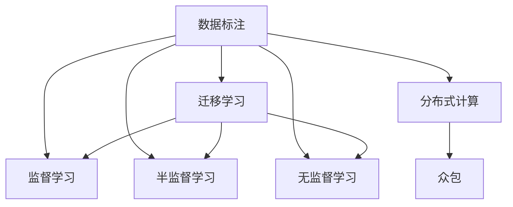

                 

# 人类计算：数据标注的秘密武器

## 1. 背景介绍

### 1.1 问题由来

数据标注（Data Annotation）在人工智能（AI）领域扮演着不可或缺的角色，尤其是在机器学习（ML）中。它是指由人工对数据集中的样本进行标记，为模型提供监督信号，以便模型学习到正确的数据分布和模式。数据标注的准确性和质量直接影响机器学习模型的性能。然而，数据标注工作繁琐耗时，成本高昂，且依赖大量人力，成为AI研究与应用的瓶颈。

### 1.2 问题核心关键点

数据标注的质量与效率一直是AI领域的研究热点，其核心关键点在于：

1. **数据标注的高成本**：通常每个样本的标注需要专业人员的多次审查和修正，工作量大且耗时。

2. **标注数据的稀缺性**：特定领域或场景下的标注数据往往难以获取，限制了模型的泛化能力。

3. **标注数据的多样性**：标注数据的多样性对于模型训练尤为重要，但收集多样性数据难度大。

4. **标注人员的专业性**：数据标注人员需具备一定的专业知识和经验，但合格标注人员数量有限。

5. **标注数据的及时更新**：随着业务场景的变化，标注数据需要及时更新，保持模型的时效性。

面对这些问题，研究者们不断探索新的解决方案，其中“人类计算”概念应运而生，旨在将标注任务转化为计算任务，通过分布式计算和自动化机制提升数据标注的效率和质量。

## 2. 核心概念与联系

### 2.1 核心概念概述

为更好地理解人类计算在数据标注中的作用，本节将介绍几个密切相关的核心概念：

1. **数据标注（Data Annotation）**：指通过人工对数据集中的样本进行标记，为模型提供监督信号，帮助模型学习正确的数据分布和模式。

2. **监督学习（Supervised Learning）**：一种机器学习范式，利用有标注的数据集训练模型，使其能够对新的未标注数据进行预测或分类。

3. **半监督学习（Semi-supervised Learning）**：在少量标注数据和大量未标注数据的情况下，训练模型，提升模型性能。

4. **无监督学习（Unsupervised Learning）**：不依赖标注数据，利用数据自身特性进行模型训练，探索数据内在规律。

5. **迁移学习（Transfer Learning）**：将一个领域学习到的知识迁移到另一个领域，提升模型在不同场景下的泛化能力。

6. **分布式计算（Distributed Computing）**：通过将计算任务分散到多个计算节点上进行处理，提升计算效率和任务可扩展性。

7. **众包（Crowdsourcing）**：利用大量非专业人员的集体智慧完成任务，降低人力成本。

这些概念之间的逻辑关系可以通过以下Mermaid流程图来展示：



这个流程图展示了大数据标注的相关概念及其之间的关系：

1. 数据标注是机器学习的基础。
2. 监督学习利用标注数据训练模型。
3. 半监督学习利用少量标注数据和大量未标注数据训练模型。
4. 无监督学习不依赖标注数据进行模型训练。
5. 迁移学习将一个领域学到的知识迁移到另一个领域。
6. 分布式计算和众包技术提升数据标注效率。

这些概念共同构成了数据标注的计算框架，使其能够高效地为机器学习模型提供数据支持。

## 3. 核心算法原理 & 具体操作步骤
### 3.1 算法原理概述

人类计算在数据标注中的核心原理是将标注任务转化为计算任务，通过分布式计算和自动化机制提升数据标注的效率和质量。具体而言，人类计算利用计算资源对大量数据进行批量处理，同时结合众包技术，将标注任务分配给非专业标注人员，大大降低人力成本。

### 3.2 算法步骤详解

人类计算的数据标注过程主要包括以下几个步骤：

**Step 1: 数据收集与预处理**
- 收集待标注数据集，包括图片、文本、语音等。
- 对数据进行预处理，如清洗、归一化、标注格式转换等。

**Step 2: 任务分割与分配**
- 根据数据量和工作量，将标注任务分割为多个子任务。
- 使用分布式计算框架，将子任务分配到多个计算节点上并行处理。

**Step 3: 标注人员选择与培训**
- 选择适合的标注人员，并进行标注规则培训。
- 通过在线平台将任务分配给标注人员，并提供必要的标注工具。

**Step 4: 标注与审核**
- 标注人员根据任务要求进行标注，并提交标注结果。
- 审核员对标注结果进行审核和修正，确保标注质量。

**Step 5: 标注结果汇总与分析**
- 汇总标注结果，进行统计和分析，了解标注数据分布情况。
- 对标注质量进行评估，优化标注流程和标注人员。

**Step 6: 标注结果存储与管理**
- 将标注结果存储在数据库或数据仓库中，以便后续使用。
- 使用数据管理工具进行标注结果的查询和展示。

### 3.3 算法优缺点

人类计算在数据标注中具有以下优点：
1. 降低人力成本。通过众包技术，大量非专业标注人员参与标注，显著降低了标注成本。
2. 提高标注效率。通过分布式计算，批量处理大量数据，显著提升了标注效率。
3. 增强标注数据的多样性。通过多个标注人员协作，标注数据具有更高的多样性和代表性。

同时，该方法也存在一定的局限性：
1. 标注质量难以保证。非专业标注人员可能存在标注不规范、错误等问题，需要额外的人工审核。
2. 标注一致性难以统一。不同标注人员之间的标注标准和一致性可能存在差异，需要统一标注规则和审核标准。
3. 标注过程可能存在数据泄露风险。标注数据涉及隐私信息，需要采取措施保护数据安全。

尽管存在这些局限性，但就目前而言，人类计算仍是数据标注的主流方法，其优势在于显著降低标注成本，提高标注效率。未来相关研究的方向在于如何进一步提升标注质量、保证标注一致性、保护数据隐私等方面。

### 3.4 算法应用领域

人类计算在数据标注中的应用已经广泛覆盖了多个领域，例如：

1. **图像标注**：对大量图片进行分类、分割、标注边界等任务。通过众包和分布式计算，快速高效地完成标注工作。

2. **文本标注**：对大量文本进行情感分析、命名实体识别、关键词提取等任务。利用自然语言处理技术，提高标注质量和效率。

3. **语音标注**：对大量语音进行转写、标注情感、识别口音等任务。结合自动语音识别技术，降低标注难度。

4. **视频标注**：对大量视频进行场景识别、事件标注、行为分析等任务。利用计算机视觉技术，提升标注效果。

5. **地理空间数据标注**：对地理空间数据进行标记，如地图定位、地址标注等。结合地理信息系统技术，提高标注准确性和时效性。

除了上述这些经典应用外，人类计算还将在更多场景中得到应用，如医疗影像、生物信息学、科学研究等领域，为大规模数据标注提供新的解决方案。

## 4. 数学模型和公式 & 详细讲解 & 举例说明

### 4.1 数学模型构建

人类计算在数据标注中的数学模型主要涉及分布式计算和众包标注两个方面。

**分布式计算模型**：
假设数据集大小为 $N$，每个标注任务的时间为 $T$，每个计算节点的处理能力为 $P$，则总计算时间为 $T(N/P)$。若将任务分成 $K$ 个子任务，则每个子任务的处理时间为 $T(K/N)$。使用分布式计算框架进行并行处理，总计算时间为 $T(K/N) + \text{通信时间}$。

**众包标注模型**：
假设每个标注人员对每个样本的标注时间率为 $R$，每个标注人员的处理能力为 $C$，每个标注任务分配给 $L$ 个标注人员，则每个标注任务的总时间为 $L(T/R)$。若使用众包平台分配任务，则实际标注时间可能受到平台效率和标注人员效率的影响。

### 4.2 公式推导过程

以下我们以文本情感分类任务为例，推导众包标注的平均时间和误差率。

假设标注人员 $i$ 对样本 $j$ 的标注结果为 $y_{ij}$，实际标注结果为 $y^*$。标注人员的标注时间率为 $R_i$，实际标注错误率为 $E_i$。则每个样本的平均标注时间为 $\frac{L}{N}T_i$，其中 $T_i = R_iT$。标注人员的标注误差率为 $E_i = (1-E_i^0)E_i$，其中 $E_i^0$ 为初始标注错误率。

根据贝叶斯定理，假设所有标注人员的标注误差率服从 $Beta$ 分布，即 $E_i \sim Beta(\alpha, \beta)$。则众包标注的平均标注时间和误差率为：

$$
\begin{align*}
\text{平均标注时间} &= \frac{L}{N}\sum_{i=1}^LE_iT_i = \frac{L}{N}\sum_{i=1}^L\frac{(1-E_i^0)E_i}{\sum_{j=1}^L\frac{(1-E_j^0)E_j}{\alpha, \beta}}T \\
\text{平均标注误差率} &= \frac{L}{N}\sum_{i=1}^L\frac{(1-E_i^0)E_i}{\sum_{j=1}^L\frac{(1-E_j^0)E_j}{\alpha, \beta}}
\end{align*}
$$

在实践中，我们可以利用蒙特卡罗模拟和重要性抽样技术，对上述模型进行估计和优化。

### 4.3 案例分析与讲解

我们以众包平台Labelbox为例，分析其实际应用中的标注效果和优化策略。

**Labelbox平台**：
Labelbox 是一个基于云计算的众包标注平台，支持文本、图像、音频等多种数据类型。其核心技术包括分布式标注系统、自动化审核机制和数据隐私保护。

**标注效果分析**：
- 分布式标注系统：Labelbox 将标注任务分布到多个计算节点上，利用并行计算加速标注过程。
- 自动化审核机制：Labelbox 使用机器学习模型对标注结果进行自动化审核，减少人工审核工作量。
- 数据隐私保护：Labelbox 采用数据加密、匿名化等措施，确保标注数据的安全。

**优化策略**：
- 任务分割策略：Labelbox 根据任务复杂度和数据量，自动调整任务分割大小，避免标注人员过载。
- 标注人员管理：Labelbox 根据标注人员的标注质量和时间效率，动态调整任务分配，提升整体标注效率。
- 标注质量控制：Labelbox 引入标注质量和一致性评估，实时监控标注结果，及时修正标注错误。

## 5. 项目实践：代码实例和详细解释说明
### 5.1 开发环境搭建

在进行人类计算实践前，我们需要准备好开发环境。以下是使用Python进行PyTorch和Dask开发的环境配置流程：

1. 安装Anaconda：从官网下载并安装Anaconda，用于创建独立的Python环境。

2. 创建并激活虚拟环境：
```bash
conda create -n pytorch-env python=3.8 
conda activate pytorch-env
```

3. 安装PyTorch和Dask：根据CUDA版本，从官网获取对应的安装命令。例如：
```bash
conda install pytorch torchvision torchaudio cudatoolkit=11.1 -c pytorch -c conda-forge
pip install dask
```

4. 安装各类工具包：
```bash
pip install numpy pandas scikit-learn matplotlib tqdm jupyter notebook ipython
```

完成上述步骤后，即可在`pytorch-env`环境中开始人类计算实践。

### 5.2 源代码详细实现

下面我们以众包平台Labelbox为例，给出使用PyTorch和Dask进行众包标注的Python代码实现。

首先，定义众包平台Labelbox的API接口：

```python
from labelbox import LabelboxAPI
from labelbox import LabelboxClient
import os

# 配置Labelbox API访问凭证
os.environ['LABELBOX_ACCESS_TOKEN'] = 'your_access_token'
os.environ['LABELBOX_PROJECT_ID'] = 'your_project_id'

# 创建Labelbox API客户端
labelbox_api = LabelboxAPI()
labelbox_client = LabelboxClient(labelbox_api)

# 获取项目信息
project = labelbox_client.get_project('your_project_id')
print(project)
```

然后，定义标注数据集的生成函数：

```python
import numpy as np
from sklearn.datasets import load_iris

# 加载Iris数据集
iris = load_iris()
X, y = iris.data, iris.target

# 生成随机标注数据集
def generate_annotated_dataset(X, y, num_labels=5, num_samples=1000):
    labels = np.random.randint(num_labels, size=num_samples)
    annotated_data = [(X[i], labels[i]) for i in range(num_samples)]
    return annotated_data

# 生成标注数据集
annotated_data = generate_annotated_dataset(X, y)
```

接着，定义数据标注函数：

```python
from labelbox import LabelboxAnnotation

# 创建Labelbox Annotation实例
annotation = LabelboxAnnotation()

# 定义标注规则
def create_annotated_image(image, labels):
    return {
        'image': image,
        'labels': labels
    }

# 定义标注函数
def annotate_data(data):
    image, labels = data
    return annotation.create_annotated_image(image, labels)

# 批量标注数据
annotated_data = annotate_data(annotated_data)
```

最后，启动标注流程：

```python
from dask.distributed import Client

# 创建Dask分布式计算客户端
client = Client('your_dask_address')

# 定义Dask任务函数
def annotate_task(annotated_data):
    image, labels = annotated_data
    return annotation.create_annotated_image(image, labels)

# 启动Dask分布式计算
client.submit(annotate_task, annotated_data)
```

以上就是使用PyTorch和Dask进行众包标注的完整代码实现。可以看到，利用Dask进行分布式计算，可以显著提高数据标注的效率和并行性。

### 5.3 代码解读与分析

让我们再详细解读一下关键代码的实现细节：

**Labelbox API接口**：
- 定义Labelbox API客户端和项目信息，进行认证和项目获取。

**数据集生成函数**：
- 使用sklearn加载Iris数据集，生成随机标注数据集，用于后续分布式标注。

**数据标注函数**：
- 使用Labelbox Annotation创建标注实例。
- 定义标注规则和函数，将图像和标签转换为Labelbox支持的格式。
- 批量提交标注任务到Dask集群，进行分布式处理。

**Dask分布式计算**：
- 定义Dask任务函数，将标注任务提交到Dask集群进行并行处理。
- 使用Dask客户端启动任务队列，自动调度计算资源，确保高效完成标注任务。

可以看到，利用Dask进行众包标注，可以显著提升数据标注的效率和并行性，降低人力成本。

## 6. 实际应用场景
### 6.1 智能客服系统

众包标注技术在智能客服系统中得到了广泛应用。传统客服系统需要配备大量人力，高峰期响应缓慢，且服务质量难以保证。通过众包标注技术，可以快速获取大量标注数据，训练出高精度的智能客服模型，提升客户咨询体验和服务质量。

在技术实现上，可以利用众包平台如Labelbox，收集客户咨询数据，标注常见问题和最佳答复。利用分布式计算技术，批量处理大量数据，训练出多轮对话模型。在实时交互中，系统可根据客户咨询自动匹配答案，提高响应速度和准确性。

### 6.2 医疗影像标注

医疗影像标注是众包标注技术的重要应用场景之一。医疗影像数据量大，标注复杂，对标注人员的专业要求高。通过众包标注技术，可以快速获取高质量的标注数据，为医学影像分析提供可靠的数据支持。

在实践中，可以利用众包平台如Labelbox，收集医生标注的影像数据，结合机器学习技术进行自动标注。通过Dask等分布式计算技术，批量处理大量数据，提高标注效率。标注数据可用于训练影像分析模型，提升疾病诊断的准确性和效率。

### 6.3 自然语言处理（NLP）

众包标注技术在自然语言处理领域也有广泛应用。NLP任务如文本分类、命名实体识别、情感分析等，需要大量标注数据进行训练。通过众包标注技术，可以快速获取高质量的标注数据，提升模型性能。

在实践中，可以利用众包平台如Labelbox，收集标注人员对文本的标注结果，结合机器学习技术进行自动标注。通过Dask等分布式计算技术，批量处理大量数据，提高标注效率。标注数据可用于训练NLP模型，提升模型泛化能力和精度。

### 6.4 未来应用展望

随着众包标注技术的不断发展，其在更多领域的应用前景广阔。

在智慧城市治理中，利用众包标注技术，可以快速收集城市事件、舆情数据，提升城市管理的智能化水平。在智能制造中，利用众包标注技术，可以快速收集产品检测数据，提升产品质量控制。在智慧农业中，利用众包标注技术，可以快速收集作物生长数据，提升农业生产的智能化水平。

此外，众包标注技术也在社会治理、科学研究、公共安全等领域，展现了广泛的应用潜力。随着技术的不断进步，众包标注技术必将在更多领域发挥重要作用，为各行各业带来新的变革。

## 7. 工具和资源推荐
### 7.1 学习资源推荐

为了帮助开发者系统掌握众包标注的理论基础和实践技巧，这里推荐一些优质的学习资源：

1. 《Crowdsourcing in AI: From Vision to AI》系列博文：由众包专家撰写，深入浅出地介绍了众包技术在AI领域的应用和发展。

2. Crowdsourcing on Kaggle：Kaggle平台上的众包项目，涵盖多个NLP、图像处理、生物信息学等领域，提供了丰富的标注任务和解决方案。

3. Labelbox官方文档：Labelbox平台官方文档，提供了详细的标注流程和API接口，是入门众包标注的重要资料。

4. CrowdAI课程：斯坦福大学开设的众包技术课程，介绍了众包技术的原理、应用和挑战，适合入门学习。

5. CrowdFlower博客：CrowdFlower平台的官方博客，分享了大量众包标注的实践经验和最佳实践。

通过对这些资源的学习实践，相信你一定能够快速掌握众包标注的精髓，并用于解决实际的标注问题。

### 7.2 开发工具推荐

高效的开发离不开优秀的工具支持。以下是几款用于众包标注开发的常用工具：

1. Labelbox：一款专业的众包标注平台，支持多种数据类型，提供了丰富的标注工具和自动化审核机制。

2. Amazon Mechanical Turk (MTurk)：亚马逊提供的众包平台，适合处理大规模标注任务，支持多语言标注。

3. Prolific：一款高效率的众包标注平台，支持多语言标注和复杂任务设计。

4. CrowdFlower：一款专业的众包标注平台，支持多语言标注和实时审核机制。

5. Jepu Annotations：一款开源的众包标注工具，支持多种数据类型和自定义标注规则。

合理利用这些工具，可以显著提升众包标注的效率和质量，降低人力成本。

### 7.3 相关论文推荐

众包标注技术的发展源于学界的持续研究。以下是几篇奠基性的相关论文，推荐阅读：

1. Crowdsourcing for Collecting Dense Labelled Data: A Field Study：分析了众包标注在数据收集中的效果和挑战，提出了多种改进策略。

2. Human-in-the-Loop: An Overview of Research and Applications of Human-AI Collaboration in Natural Language Processing：总结了人机协同在NLP中的研究进展，探讨了众包标注的应用前景。

3. Crowdsourcing in Data Annotation: A Survey：总结了众包标注在多个领域的应用，提出了多种优化策略和未来研究方向。

4. Human-in-the-Loop Machine Learning：探讨了人机协同在机器学习中的应用，介绍了众包标注和自动化标注相结合的方法。

5. Crowdsourcing for Data Annotation: A Survey and Taxonomy：总结了众包标注的研究现状和未来发展方向，提出了多种改进策略。

这些论文代表了大众标注技术的发展脉络。通过学习这些前沿成果，可以帮助研究者把握学科前进方向，激发更多的创新灵感。

## 8. 总结：未来发展趋势与挑战
### 8.1 总结

本文对众包标注技术在数据标注中的作用进行了全面系统的介绍。首先阐述了众包标注的重要性和挑战，明确了其在机器学习中的核心地位。其次，从原理到实践，详细讲解了众包标注的数学模型和操作步骤，给出了众包标注任务开发的完整代码实例。同时，本文还广泛探讨了众包标注技术在智能客服、医疗影像、自然语言处理等多个行业领域的应用前景，展示了众包标注技术的巨大潜力。此外，本文精选了众包标注技术的各类学习资源，力求为读者提供全方位的技术指引。

通过本文的系统梳理，可以看到，众包标注技术在降低数据标注成本、提升标注效率和质量方面具有显著优势。伴随技术的不断演进，众包标注必将在更多领域得到应用，为各行各业带来新的变革性影响。

### 8.2 未来发展趋势

展望未来，众包标注技术将呈现以下几个发展趋势：

1. **智能化和自动化**：随着人工智能技术的发展，众包标注将更加智能化和自动化，能够自动生成标注任务和标注规则，提高标注效率和质量。

2. **分布式计算**：利用分布式计算技术，可以处理大规模数据标注任务，提升标注效率和并行性。

3. **众包平台优化**：众包平台将进一步优化用户体验和标注工具，提高标注人员的工作效率和标注质量。

4. **多领域应用**：众包标注技术将在更多领域得到应用，如智慧城市、智能制造、智慧农业等，为各行各业带来新的价值。

5. **隐私保护**：在数据标注过程中，将更加注重数据隐私保护，采用加密、匿名化等措施，确保数据安全。

6. **协作机制**：探索多种协作机制，如人机协同、众包与专家协同，提高标注质量和一致性。

以上趋势凸显了众包标注技术的广阔前景。这些方向的探索发展，必将进一步提升众包标注的效率和质量，为各行各业带来新的价值。

### 8.3 面临的挑战

尽管众包标注技术已经取得了瞩目成就，但在迈向更加智能化、普适化应用的过程中，它仍面临着诸多挑战：

1. **标注质量难以保证**：非专业标注人员可能存在标注不规范、错误等问题，需要额外的人工审核。

2. **标注一致性难以统一**：不同标注人员之间的标注标准和一致性可能存在差异，需要统一标注规则和审核标准。

3. **数据隐私保护**：标注数据涉及隐私信息，需要采取措施保护数据安全。

4. **标注任务设计**：如何设计合理的标注任务，使其能够最大化利用标注人员的专业知识和经验，仍是一大难题。

5. **标注工具和技术**：如何设计更加智能、易于使用的标注工具和技术，降低标注人员的工作难度，提升标注效率。

6. **标注数据的真实性**：如何确保标注数据的真实性和可靠性，避免虚假标注对模型的负面影响。

正视众包标注面临的这些挑战，积极应对并寻求突破，将是众包标注技术走向成熟的必由之路。相信随着学界和产业界的共同努力，这些挑战终将一一被克服，众包标注必将在构建人机协同的智能系统中发挥重要作用。

### 8.4 研究展望

面向未来，众包标注技术需要在以下几个方面寻求新的突破：

1. **众包技术融合**：将众包技术与自动化标注、机器学习等技术结合，提高标注质量和效率。

2. **数据标注新范式**：探索新的数据标注范式，如无监督标注、半监督标注、主动学习等，降低标注成本和提高标注质量。

3. **数据标注标准化**：制定行业标准和规范，确保标注数据的质量和一致性。

4. **数据标注自动化**：开发更加智能化的数据标注工具，自动生成标注任务和标注规则，降低人力成本。

5. **数据标注安全**：研究数据标注的安全保护技术，确保数据隐私和安全。

这些研究方向的探索，必将引领众包标注技术迈向更高的台阶，为构建安全、可靠、可解释、可控的智能系统铺平道路。面向未来，众包标注技术还需要与其他人工智能技术进行更深入的融合，如知识表示、因果推理、强化学习等，多路径协同发力，共同推动智能交互系统的进步。只有勇于创新、敢于突破，才能不断拓展数据标注的边界，让智能技术更好地造福人类社会。

## 9. 附录：常见问题与解答

**Q1：众包标注技术是否适用于所有数据标注任务？**

A: 众包标注技术在大多数数据标注任务上都能取得不错的效果，特别是对于标注数据量大的任务。但对于一些特定领域的任务，如医学、法律等，仅仅依靠通用语料预训练的模型可能难以很好地适应。此时需要在特定领域语料上进一步预训练，再进行众包标注，才能获得理想效果。此外，对于一些需要时效性、个性化很强的任务，如对话、推荐等，众包标注方法也需要针对性的改进优化。

**Q2：如何选择合适的众包标注平台？**

A: 选择合适的众包标注平台需要考虑以下几个因素：
1. 平台的用户体验和工具丰富度。选择易于使用、功能强大的标注平台，提高标注效率。
2. 平台的标注任务多样性和灵活性。选择支持多种数据类型和标注规则的平台，适应不同任务需求。
3. 平台的数据隐私和安全保障。选择具有完善数据保护措施的平台，确保标注数据的安全。
4. 平台的标注质量和审核机制。选择具有严格标注审核机制的平台，提高标注质量和一致性。
5. 平台的价格和性价比。选择价格合理、性价比高的平台，降低标注成本。

**Q3：众包标注任务设计如何避免标注偏差？**

A: 避免标注偏差需要综合考虑以下几个方面：
1. 定义清晰的标注规则和标准。确保标注规则一致，避免标注人员主观偏差。
2. 引入多个标注人员。通过多标注对比，减少标注偏差。
3. 进行标注一致性审核。通过人工审核和自动化审核，修正标注偏差。
4. 设计多样化的标注任务。通过设计多样化的标注任务，涵盖不同场景和情况，减少标注偏差。
5. 引入元标注和标注质量评估。通过元标注和标注质量评估，及时发现和修正标注偏差。

这些策略可以结合众包平台的技术支持，通过自动生成标注任务和标注规则，进一步提高标注质量和一致性。

**Q4：众包标注任务的自动生成和审核如何实现？**

A: 自动生成和审核众包标注任务，需要结合机器学习技术和平台工具。具体实现方式如下：
1. 使用自然语言处理技术，自动生成标注任务描述。例如，使用BERT等预训练模型，根据文本语义生成标注任务。
2. 使用自动化标注工具，自动标注部分样本。例如，使用自动标注工具，对部分样本进行初步标注，然后由人工审核。
3. 引入机器学习模型，自动审核标注结果。例如，使用监督学习模型，对标注结果进行自动审核，修正标注偏差。
4. 使用多轮标注机制，逐步提升标注质量。例如，通过多轮标注和对比，逐步提升标注质量和一致性。
5. 使用平台工具，统一标注规则和审核标准。例如，使用众包平台工具，制定统一的标注规则和审核标准，确保标注质量和一致性。

通过这些技术手段，可以实现自动生成和审核众包标注任务，提高标注效率和质量。

**Q5：众包标注任务设计如何兼顾标注质量和时间效率？**

A: 设计众包标注任务时需要平衡标注质量和标注时间效率，具体策略如下：
1. 合理划分任务难度和复杂度。将标注任务分为不同难度级别，让标注人员能够根据自己的能力和经验选择合适的任务。
2. 设计简洁明了的标注任务。确保标注任务描述简单明了，易于理解，降低标注人员的工作难度。
3. 引入多轮标注机制。通过多轮标注和对比，逐步提升标注质量和一致性，同时确保标注时间效率。
4. 引入机器学习模型。使用机器学习模型对标注结果进行自动审核，修正标注偏差，提高标注质量。
5. 优化标注人员管理。通过平台工具，合理分配标注任务，避免标注人员过载，提高标注效率。

通过这些策略，可以兼顾标注质量和时间效率，确保众包标注任务的顺利进行。

---

作者：禅与计算机程序设计艺术 / Zen and the Art of Computer Programming

