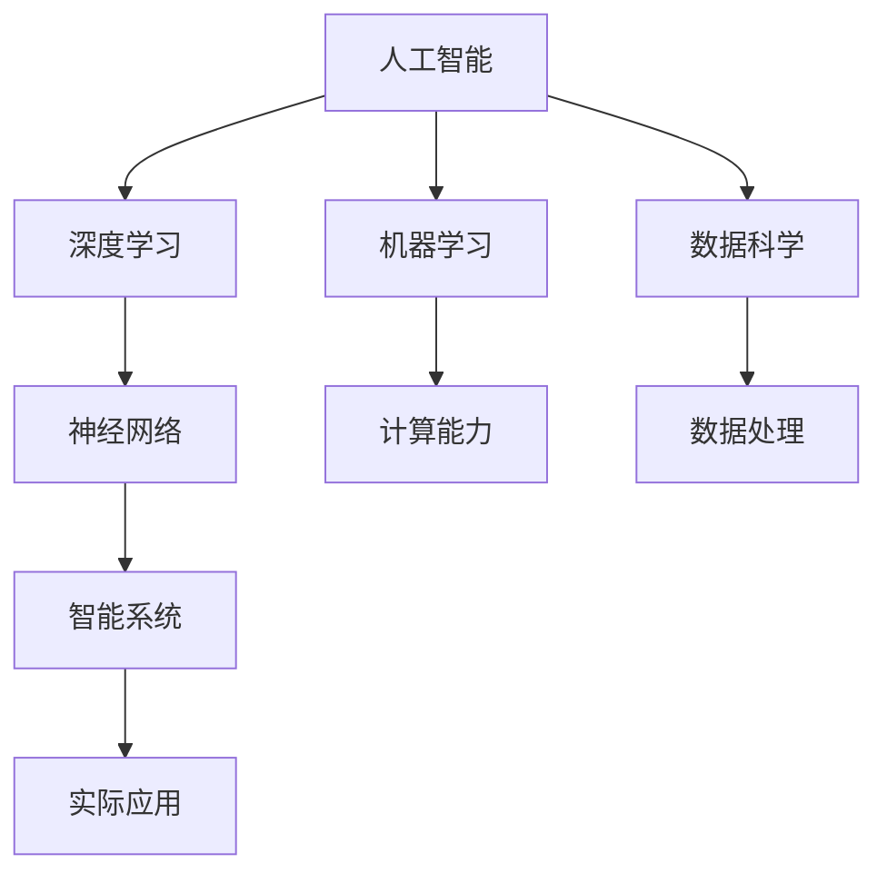

                 

# 人类计算：研究方向和机遇

> 关键词：
  - 人类计算
  - 人工智能
  - 机器学习
  - 深度学习
  - 数据科学
  - 神经网络
  - 智能系统
  - 计算能力
  - 未来发展
  - 机遇与挑战

## 1. 背景介绍

### 1.1 问题由来
随着计算技术的飞速发展，人类社会的许多领域正在经历前所未有的变革。从医疗、金融到教育、交通，人工智能（AI）正在逐步替代人力，提升效率、降低成本、改善体验。然而，这一过程中也引发了关于人类计算（Human Computation）的深入讨论。

### 1.2 问题核心关键点
人类计算的核心在于，如何让机器更好地理解和模拟人类的思考过程，进而辅助人类完成更复杂、更智能的任务。这不仅需要大量的数据和计算资源，也需要深度学习、神经网络、自然语言处理等多种先进技术支撑。通过深入研究人类计算，可以拓展AI的边界，促进其更广泛、更深入的应用。

### 1.3 问题研究意义
研究人类计算，对于拓展AI的应用范围，提升AI的智能水平，加速各个行业智能化转型，具有重要意义：

1. 提升计算效率。利用人类计算技术，可以大幅度提升数据处理和决策效率，减少人工工作量，加速创新进程。
2. 增强智能决策。通过模拟人类的思考方式，AI可以更加灵活、智能地应对各种复杂问题，提高决策质量。
3. 促进跨领域应用。人类计算技术可以跨界应用于医疗、金融、教育、交通等多个行业，推动各领域的智能化升级。
4. 构建智能生态。通过与人类智能的协同，AI可以构建更全面、更智能的生态系统，提升社会整体创新能力和竞争力。
5. 增进人类福祉。利用AI辅助人类完成高强度、高风险的工作，可以解放人类劳动力，提升生活质量，创造更多社会价值。

## 2. 核心概念与联系

### 2.1 核心概念概述

为更好地理解人类计算的研究方向和机遇，本节将介绍几个核心概念：

- 人工智能（Artificial Intelligence, AI）：一种使计算机系统能够模仿人类智能行为的技术，包括学习、推理、感知、自然语言处理等。
- 机器学习（Machine Learning, ML）：通过数据训练，使计算机系统能够自动改进算法，从而提高其性能。
- 深度学习（Deep Learning, DL）：一种基于神经网络的多层次数据处理方法，能够有效处理非线性、高维度的数据。
- 数据科学（Data Science）：以数据为核心，利用统计学、机器学习、人工智能等技术，挖掘数据价值，驱动决策和创新。
- 神经网络（Neural Network, NN）：受到人类神经系统启发，通过多层非线性变换，处理复杂数据问题。
- 智能系统（Intelligent System）：具备一定智能行为，能够自主学习、推理、决策的系统，如自动驾驶、智能客服等。
- 计算能力（Computational Capability）：指系统处理数据和执行计算的能力，是衡量AI智能水平的重要指标。

这些概念之间的逻辑关系可以通过以下Mermaid流程图来展示：



这个流程图展示了几大核心概念及其之间的关系：

1. 人工智能是总概念，包含机器学习、深度学习、数据科学等子概念。
2. 机器学习和深度学习是实现人工智能的主要手段。
3. 数据科学提供数据处理和挖掘方法，支持AI的训练和优化。
4. 神经网络是深度学习的主要模型，实现数据的非线性处理。
5. 智能系统是AI的实际应用，提升系统的智能水平。
6. 计算能力是衡量AI智能水平的重要指标，影响AI的应用效果。

## 3. 核心算法原理 & 具体操作步骤

### 3.1 算法原理概述

人类计算的核心在于利用机器学习、神经网络等技术，通过大量数据训练，模拟人类智能行为，进而辅助人类完成各种复杂任务。其核心思想是：

1. 数据驱动：通过大量标注数据，训练模型学习数据的特征和规律。
2. 智能模拟：将模型应用于实际问题，模拟人类的感知、推理、决策等智能行为。
3. 人机协同：与人类智能协同工作，提升任务的效率和效果。

### 3.2 算法步骤详解

人类计算的算法步骤包括：

**Step 1: 数据准备**
- 收集并准备大量数据，确保数据的多样性和代表性。
- 进行数据预处理，包括数据清洗、标注、归一化等。

**Step 2: 模型设计**
- 选择合适的算法和模型，如神经网络、决策树、支持向量机等。
- 设计模型的超参数，包括学习率、隐藏层大小、正则化系数等。

**Step 3: 模型训练**
- 使用训练集数据，通过前向传播和反向传播，不断调整模型参数。
- 设置合适的优化算法，如随机梯度下降（SGD）、Adam等。
- 使用验证集数据进行模型评估和调整。

**Step 4: 模型评估**
- 使用测试集数据，评估模型的性能，如准确率、召回率、F1值等。
- 通过交叉验证等方法，确保模型在不同数据集上的泛化性能。

**Step 5: 模型应用**
- 将训练好的模型应用于实际问题，进行智能推理、决策等。
- 收集用户反馈，不断优化模型，提升其性能和应用效果。

### 3.3 算法优缺点

人类计算算法具有以下优点：

1. 通用性强。适用于各种类型的智能任务，包括分类、预测、生成等。
2. 自动化程度高。通过数据训练，模型能够自动学习和优化，减少了人工干预。
3. 易于扩展。通过增加数据和计算资源，可以提升模型性能，支持更大规模的应用。
4. 应用广泛。广泛应用于医疗、金融、教育、交通等多个领域，推动行业智能化转型。

然而，该算法也存在以下缺点：

1. 数据依赖性强。高质量数据的获取和标注，往往需要大量人力和时间，成本较高。
2. 模型复杂度高。深度学习模型结构复杂，需要大量计算资源进行训练和推理。
3. 可解释性不足。模型往往是"黑盒"，难以解释其内部工作机制和决策逻辑。
4. 鲁棒性差。模型容易受到数据偏差、噪音等影响，泛化性能有限。
5. 实时性差。大规模模型推理速度较慢，难以实现实时智能决策。

### 3.4 算法应用领域

人类计算算法已经在诸多领域得到了广泛应用，包括：

- 医疗诊断：利用深度学习模型，进行疾病预测、影像分析、基因诊断等。
- 金融预测：利用神经网络模型，进行股票预测、信用评估、风险控制等。
- 智能推荐：利用协同过滤、推荐系统等技术，为用户推荐商品、音乐、电影等。
- 智能客服：利用自然语言处理技术，实现自动客服、智能问答等。
- 无人驾驶：利用计算机视觉、深度学习等技术，实现自动驾驶、路径规划等。
- 语音识别：利用声学模型和语言模型，进行语音转文字、语音指令执行等。
- 智能制造：利用机器学习、数据挖掘等技术，优化生产流程、提高产品质量等。

除了这些经典应用外，人类计算技术还被创新性地应用到更多场景中，如自动作曲、虚拟助手、智能控制等，为各行各业带来了新的机遇。

## 4. 数学模型和公式 & 详细讲解

### 4.1 数学模型构建

人类计算的核心是深度学习模型，其数学模型可以表示为：

$$
y = f(x; \theta)
$$

其中，$y$ 为输出，$x$ 为输入，$\theta$ 为模型参数，$f$ 为模型函数。

以二分类任务为例，常见的模型包括逻辑回归、决策树、支持向量机、神经网络等。其数学模型可以表示为：

$$
P(y|x; \theta) = \sigma(\theta^T x)
$$

其中，$P(y|x; \theta)$ 为条件概率，$\sigma$ 为激活函数，$\theta$ 为模型参数，$x$ 为输入特征。

### 4.2 公式推导过程

以逻辑回归模型为例，其公式推导如下：

- 假设数据集为 $(x_i, y_i)$，其中 $y_i \in \{0,1\}$。
- 将 $x_i$ 输入模型，得到预测值 $y_i'$。
- 计算损失函数 $L = -\frac{1}{N}\sum_{i=1}^N [y_i \log y_i' + (1-y_i) \log (1-y_i')]$。
- 使用梯度下降等优化算法，最小化损失函数 $L$，更新模型参数 $\theta$。

使用上述公式，我们可以进行逻辑回归模型的训练和预测。

### 4.3 案例分析与讲解

以图像识别任务为例，利用深度学习模型进行人类计算的详细过程如下：

- 准备数据集：收集大量图像数据，并进行标注，确保数据的多样性和代表性。
- 数据预处理：进行图像归一化、增强、标注等预处理操作。
- 设计模型：选择卷积神经网络（CNN）模型，设计合适的超参数。
- 训练模型：使用训练集数据，通过前向传播和反向传播，不断调整模型参数。
- 模型评估：使用验证集数据进行模型评估，选择最优模型。
- 应用模型：将训练好的模型应用于测试集，进行图像识别和分类。

## 5. 项目实践：代码实例和详细解释说明

### 5.1 开发环境搭建

在进行人类计算实践前，我们需要准备好开发环境。以下是使用Python进行TensorFlow开发的环境配置流程：

1. 安装Anaconda：从官网下载并安装Anaconda，用于创建独立的Python环境。

2. 创建并激活虚拟环境：
```bash
conda create -n tf-env python=3.8 
conda activate tf-env
```

3. 安装TensorFlow：根据CUDA版本，从官网获取对应的安装命令。例如：
```bash
conda install tensorflow-gpu -c conda-forge
```

4. 安装各类工具包：
```bash
pip install numpy pandas scikit-learn matplotlib tqdm jupyter notebook ipython
```

完成上述步骤后，即可在`tf-env`环境中开始人类计算实践。

### 5.2 源代码详细实现

这里我们以图像识别任务为例，给出使用TensorFlow进行深度学习模型训练的Python代码实现。

首先，定义图像数据处理函数：

```python
import tensorflow as tf
from tensorflow.keras import datasets, layers, models

def prepare_data():
    (train_images, train_labels), (test_images, test_labels) = datasets.cifar10.load_data()
    train_images, test_images = train_images / 255.0, test_images / 255.0
    return train_images, train_labels, test_images, test_labels
```

然后，定义模型和优化器：

```python
def create_model():
    model = models.Sequential([
        layers.Conv2D(32, (3, 3), activation='relu', input_shape=(32, 32, 3)),
        layers.MaxPooling2D((2, 2)),
        layers.Conv2D(64, (3, 3), activation='relu'),
        layers.MaxPooling2D((2, 2)),
        layers.Conv2D(64, (3, 3), activation='relu'),
        layers.Flatten(),
        layers.Dense(64, activation='relu'),
        layers.Dense(10)
    ])
    model.compile(optimizer='adam', loss=tf.keras.losses.SparseCategoricalCrossentropy(from_logits=True), metrics=['accuracy'])
    return model
```

接着，定义训练和评估函数：

```python
def train_model(model, train_images, train_labels, test_images, test_labels, epochs):
    history = model.fit(train_images, train_labels, epochs=epochs, validation_data=(test_images, test_labels))
    test_loss, test_acc = model.evaluate(test_images, test_labels, verbose=2)
    print('Test accuracy:', test_acc)
    return history

# 使用CIFAR-10数据集进行训练
train_images, train_labels, test_images, test_labels = prepare_data()
model = create_model()

history = train_model(model, train_images, train_labels, test_images, test_labels, epochs=10)
```

最后，在测试集上评估模型性能：

```python
# 加载测试集数据
test_images, test_labels = prepare_data()[1:2]

# 评估模型性能
test_loss, test_acc = model.evaluate(test_images, test_labels, verbose=2)
print('Test accuracy:', test_acc)
```

以上就是使用TensorFlow进行图像识别任务人类计算实践的完整代码实现。可以看到，TensorFlow提供了丰富的模型和工具，使得深度学习模型的开发和训练变得简单高效。

### 5.3 代码解读与分析

让我们再详细解读一下关键代码的实现细节：

**prepare_data函数**：
- 使用CIFAR-10数据集加载和预处理数据，确保数据归一化到0-1之间。

**create_model函数**：
- 定义卷积神经网络（CNN）模型，包括卷积层、池化层、全连接层等。
- 设置优化器、损失函数、评估指标等。

**train_model函数**：
- 使用训练集数据进行模型训练，设置训练轮数、验证集等参数。
- 收集训练过程中的记录，包括损失函数和精度等。
- 在测试集上评估模型性能，输出精度指标。

**训练流程**：
- 准备数据集，创建模型
- 设置优化器和损失函数
- 定义训练和评估函数
- 在训练集上训练模型，并在验证集上评估模型性能
- 在测试集上评估模型最终性能

可以看到，TensorFlow使得深度学习模型的开发和训练变得简洁高效。开发者可以将更多精力放在模型设计、数据处理等核心环节上，而不必过多关注底层的实现细节。

当然，工业级的系统实现还需考虑更多因素，如模型的保存和部署、超参数的自动搜索、更灵活的任务适配层等。但核心的模型训练和评估过程基本与此类似。

## 6. 实际应用场景

### 6.1 智能医疗

人类计算技术在医疗领域的应用，可以实现智能诊断、药物研发、基因分析等，大幅提升医疗服务的质量和效率。

具体而言，可以收集医疗影像、电子病历、基因序列等数据，利用深度学习模型进行图像识别、病历分析、基因检测等任务。微调后的模型能够自动理解和诊断疾病，辅助医生进行诊断和治疗。此外，利用人类计算技术，还可以进行药物分子的设计和筛选，加速新药研发进程。

### 6.2 智能金融

金融领域的数据量大、复杂度高，适合应用人类计算技术。利用深度学习模型，可以进行股票预测、信用评估、风险控制等任务。

在股票预测方面，可以收集历史股票数据、财务数据、新闻报道等，利用LSTM等时间序列模型，预测股票价格的变化趋势。在信用评估方面，可以收集用户的消费记录、信用记录等数据，利用深度学习模型，评估用户的信用风险。在风险控制方面，可以收集市场数据、新闻报道等，利用深度学习模型，预测市场的风险变化，及时采取风险控制措施。

### 6.3 智能制造

工业4.0时代，智能制造成为关键趋势。利用人类计算技术，可以实现生产流程优化、质量控制、设备预测性维护等任务。

在生产流程优化方面，可以收集生产数据、设备数据、工艺参数等，利用深度学习模型，优化生产流程，提高生产效率和质量。在质量控制方面，可以收集产品质量数据、生产参数等，利用深度学习模型，进行质量检测和分析，及时发现和解决生产问题。在设备预测性维护方面，可以收集设备运行数据、环境数据等，利用深度学习模型，预测设备故障，提前进行维护，减少停机时间。

### 6.4 未来应用展望

随着深度学习技术的不断进步，人类计算技术将在更多领域得到应用，为各行各业带来变革性影响。

在智慧城市治理中，利用人类计算技术，可以实现智能交通、智慧能源、环境监测等任务。在智慧教育中，利用人类计算技术，可以实现个性化教育、智能辅导、智能考试等任务。在智慧零售中，利用人类计算技术，可以实现智能推荐、库存管理、营销分析等任务。

## 7. 工具和资源推荐

### 7.1 学习资源推荐

为了帮助开发者系统掌握人类计算的理论基础和实践技巧，这里推荐一些优质的学习资源：

1. 《深度学习》系列书籍：由深度学习领域的知名学者撰写，全面介绍了深度学习的基本概念、算法和应用。
2. 《机器学习》课程：斯坦福大学开设的机器学习课程，有Lecture视频和配套作业，带你深入理解机器学习的理论基础和实践技巧。
3. 《TensorFlow实战》书籍：TensorFlow官方出版的实战书籍，提供了丰富的TensorFlow应用实例，帮助你快速上手。
4. Weights & Biases：模型训练的实验跟踪工具，可以记录和可视化模型训练过程中的各项指标，方便对比和调优。
5. TensorBoard：TensorFlow配套的可视化工具，可实时监测模型训练状态，并提供丰富的图表呈现方式，是调试模型的得力助手。

通过对这些资源的学习实践，相信你一定能够快速掌握人类计算的精髓，并用于解决实际的AI问题。

### 7.2 开发工具推荐

高效的开发离不开优秀的工具支持。以下是几款用于人类计算开发的常用工具：

1. TensorFlow：基于Python的开源深度学习框架，灵活动态的计算图，适合快速迭代研究。
2. PyTorch：基于Python的开源深度学习框架，灵活的动态计算图，适合深度学习和研究。
3. Keras：高层次的深度学习框架，易于使用，适合快速原型开发和实验。
4. Jupyter Notebook：交互式编程环境，适合代码编写和调试。
5. Scikit-learn：Python数据科学库，提供了丰富的机器学习算法和工具。

合理利用这些工具，可以显著提升人类计算任务的开发效率，加快创新迭代的步伐。

### 7.3 相关论文推荐

人类计算技术的发展源于学界的持续研究。以下是几篇奠基性的相关论文，推荐阅读：

1. LeCun Y. et al.：“Gradient-based learning applied to document recognition”。提出了深度学习模型的基本原理和算法，奠定了深度学习的基础。
2. Hinton G. et al.：“Improving neural networks by preventing co-adaptation of feature detectors”。提出了对比学习的思想，提升了深度学习模型的泛化能力。
3. Bengio Y. et al.：“Learning representations by back-propagation errors”。提出了反向传播算法，推动了深度学习的发展。
4. Vapnik V. et al.：“The Nature of Statistical Learning Theory”。提出了支持向量机算法，在分类和回归问题上取得了优异表现。
5. Sussillo D. et al.：“Deep Recurrent Neural Networks for Curriculum Generation”。提出了深度递归神经网络算法，应用于课程生成等任务。

这些论文代表了大数据计算技术的发展脉络。通过学习这些前沿成果，可以帮助研究者把握学科前进方向，激发更多的创新灵感。

## 8. 总结：未来发展趋势与挑战

### 8.1 研究成果总结

本文对人类计算的研究方向和机遇进行了全面系统的介绍。首先阐述了人类计算技术的发展背景和意义，明确了人类计算在推动AI应用、提升智能水平方面的独特价值。其次，从原理到实践，详细讲解了人类计算的数学模型和操作步骤，给出了深度学习模型训练的完整代码实现。同时，本文还广泛探讨了人类计算技术在医疗、金融、智能制造等多个行业领域的应用前景，展示了人类计算技术的巨大潜力。此外，本文精选了人类计算技术的各类学习资源，力求为读者提供全方位的技术指引。

通过本文的系统梳理，可以看到，人类计算技术正在成为AI技术的重要组成部分，极大地拓展了AI的应用边界，催生了更多的落地场景。未来，伴随深度学习技术的持续演进，人类计算技术也将不断迭代优化，提升AI系统的智能水平和应用效果。

### 8.2 未来发展趋势

展望未来，人类计算技术将呈现以下几个发展趋势：

1. 深度学习算法持续进步。随着神经网络结构和算法的不断优化，深度学习模型的表现将越来越优秀，能够处理更加复杂的数据问题。
2. 数据获取和处理能力提升。随着大数据技术的进步，数据的获取和处理能力将得到提升，为深度学习模型的训练和优化提供更多数据支持。
3. 跨领域应用拓展。人类计算技术将跨界应用于更多领域，如智慧城市、智慧教育、智慧零售等，推动各个行业的智能化升级。
4. 智能系统协同工作。人类计算技术将与自然语言处理、计算机视觉、语音识别等技术协同工作，构建更加全面、智能的系统。
5. 计算能力和资源优化。通过算法优化和硬件升级，提升深度学习模型的计算能力和资源利用效率，实现更高性能和更低成本。

以上趋势凸显了人类计算技术的广阔前景。这些方向的探索发展，必将进一步提升AI系统的性能和应用范围，为各行各业带来新的变革和机遇。

### 8.3 面临的挑战

尽管人类计算技术已经取得了瞩目成就，但在迈向更加智能化、普适化应用的过程中，它仍面临着诸多挑战：

1. 数据依赖性强。高质量数据的获取和标注，往往需要大量人力和时间，成本较高。
2. 模型复杂度高。深度学习模型结构复杂，需要大量计算资源进行训练和推理。
3. 可解释性不足。模型往往是"黑盒"，难以解释其内部工作机制和决策逻辑。
4. 鲁棒性差。模型容易受到数据偏差、噪音等影响，泛化性能有限。
5. 实时性差。大规模模型推理速度较慢，难以实现实时智能决策。

### 8.4 研究展望

面对人类计算面临的种种挑战，未来的研究需要在以下几个方面寻求新的突破：

1. 探索无监督和半监督学习算法。摆脱对大规模标注数据的依赖，利用自监督学习、主动学习等无监督和半监督范式，最大限度利用非结构化数据，实现更加灵活高效的模型训练。
2. 研究参数高效和计算高效的模型。开发更加参数高效的深度学习模型，在固定大部分预训练参数的同时，只更新极少量的任务相关参数。同时优化模型的计算图，减少前向传播和反向传播的资源消耗，实现更加轻量级、实时性的部署。
3. 融合因果和对比学习范式。通过引入因果推断和对比学习思想，增强深度学习模型的稳定性和泛化能力，学习更加普适、鲁棒的语言表征。
4. 引入更多先验知识。将符号化的先验知识，如知识图谱、逻辑规则等，与深度学习模型进行巧妙融合，引导模型学习更准确、合理的语言模型。同时加强不同模态数据的整合，实现视觉、语音等多模态信息与文本信息的协同建模。
5. 结合因果分析和博弈论工具。将因果分析方法引入深度学习模型，识别出模型决策的关键特征，增强输出解释的因果性和逻辑性。借助博弈论工具刻画人机交互过程，主动探索并规避模型的脆弱点，提高系统稳定性。
6. 纳入伦理道德约束。在模型训练目标中引入伦理导向的评估指标，过滤和惩罚有偏见、有害的输出倾向。同时加强人工干预和审核，建立模型行为的监管机制，确保输出符合人类价值观和伦理道德。

这些研究方向的探索，必将引领人类计算技术迈向更高的台阶，为构建安全、可靠、可解释、可控的智能系统铺平道路。面向未来，人类计算技术还需要与其他人工智能技术进行更深入的融合，如知识表示、因果推理、强化学习等，多路径协同发力，共同推动智能系统的进步。只有勇于创新、敢于突破，才能不断拓展人类计算技术的边界，让智能技术更好地造福人类社会。

## 9. 附录：常见问题与解答

**Q1：人类计算是否适用于所有AI任务？**

A: 人类计算适用于各种类型的AI任务，包括图像识别、语音识别、自然语言处理等。但对于一些特殊任务，如复杂的机械设计、系统控制等，可能还需结合专家知识和实际经验进行辅助。

**Q2：人类计算与传统机器学习有哪些不同？**

A: 人类计算与传统机器学习的主要区别在于，人类计算更强调模拟人类智能行为，融合更多先验知识和经验，能够处理更加复杂、多变的任务。传统机器学习则更多依赖数据驱动，缺乏对人类智能的模拟和理解。

**Q3：人类计算在落地应用时需要注意哪些问题？**

A: 人类计算在落地应用时，需要注意以下问题：
1. 数据质量。确保数据的准确性和多样性，减少数据偏差对模型的影响。
2. 模型鲁棒性。通过正则化、对抗训练等方法，提升模型的鲁棒性和泛化能力。
3. 实时性。优化模型结构和算法，提升推理速度和计算效率，实现实时智能决策。
4. 可解释性。设计可解释的模型结构，增强模型的透明度和可理解性。

**Q4：未来人类计算技术的发展方向是什么？**

A: 未来人类计算技术的发展方向包括：
1. 深度学习模型的不断优化。提高深度学习模型的性能和泛化能力。
2. 多模态数据的融合。结合视觉、语音、文本等多种数据，提升系统的综合能力和智能水平。
3. 智能系统的协同工作。与自然语言处理、计算机视觉、语音识别等技术协同工作，构建更加全面、智能的系统。
4. 模型的可解释性和伦理性。增强模型的透明度和可理解性，纳入伦理导向的评估指标，确保模型的安全性和合规性。

这些方向将引领人类计算技术迈向更高的台阶，为各行各业带来新的变革和机遇。面向未来，我们需要积极探索和实践，不断推动人类计算技术的进步。

---

作者：禅与计算机程序设计艺术 / Zen and the Art of Computer Programming

