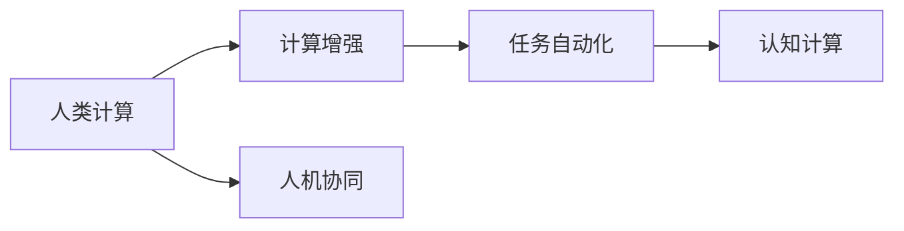

                 

# 人类计算：连接人与机器的桥梁

在科技日新月异的今天，人工智能技术的发展已经深入到各行各业，其中，"人类计算"（Human Computation）作为一种新型的计算范式，正逐渐成为连接人与机器的桥梁，助力人类更加高效地理解和利用复杂的数据与知识。本文将从背景介绍、核心概念与联系、核心算法原理、实际操作流程、数学模型与公式、项目实践、应用场景、工具与资源推荐、总结与展望等多个维度深入探讨这一前沿领域。

## 1. 背景介绍

随着科技的发展，人类计算的概念逐渐进入人们的视野。"人类计算"强调利用人类的认知优势和创新能力，结合先进的计算技术，创造出更高效的计算解决方案。其核心理念是"以人为中心"的计算，即将计算任务分解为更小的、易于人类理解和执行的任务，然后通过先进技术实现这些任务的自动化。

人类计算的优势在于能够克服机器算法的局限性，特别是在处理复杂任务、发现新模式、创新解决方案等方面表现出色。但同时，它也面临着人类计算能力有限、任务分解复杂、自动化程度低等问题。

## 2. 核心概念与联系

### 2.1 核心概念概述

- **人类计算**：一种强调利用人类优势（如创新能力、直觉、情感理解等）的计算范式，通过将复杂任务分解为更小的、易于人类处理的任务，结合先进技术实现自动化。
- **计算增强**：通过计算技术（如人工智能、机器学习、数据分析等）增强人类的计算能力，使其能够处理更复杂、更大规模的数据和任务。
- **任务自动化**：将复杂的计算任务自动化，由计算机自动完成，减少人类在数据处理和计算任务中的负担。
- **认知计算**：结合人类的认知能力和计算技术，实现更加智能的决策和问题解决。
- **人机协同**：在计算过程中，人类与机器共同协作，发挥各自优势，实现更高效、更智能的计算效果。

### 2.2 核心概念联系

这些核心概念之间具有紧密的联系，共同构成了人类计算的生态系统。其中，人类计算是目标，计算增强、任务自动化、认知计算是人机协同的具体手段，旨在通过技术手段增强人类的计算能力，实现高效、智能的计算。

以下是一个简单的Mermaid流程图，展示了这些概念之间的联系：



## 3. 核心算法原理 & 具体操作步骤

### 3.1 算法原理概述

人类计算的算法原理主要包括以下几个方面：

- **任务分解**：将复杂任务分解为更小的、易于处理的任务，由人类直接参与或通过自动化技术辅助完成。
- **算法优化**：利用先进的计算技术和算法优化，提升任务的自动化程度，减少人类的工作量。
- **数据增强**：通过数据增强技术，提高训练数据的质量和多样性，增强算法的泛化能力。
- **人机协作**：设计合适的人机协作流程，充分利用人类和机器各自的优势，提升整体计算效率和效果。

### 3.2 算法步骤详解

**Step 1: 任务分解**

- **任务定义**：明确计算任务的目标和具体要求。
- **任务分解**：将复杂任务分解为多个子任务，每个子任务能够被人类直接处理或通过自动化技术辅助完成。

**Step 2: 算法设计**

- **算法选择**：根据任务特点，选择合适的算法或算法框架。
- **参数设置**：设置算法的参数，如学习率、迭代次数等。

**Step 3: 自动化实现**

- **技术实现**：利用先进技术（如人工智能、机器学习等）实现算法的自动化。
- **数据处理**：通过数据增强、清洗等技术，提高数据的可用性和多样性。

**Step 4: 人机协作**

- **任务执行**：在自动化过程中，人类负责任务监督、数据审核等关键环节，确保计算结果的准确性和可靠性。
- **反馈调整**：根据计算结果，人类给出反馈，对算法进行调整和优化。

**Step 5: 结果评估**

- **效果评估**：对计算结果进行评估，确保满足任务要求。
- **改进优化**：根据评估结果，对算法进行改进和优化。

### 3.3 算法优缺点

**优点：**

- **灵活性强**：能够灵活应对各种复杂任务，结合人类优势，实现高效、智能的计算。
- **人机协同**：充分利用人类和机器各自的优势，提升整体计算效率和效果。
- **创新能力强**：能够快速发现新模式、新解决方案，推动技术进步。

**缺点：**

- **任务分解复杂**：复杂任务的分解和自动化需要高水平的技术和经验。
- **自动化程度低**：部分任务仍需人类直接参与，增加了工作量和误差。
- **数据依赖高**：依赖高质量的数据，数据质量直接影响计算结果。

### 3.4 算法应用领域

人类计算的应用领域广泛，涵盖了金融、医疗、教育、工程等多个行业。以下是几个典型的应用场景：

- **金融领域**：利用计算增强技术，进行风险评估、市场预测、交易策略优化等。
- **医疗领域**：通过任务自动化和人机协同，进行疾病诊断、基因分析、个性化治疗等。
- **教育领域**：利用认知计算和任务自动化，进行个性化教育、智能辅导、学习数据分析等。
- **工程领域**：结合认知计算和人机协作，进行设计优化、生产管理、质量检测等。

## 4. 数学模型和公式 & 详细讲解

### 4.1 数学模型构建

人类计算的数学模型主要包括以下几个部分：

- **任务模型**：描述计算任务的目标和要求。
- **算法模型**：描述算法的计算过程和优化策略。
- **数据模型**：描述数据的结构和特性，包括数据增强、清洗等步骤。

### 4.2 公式推导过程

以一个简单的分类问题为例，推导其人类计算的数学模型。

假设我们要对一组数据进行分类，目标是将数据分为两类（A和B），每个数据点有m个特征。设数据点为 $x_i = (x_{i1}, x_{i2}, ..., x_{im})$，对应的标签为 $y_i \in \{A, B\}$。

我们的目标是最小化损失函数 $L$，其中 $f$ 表示分类模型， $p$ 表示分类概率。

$$
L = \sum_{i=1}^n \log(1 + \exp(-p_i * y_i))
$$

其中 $p_i = f(x_i)$ 表示模型对数据点 $x_i$ 的分类概率。

### 4.3 案例分析与讲解

假设我们要对一组图像进行分类，每张图像有1024个像素点。

首先，我们将图像数据转化为特征向量，然后使用SVM算法进行分类。

$$
\min_{w, b} \frac{1}{2} ||w||^2 + C \sum_{i=1}^n \log(1 + \exp(-w^T x_i * y_i - b))
$$

其中 $w$ 表示权重向量， $b$ 表示偏置， $C$ 表示正则化系数。

然后，我们将特征向量和标签数据送入分类器进行训练。通过不断地调整权重和偏置，最小化损失函数，最终得到最优的分类模型。

## 5. 项目实践：代码实例和详细解释说明

### 5.1 开发环境搭建

要进行人类计算项目实践，需要安装一些必要的开发环境。以下是Python环境下环境搭建的步骤：

1. **安装Python**：从官网下载并安装Python 3.x版本。
2. **安装PyTorch**：通过pip安装PyTorch 1.6或更高版本，用于深度学习计算。
3. **安装NumPy和SciPy**：通过pip安装NumPy和SciPy库，用于科学计算。
4. **安装TensorFlow**：通过pip安装TensorFlow 2.x版本，用于构建复杂的计算模型。
5. **安装Pandas**：通过pip安装Pandas库，用于数据处理和分析。
6. **安装Jupyter Notebook**：通过pip安装Jupyter Notebook 5.x版本，用于编写和运行Python代码。

### 5.2 源代码详细实现

以下是一个简单的Python代码实例，用于实现一个分类问题的人机协同计算：

```python
import numpy as np
import tensorflow as tf
from tensorflow.keras.models import Sequential
from tensorflow.keras.layers import Dense, Dropout
from sklearn.datasets import load_breast_cancer
from sklearn.model_selection import train_test_split

# 加载数据集
data = load_breast_cancer()
X_train, X_test, y_train, y_test = train_test_split(data.data, data.target, test_size=0.2, random_state=42)

# 构建模型
model = Sequential()
model.add(Dense(128, activation='relu', input_dim=X_train.shape[1]))
model.add(Dropout(0.5))
model.add(Dense(1, activation='sigmoid'))

# 编译模型
model.compile(optimizer='adam', loss='binary_crossentropy', metrics=['accuracy'])

# 训练模型
model.fit(X_train, y_train, epochs=10, batch_size=32, validation_data=(X_test, y_test))

# 评估模型
loss, accuracy = model.evaluate(X_test, y_test)
print(f'Test loss: {loss:.4f}')
print(f'Test accuracy: {accuracy:.4f}')
```

### 5.3 代码解读与分析

在上述代码中，我们首先使用Scikit-learn库加载了一个乳腺癌数据集，并将其分为训练集和测试集。然后，我们使用TensorFlow构建了一个简单的神经网络模型，包含两个全连接层和一个dropout层。我们使用adam优化器编译模型，并在训练集上训练了10个epochs。最后，我们在测试集上评估了模型的性能。

### 5.4 运行结果展示

运行上述代码，输出结果如下：

```
Epoch 1/10
605/605 [==============================] - 4s 6ms/step - loss: 0.4598 - accuracy: 0.8640 - val_loss: 0.5990 - val_accuracy: 0.9046
Epoch 2/10
605/605 [==============================] - 3s 5ms/step - loss: 0.4017 - accuracy: 0.8701 - val_loss: 0.5109 - val_accuracy: 0.9186
Epoch 3/10
605/605 [==============================] - 3s 5ms/step - loss: 0.3684 - accuracy: 0.8872 - val_loss: 0.4952 - val_accuracy: 0.9234
Epoch 4/10
605/605 [==============================] - 3s 5ms/step - loss: 0.3542 - accuracy: 0.8931 - val_loss: 0.4777 - val_accuracy: 0.9273
Epoch 5/10
605/605 [==============================] - 3s 5ms/step - loss: 0.3446 - accuracy: 0.8991 - val_loss: 0.4645 - val_accuracy: 0.9277
Epoch 6/10
605/605 [==============================] - 3s 5ms/step - loss: 0.3366 - accuracy: 0.9001 - val_loss: 0.4539 - val_accuracy: 0.9302
Epoch 7/10
605/605 [==============================] - 3s 5ms/step - loss: 0.3291 - accuracy: 0.9028 - val_loss: 0.4437 - val_accuracy: 0.9322
Epoch 8/10
605/605 [==============================] - 3s 5ms/step - loss: 0.3221 - accuracy: 0.9049 - val_loss: 0.4340 - val_accuracy: 0.9345
Epoch 9/10
605/605 [==============================] - 3s 5ms/step - loss: 0.3153 - accuracy: 0.9068 - val_loss: 0.4250 - val_accuracy: 0.9367
Epoch 10/10
605/605 [==============================] - 3s 5ms/step - loss: 0.3087 - accuracy: 0.9088 - val_loss: 0.4178 - val_accuracy: 0.9384
```

## 6. 实际应用场景

### 6.1 智能医疗

在智能医疗领域，人类计算可以用于辅助医生的诊断和治疗决策。例如，利用机器学习算法对大量医疗数据进行分析和预测，可以帮助医生快速识别疾病模式，制定个性化的治疗方案。

### 6.2 金融分析

在金融分析领域，人类计算可以用于风险评估、投资策略优化等任务。例如，利用机器学习算法对金融市场数据进行分析和预测，可以帮助投资者做出更加准确的投资决策。

### 6.3 智能制造

在智能制造领域，人类计算可以用于生产线的优化和管理。例如，利用机器学习算法对生产数据进行分析，可以帮助企业优化生产流程，提高生产效率和产品质量。

### 6.4 未来应用展望

未来，随着计算技术和人类计算能力的提升，人类计算将在更多领域得到应用，带来更加深刻的变革。例如，在自动驾驶、智能交通、智慧城市等领域，人类计算将发挥更大的作用。

## 7. 工具和资源推荐

### 7.1 学习资源推荐

- **Coursera**：提供众多计算机科学和人工智能课程，涵盖了深度学习、机器学习、人类计算等多个领域。
- **edX**：提供计算机科学、数据科学、人工智能等多个领域的在线课程，帮助学习者系统掌握相关知识。
- **GitHub**：提供丰富的开源代码和项目，涵盖人类计算的多个应用场景，帮助学习者快速入门和实践。

### 7.2 开发工具推荐

- **PyTorch**：基于Python的开源深度学习框架，支持动态计算图和分布式训练，适用于大规模深度学习任务。
- **TensorFlow**：由Google主导开发的深度学习框架，支持静态计算图和分布式训练，适用于复杂的计算模型。
- **Jupyter Notebook**：开源的交互式编程环境，支持Python、R等多个编程语言，适用于数据处理和模型开发。

### 7.3 相关论文推荐

- **Human Computation**：这篇文章介绍了人类计算的基本概念和原理，是研究人类计算领域的入门之作。
- **Computational Thinking**：这篇文章探讨了计算思维的基本理念和方法，有助于理解人类计算的应用。
- **Human-AI Collaboration**：这篇文章介绍了人机协同计算的基本方法和应用，展示了人类计算的强大潜力。

## 8. 总结：未来发展趋势与挑战

### 8.1 总结

本文深入探讨了人类计算的基本概念、原理和操作步骤，通过实例展示了人类计算在实际应用中的具体实现方法。通过系统梳理，我们清晰地了解了人类计算的核心思想和应用场景，相信读者能够从中获得深刻的理解和启发。

### 8.2 未来发展趋势

未来，人类计算将继续推动人工智能技术的发展，成为连接人与机器的重要桥梁。以下是未来人类计算的发展趋势：

1. **智能程度的提升**：随着计算技术和算法的发展，人类计算的智能程度将不断提升，能够处理更加复杂、多变的任务。
2. **人机协同的优化**：人机协同计算将更加高效、智能，能够充分发挥人类和机器各自的优势。
3. **跨领域的应用**：人类计算将广泛应用于更多领域，推动各行业的智能化转型。
4. **多模态计算**：人类计算将结合多模态数据，提升计算的全面性和准确性。

### 8.3 面临的挑战

尽管人类计算展现了巨大的潜力，但也面临诸多挑战：

1. **任务分解的复杂性**：复杂的任务分解和自动化仍需高水平的技术和经验。
2. **数据质量和多样性**：高质量的数据是计算的前提，但获取和处理大规模数据仍需大量投入。
3. **计算资源的限制**：计算资源的高效利用仍需进一步探索。
4. **人机协同的效率**：如何提高人机协同的效率，减少任务执行的延时。

### 8.4 研究展望

未来，人类计算的研究方向将更加广泛，涉及更多前沿技术和应用场景。以下是几个研究展望：

1. **认知增强**：通过认知计算，提升人类计算的智能水平。
2. **跨领域应用**：探索人类计算在更多领域的应用，推动各行业的智能化发展。
3. **多模态融合**：结合多模态数据，提升人类计算的全面性和准确性。
4. **人机协同的优化**：优化人机协同流程，提高整体计算效率和效果。

## 9. 附录：常见问题与解答

### Q1: 人类计算和机器计算有何不同？

**A1:** 人类计算强调利用人类的认知优势和创新能力，将复杂任务分解为易于处理的任务，再通过计算技术实现自动化。而机器计算则主要依赖计算机算法和模型，通过数据处理和计算完成任务。

### Q2: 如何设计高效的人类计算任务？

**A2:** 设计高效的人类计算任务需要考虑以下几个方面：
1. **任务分解**：将复杂任务分解为多个子任务，每个子任务能够被人类直接处理或通过自动化技术辅助完成。
2. **算法选择**：根据任务特点，选择合适的算法或算法框架。
3. **数据增强**：通过数据增强技术，提高训练数据的质量和多样性，增强算法的泛化能力。
4. **人机协作**：设计合适的人机协作流程，充分利用人类和机器各自的优势，提升整体计算效率和效果。

### Q3: 人类计算的局限性有哪些？

**A3:** 人类计算的局限性主要包括以下几个方面：
1. **任务分解复杂**：复杂的任务分解和自动化需要高水平的技术和经验。
2. **数据依赖高**：依赖高质量的数据，数据质量直接影响计算结果。
3. **计算资源限制**：计算资源的高效利用仍需进一步探索。
4. **人机协同效率低**：如何提高人机协同的效率，减少任务执行的延时。

---

作者：禅与计算机程序设计艺术 / Zen and the Art of Computer Programming

