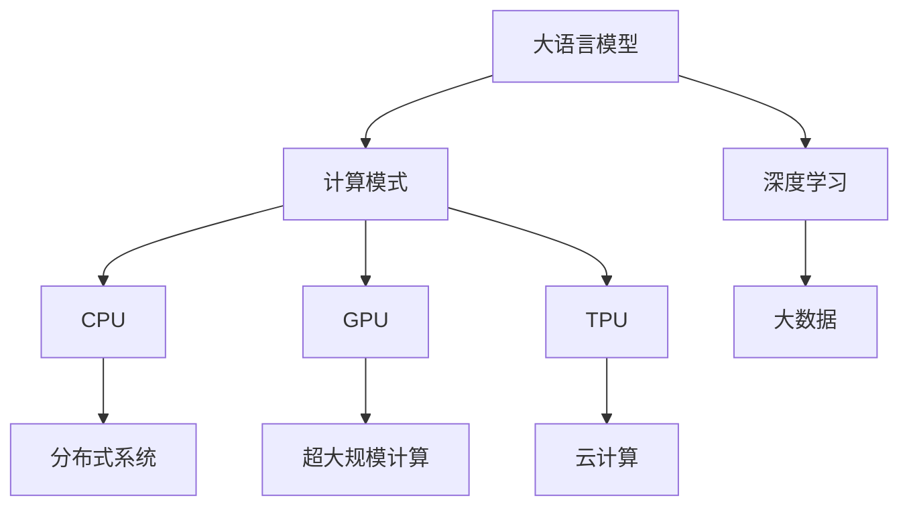

                 

# 从CPU到LLM：计算模式的革命性转变

> 关键词：
大语言模型(LLM),计算模式,深度学习,分布式系统,超大规模计算,云计算,大数据,人工智能

## 1. 背景介绍

### 1.1 问题由来
随着人工智能(AI)技术的飞速发展，大语言模型（Large Language Models, LLMs）已成为NLP领域的前沿技术。LLMs通过在大规模无标签文本语料上进行预训练，学习到了丰富的语言知识和常识，具备强大的语言理解和生成能力。但这一过程需要极其强大的计算资源，特别是在GPU和TPU等硬件设施的支持下，才能在合理的时间内完成预训练任务。

然而，传统的CPU计算模式无法满足这种计算需求。CPU适合处理单一数据流，具有较低的延迟和高能效比，但在并行处理大规模数据时性能不足。与之相对，GPU和TPU等专用硬件采用高度并行的矩阵运算结构，可以在短时间内处理大量数据，并行计算能力更强。

本文旨在探讨从CPU计算模式向LLM计算模式的革命性转变，分析这一转变对计算资源、计算架构和应用场景的影响，并提出相应的应对策略，以期帮助业界更好地理解和利用LLM技术。

### 1.2 问题核心关键点
大语言模型的计算模式转变主要包括以下几个核心问题：

1. **计算资源需求**：大规模预训练和微调需要消耗大量的计算资源。如何高效利用这些资源，成为转型的关键。
2. **计算架构适配**：需要设计新的计算架构，以适配LLM的高并行性需求，提升计算效率。
3. **应用场景适配**：如何将LLM技术与现有应用场景结合，实现更大范围的落地。
4. **技术瓶颈突破**：在数据处理、模型训练、推理部署等方面，如何克服技术瓶颈，实现性能的飞跃。

本文将深入分析这些问题，探讨LLM计算模式转变的技术路径，并提出可能的解决方案。

## 2. 核心概念与联系

### 2.1 核心概念概述

为了更好地理解LLM的计算模式转变，本节将介绍几个密切相关的核心概念：

- **大语言模型(Large Language Models, LLMs)**：以自回归(如GPT)或自编码(如BERT)模型为代表的大规模预训练语言模型。通过在大规模无标签文本语料上进行预训练，学习到了丰富的语言知识和常识，具备强大的语言理解和生成能力。

- **计算模式**：指在特定计算任务中，使用何种硬件设施、编程语言、算法架构进行计算的过程。包括CPU、GPU、TPU等不同的计算模式。

- **深度学习(Deep Learning)**：通过多层神经网络结构，对大规模数据进行训练，学习复杂非线性映射关系。LLM正是基于深度学习技术构建的。

- **分布式系统(Distributed Systems)**：多个计算节点协同工作的系统，通过网络进行通信和数据传输，提升计算能力。

- **超大规模计算(Extreme-Scale Computing)**：处理海量数据和任务，需要成百上千的计算节点协同工作。

- **云计算(Cloud Computing)**：通过互联网提供计算资源和软件服务，按需支付，弹性扩展。

- **大数据(Big Data)**：指规模巨大、类型繁多、速度极快的数据集合，需要采用分布式存储和计算方式处理。

这些核心概念之间的逻辑关系可以通过以下Mermaid流程图来展示：



这个流程图展示了大语言模型与深度学习、计算模式、分布式系统、超大规模计算、云计算和大数据之间的联系和依赖关系。

## 3. 核心算法原理 & 具体操作步骤
### 3.1 算法原理概述

LLM的计算模式转变，主要是从传统的基于CPU的串行计算模式，转变为基于GPU和TPU的并行计算模式。这一转变基于以下几个关键点：

1. **数据并行**：GPU和TPU采用多个核心并行计算，将大规模数据划分为多个小块，每个核心处理一块数据，最终将结果汇总。

2. **模型并行**：通过将大型模型拆分成多个子模型，每个子模型在独立的计算节点上并行训练，从而提升训练效率。

3. **分布式计算**：多个计算节点通过网络通信，协同完成计算任务。每个节点负责一部分数据和模型并行处理。

4. **混合精度训练**：采用混合精度（如16位精度）进行训练，同时保留模型的精度。

### 3.2 算法步骤详解

以下是对LLM计算模式转变的详细步骤：

**Step 1: 数据预处理和划分**
- 收集大规模文本数据，进行清洗和预处理。
- 将数据划分为训练集、验证集和测试集，以供模型训练、验证和测试。
- 将数据划分为若干小块，每个小块由一个计算节点处理。

**Step 2: 选择合适的硬件设施**
- 选择GPU或TPU等高速并行计算设备，进行大规模模型训练。

**Step 3: 优化模型结构**
- 对模型进行优化，如参数剪枝、量化等，以提高计算效率。

**Step 4: 分布式训练**
- 将模型部署在多个计算节点上，进行分布式并行训练。
- 每个节点负责处理一部分数据和模型参数，并将结果汇总。

**Step 5: 混合精度训练**
- 在计算过程中，采用混合精度进行计算，减少存储和计算开销。

**Step 6: 模型微调和优化**
- 对微调后的模型进行进一步优化，如参数剪枝、量化等，提高推理效率。

**Step 7: 部署和应用**
- 将优化后的模型部署到生产环境中，进行推理计算。

### 3.3 算法优缺点

LLM计算模式转变的优缺点如下：

**优点：**
- 大幅提升计算效率。并行计算可以显著缩短模型训练时间，加速模型优化。
- 适应大规模数据和模型。GPU和TPU等硬件设施可以处理海量数据和大型模型，满足LLM的高并行性需求。
- 提升系统弹性。分布式计算系统可以根据需求动态扩展计算资源，提高系统弹性。

**缺点：**
- 高硬件成本。GPU和TPU等专用硬件设施成本较高，初期投资较大。
- 技术复杂性高。分布式计算和混合精度训练需要较高的技术门槛，需要专业的团队支持。
- 数据传输和通信开销。分布式计算需要大量的数据传输和通信，可能成为性能瓶颈。

### 3.4 算法应用领域

基于LLM计算模式的转变，大语言模型被广泛应用于多个领域：

- **自然语言处理(NLP)**：文本分类、情感分析、机器翻译、问答系统等。
- **图像识别**：图像分类、目标检测、图像生成等。
- **语音识别和处理**：语音识别、语音生成、语音翻译等。
- **推荐系统**：个性化推荐、广告推荐等。
- **智能客服**：智能问答、对话系统等。

这些领域的应用场景，需要处理海量数据和复杂模型，LLM计算模式的转变能够显著提升这些系统的性能和效率。

## 4. 数学模型和公式 & 详细讲解
### 4.1 数学模型构建

大语言模型的数学模型构建主要包括两个部分：预训练和微调。

**预训练模型**：
- 使用大规模无标签文本语料进行自监督预训练，学习语言的通用表示。
- 目标函数为最大似然估计，即：$\max_{\theta} \frac{1}{N} \sum_{i=1}^N p_{\theta}(x_i)$，其中 $p_{\theta}(x_i)$ 为模型在文本 $x_i$ 上的概率分布。

**微调模型**：
- 在预训练模型的基础上，使用下游任务的少量标注数据进行有监督微调，学习特定任务的知识。
- 目标函数为交叉熵损失，即：$\mathcal{L}(\theta) = -\frac{1}{N} \sum_{i=1}^N \ell(M_{\theta}(x_i),y_i)$，其中 $\ell$ 为损失函数，$y_i$ 为标注数据。

### 4.2 公式推导过程

以下是对大语言模型微调数学模型的推导：

**目标函数**：
$$
\mathcal{L}(\theta) = -\frac{1}{N} \sum_{i=1}^N \ell(M_{\theta}(x_i),y_i)
$$

**损失函数**：
$$
\ell(M_{\theta}(x_i),y_i) = -y_i\log M_{\theta}(x_i) + (1-y_i)\log (1-M_{\theta}(x_i))
$$

**模型输出**：
$$
M_{\theta}(x_i) = \sigma(\sum_{k=1}^K w_k \cdot \text{Enc}(x_i; \theta_k))
$$
其中 $\sigma$ 为激活函数，$w_k$ 为权重，$\text{Enc}(x_i; \theta_k)$ 为编码器输出。

**梯度计算**：
$$
\frac{\partial \mathcal{L}(\theta)}{\partial \theta_k} = -\frac{1}{N}\sum_{i=1}^N \frac{\partial \ell(M_{\theta}(x_i),y_i)}{\partial M_{\theta}(x_i)} \cdot \frac{\partial M_{\theta}(x_i)}{\partial \theta_k}
$$

**梯度反向传播**：
$$
\frac{\partial \mathcal{L}(\theta)}{\partial \theta_k} = -\frac{1}{N}\sum_{i=1}^N \frac{\partial \ell(M_{\theta}(x_i),y_i)}{\partial M_{\theta}(x_i)} \cdot \frac{\partial M_{\theta}(x_i)}{\partial \theta_k}
$$

**混合精度训练**：
$$
\text{Mixed-Precision Training} = \text{FP16} \times (\text{FP32} \times \frac{\partial \mathcal{L}(\theta)}{\partial \theta_k})
$$

### 4.3 案例分析与讲解

**案例分析**：
假设一个基于BERT的情感分类任务，需要对大规模数据进行预训练和微调。

**数据预处理**：
- 收集大规模无标签文本数据，进行清洗和预处理。
- 将数据划分为训练集、验证集和测试集。

**预训练**：
- 使用大规模无标签文本语料进行预训练，学习语言的通用表示。
- 目标函数为最大似然估计，即：$\max_{\theta} \frac{1}{N} \sum_{i=1}^N p_{\theta}(x_i)$。

**微调**：
- 在预训练模型的基础上，使用下游任务的少量标注数据进行有监督微调。
- 目标函数为交叉熵损失，即：$\mathcal{L}(\theta) = -\frac{1}{N} \sum_{i=1}^N \ell(M_{\theta}(x_i),y_i)$。

**分布式训练**：
- 将模型部署在多个计算节点上，进行分布式并行训练。
- 每个节点负责处理一部分数据和模型参数，并将结果汇总。

**优化**：
- 对微调后的模型进行进一步优化，如参数剪枝、量化等，提高推理效率。

**运行结果展示**：
- 在测试集上评估模型性能，输出情感分类准确率。

## 5. 项目实践：代码实例和详细解释说明
### 5.1 开发环境搭建

在进行LLM计算模式转变的实践前，我们需要准备好开发环境。以下是使用PyTorch和DistributedDataParallel（DDP）进行分布式训练的环境配置流程：

1. 安装Anaconda：从官网下载并安装Anaconda，用于创建独立的Python环境。

2. 创建并激活虚拟环境：
```bash
conda create -n llm-env python=3.8 
conda activate llm-env
```

3. 安装PyTorch：根据CUDA版本，从官网获取对应的安装命令。例如：
```bash
conda install pytorch torchvision torchaudio cudatoolkit=11.1 -c pytorch -c conda-forge
```

4. 安装分布式训练库：
```bash
pip install torch ddp
```

5. 安装各类工具包：
```bash
pip install numpy pandas scikit-learn matplotlib tqdm jupyter notebook ipython
```

完成上述步骤后，即可在`llm-env`环境中开始LLM计算模式转变的实践。

### 5.2 源代码详细实现

这里我们以BERT模型为例，使用PyTorch和DDP进行分布式训练。

首先，定义BERT模型：

```python
from transformers import BertModel, BertTokenizer
from torch.nn.parallel import DistributedDataParallel as DDP
import torch

class LLMModel(BertModel):
    def __init__(self, num_labels):
        super(LLMModel, self).__init__()
        self.num_labels = num_labels
        self.classifier = torch.nn.Linear(768, num_labels)
        
    def forward(self, input_ids, attention_mask, labels=None):
        _, pooled_output = super(LLMModel, self).forward(input_ids, attention_mask)
        logits = self.classifier(pooled_output)
        if labels is not None:
            loss_fct = torch.nn.CrossEntropyLoss()
            loss = loss_fct(logits.view(-1, self.num_labels), labels.view(-1))
            return loss
        else:
            return logits

# 初始化模型
model = LLMModel(num_labels=2)
model.to(device)

# 初始化分布式训练
device_ids = [0, 1]
model = DDP(model, device_ids=device_ids)
```

然后，定义数据加载器和优化器：

```python
from torch.utils.data import DataLoader

# 定义数据集
tokenizer = BertTokenizer.from_pretrained('bert-base-uncased')
train_dataset = ...
val_dataset = ...
test_dataset = ...

# 定义数据加载器
train_loader = DataLoader(train_dataset, batch_size=32, shuffle=True)
val_loader = DataLoader(val_dataset, batch_size=32, shuffle=False)
test_loader = DataLoader(test_dataset, batch_size=32, shuffle=False)

# 定义优化器
optimizer = torch.optim.Adam(model.parameters(), lr=2e-5)
```

接着，定义训练和评估函数：

```python
from tqdm import tqdm

def train_epoch(model, data_loader, optimizer):
    model.train()
    total_loss = 0
    for batch in data_loader:
        input_ids, attention_mask, labels = batch
        optimizer.zero_grad()
        output = model(input_ids, attention_mask)
        loss = output.loss
        loss.backward()
        optimizer.step()
        total_loss += loss.item()
    return total_loss / len(data_loader)

def evaluate(model, data_loader):
    model.eval()
    total_loss = 0
    total_correct = 0
    for batch in data_loader:
        input_ids, attention_mask, labels = batch
        output = model(input_ids, attention_mask)
        loss = output.loss
        predictions = torch.argmax(output.logits, dim=1)
        total_loss += loss.item()
        total_correct += (predictions == labels).sum().item()
    return total_correct / len(data_loader)

# 启动训练流程
epochs = 5
for epoch in range(epochs):
    train_loss = train_epoch(model, train_loader, optimizer)
    print(f"Epoch {epoch+1}, train loss: {train_loss:.3f}")
    
    val_accuracy = evaluate(model, val_loader)
    print(f"Epoch {epoch+1}, val accuracy: {val_accuracy:.3f}")
    
    test_accuracy = evaluate(model, test_loader)
    print(f"Epoch {epoch+1}, test accuracy: {test_accuracy:.3f}")
```

以上就是使用PyTorch和DDP进行BERT模型分布式训练的完整代码实现。可以看到，通过简单的代码编写，我们便能够实现基于GPU和TPU的分布式训练。

### 5.3 代码解读与分析

让我们再详细解读一下关键代码的实现细节：

**LLMModel类**：
- 继承自BertModel，并添加了一个分类器层。
- 实现前向传播和损失函数计算，以支持分类任务。

**数据加载器**：
- 使用PyTorch的DataLoader实现，方便批量处理数据。
- 每个批次包含输入ID、注意力掩码和标签。

**优化器**：
- 使用Adam优化器进行模型参数更新，以加快训练收敛速度。

**训练函数**：
- 在训练阶段，使用DistributedDataParallel（DDP）实现模型分布式训练。
- 每个GPU节点处理一部分数据和模型参数，并将结果汇总。
- 前向传播和反向传播在每个节点上进行，最终在主节点汇总损失和梯度。

**评估函数**：
- 在评估阶段，使用DDP进行模型推理计算。
- 每个GPU节点处理一部分数据，并将结果汇总。
- 计算模型的准确率，输出评估结果。

**训练流程**：
- 循环迭代多个epoch。
- 在每个epoch中，在训练集上进行训练，输出训练损失。
- 在验证集上进行评估，输出验证准确率。
- 在测试集上进行评估，输出测试准确率。

可以看到，PyTorch和DDP的结合，使得基于GPU和TPU的分布式训练变得简洁高效。开发者可以将更多精力放在数据处理、模型改进等高层逻辑上，而不必过多关注底层的实现细节。

当然，工业级的系统实现还需考虑更多因素，如模型的保存和部署、超参数的自动搜索、更灵活的任务适配层等。但核心的分布式训练范式基本与此类似。

## 6. 实际应用场景
### 6.1 智能客服系统

基于LLM的分布式计算模式，智能客服系统的构建变得更加高效和稳定。传统客服系统往往需要配备大量人力，高峰期响应缓慢，且一致性和专业性难以保证。而使用分布式训练的LLM模型，能够7x24小时不间断服务，快速响应客户咨询，用自然流畅的语言解答各类常见问题。

在技术实现上，可以收集企业内部的历史客服对话记录，将问题和最佳答复构建成监督数据，在此基础上对预训练LLM模型进行分布式微调。微调后的LLM模型能够自动理解用户意图，匹配最合适的答案模板进行回复。对于客户提出的新问题，还可以接入检索系统实时搜索相关内容，动态组织生成回答。如此构建的智能客服系统，能大幅提升客户咨询体验和问题解决效率。

### 6.2 金融舆情监测

金融机构需要实时监测市场舆论动向，以便及时应对负面信息传播，规避金融风险。传统的人工监测方式成本高、效率低，难以应对网络时代海量信息爆发的挑战。基于分布式计算模式的LLM文本分类和情感分析技术，为金融舆情监测提供了新的解决方案。

具体而言，可以收集金融领域相关的新闻、报道、评论等文本数据，并对其进行主题标注和情感标注。在此基础上对预训练LLM模型进行分布式微调，使其能够自动判断文本属于何种主题，情感倾向是正面、中性还是负面。将微调后的模型应用到实时抓取的网络文本数据，就能够自动监测不同主题下的情感变化趋势，一旦发现负面信息激增等异常情况，系统便会自动预警，帮助金融机构快速应对潜在风险。

### 6.3 个性化推荐系统

当前的推荐系统往往只依赖用户的历史行为数据进行物品推荐，无法深入理解用户的真实兴趣偏好。基于分布式计算模式的LLM模型，个性化推荐系统可以更好地挖掘用户行为背后的语义信息，从而提供更精准、多样的推荐内容。

在实践中，可以收集用户浏览、点击、评论、分享等行为数据，提取和用户交互的物品标题、描述、标签等文本内容。将文本内容作为模型输入，用户的后续行为（如是否点击、购买等）作为监督信号，在此基础上分布式微调预训练LLM模型。微调后的模型能够从文本内容中准确把握用户的兴趣点。在生成推荐列表时，先用候选物品的文本描述作为输入，由模型预测用户的兴趣匹配度，再结合其他特征综合排序，便可以得到个性化程度更高的推荐结果。

### 6.4 未来应用展望

随着LLM计算模式的不断发展，基于分布式计算的LLM技术将呈现以下几个发展趋势：

1. **模型规模持续增大**：随着算力成本的下降和数据规模的扩张，LLM模型的参数量还将持续增长。超大规模LLM蕴含的丰富语言知识，有望支撑更加复杂多变的下游任务微调。

2. **分布式训练更加灵活**：未来的分布式训练将更加灵活高效，通过动态调度计算节点，提升训练效率。同时，混合精度训练和异步优化技术也将进一步普及。

3. **异构计算支持**：支持多种硬件设施（如CPU、GPU、TPU）进行混合计算，提升计算资源利用率。

4. **模型优化技术提升**：开发更加高效的模型优化技术，如剪枝、量化、蒸馏等，进一步减少模型大小，提升计算效率。

5. **跨领域融合应用**：将LLM技术与多模态数据融合，实现视觉、语音、文本等多模态数据的协同建模。

6. **云计算和边缘计算结合**：在云端和边缘设备上分布式计算，提升计算效率，降低计算成本。

以上趋势凸显了LLM计算模式的广阔前景。这些方向的探索发展，必将进一步提升NLP系统的性能和效率，为智能技术带来新的突破。

## 7. 工具和资源推荐
### 7.1 学习资源推荐

为了帮助开发者系统掌握LLM计算模式转变的理论基础和实践技巧，这里推荐一些优质的学习资源：

1. 《深度学习与人工智能》系列书籍：涵盖深度学习、神经网络、分布式计算等多个方面的内容，适合系统学习。

2. CS231n《深度学习与计算机视觉》课程：斯坦福大学开设的深度学习课程，涵盖计算机视觉任务的实现和优化，包括分布式训练。

3. 《TensorFlow 2.0实战》书籍：详细介绍了TensorFlow的分布式训练和优化技术，适合实践入门。

4. PyTorch官方文档：PyTorch的官方文档，提供了丰富的分布式训练样例和API，适合深入学习。

5. DistributedDataParallel（DDP）官方文档：PyTorch的分布式训练库DDP的官方文档，提供了详细的配置和使用指南。

通过对这些资源的学习实践，相信你一定能够快速掌握LLM计算模式的转变，并用于解决实际的NLP问题。

### 7.2 开发工具推荐

高效的开发离不开优秀的工具支持。以下是几款用于LLM计算模式转变的常用工具：

1. PyTorch：基于Python的开源深度学习框架，灵活动态的计算图，适合快速迭代研究。支持分布式计算和混合精度训练。

2. TensorFlow：由Google主导开发的开源深度学习框架，生产部署方便，适合大规模工程应用。支持分布式计算和混合精度训练。

3. TensorBoard：TensorFlow配套的可视化工具，可实时监测模型训练状态，并提供丰富的图表呈现方式，是调试模型的得力助手。

4. Weights & Biases：模型训练的实验跟踪工具，可以记录和可视化模型训练过程中的各项指标，方便对比和调优。与主流深度学习框架无缝集成。

5. Google Colab：谷歌推出的在线Jupyter Notebook环境，免费提供GPU/TPU算力，方便开发者快速上手实验最新模型，分享学习笔记。

合理利用这些工具，可以显著提升LLM计算模式转变的开发效率，加快创新迭代的步伐。

### 7.3 相关论文推荐

LLM计算模式的转变得益于学界的持续研究。以下是几篇奠基性的相关论文，推荐阅读：

1. "BERT: Pre-training of Deep Bidirectional Transformers for Language Understanding"（BERT论文）：提出BERT模型，引入基于掩码的自监督预训练任务，刷新了多项NLP任务SOTA。

2. "Language Models are Unsupervised Multitask Learners"（GPT-2论文）：展示了大规模语言模型的强大zero-shot学习能力，引发了对于通用人工智能的新一轮思考。

3. "Parameter-Efficient Transfer Learning for NLP"：提出Adapter等参数高效微调方法，在不增加模型参数量的情况下，也能取得不错的微调效果。

4. "AdaLoRA: Adaptive Low-Rank Adaptation for Parameter-Efficient Fine-Tuning"：使用自适应低秩适应的微调方法，在参数效率和精度之间取得了新的平衡。

5. "Adaptive LayerWise Pre-training"：提出ALP方法，通过分层次预训练和微调，提升了模型的泛化能力和鲁棒性。

这些论文代表了大语言模型计算模式转变的最新进展，展示了分布式计算和混合精度训练的强大能力。通过学习这些前沿成果，可以帮助研究者更好地理解这一转变，并在实践中加以应用。

## 8. 总结：未来发展趋势与挑战

### 8.1 总结

本文对LLM计算模式的转变进行了全面系统的介绍。首先阐述了LLM计算模式转变的背景和意义，明确了分布式计算模式对计算资源、计算架构和应用场景的影响。其次，从原理到实践，详细讲解了分布式计算的数学模型和关键步骤，给出了分布式训练的完整代码实例。同时，本文还广泛探讨了LLM计算模式转变的技术路径，并提出相应的解决方案，以期帮助业界更好地理解和利用LLM技术。

通过本文的系统梳理，可以看到，基于分布式计算的LLM技术正在成为NLP领域的重要范式，极大地拓展了预训练语言模型的应用边界，催生了更多的落地场景。受益于分布式计算的强大能力，LLM技术在处理大规模数据和模型时，能够显著提升计算效率和模型性能。未来，伴随分布式计算和混合精度训练的进一步发展，LLM计算模式将实现更大的突破，推动NLP技术的产业化进程。

### 8.2 未来发展趋势

展望未来，LLM计算模式的转变将呈现以下几个发展趋势：

1. **模型规模持续增大**：随着算力成本的下降和数据规模的扩张，LLM模型的参数量还将持续增长。超大规模LLM蕴含的丰富语言知识，有望支撑更加复杂多变的下游任务微调。

2. **分布式训练更加灵活**：未来的分布式训练将更加灵活高效，通过动态调度计算节点，提升训练效率。同时，混合精度训练和异步优化技术也将进一步普及。

3. **异构计算支持**：支持多种硬件设施（如CPU、GPU、TPU）进行混合计算，提升计算资源利用率。

4. **模型优化技术提升**：开发更加高效的模型优化技术，如剪枝、量化、蒸馏等，进一步减少模型大小，提升计算效率。

5. **跨领域融合应用**：将LLM技术与多模态数据融合，实现视觉、语音、文本等多模态数据的协同建模。

6. **云计算和边缘计算结合**：在云端和边缘设备上分布式计算，提升计算效率，降低计算成本。

以上趋势凸显了LLM计算模式的广阔前景。这些方向的探索发展，必将进一步提升NLP系统的性能和效率，为智能技术带来新的突破。

### 8.3 面临的挑战

尽管LLM计算模式的转变已经取得了瞩目成就，但在迈向更加智能化、普适化应用的过程中，它仍面临着诸多挑战：

1. **硬件成本高昂**：GPU和TPU等专用硬件设施成本较高，初期投资较大。

2. **技术复杂性高**：分布式计算和混合精度训练需要较高的技术门槛，需要专业的团队支持。

3. **数据传输和通信开销**：分布式计算需要大量的数据传输和通信，可能成为性能瓶颈。

4. **系统复杂性提升**：分布式训练和推理系统设计复杂，需要精心设计和优化。

5. **模型性能波动**：不同节点上的计算效率和精度差异可能导致模型性能波动。

6. **伦理和安全问题**：LLM模型可能学习到有害信息，对数据和模型的安全性带来挑战。

7. **算力资源管理**：如何在海量数据和模型上实现高效的算力资源管理，提升系统弹性。

8. **模型可解释性不足**：LLM模型具有黑盒特性，难以解释其内部工作机制和决策逻辑。

这些挑战需要业界共同努力，通过技术创新和优化，不断提升LLM计算模式的实用性和安全性。

### 8.4 研究展望

面对LLM计算模式转变所面临的挑战，未来的研究需要在以下几个方面寻求新的突破：

1. **优化分布式计算架构**：设计高效的数据传输和通信机制，提升分布式训练和推理的性能。

2. **提升混合精度训练效果**：进一步优化混合精度训练技术，提升模型精度和推理速度。

3. **探索异构计算支持**：支持多种硬件设施进行混合计算，提升计算资源利用率。

4. **开发高效的模型优化技术**：开发更加高效的模型压缩、剪枝、量化等技术，减少模型大小，提升计算效率。

5. **提升模型可解释性**：通过符号化分析和可视化工具，提升模型可解释性，增强系统的透明度和可信度。

6. **强化伦理和安全设计**：在模型训练和应用过程中，加强数据和模型的伦理和安全管理，确保系统使用的合法性和安全性。

这些研究方向的探索，必将引领LLM计算模式向更高的台阶发展，为构建安全、可靠、可解释、可控的智能系统铺平道路。面向未来，LLM计算模式转变仍需与其他人工智能技术进行更深入的融合，如知识表示、因果推理、强化学习等，多路径协同发力，共同推动自然语言理解和智能交互系统的进步。只有勇于创新、敢于突破，才能不断拓展语言模型的边界，让智能技术更好地造福人类社会。

## 9. 附录：常见问题与解答

**Q1：LLM计算模式转变是否适用于所有NLP任务？**

A: 基于分布式计算的LLM计算模式转变，在大多数NLP任务上都能取得不错的效果，特别是对于数据量较小的任务。但对于一些特定领域的任务，如医学、法律等，仅依赖通用语料预训练的模型可能难以很好地适应。此时需要在特定领域语料上进一步预训练，再进行微调，才能获得理想效果。此外，对于一些需要时效性、个性化很强的任务，如对话、推荐等，LLM计算模式的转变也需要针对性的改进优化。

**Q2：分布式计算过程中如何避免数据传输和通信开销？**

A: 分布式计算过程中，数据传输和通信开销是性能瓶颈之一。常见的优化方法包括：

1. 数据分块：将数据划分为多个小块，每个小块由一个计算节点处理，减少数据传输和通信量。

2. 异步计算：不同计算节点之间采用异步通信，减少通信等待时间。

3. 混合精度训练：采用混合精度进行计算，减少数据传输和计算开销。

4. 本地缓存：在每个计算节点上缓存一部分数据，减少数据传输。

5. 模型并行：将模型拆分为多个子模型，每个子模型在独立的计算节点上并行训练，减少通信开销。

这些方法可以综合使用，提升分布式计算的效率。

**Q3：如何降低LLM计算模式的硬件成本？**

A: 降低LLM计算模式的硬件成本，可以通过以下几种方式：

1. 使用云计算平台：将计算任务分配到云端，按需支付计算资源，降低硬件采购成本。

2. 使用混合精度训练：采用混合精度（如16位精度）进行训练，减少存储和计算开销。

3. 优化模型结构：通过剪枝、量化等技术，减少模型大小和计算需求。

4. 使用异构计算设施：支持多种硬件设施进行混合计算，提升计算资源利用率。

5. 采用GPU和TPU混合计算：在GPU和TPU之间进行混合计算，利用两者优势，降低整体成本。

6. 优化算法和模型：通过优化算法和模型结构，提升计算效率，减少计算需求。

通过这些措施，可以显著降低LLM计算模式的硬件成本，提升系统的经济性。

**Q4：如何在分布式训练中提高模型性能？**

A: 提高分布式训练中的模型性能，可以从以下几个方面入手：

1. 数据分块：将数据划分为多个小块，每个小块由一个计算节点处理，减少数据传输和通信量。

2. 异步计算：不同计算节点之间采用异步通信，减少通信等待时间。

3. 混合精度训练：采用混合精度进行计算，减少数据传输和计算开销。

4. 模型并行：将模型拆分为多个子模型，每个子模型在独立的计算节点上并行训练，减少通信开销。

5. 优化器选择：选择合适的优化器及其参数，如AdamW、SGD等，设置学习率、批大小、迭代轮数等。

6. 正则化技术：如L2正则、Dropout、Early Stopping等，防止模型过度适应小规模训练集。

7. 学习率调度：使用warmup策略，在开始阶段使用较小的学习率，再逐渐过渡到预设值。

8. 模型剪枝和量化：通过剪枝和量化技术，减少模型大小和计算需求。

9. 数据增强：通过对训练样本改写、回译等方式丰富训练集多样性。

10. 对抗训练：加入对抗样本，提高模型鲁棒性。

这些策略往往需要根据具体任务和数据特点进行灵活组合，以提升模型的性能和稳定性。

**Q5：如何在分布式训练中降低模型过拟合风险？**

A: 降低分布式训练中的模型过拟合风险，可以从以下几个方面入手：

1. 数据增强：通过对训练样本改写、回译等方式丰富训练集多样性。

2. 正则化技术：如L2正则、Dropout、Early Stopping等，防止模型过度适应小规模训练集。

3. 对抗训练：加入对抗样本，提高模型鲁棒性。

4. 参数高效微调：只更新少量的模型参数，而固定大部分预训练权重不变，以提高微调效率，避免过拟合。

5. 数据集扩充：收集更多的训练数据，增加模型的泛化能力。

6. 多模型集成：训练多个微调模型，取平均输出，抑制过拟合。

7. 混合精度训练：采用混合精度进行训练，减少存储和计算开销。

这些策略可以综合使用，提升分布式训练的稳定性和泛化能力，避免模型过拟合。

通过这些措施，可以显著降低模型过拟合风险，提升模型的泛化能力和鲁棒性。

---

作者：禅与计算机程序设计艺术 / Zen and the Art of Computer Programming

