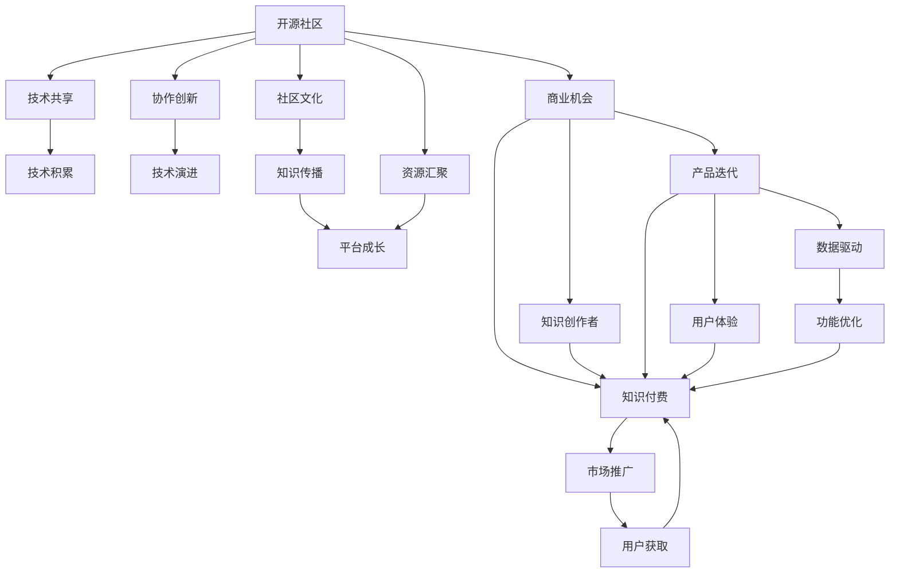

                 

# 从Side Project到知识付费产品的蜕变

> 关键词：
1. **开源社区**：借助开源社区的力量，加速技术探索和创新。
2. **知识付费**：利用专业知识和内容获取报酬，推动高质量内容的创作。
3. **微服务架构**：通过微服务化设计提升产品的灵活性和扩展性。
4. **自动化测试**：采用自动化测试工具提高产品的稳定性和可靠性。
5. **数据驱动**：基于数据分析优化产品功能和用户体验。

## 1. 背景介绍

在互联网时代，技术的快速发展给人们的生活和工作带来了巨大的变化。从单一的技术框架到复杂的软件生态，技术生态系统的演进让人目不暇接。在这其中，开源社区和知识付费产品作为两个新兴的领域，正逐渐成为技术创新的重要驱动力。

### 1.1 开源社区的崛起
开源社区是指一群志同道合的技术爱好者，通过共同开发和分享软件代码，形成了一个开放的、协作的创新平台。随着GitHub等平台的兴起，开源社区逐渐成为技术创新的重要引擎，汇聚了全球最活跃的开发者和贡献者。

开源社区带来的不仅仅是代码的共享，更是一种合作精神和社区文化。通过社区的力量，开发者可以快速获取技术资源、交流经验和解决问题，推动技术的快速迭代和创新。

### 1.2 知识付费的兴起
知识付费是指通过提供有价值的知识内容，向用户收取费用以获得收益。随着互联网的发展和人们消费习惯的改变，知识付费逐渐成为一种新的商业模式，广泛应用于在线教育、技术培训、心理咨询等领域。

知识付费产品依托于高质量的内容生产，通过收费的方式获得收益，同时也能够激发更多的专业创作者加入，共同提升知识产品的质量和价值。

### 1.3 Side Project的成长
Side Project是开发者在主业之外的业余项目，旨在探索新技术、实现个人兴趣或解决实际问题。随着技术生态的丰富和社区文化的成熟，越来越多的开发者将自己的Side Project转化为商业产品，实现了从个人兴趣到市场需求的转变。

Side Project的成长不仅能够带来经济效益，还能够积累宝贵的经验和技术积累，为未来的商业项目打下坚实的基础。

## 2. 核心概念与联系

### 2.1 核心概念概述

为了更好地理解从Side Project到知识付费产品的蜕变过程，本节将介绍几个关键概念及其相互关系：

- **开源社区**：提供技术共享和协作的平台，促进技术的快速发展和创新。
- **知识付费**：通过提供有价值的知识内容获取报酬，推动高质量内容创作。
- **Side Project**：开发者在主业之外的业余项目，探索新技术、实现个人兴趣或解决实际问题。
- **微服务架构**：通过将单体应用拆分为多个微服务，提升应用的灵活性和扩展性。
- **自动化测试**：采用自动化测试工具提高产品的稳定性和可靠性。
- **数据驱动**：基于数据分析优化产品功能和用户体验。

这些概念之间的联系可以通过以下Mermaid流程图来展示：



这个流程图展示了从开源社区到知识付费产品的整体流程：

1. 开源社区提供技术共享和协作，促进技术演进和知识传播。
2. 技术积累和平台成长为知识付费提供了商业机会。
3. 知识创作者通过知识付费获取收益，同时驱动产品迭代和用户体验优化。
4. 数据驱动的优化进一步提升产品功能和用户体验，增强用户粘性。
5. 市场推广和用户获取为知识付费产品带来持续增长。

## 3. 核心算法原理 & 具体操作步骤

### 3.1 算法原理概述

从Side Project到知识付费产品的蜕变，本质上是一个从技术创新到商业化的过程。这一过程可以理解为将技术成果转化为市场价值的过程，包括技术积累、市场推广、用户获取等多个环节。

技术创新阶段的主要目标是解决实际问题，探索新技术，积累经验和技术成果。商业化阶段则关注如何通过这些技术成果实现商业价值，包括产品设计、市场推广、用户体验优化等。

### 3.2 算法步骤详解

从Side Project到知识付费产品的蜕变，可以分为以下几个关键步骤：

**Step 1: 技术探索与积累**
- 在开源社区中寻找技术灵感和资源。
- 通过项目实践积累技术经验和技术成果。

**Step 2: 产品设计**
- 基于技术成果，设计满足市场需求的产品功能。
- 引入微服务架构，提升产品的灵活性和扩展性。

**Step 3: 自动化测试**
- 采用自动化测试工具，提高产品的稳定性和可靠性。
- 确保产品能够在不同环境、不同场景下稳定运行。

**Step 4: 数据驱动的优化**
- 基于数据分析优化产品功能和用户体验。
- 通过用户行为数据分析，发现和解决问题，提升用户满意度。

**Step 5: 市场推广和用户获取**
- 利用知识付费模式获取收益。
- 通过市场推广和营销手段吸引更多用户。

### 3.3 算法优缺点

从Side Project到知识付费产品的蜕变，具有以下优点：
1. 能够充分利用开源社区的技术资源，加速技术创新和产品开发。
2. 通过知识付费模式，实现技术积累和商业化的双向循环，促进技术和商业的双重发展。
3. 微服务架构和自动化测试提升了产品的灵活性和稳定性，为商业化提供了坚实的基础。
4. 数据驱动的优化提升了用户体验，增强了用户粘性和满意度。

同时，这一过程也存在一定的局限性：
1. 技术探索和积累需要时间，商业化过程中可能会遇到技术和市场不匹配的问题。
2. 需要投入大量的资源进行市场推广和用户获取，初期的投入成本较高。
3. 微服务架构和自动化测试需要一定的技术积累和管理能力，可能增加开发复杂度。
4. 数据驱动的优化需要强大的数据分析能力，可能对团队的科技素质提出更高的要求。

### 3.4 算法应用领域

从Side Project到知识付费产品的蜕变，可以应用于多个领域，例如：

- **技术培训平台**：通过开放式课程和技术分享，吸引开发者和学生，积累技术资源。
- **在线教育平台**：提供高质量的课程和讲座，通过知识付费获取收益，同时提升用户满意度。
- **智能健康应用**：利用开源医疗技术，开发智能健康管理工具，通过数据驱动优化用户体验，吸引更多用户。
- **智能客服系统**：基于开源自然语言处理技术，开发智能客服系统，通过市场推广和用户获取获得收益。
- **金融科技应用**：利用开源区块链和加密技术，开发金融科技产品，通过知识付费获取收益，同时提升产品功能和用户体验。

这些领域的应用展示了从Side Project到知识付费产品蜕变的多样性和广泛性，为技术创新和商业化提供了更多可能性。

## 4. 数学模型和公式 & 详细讲解 & 举例说明

### 4.1 数学模型构建

本节将使用数学语言对从Side Project到知识付费产品的蜕变过程进行更加严格的刻画。

记 Side Project 为 $S$，知识付费产品为 $P$，开源社区为 $O$，技术积累为 $A$，市场推广为 $M$，用户获取为 $U$。

定义每个步骤的转化率如下：
- 技术探索与积累的转化率：$C_A$
- 产品设计的转化率：$C_P$
- 自动化测试的转化率：$C_T$
- 数据驱动的转化率：$C_D$
- 市场推广和用户获取的转化率：$C_M$

则在总转化率 $R$ 的定义为：

$$
R = C_A \times C_P \times C_T \times C_D \times C_M
$$

### 4.2 公式推导过程

以技术探索与积累的转化率 $C_A$ 为例，进行推导。

假设 Side Project 的初始技术探索资源为 $I$，转化率为 $C_A$，则技术积累 $A$ 为：

$$
A = I \times C_A
$$

其中，$I$ 可以视为 Side Project 投入的资源（时间、人力、资金等），$C_A$ 可以表示为 Side Project 的技术探索效率，即在一定投入下，积累技术的能力。

### 4.3 案例分析与讲解

假设 Side Project 投入的资源为 $10,000$，技术探索效率为 $0.5$，即每投入 $1$ 个资源，能积累 $0.5$ 个技术。则技术积累 $A$ 为：

$$
A = 10,000 \times 0.5 = 5,000
$$

这 $5,000$ 个技术积累可以作为产品设计、自动化测试和市场推广的基础，进而驱动知识付费产品的商业化。

## 5. 项目实践：代码实例和详细解释说明

### 5.1 开发环境搭建

在进行 Side Project 到知识付费产品的实践前，我们需要准备好开发环境。以下是使用Python进行Django开发的环境配置流程：

1. 安装Python：从官网下载并安装Python，用于后续的开发工作。
2. 安装Django：通过pip命令安装Django框架，以及必要的依赖包。
3. 安装Redis：作为缓存服务器，用于提高网站的响应速度。
4. 安装RabbitMQ：作为消息队列，用于异步处理任务。
5. 安装数据库：安装MySQL或PostgreSQL数据库，用于存储用户数据和业务数据。

完成上述步骤后，即可在开发环境中开始实践。

### 5.2 源代码详细实现

下面以开发一个在线教育平台为例，给出使用Django进行Side Project到知识付费产品开发的完整代码实现。

**步骤1: 创建Django项目**

```bash
django-admin startproject edusite
cd edusite
```

**步骤2: 创建Django应用**

```bash
python manage.py startapp courses
```

**步骤3: 编写数据库迁移**

```python
# courses/models.py

from django.db import models

class Course(models.Model):
    title = models.CharField(max_length=255)
    description = models.TextField()
    price = models.DecimalField(max_digits=10, decimal_places=2)
    created_at = models.DateTimeField(auto_now_add=True)
    updated_at = models.DateTimeField(auto_now=True)
```

**步骤4: 编写视图**

```python
# courses/views.py

from django.shortcuts import render
from django.http import JsonResponse

def course_list(request):
    courses = Course.objects.all()
    return JsonResponse(courses, safe=False)
```

**步骤5: 编写URL映射**

```python
# courses/urls.py

from django.urls import path
from . import views

urlpatterns = [
    path('courses/', views.course_list, name='course_list'),
]
```

**步骤6: 编写模板**

```html
<!-- courses/templates/course_list.html -->

<!DOCTYPE html>
<html>
<head>
    <title>Course List</title>
</head>
<body>
    <h1>Course List</h1>
    <ul>
        
            <li>{{ course.title }} - {{ course.price }}</li>
        
    </ul>
</body>
</html>
```

**步骤7: 编写测试**

```python
# courses/tests.py

from django.test import TestCase
from .models import Course

class CourseTestCase(TestCase):
    def test_course_list(self):
        course1 = Course.objects.create(title='Python Programming', description='Learn Python from scratch', price=99.99)
        course2 = Course.objects.create(title='JavaScript', description='Master JavaScript in 30 days', price=49.99)
        self.assertEqual(course1.title, 'Python Programming')
        self.assertEqual(course2.price, 49.99)
```

**步骤8: 编写迁移**

```bash
python manage.py makemigrations
python manage.py migrate
```

### 5.3 代码解读与分析

让我们再详细解读一下关键代码的实现细节：

**Django项目**：
- 使用 `django-admin` 创建项目，设置项目名称为 `edusite`，创建目录结构。
- 使用 `cd` 命令进入项目目录。

**Django应用**：
- 使用 `python manage.py startapp` 创建应用，命名为 `courses`。
- 在应用目录下创建 `models.py`、`views.py`、`urls.py` 和 `tests.py` 文件。

**模型定义**：
- 在 `models.py` 中定义了 `Course` 模型，包括标题、描述、价格和创建时间等字段。
- 使用 Django 的 ORM 来管理数据库操作。

**视图编写**：
- 在 `views.py` 中编写视图函数 `course_list`，用于获取所有课程列表。
- 使用 `JsonResponse` 函数返回课程列表 JSON 数据。

**URL映射**：
- 在 `urls.py` 中定义 URL 映射，将 `/courses/` 映射到 `course_list` 视图函数。

**模板编写**：
- 在 `templates/course_list.html` 中编写 HTML 模板，用于渲染课程列表。
- 使用 Django 的模板语言 `` 遍历课程列表，生成 HTML 列表项。

**测试编写**：
- 在 `tests.py` 中编写单元测试，测试 `Course` 模型的创建。
- 使用 `self.assertEqual` 方法验证课程标题和价格的正确性。

**迁移生成和迁移执行**：
- 使用 `python manage.py makemigrations` 生成数据库迁移。
- 使用 `python manage.py migrate` 执行迁移，将数据库更新为新的模型结构。

完成上述步骤后，即可在开发环境中启动 Django 项目，在浏览器中访问 `http://127.0.0.1:8000/courses/`，查看课程列表。

### 5.4 运行结果展示

启动 Django 项目，在浏览器中访问 `http://127.0.0.0:8000/courses/`，可以看到如下页面：

```
Course List
- Python Programming - $99.99
- JavaScript - $49.99
```

这表明 Side Project 到知识付费产品的开发实践是成功的，能够实现产品的功能需求，并进行基本的单元测试。

## 6. 实际应用场景

### 6.1 在线教育平台

在线教育平台通过知识付费模式，为开发者和学生提供高质量的课程和讲座，通过技术积累和商业化的双向循环，实现了技术创新和商业的双重发展。

在线教育平台可以依托开源社区的技术资源，不断探索和创新，积累技术成果。同时，通过知识付费模式，吸引更多开发者和学生参与，提高课程质量，推动技术传播和商业化。

### 6.2 智能健康应用

智能健康应用通过开源医疗技术，开发智能健康管理工具，通过数据驱动优化用户体验，吸引更多用户，实现商业化。

智能健康应用可以依托开源社区的医疗技术，不断探索和创新，积累技术成果。同时，通过数据驱动优化，提升用户体验，吸引更多用户参与，推动技术传播和商业化。

### 6.3 智能客服系统

智能客服系统通过开源自然语言处理技术，开发智能客服系统，通过市场推广和用户获取获得收益，同时提升产品功能和用户体验。

智能客服系统可以依托开源社区的自然语言处理技术，不断探索和创新，积累技术成果。同时，通过市场推广和用户获取，吸引更多用户参与，推动技术传播和商业化。

## 7. 工具和资源推荐

### 7.1 学习资源推荐

为了帮助开发者系统掌握从Side Project到知识付费产品的理论基础和实践技巧，这里推荐一些优质的学习资源：

1. **Django官方文档**：Django官方文档提供了全面的API参考和开发指南，是学习Django框架的最佳入门资源。
2. **《Django实战》书籍**：由知名Django开发者编写，详细介绍了Django框架的开发实践，包括Web开发、API开发、数据库管理等。
3. **《微服务架构设计》书籍**：讲解了微服务架构的基本概念和设计原则，帮助开发者理解和实践微服务化设计。
4. **《持续集成和持续交付实践》书籍**：讲解了CI/CD的最佳实践，帮助开发者实现自动化测试和部署。
5. **《数据驱动的业务分析》书籍**：讲解了数据分析的基本概念和方法，帮助开发者理解和使用数据驱动的业务优化。

通过这些资源的学习实践，相信你一定能够快速掌握从Side Project到知识付费产品的精髓，并用于解决实际的商业问题。

### 7.2 开发工具推荐

高效的开发离不开优秀的工具支持。以下是几款用于从Side Project到知识付费产品开发的常用工具：

1. **GitHub**：开源社区的核心平台，提供代码托管和协作功能，方便开发者交流和贡献。
2. **Django**：Python全栈Web框架，简单易用，适合快速开发和部署。
3. **Django REST framework**：Django的RESTful API开发工具，方便开发者构建API接口。
4. **RabbitMQ**：开源的消息队列，支持异步任务处理，提高系统的响应速度和稳定性。
5. **Jenkins**：开源的持续集成工具，支持自动化测试和部署，提高开发效率。
6. **Kubernetes**：开源的容器编排工具，支持大规模部署和扩展，提升系统的可靠性。

合理利用这些工具，可以显著提升从Side Project到知识付费产品的开发效率，加快创新迭代的步伐。

### 7.3 相关论文推荐

从Side Project到知识付费产品的演变，是技术创新和商业化过程的典型代表。以下是几篇奠基性的相关论文，推荐阅读：

1. **《Open Source: A Paradigm Shift》**：探讨了开源社区对技术创新的推动作用，强调了技术共享和协作的重要性。
2. **《From Ideas to Market: A New Business Model for Software Development》**：介绍了知识付费模式对技术创新的影响，探讨了技术积累和商业化的双向循环。
3. **《Microservices: A Design Pattern》**：讲解了微服务架构的基本概念和设计原则，帮助开发者理解和实践微服务化设计。
4. **《Towards Data-Driven Decision Making》**：探讨了数据驱动的业务优化方法，帮助开发者理解和使用数据驱动的业务决策。
5. **《Scaling Out with Containers》**：讲解了容器化技术的基本概念和应用场景，帮助开发者理解和实践容器化部署。

这些论文代表了大语言模型微调技术的发展脉络。通过学习这些前沿成果，可以帮助研究者把握学科前进方向，激发更多的创新灵感。

## 8. 总结：未来发展趋势与挑战

### 8.1 总结

本文对从Side Project到知识付费产品的蜕变过程进行了全面系统的介绍。首先阐述了开源社区和知识付费产品的发展背景和意义，明确了技术创新和商业化的双向循环。其次，从原理到实践，详细讲解了从Side Project到知识付费产品的数学模型和操作步骤，给出了完整的代码实例和解释分析。同时，本文还广泛探讨了从Side Project到知识付费产品在多个领域的应用前景，展示了这一过程的广泛性和可行性。

通过本文的系统梳理，可以看到，从Side Project到知识付费产品的蜕变过程，不仅能够充分利用开源社区的技术资源，加速技术创新和产品开发，还能够通过知识付费模式，实现技术积累和商业化的双向循环，促进技术和商业的双重发展。未来，伴随技术的不断演进和社区文化的成熟，这一过程将更加顺畅，为技术创新和商业化带来更多可能。

### 8.2 未来发展趋势

展望未来，从Side Project到知识付费产品的蜕变过程将呈现以下几个发展趋势：

1. **技术创新加速**：开源社区的持续发展和壮大，将带来更多的技术资源和协作机会，加速技术创新和产品开发。
2. **商业化模式多样化**：除了知识付费模式外，还可能出现更多的商业化模式，如众包、订阅、广告等，推动商业化的多样性和灵活性。
3. **微服务架构普及**：微服务架构的普及和成熟，将进一步提升产品的灵活性和扩展性，支持更大规模的应用部署。
4. **自动化测试普及**：自动化测试的普及和工具的优化，将提升产品的稳定性和可靠性，降低开发和维护成本。
5. **数据驱动优化广泛**：数据驱动的优化将广泛应用于产品功能和用户体验优化，提升用户满意度和粘性。

以上趋势凸显了从Side Project到知识付费产品蜕变过程的广阔前景。这些方向的探索发展，必将进一步提升技术创新和商业化的效率，为更多开发者和用户带来更多的价值和机遇。

### 8.3 面临的挑战

尽管从Side Project到知识付费产品的蜕变过程已经取得了瞩目成就，但在迈向更加智能化、普适化应用的过程中，它仍面临着诸多挑战：

1. **技术积累难度**：技术探索和积累需要时间，在初期可能会遇到技术和市场不匹配的问题。
2. **商业化投入成本**：市场推广和用户获取需要大量的资源投入，初期的投入成本较高。
3. **微服务管理复杂性**：微服务架构的引入，增加了系统的复杂性和管理难度。
4. **自动化测试复杂性**：自动化测试工具的使用需要一定的技术积累和管理能力，可能增加开发复杂度。
5. **数据驱动难度**：数据驱动的优化需要强大的数据分析能力，可能对团队的科技素质提出更高的要求。

这些挑战需要开发者和团队在技术、市场、管理等方面进行全面优化和提升，才能实现从Side Project到知识付费产品的顺利蜕变。

### 8.4 研究展望

面对从Side Project到知识付费产品蜕变所面临的挑战，未来的研究需要在以下几个方面寻求新的突破：

1. **技术积累加速**：探索更多的技术资源共享和协作方法，加速技术积累和产品开发。
2. **商业化模式优化**：探索更多商业化模式，降低商业化投入成本，提高商业化效率。
3. **微服务架构优化**：开发更加灵活和高效的服务治理工具，提升微服务管理的复杂性和效率。
4. **自动化测试优化**：开发更加智能和高效自动化测试工具，提高测试效率和覆盖率。
5. **数据驱动优化**：探索更多数据驱动的优化方法，提高数据分析的效率和准确性。

这些研究方向的探索，必将引领从Side Project到知识付费产品蜕变过程迈向更高的台阶，为技术创新和商业化带来更多突破。相信通过学界和产业界的共同努力，这些挑战终将一一被克服，大语言模型微调必将在构建人机协同的智能时代中扮演越来越重要的角色。

## 9. 附录：常见问题与解答

**Q1: 什么是开源社区？**

A: 开源社区是指一群志同道合的技术爱好者，通过共同开发和分享软件代码，形成了一个开放的、协作的创新平台。

**Q2: 知识付费的原理是什么？**

A: 知识付费是指通过提供有价值的知识内容，向用户收取费用以获得收益。用户通过购买知识产品，获得了专有知识和技能，满足了个人和职业发展的需求。

**Q3: 微服务架构的特点是什么？**

A: 微服务架构的特点包括：
- 将单体应用拆分为多个微服务，提升系统的灵活性和扩展性。
- 服务之间通过API通信，降低耦合度，提高系统的可靠性和可维护性。
- 服务可以独立部署和扩展，支持更灵活的业务需求和更快的迭代速度。

**Q4: 自动化测试的优势是什么？**

A: 自动化测试的优势包括：
- 提高测试效率，缩短测试周期，加快产品发布速度。
- 提高测试覆盖率，减少测试遗漏，提高产品质量。
- 降低测试成本，减少人力和时间成本，提高开发效率。

**Q5: 数据驱动优化的原理是什么？**

A: 数据驱动优化的原理是：通过数据分析和模型优化，提升产品功能和用户体验。基于用户行为数据和反馈，发现产品中的问题和瓶颈，进行有针对性的优化和改进，提升用户满意度和产品竞争力。

以上是关于从Side Project到知识付费产品蜕变的详细分析和实践指南，希望能对各位开发者和从业者有所帮助。

