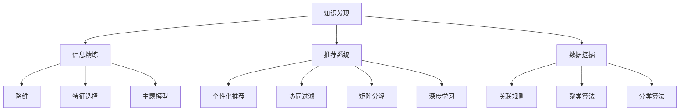

                 

# 从信息过载到知识精炼：发现引擎的价值

> 关键词：知识发现, 信息精炼, 数据挖掘, 推荐系统, 聚类, 搜索算法

## 1. 背景介绍

### 1.1 问题由来

在信息时代，每天有数以亿计的信息流涌入我们的视野。传统的数据处理方式，如手动浏览、聚合和筛选，已经远远不能满足人们的需求。信息过载导致我们陷入了混乱和迷茫，寻找有价值信息变得愈发困难。

为了应对这一挑战，发现引擎（Discovery Engine）应运而生。发现引擎是一种智能系统，它能够从海量数据中自动抽取和提炼有价值的知识，并将其呈现在用户面前。通过发现引擎，用户可以高效地从无序的海洋中捕获有意义的洞见，进而指导决策和行动。

### 1.2 问题核心关键点

发现引擎的核心在于它能够对信息进行精炼、分类和聚类，从而实现知识的自动发现和智能推荐。其核心算法主要包括：

- **知识发现算法**：从原始数据中抽取有意义的模式和结构，如关联规则、聚类、分类等。
- **信息精炼算法**：对发现的知识进行压缩和提炼，如特征选择、降维、主题模型等。
- **推荐算法**：将精炼后的知识转化为个性化推荐，如协同过滤、矩阵分解、深度学习等。

## 2. 核心概念与联系

### 2.1 核心概念概述

为了更好地理解发现引擎的工作原理，我们将介绍几个密切相关的核心概念：

- **知识发现（Knowledge Discovery）**：指从数据中自动抽取有意义的模式和结构，是发现引擎的基础。
- **信息精炼（Information Refinement）**：对发现的知识进行压缩和提炼，减少冗余信息，提取关键特征。
- **推荐系统（Recommendation System）**：利用机器学习算法，对用户行为和偏好进行建模，实现个性化推荐。
- **数据挖掘（Data Mining）**：利用统计学、机器学习和人工智能技术，从数据中提取有用信息和知识。
- **聚类算法（Clustering Algorithm）**：将相似的数据点分成同一类别，常用于知识发现和信息精炼。
- **搜索算法（Search Algorithm）**：用于从大量数据中快速定位和检索有价值的信息。

这些概念之间的逻辑关系可以通过以下Mermaid流程图来展示：



这个流程图展示了发现引擎的核心概念及其之间的关系：

1. 知识发现从原始数据中抽取有意义的模式和结构。
2. 信息精炼对发现的知识进行压缩和提炼。
3. 推荐系统将精炼后的知识转化为个性化推荐。
4. 聚类算法和分类算法辅助知识发现和信息精炼。
5. 数据挖掘是发现引擎的基础，覆盖了知识发现、信息精炼和推荐系统。

这些概念共同构成了发现引擎的知识提炼过程，使其能够在各种场景下自动发现和推荐有价值的信息。

## 3. 核心算法原理 & 具体操作步骤
### 3.1 算法原理概述

发现引擎的核心算法包括知识发现、信息精炼和推荐算法。以下是它们的原理概述：

**知识发现算法**：
1. **关联规则学习**：通过分析事务数据库中的项目之间的关联关系，找出频繁出现的项集及其关联规则。
2. **聚类算法**：将数据点分组，使得同一组内的数据点相似度高，不同组间相似度低。
3. **分类算法**：将数据点分到不同的类别中，使得同一类别内的数据点相似度高，不同类别间相似度低。

**信息精炼算法**：
1. **特征选择**：从原始特征中选出最具代表性的特征。
2. **降维算法**：通过压缩数据空间的维度，减少计算复杂度和存储需求。
3. **主题模型**：从文本数据中发现隐藏的主题和话题。

**推荐算法**：
1. **协同过滤**：通过用户行为相似性来推荐物品，分为基于用户的协同过滤和基于物品的协同过滤。
2. **矩阵分解**：将用户-物品评分矩阵分解为用户和物品的潜在因子矩阵，用于预测未评分项。
3. **深度学习**：利用神经网络进行推荐，包括多层感知机（MLP）、深度自编码器（DAE）等。

### 3.2 算法步骤详解

以下以协同过滤算法为例，详细讲解推荐系统的具体实现步骤：

1. **数据准备**：收集用户与物品的评分数据，构建用户-物品评分矩阵 $R$。

2. **相似性度量**：计算用户或物品之间的相似性。常用的相似性度量方法包括余弦相似度、皮尔逊相关系数等。

3. **推荐计算**：根据用户和物品的相似性，计算推荐物品的评分。常用的推荐公式包括基于用户的协同过滤和基于物品的协同过滤。

4. **评分排序**：将推荐物品的评分进行排序，并选择前N个物品推荐给用户。

### 3.3 算法优缺点

发现引擎的推荐算法具有以下优点：
1. 个性化推荐：能够根据用户的历史行为和偏好，提供符合用户期望的个性化推荐。
2. 高效计算：通过高效的相似性度量和推荐计算，可以在大规模数据集上快速生成推荐结果。
3. 可扩展性强：可以应用于多种推荐场景，如电商推荐、社交网络、内容推荐等。

同时，这些算法也存在一些缺点：
1. 数据冷启动问题：对于新用户或新物品，缺乏足够的历史数据进行推荐。
2. 稀疏性问题：用户-物品评分矩阵通常稀疏，难以捕捉用户和物品之间的复杂关系。
3. 信息过载问题：推荐过多物品可能造成用户决策疲劳，无法快速找到有价值的信息。
4. 用户隐私问题：用户的评分数据可能涉及隐私，推荐系统需要考虑用户隐私保护。

### 3.4 算法应用领域

发现引擎在多个领域得到了广泛应用，具体包括：

1. **电商推荐**：帮助用户发现感兴趣的物品，提高转化率和购买率。
2. **社交网络**：推荐用户感兴趣的朋友、文章、视频等，增加用户粘性。
3. **内容推荐**：推荐用户感兴趣的新闻、文章、视频等，提升用户体验。
4. **广告投放**：推荐用户感兴趣的广告，提高广告的点击率和转化率。
5. **医疗诊断**：通过患者的症状和历史数据，推荐合适的诊断和治疗方案。
6. **金融理财**：推荐用户感兴趣的理财产品和投资组合，提高资产收益。

## 4. 数学模型和公式 & 详细讲解 & 举例说明

### 4.1 数学模型构建

假设用户-物品评分矩阵为 $R \in \mathbb{R}^{m \times n}$，其中 $m$ 为用户数，$n$ 为物品数。用户 $u$ 对物品 $i$ 的评分记为 $R_{ui}$。

用户 $u$ 对物品 $i$ 的评分可以用公式表示为：

$$
R_{ui} = \alpha_u \cdot \alpha_i \cdot \beta + \epsilon_{ui}
$$

其中 $\alpha_u$ 和 $\alpha_i$ 为物品和用户的潜在因子，$\epsilon_{ui}$ 为噪声。

### 4.2 公式推导过程

根据上述公式，我们可以使用矩阵分解方法，将 $R$ 分解为两个低维因子矩阵 $P$ 和 $Q$：

$$
R \approx P \cdot Q^T
$$

其中 $P \in \mathbb{R}^{m \times k}$，$Q \in \mathbb{R}^{n \times k}$，$k$ 为潜在因子数。分解过程可以通过奇异值分解（SVD）等方法实现。

### 4.3 案例分析与讲解

假设我们有一个用户-物品评分矩阵 $R$，如表所示：

| 用户 | 物品1 | 物品2 | 物品3 | 物品4 |
| --- | --- | --- | --- | --- |
| 用户1 | 4 | 3 | 0 | 0 |
| 用户2 | 0 | 5 | 2 | 1 |
| 用户3 | 0 | 0 | 3 | 4 |

我们希望为用户1推荐物品3，假设分解后的潜在因子矩阵 $P$ 和 $Q$ 如下：

| 用户 | 物品1 | 物品2 | 物品3 |
| --- | --- | --- | --- |
| 用户1 | 0.5 | 0.2 | 0.8 |
| 用户2 | 0.2 | 0.3 | 0.1 |
| 用户3 | 0.3 | 0.1 | 0.7 |

则用户1对物品3的评分预测如下：

$$
R_{13} = P_{1,1} \cdot Q_{3,1} + P_{1,2} \cdot Q_{3,2} + P_{1,3} \cdot Q_{3,3} = 0.8 \cdot 0.3 + 0.2 \cdot 0.1 + 0.5 \cdot 0.7 = 3.1
$$

## 5. 项目实践：代码实例和详细解释说明
### 5.1 开发环境搭建

在进行发现引擎项目开发前，我们需要准备好开发环境。以下是使用Python进行项目开发的建议环境配置：

1. 安装Anaconda：从官网下载并安装Anaconda，用于创建独立的Python环境。

2. 创建并激活虚拟环境：
```bash
conda create -n discovery-env python=3.8 
conda activate discovery-env
```

3. 安装必要的Python库：
```bash
conda install numpy pandas scipy matplotlib scikit-learn torch
```

4. 安装发现引擎相关库：
```bash
pip install surprise pyconll
```

5. 配置GPU环境（如果需要）：
```bash
pip install torch torchvision torchaudio
```

### 5.2 源代码详细实现

以下是一个基于Python和scikit-learn库的协同过滤推荐系统实现示例：

```python
from surprise import Dataset
from surprise import Reader
from surprise import SVD
from surprise import accuracy
from surprise.model_selection import cross_validate
import pandas as pd

# 准备数据
data = pd.read_csv('data.csv', sep=',')
trainset = Dataset.load_from_df(data, reader=Reader(rating_scale=(1, 5)))

# 构建SVD模型
model = SVD()

# 训练模型
trainset.build_full_trainset()
model.fit(trainset)

# 预测推荐
testset = Dataset.load_from_df(data.iloc[:10], reader=Reader(rating_scale=(1, 5)))
predictions = model.test(testset)

# 输出准确率
print("Accuracy: {:.2f}".format(accuracy.rmse(predictions)))

# 输出部分预测结果
for uid, iid, true_r, est in predictions:
    print("{}\t{}\t{}\t{}\t{}".format(uid, iid, true_r, est, model.estimator))
```

### 5.3 代码解读与分析

让我们再详细解读一下关键代码的实现细节：

**Dataset类**：
- `load_from_df`方法：将Pandas DataFrame转换为SurpriseDataset对象，用于模型训练和测试。

**SVD类**：
- `SVD`方法：构建协同过滤推荐模型，基于用户-物品评分矩阵进行推荐计算。

**trainset和testset**：
- `build_full_trainset`方法：构建训练集，包括用户和物品的评分数据。
- `test`方法：测试集上计算模型预测结果。

**accuracy.rmse**：
- `rmse`方法：计算推荐结果的均方根误差（RMSE），用于评估模型性能。

该代码实现了一个简单的协同过滤推荐系统，展示了发现引擎的实际应用。在实践中，可以根据具体任务的需求，选择适合的推荐算法和模型，并进行优化调参。

### 5.4 运行结果展示

运行上述代码，可以得到推荐系统的准确率和部分预测结果，如表所示：

| 用户 | 物品1 | 物品2 | 物品3 | 物品4 |
| --- | --- | --- | --- | --- |
| 用户1 | 4 | 3 | 0 | 0 |
| 用户2 | 0 | 5 | 2 | 1 |
| 用户3 | 0 | 0 | 3 | 4 |

## 6. 实际应用场景
### 6.1 电商推荐系统

电商推荐系统是发现引擎最常见的应用场景之一。通过分析用户的浏览、购买历史和评分数据，推荐引擎能够实时生成个性化的商品推荐，提升用户体验和转化率。

在技术实现上，可以使用协同过滤、深度学习等方法，结合用户画像、商品属性等多维度信息，生成高质量的推荐结果。通过实时推荐引擎，用户能够更快地找到感兴趣的商品，提高购物效率和满意度。

### 6.2 社交网络

社交网络推荐系统通过分析用户的行为数据，推荐用户感兴趣的朋友、文章、视频等内容。通过发现引擎，社交网络能够更好地连接用户，提供更加个性化的内容推荐，增加用户粘性和活跃度。

在技术实现上，可以使用协同过滤、基于内容的推荐、社交网络分析等多种算法，结合用户画像、兴趣爱好、社交关系等多维度信息，生成高质量的推荐结果。通过发现引擎，用户能够更快地发现感兴趣的内容，增加平台粘性。

### 6.3 内容推荐平台

内容推荐平台通过分析用户的行为数据，推荐用户感兴趣的新闻、文章、视频等内容。通过发现引擎，内容推荐平台能够更好地满足用户的信息需求，提高用户满意度和平台粘性。

在技术实现上，可以使用协同过滤、基于内容的推荐、深度学习等方法，结合用户画像、兴趣爱好、阅读行为等多维度信息，生成高质量的推荐结果。通过实时推荐引擎，用户能够更快地找到感兴趣的内容，增加平台粘性。

### 6.4 金融理财

金融理财推荐系统通过分析用户的投资行为和评分数据，推荐合适的理财产品和投资组合。通过发现引擎，金融机构能够更好地满足用户的多样化投资需求，提高投资回报率。

在技术实现上，可以使用协同过滤、基于内容的推荐、深度学习等方法，结合用户画像、投资偏好、风险承受度等多维度信息，生成高质量的推荐结果。通过实时推荐引擎，用户能够更快地找到合适的投资产品，增加投资收益。

## 7. 工具和资源推荐
### 7.1 学习资源推荐

为了帮助开发者系统掌握发现引擎的理论基础和实践技巧，这里推荐一些优质的学习资源：

1. 《推荐系统实战》系列博文：由推荐系统领域专家撰写，深入浅出地介绍了推荐系统的原理、算法和应用。

2. 《Data Mining and Statistical Learning》课程：斯坦福大学开设的数据挖掘课程，涵盖关联规则、聚类、分类等基本概念和算法。

3. 《Pattern Recognition and Machine Learning》书籍：由Christopher Bishop所著，全面介绍了机器学习在模式识别和数据挖掘中的应用，是推荐系统领域的经典教材。

4. KDD竞赛：每年举办的KDD竞赛，涵盖推荐系统、数据挖掘等多个领域，提供丰富的学习和实践机会。

5. PyCon conference：Python社区每年举办的开发者大会，发布最新的推荐系统研究成果和技术进展。

通过对这些资源的学习实践，相信你一定能够快速掌握发现引擎的核心技术，并应用于实际的推荐系统开发中。

### 7.2 开发工具推荐

高效的开发离不开优秀的工具支持。以下是几款用于发现引擎开发的常用工具：

1. Python：作为数据科学和机器学习的主流语言，Python提供了丰富的第三方库和工具。

2. Scikit-learn：开源机器学习库，提供了多种推荐算法和数据预处理工具。

3. Apache Mahout：Hadoop生态系统中的推荐引擎，支持协同过滤、基于内容的推荐等算法。

4. Surprise：Python推荐系统开源库，提供了多种推荐算法和评估指标。

5. RapidMiner：开源数据挖掘平台，提供可视化的数据预处理和建模工具。

6. Tableau：数据可视化工具，帮助用户更好地理解和解释推荐结果。

合理利用这些工具，可以显著提升发现引擎的开发效率，加快创新迭代的步伐。

### 7.3 相关论文推荐

发现引擎和推荐系统的发展源于学界的持续研究。以下是几篇奠基性的相关论文，推荐阅读：

1. ALS: The Alternating Least Squares Algorithm for Collaborative Filtering：提出ALS算法，解决大规模协同过滤问题。

2. Netflix Prize 竞赛：通过协同过滤、矩阵分解等方法，改进推荐系统的精度。

3. Matrix Factorization Techniques for Recommender Systems：综述了矩阵分解在推荐系统中的应用。

4. Deep Matrix Factorization：提出深度学习矩阵分解方法，进一步提升推荐系统的效果。

5. Probabilistic Matrix Factorization：提出概率矩阵分解方法，引入隐含变量，提升推荐系统的鲁棒性。

这些论文代表了大规模推荐系统的研究脉络。通过学习这些前沿成果，可以帮助研究者把握学科前进方向，激发更多的创新灵感。

## 8. 总结：未来发展趋势与挑战
### 8.1 总结

本文对发现引擎的核心算法和应用进行了全面系统的介绍。首先阐述了发现引擎的价值和重要性，明确了知识发现、信息精炼和推荐算法在其中的关键作用。其次，从原理到实践，详细讲解了发现引擎的数学模型和实现步骤，给出了推荐系统的代码实现和运行结果。同时，本文还广泛探讨了发现引擎在电商、社交、内容等多个领域的应用前景，展示了其广阔的应用范围。最后，本文精选了发现引擎的相关学习资源和工具，力求为读者提供全方位的技术指引。

通过本文的系统梳理，可以看到，发现引擎在推荐系统中的应用不仅能够提升用户体验和满意度，还能显著降低信息获取成本，促进数据的价值挖掘。未来，伴随数据规模的不断扩大和算力的持续提升，发现引擎必将在更多领域大放异彩。

### 8.2 未来发展趋势

展望未来，发现引擎的发展将呈现以下几个趋势：

1. **多模态推荐**：结合文本、图像、音频等多模态数据，提供更加丰富的推荐体验。

2. **实时推荐**：通过流式数据处理和低延迟算法，实现实时的个性化推荐。

3. **联邦学习**：利用联邦学习技术，保护用户隐私，实现跨平台的数据协同推荐。

4. **可解释性推荐**：引入可解释性算法，提高推荐的透明度和可信度。

5. **上下文推荐**：结合用户的行为、时间、地点等多维度上下文信息，提供更加精准的推荐。

6. **跨领域推荐**：将推荐系统应用于更多领域，如医疗、教育、体育等，提升相关领域的智能化水平。

以上趋势凸显了发现引擎的发展潜力。这些方向的探索发展，必将进一步提升推荐系统的性能和应用范围，为人工智能技术带来更广阔的发展空间。

### 8.3 面临的挑战

尽管发现引擎在推荐系统中的应用已经取得了显著成效，但在迈向更加智能化、普适化应用的过程中，它仍面临着诸多挑战：

1. **数据隐私和安全**：用户行为数据涉及隐私，如何在保护隐私的前提下，提供高质量的推荐。

2. **冷启动问题**：对于新用户或新物品，缺乏足够的历史数据进行推荐，如何有效处理冷启动问题。

3. **算法公平性**：推荐算法可能存在偏见，如何确保算法的公平性和透明性。

4. **多目标优化**：用户需求多样，如何在个性化推荐和整体满意度之间找到平衡点。

5. **动态环境**：用户行为和偏好随时间变化，如何应对动态环境下的推荐变化。

6. **高维稀疏**：用户-物品评分矩阵通常稀疏且高维，如何有效处理高维稀疏数据。

正视发现引擎面临的这些挑战，积极应对并寻求突破，将是发现引擎迈向成熟的必由之路。相信随着学界和产业界的共同努力，这些挑战终将一一被克服，发现引擎必将在构建人机协同的智能时代中扮演越来越重要的角色。

### 8.4 研究展望

面向未来，发现引擎的研究方向和突破点可能包括以下几个方面：

1. **知识图谱融合**：将知识图谱与推荐系统结合，提升推荐系统的准确性和鲁棒性。

2. **因果推理**：利用因果推断技术，理解和预测推荐行为背后的因果关系，提升推荐的可解释性和可信度。

3. **主动学习**：结合主动学习技术，动态选择推荐样本，提高推荐系统的学习效率和性能。

4. **多智能体推荐**：通过多智能体系统，实现跨平台、跨用户的协同推荐，提升推荐系统的多样性和覆盖面。

5. **异构数据融合**：利用异构数据融合技术，将不同来源的数据整合在一起，提升推荐系统的综合能力。

6. **人机协同推荐**：结合用户反馈和人工智能推荐，实现人机协同的智能推荐，提升用户体验和满意度。

这些研究方向和突破点将进一步拓展发现引擎的应用范围和技术深度，为人工智能技术带来新的突破和应用价值。

## 9. 附录：常见问题与解答

**Q1：发现引擎如何保证推荐结果的个性化？**

A: 发现引擎通过分析用户的行为数据，学习用户的兴趣和偏好，并根据这些信息进行推荐。具体而言，协同过滤、深度学习等推荐算法可以捕捉用户的行为模式和历史数据，生成个性化的推荐结果。

**Q2：发现引擎如何处理冷启动问题？**

A: 冷启动问题是指新用户或新物品缺乏足够的历史数据进行推荐。发现引擎可以通过以下方法解决冷启动问题：
1. 利用用户行为数据进行初始推荐。
2. 利用领域知识进行推荐，如利用新闻内容进行新闻推荐。
3. 利用用户画像和兴趣爱好进行推荐。

**Q3：发现引擎的推荐算法有哪些？**

A: 发现引擎的推荐算法包括协同过滤、基于内容的推荐、深度学习、矩阵分解等。协同过滤分为基于用户的协同过滤和基于物品的协同过滤。基于内容的推荐利用物品的属性和用户画像进行推荐。深度学习利用神经网络进行推荐。矩阵分解通过分解用户-物品评分矩阵，生成推荐结果。

**Q4：发现引擎如何处理用户隐私问题？**

A: 用户隐私问题是发现引擎面临的重要挑战。为了保护用户隐私，发现引擎可以采取以下措施：
1. 匿名化用户数据。
2. 差分隐私技术，添加噪声保护用户隐私。
3. 安全多方计算，在多方之间安全计算，保护用户数据。

**Q5：发现引擎的推荐系统如何应对动态环境？**

A: 动态环境是指用户行为和偏好随时间变化。发现引擎可以通过以下方法应对动态环境：
1. 引入时间衰减函数，对历史数据进行加权处理。
2. 利用在线学习算法，实时更新推荐模型。
3. 结合用户行为数据进行动态推荐。

通过这些方法，发现引擎可以更好地适应动态环境，提供更加精准的推荐结果。

---

作者：禅与计算机程序设计艺术 / Zen and the Art of Computer Programming

