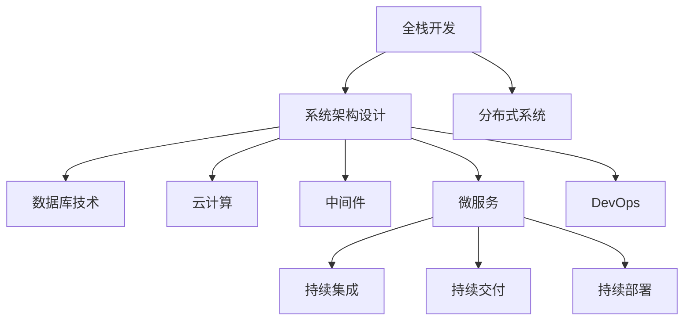

                 

## 1. 背景介绍

### 1.1 问题由来
在当今快速发展的技术环境中，开发人员正面临从全栈开发到技术架构师的转变。这一转变不仅仅是职位名称的变化，更是技能、思维方式和职业发展路径的深刻变革。面对不断变化的技术栈、日益复杂的系统需求和快速迭代的业务环境，如何从全栈开发到技术架构师进阶，成为许多开发人员共同关心的话题。

### 1.2 问题核心关键点
从全栈开发到技术架构师的进阶，涉及多方面的能力提升，包括但不限于以下核心关键点：
1. **系统架构设计**：理解系统架构的基本原则，掌握如何设计和构建可扩展、高可用、高性能的系统。
2. **分布式系统**：了解分布式系统原理，掌握如何设计和优化分布式系统的性能和可靠性。
3. **数据库技术**：深入理解不同类型的数据库，掌握数据库设计和调优的最佳实践。
4. **云计算**：熟悉云计算平台，了解云架构模式和相关服务，掌握云原生开发的最佳实践。
5. **中间件与微服务**：掌握常用中间件和微服务框架，了解如何构建解耦、灵活的微服务架构。
6. **DevOps与持续集成**：理解DevOps文化，掌握持续集成、持续交付和持续部署的最佳实践。

### 1.3 问题研究意义
从全栈开发到技术架构师的进阶，对于开发人员的职业发展具有重要意义：
1. **提升技术水平**：通过系统架构设计的学习，掌握更高层次的技术能力，为职业晋升和转型奠定基础。
2. **提高竞争力**：掌握分布式系统、云计算等前沿技术，增强个人竞争力，适应快速变化的技术环境。
3. **拓展职业路径**：技术架构师岗位需求旺盛，职业选择更广，能够提供更高的职业满意度和经济收入。
4. **推动业务创新**：具备系统架构设计能力，能够设计出更优的系统架构，推动企业业务创新和转型。
5. **培养综合素质**：技术架构师不仅需要技术能力，还需要良好的沟通、管理和决策能力，培养综合素质，全面提升个人价值。

## 2. 核心概念与联系

### 2.1 核心概念概述

为更好地理解从全栈开发到技术架构师的进阶，本节将介绍几个密切相关的核心概念：

- **全栈开发(Full Stack Development)**：指开发人员具备前端和后端技术的能力，能够独立完成从用户界面到数据存储的全流程开发。
- **系统架构设计(System Architecture Design)**：指设计和构建高效、可扩展的系统架构，涉及系统的整体结构和组件间的关系。
- **分布式系统(Distributed System)**：指由多个独立计算机通过网络协同工作的系统，具备高可用、高扩展性。
- **数据库技术(Database Technology)**：指数据库的设计、实施、管理和优化技术，涵盖关系型数据库、非关系型数据库等。
- **云计算(Cloud Computing)**：指通过互联网提供计算资源和服务的模式，包括云基础设施、平台和软件服务。
- **中间件(Middleware)**：指连接不同应用和系统的软件，提供数据传输、通信、事务管理等功能。
- **微服务(Microservices)**：指将大系统拆分为多个独立运行、松耦合的小服务，提升系统的灵活性和可维护性。
- **DevOps(DevOps)**：指软件开发和运维的结合，强调协作、自动化和持续集成，提升交付效率和质量。

这些核心概念之间的逻辑关系可以通过以下Mermaid流程图来展示：



这个流程图展示了一名全栈开发者在技术进阶过程中可能涉及的关键技术和能力提升路径：

1. 从全栈开发出发，掌握系统架构设计的核心原理。
2. 学习分布式系统原理，了解如何构建高可用、高扩展性的系统。
3. 深入理解数据库技术，掌握不同类型数据库的选型和优化。
4. 熟悉云计算平台，了解云架构模式和相关服务。
5. 掌握中间件和微服务框架，构建解耦、灵活的微服务架构。
6. 理解DevOps文化，掌握持续集成、持续交付和持续部署的最佳实践。

## 3. 核心算法原理 & 具体操作步骤

### 3.1 算法原理概述

从全栈开发到技术架构师的进阶，本质上是一个技能和思维方式提升的过程。这一过程涉及从技术深度和广度两个维度进行全面提升，逐步掌握系统架构设计的核心原理和技术细节。

**系统架构设计的核心原理**：
1. **可扩展性(Scalability)**：系统应具备良好扩展性，能够通过水平扩展应对更高的负载。
2. **高可用性(Availability)**：系统应具备高可用性，能够在故障情况下自动恢复。
3. **高性能(Performance)**：系统应具备高性能，能够快速响应用户请求。
4. **高安全(Security)**：系统应具备高安全性，能够防止攻击和数据泄露。
5. **低成本(Low Cost)**：系统应具备低成本，能够在合理投入下最大化性能。

### 3.2 算法步骤详解

从全栈开发到技术架构师的进阶，主要包括以下几个关键步骤：

**Step 1: 学习系统架构设计基础**
- 理解系统架构设计的基本原则和模型，如分层架构、微服务架构、事件驱动架构等。
- 学习常用的架构设计模式，如策略模式、工厂模式、观察者模式等。
- 掌握架构评估和优化的方法，如负载均衡、故障转移、性能调优等。

**Step 2: 深入理解分布式系统**
- 理解分布式系统的基本概念，如分布式协议、分布式锁、分布式事务等。
- 学习分布式系统的网络通信原理，掌握常见的通信框架如gRPC、HTTP/2等。
- 掌握分布式系统的故障恢复机制，如容错设计、断路器模式、重试机制等。

**Step 3: 掌握数据库技术**
- 学习关系型数据库和NoSQL数据库的设计和优化技术，如索引优化、分片技术、事务处理等。
- 掌握数据库的性能调优技巧，如缓存技术、读写分离、查询优化等。
- 学习数据库的安全管理技术，如访问控制、数据加密、备份与恢复等。

**Step 4: 熟悉云计算平台**
- 学习云计算平台的基本概念，如云基础设施、云平台服务和云原生应用等。
- 掌握云计算的安全和合规性要求，如身份认证、加密传输、合规性审计等。
- 了解云原生架构模式，如微服务、DevOps、容器化等，掌握云原生开发的最佳实践。

**Step 5: 掌握中间件和微服务框架**
- 学习常用的中间件技术，如消息队列、缓存、负载均衡等，掌握其选型和优化。
- 学习微服务架构的设计和实现方法，掌握微服务的解耦、通信、事务管理等核心技术。
- 掌握微服务的最佳实践，如服务网格、API网关、限流降级等，提升微服务的可用性和可维护性。

**Step 6: 理解DevOps文化**
- 理解DevOps文化的核心价值，如协作、自动化、持续集成等。
- 掌握持续集成和持续交付的工具和实践，如CI/CD流程、容器化部署、自动化测试等。
- 掌握持续部署的最佳实践，如蓝绿部署、金丝雀部署、自动化回滚等。

通过以上步骤的学习和实践，开发人员将逐步掌握系统架构设计的核心原理和技术细节，实现从全栈开发到技术架构师的进阶。

### 3.3 算法优缺点

从全栈开发到技术架构师的进阶，具有以下优点：
1. **提升技术能力**：系统架构设计的学习，帮助开发人员掌握更高层次的技术能力，为职业晋升和转型奠定基础。
2. **增强竞争力**：掌握分布式系统、云计算等前沿技术，增强个人竞争力，适应快速变化的技术环境。
3. **拓展职业路径**：技术架构师岗位需求旺盛，职业选择更广，能够提供更高的职业满意度和经济收入。
4. **推动业务创新**：具备系统架构设计能力，能够设计出更优的系统架构，推动企业业务创新和转型。
5. **培养综合素质**：技术架构师不仅需要技术能力，还需要良好的沟通、管理和决策能力，培养综合素质，全面提升个人价值。

但这一过程也存在一些挑战和局限：
1. **学习曲线陡峭**：系统架构设计的学习涉及多方面的技术细节，可能需要较长时间的积累和实践。
2. **知识面广**：需要掌握广泛的技术栈，包括分布式系统、云计算、数据库等，需要时间和精力进行全面学习。
3. **实践机会少**：实际项目中的系统架构设计机会较少，可能难以在短时间内获得充分的实践经验。
4. **跨部门协作**：系统架构设计涉及多部门协作，需要良好的沟通和协调能力。

尽管存在这些挑战，但通过系统学习、实践和持续积累，开发人员完全可以从全栈开发逐步进阶到技术架构师，实现职业生涯的飞跃。

### 3.4 算法应用领域

从全栈开发到技术架构师的进阶，可以应用于各种系统架构设计和技术架构的构建。以下是几个典型的应用场景：

**1. 企业级系统架构设计**
- 设计并构建大型企业级系统，如电商平台、金融系统、医疗系统等，确保系统的可扩展性、高可用性和高性能。
- 采用微服务架构，提升系统的灵活性和可维护性。
- 利用云计算平台，降低系统部署和运维成本，提升系统的可靠性和扩展性。

**2. 云计算和大数据架构设计**
- 设计并构建基于云计算和大数据的应用架构，如数据湖、数据仓库、大数据分析平台等。
- 利用云平台的服务，提升数据的处理和存储能力，实现数据的实时分析和可视化。
- 采用大数据技术，处理海量数据，提升数据洞察和决策支持能力。

**3. 物联网(IoT)架构设计**
- 设计并构建物联网系统，实现设备和数据的互联互通。
- 采用微服务架构，提升系统的可扩展性和可维护性。
- 利用云计算平台，降低物联网系统的部署和运维成本，提升系统的可靠性和可扩展性。

**4. 微服务架构设计与实现**
- 设计和实现基于微服务架构的应用系统，确保系统的高可用性、高性能和可扩展性。
- 采用服务网格、API网关等技术，提升微服务的性能和可用性。
- 实现持续集成和持续部署，提升系统的交付效率和质量。

## 4. 数学模型和公式 & 详细讲解 & 举例说明

### 4.1 数学模型构建

系统架构设计涉及多方面的技术细节，包括但不限于分布式系统、数据库技术、云计算平台等。以下是几个典型场景的数学模型构建：

**分布式系统模型**
- 定义分布式系统的网络通信模型，如TCP/IP协议、gRPC框架等。
- 定义分布式锁的机制，如Redis、Zookeeper等。
- 定义分布式事务的协议，如2PC、TCC等。

**数据库性能优化模型**
- 定义数据库的索引优化模型，如B+树、哈希索引等。
- 定义数据库的读写分离模型，如分库分表、读写分离等。
- 定义数据库的缓存模型，如Redis、Memcached等。

**云计算平台模型**
- 定义云计算基础设施的模型，如云服务器、云存储、云网络等。
- 定义云平台的自动化部署模型，如CloudFormation、Terraform等。
- 定义云平台的安全模型，如身份认证、加密传输、合规性审计等。

### 4.2 公式推导过程

以下以分布式系统的网络通信模型为例，推导TCP/IP协议的基本原理。

**TCP/IP协议基本原理**
- 定义TCP/IP协议的网络通信模型，包括IP地址、TCP端口、数据包等。
- 定义TCP连接的建立、数据传输和断开的过程。
- 定义TCP连接的拥塞控制算法，如慢启动、拥塞避免、快速重传等。

**推导过程**
- **IP地址**：定义IP地址的基本格式，如IPv4和IPv6等。
- **TCP端口**：定义TCP端口的基本格式，如16位整数。
- **数据包**：定义数据包的基本格式，包括源IP地址、目的IP地址、源TCP端口、目的TCP端口等。
- **TCP连接建立**：定义TCP连接的建立过程，包括三次握手的过程。
- **数据传输**：定义TCP数据传输的过程，包括发送方和接收方的数据交换。
- **TCP连接断开**：定义TCP连接的断开过程，包括四次挥手的过程。
- **拥塞控制**：定义TCP连接的拥塞控制算法，包括慢启动、拥塞避免、快速重传等。

**公式表示**
- IP地址：$IP = \{<IPv4/IPv6\_address, <port>\}$
- 数据包：$Packet = \{<IP\_address>, <TCP\_port>, <data>\}$
- TCP连接建立：$Establish\_Connection = \{<SYN>, <SYN+ACK>, <ACK>\}$
- 数据传输：$Transmit\_Data = \{<ACK>, <data>, <ACK+1>\}$
- TCP连接断开：$Close\_Connection = \{<FIN>, <FIN+ACK>, <ACK>\}$
- 慢启动：$Window\_Size = \{2^{index}, <max\_window\_size>\}$
- 拥塞避免：$Congestion\_Avoid = \{<window\_size>, <threshold>\}$
- 快速重传：$Fast\_Retransmission = \{<retransmission\_count>, <delay\_time>\}$

### 4.3 案例分析与讲解

**案例1：数据库性能优化**
- 背景：某电商公司需处理大量用户订单，订单处理系统采用MySQL数据库，访问量不断增加导致性能瓶颈。
- 问题：如何优化MySQL数据库，提升订单处理系统的性能？
- 解决方案：
  - 采用读写分离技术，将读操作和写操作分别在主从数据库中执行。
  - 使用Redis缓存，将热点数据缓存到Redis中，减少数据库的访问压力。
  - 使用索引优化，创建合适的索引，提升查询效率。

**案例2：云计算平台架构设计**
- 背景：某金融公司需构建大数据分析平台，数据量巨大，需具备高可用性和高扩展性。
- 问题：如何设计基于云计算平台的大数据分析架构？
- 解决方案：
  - 采用云平台的服务，如云存储、云数据库、云计算等，降低系统的部署和运维成本。
  - 采用分布式计算框架，如Hadoop、Spark等，提升数据的处理能力。
  - 采用自动化部署工具，如CloudFormation、Terraform等，提升系统的部署效率和一致性。

## 5. 项目实践：代码实例和详细解释说明

### 5.1 开发环境搭建

在进行系统架构设计的项目实践前，我们需要准备好开发环境。以下是使用Python进行Django开发的环境配置流程：

1. 安装Anaconda：从官网下载并安装Anaconda，用于创建独立的Python环境。

2. 创建并激活虚拟环境：
```bash
conda create -n django-env python=3.8 
conda activate django-env
```

3. 安装Django：
```bash
pip install django
```

4. 安装相关的包和依赖：
```bash
pip install django-rest-framework django-cors-headers
```

完成上述步骤后，即可在`django-env`环境中开始项目实践。

### 5.2 源代码详细实现

我们以电商平台为例，展示如何使用Django进行系统架构设计。

首先，创建项目和应用：

```bash
django-admin startproject ecommerce
cd ecommerce
python manage.py startapp products
```

然后，定义模型和视图：

```python
from django.db import models
from django.contrib.auth.models import User
from django.views import View
from django.shortcuts import render, redirect
from django.http import JsonResponse

class Product(models.Model):
    name = models.CharField(max_length=200)
    description = models.TextField()
    price = models.DecimalField(max_digits=10, decimal_places=2)
    created_at = models.DateTimeField(auto_now_add=True)

class ProductView(View):
    def get(self, request):
        products = Product.objects.all()
        return JsonResponse([{'id': product.id, 'name': product.name, 'description': product.description, 'price': product.price} for product in products], safe=False)

    def post(self, request):
        data = request.POST
        product = Product(name=data['name'], description=data['description'], price=data['price'])
        product.save()
        return redirect('product-list')

    def delete(self, request, pk):
        Product.objects.get(pk=pk).delete()
        return redirect('product-list')
```

接着，定义URL配置：

```python
from django.urls import path
from .views import ProductView

urlpatterns = [
    path('products/', ProductView.as_view(), name='product-list'),
    path('products/new/', ProductView.as_view(template_name='product_form.html'), name='product-create'),
    path('products/<int:pk>/', ProductView.as_view(), name='product-detail'),
    path('products/<int:pk>/delete/', ProductView.as_view(), name='product-delete'),
]
```

最后，启动开发服务器：

```bash
python manage.py runserver
```

在开发服务器上访问`http://127.0.0.1:8000/products/`，即可看到电商平台的基本界面。

### 5.3 代码解读与分析

让我们再详细解读一下关键代码的实现细节：

**模型定义**
- 使用Django的`models.Model`定义产品模型`Product`，包含名称、描述、价格等字段。
- 使用`created_at`字段记录产品的创建时间，自动设置为当前时间。

**视图定义**
- 定义`ProductView`类，继承`django.views.View`，实现对产品的增删改查操作。
- `get`方法：获取所有产品列表，返回JSON格式的产品列表。
- `post`方法：创建新产品，接收POST请求中的数据，保存到数据库中，并返回新增产品详情页。
- `delete`方法：删除指定产品，返回产品列表页。

**URL配置**
- 使用Django的`path`函数定义URL路由，将视图与URL绑定。
- 使用`as_view`方法将视图转换为类视图，方便路由和装饰器的使用。

通过以上步骤，我们实现了基本的电商平台架构，展示了全栈开发到技术架构师进阶过程中的关键技术。

## 6. 实际应用场景

### 6.1 智能推荐系统

基于系统架构设计的智能推荐系统，可以广泛应用于电商、新闻、社交媒体等领域，提升用户体验和满意度。

在技术实现上，可以构建一个基于微服务的推荐引擎，包括用户画像服务、商品画像服务、推荐算法服务等。用户画像服务根据用户行为数据，构建用户画像，推荐算法服务根据用户画像和商品画像，生成个性化推荐结果，商品画像服务根据商品数据，构建商品画像，并存储到数据库中。通过API网关，将各个微服务连接起来，实现推荐引擎的整体架构。

### 6.2 医疗影像系统

基于系统架构设计的医疗影像系统，可以处理大量医疗影像数据，提升医疗影像的诊断和治疗效率。

在技术实现上，可以构建一个基于微服务的医疗影像系统，包括影像存储服务、影像处理服务、影像分析服务等。影像存储服务负责存储医疗影像数据，影像处理服务负责对影像数据进行预处理和增强，影像分析服务负责对处理后的影像数据进行分析和诊断，生成医疗报告。通过API网关，将各个微服务连接起来，实现医疗影像系统的整体架构。

### 6.3 供应链管理系统

基于系统架构设计的供应链管理系统，可以实现供应链的可视化管理和优化，提升供应链的效率和透明度。

在技术实现上，可以构建一个基于微服务的供应链管理系统，包括订单服务、库存服务、物流服务、监控服务等。订单服务负责处理订单数据，库存服务负责管理库存数据，物流服务负责跟踪物流信息，监控服务负责监控供应链的运行状态。通过API网关，将各个微服务连接起来，实现供应链管理系统的整体架构。

## 7. 工具和资源推荐

### 7.1 学习资源推荐

为了帮助开发人员系统掌握系统架构设计的理论基础和实践技巧，这里推荐一些优质的学习资源：

1. 《系统架构设计与实现》系列书籍：详细介绍了系统架构设计的核心原理和实践方法，涵盖分布式系统、云计算、数据库等关键技术。
2. Udacity《微服务架构设计与实现》课程：由Google等公司推出的微服务架构设计课程，涵盖微服务的基础和实战经验。
3. Coursera《系统架构与设计》课程：由IBM公司推出的系统架构设计课程，涵盖系统架构设计的核心技术和案例分析。
4. Medium《系统架构设计与实践》系列文章：系统架构设计领域的专家分享实际项目中的经验和教训，值得学习和参考。

通过对这些资源的学习实践，相信你一定能够快速掌握系统架构设计的精髓，并用于解决实际的系统架构设计问题。

### 7.2 开发工具推荐

高效的开发离不开优秀的工具支持。以下是几款用于系统架构设计开发的常用工具：

1. Django：Python的开源Web框架，简单易用，适合快速开发原型和微服务架构。
2. Flask：Python的开源微框架，灵活轻量，适合构建API服务和小型Web应用。
3. RESTful API设计工具：如Postman、Swagger等，帮助设计API接口和文档。
4. DevOps工具：如Jenkins、Docker、Kubernetes等，自动化构建、部署和运维。
5. 数据库管理工具：如MySQL Workbench、pgAdmin等，方便管理和优化数据库。

合理利用这些工具，可以显著提升系统架构设计的开发效率，加快创新迭代的步伐。

### 7.3 相关论文推荐

系统架构设计领域的研究不断涌现，以下是几篇奠基性的相关论文，推荐阅读：

1. "The 12-Factor App"：这篇文章定义了云计算应用程序的最佳实践，包括构建、部署、运行和维护系统架构的原则和方法。
2. "Microservices: A lightweight architecture for developing scalable systems"：这篇文章介绍了微服务的定义和设计原则，探讨了微服务架构的优点和挑战。
3. "Designing Distributed Systems"：这篇文章介绍了分布式系统的设计和实现方法，涵盖网络通信、分布式锁、分布式事务等内容。
4. "Architecture of Open Source Applications"：这篇文章介绍了开源应用程序的设计和实现方法，包括系统架构、模块化设计等内容。

这些论文代表了大系统架构设计的最新研究成果，值得深入学习和借鉴。

## 8. 总结：未来发展趋势与挑战

### 8.1 总结

本文对从全栈开发到技术架构师的进阶过程进行了全面系统的介绍。首先阐述了这一转变的背景和意义，明确了技术架构师岗位所需掌握的核心能力和技术细节。其次，从系统架构设计的核心原理和操作步骤，详细讲解了全栈开发人员如何逐步掌握技术架构师所需的技能和思维方式。最后，展示了系统架构设计的实际应用场景和未来发展趋势，强调了技术架构师在企业业务创新和数字化转型中的重要角色。

通过本文的系统梳理，可以看到，从全栈开发到技术架构师的进阶，是一个涉及技术深度和广度两个维度全面提升的过程。这一过程不仅需要掌握系统架构设计的核心原理，还需要实践经验、跨部门协作和持续学习。通过不断的学习和实践，开发人员将逐步掌握技术架构师所需的能力，实现职业生涯的飞跃。

### 8.2 未来发展趋势

展望未来，系统架构设计将呈现以下几个发展趋势：

1. **微服务架构持续流行**：微服务架构将继续流行，提升系统的灵活性和可维护性，成为构建大型系统的主要技术架构。
2. **云原生技术快速发展**：云原生技术如Kubernetes、Docker、Istio等将进一步发展，提升系统的部署、运维和扩展能力。
3. **DevOps文化普及**：DevOps文化将更加普及，提升系统的交付效率和质量，缩短开发到生产的周期。
4. **自动化技术提升**：自动化工具和流程将更加成熟，提升系统的开发和运维效率，降低人为错误。
5. **安全性、隐私性要求提升**：系统架构设计将更加注重安全性、隐私性，满足合规性要求。

以上趋势凸显了系统架构设计的广阔前景。这些方向的探索发展，将进一步提升系统的性能、可靠性和可维护性，为业务创新和数字化转型提供坚实的基础。

### 8.3 面临的挑战

尽管系统架构设计前景广阔，但仍面临诸多挑战：

1. **技术复杂性增加**：系统架构设计涉及多方面的技术和工具，需要不断学习和实践。
2. **跨部门协作难度大**：系统架构设计需要跨多个部门协作，沟通和协调难度较大。
3. **需求变化快**：业务需求快速变化，系统架构设计需快速适应变化，对开发人员的要求较高。
4. **安全性和隐私性要求高**：系统架构设计需满足高安全性和隐私性要求，保障数据安全。
5. **资源和成本投入大**：系统架构设计需要投入大量资源和成本，对企业的预算压力较大。

尽管存在这些挑战，但通过系统的学习、实践和跨部门协作，开发人员完全可以从全栈开发逐步进阶到技术架构师，实现职业生涯的飞跃。

### 8.4 研究展望

面对系统架构设计所面临的诸多挑战，未来的研究需要在以下几个方面寻求新的突破：

1. **自动化和智能化设计**：开发更加自动化和智能化的系统架构设计工具，提升设计效率和质量。
2. **持续学习和优化**：引入持续学习机制，使系统架构设计能够不断适应变化的需求和环境。
3. **开源社区贡献**：加强开源社区的贡献，共享最佳实践和经验，提升整个行业的设计水平。
4. **跨学科研究**：结合计算机科学、工程学、社会学等多学科的知识，探索更加全面的系统架构设计方法。
5. **伦理和安全研究**：引入伦理和安全研究，确保系统架构设计符合道德和法律要求。

这些研究方向将推动系统架构设计的发展，提升系统的性能和可靠性，为企业的数字化转型和创新提供坚实的基础。

## 9. 附录：常见问题与解答

**Q1：全栈开发和技术架构师的区别是什么？**

A: 全栈开发和技术架构师的最大区别在于技术深度和广度的不同。全栈开发强调技术栈的全面掌握，涵盖前端和后端技术；而技术架构师则更注重技术深度，需要掌握系统架构设计的核心原理和最佳实践，能够设计出高效、可扩展的系统架构。

**Q2：从全栈开发到技术架构师的进阶需要多长时间？**

A: 从全栈开发到技术架构师的进阶，没有固定的时间周期，主要取决于个人学习能力和实践机会。一般建议持续学习至少一年，并在实际项目中不断实践和积累经验。

**Q3：如何进行系统架构设计的学习？**

A: 系统架构设计的学习可以从以下几个方面入手：
1. 学习相关书籍和课程，掌握系统架构设计的核心原理和最佳实践。
2. 参与实际项目，实践系统架构设计的过程和挑战。
3. 与同行交流，分享经验和教训，不断提升设计能力。
4. 参加技术社区和会议，了解最新的架构设计和技术趋势。

**Q4：系统架构设计有哪些关键技术？**

A: 系统架构设计涉及多方面的技术，包括但不限于：
1. 分布式系统设计：如分布式协议、分布式锁、分布式事务等。
2. 数据库设计：如索引优化、读写分离、缓存等。
3. 云计算平台设计：如云基础设施、云平台服务和云原生应用等。
4. 微服务架构设计：如服务拆分、服务网格、API网关等。
5. DevOps文化：如持续集成、持续交付和持续部署等。

**Q5：如何进行系统架构设计的实践？**

A: 系统架构设计的实践可以从以下几个方面入手：
1. 选择一个适合的项目，进行系统架构设计的规划和设计。
2. 选择合适的技术和工具，构建系统架构的各个组件。
3. 进行系统架构的部署和运行，进行性能和可扩展性测试。
4. 根据测试结果和反馈，不断优化和改进系统架构。

通过系统的学习和实践，开发人员将逐步掌握系统架构设计的核心能力和技术细节，实现从全栈开发到技术架构师的进阶。

---

作者：禅与计算机程序设计艺术 / Zen and the Art of Computer Programming

