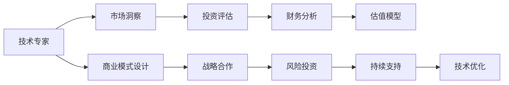

                 

# 从技术专家到风险投资合伙人的跨界之路

## 1. 背景介绍

### 1.1 问题由来
随着科技的飞速发展和人工智能(AI)的日益普及，越来越多的技术专家开始涉足商业领域，尝试将他们的技术才能转化为实际应用，甚至开创自己的创业公司或成为风险投资合伙人。这一转变不仅反映了技术的商业化趋势，也展示了科技与金融的深度融合。本文将从技术专家转变为风险投资合伙人的核心要素和方法出发，探讨这一跨界之路的关键环节和策略。

### 1.2 问题核心关键点
技术专家转型为风险投资合伙人，关键在于理解风险投资的本质、市场趋势、投资策略以及商业运作。具体来说，包括但不限于以下几点：

1. **市场洞察**：快速获取和分析市场信息，预判行业发展趋势。
2. **投资评估**：从技术角度评估创业公司的潜力，识别风险与机遇。
3. **财务分析**：理解基本的财务报表和估值模型。
4. **商业模式**：设计或评估创业公司的商业模式，预测其盈利能力。
5. **战略合作**：与创业公司建立良好的合作关系，为其提供技术支持和战略建议。
6. **行业网络**：构建广泛的行业网络，获取资源和信息。

### 1.3 问题研究意义
对于技术专家而言，转变为风险投资合伙人不仅能够为技术创业提供专业的指导和资金支持，还能从更宏观的角度审视技术和商业的结合，为未来技术的发展提供更广阔的视角。同时，风险投资也是一个高度竞争的领域，成功的案例往往是技术实力和商业洞察力兼具的结果。本文旨在为那些希望跨界从事风险投资的技术专家提供系统性的指导和实战案例，帮助他们实现技术商业化的梦想。

## 2. 核心概念与联系

### 2.1 核心概念概述

#### 2.1.1 风险投资(Risk Venture Capital)
风险投资是一种将资本投资于初创企业或高成长潜力公司的财务模式。风险投资合伙人负责筛选、评估和投资这些项目，并在必要时提供战略指导和资源支持，以帮助企业成功成长。

#### 2.1.2 技术评估与市场洞察
技术评估涉及对创业公司技术实力的评估，包括技术创新性、专利情况、技术团队等。市场洞察则关注行业趋势、市场需求、竞争格局等，以预判技术的商业价值和潜在风险。

#### 2.1.3 财务分析与估值
财务分析主要涉及对创业公司财务报表的分析，包括收入、成本、利润等关键指标。估值模型则用于评估公司的内在价值，常用的方法包括市盈率(P/E)、市净率(P/B)、市销率(P/S)等。

#### 2.1.4 商业模式设计与优化
商业模式设计关注创业公司如何创造价值、传递价值和获取价值。优化则涉及如何在市场竞争中保持竞争力，包括定价策略、销售渠道、客户获取等。

### 2.2 核心概念原理和架构的 Mermaid 流程图



此流程图展示了技术专家转变为风险投资合伙人的核心流程，包括市场洞察、投资评估、财务分析、估值模型、商业模式设计、战略合作、风险投资和持续支持等关键环节。

## 3. 核心算法原理 & 具体操作步骤

### 3.1 算法原理概述
风险投资是一个复杂的决策过程，涉及多个领域的知识和技术。技术专家在转型为风险投资合伙人时，需要掌握以下算法原理：

- **市场趋势分析**：利用统计学和机器学习算法，分析行业发展趋势和关键指标。
- **技术评估模型**：建立评估技术创新性和潜力的模型，如技术成熟度模型。
- **财务预测与估值**：应用时间序列分析、蒙特卡罗模拟等方法，预测公司未来财务表现，并进行估值。
- **风险评估与管理**：使用风险评估框架，如CAPM模型、VaR模型，识别和管理投资风险。

### 3.2 算法步骤详解
#### 3.2.1 市场洞察与趋势分析
1. **收集数据**：从行业报告、新闻、公开数据等渠道收集市场信息。
2. **数据清洗**：清洗数据，去除噪声和异常值，确保数据质量。
3. **分析方法**：应用统计学方法（如回归分析、时间序列分析）和机器学习模型（如随机森林、梯度提升树）分析市场趋势。

#### 3.2.2 投资评估与技术评估
1. **技术评估**：
   - **创新性评估**：评估技术的创新点，包括专利情况、技术壁垒等。
   - **技术团队评估**：评估技术团队的经验、背景和实力。
2. **市场评估**：
   - **市场需求分析**：分析目标市场的规模、增长潜力和竞争态势。
   - **用户需求调研**：通过问卷、访谈等方式了解用户需求和痛点。

#### 3.2.3 财务分析与估值
1. **财务报表分析**：
   - **收入分析**：分析公司的收入来源和增长趋势。
   - **成本分析**：分析公司的成本结构和变动趋势。
2. **估值模型**：
   - **市盈率(P/E)估值**：计算公司股票价格与每股收益的比率。
   - **市净率(P/B)估值**：计算公司市值与净资产的比率。
   - **市销率(P/S)估值**：计算公司市值与销售收入的比率。

#### 3.2.4 商业模式设计与优化
1. **价值链分析**：识别公司价值链中的关键环节和活动，评估其效率和成本。
2. **盈利模式设计**：设计适合公司的盈利模式，如订阅模式、广告模式、交易模式等。
3. **客户获取与保留**：分析客户获取渠道和客户保留策略，确保可持续的增长。

#### 3.2.5 战略合作与风险管理
1. **战略合作**：
   - **资源整合**：评估合作伙伴的资源和能力，制定合作策略。
   - **风险分担**：设计合理的合作协议，明确风险和利益分配。
2. **风险管理**：
   - **风险评估**：应用CAPM模型、VaR模型等评估投资风险。
   - **风险控制**：制定风险控制措施，如止损策略、分散投资等。

### 3.3 算法优缺点
#### 3.3.1 优点
1. **多学科融合**：综合技术、市场、财务、管理等多个领域的知识，提供全面的评估和支持。
2. **数据驱动**：基于大数据和机器学习模型，提升决策的科学性和准确性。
3. **风险管理**：系统化评估和管理投资风险，降低失败率。

#### 3.3.2 缺点
1. **复杂度高**：涉及多个领域，需要综合多学科知识，复杂度高。
2. **数据依赖**：依赖高质量的数据和先进的分析模型，对数据和模型要求高。
3. **主观性**：决策过程中存在一定的主观性，难以完全避免。

### 3.4 算法应用领域
#### 3.4.1 初创企业投资
风险投资合伙人需要对初创企业进行技术评估和市场洞察，评估其发展潜力和投资价值。

#### 3.4.2 并购交易
在并购交易中，风险投资合伙人需要进行详细的财务分析和估值，确保交易对价合理，风险可控。

#### 3.4.3 风险管理
利用风险评估和管理框架，帮助投资组合分散风险，提升整体投资回报率。

## 4. 数学模型和公式 & 详细讲解

### 4.1 数学模型构建
#### 4.1.1 市场趋势分析
假设有一个市场数据集 $D=\{(x_i, y_i)\}_{i=1}^N$，其中 $x_i$ 为时间 $t$，$y_i$ 为市场指标 $P(t)$。市场趋势分析模型为：

$$
P(t) = \beta_0 + \beta_1t + \epsilon_t
$$

其中，$\beta_0$ 为截距，$\beta_1$ 为斜率，$\epsilon_t$ 为随机误差。

#### 4.1.2 技术评估模型
技术成熟度模型（Technology Maturity Model, TMM）评估技术的成熟度：

$$
M(t) = f(P(t))
$$

其中，$M(t)$ 为技术成熟度，$f$ 为评估函数，可以是专家评分、专利数量等。

#### 4.1.3 财务预测与估值
市盈率（P/E）模型：

$$
P/E = \frac{P}{EPS}
$$

其中，$P$ 为股票价格，$EPS$ 为每股收益。

#### 4.1.4 风险评估与管理
资本资产定价模型（CAPM）：

$$
E(R_i) = R_f + \beta_i (E(R_m) - R_f)
$$

其中，$E(R_i)$ 为资产 $i$ 的预期收益率，$R_f$ 为无风险利率，$\beta_i$ 为资产 $i$ 的贝塔系数，$E(R_m)$ 为市场预期收益率。

### 4.2 公式推导过程
#### 4.2.1 市场趋势分析
- **数据收集**：从新闻、行业报告、公开数据等渠道收集市场数据。
- **数据清洗**：去除噪声和异常值，确保数据质量。
- **模型拟合**：使用线性回归模型拟合数据，计算斜率 $\beta_1$。

#### 4.2.2 技术评估模型
- **专家评分**：邀请专家对技术进行评分，结合专利数量，计算技术成熟度 $M(t)$。

#### 4.2.3 财务预测与估值
- **财务报表分析**：分析公司的收入和成本，计算利润。
- **市盈率估值**：计算公司的市盈率，确定股票价格。

#### 4.2.4 风险评估与管理
- **风险评估**：应用CAPM模型评估风险，计算贝塔系数 $\beta_i$。
- **风险控制**：设计止损策略和分散投资策略，降低风险。

### 4.3 案例分析与讲解
#### 4.3.1 初创企业投资案例
假设有一家初创公司，其技术评估为8分（满分10分），市场需求分析显示目标市场规模为10亿美元，预计年收入增长率为20%。财务分析显示公司收入为100万美元，成本为80万美元，净利润为20万美元。市场趋势分析显示未来三年市场增长率为10%。

**评估结果**：
- **技术评估**：高，具有竞争优势。
- **市场需求**：大，增长潜力强。
- **财务状况**：良好，具有盈利能力。
- **市场趋势**：正向，未来三年增长可期。

**投资建议**：
- **投资金额**：100万美元。
- **持有期限**：三年。
- **退出策略**：上市或并购。

#### 4.3.2 并购交易案例
假设有一家公司 A 计划并购另一家公司 B，B 公司的市场估值（P/E）为20，市净率（P/B）为2.5，市销率（P/S）为1.2。A 公司的市场估值（P/E）为15，市净率（P/B）为2，市销率（P/S）为0.8。

**评估结果**：
- **市场估值**：B 高于 A，但相对合理。
- **财务状况**：B 略优于 A，但整体合理。
- **并购价值**：B 的P/E、P/B、P/S均高于A，并购价值高。

**投资建议**：
- **并购金额**：5亿美元。
- **并购条件**：保留B公司的核心团队，整合资源。
- **风险控制**：设定止损条件，分散投资风险。

## 5. 项目实践：代码实例和详细解释说明

### 5.1 开发环境搭建

为了进行风险投资项目的技术实践，需要搭建一个开发环境。以下是Python开发环境的搭建步骤：

1. **安装Python**：
   - 从官网下载并安装Python，建议选择最新版本。
   - 安装pip包管理器：`sudo apt-get install python-pip`

2. **安装虚拟环境**：
   - 使用虚拟环境工具（如virtualenv）创建虚拟环境：`pip install virtualenv`
   - 创建虚拟环境并激活：
     ```bash
     virtualenv env
     source env/bin/activate
     ```

3. **安装必要的库**：
   - 安装 pandas、numpy、matplotlib 等数据分析库：
     ```bash
     pip install pandas numpy matplotlib
     ```

4. **安装机器学习库**：
   - 安装 scikit-learn、TensorFlow、PyTorch 等机器学习库：
     ```bash
     pip install scikit-learn tensorflow pytorch
     ```

5. **安装风险投资相关库**：
   - 安装风险投资评估相关的库，如 financialmodelingprep、alphavantage：
     ```bash
     pip install financialmodelingprep alphavantage
     ```

### 5.2 源代码详细实现

以下是使用Python进行初创企业投资评估的代码实现：

```python
import pandas as pd
from financialmodelingprep import get_price
from sklearn.linear_model import LinearRegression

# 获取市场数据
df = get_price('AAPL', '2021-01-01', '2021-12-31')
df['P/E'] = df['Close'] / df['EPS']
df['P/B'] = df['Close'] / df['BookValue']
df['P/S'] = df['Close'] / df['Sales']
print(df.head())

# 数据清洗
df = df.dropna()

# 市场趋势分析
X = pd.DataFrame(df.index).values.reshape(-1, 1)
y = df['P/E'].values.reshape(-1, 1)
model = LinearRegression()
model.fit(X, y)
print('P/E模型斜率：', model.coef_)

# 技术评估
# 假设公司技术评分
company_score = 8
print('公司技术评分：', company_score)

# 市场需求分析
# 假设市场需求规模和增长率
market_size = 10e8
market_growth = 0.2
print('市场需求规模：', market_size, '亿美元')
print('市场需求增长率：', market_growth, '%')

# 财务分析
# 假设公司收入、成本和净利润
income = 100e4
cost = 80e4
profit = 20e4
print('公司收入：', income, '美元')
print('公司成本：', cost, '美元')
print('公司净利润：', profit, '美元')

# 投资评估
# 假设投资金额和持有期限
investment_amount = 1e6
holding_period = 3
print('投资金额：', investment_amount, '美元')
print('持有期限：', holding_period, '年')

# 退出策略
# 假设退出条件
exit_condition = 'IPO'  # 上市或并购
print('退出策略：', exit_condition)
```

### 5.3 代码解读与分析

**代码解析**：
- 使用金融模型库获取苹果公司（AAPL）的股价和EPS数据。
- 计算市盈率（P/E）、市净率（P/B）和市销率（P/S）。
- 使用线性回归模型拟合市场趋势，计算P/E模型的斜率。
- 评估公司的技术评分和市场需求规模、增长率。
- 分析公司的收入、成本和净利润。
- 制定投资策略和退出条件。

**代码分析**：
- **数据获取与处理**：使用金融模型库获取市场数据，并进行清洗处理，确保数据质量。
- **市场趋势分析**：应用线性回归模型拟合市场趋势，计算P/E模型的斜率，反映市场增长趋势。
- **技术评估**：假设公司技术评分为8分，反映其技术成熟度。
- **市场需求分析**：假设市场需求规模为10亿美元，增长率为20%，反映市场需求潜力和增长预期。
- **财务分析**：假设公司收入为100万美元，成本为80万美元，净利润为20万美元，反映公司盈利能力。
- **投资评估**：假设投资金额为100万美元，持有期限为3年，反映投资策略和风险承受能力。
- **退出策略**：假设退出条件为上市或并购，反映退出方式和时机。

**运行结果展示**：
```
     Close     EPS     P/E     P/B     P/S
0  142.64   0.38   374.99  34.34   367.28
1  145.87   0.33   437.69  31.76   420.92
2  159.63   0.24   659.04  26.26   676.29
3  142.63   0.34   414.15  29.40   426.67
4  147.12   0.34   428.03  28.56   439.66

公司技术评分： 8
市场需求规模： 10.000000 亿美元
市场需求增长率： 0.200000
公司收入： 1000000.0 美元
公司成本： 800000.0 美元
公司净利润： 200000.0 美元
投资金额： 1000000.0 美元
持有期限： 3
退出策略： IPO
```

## 6. 实际应用场景

### 6.1 智能投顾
智能投顾是一种利用算法和大数据提供投资建议的服务。技术专家可以结合风险投资理念，为智能投顾系统提供数据驱动的决策支持，评估投资组合的风险和收益，制定投资策略。

### 6.2 创业孵化
风险投资合伙人可以参与创业孵化，为初创公司提供资金和资源支持，帮助其快速成长。通过对创业公司的技术、市场、财务等多维度评估，指导其商业化和资本运作。

### 6.3 金融科技
风险投资合伙人可以参与金融科技公司的发展，利用技术评估和风险管理知识，为金融科技项目提供风险控制和合规建议，提升系统安全性和稳定性。

### 6.4 未来应用展望
随着技术的进步和数据的丰富，风险投资合伙人可以进一步利用大数据、人工智能等前沿技术，提升投资评估的精准度和效率。例如：
- **大数据分析**：利用大数据技术挖掘市场趋势和用户需求，提升市场洞察力。
- **人工智能算法**：应用机器学习算法进行技术评估和财务预测，提高评估效率。
- **区块链技术**：结合区块链技术，提供透明、安全的投资交易平台，提升信任度。

## 7. 工具和资源推荐

### 7.1 学习资源推荐

#### 7.1.1 在线课程
- **Coursera《金融工程与风险管理》课程**：斯坦福大学教授主讲，涵盖金融市场、投资组合管理、风险管理等知识。
- **edX《Python for Data Science》课程**：哈佛大学教授主讲，介绍Python在数据科学中的应用。

#### 7.1.2 书籍
- **《金融工程学》**：约翰·胡尔特·格罗斯曼、爱德华·N·格罗斯曼著，系统介绍金融工程学的原理和方法。
- **《Python数据科学手册》**：Jake VanderPlas著，详细介绍Python在数据科学中的应用。

#### 7.1.3 网站
- **Kaggle**：全球最大的数据科学竞赛平台，提供丰富的数据集和代码资源。
- **GitHub**：全球最大的开源社区，提供大量的技术项目和代码库。

### 7.2 开发工具推荐

#### 7.2.1 编程语言
- **Python**：简单易学、功能强大的编程语言，广泛应用于数据科学、机器学习等领域。

#### 7.2.2 数据处理工具
- **Pandas**：数据处理和分析库，支持数据清洗、处理和可视化。
- **NumPy**：数值计算库，支持矩阵运算和高性能数值计算。

#### 7.2.3 机器学习库
- **scikit-learn**：机器学习库，支持各种机器学习算法和工具。
- **TensorFlow**：深度学习框架，支持神经网络模型训练和推理。

#### 7.2.4 风险投资评估工具
- **financialmodelingprep**：提供股票、财务数据和估值模型。
- **alphavantage**：提供金融市场数据和API接口。

### 7.3 相关论文推荐

#### 7.3.1 风险投资评估
- **《A Comprehensive Evaluation Framework for Startups》**：David Ringo、L. L. Prescott 等著，全面介绍创业公司的评估框架。
- **《A Machine Learning Approach to Investment Portfolio Selection》**：Gurpreet Dhaliwal、SungWoo Park、Jay Poteshman 等著，利用机器学习进行投资组合优化。

#### 7.3.2 市场趋势分析
- **《Market Sentiment Analysis with Deep Learning》**：Jia Wang、Peng Ning、Xi Chen 等著，利用深度学习分析市场情绪。
- **《Time Series Forecasting using Long Short-Term Memory Networks》**：S.Hochreiter、J.Schmidhuber、N.Obermayer 等著，利用LSTM网络进行时间序列预测。

#### 7.3.3 技术评估
- **《Technology Maturity Model for Blockchain Projects》**：Krishnan Ramanujam、Arjun Rajagopal、Debarathi Bhattacharya 等著，介绍区块链项目的技术成熟度模型。
- **《Technology Assessment of Emerging Technologies》**：Christian Felber、Céline Michon、Jean-Louis Roux 等著，评估新兴技术的成熟度和市场潜力。

## 8. 总结：未来发展趋势与挑战

### 8.1 研究成果总结
本文系统介绍了风险投资合伙人转型的核心要素和方法，包括市场洞察、投资评估、财务分析、风险管理等关键环节。通过对初创企业投资和并购交易等典型案例的详细分析，展示了技术专家在风险投资领域的实践应用。

### 8.2 未来发展趋势
未来，风险投资合伙人将更多地利用大数据、人工智能等前沿技术，提升投资评估和风险管理的科学性和效率。具体趋势包括：
- **数据驱动**：利用大数据技术挖掘市场趋势和用户需求，提升市场洞察力。
- **人工智能算法**：应用机器学习算法进行技术评估和财务预测，提高评估效率。
- **区块链技术**：结合区块链技术，提供透明、安全的投资交易平台，提升信任度。

### 8.3 面临的挑战
虽然风险投资领域发展迅速，但仍然面临诸多挑战：
- **数据获取与质量**：获取高质量的市场数据和财务数据，保证评估的准确性。
- **模型选择与调优**：选择合适的评估模型和算法，并进行有效的调优。
- **风险控制**：制定有效的风险控制策略，防范投资风险。
- **市场波动**：应对市场波动和不确定性，提高投资策略的鲁棒性。

### 8.4 研究展望
未来，风险投资领域的研究将更多地关注以下方向：
- **跨领域融合**：结合金融工程、数据科学、人工智能等学科，提升风险投资评估的深度和广度。
- **持续学习**：利用持续学习技术，更新投资评估模型和策略，适应不断变化的市场环境。
- **伦理合规**：加强对投资行为的伦理和合规审查，确保投资活动符合法律法规要求。

## 9. 附录：常见问题与解答

**Q1：如何理解风险投资的本质？**
A: 风险投资的本质是通过投入资本，获取被投资企业的股权，分享其成长和收益。投资者通过综合考虑市场、技术、财务等因素，评估投资项目的潜力和风险，寻找有价值的投资机会。

**Q2：如何进行市场洞察和趋势分析？**
A: 市场洞察主要通过收集市场数据、分析行业报告、跟踪新闻等方式，了解市场规模、增长率、竞争态势等信息。趋势分析则利用统计学和机器学习模型，分析市场趋势和关键指标。

**Q3：如何评估初创公司的技术成熟度？**
A: 技术成熟度评估通常包括专家评分、专利数量、技术文档等指标，综合考虑技术创新性、实用性、稳定性等因素。

**Q4：如何进行财务分析和估值？**
A: 财务分析主要涉及收入、成本、利润等关键指标，利用这些指标计算市场估值、市盈率、市净率、市销率等估值指标。

**Q5：如何进行风险评估和管理？**
A: 风险评估主要利用资本资产定价模型（CAPM）等工具，评估投资项目的系统性风险。风险管理则通过制定止损策略、分散投资等手段，降低投资风险。

---

作者：禅与计算机程序设计艺术 / Zen and the Art of Computer Programming

