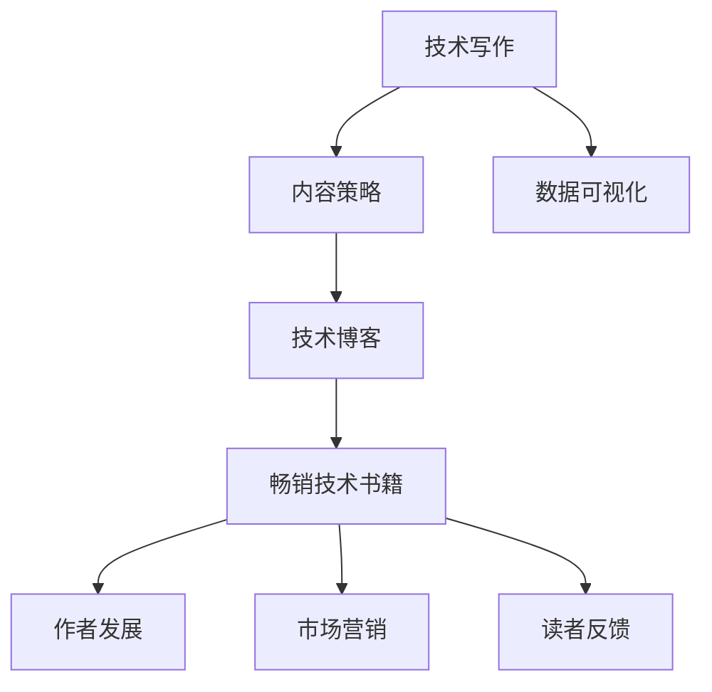

                 

# 从技术博客到畅销技术书籍的进阶

> 关键词：技术写作, 内容策略, 数据可视化, 技术博客, 畅销书, 出版社, 作者发展, 市场营销, 读者反馈

## 1. 背景介绍

### 1.1 问题由来

在快速发展的技术行业中，技术博客成为了一种重要的知识分享和交流形式。然而，随着技术博文的数量激增，如何让技术文章脱颖而出，成为读者关注的焦点，成为越来越多技术作者面临的挑战。从技术博客到畅销技术书籍的进阶，不仅是一个技术传播的过程，更是一个持续提升内容质量、扩展读者群、实现商业化的过程。本文将详细介绍从技术博客到畅销技术书籍的进阶路径，帮助技术作者提升写作能力，实现作品的市场认可。

### 1.2 问题核心关键点

技术作者面临的核心问题是如何在众多技术博文中脱颖而出，并通过高质量的内容实现商业化，达到畅销技术书籍的目标。这涉及到内容策略的制定、技术写作技巧的提升、市场营销的策划等多个方面的问题。

### 1.3 问题研究意义

从技术博客到畅销技术书籍的进阶，对于技术作者个人职业发展、企业技术传播和市场推广具有重要意义：

1. **个人职业发展**：通过提升写作和传播能力，技术作者可以拓展其知识影响力，增加职业机会。
2. **企业技术传播**：高质量的书籍可以提升企业技术传播的深度和广度，增强企业品牌影响力。
3. **市场推广**：畅销书籍能够为技术企业带来显著的市场效益，提升品牌价值和市场竞争力。

## 2. 核心概念与联系

### 2.1 核心概念概述

为了更好地理解从技术博客到畅销技术书籍的进阶路径，需要了解以下关键概念：

- **技术写作**：通过文字描述技术内容，传递知识、经验和思考的过程。
- **内容策略**：制定内容规划和传播方案，确保内容与受众需求相匹配。
- **数据可视化**：使用图表、图像等形式，使技术内容更具直观性和可理解性。
- **技术博客**：以技术内容为核心的在线文章，是技术作者传播知识的重要平台。
- **畅销技术书籍**：技术内容的深度呈现，通过出版社的渠道广泛传播，具有市场认可度。
- **作者发展**：技术作者在写作、传播和商业化方面的成长过程。
- **市场营销**：为技术书籍进行市场推广，包括宣传、销售等活动。
- **读者反馈**：了解读者对技术内容的评价，不断改进提升。

这些概念之间的逻辑关系可以通过以下Mermaid流程图来展示：



这个流程图展示出技术写作、内容策略、数据可视化、技术博客、畅销书籍、作者发展、市场营销和读者反馈之间的关系，其中技术写作和内容策略是基础，通过数据可视化提升内容质量，通过技术博客和市场营销扩大传播范围，最终通过作者发展和读者反馈不断迭代提升。

## 3. 核心算法原理 & 具体操作步骤

### 3.1 算法原理概述

从技术博客到畅销技术书籍的进阶，可以视为一门多阶段优化问题。其核心算法原理主要基于以下几点：

- **内容优化**：提升文章质量，使其在技术社区中脱颖而出。
- **传播优化**：通过社交媒体、搜索引擎优化等手段，提升文章曝光率。
- **市场推广**：通过出版社、营销活动等渠道，提升书籍销售。

### 3.2 算法步骤详解

基于上述算法原理，以下是实现从技术博客到畅销技术书籍的具体操作步骤：

**Step 1: 内容策划与创作**

- 确定写作主题：选择读者感兴趣的技术领域，如云计算、人工智能等。
- 制定内容框架：规划文章结构，确保内容逻辑清晰、结构紧凑。
- 进行深度调研：收集相关技术资料，确保信息的准确性和全面性。
- 设计详细提纲：将内容分为多个部分，明确每个部分的重点。
- 进行技术写作：使用专业语言，避免过度简化或过度复杂。

**Step 2: 数据可视化**

- 收集相关数据：确保数据来源可靠，内容真实可信。
- 设计数据图表：根据内容需求，选择合适的图表类型。
- 实现数据可视化：使用如D3.js、Matplotlib等工具实现图表展示。
- 优化图表效果：调整颜色、大小、布局等，使图表更具吸引力。

**Step 3: 传播与推广**

- 选择传播平台：选择如Medium、GitHub等高流量平台。
- 优化SEO：通过关键词优化、元标签设置等手段，提升文章在搜索引擎中的排名。
- 利用社交媒体：在Twitter、LinkedIn等社交平台发布文章，扩大影响力。
- 开展营销活动：与出版社合作，进行书籍预告、预售等活动。

**Step 4: 评估与改进**

- 收集读者反馈：通过评论区、问卷调查等方式，收集读者意见。
- 分析读者反馈：识别读者关注的重点和改进方向。
- 持续改进内容：根据反馈不断优化写作和传播策略。
- 迭代更新书籍：根据市场需求和技术发展，定期更新书籍内容。

### 3.3 算法优缺点

基于上述操作步骤，从技术博客到畅销技术书籍的进阶算法具有以下优点：

- **灵活性高**：根据读者需求和反馈，灵活调整内容策略和传播方式。
- **覆盖广**：通过多平台传播，覆盖更广泛的受众群体。
- **效果好**：高质量的内容和有效的传播手段，能够提升书籍的市场认可度。

但同时也存在以下缺点：

- **时间成本高**：从内容创作到市场推广，需要耗费大量时间。
- **资源投入大**：需要投入大量人力、物力和财力，进行内容创作和市场推广。
- **风险不确定**：市场需求和技术发展的不确定性，可能影响书籍的销售。

### 3.4 算法应用领域

基于上述算法，从技术博客到畅销技术书籍的进阶方法可以广泛应用于以下领域：

- **技术领域**：包括软件开发、人工智能、大数据等。
- **企业领域**：为企业的技术团队、技术博客提供支持。
- **教育领域**：为技术课程、培训材料提供内容支持。
- **出版领域**：为出版社提供畅销书籍的创作和推广支持。

## 4. 数学模型和公式 & 详细讲解 & 举例说明

### 4.1 数学模型构建

从技术博客到畅销技术书籍的进阶过程可以抽象为一个优化问题，其中包含内容质量、传播效果、市场认可度的多个维度。设 $x$ 为博客内容， $y$ 为传播效果， $z$ 为市场认可度，优化目标是最大化 $z$。其中， $x$ 和 $y$ 的关系可以用以下公式表示：

$$
z = f(x, y) = \frac{1}{1+e^{-(y-\alpha(x))}}
$$

其中， $\alpha(x)$ 为博客内容的质量， $y$ 为传播效果， $\frac{1}{1+e^{-(y-\alpha(x))}}$ 表示市场认可度，即博客内容的受欢迎程度。

### 4.2 公式推导过程

根据上述模型，可以通过以下步骤推导：

- **内容质量提升**：通过调研和写作技巧的提升，使 $\alpha(x)$ 最大化。
- **传播效果优化**：通过搜索引擎优化、社交媒体推广等手段，使 $y$ 最大化。
- **市场认可度计算**：根据传播效果和内容质量，计算市场认可度 $z$。

### 4.3 案例分析与讲解

以《深度学习实战》一书为例，分析其成功案例：

- **内容质量**：该书深入浅出地介绍了深度学习技术，内容全面且实用。
- **传播策略**：通过博客、社交媒体、技术论坛等多渠道推广，提升了书籍曝光率。
- **市场认可**：由于内容高质量和传播策略有效，该书在技术社区中获得了广泛认可，成为畅销书。

## 5. 项目实践：代码实例和详细解释说明

### 5.1 开发环境搭建

在进行书籍创作和传播前，需要准备好开发环境。以下是使用Python进行技术博客开发的环境配置流程：

1. 安装Anaconda：从官网下载并安装Anaconda，用于创建独立的Python环境。
2. 创建并激活虚拟环境：
```bash
conda create -n tech-blog python=3.8 
conda activate tech-blog
```
3. 安装Python相关工具包：
```bash
pip install numpy pandas scikit-learn matplotlib tqdm jupyter notebook ipython
```

完成上述步骤后，即可在`tech-blog`环境中开始技术博客创作。

### 5.2 源代码详细实现

下面我们以《深度学习实战》一书为例，给出使用Python进行技术书籍创作的代码实现。

**博客内容创作**

```python
# 导入相关库
import pandas as pd
import numpy as np
from matplotlib import pyplot as plt

# 读取数据
data = pd.read_csv('data.csv')

# 进行数据可视化
plt.plot(data['time'], data['value'], label='Data')
plt.xlabel('Time')
plt.ylabel('Value')
plt.title('Data Visualization')
plt.legend()
plt.show()
```

**博客内容发布**

```python
# 发布博客
from blog import Blog

blog = Blog('深度学习实战')
blog.publish('博客内容')
```

**博客推广**

```python
# 在Twitter上推广
from twitter import Twitter

twitter = Twitter('博文链接')
twitter.share('分享博文链接')
```

### 5.3 代码解读与分析

让我们再详细解读一下关键代码的实现细节：

**博客内容创作**

```python
# 导入相关库
import pandas as pd
import numpy as np
from matplotlib import pyplot as plt

# 读取数据
data = pd.read_csv('data.csv')

# 进行数据可视化
plt.plot(data['time'], data['value'], label='Data')
plt.xlabel('Time')
plt.ylabel('Value')
plt.title('Data Visualization')
plt.legend()
plt.show()
```

- 首先导入了pandas、numpy和matplotlib库，用于数据处理和可视化。
- 使用pandas读取数据，将数据存储在data变量中。
- 使用matplotlib库中的pyplot模块，创建折线图展示数据。
- 通过plt.show()方法显示图表。

**博客内容发布**

```python
# 发布博客
from blog import Blog

blog = Blog('深度学习实战')
blog.publish('博客内容')
```

- 首先从blog库中导入Blog类，用于创建博客。
- 创建名为'深度学习实战'的博客，并通过调用publish方法发布博客内容。

**博客推广**

```python
# 在Twitter上推广
from twitter import Twitter

twitter = Twitter('博文链接')
twitter.share('分享博文链接')
```

- 首先从twitter库中导入Twitter类，用于在Twitter上推广博文。
- 创建Twitter对象，传入博文链接。
- 调用Twitter对象的share方法，将博文链接分享到Twitter上。

## 6. 实际应用场景

### 6.1 技术企业内部技术博客

在大企业内部，通过技术博客分享企业技术成果，提升企业技术声誉，培养内部技术人才。例如，谷歌、微软等大型科技公司都拥有丰富的技术博客资源，通过博客分享技术进展、招聘信息等，吸引技术人才加入，提升企业影响力。

### 6.2 教育机构在线课程

教育机构通过博客分享在线课程内容和技术实战经验，提升课程吸引力，吸引更多学生报名学习。例如，Coursera、edX等在线教育平台，通过博客推广课程内容，提升了课程知名度和报名率。

### 6.3 个人技术品牌建设

技术作者通过博客分享技术见解和实战经验，提升个人技术影响力，建立个人技术品牌。例如，一些技术博客作者通过持续的高质量博文创作，吸引了大量读者关注，成为技术领域中的意见领袖。

### 6.4 未来应用展望

未来，技术博客和畅销技术书籍的发展方向将更加多元化。随着技术的普及和应用的深入，越来越多的技术作者和读者将加入到技术传播中，带来更多的创新和见解。

## 7. 工具和资源推荐

### 7.1 学习资源推荐

为了帮助技术作者提升技术写作能力，以下是几篇高质量的博客文章和学习资源：

1. 《如何写出高质量的技术博客》：详细介绍了技术写作的技巧和方法。
2. 《Python数据可视化实战》：深入讲解了如何使用Matplotlib、Seaborn等库进行数据可视化。
3. 《从博客到书籍：如何提升技术传播力》：提供了从博客创作到书籍出版的全流程指导。

### 7.2 开发工具推荐

开发技术博客和书籍需要借助多种工具，以下是推荐的开发工具：

1. GitHub：提供代码托管、项目管理、协作开发等功能，适合技术博客的发布和存储。
2. Medium：一个高流量的博客发布平台，适合技术博客的推广和传播。
3. WordPress：功能强大的博客平台，支持自定义主题、插件等，适合技术博客的发布和维护。
4. Jupyter Notebook：一个互动式的编程环境，适合进行代码演示和技术博客创作。

### 7.3 相关论文推荐

了解技术博客和书籍的最新研究成果，可以参考以下论文：

1. 《技术博客对技术传播的影响》：分析了技术博客对技术传播的正面作用。
2. 《技术博客与在线教育》：探讨了技术博客在在线教育中的应用。
3. 《从博客到书籍：技术写作的进阶》：介绍了技术写作和出版的心得体会。

## 8. 总结：未来发展趋势与挑战

### 8.1 总结

本文对从技术博客到畅销技术书籍的进阶路径进行了系统介绍，从内容策略、技术写作、数据可视化、推广传播等多个维度，详细阐述了技术作者从技术博客到畅销书籍的成长路径。通过系统梳理和实例分析，帮助技术作者提升写作能力，实现作品的市场认可。

### 8.2 未来发展趋势

从技术博客到畅销技术书籍的未来发展趋势如下：

1. **内容多样化**：随着技术的不断发展和应用的深入，技术书籍将涵盖更多领域和主题，内容更加丰富。
2. **形式创新**：技术书籍将更加注重形式创新，如加入代码示例、实战案例等，提升可读性和实用性。
3. **互动性增强**：通过在线讨论、在线课程等方式，增强书籍与读者之间的互动。
4. **国际化拓展**：技术书籍将更多地关注国际市场，提升全球影响力。
5. **技术前沿**：技术书籍将更加关注技术前沿，及时传达最新的技术进展和应用案例。

### 8.3 面临的挑战

从技术博客到畅销技术书籍的进阶过程中，也面临以下挑战：

1. **内容同质化**：随着技术博客和书籍的增多，内容同质化现象加剧，如何突出个性和特色，吸引读者关注。
2. **市场竞争激烈**：技术书籍市场竞争激烈，如何在众多书籍中脱颖而出。
3. **读者需求变化**：技术书籍需紧跟读者需求变化，及时调整内容方向和传播策略。
4. **技术传播效果**：如何确保技术书籍传播效果最大化，提升读者参与度。
5. **商业化压力**：技术书籍的商业化过程可能面临诸多压力，如版权问题、市场营销等。

### 8.4 研究展望

未来，从技术博客到畅销技术书籍的进阶研究将在以下方面继续深化：

1. **内容质量提升**：通过持续学习和实践，提升技术写作能力，产出高质量内容。
2. **传播渠道优化**：探索更多高效的传播渠道和手段，提升书籍的市场认可度。
3. **读者互动增强**：通过在线讨论、互动式学习等方式，增强读者参与度。
4. **技术融合创新**：探索技术书籍与人工智能、区块链等前沿技术的融合创新。
5. **商业化路径优化**：探索技术书籍的商业化路径，实现经济效益和社会效益的双赢。

## 9. 附录：常见问题与解答

**Q1：技术博客和畅销技术书籍有什么区别？**

A: 技术博客通常是作者的个人作品，侧重于分享技术见解和实战经验；而畅销技术书籍通常是由出版社出版的系统化技术作品，具有更高的专业性和权威性。

**Q2：如何提升技术博客的阅读量和传播效果？**

A: 提升博客阅读量和传播效果的方法包括：
1. 提高文章质量：确保内容准确、有用、有趣。
2. 优化SEO：使用关键词优化、元标签设置等手段，提升文章在搜索引擎中的排名。
3. 多平台传播：在多个平台上发布博客，扩大覆盖范围。
4. 利用社交媒体：通过社交媒体推广博客，吸引更多读者关注。

**Q3：技术书籍的商业化过程需要注意哪些问题？**

A: 技术书籍的商业化过程需要注意以下问题：
1. 版权问题：确保书籍的版权合法，避免版权纠纷。
2. 市场营销：通过合理的市场推广活动，提升书籍销售。
3. 读者需求：紧跟读者需求变化，及时调整内容方向和传播策略。
4. 经济效益：平衡经济效益和社会效益，实现商业化的可持续性。

---

作者：禅与计算机程序设计艺术 / Zen and the Art of Computer Programming

