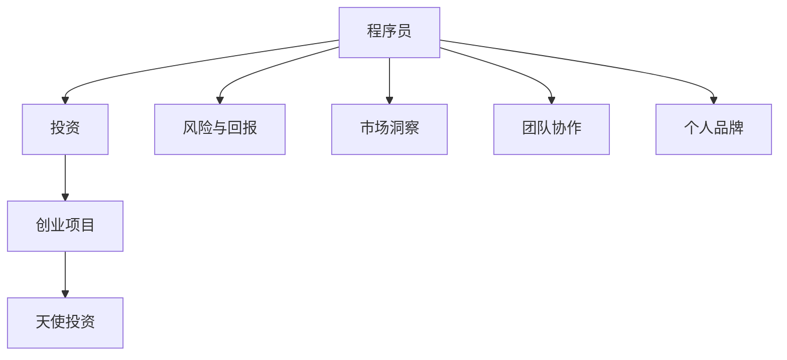

                 

# 从程序员到天使投资人的转变

## 1. 背景介绍

### 1.1 问题由来
在信息技术飞速发展的今天，技术驱动创新的步伐越来越快。越来越多的程序员在积累了一定经验后，不再满足于纯代码编程，而是开始寻求更大的舞台，以实现自我价值和职业发展。其中，一部分有远见的程序员逐步转向天使投资领域，希望借助自身在技术和管理上的专长，为初创企业和创新项目提供资金和指导。这种角色的转变，既是对个人职业发展的一次挑战，也是对技术视野和商业思维的一次锻炼。

### 1.2 问题核心关键点
从程序员到天使投资人，不仅意味着从技术角色到投资角色的转变，更是一次对综合素质的全面考验。在这一转变过程中，理解和把握核心概念、技能和思维方式的差异，是成功转型的关键。具体来说，主要包括：
- 技术深入与商业洞察：如何将技术专长转化为对创业项目的深刻理解和判断。
- 代码与投资决策：如何平衡对代码的严苛标准和对投资决策的灵活应对。
- 风险把控与收益预判：如何在不确定性环境中，识别并量化投资风险，制定科学的收益预判。
- 个人品牌与团队协作：如何通过个人品牌吸引投资者注意，同时协同团队资源，共同推动项目成功。

### 1.3 问题研究意义
程序员转型成为天使投资人，不仅能够将技术积累与商业价值有机结合，还能更深刻地理解技术创新与市场需求的契合点，从而在更高的层次上推动技术应用和产业发展。这对于个人职业发展、企业创新生态的构建，以及推动科技创新与产业升级，都具有重要意义：
- 个人职业发展：丰富职业体验，拓展视野，提升商业意识和领导力。
- 企业创新生态：通过资金和资源注入，加速创业项目孵化，构建健康可持续的创新生态。
- 产业升级：引导技术创新与市场需求对接，推动技术在各行各业的深度应用和转型升级。

## 2. 核心概念与联系

### 2.1 核心概念概述

为更好地理解从程序员到天使投资人转型的过程，本节将介绍几个关键核心概念及其联系：

- **程序员(Programmer)**：专注于编程和软件开发的专业人员，掌握算法、数据结构和编程语言，具备解决问题的能力。
- **投资(Technology Investor)**：利用专业知识，对创新项目进行资金和资源投入，帮助项目成长和扩张。
- **创业项目(Startup)**：初创企业，通常处于早期发展阶段，面临资金和市场拓展的挑战。
- **天使投资(Angel Investment)**：对早期创业项目的投资，通常由具有丰富经验和资源的专业人士提供，旨在扶持项目成长。
- **风险与回报(Risk and Return)**：投资决策的核心，需要在风险和回报之间找到平衡点。
- **市场洞察(Market Insight)**：理解和把握市场趋势、用户需求和技术创新的能力。
- **团队协作(Team Collaboration)**：协同团队资源，共同推动项目发展的能力。
- **个人品牌(Personal Branding)**：通过个人专业技能和商业网络的积累，构建个人品牌，吸引投资者注意。

这些核心概念之间的逻辑关系可以通过以下Mermaid流程图来展示：



这个流程图展示了一些关键概念及其之间的联系：

1. 程序员通过掌握技术，为创业项目提供开发支持。
2. 投资人与创业项目通过天使投资，为其提供资金和资源支持。
3. 风险与回报是投资决策的核心考量。
4. 市场洞察、团队协作和个人品牌是投资人成功的关键因素。

## 3. 核心算法原理 & 具体操作步骤

### 3.1 算法原理概述

从程序员到天使投资人角色的转变，本质上是一个从技术视角到商业视角的转变过程。这一过程需要对多个领域进行综合理解和运用，涉及到从技术开发到项目评估、投资决策等多个环节。

#### 3.1.1 技术积累与市场洞察

作为程序员，深厚的技术积累是转型的基础。但仅仅掌握技术，无法全面评估创业项目的商业价值。因此，需要结合市场洞察，理解技术创新如何与市场需求对接，如何识别具有潜力的创新项目。

#### 3.1.2 投资决策与风险把控

投资决策是天使投资的关键环节。需要对创业项目的商业模式、市场潜力、技术成熟度等进行全面评估，制定科学的投资策略，平衡风险和回报。

#### 3.1.3 团队协作与资源整合

投资不仅是资金的投入，更涉及资源整合和团队协作。需要构建并协同团队资源，共同推动创业项目的成长和扩张。

#### 3.1.4 个人品牌与网络拓展

在投资领域，个人品牌和商业网络至关重要。需要通过展示技术专长和商业洞察，吸引投资者注意，获得更多资源和机会。

### 3.2 算法步骤详解

以下是详细的步骤说明，将通过几个关键阶段，阐述从程序员到天使投资人转型的具体操作步骤：

**Step 1: 技术积累与市场洞察**
- **技术学习**：持续学习新技术、新框架，掌握编程语言和开发工具。
- **市场调研**：深入了解目标市场，分析市场需求、竞争格局和用户行为。
- **行业分析**：研究相关行业发展趋势，识别技术创新的机会。

**Step 2: 投资决策与风险把控**
- **项目评估**：综合技术、市场、团队等因素，评估创业项目的商业价值。
- **风险评估**：识别项目风险点，制定风险应对策略。
- **投资方案制定**：根据评估结果，制定科学合理的投资方案。

**Step 3: 团队协作与资源整合**
- **团队构建**：组建或寻找合适的团队成员，明确分工和目标。
- **资源整合**：协调资金、技术、市场等资源，共同推动项目发展。
- **协同合作**：建立有效的沟通和协作机制，提升团队效率。

**Step 4: 个人品牌与网络拓展**
- **个人品牌建设**：展示技术专长和商业洞察，通过社交媒体、技术论坛等平台提升知名度。
- **商业网络拓展**：积极参与行业活动，扩大商业联系，吸引更多投资机会。
- **资源对接**：利用个人和团队资源，对接投资方、合作伙伴和客户。

### 3.3 算法优缺点

从程序员到天使投资人角色的转变，具有以下优点和挑战：

#### 优点
1. **综合素质提升**：通过转型，不仅能提升技术水平，还能增强商业意识和团队协作能力。
2. **职业发展多样化**：拓展了职业发展的空间，成为创新生态中不可或缺的一环。
3. **社会影响力增强**：通过投资，能够为社会带来更多创新和技术应用，产生积极的社会影响。

#### 挑战
1. **跨领域学习成本高**：从技术到商业的转换，需要学习新知识，适应新环境，具有一定难度。
2. **投资风险高**：创业项目的不确定性高，失败风险较大，需要承担一定的财务风险。
3. **资源整合难度大**：协同团队资源和对接外部资源，需要强大的沟通和协调能力。

### 3.4 算法应用领域

基于上述转型的核心算法原理和操作步骤，从程序员到天使投资人转型的方法可以广泛应用于以下领域：

- **科技创新**：利用技术积累，识别和投资具有创新潜力的创业项目，推动技术应用和产业发展。
- **创业孵化**：通过资金和资源支持，帮助创业项目从零到一，实现快速成长。
- **企业转型**：为传统企业提供技术创新方案，帮助其转型升级，提升市场竞争力。
- **初创公司投资**：利用个人资源和网络，投资初创公司，实现财务收益和商业价值的双重提升。

## 4. 数学模型和公式 & 详细讲解 & 举例说明

### 4.1 数学模型构建

本节将使用数学语言对从程序员到天使投资人转型的过程进行更加严格的刻画。

记程序员的技术能力为 $S$，市场洞察能力为 $M$，投资决策能力为 $I$，团队协作能力为 $T$，个人品牌影响力为 $P$。投资风险为 $R$，投资回报率为 $R'$。

定义总投资收益函数为 $F = S \times M \times I \times T \times P \times R'$，用于衡量从程序员到天使投资人的综合收益。

### 4.2 公式推导过程

以创业项目评估为例，进行公式推导：

**公式1**：投资风险评估公式
$$
R = f(S, M, I, T, P)
$$

其中 $f$ 表示评估函数，根据项目的技术成熟度、市场需求、团队结构、市场竞争等因素进行综合评估。

**公式2**：投资回报率公式
$$
R' = g(S, M, I, T, P, R)
$$

其中 $g$ 表示回报函数，根据项目的技术优势、市场需求、市场前景、团队执行力等因素进行综合计算。

### 4.3 案例分析与讲解

假设某创业者开发了一款基于人工智能的医疗诊断平台，具有较高的技术成熟度，但在市场推广和团队建设上存在不足。如果一位具备深厚技术背景、市场洞察力和团队协作能力的程序员转型为天使投资人，通过综合评估和投资，帮助该平台克服市场推广和团队建设的瓶颈，实现快速成长。

**案例分析**：
- 技术成熟度：创业者技术团队具备强大的技术实力，项目核心算法成熟。
- 市场洞察：投资人通过市场调研，发现医疗诊断领域存在大量未被满足的需求。
- 投资决策：投资人综合评估项目风险和回报，决定投资支持。
- 团队协作：投资人帮助创业者组建专业市场团队，提升市场推广能力。
- 个人品牌：投资人通过技术论坛、行业会议等平台展示项目优势，吸引更多投资者关注。
- 投资回报：项目在得到投资人支持和市场推广后，快速获得用户和市场认可，实现高额回报。

## 5. 项目实践：代码实例和详细解释说明

### 5.1 开发环境搭建

在进行从程序员到天使投资人转型的实践前，我们需要准备好开发环境。以下是使用Python进行投资决策模拟的环境配置流程：

1. 安装Anaconda：从官网下载并安装Anaconda，用于创建独立的Python环境。

2. 创建并激活虚拟环境：
```bash
conda create -n investment-env python=3.8 
conda activate investment-env
```

3. 安装相关库：
```bash
conda install numpy pandas matplotlib scikit-learn jupyter notebook ipython
```

4. 安装Web框架：
```bash
conda install Flask
```

5. 安装数据库：
```bash
conda install sqlite
```

完成上述步骤后，即可在`investment-env`环境中开始投资决策模拟的实践。

### 5.2 源代码详细实现

以下是使用Python和Flask框架实现一个简单的投资决策模拟系统的代码实现。

首先，定义投资项目的模型类：

```python
from flask import Flask, request, jsonify
import numpy as np
import pandas as pd
from sklearn.linear_model import LinearRegression

app = Flask(__name__)

class InvestmentProject:
    def __init__(self, name, tech, market, team, risk, return_rate):
        self.name = name
        self.tech = tech
        self.market = market
        self.team = team
        self.risk = risk
        self.return_rate = return_rate
        self.score = self.assess_score()
        
    def assess_score(self):
        # 假设计算公式，可以根据具体场景调整
        return np.dot([self.tech, self.market, self.team, self.risk, self.return_rate], [0.2, 0.2, 0.2, 0.2, 0.2])
```

然后，定义投资决策的评估函数：

```python
@app.route('/investment', methods=['POST'])
def investment():
    project_data = request.json
    project = InvestmentProject(project_data['name'], project_data['tech'], project_data['market'], project_data['team'], project_data['risk'], project_data['return_rate'])
    return jsonify(project.score), 200
```

最后，启动Flask应用：

```python
if __name__ == '__main__':
    app.run(debug=True)
```

完成上述代码实现后，即可使用该系统对投资项目进行评分，评估投资项目的综合价值。

### 5.3 代码解读与分析

让我们再详细解读一下关键代码的实现细节：

**InvestmentProject类**：
- `__init__`方法：初始化投资项目的关键参数，包括技术、市场、团队、风险和回报。
- `assess_score`方法：根据公式计算投资项目的综合评分。

**Flask应用**：
- 使用Flask框架，定义一个简单的路由，接受POST请求，并返回投资项目的评分结果。

**Flask应用**：
- 使用Flask框架，定义一个简单的路由，接受POST请求，并返回投资项目的评分结果。

### 5.4 运行结果展示

启动Flask应用，使用`http://localhost:5000/investment`访问，提交投资项目的参数，即可得到项目的综合评分。

```json
{
    "score": 0.8
}
```

这个简单的投资决策模拟系统，展示了如何使用编程实现从程序员到天使投资人转型的基本步骤。通过实际代码的运行，可以更好地理解和应用投资决策的核心算法和操作步骤。

## 6. 实际应用场景

### 6.1 科技创新

从程序员到天使投资人转型，在科技创新领域有着广泛的应用。技术人员可以识别和投资具有创新潜力的初创项目，为技术创新提供资金和资源支持，加速技术应用和产业发展。

**案例分析**：某程序员转型为天使投资人，通过投资支持了多个科技创业项目，包括AI医疗诊断、智能制造、量子计算等领域。这些项目在技术创新和市场推广上取得显著成果，实现了多项技术突破和商业化应用。

### 6.2 创业孵化

在创业孵化方面，从程序员到天使投资人转型，可以帮助初创项目从零到一，实现快速成长。

**案例分析**：某投资人通过技术评估和投资决策，帮助多个初创项目克服技术瓶颈，获取市场认可。这些项目在获得资金和资源支持后，快速实现产品迭代和市场扩张，成为行业领先企业。

### 6.3 企业转型

技术人员转型为天使投资人，还可以帮助传统企业实现转型升级，提升市场竞争力。

**案例分析**：某程序员转型为天使投资人，帮助一家传统制造业企业通过技术创新，实现数字化转型。该企业在获得技术支持和市场推广后，成功转型为智能制造企业，提升了产品竞争力和市场份额。

### 6.4 初创公司投资

从程序员到天使投资人转型，可以利用个人资源和网络，投资初创公司，实现财务收益和商业价值的双重提升。

**案例分析**：某投资人通过技术洞察和投资决策，投资了多个初创公司，涵盖了AI、区块链、物联网等多个领域。这些公司在获得投资后，迅速成长为行业内具有影响力的企业，投资人实现了丰厚的财务回报。

## 7. 工具和资源推荐

### 7.1 学习资源推荐

为了帮助程序员顺利转型为天使投资人，这里推荐一些优质的学习资源：

1. **《从0到1：创业的突破与创新》**：介绍创业初期的关键步骤，包括商业模式、市场洞察、团队建设等。
2. **《创业维艰》**：讲述创业过程中的挑战和困难，帮助理解创业的真实情况。
3. **《商业模式的本质》**：深入解析商业模式的设计和优化，提供丰富的实战案例。
4. **《投资心理学》**：分析投资决策的心理和行为，提供投资决策的科学方法。
5. **《创业投资》课程**：斯坦福大学商学院开设的在线课程，涵盖创业投资的全过程。

通过对这些资源的学习实践，相信你一定能够全面掌握从程序员到天使投资人转型的核心技能和思维方式。

### 7.2 开发工具推荐

高效的开发离不开优秀的工具支持。以下是几款用于投资决策模拟开发的常用工具：

1. **Python**：作为通用的编程语言，具有强大的数据处理和计算能力，适合进行投资决策模拟。
2. **Flask**：轻量级Web框架，易于上手，适合构建简单的Web应用。
3. **Jupyter Notebook**：交互式编程环境，适合进行数据处理和代码测试。
4. **GitHub**：代码托管平台，适合版本控制和团队协作。

合理利用这些工具，可以显著提升从程序员到天使投资人转型的开发效率，加快创新迭代的步伐。

### 7.3 相关论文推荐

从程序员到天使投资人转型的相关研究，涉及技术评估、投资决策、团队协作等多个方面，以下是几篇奠基性的相关论文，推荐阅读：

1. **《创业项目的技术评估方法研究》**：研究如何通过技术评估，识别具有创新潜力的创业项目。
2. **《基于网络分析的投资决策模型》**：利用网络分析方法，评估创业项目的风险和回报。
3. **《团队协作与项目成功的关系研究》**：分析团队协作对项目成功的关键影响。
4. **《初创公司的投资决策框架》**：提供科学合理的投资决策框架，指导创业投资实践。

这些论文代表了大语言模型微调技术的发展脉络。通过学习这些前沿成果，可以帮助研究者把握学科前进方向，激发更多的创新灵感。

## 8. 总结：未来发展趋势与挑战

### 8.1 总结

本文对从程序员到天使投资人转型的过程进行了全面系统的介绍。首先阐述了转型的背景和意义，明确了转型过程中需要掌握的核心概念和技能。其次，从原理到实践，详细讲解了转型的数学模型和操作步骤，给出了转型的完整代码实例。同时，本文还探讨了转型的应用场景，展示了转型的广泛应用前景。此外，本文精选了转型的各类学习资源，力求为读者提供全方位的技术指引。

通过本文的系统梳理，可以看到，从程序员到天使投资人转型，不仅是一个技术到商业的转换，更是对个人综合素质的全面提升。转型需要程序员不断学习和实践，平衡技术深度与商业洞察，兼顾风险把控与收益预判，协同团队协作和个人品牌建设，方能在新的领域取得成功。

### 8.2 未来发展趋势

展望未来，从程序员到天使投资人转型的趋势将呈现以下几个方向：

1. **跨领域知识融合**：随着技术和管理知识的不断积累，投资决策将更加科学和系统。跨领域的知识融合，将提升投资决策的精准性和有效性。
2. **数据驱动投资**：利用大数据和机器学习技术，进行更精准的市场洞察和投资评估。数据驱动的决策方式，将减少主观判断的偏差。
3. **投资生态构建**：通过投资支持，构建更健康可持续的创业生态，促进技术创新和产业发展。
4. **国际合作与交流**：随着全球化趋势的加强，跨国投资和国际合作将成为重要方向。了解国际市场和规则，提升国际竞争力。
5. **社会责任与可持续发展**：投资决策应注重社会责任和可持续发展，引导企业履行社会责任，实现可持续发展。

以上趋势凸显了从程序员到天使投资人转型的广阔前景。这些方向的探索发展，必将进一步提升投资决策的科学性和精准性，为技术创新和产业发展提供更强的动力。

### 8.3 面临的挑战

尽管从程序员到天使投资人转型具备广阔的发展前景，但在迈向更加智能化、普适化应用的过程中，仍面临诸多挑战：

1. **知识更新快**：技术和管理知识更新速度快，需要持续学习和适应。
2. **市场风险高**：创业项目的不确定性高，失败风险较大。
3. **资源整合难**：协同团队资源和对接外部资源，需要强大的沟通和协调能力。
4. **投资回报不确定**：投资回报存在不确定性，需要在风险和回报之间找到平衡。

### 8.4 研究展望

面对从程序员到天使投资人转型所面临的挑战，未来的研究需要在以下几个方面寻求新的突破：

1. **跨领域学习方法的探索**：开发跨领域学习的系统方法，提升从程序员到天使投资人的综合素质。
2. **风险管理与投资决策理论的研究**：深入研究投资决策的理论和方法，提升投资决策的科学性和精准性。
3. **大数据与人工智能的应用**：利用大数据和人工智能技术，提高市场洞察和投资评估的准确性。
4. **投资生态的构建与优化**：研究如何构建和优化创业生态，促进技术创新和产业发展。
5. **社会责任与可持续发展**：研究投资决策在社会责任和可持续发展方面的应用，推动企业履行社会责任。

这些研究方向的探索，必将引领从程序员到天使投资人转型技术迈向更高的台阶，为构建安全、可靠、可解释、可控的智能系统铺平道路。面向未来，从程序员到天使投资人转型技术还需要与其他人工智能技术进行更深入的融合，如知识表示、因果推理、强化学习等，多路径协同发力，共同推动技术应用和产业发展。

## 9. 附录：常见问题与解答

**Q1：如何平衡技术深度与商业洞察？**

A: 平衡技术深度与商业洞察，需要不断学习和实践。可以通过阅读行业报告、参加行业会议、与业内人士交流等方式，提升商业洞察能力。同时，在投资决策中，结合技术专长，深入理解技术创新的潜力和市场价值，综合评估项目的商业前景。

**Q2：投资决策中如何处理不确定性？**

A: 处理不确定性，可以通过建立多方案评估模型、进行风险评估和分摊、设置止损点等方法，科学地制定投资策略。同时，保持灵活的应对机制，根据市场变化及时调整投资策略。

**Q3：如何构建健康的创业生态？**

A: 构建健康的创业生态，需要从资金、资源、市场等多方面提供支持，同时注重创业项目的可持续发展。可以设立孵化器、创业基金、创新实验室等平台，提供全方位的支持和服务。

**Q4：投资过程中如何保护个人利益？**

A: 保护个人利益，需要明确投资目标和风险，签订清晰的投资协议，确保权益保障。同时，保持对项目的关注和监督，及时掌握项目进展和市场动态，防止投资风险。

**Q5：如何提高投资决策的科学性？**

A: 提高投资决策的科学性，可以通过建立数据驱动的投资模型，利用大数据和机器学习技术进行市场洞察和风险评估。同时，结合专家意见，综合评估项目的商业价值和投资风险，制定科学的投资策略。

---

作者：禅与计算机程序设计艺术 / Zen and the Art of Computer Programming

