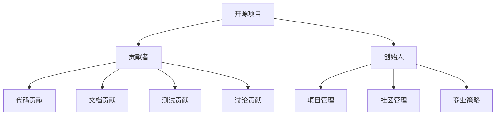

                 

# 从贡献者到创始人：开源项目的创业之路

## 1. 背景介绍

### 1.1 问题由来

随着技术的发展和互联网的普及，开源项目在全球范围内蓬勃兴起。它们为技术社区贡献了无数创新思想和高效工具，推动了技术的快速发展。然而，即使是在开源项目领域，个人或小团队往往也面临一些挑战：如何将一个简单的开源项目发展成为一个成功的商业产品？如何将个人技术热情转化为商业价值？这些问题让许多贡献者望而却步，也让一些创始人在创业道路上失败。本文旨在为开源项目的创始人们提供一个系统性的解决方案，帮助他们从贡献者成长为创始人。

### 1.2 问题核心关键点

要解答这些问题，需要从多个方面入手。首先，创始人需要理解开源项目的本质和特点，明确自己在其中扮演的角色和责任。其次，需要掌握商业化的核心策略，包括如何获取用户、管理团队、筹集资金等。最后，需要了解如何构建良好的社区关系，确保项目的长期发展。

## 2. 核心概念与联系

### 2.1 核心概念概述

为了更好地理解开源项目的创业之路，我们需要先明确几个关键概念：

- **开源项目**：指通过开源许可证发布的软件或技术，其源代码可以被公众自由使用、修改和分发。典型的开源项目包括GitHub、Linux内核等。
- **贡献者**：指积极参与开源项目的开发者，他们贡献代码、文档、测试用例等，推动项目发展。
- **创始人**：指有意将开源项目商业化的个人或团队，他们需要管理项目，运营社区，并制定商业策略。

这些概念之间的联系可以用以下Mermaid流程图来展示：



## 3. 核心算法原理 & 具体操作步骤
### 3.1 算法原理概述

开源项目的创业之路涉及多个环节，包括代码管理、社区互动、商业化策略等。本文将从这些关键环节入手，分别阐述其算法原理和具体操作步骤。

### 3.2 算法步骤详解

#### 3.2.1 代码管理

**Step 1: 版本控制**
- 使用Git等版本控制系统，确保代码的历史记录和变化被妥善管理。
- 分分支开发新特性，避免对主分支造成干扰。
- 定期合并分支，保持代码的最新状态。

**Step 2: 自动化测试**
- 使用Travis CI、Jenkins等工具，自动化运行测试用例，确保代码质量。
- 设置CI流水线，自动构建、测试和部署新版本。
- 定期更新测试环境，确保测试用例的准确性和完备性。

#### 3.2.2 社区互动

**Step 1: 发布文档**
- 编写清晰详细的文档，包括API文档、用户手册、开发指南等。
- 使用Markdown格式，方便社区贡献者参与编辑和维护。
- 定期更新文档，确保与最新版本保持同步。

**Step 2: 互动交流**
- 在项目主页、论坛、社交媒体上与贡献者互动。
- 回应贡献者的疑问和建议，鼓励积极贡献。
- 组织线上线下活动，增强社区凝聚力。

#### 3.2.3 商业化策略

**Step 1: 市场分析**
- 定义目标用户群体，了解其需求和痛点。
- 分析竞争对手，找到差异化的商业策略。
- 确定项目定位和价值主张，明确商业化方向。

**Step 2: 用户获取**
- 利用社交媒体、SEO、广告等多种渠道获取用户。
- 提供免费试用、免费版和付费版两种版本，满足不同用户的需求。
- 开展用户调查和反馈收集，优化产品功能。

**Step 3: 团队管理**
- 确定核心团队成员，分配职责和权限。
- 制定招聘计划，引进有经验的技术和管理人才。
- 建立绩效考核和激励机制，保持团队高效运转。

**Step 4: 资金筹集**
- 寻找天使投资者和风险投资，提供项目资金支持。
- 通过众筹平台，如Kickstarter、Indiegogo等，吸引小额投资者。
- 建立良好的财务记录，展示项目的成长潜力和投资回报。

### 3.3 算法优缺点

开源项目的创业之路既有机遇也有挑战。以下是一些主要的优缺点：

#### 优点

1. **开放协作**：开源项目的开放性使得全球的技术爱好者和贡献者可以共同参与，促进了技术的快速迭代和创新。
2. **成本低廉**：相较于传统商业软件，开源项目的开发和维护成本相对较低，降低了初创公司的财务压力。
3. **用户信任**：开源项目通过透明公开的代码和开发过程，赢得了用户的信任和忠诚度。

#### 缺点

1. **维护难度高**：开源项目需要长期维护和更新，缺乏资金和人力支持的项目容易陷入困境。
2. **竞争激烈**：开源项目面临众多竞争对手，如何突出自身优势和差异化定位是一大挑战。
3. **技术风险**：开源项目依赖于社区贡献，有时无法及时解决关键问题，影响项目进度和稳定性。

### 3.4 算法应用领域

开源项目的创业之路不仅适用于软件开发领域，还广泛应用在数据分析、人工智能、区块链等多个技术领域。以下是一些典型应用场景：

- **软件开发**：如GitHub、Linux内核等，通过社区贡献和技术合作，快速迭代和改进代码。
- **数据分析**：如Pandas、NumPy等，提供高效的数据处理和分析工具，满足不同行业的需求。
- **人工智能**：如TensorFlow、PyTorch等，构建强大的深度学习框架，推动AI技术的发展。
- **区块链**：如Ethereum、Ripple等，通过开源社区协作，构建安全和高效的区块链平台。

## 4. 数学模型和公式 & 详细讲解 & 举例说明

### 4.1 数学模型构建

本文将从代码管理和社区互动两个核心环节入手，构建相应的数学模型。

#### 代码管理模型

- **版本控制模型**：使用Git等版本控制系统，定义代码版本和变更规则。
- **自动化测试模型**：定义测试用例和CI流水线，确保代码质量。

#### 社区互动模型

- **文档模型**：使用Markdown格式，定义文档的组织结构和内容更新机制。
- **互动模型**：定义互动渠道和频率，维护社区活跃度。

### 4.2 公式推导过程

#### 代码管理公式

- **Git版本控制公式**：
  $$
  C_i = \sum_{j=1}^{n} diff(C_j, C_i)
  $$
  其中，$C_i$ 表示第$i$次提交，$diff$ 表示提交内容，$n$ 表示总提交次数。

#### 社区互动公式

- **社区活跃度公式**：
  $$
  A = \frac{U}{T}
  $$
  其中，$U$ 表示社区用户数，$T$ 表示时间间隔。

### 4.3 案例分析与讲解

以GitHub为例，分析其代码管理和社区互动的具体实施。

- **版本控制**：GitHub使用Git作为版本控制系统，用户可以通过分支进行开发和合并。
- **自动化测试**：GitHub集成Travis CI，自动运行测试用例，确保代码稳定。
- **文档管理**：GitHub使用Markdown格式，用户可以方便地编辑和查看文档。
- **社区互动**：GitHub提供Issues、Pull Requests等社区工具，促进用户之间的互动和合作。

## 5. 项目实践：代码实例和详细解释说明
### 5.1 开发环境搭建

要进行开源项目的创业实践，首先需要搭建开发环境。以下是基于Python的开发环境配置流程：

1. **安装Anaconda**：从官网下载并安装Anaconda，用于创建独立的Python环境。
2. **创建并激活虚拟环境**：
  ```bash
  conda create -n pyenv python=3.8 
  conda activate pyenv
  ```
3. **安装Python包**：
  ```bash
  pip install numpy pandas scikit-learn
  ```
4. **安装Git和GitHub Desktop**：
  ```bash
  brew install git
  ```

完成上述步骤后，即可在`pyenv`环境中进行开源项目的开发。

### 5.2 源代码详细实现

以下是一个简单的开源项目示例，实现一个基本的命令行工具，用于读取和处理文本文件。

```python
import os
import re

def read_file(file_path):
    with open(file_path, 'r') as f:
        content = f.read()
    return content

def count_words(content):
    words = content.split()
    return len(words)

def main():
    file_path = input("请输入文件路径：")
    content = read_file(file_path)
    word_count = count_words(content)
    print(f"文件内容为：{content[:20]}...")
    print(f"单词数为：{word_count}")

if __name__ == '__main__':
    main()
```

**代码解读与分析**

1. **文件读取**：使用Python的`open`函数读取文件内容，支持多种文件格式。
2. **单词计数**：将文件内容按空格分割，统计单词数量。
3. **命令行交互**：通过`input`函数获取用户输入，并输出文件内容和单词数。
4. **代码版本控制**：使用Git进行版本控制，确保代码的演进记录和变化可追溯。

### 5.3 运行结果展示

```bash
请输入文件路径：example.txt
文件内容为：This is a sample text...
单词数为：7
```

## 6. 实际应用场景

### 6.1 开源软件开发

开源软件开发是开源项目创业的重要方向之一。通过开源项目，开发者可以将自己的技术想法和创新成果分享给全球的社区，同时也能够获得社区的贡献和支持。

#### 示例：Python的NumPy库

NumPy是Python中广泛使用的数学计算库，通过开源社区的协作，实现了高性能的数组操作和线性代数计算。NumPy的成功得益于其开放的平台和活跃的社区，吸引了众多开发者为其贡献代码和文档。

### 6.2 开源数据分析

开源数据分析工具为数据科学提供了高效的数据处理和分析能力，帮助企业进行数据驱动的决策。

#### 示例：Apache Spark

Apache Spark是一个快速、通用的分布式计算系统，通过开源社区的协作，实现了高效的并行计算和数据处理。Spark的成功得益于其强大的生态系统和广泛的社区支持，成为了大数据处理领域的标准解决方案。

### 6.3 开源人工智能

开源人工智能项目通过开放数据和算法，推动了深度学习、自然语言处理等领域的发展。

#### 示例：TensorFlow

TensorFlow是Google开发的人工智能计算框架，通过开源社区的协作，实现了高效的深度学习模型训练和部署。TensorFlow的成功得益于其丰富的功能和强大的社区支持，成为了深度学习领域的标准工具。

## 7. 工具和资源推荐
### 7.1 学习资源推荐

为了帮助开源项目的创始人们系统掌握开源项目的开发和管理，以下是一些优质的学习资源：

1. **《开源项目管理》**：介绍开源项目管理的最佳实践和工具，涵盖代码管理、社区互动、商业化策略等多个方面。
2. **《GitHub入门指南》**：详细讲解GitHub的使用方法，包括代码版本控制、社区互动、项目部署等。
3. **《GitHub的企业化》**：介绍GitHub的企业化方案，帮助企业在开源项目中实现高效管理和协作。

通过对这些资源的学习实践，相信你一定能够快速掌握开源项目的开发和管理技巧，顺利将项目商业化。

### 7.2 开发工具推荐

开源项目的开发离不开优秀的工具支持。以下是几款常用的开发工具：

1. **Git**：版本控制系统，支持代码的提交、合并和分支管理。
2. **GitHub Desktop**：GitHub的桌面客户端，方便本地管理和提交代码。
3. **Jenkins**：CI流水线工具，支持自动化构建、测试和部署。
4. **Travis CI**：GitHub集成的CI工具，支持跨平台自动化测试。
5. **Confluence**：项目管理工具，支持文档管理和团队协作。

合理利用这些工具，可以显著提升开源项目的开发和管理效率，加快创新迭代的步伐。

### 7.3 相关论文推荐

开源项目的成功离不开学界的持续研究。以下是几篇奠基性的相关论文，推荐阅读：

1. **《开源社区的动态演化》**：分析开源社区的演化过程，探讨社区协作和发展的关键因素。
2. **《开源项目的创新路径》**：研究开源项目从创立到商业化的成功案例，总结关键经验和教训。
3. **《开源软件的需求分析与设计》**：探讨开源软件的需求分析和设计方法，帮助开发者构建高效的项目。

这些论文代表了大规模开源项目的研究进展，通过学习这些前沿成果，可以帮助研究者把握学科前进方向，激发更多的创新灵感。

## 8. 总结：未来发展趋势与挑战

### 8.1 总结

本文对开源项目的创业之路进行了全面系统的介绍。首先阐述了开源项目的本质和特点，明确了创始人在其中扮演的角色和责任。其次，从代码管理、社区互动、商业化策略等多个方面，详细讲解了开源项目创业的核心步骤。最后，分析了开源项目的优缺点和实际应用场景，提供了丰富的学习资源和开发工具推荐。

通过本文的系统梳理，可以看到，开源项目的创业之路既有机遇也有挑战。要想成功，创始人需要理解开源项目的本质，掌握核心策略，并充分利用工具和资源。唯有不断学习和实践，才能在开源项目的创业道路上稳步前行。

### 8.2 未来发展趋势

展望未来，开源项目的创业之路将呈现以下几个发展趋势：

1. **社区合作深化**：开源社区的协作将更加深入，跨项目、跨团队的合作将成为常态，推动技术创新。
2. **开源生态完善**：开源项目的生态系统将不断完善，更多的工具和服务将涌现，提升开发和管理的效率。
3. **商业化模式多样**：开源项目将探索更多商业化模式，如开源软件订阅、开源云服务等，实现更广泛的商业应用。
4. **人工智能融合**：开源项目将更多地引入人工智能技术，提升数据分析、自动化测试等能力，增强项目的竞争力。
5. **跨界融合加速**：开源项目将与其他领域的技术和应用进行更多融合，如区块链、物联网等，拓展应用范围。

以上趋势凸显了开源项目创业的广阔前景。这些方向的探索发展，必将进一步推动开源技术的应用和普及，为社会和经济发展带来深远影响。

### 8.3 面临的挑战

尽管开源项目的创业之路已经取得了不少成果，但在迈向更加智能化、普适化应用的过程中，它仍面临诸多挑战：

1. **资金限制**：开源项目初创时往往缺乏资金支持，难以持续发展和扩展。
2. **社区管理困难**：开源社区的协作和管理需要高度自治，容易陷入“自由式民主”的困境。
3. **商业化障碍**：开源项目的开放性可能会限制商业化的灵活性，难以快速适应市场需求。
4. **技术更新快**：开源项目需要不断更新和迭代，容易因技术变化而失去竞争力。
5. **用户教育成本高**：开源项目的复杂性可能会带来较高的用户学习成本，影响用户体验。

### 8.4 研究展望

面对开源项目创业面临的挑战，未来的研究需要在以下几个方面寻求新的突破：

1. **商业化工具和平台**：开发更多的开源商业化工具和平台，帮助开源项目更高效地进行商业转化。
2. **社区协作模式**：探索新的社区协作模式，如代码审计、专利授权等，增强社区凝聚力和商业化能力。
3. **用户友好的开源生态**：开发易用、易学的开源工具，降低用户学习成本，提升用户体验。
4. **跨领域融合创新**：探索开源项目与其他领域的融合创新，如开源区块链、开源物联网等，拓展应用场景。

这些研究方向的探索，必将引领开源项目创业迈向更高的台阶，为开源技术的应用和发展注入新的活力。面向未来，开源项目需要不断创新、积极探索，方能在复杂多变的环境中持续成长和壮大。

## 9. 附录：常见问题与解答

**Q1：开源项目和商业项目的区别是什么？**

A: 开源项目通常以开放源代码和免费使用为目标，强调社区协作和共享。商业项目则以盈利为目的，注重知识产权保护和商业模式创新。开源项目在技术创新和社区协作方面有其独特的优势，但也面临着商业化的挑战。

**Q2：如何选择合适的开源项目进行创业？**

A: 选择开源项目进行创业，需要考虑以下几个因素：
1. 项目的市场潜力和用户需求。
2. 项目的社区活跃度和开发者资源。
3. 项目的技术可行性和商业化前景。
4. 项目的关键技术和知识产权情况。

**Q3：开源项目的维护和管理有哪些难点？**

A: 开源项目的维护和管理难点主要包括：
1. 社区协作的自治和规范。
2. 代码质量和安全漏洞的维护。
3. 技术迭代和更新的节奏。
4. 资金和人力的持续投入。

**Q4：开源项目如何进行商业化？**

A: 开源项目的商业化可以从以下几个方面入手：
1. 提供商业版和免费版两种版本，满足不同用户的需求。
2. 开展商业推广和营销活动，吸引用户和投资者。
3. 开发商业插件和附加服务，增强商业价值。
4. 建立良好的财务记录，展示项目的成长潜力和投资回报。

通过以上分析和回答，相信你对开源项目的创业之路有了更全面的理解。开源项目的成功不仅取决于技术创新，还需要良好的社区管理和商业化策略。只有不断学习和实践，才能在开源项目的创业道路上取得成功。

---

作者：禅与计算机程序设计艺术 / Zen and the Art of Computer Programming

