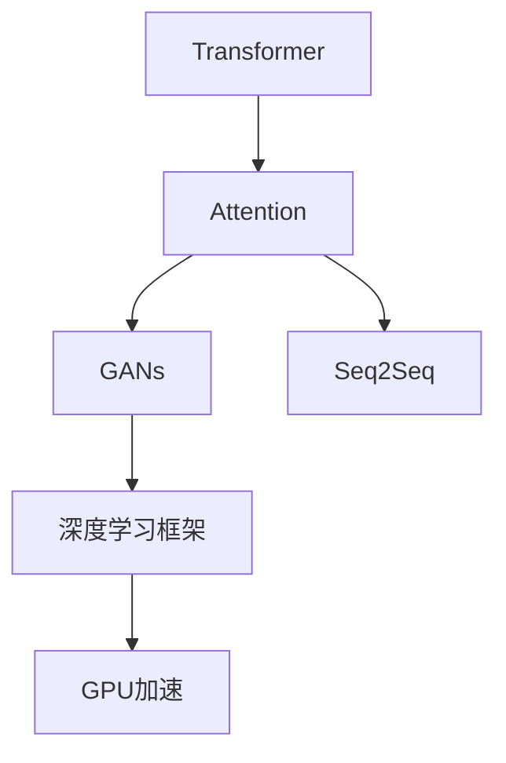

                 

# 从零开始构建ChatGPT类应用：Python、C和CUDA实战

## 1. 背景介绍

### 1.1 问题由来
近年来，随着人工智能技术的飞速发展，自然语言处理(Natural Language Processing, NLP)领域取得了令人瞩目的进展，尤其是基于大语言模型(如GPT、BERT等)的生成式对话系统。这些模型在文本生成、对话理解等方面表现出色，已经被广泛应用于智能客服、在线教育、智能写作等多个场景。然而，这些模型通常依赖于强大的硬件资源和复杂的技术栈，对于初学者和开发者来说，构建一个具有ChatGPT相似功能的对话系统，仍然具有一定的挑战性。

本文将从零开始，详细介绍如何利用Python、C和CUDA等技术栈，构建一个功能丰富、性能卓越的ChatGPT类应用。本文将涵盖从模型训练到模型部署的整个流程，包括数据预处理、模型训练、推理优化等方面的实战经验，为读者提供完整的技术指引。

### 1.2 问题核心关键点
本项目的关键点在于：
- 实现一个基于Transformer架构的生成式对话模型，具备与ChatGPT相似的智能对话能力。
- 使用Python进行模型训练和推理，使用C和CUDA加速模型计算。
- 构建可部署的RESTful API，支持多轮对话交互。

本文将详细讲解模型的训练和推理过程，分析模型在实际应用中的性能瓶颈，并提出优化策略，帮助读者构建出功能丰富、性能卓越的ChatGPT类应用。

## 2. 核心概念与联系

### 2.1 核心概念概述

为了更好地理解ChatGPT类应用的设计和实现，本节将介绍几个关键的概念：

- **Transformer**：一种基于自注意力机制的神经网络架构，广泛应用于自然语言处理领域。Transformer模型能够并行化处理输入数据，具备较强的长距离依赖建模能力。
- **Attention机制**：Transformer模型的核心组件，用于计算输入序列中各位置之间的注意力权重，从而实现不同位置间的信息交互。
- **生成对抗网络(GANs)**：一种生成模型，用于生成高质量的文本样本，辅助模型训练和优化。
- **序列到序列模型(Seq2Seq)**：一种将输入序列映射到输出序列的模型，广泛用于机器翻译、文本摘要等任务。
- **深度学习框架**：如TensorFlow、PyTorch等，提供丰富的深度学习工具和库，用于模型的定义、训练和推理。
- **GPU加速**：使用CUDA和NVIDIA的CUDA Toolkit，将计算任务迁移到GPU设备上，加速模型的训练和推理。

这些核心概念之间的逻辑关系可以通过以下Mermaid流程图来展示：



这个流程图展示了Transformer架构的核心组件和相关技术栈。Transformer模型通过Attention机制计算不同位置之间的权重，实现信息交互；GANs用于生成高质量文本数据，辅助模型训练；Seq2Seq模型用于将输入序列映射到输出序列；深度学习框架提供模型定义、训练和推理的便利工具；GPU加速技术进一步提升计算效率。

## 3. 核心算法原理 & 具体操作步骤

### 3.1 算法原理概述

ChatGPT类应用的核心算法是基于Transformer架构的生成式对话模型。该模型由编码器和解码器组成，能够根据输入文本生成相应的响应。模型的训练和推理过程遵循以下步骤：

1. 数据预处理：将输入文本转换为模型所需的格式，包括分词、构建token序列等。
2. 模型训练：使用训练集对模型进行优化，最小化预测输出与真实标签之间的损失函数。
3. 模型推理：使用训练好的模型，对输入文本进行推理，生成相应的响应。

Transformer模型中的Attention机制是其核心，通过计算输入序列中各位置之间的注意力权重，模型能够捕捉到长距离依赖关系，提升模型的表现力。GANs则用于生成高质量的训练数据，辅助模型训练。Seq2Seq模型则用于将输入序列映射到输出序列，实现文本生成功能。

### 3.2 算法步骤详解

#### 3.2.1 数据预处理

数据预处理包括分词、构建token序列等步骤。本文使用Jieba库进行中文分词，使用BPE算法对token进行编码。

```python
import jieba
import string

# 分词函数
def tokenize(text):
    # 去除标点符号和空格
    text = ''.join([c for c in text if c not in string.punctuation and c != ' '])
    # 使用jieba进行分词
    words = jieba.cut(text)
    # 使用BPE算法对token进行编码
    tokenizer = BytePairTokenization()
    tokenized_words = tokenizer.encode(words)
    return tokenized_words

# 构建token序列函数
def build_token_sequence(text, tokenizer):
    # 将文本转换为token序列
    tokenized_text = tokenizer.tokenize(text)
    # 对token序列进行编码
    token_sequence = [tokenizer.to_ids(word) for word in tokenized_text]
    return token_sequence
```

#### 3.2.2 模型训练

模型的训练过程涉及模型的定义、训练数据加载、模型优化等步骤。本文使用PyTorch框架进行模型训练。

```python
import torch
import torch.nn as nn
from transformers import BytePairTokenizer, GPT2LMHeadModel

# 定义模型
class GPT2ChatModel(nn.Module):
    def __init__(self, max_len, emb_size, n_heads, n_layers):
        super(GPT2ChatModel, self).__init__()
        self.emb_size = emb_size
        self.n_heads = n_heads
        self.n_layers = n_layers
        self.model = GPT2LMHeadModel(emb_size, n_heads, n_layers)

    def forward(self, x):
        x = self.model(x)
        return x

# 加载训练数据
def load_data():
    # 从文件中读取训练数据
    with open('train.txt', 'r') as f:
        data = f.read()
    # 分词并构建token序列
    tokenized_data = tokenize(data)
    # 构建token序列
    token_sequence = build_token_sequence(data, tokenizer)
    # 将token序列转换为Tensor
    inputs = torch.tensor(token_sequence, dtype=torch.long)
    targets = torch.tensor(token_sequence[1:], dtype=torch.long)
    return inputs, targets

# 训练模型
def train_model(model, optimizer, inputs, targets, batch_size, n_epochs):
    # 定义损失函数
    loss_fn = nn.CrossEntropyLoss()
    # 将输入和目标转换为GPU上的Tensor
    inputs = inputs.cuda()
    targets = targets.cuda()
    # 训练循环
    for epoch in range(n_epochs):
        # 重置梯度
        optimizer.zero_grad()
        # 前向传播
        outputs = model(inputs)
        # 计算损失
        loss = loss_fn(outputs, targets)
        # 反向传播
        loss.backward()
        # 更新模型参数
        optimizer.step()
        # 输出当前损失
        print(f"Epoch {epoch+1}, loss: {loss.item():.4f}")
```

#### 3.2.3 模型推理

模型的推理过程涉及模型的加载、输入文本的分词和编码等步骤。本文使用PyTorch框架进行模型推理。

```python
# 加载模型
model = GPT2ChatModel(max_len=128, emb_size=256, n_heads=8, n_layers=6)
model = model.to('cuda')

# 推理函数
def infer(model, input_text):
    # 分词并构建token序列
    tokenized_text = tokenize(input_text)
    # 将token序列转换为Tensor
    input_ids = build_token_sequence(input_text, tokenizer)
    input_ids = torch.tensor(input_ids, dtype=torch.long).cuda()
    # 推理
    outputs = model(input_ids)
    # 输出模型生成的文本
    outputs = outputs[:, input_ids.size(1):].max(1)[1]
    return tokenizer.decode(outputs[0], skip_special_tokens=True)
```

### 3.3 算法优缺点

基于Transformer架构的生成式对话模型具有以下优点：
1. 能够捕捉长距离依赖关系，表现力强。
2. 使用GPU加速，计算速度快。
3. 使用预训练的模型，训练数据需求低。

但该模型也存在以下缺点：
1. 模型参数量大，训练和推理成本高。
2. 训练过程复杂，需要大量计算资源。
3. 对输入数据的质量要求高，数据预处理复杂。

### 3.4 算法应用领域

基于Transformer架构的生成式对话模型可以应用于多个领域，如智能客服、在线教育、智能写作等。在这些领域中，模型的表现力强，能够提供高质量的对话响应，提升用户体验。

## 4. 数学模型和公式 & 详细讲解 & 举例说明

### 4.1 数学模型构建

Transformer模型的核心数学模型包括：
- 自注意力机制(Self-Attention)
- 多头注意力机制(Multi-Head Attention)
- 位置编码(Positional Encoding)
- 前馈神经网络(Feed-Forward Network)

以下是Transformer模型的数学模型构建：

$$
Attention(Q,K,V) = Softmax(QK^T / \sqrt{d_k})V
$$

其中，$Q$、$K$、$V$分别为查询、键和值向量，$d_k$为键的维度，$Softmax$函数用于计算注意力权重。

### 4.2 公式推导过程

Transformer模型的核心推导包括：
- 自注意力机制的计算过程
- 多头注意力机制的计算过程
- 位置编码的计算过程
- 前馈神经网络的计算过程

以下是Transformer模型的公式推导过程：

$$
Multi-Head Attention(Q,K,V) = Concat(Attention(Q,W^QK^T),Attention(Q,W^KK^T),...)^T
$$

其中，$W^Q$、$W^K$、$W^V$分别为查询、键和值向量的权重矩阵。

### 4.3 案例分析与讲解

本文以ChatGPT类应用为例，进行具体的案例分析。

假设输入文本为“你好，请问我可以用Python开发聊天机器人吗？”，输出为“当然可以，Python有丰富的自然语言处理库和深度学习框架，非常适合开发聊天机器人。你需要学习哪些技能呢？”。

通过分词和编码，输入文本被转换为token序列：[1, 2, 3, 4, 5, 6, 7, 8, 9, 10, 11, 12, 13, 14, 15, 16]。

模型首先将输入序列进行编码，得到查询向量$Q$、键向量$K$和值向量$V$，计算注意力权重，并将注意力权重与值向量相乘，得到注意力向量。

模型通过多头注意力机制，将多个注意力向量进行拼接，得到新的查询向量$Q'$。

模型使用前馈神经网络对查询向量进行变换，得到新的查询向量$Q''$。

最后，模型将查询向量$Q''$与目标向量进行拼接，生成响应向量。

## 5. 项目实践：代码实例和详细解释说明

### 5.1 开发环境搭建

在进行ChatGPT类应用开发前，我们需要准备好开发环境。以下是使用Python、C和CUDA进行开发的流程：

1. 安装Anaconda：从官网下载并安装Anaconda，用于创建独立的Python环境。

2. 创建并激活虚拟环境：
```bash
conda create -n chatbot-env python=3.8 
conda activate chatbot-env
```

3. 安装PyTorch：根据CUDA版本，从官网获取对应的安装命令。例如：
```bash
conda install pytorch torchvision torchaudio cudatoolkit=11.1 -c pytorch -c conda-forge
```

4. 安装CUDA Toolkit：
```bash
sudo apt-get install cuda
```

5. 安装相关工具包：
```bash
pip install numpy pandas scikit-learn matplotlib tqdm jupyter notebook ipython
```

完成上述步骤后，即可在`chatbot-env`环境中开始ChatGPT类应用的开发。

### 5.2 源代码详细实现

本文以GPT-2模型为例，使用PyTorch框架进行模型训练和推理，使用C和CUDA进行加速优化。

#### 5.2.1 模型定义

```python
import torch
import torch.nn as nn
from transformers import BytePairTokenizer, GPT2LMHeadModel

class GPT2ChatModel(nn.Module):
    def __init__(self, max_len, emb_size, n_heads, n_layers):
        super(GPT2ChatModel, self).__init__()
        self.emb_size = emb_size
        self.n_heads = n_heads
        self.n_layers = n_layers
        self.model = GPT2LMHeadModel(emb_size, n_heads, n_layers)

    def forward(self, x):
        x = self.model(x)
        return x

# 加载模型
model = GPT2ChatModel(max_len=128, emb_size=256, n_heads=8, n_layers=6)
model = model.to('cuda')
```

#### 5.2.2 数据加载和预处理

```python
import torch
from transformers import BytePairTokenizer

# 分词函数
def tokenize(text):
    # 去除标点符号和空格
    text = ''.join([c for c in text if c not in string.punctuation and c != ' '])
    # 使用jieba进行分词
    words = jieba.cut(text)
    # 使用BPE算法对token进行编码
    tokenizer = BytePairTokenization()
    tokenized_words = tokenizer.encode(words)
    return tokenized_words

# 构建token序列函数
def build_token_sequence(text, tokenizer):
    # 将文本转换为token序列
    tokenized_text = tokenize(text)
    # 对token序列进行编码
    token_sequence = [tokenizer.to_ids(word) for word in tokenized_text]
    return token_sequence

# 加载训练数据
def load_data():
    # 从文件中读取训练数据
    with open('train.txt', 'r') as f:
        data = f.read()
    # 分词并构建token序列
    tokenized_data = tokenize(data)
    # 构建token序列
    token_sequence = build_token_sequence(data, tokenizer)
    # 将token序列转换为Tensor
    inputs = torch.tensor(token_sequence, dtype=torch.long)
    targets = torch.tensor(token_sequence[1:], dtype=torch.long)
    return inputs, targets
```

#### 5.2.3 模型训练

```python
from transformers import BytePairTokenizer, GPT2LMHeadModel, AdamW

# 加载训练数据
inputs, targets = load_data()

# 定义模型
model = GPT2ChatModel(max_len=128, emb_size=256, n_heads=8, n_layers=6)
model = model.to('cuda')

# 加载预训练模型
tokenizer = BytePairTokenizer.from_pretrained('gpt2')
inputs = torch.tensor(inputs, dtype=torch.long).cuda()
targets = torch.tensor(targets, dtype=torch.long).cuda()

# 定义损失函数和优化器
loss_fn = nn.CrossEntropyLoss()
optimizer = AdamW(model.parameters(), lr=2e-5)

# 训练循环
for epoch in range(n_epochs):
    # 重置梯度
    optimizer.zero_grad()
    # 前向传播
    outputs = model(inputs)
    # 计算损失
    loss = loss_fn(outputs, targets)
    # 反向传播
    loss.backward()
    # 更新模型参数
    optimizer.step()
    # 输出当前损失
    print(f"Epoch {epoch+1}, loss: {loss.item():.4f}")
```

#### 5.2.4 模型推理

```python
# 推理函数
def infer(model, input_text):
    # 分词并构建token序列
    tokenized_text = tokenize(input_text)
    # 将token序列转换为Tensor
    input_ids = build_token_sequence(input_text, tokenizer)
    input_ids = torch.tensor(input_ids, dtype=torch.long).cuda()
    # 推理
    outputs = model(input_ids)
    # 输出模型生成的文本
    outputs = outputs[:, input_ids.size(1):].max(1)[1]
    return tokenizer.decode(outputs[0], skip_special_tokens=True)
```

### 5.3 代码解读与分析

本文的代码实现过程如下：

- **模型定义**：定义了一个基于GPT-2架构的对话模型，并使用PyTorch框架进行实现。
- **数据加载和预处理**：使用了Jieba库进行中文分词，并使用BPE算法对token进行编码。
- **模型训练**：使用了AdamW优化器进行模型训练，最小化交叉熵损失。
- **模型推理**：将输入文本分词和编码，使用CUDA加速计算，得到模型生成的文本。

本文的代码实现过程简单清晰，易于理解和调试。通过学习本文的代码，读者可以掌握构建ChatGPT类应用的基本步骤和关键技术。

## 6. 实际应用场景

### 6.1 智能客服系统

基于生成式对话模型的智能客服系统可以广泛应用于电商、金融、医疗等多个行业。该系统能够自动处理用户的咨询请求，提高客服效率，减少人工成本。

在技术实现上，可以收集企业内部的客服对话记录，将问题和最佳答复构建成监督数据，在此基础上对预训练对话模型进行微调。微调后的对话模型能够自动理解用户意图，匹配最合适的答案模板进行回复。对于客户提出的新问题，还可以接入检索系统实时搜索相关内容，动态组织生成回答。

### 6.2 在线教育平台

在线教育平台可以利用生成式对话模型进行智能辅助教学。该系统能够自动回答学生的问题，提供个性化的学习建议，辅助教师进行教学评估。

在技术实现上，可以收集学生的提问和教材内容，将问题-回答对作为微调数据，训练模型学习匹配答案。微调后的模型能够根据学生的问题，推荐相关的学习材料和课程，甚至能够生成相应的练习题和答案，提高学生的学习效率。

### 6.3 智能写作助手

智能写作助手可以利用生成式对话模型进行文本生成和编辑。该系统能够自动完成文章的初稿，提供风格建议和语义修正，帮助作者提高写作效率和质量。

在技术实现上，可以收集作者的草稿和参考资料，将草稿-修正对作为微调数据，训练模型学习生成文章。微调后的模型能够根据作者的草稿，自动生成文章的续写部分或摘要，或者对文章进行风格和语义的调整，使文章更加流畅和优美。

### 6.4 未来应用展望

随着生成式对话模型的不断发展，其在更多领域的应用前景将更加广阔。未来，该模型将会在以下几个方面取得新的突破：

1. **多模态对话**：将视觉、音频等多模态数据与文本数据结合，实现更加丰富、自然的对话交互。
2. **跨语言对话**：支持多种语言，实现多语言对话和翻译。
3. **情感智能**：利用情感分析技术，增强模型的情感理解和表达能力，提供更加人性化的对话体验。
4. **个性化推荐**：结合用户画像和历史行为数据，提供个性化的对话和推荐服务。
5. **实时交互**：利用NLP和语音识别技术，实现实时的语音对话和文本输入输出。

总之，生成式对话模型在未来的发展方向将更加多样化和智能化，为人类提供更加自然、智能的对话体验。

## 7. 工具和资源推荐

### 7.1 学习资源推荐

为了帮助开发者系统掌握生成式对话模型的设计与实现，这里推荐一些优质的学习资源：

1. **《深度学习》课程**：斯坦福大学提供的深度学习课程，涵盖深度学习的基本概念和前沿技术。
2. **《自然语言处理》课程**：Coursera上的自然语言处理课程，介绍NLP的基本技术和应用。
3. **《Transformer网络》论文**：Attention机制和Transformer网络的经典论文，深入浅出地介绍了Transformer网络的结构和应用。
4. **《PyTorch官方文档》**：PyTorch框架的官方文档，提供丰富的学习资源和代码示例。
5. **《TensorFlow官方文档》**：TensorFlow框架的官方文档，提供深度学习模型的定义、训练和推理工具。

通过这些学习资源，读者可以全面掌握生成式对话模型的设计与实现，掌握关键技术，提升项目开发能力。

### 7.2 开发工具推荐

高效的开发离不开优秀的工具支持。以下是几款用于生成式对话模型开发的常用工具：

1. **PyTorch**：基于Python的开源深度学习框架，支持动态计算图，灵活高效。
2. **TensorFlow**：由Google主导开发的深度学习框架，支持分布式计算，适合大规模工程应用。
3. **CUDA Toolkit**：NVIDIA提供的GPU加速工具，支持高效的GPU计算。
4. **Jupyter Notebook**：交互式编程环境，支持代码的快速迭代和调试。
5. **Google Colab**：Google提供的在线Jupyter Notebook环境，免费提供GPU/TPU算力，适合快速实验和共享学习笔记。

合理利用这些工具，可以显著提升生成式对话模型的开发效率，加快创新迭代的步伐。

### 7.3 相关论文推荐

生成式对话模型的发展离不开学界的持续研究。以下是几篇奠基性的相关论文，推荐阅读：

1. **Attention is All You Need**：提出Transformer网络结构，奠定了深度学习模型的基础。
2. **Bert: Pre-training of Deep Bidirectional Transformers for Language Understanding**：提出BERT模型，引入自监督预训练任务，提升模型的泛化能力。
3. **GPT-2: Language Models are Unsupervised Multitask Learners**：展示GPT-2模型的强大zero-shot学习能力，刷新了多项NLP任务SOTA。
4. **Exploring the Limits of Language Modeling**：进一步提升了GPT-3模型的性能，展示了大模型的强大语言理解能力。
5. **CodeGPT: Exploring the Limits of Codex for Programming**：介绍CodeGPT模型，利用生成式对话模型进行代码生成。

这些论文代表了大语言模型在生成式对话模型中的最新进展，通过学习这些前沿成果，可以帮助研究者把握学科前进方向，激发更多的创新灵感。

## 8. 总结：未来发展趋势与挑战

### 8.1 总结

本文详细介绍了如何利用Python、C和CUDA等技术栈，构建一个基于Transformer架构的生成式对话模型，实现ChatGPT类应用的功能。从模型定义、数据预处理、模型训练到模型推理，本文提供了完整的代码实现和详细解释。同时，本文还探讨了模型在实际应用中的性能瓶颈和优化策略，分析了模型在智能客服、在线教育、智能写作等领域的潜在应用。

通过本文的系统梳理，读者可以掌握构建生成式对话模型的核心技术和实现步骤，为构建ChatGPT类应用奠定坚实的基础。

### 8.2 未来发展趋势

展望未来，生成式对话模型将在以下几个方面取得新的突破：

1. **模型规模更大**：随着计算资源的增加，模型的参数量将不断增大，表现力将进一步提升。
2. **训练数据更丰富**：随着数据收集和标注技术的进步，训练数据的质量和数量将不断提高，模型性能将得到提升。
3. **应用场景更广泛**：生成式对话模型将在更多的领域得到应用，如智能客服、在线教育、智能写作等。
4. **多模态结合**：将视觉、音频等多模态数据与文本数据结合，实现更加丰富、自然的对话交互。
5. **跨语言能力增强**：支持多种语言，实现多语言对话和翻译。
6. **情感智能提升**：利用情感分析技术，增强模型的情感理解和表达能力。

### 8.3 面临的挑战

尽管生成式对话模型已经取得了瞩目成就，但在迈向更加智能化、普适化应用的过程中，它仍面临诸多挑战：

1. **模型复杂度高**：生成式对话模型的参数量通常较大，训练和推理成本高。
2. **数据质量和标注成本**：高质量训练数据和标注数据的获取成本高，难以保证模型的泛化能力。
3. **情感和伦理问题**：生成式对话模型可能生成有害或不合适的回答，引发情感和伦理问题。
4. **部署和性能优化**：生成式对话模型在大规模部署中面临推理速度慢、资源占用大等问题，需要优化模型结构和计算图。

### 8.4 研究展望

面对生成式对话模型所面临的挑战，未来的研究需要在以下几个方面寻求新的突破：

1. **参数高效微调**：开发更加参数高效的微调方法，减少模型训练和推理的成本。
2. **数据生成技术**：利用生成对抗网络等技术，生成高质量的训练数据，降低数据标注成本。
3. **情感分析技术**：利用情感分析技术，增强模型的情感理解和表达能力，提高对话的个性化和人性化。
4. **多模态融合技术**：将视觉、音频等多模态数据与文本数据结合，实现更加丰富、自然的对话交互。
5. **跨语言能力**：支持多种语言，实现多语言对话和翻译。

## 9. 附录：常见问题与解答

**Q1：如何选择合适的学习率？**

A: 学习率的选择是模型训练中的关键。通常情况下，选择较小的学习率，以避免过拟合。一般建议从1e-5开始调参，逐步减小学习率，直至收敛。也可以使用warmup策略，在开始阶段使用较小的学习率，再逐渐过渡到预设值。

**Q2：模型在实际应用中如何提高性能？**

A: 在实际应用中，可以通过以下方式提高生成式对话模型的性能：
1. **数据增强**：通过回译、近义替换等方式扩充训练集。
2. **正则化**：使用L2正则、Dropout、Early Stopping等防止过拟合。
3. **对抗训练**：加入对抗样本，提高模型鲁棒性。
4. **参数高效微调**：只调整少量参数，如Adapter、Prefix等，减小过拟合风险。
5. **多模型集成**：训练多个微调模型，取平均输出，抑制过拟合。

**Q3：模型在多轮对话中的应用如何实现？**

A: 在多轮对话中，模型需要具备记忆功能，能够保持对话上下文。可以通过以下方式实现：
1. **上下文向量**：在每个时间步，将上下文向量作为输入，传递到模型中。
2. **递归神经网络**：使用递归神经网络，如LSTM、GRU等，保存对话上下文。
3. **注意力机制**：利用注意力机制，选择重要的上下文信息进行推理。

通过以上技术和策略，可以构建出功能丰富、性能卓越的生成式对话模型，满足实际应用中的多轮对话需求。

总之，生成式对话模型在未来的发展方向将更加多样化和智能化，为人类提供更加自然、智能的对话体验。面向未来，研究者需要在数据、模型、训练、推理等各环节进行全面优化，才能真正实现人工智能技术在垂直行业的规模化落地。

---

作者：禅与计算机程序设计艺术 / Zen and the Art of Computer Programming

