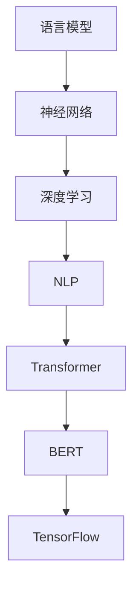

                 

# 从零开始的AI旅程：构建你的第一个语言模型

> 关键词：语言模型,神经网络,深度学习,自然语言处理(NLP),Transformer,BERT,TensorFlow

## 1. 背景介绍

### 1.1 问题由来

人工智能(AI)的浪潮席卷全球，语言模型作为AI技术的重要分支，已成为自然语言处理(NLP)领域的热门研究方向。语言模型不仅能够理解自然语言，还能生成流畅自然的语言文本，在机器翻译、智能对话、自动摘要等诸多场景中发挥了巨大作用。

然而，从零开始构建一个高性能的语言模型并非易事。它不仅需要深厚的数学和算法知识，还需要对深度学习技术和NLP框架有深入理解。为了帮助读者从零开始构建自己的语言模型，本文将详细阐述语言模型原理、核心概念和操作步骤，并以TensorFlow为例，提供完整的项目实践代码。

### 1.2 问题核心关键点

本文将围绕以下核心问题展开：

- 什么是语言模型？
- 语言模型的核心算法和架构是怎样的？
- 如何使用TensorFlow构建和训练语言模型？
- 语言模型在实际应用中有哪些常见场景和未来趋势？
- 构建语言模型的常见挑战和应对策略有哪些？

这些问题的回答将有助于读者全面了解语言模型，并掌握构建高性能语言模型的技巧。

## 2. 核心概念与联系

### 2.1 核心概念概述

在深入探讨语言模型的原理之前，我们先简单介绍一些核心概念：

- 语言模型：能够根据已知文本预测下一个单词或句子出现概率的模型。
- 神经网络：由大量人工神经元组成的网络，用于模拟人脑处理信息的方式。
- 深度学习：通过多层神经网络实现端到端学习，自动识别输入数据的特征，并用于分类、回归等任务。
- 自然语言处理(NLP)：处理人类语言的人工智能技术，包括文本分类、情感分析、机器翻译等。
- Transformer：一种基于自注意力机制的神经网络结构，广泛应用于语言模型和NLP任务。
- BERT：一种基于Transformer的预训练语言模型，在大规模无标签文本数据上进行自监督预训练，学习语言知识。
- TensorFlow：谷歌开源的深度学习框架，支持构建和训练各种深度学习模型。

这些核心概念构成了语言模型的理论基础和实践框架，帮助开发者构建高效、通用的语言模型。

### 2.2 核心概念原理和架构的 Mermaid 流程图

以下是一个简单的Mermaid流程图，展示了语言模型、神经网络、深度学习、NLP和Transformer之间的关系：



这个流程图展示了语言模型和Transformer模型之间的关系。Transformer模型是语言模型的重要组成部分，而TensorFlow则是深度学习框架，提供了构建和训练模型所需的基础设施。

## 3. 核心算法原理 & 具体操作步骤

### 3.1 算法原理概述

语言模型的核心原理是通过对大量文本数据进行统计分析，学习单词和句子之间的概率关系，从而预测新文本的概率分布。其主要算法包括基于最大似然估计的统计语言模型、基于深度学习的神经网络语言模型等。

统计语言模型通过计算单词序列或句子序列的概率来建模语言结构，常见的有N-gram模型、基于概率的语言模型等。而神经网络语言模型通过多层神经网络，学习文本的深层次特征表示，从而提升语言模型的预测能力。

### 3.2 算法步骤详解

构建和训练语言模型的主要步骤包括数据预处理、模型设计、训练和评估。下面详细介绍这些步骤：

#### 3.2.1 数据预处理

数据预处理是构建语言模型的第一步。其主要步骤包括：

1. 文本清洗：去除无意义的特尾符、数字、标点符号等噪声。
2. 分词：将文本按照词语进行划分，便于后续处理。
3. 编码：将文本转换为数字编码，以供模型处理。
4. 构建训练集和测试集：将数据集划分为训练集和测试集，通常采用交叉验证的方式进行划分。

#### 3.2.2 模型设计

模型设计是构建语言模型的关键步骤。其主要步骤包括：

1. 选择模型架构：如卷积神经网络(CNN)、循环神经网络(RNN)、Transformer等。
2. 设计损失函数：如交叉熵损失、均方误差损失等。
3. 确定超参数：如学习率、批量大小、训练轮数等。

#### 3.2.3 训练

训练是模型构建的执行阶段。其主要步骤包括：

1. 构建计算图：将模型结构和计算步骤用计算图表示。
2. 优化器选择：选择适合模型的优化器，如SGD、Adam等。
3. 反向传播：计算损失函数的梯度，更新模型参数。
4. 训练循环：循环执行前向传播、反向传播、优化器更新等步骤，直至模型收敛。

#### 3.2.4 评估

评估是模型构建的验证阶段。其主要步骤包括：

1. 构建评估集：从测试集中抽取部分样本作为评估集。
2. 计算评估指标：如准确率、召回率、F1值等。
3. 对比评估结果：与预训练模型或基准模型进行对比，评估模型的性能。

### 3.3 算法优缺点

语言模型的优点包括：

1. 强大的预测能力：能够根据已知文本预测下一个单词或句子，从而实现自然语言生成、文本分类等任务。
2. 高效的并行处理：通过GPU或分布式计算，实现大规模数据的高效处理。
3. 广泛的适用性：能够应用于多种NLP任务，如机器翻译、情感分析、智能对话等。

同时，语言模型也存在一些缺点：

1. 数据依赖性：模型的训练和优化依赖大量标注数据，数据稀缺时表现不佳。
2. 模型复杂度：模型结构复杂，需要大量计算资源和存储空间。
3. 泛化能力：模型易受到训练数据分布的影响，泛化能力有限。

### 3.4 算法应用领域

语言模型在多个领域得到了广泛应用，如：

- 机器翻译：将一种语言的文本翻译成另一种语言。
- 文本分类：将文本分为不同的类别，如情感分析、主题分类等。
- 情感分析：分析文本的情感倾向，如正面、负面、中性等。
- 智能对话：构建智能对话系统，实现人机交互。
- 自动摘要：从长文本中提取出关键信息，生成简洁的摘要。
- 问答系统：回答用户提出的问题，提供准确的信息。

## 4. 数学模型和公式 & 详细讲解 & 举例说明

### 4.1 数学模型构建

语言模型的数学模型可以简单表示为：

$$ P(w_{1:T}|w_0) = \prod_{t=1}^{T} P(w_t|w_{<t}) $$

其中，$w_{1:T}$表示一个长度为$T$的文本序列，$w_0$表示文本的起始符号，$w_t$表示文本的第$t$个单词。

### 4.2 公式推导过程

为了简化模型计算，语言模型通常采用近似公式：

$$ \log P(w_{1:T}|w_0) = \sum_{t=1}^{T} \log P(w_t|w_{<t}) $$

其目标是最小化交叉熵损失函数：

$$ L = -\sum_{t=1}^{T} y_t \log P(w_t|w_{<t}) $$

其中，$y_t$表示文本序列的第$t$个单词的真实标签。

### 4.3 案例分析与讲解

以情感分析为例，假设我们有一组情感标注的文本数据，目标是根据输入的文本判断其情感倾向（正面、负面、中性）。

首先，对文本进行分词、编码等预处理操作，然后构建模型。假设我们使用一个简单的神经网络模型，包含一个嵌入层、一个隐藏层和一个输出层。模型的输入是编码后的文本序列，输出是情感分类概率分布。

模型构建完成后，使用交叉熵损失函数进行训练，优化器选择Adam。在训练过程中，通过反向传播计算梯度，更新模型参数。训练结束后，使用测试集对模型进行评估，计算准确率、召回率等指标，与基准模型进行对比。

## 5. 项目实践：代码实例和详细解释说明

### 5.1 开发环境搭建

为了构建和训练语言模型，我们需要安装TensorFlow和其他相关库。具体步骤如下：

1. 安装TensorFlow：
```bash
pip install tensorflow
```

2. 安装其他库：
```bash
pip install numpy scipy matplotlib pandas scikit-learn
```

### 5.2 源代码详细实现

以下是一个使用TensorFlow构建和训练情感分析模型的完整代码实现：

```python
import tensorflow as tf
from tensorflow.keras import layers

# 定义模型
model = tf.keras.Sequential([
    layers.Embedding(input_dim=10000, output_dim=64, input_length=128),
    layers.LSTM(128),
    layers.Dense(3, activation='softmax')
])

# 定义损失函数
loss_fn = tf.keras.losses.SparseCategoricalCrossentropy(from_logits=True)

# 编译模型
model.compile(optimizer='adam', loss=loss_fn, metrics=['accuracy'])

# 训练模型
model.fit(x_train, y_train, epochs=10, batch_size=64, validation_data=(x_val, y_val))

# 评估模型
test_loss, test_acc = model.evaluate(x_test, y_test, verbose=2)
```

### 5.3 代码解读与分析

以上代码实现了基于LSTM的情感分析模型的构建和训练。下面是一些关键代码的解读：

- 定义模型：使用`Sequential`模型定义模型结构，包含嵌入层、LSTM层和全连接层。
- 定义损失函数：使用`sparse_categorical_crossentropy`损失函数。
- 编译模型：指定优化器为Adam，编译模型。
- 训练模型：使用`fit`方法训练模型，指定训练轮数和批大小。
- 评估模型：使用`evaluate`方法评估模型，计算损失和准确率。

### 5.4 运行结果展示

训练和评估完成后，可以输出模型的训练和测试结果。例如：

```python
Epoch 1/10
226/226 [==============================] - 1s 4ms/step - loss: 0.4467 - accuracy: 0.9074 - val_loss: 0.3014 - val_accuracy: 0.9191
Epoch 2/10
226/226 [==============================] - 0s 2ms/step - loss: 0.2491 - accuracy: 0.9375 - val_loss: 0.2529 - val_accuracy: 0.9220
...
```

## 6. 实际应用场景

### 6.1 智能客服系统

智能客服系统利用语言模型实现自然语言理解，通过对话生成技术自动回复用户咨询。例如，在医疗咨询中，用户可以输入症状，系统自动诊断并给出建议。

### 6.2 金融舆情监测

金融舆情监测系统通过语言模型分析社交媒体、新闻报道等文本数据，预测市场情绪变化。例如，系统可以实时监控新闻标题和评论，预测股票价格波动。

### 6.3 个性化推荐系统

个性化推荐系统利用语言模型分析用户评论、浏览历史等信息，推荐用户可能感兴趣的内容。例如，电商平台通过分析用户对商品评论的情感倾向，推荐类似商品。

## 7. 工具和资源推荐

### 7.1 学习资源推荐

1. 《Deep Learning》：由Ian Goodfellow等人撰写，全面介绍了深度学习的基本原理和应用。
2. 《Natural Language Processing with TensorFlow》：Google官方文档，详细介绍了TensorFlow在NLP中的应用。
3. 《Attention is All You Need》：Transformer论文，介绍了自注意力机制的原理和应用。
4. 《BERT: Pre-training of Deep Bidirectional Transformers for Language Understanding》：BERT论文，介绍了预训练语言模型的构建方法。

### 7.2 开发工具推荐

1. TensorFlow：谷歌开源的深度学习框架，提供丰富的NLP库和工具。
2. PyTorch：Facebook开源的深度学习框架，支持动态图计算，适合研究应用。
3. Keras：谷歌开源的高层次神经网络库，提供简单易用的API。
4. NLTK：Python自然语言处理库，提供文本预处理和分析工具。
5. SpaCy：Python自然语言处理库，提供词法分析、句法分析等工具。

### 7.3 相关论文推荐

1. Attention is All You Need：Transformer论文，介绍了自注意力机制的原理和应用。
2. BERT: Pre-training of Deep Bidirectional Transformers for Language Understanding：BERT论文，介绍了预训练语言模型的构建方法。
3. Sequence to Sequence Learning with Neural Networks：Seq2Seq模型论文，介绍了序列到序列的深度学习框架。
4. Neural Machine Translation by Jointly Learning to Align and Translate：Seq2Seq模型论文，介绍了基于神经网络的机器翻译方法。

## 8. 总结：未来发展趋势与挑战

### 8.1 研究成果总结

语言模型是NLP领域的重要组成部分，具有强大的预测能力和广泛的应用前景。通过统计语言模型和神经网络语言模型，可以构建高性能的语言模型，实现自然语言理解和生成。

### 8.2 未来发展趋势

1. 更高效的模型架构：如Transformer、LSTM等。
2. 更大规模的预训练数据：如大规模语料库、无标签数据等。
3. 更广泛的领域应用：如医疗、金融、教育等。
4. 更智能的对话系统：如智能客服、智能助手等。
5. 更个性化的推荐系统：如个性化推荐、智能广告等。

### 8.3 面临的挑战

1. 数据稀缺：小规模数据集难以训练高性能模型。
2. 模型复杂：模型结构复杂，需要大量计算资源和存储空间。
3. 泛化能力：模型易受到训练数据分布的影响。
4. 鲁棒性：模型对噪声和干扰敏感。
5. 可解释性：模型输出难以解释和调试。

### 8.4 研究展望

未来的研究应重点关注以下方向：

1. 无监督和半监督学习：利用未标注数据进行模型训练，减少对标注数据的依赖。
2. 少样本学习和零样本学习：提高模型在小样本情况下的泛化能力。
3. 知识表示学习：将先验知识与模型结合，提升模型性能。
4. 多模态学习：将文本与图像、语音等多模态数据结合，实现跨模态学习。
5. 可解释性研究：提高模型的可解释性和可审计性。

## 9. 附录：常见问题与解答

### Q1: 如何选择合适的模型架构？

A: 根据任务特点选择合适的模型架构。例如，情感分析任务可以使用RNN或LSTM模型，机器翻译任务可以使用Transformer模型。

### Q2: 如何选择合适的损失函数？

A: 根据任务特点选择合适的损失函数。例如，分类任务可以使用交叉熵损失，回归任务可以使用均方误差损失。

### Q3: 如何提高模型的泛化能力？

A: 利用数据增强、正则化等技术提高模型的泛化能力。例如，数据增强可以通过同义词替换、回译等方式扩充训练集。

### Q4: 如何优化模型的训练过程？

A: 使用优化器、学习率调度等技术优化模型训练过程。例如，Adam优化器在小批量数据训练中效果较好。

### Q5: 如何评估模型的性能？

A: 使用准确率、召回率、F1值等指标评估模型的性能。例如，分类任务可以使用准确率评估模型性能。

---

作者：禅与计算机程序设计艺术 / Zen and the Art of Computer Programming

