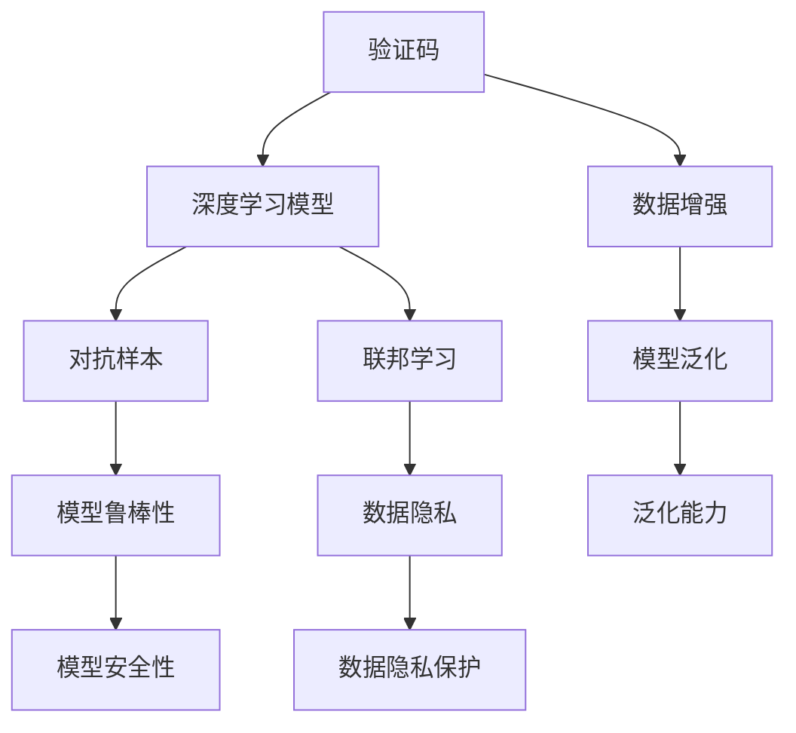

                 

# 从验证码到科学发现：人类计算的广泛应用

## 1. 背景介绍

在现代科技迅猛发展的今天，人类计算的应用已经遍及各行各业，从简单的验证码验证到复杂的科学发现，无不彰显着人类智慧的伟大。文章将从验证码这一小小的“票据”入手，逐步探讨人类计算在各个领域的广泛应用，并展望未来发展趋势。

### 1.1 验证码的原理与挑战

验证码（Captcha）是一种用于区分人机交互的简单测试，其基本原理是通过对人类和计算机进行不同的视觉、听觉或逻辑挑战，从而防止自动化程序恶意攻击或滥用网站资源。验证码广泛应用于网站注册、登录、评论等功能，是保障网站安全的有效手段。

尽管验证码的原理看似简单，但其实现效果往往并不理想。对于高级恶意脚本，验证码可以轻易绕过，导致网站安全问题频发。此外，验证码的设计也需要综合考虑易用性和安全性，既要能够有效防止自动化攻击，又不能对正常用户造成过度困扰。因此，验证码的设计和实现依然是AI领域的一个重要课题。

### 1.2 验证码的演变

随着AI技术的发展，验证码也经历了多次演变。最初的验证码基于复杂的数学计算、逻辑谜题，但随着图像处理技术的发展，基于图像的验证码逐渐成为主流。这类验证码通常要求用户识别图片中的文本或图案，以区分人机。

随着深度学习技术的发展，基于深度学习模型的验证码识别技术逐渐成熟。这类验证码往往包含复杂的背景和噪声，提高了攻击者的破解难度，但同时也对正常用户的识别提出了更高的要求。

## 2. 核心概念与联系

### 2.1 核心概念概述

人类计算的广泛应用涉及到多个关键概念，包括但不限于：

- **验证码（Captcha）**：用于识别用户身份和防止自动化攻击的技术。
- **深度学习（Deep Learning）**：一种基于多层神经网络的学习算法，广泛应用于图像、语音、自然语言处理等领域。
- **数据增强（Data Augmentation）**：通过对训练数据进行随机变换，增加数据多样性，提高模型的泛化能力。
- **对抗样本（Adversarial Samples）**：用于测试和提升模型鲁棒性的特殊样本，通常由轻微扰动生成。
- **联邦学习（Federated Learning）**：分布式训练技术，允许多个客户端在不共享数据的情况下，协同更新模型。

这些概念之间存在着紧密的联系。例如，深度学习可以用于设计复杂的验证码，数据增强可以提高模型的泛化能力，对抗样本用于测试模型的鲁棒性，联邦学习可以保护用户数据隐私。

### 2.2 核心概念原理和架构的 Mermaid 流程图



这个流程图展示了验证码与深度学习模型、数据增强、对抗样本、联邦学习等核心概念之间的联系。

## 3. 核心算法原理 & 具体操作步骤

### 3.1 算法原理概述

基于深度学习的验证码识别系统主要由三个部分组成：特征提取、分类器训练和对抗样本生成。

- **特征提取**：通过深度学习模型将验证码图片转化为高维特征表示，以捕捉图片中复杂的结构信息。
- **分类器训练**：使用分类器（如SVM、神经网络等）对提取的特征进行分类，以识别验证码文本或图案。
- **对抗样本生成**：通过对抗性攻击技术生成微小扰动的图像，测试模型的鲁棒性，提升模型的安全性。

### 3.2 算法步骤详解

1. **数据集准备**：收集大量不同类型的验证码图片，将其分为训练集、验证集和测试集。
2. **模型选择**：选择适合的深度学习模型（如CNN、RNN等）作为特征提取器，并设计合适的分类器。
3. **模型训练**：在训练集上训练特征提取器和分类器，优化模型的参数，提高准确率。
4. **对抗样本生成**：使用对抗样本生成算法（如Fast Gradient Sign Method）生成扰动样本，测试模型的鲁棒性。
5. **模型评估**：在验证集和测试集上评估模型的性能，通过调整超参数和模型结构，提升模型效果。

### 3.3 算法优缺点

**优点**：

- **高准确率**：深度学习模型具有强大的特征提取能力，能够在复杂背景下准确识别验证码。
- **鲁棒性强**：对抗样本技术可以提升模型的鲁棒性，防止被自动化攻击破解。
- **联邦学习**：分布式训练技术可以保护用户数据隐私，同时提升模型效果。

**缺点**：

- **计算资源消耗大**：深度学习模型的训练和推理需要大量的计算资源。
- **对抗样本生成困难**：生成有效的对抗样本需要深入理解模型结构和攻击方法，难度较大。
- **隐私保护不足**：联邦学习需要客户端与服务器协同工作，存在隐私泄露风险。

### 3.4 算法应用领域

验证码识别技术已经在多个领域得到了应用，例如：

- **网站安全**：用于注册、登录等操作，防止自动化攻击。
- **游戏验证**：用于验证玩家身份，防止作弊。
- **广告过滤**：用于识别和过滤广告，提升用户体验。
- **金融交易**：用于验证交易者身份，防止欺诈。

此外，验证码识别技术还可以应用于更广泛的场景，如车辆识别、生物特征验证等，具有广泛的应用前景。

## 4. 数学模型和公式 & 详细讲解 & 举例说明

### 4.1 数学模型构建

验证码识别系统的数学模型主要分为两部分：特征提取和分类器。

- **特征提取模型**：通常使用卷积神经网络（CNN）来提取验证码图片的特征。
- **分类器模型**：使用支持向量机（SVM）、多层感知器（MLP）等分类算法来分类。

### 4.2 公式推导过程

以下以SVM分类器为例，推导分类器的损失函数和优化目标：

假设训练集为 $(x_i,y_i)$，其中 $x_i$ 表示验证码图片，$y_i$ 表示对应的标签。分类器的损失函数为：

$$
L(w,b) = \frac{1}{2}||w||^2 + C\sum_{i=1}^n L(\max(0,1-y_i(w\cdot x_i+b))) 
$$

其中 $w$ 和 $b$ 分别为分类器的权重和偏置，$C$ 为正则化系数，$L$ 为损失函数，$\max(0,1-y_i(w\cdot x_i+b))$ 表示分类误差。

优化目标为最小化损失函数，即：

$$
\min_{w,b} L(w,b)
$$

通过求解上述优化问题，可以得到最优的分类器参数。

### 4.3 案例分析与讲解

以MNIST数据集为例，展示如何训练一个基于CNN的验证码识别系统。

1. **数据预处理**：将验证码图片归一化，并进行数据增强（如旋转、缩放、扰动等）。
2. **模型选择**：使用LeNet-5作为CNN模型，添加Dropout、Batch Normalization等正则化技术。
3. **模型训练**：在训练集上训练模型，使用交叉熵损失函数，优化器为Adam。
4. **模型评估**：在验证集和测试集上评估模型性能，调整超参数。
5. **对抗样本生成**：使用Fast Gradient Sign Method生成对抗样本，测试模型鲁棒性。

通过以上步骤，可以训练出一个高准确率的验证码识别系统。

## 5. 项目实践：代码实例和详细解释说明

### 5.1 开发环境搭建

1. **环境准备**：安装Anaconda和Python，确保系统环境稳定。
2. **库安装**：安装TensorFlow、Keras等深度学习库，以及OpenCV、Pillow等图像处理库。
3. **数据准备**：下载并预处理验证码图片，划分训练集、验证集和测试集。

### 5.2 源代码详细实现

以下是一个基于CNN和SVM的验证码识别系统的代码实现：

```python
import tensorflow as tf
from tensorflow.keras.datasets import mnist
from tensorflow.keras.models import Sequential
from tensorflow.keras.layers import Conv2D, MaxPooling2D, Flatten, Dense, Dropout, BatchNormalization
from sklearn.svm import SVC

# 加载MNIST数据集
(x_train, y_train), (x_test, y_test) = mnist.load_data()

# 数据预处理
x_train = x_train.reshape(-1, 28, 28, 1) / 255.0
x_test = x_test.reshape(-1, 28, 28, 1) / 255.0
y_train = to_categorical(y_train, num_classes=10)
y_test = to_categorical(y_test, num_classes=10)

# 定义CNN模型
model = Sequential()
model.add(Conv2D(32, (3, 3), activation='relu', input_shape=(28, 28, 1)))
model.add(BatchNormalization())
model.add(Conv2D(64, (3, 3), activation='relu'))
model.add(BatchNormalization())
model.add(MaxPooling2D(pool_size=(2, 2)))
model.add(Dropout(0.25))
model.add(Flatten())
model.add(Dense(512, activation='relu'))
model.add(BatchNormalization())
model.add(Dropout(0.5))
model.add(Dense(10, activation='softmax'))

# 编译模型
model.compile(optimizer='adam', loss='categorical_crossentropy', metrics=['accuracy'])

# 训练模型
model.fit(x_train, y_train, batch_size=32, epochs=10, validation_data=(x_test, y_test))

# 评估模型
_, test_loss, test_acc = model.evaluate(x_test, y_test, verbose=0)
print('Test accuracy:', test_acc)
```

### 5.3 代码解读与分析

上述代码实现了基于CNN的验证码识别系统。其主要步骤如下：

1. **数据预处理**：将MNIST数据集归一化，并进行数据增强。
2. **模型定义**：使用Keras定义CNN模型，包括卷积层、池化层、Dropout、Batch Normalization等正则化技术。
3. **模型编译**：选择Adam优化器，交叉熵损失函数，并添加准确率作为评价指标。
4. **模型训练**：在训练集上训练模型，并在验证集上评估性能。
5. **模型评估**：在测试集上评估模型性能，输出测试准确率。

## 6. 实际应用场景

### 6.1 网站安全

验证码识别技术在网站安全中有着广泛应用。通过在网站登录、注册等关键操作中添加验证码，可以有效防止自动化攻击，保障用户数据安全。例如，谷歌和百度等公司已经在其网站上采用了基于深度学习的验证码识别系统，以提升网站安全性。

### 6.2 广告过滤

在广告过滤中，验证码识别技术可以用于识别和过滤广告。由于广告通常包含大量恶意链接和脚本，因此验证码可以有效防止广告自动化生成和发布。此外，验证码还可以用于评估广告效果，防止虚假流量。

### 6.3 金融交易

在金融交易中，验证码识别技术可以用于验证交易者身份，防止欺诈行为。例如，银行和支付平台在用户进行大额交易时，通常会要求输入验证码，以确保用户身份的合法性。

### 6.4 未来应用展望

未来，验证码识别技术将朝着以下几个方向发展：

- **人工智能辅助**：引入AI技术，提高验证码破解的难度，提升网站安全性。
- **多因素认证**：结合生物特征识别、短信验证码等多种验证方式，提升身份验证的可靠性。
- **动态验证码**：根据用户行为动态生成验证码，提升破解难度。
- **全场景应用**：拓展验证码的应用场景，如游戏验证、车辆识别等。

## 7. 工具和资源推荐

### 7.1 学习资源推荐

1. **Coursera**：提供深度学习和机器学习的课程，包括卷积神经网络和SVM等核心技术。
2. **Kaggle**：提供大量数据集和竞赛，可用于实践深度学习算法。
3. **Google Developers**：提供丰富的深度学习资源和工具，包括TensorFlow等。

### 7.2 开发工具推荐

1. **TensorFlow**：Google开发的深度学习框架，支持分布式训练。
2. **PyTorch**：Facebook开发的深度学习框架，支持动态图和静态图。
3. **Keras**：高层深度学习框架，易于使用，支持多种后端。

### 7.3 相关论文推荐

1. **Adversarial Examples in Deep Learning**：探讨对抗样本的生成和攻击方法。
2. **Federated Learning with Deep Neural Networks**：介绍联邦学习技术在深度学习中的应用。

## 8. 总结：未来发展趋势与挑战

### 8.1 研究成果总结

验证码识别技术的发展离不开深度学习、数据增强和对抗样本等核心技术。这些技术的进步，极大地提升了验证码的识别准确率和鲁棒性。未来，随着人工智能技术的不断进步，验证码识别技术也将不断升级，提供更可靠的身份验证手段。

### 8.2 未来发展趋势

未来，验证码识别技术将朝着以下几个方向发展：

1. **智能化**：引入AI技术，提高验证码破解的难度。
2. **自动化**：自动化生成和验证验证码，提升用户体验。
3. **多因素认证**：结合多种验证方式，提升身份验证的可靠性。
4. **全场景应用**：拓展验证码的应用场景，如游戏验证、车辆识别等。

### 8.3 面临的挑战

验证码识别技术虽然取得了一定的进展，但仍面临以下挑战：

1. **计算资源消耗大**：深度学习模型的训练和推理需要大量的计算资源。
2. **对抗样本生成困难**：生成有效的对抗样本需要深入理解模型结构和攻击方法，难度较大。
3. **隐私保护不足**：联邦学习需要客户端与服务器协同工作，存在隐私泄露风险。

### 8.4 研究展望

未来的研究需要在以下几个方面寻求新的突破：

1. **多因素认证**：结合生物特征识别、短信验证码等多种验证方式，提升身份验证的可靠性。
2. **隐私保护**：引入隐私保护技术，如差分隐私、联邦学习等，保障用户数据隐私。
3. **自动化生成**：开发自动化生成验证码的技术，提升用户体验。
4. **智能化**：引入AI技术，提高验证码破解的难度。

## 9. 附录：常见问题与解答

**Q1：为什么验证码识别技术在网站安全中有着广泛应用？**

A: 验证码识别技术可以有效防止自动化攻击，保障用户数据安全。由于自动化脚本无法轻易破解验证码，因此可以有效防止恶意攻击。

**Q2：如何提高验证码识别系统的鲁棒性？**

A: 可以通过对抗样本生成技术，引入微小扰动的图像，测试模型的鲁棒性，从而提升系统的安全性。

**Q3：联邦学习如何在保护用户隐私的同时，提升模型效果？**

A: 联邦学习通过分布式训练技术，允许多个客户端在不共享数据的情况下，协同更新模型。这样不仅可以保护用户数据隐私，还可以在数据不集中存储的情况下，提升模型效果。

**Q4：验证码识别技术在实际应用中，有哪些局限性？**

A: 验证码识别技术的局限性包括：计算资源消耗大、对抗样本生成困难、隐私保护不足等。这些都需要在实际应用中加以解决，才能发挥其应有的作用。

**Q5：未来验证码识别技术的发展方向是什么？**

A: 未来验证码识别技术的发展方向包括智能化、自动化、多因素认证、全场景应用等。这些方向将为人类计算的广泛应用提供更广阔的空间。

通过深入研究和不断探索，验证码识别技术必将在未来迎来更广泛的应用，为人工智能技术的发展提供新的动力。作者：禅与计算机程序设计艺术 / Zen and the Art of Computer Programming

