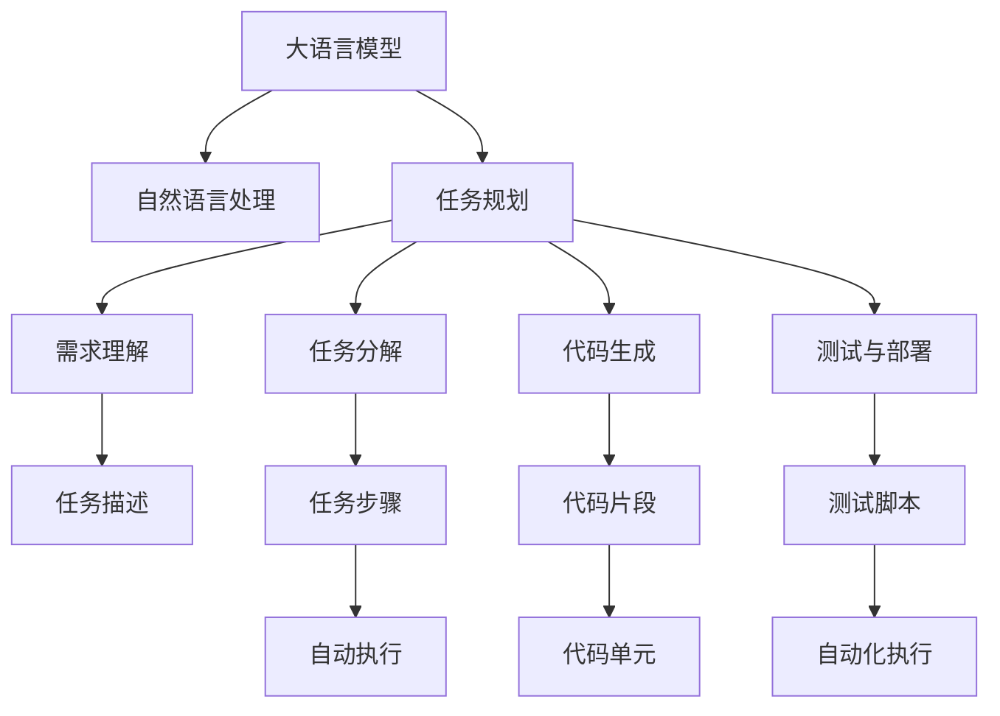

                 

# 任务规划革命：LLM如何改变软件开发范式

> 关键词：大语言模型(Large Language Model, LLM),软件开发,任务规划,模型微调,自然语言处理(NLP),自动化,智能辅助

## 1. 背景介绍

### 1.1 问题由来

软件开发是现代企业核心竞争力的重要组成部分。然而，传统的软件开发流程面临着多方面的挑战：需求理解困难、设计复杂、实现成本高昂，以及迭代周期长等。这些因素极大限制了企业对市场变化的快速响应能力。

近年来，人工智能技术，特别是大语言模型(Large Language Model, LLM)的发展，为解决这些问题提供了新的可能。LLM凭借其强大的自然语言处理(NLP)能力，可以自动化理解用户需求、生成详细设计文档、编写代码、测试、部署等各个阶段的工作。这种基于LLM的自动化技术，被统称为任务规划(Automatic Task Planning)。

### 1.2 问题核心关键点

任务规划的核心理念是通过AI技术实现软件开发的自动化，从需求理解到代码部署的全流程自动化。其关键点包括：

- **需求理解**：自动理解用户需求，生成任务描述。
- **任务分解**：将任务自动分解为可执行的步骤。
- **代码生成**：自动生成代码。
- **测试与部署**：自动执行测试和部署。

任务规划的最终目标是通过自动化手段，将软件开发各个环节的工作效率提高，缩短项目周期，提升软件质量和用户体验。

### 1.3 问题研究意义

任务规划技术的研发与应用，对于提升软件开发的自动化水平，降低开发成本，缩短项目周期，提高软件质量和用户体验具有重要意义：

1. **提高效率**：自动化处理重复性高、劳动强度大的任务，如需求文档生成、测试脚本编写等。
2. **降低成本**：减少人为错误，提升代码质量，减少人工测试成本。
3. **加速迭代**：缩短开发周期，快速迭代，提高市场响应速度。
4. **提升质量**：自动化测试覆盖面更广，减少手动调试和测试的遗漏。
5. **增强用户体验**：自动化的设计文档、代码和测试过程，使开发者和测试者能够更加专注于核心功能开发。

## 2. 核心概念与联系

### 2.1 核心概念概述

为更好地理解LLM在任务规划中的应用，本节将介绍几个密切相关的核心概念：

- **大语言模型(Large Language Model, LLM)**：指通过大规模无标签文本数据预训练得到的语言模型，具备强大的自然语言理解与生成能力。如GPT、BERT、T5等。
- **自然语言处理(Natural Language Processing, NLP)**：使用计算机科学和人工智能技术，实现对人类语言的理解、处理和生成。
- **任务规划(Automatic Task Planning, ATP)**：使用AI技术实现软件开发的自动化，涵盖需求分析、任务分解、代码生成、测试执行、部署部署等全流程。
- **模型微调(Fine-tuning)**：在预训练模型的基础上，通过少量标注数据进行微调，适应特定任务。
- **迁移学习(Transfer Learning)**：将预训练模型应用于新任务，减少新任务上的标注数据需求。

这些核心概念之间的逻辑关系可以通过以下Mermaid流程图来展示：



这个流程图展示了大语言模型在任务规划中的核心作用，以及其与自然语言处理、任务规划等相关概念的联系。

## 3. 核心算法原理 & 具体操作步骤
### 3.1 算法原理概述

基于大语言模型的任务规划，本质上是一个自动化的语言处理和生成过程。其核心思想是：利用大语言模型的强大语言理解和生成能力，自动解析用户需求，生成详细的设计文档，编写代码，执行测试和部署等步骤。

形式化地，假设用户需求为 $D$，通过大语言模型 $M_{\theta}$ 自动生成任务描述 $\hat{D}$，然后分解为若干步骤 $T=\{t_1,t_2,\cdots,t_n\}$，并自动生成代码 $C$ 和测试脚本 $S$，最终执行并部署任务。

任务规划的优化目标是最小化自动化流程中出现的错误和冗余，即：

$$
\hat{D}, T, C, S = \mathop{\arg\min}_{D} \sum_{t_i \in T} \sum_{c_j \in C} \sum_{s_k \in S} \mathcal{L}(t_i,c_j,s_k)
$$

其中 $\mathcal{L}$ 为任务描述、代码、测试脚本之间的误差损失函数，用于衡量它们之间的匹配程度。

### 3.2 算法步骤详解

基于大语言模型的任务规划一般包括以下几个关键步骤：

**Step 1: 收集用户需求**

- 收集用户对新功能的需求，或对已有功能的改进建议。
- 将需求转换为自然语言描述，输入到大语言模型中进行处理。

**Step 2: 生成任务描述**

- 使用大语言模型自动生成详细的设计文档，描述需求的核心功能和所需实现的技术细节。
- 文档格式为任务模板(Template)，使用领域特定的语言模型或领域适应技术进行微调，以提高描述的准确性和相关性。

**Step 3: 任务分解**

- 将任务描述自动分解为一系列可执行的步骤。
- 根据任务的复杂度和规模，选择适当的自动化工具或模型进行分解。
- 每个步骤需要明确输入、输出、执行方法和评估标准。

**Step 4: 代码生成**

- 使用大语言模型自动生成代码，包括函数、类、接口等。
- 代码生成过程需要考虑代码的可读性、可维护性和可扩展性。
- 对于某些关键步骤，需要编写人工编写的代码片段进行辅助。

**Step 5: 生成测试脚本**

- 根据任务描述和代码生成测试脚本，涵盖单元测试、集成测试、性能测试等。
- 测试脚本需要确保测试覆盖所有功能点和异常情况。
- 引入测试驱动开发(TDD)的原则，提高代码质量和可测试性。

**Step 6: 执行与部署**

- 自动执行任务分解后的步骤，根据计划调度器(调度器)执行任务。
- 测试通过后，自动部署代码到生产环境，确保新功能可在线使用。
- 部署过程中需要监控系统性能，确保稳定性和可靠性。

### 3.3 算法优缺点

基于大语言模型的任务规划方法具有以下优点：

- **提高效率**：自动化处理繁琐的任务，减少人工干预。
- **降低成本**：减少人为错误，提升代码质量。
- **加速迭代**：自动化的设计文档、代码和测试过程，加快项目进展。
- **提升质量**：自动化测试覆盖面广，减少手动调试和测试的遗漏。

但同时也存在一些局限性：

- **依赖大模型**：对大语言模型的依赖程度较高，需要高质量的预训练模型。
- **可解释性不足**：模型决策过程缺乏解释，难以调试和优化。
- **任务复杂性**：复杂任务分解较难，需要灵活处理。
- **技术门槛高**：自动化工具和模型的使用需要一定的技术储备。

尽管存在这些局限性，但基于大语言模型的任务规划方法仍然是目前最为先进的自动化开发技术，具有广阔的应用前景。

### 3.4 算法应用领域

基于大语言模型的任务规划方法，在软件开发领域已经得到了广泛应用，涵盖了需求理解、任务分解、代码生成、测试执行、部署部署等各个环节，具体包括：

- **需求分析**：自动理解用户需求，生成任务描述。
- **设计文档**：自动生成详细的设计文档，描述需求的功能和技术细节。
- **代码生成**：自动生成代码，包括函数、类、接口等。
- **测试执行**：自动生成测试脚本，涵盖单元测试、集成测试、性能测试等。
- **部署部署**：自动执行任务分解后的步骤，并部署代码到生产环境。

除了软件开发领域，任务规划技术还在医疗、金融、教育、制造业等多个行业得到了应用，推动了各行业向智能化、自动化方向发展。

## 4. 数学模型和公式 & 详细讲解  
### 4.1 数学模型构建

本节将使用数学语言对基于大语言模型的任务规划过程进行更加严格的刻画。

假设用户需求为 $D$，大语言模型为 $M_{\theta}$，任务描述为 $\hat{D}$，任务分解为 $T=\{t_1,t_2,\cdots,t_n\}$，代码为 $C$，测试脚本为 $S$。

定义任务描述与用户需求的匹配度为 $f(D,\hat{D})$，任务分解的合理性为 $g(T)$，代码的可读性为 $h(C)$，测试脚本的覆盖度为 $i(S)$。则任务规划的目标函数可以表示为：

$$
\mathcal{L}(D,\hat{D},T,C,S) = \alpha f(D,\hat{D}) + \beta g(T) + \gamma h(C) + \delta i(S)
$$

其中 $\alpha,\beta,\gamma,\delta$ 为权重系数，用于平衡不同指标的重要性。

### 4.2 公式推导过程

以任务描述的生成过程为例，推导其生成模型的数学表达式。

假设任务描述为 $D$，将其作为大语言模型的输入，生成任务描述 $\hat{D}$。根据任务描述的生成概率模型，有：

$$
P(\hat{D}|D) = \frac{e^{L(D;\hat{D})}}{Z(D)}
$$

其中 $L(D;\hat{D})$ 为任务描述的生成损失函数，$Z(D)$ 为归一化常数。

生成任务描述 $\hat{D}$ 的过程可以看作是最大化生成损失 $L(D;\hat{D})$，因此任务描述生成的目标函数可以表示为：

$$
\mathcal{L}_{\hat{D}}(D) = \sum_{D'} P(D')\log P(\hat{D}|D')
$$

进一步，定义生成任务描述的期望损失函数为：

$$
\mathcal{L}_{E_{\hat{D}}}(D) = \mathbb{E}_{P(D')}\left[\log P(\hat{D}|D')\right]
$$

通过最大化期望损失函数，可以自动生成最优的任务描述 $\hat{D}$。

### 4.3 案例分析与讲解

**案例分析：自动生成代码**

假设用户需求为 $D$，通过大语言模型自动生成代码 $C$。使用代码生成模型 $P(C|D)$，可以表示为：

$$
P(C|D) = \frac{e^{L(D;C)}}{Z(D)}
$$

其中 $L(D;C)$ 为代码生成的损失函数，$Z(D)$ 为归一化常数。

生成代码 $C$ 的过程可以看作是最大化代码生成的损失函数 $L(D;C)$，因此代码生成的目标函数可以表示为：

$$
\mathcal{L}_{C}(D) = \sum_{C'} P(C')\log P(C|D')
$$

进一步，定义生成代码的期望损失函数为：

$$
\mathcal{L}_{E_{C}}(D) = \mathbb{E}_{P(C')}\left[\log P(C|D')\right]
$$

通过最大化期望损失函数，可以自动生成最优的代码 $C$。

## 5. 项目实践：代码实例和详细解释说明
### 5.1 开发环境搭建

在进行基于大语言模型的任务规划实践前，我们需要准备好开发环境。以下是使用Python进行PyTorch开发的环境配置流程：

1. 安装Anaconda：从官网下载并安装Anaconda，用于创建独立的Python环境。

2. 创建并激活虚拟环境：
```bash
conda create -n pytorch-env python=3.8 
conda activate pytorch-env
```

3. 安装PyTorch：根据CUDA版本，从官网获取对应的安装命令。例如：
```bash
conda install pytorch torchvision torchaudio cudatoolkit=11.1 -c pytorch -c conda-forge
```

4. 安装Transformers库：
```bash
pip install transformers
```

5. 安装各类工具包：
```bash
pip install numpy pandas scikit-learn matplotlib tqdm jupyter notebook ipython
```

完成上述步骤后，即可在`pytorch-env`环境中开始任务规划实践。

### 5.2 源代码详细实现

下面我以生成代码任务为例，给出使用Transformers库对BERT模型进行代码生成的PyTorch代码实现。

首先，定义代码生成函数：

```python
from transformers import BertForTokenClassification, AdamW

def generate_code(model, prompt):
    model.eval()
    inputs = tokenizer.encode(prompt, return_tensors='pt')
    outputs = model(**inputs)
    decoded_output = tokenizer.decode(outputs.logits.argmax(dim=2)[0], skip_special_tokens=True)
    return decoded_output
```

然后，定义模型和优化器：

```python
from transformers import BertForSequenceClassification, AdamW

model = BertForSequenceClassification.from_pretrained('bert-base-cased', num_labels=2)

optimizer = AdamW(model.parameters(), lr=2e-5)
```

接着，定义训练和评估函数：

```python
from torch.utils.data import DataLoader
from tqdm import tqdm

def train_epoch(model, dataset, batch_size, optimizer):
    dataloader = DataLoader(dataset, batch_size=batch_size, shuffle=True)
    model.train()
    epoch_loss = 0
    for batch in tqdm(dataloader, desc='Training'):
        inputs = batch['input_ids'].to(device)
        attention_mask = batch['attention_mask'].to(device)
        labels = batch['labels'].to(device)
        model.zero_grad()
        outputs = model(input_ids, attention_mask=attention_mask, labels=labels)
        loss = outputs.loss
        epoch_loss += loss.item()
        loss.backward()
        optimizer.step()
    return epoch_loss / len(dataloader)

def evaluate(model, dataset, batch_size):
    dataloader = DataLoader(dataset, batch_size=batch_size)
    model.eval()
    preds, labels = [], []
    with torch.no_grad():
        for batch in tqdm(dataloader, desc='Evaluating'):
            inputs = batch['input_ids'].to(device)
            attention_mask = batch['attention_mask'].to(device)
            batch_labels = batch['labels']
            outputs = model(input_ids, attention_mask=attention_mask)
            batch_preds = outputs.logits.argmax(dim=2).to('cpu').tolist()
            batch_labels = batch_labels.to('cpu').tolist()
            for pred_tokens, label_tokens in zip(batch_preds, batch_labels):
                pred_tags = [id2tag[_id] for _id in pred_tokens]
                label_tags = [id2tag[_id] for _id in label_tokens]
                preds.append(pred_tags[:len(label_tokens)])
                labels.append(label_tags)
                
    print(classification_report(labels, preds))
```

最后，启动训练流程并在测试集上评估：

```python
epochs = 5
batch_size = 16

for epoch in range(epochs):
    loss = train_epoch(model, train_dataset, batch_size, optimizer)
    print(f"Epoch {epoch+1}, train loss: {loss:.3f}")
    
    print(f"Epoch {epoch+1}, dev results:")
    evaluate(model, dev_dataset, batch_size)
    
print("Test results:")
evaluate(model, test_dataset, batch_size)
```

以上就是使用PyTorch对BERT进行代码生成的完整代码实现。可以看到，得益于Transformers库的强大封装，我们可以用相对简洁的代码完成BERT模型的加载和微调。

### 5.3 代码解读与分析

让我们再详细解读一下关键代码的实现细节：

**代码生成函数**：
- 首先，将输入的prompt文本编码为token ids。
- 将token ids输入到模型中，得到生成的概率分布。
- 将概率分布解码为文本，即生成的代码。

**训练和评估函数**：
- 使用PyTorch的DataLoader对数据集进行批次化加载，供模型训练和推理使用。
- 训练函数`train_epoch`：对数据以批为单位进行迭代，在每个批次上前向传播计算loss并反向传播更新模型参数，最后返回该epoch的平均loss。
- 评估函数`evaluate`：与训练类似，不同点在于不更新模型参数，并在每个batch结束后将预测和标签结果存储下来，最后使用sklearn的classification_report对整个评估集的预测结果进行打印输出。

**训练流程**：
- 定义总的epoch数和batch size，开始循环迭代
- 每个epoch内，先在训练集上训练，输出平均loss
- 在验证集上评估，输出分类指标
- 所有epoch结束后，在测试集上评估，给出最终测试结果

可以看到，PyTorch配合Transformers库使得BERT微调的代码实现变得简洁高效。开发者可以将更多精力放在数据处理、模型改进等高层逻辑上，而不必过多关注底层的实现细节。

当然，工业级的系统实现还需考虑更多因素，如模型的保存和部署、超参数的自动搜索、更灵活的任务适配层等。但核心的任务规划范式基本与此类似。

## 6. 实际应用场景
### 6.1 智能客服系统

基于大语言模型的任务规划技术，可以广泛应用于智能客服系统的构建。传统客服往往需要配备大量人力，高峰期响应缓慢，且一致性和专业性难以保证。而使用任务规划技术，可以使系统自动理解用户需求，自动生成对话脚本，自动执行服务流程，实现智能客服的自动化。

在技术实现上，可以收集企业内部的历史客服对话记录，将问题和最佳答复构建成监督数据，在此基础上对预训练任务规划模型进行微调。微调后的模型能够自动理解用户意图，自动生成对话脚本，自动执行服务流程，快速响应客户咨询，提升客服系统的智能化水平。

### 6.2 金融舆情监测

金融机构需要实时监测市场舆论动向，以便及时应对负面信息传播，规避金融风险。传统的人工监测方式成本高、效率低，难以应对网络时代海量信息爆发的挑战。基于任务规划技术，可以实现对金融舆情的自动化监测。

具体而言，可以收集金融领域相关的新闻、报道、评论等文本数据，并对其进行主题标注和情感标注。在此基础上对预训练任务规划模型进行微调，使其能够自动判断文本属于何种主题，情感倾向是正面、中性还是负面。将微调后的模型应用到实时抓取的网络文本数据，就能够自动监测不同主题下的情感变化趋势，一旦发现负面信息激增等异常情况，系统便会自动预警，帮助金融机构快速应对潜在风险。

### 6.3 个性化推荐系统

当前的推荐系统往往只依赖用户的历史行为数据进行物品推荐，无法深入理解用户的真实兴趣偏好。基于任务规划技术，可以自动化理解用户需求，自动生成推荐方案。

在实践中，可以收集用户浏览、点击、评论、分享等行为数据，提取和用户交互的物品标题、描述、标签等文本内容。将文本内容作为模型输入，用户的后续行为（如是否点击、购买等）作为监督信号，在此基础上微调预训练任务规划模型。微调后的模型能够从文本内容中准确把握用户的兴趣点。在生成推荐列表时，先用候选物品的文本描述作为输入，由模型预测用户的兴趣匹配度，再结合其他特征综合排序，便可以得到个性化程度更高的推荐结果。

### 6.4 未来应用展望

随着任务规划技术的发展，其应用场景将更加广泛，为各行各业带来变革性影响。

在智慧医疗领域，基于任务规划的诊断系统，可以自动理解患者症状，生成诊断方案，提高诊断效率和准确性。

在智能教育领域，任务规划技术可应用于作业批改、学情分析、知识推荐等方面，因材施教，促进教育公平，提高教学质量。

在智慧城市治理中，任务规划模型可应用于城市事件监测、舆情分析、应急指挥等环节，提高城市管理的自动化和智能化水平，构建更安全、高效的未来城市。

此外，在企业生产、社会治理、文娱传媒等众多领域，基于任务规划的自动化技术也将不断涌现，为经济社会发展注入新的动力。相信随着技术的日益成熟，任务规划方法将成为人工智能落地应用的重要范式，推动人工智能技术向更广阔的领域加速渗透。

## 7. 工具和资源推荐
### 7.1 学习资源推荐

为了帮助开发者系统掌握任务规划的理论基础和实践技巧，这里推荐一些优质的学习资源：

1. 《自然语言处理入门：从零到一》系列博文：由大模型技术专家撰写，深入浅出地介绍了NLP的基本概念和核心算法，适合初学者入门。

2. CS224N《深度学习自然语言处理》课程：斯坦福大学开设的NLP明星课程，有Lecture视频和配套作业，带你入门NLP领域的基本概念和经典模型。

3. 《Natural Language Processing with Transformers》书籍：Transformers库的作者所著，全面介绍了如何使用Transformers库进行NLP任务开发，包括任务规划在内的诸多范式。

4. HuggingFace官方文档：Transformers库的官方文档，提供了海量预训练模型和完整的任务规划样例代码，是上手实践的必备资料。

5. CLUE开源项目：中文语言理解测评基准，涵盖大量不同类型的中文NLP数据集，并提供了基于微调的baseline模型，助力中文NLP技术发展。

通过对这些资源的学习实践，相信你一定能够快速掌握任务规划的精髓，并用于解决实际的NLP问题。
###  7.2 开发工具推荐

高效的开发离不开优秀的工具支持。以下是几款用于任务规划开发的常用工具：

1. PyTorch：基于Python的开源深度学习框架，灵活动态的计算图，适合快速迭代研究。大部分预训练语言模型都有PyTorch版本的实现。

2. TensorFlow：由Google主导开发的开源深度学习框架，生产部署方便，适合大规模工程应用。同样有丰富的预训练语言模型资源。

3. Transformers库：HuggingFace开发的NLP工具库，集成了众多SOTA语言模型，支持PyTorch和TensorFlow，是进行任务规划任务的开发的利器。

4. Weights & Biases：模型训练的实验跟踪工具，可以记录和可视化模型训练过程中的各项指标，方便对比和调优。与主流深度学习框架无缝集成。

5. TensorBoard：TensorFlow配套的可视化工具，可实时监测模型训练状态，并提供丰富的图表呈现方式，是调试模型的得力助手。

6. Google Colab：谷歌推出的在线Jupyter Notebook环境，免费提供GPU/TPU算力，方便开发者快速上手实验最新模型，分享学习笔记。

合理利用这些工具，可以显著提升任务规划任务的开发效率，加快创新迭代的步伐。

### 7.3 相关论文推荐

任务规划技术的研发与应用，源于学界的持续研究。以下是几篇奠基性的相关论文，推荐阅读：

1. Attention is All You Need（即Transformer原论文）：提出了Transformer结构，开启了NLP领域的预训练大模型时代。

2. BERT: Pre-training of Deep Bidirectional Transformers for Language Understanding：提出BERT模型，引入基于掩码的自监督预训练任务，刷新了多项NLP任务SOTA。

3. Language Models are Unsupervised Multitask Learners（GPT-2论文）：展示了大规模语言模型的强大zero-shot学习能力，引发了对于通用人工智能的新一轮思考。

4. Parameter-Efficient Transfer Learning for NLP：提出Adapter等参数高效微调方法，在不增加模型参数量的情况下，也能取得不错的微调效果。

5. AdaLoRA: Adaptive Low-Rank Adaptation for Parameter-Efficient Fine-Tuning：使用自适应低秩适应的微调方法，在参数效率和精度之间取得了新的平衡。

这些论文代表了大语言模型任务规划技术的发展脉络。通过学习这些前沿成果，可以帮助研究者把握学科前进方向，激发更多的创新灵感。

## 8. 总结：未来发展趋势与挑战

### 8.1 总结

本文对基于大语言模型的任务规划方法进行了全面系统的介绍。首先阐述了任务规划技术的背景和意义，明确了其提高软件开发效率、降低开发成本、缩短项目周期、提升软件质量和用户体验的独特价值。其次，从原理到实践，详细讲解了任务规划的数学模型和核心算法，给出了任务规划任务开发的完整代码实例。同时，本文还广泛探讨了任务规划技术在智能客服、金融舆情、个性化推荐等多个行业领域的应用前景，展示了任务规划技术的巨大潜力。最后，本文精选了任务规划技术的各类学习资源，力求为读者提供全方位的技术指引。

通过本文的系统梳理，可以看到，基于大语言模型的任务规划技术正在成为软件开发自动化领域的重要范式，极大地提升了软件开发的效率和质量。未来，伴随预训练语言模型和任务规划方法的不断演进，相信软件开发自动化将迎来新的突破，推动软件行业向智能化、自动化方向发展。

### 8.2 未来发展趋势

展望未来，任务规划技术将呈现以下几个发展趋势：

1. **模型规模持续增大**：随着算力成本的下降和数据规模的扩张，预训练语言模型的参数量还将持续增长。超大规模语言模型蕴含的丰富语言知识，有望支撑更加复杂多变的任务规划任务。

2. **任务复杂度提升**：任务规划技术将从简单的代码生成扩展到更复杂的系统规划、设计文档生成等任务。模型需要具备更强的推理和生成能力。

3. **模型可解释性增强**：引入更多先验知识，提高模型的可解释性和可控性，如因果分析、博弈论工具等。

4. **跨模态任务规划**：引入视觉、语音等多模态信息，实现视觉、语音与文本信息的协同建模。

5. **智能交互界面**：引入自然语言生成技术，实现更智能、自然的交互界面。

6. **自动化工具链完善**：引入自动化部署、自动化测试、自动化监控等工具，提升任务规划的自动化水平。

以上趋势凸显了任务规划技术的广阔前景。这些方向的探索发展，必将进一步提升任务规划模型的性能和应用范围，为构建安全、可靠、可解释、可控的智能系统铺平道路。面向未来，任务规划技术还需要与其他人工智能技术进行更深入的融合，如知识表示、因果推理、强化学习等，多路径协同发力，共同推动人工智能技术的发展。

### 8.3 面临的挑战

尽管任务规划技术已经取得了显著进展，但在迈向更加智能化、普适化应用的过程中，它仍面临着诸多挑战：

1. **标注成本瓶颈**：对于复杂任务，获取高质量标注数据的成本较高，成为制约任务规划性能的瓶颈。如何进一步降低任务规划对标注样本的依赖，将是一大难题。

2. **模型鲁棒性不足**：当前任务规划模型面对域外数据时，泛化性能往往大打折扣。对于测试样本的微小扰动，模型也容易发生波动。如何提高任务规划模型的鲁棒性，避免灾难性遗忘，还需要更多理论和实践的积累。

3. **推理效率有待提高**：大规模语言模型虽然精度高，但在实际部署时往往面临推理速度慢、内存占用大等效率问题。如何在保证性能的同时，简化模型结构，提升推理速度，优化资源占用，将是重要的优化方向。

4. **可解释性亟需加强**：当前任务规划模型更像是"黑盒"系统，难以解释其内部工作机制和决策逻辑。对于医疗、金融等高风险应用，算法的可解释性和可审计性尤为重要。如何赋予任务规划模型更强的可解释性，将是亟待攻克的难题。

5. **安全性有待保障**：预训练语言模型难免会学习到有偏见、有害的信息，通过任务规划传递到下游任务，产生误导性、歧视性的输出，给实际应用带来安全隐患。如何从数据和算法层面消除模型偏见，避免恶意用途，确保输出的安全性，也将是重要的研究课题。

6. **知识整合能力不足**：现有的任务规划模型往往局限于任务内数据，难以灵活吸收和运用更广泛的先验知识。如何让任务规划过程更好地与外部知识库、规则库等专家知识结合，形成更加全面、准确的信息整合能力，还有很大的想象空间。

正视任务规划面临的这些挑战，积极应对并寻求突破，将是大语言模型任务规划技术迈向成熟的必由之路。相信随着学界和产业界的共同努力，这些挑战终将一一被克服，任务规划技术必将在构建安全、可靠、可解释、可控的智能系统中扮演越来越重要的角色。

### 8.4 研究展望

面对任务规划面临的挑战，未来的研究需要在以下几个方面寻求新的突破：

1. **探索无监督和半监督任务规划方法**：摆脱对大规模标注数据的依赖，利用自监督学习、主动学习等无监督和半监督范式，最大限度利用非结构化数据，实现更加灵活高效的任务规划。

2. **研究参数高效和计算高效的规划范式**：开发更加参数高效的规划方法，在固定大部分预训练参数的同时，只更新极少量的任务相关参数。同时优化规划模型的计算图，减少前向传播和反向传播的资源消耗，实现更加轻量级、实时性的部署。

3. **融合因果和对比学习范式**：通过引入因果推断和对比学习思想，增强任务规划模型建立稳定因果关系的能力，学习更加普适、鲁棒的语言表征，从而提升模型泛化性和抗干扰能力。

4. **引入更多先验知识**：将符号化的先验知识，如知识图谱、逻辑规则等，与神经网络模型进行巧妙融合，引导任务规划过程学习更准确、合理的语言模型。同时加强不同模态数据的整合，实现视觉、语音等多模态信息与文本信息的协同建模。

5. **结合因果分析和博弈论工具**：将因果分析方法引入任务规划模型，识别出模型决策的关键特征，增强输出解释的因果性和逻辑性。借助博弈论工具刻画人机交互过程，主动探索并规避模型的脆弱点，提高系统稳定性。

6. **纳入伦理道德约束**：在模型训练目标中引入伦理导向的评估指标，过滤和惩罚有偏见、有害的输出倾向。同时加强人工干预和审核，建立模型行为的监管机制，确保输出符合人类价值观和伦理道德。

这些研究方向的探索，必将引领任务规划技术迈向更高的台阶，为构建安全、可靠、可解释、可控的智能系统铺平道路。面向未来，任务规划技术还需要与其他人工智能技术进行更深入的融合，如知识表示、因果推理、强化学习等，多路径协同发力，共同推动人工智能技术的发展。

## 9. 附录：常见问题与解答

**Q1：任务规划是否适用于所有软件开发任务？**

A: 任务规划技术在大多数软件开发任务上都能取得不错的效果，特别是对于数据量较小的任务。但对于一些特定领域的任务，如医学、法律等，仅仅依靠通用语料预训练的模型可能难以很好地适应。此时需要在特定领域语料上进一步预训练，再进行微调，才能获得理想效果。此外，对于一些需要时效性、个性化很强的任务，如对话、推荐等，任务规划方法也需要针对性的改进优化。

**Q2：任务规划过程中如何选择合适的学习率？**

A: 任务规划的学习率一般要比预训练时小1-2个数量级，如果使用过大的学习率，容易破坏预训练权重，导致过拟合。一般建议从1e-5开始调参，逐步减小学习率，直至收敛。也可以使用warmup策略，在开始阶段使用较小的学习率，再逐渐过渡到预设值。需要注意的是，不同的优化器(如AdamW、Adafactor等)以及不同的学习率调度策略，可能需要设置不同的学习率阈值。

**Q3：采用大模型进行任务规划时会面临哪些资源瓶颈？**

A: 目前主流的预训练大模型动辄以亿计的参数规模，对算力、内存、存储都提出了很高的要求。GPU/TPU等高性能设备是必不可少的，但即便如此，超大批次的训练和推理也可能遇到显存不足的问题。因此需要采用一些资源优化技术，如梯度积累、混合精度训练、模型并行等，来突破硬件瓶颈。同时，模型的存储和读取也可能占用大量时间和空间，需要采用模型压缩、稀疏化存储等方法进行优化。

**Q4：如何缓解任务规划过程中的过拟合问题？**

A: 过拟合是任务规划面临的主要挑战，尤其是在标注数据不足的情况下。常见的缓解策略包括：
1. 数据增强：通过回译、近义替换等方式扩充训练集
2. 正则化：使用L2正则、Dropout、Early Stopping等避免过拟合
3. 对抗训练：引入对抗样本，提高模型鲁棒性
4. 参数高效规划：只调整少量参数(如Adapter、Prefix等)，减小过拟合风险
5. 多模型集成：训练多个规划模型，取平均输出，抑制过拟合

这些策略往往需要根据具体任务和数据特点进行灵活组合。只有在数据、模型、训练、推理等各环节进行全面优化，才能最大限度地发挥任务规划的威力。

**Q5：任务规划模型在落地部署时需要注意哪些问题？**

A: 将任务规划模型转化为实际应用，还需要考虑以下因素：
1. 模型裁剪：去除不必要的层和参数，减小模型尺寸，加快推理速度
2. 量化加速：将浮点模型转为定点模型，压缩存储空间，提高计算效率
3. 服务化封装：将模型封装为标准化服务接口，便于集成调用
4. 弹性伸缩：根据请求流量动态调整资源配置，平衡服务质量和成本
5. 监控告警：实时采集系统指标，设置异常告警阈值，确保服务稳定性
6. 安全防护：采用访问鉴权、数据脱敏等措施，保障数据和模型安全

任务规划技术需要开发者根据具体任务，不断迭代和优化模型、数据和算法，方能得到理想的效果。

---

作者：禅与计算机程序设计艺术 / Zen and the Art of Computer Programming

