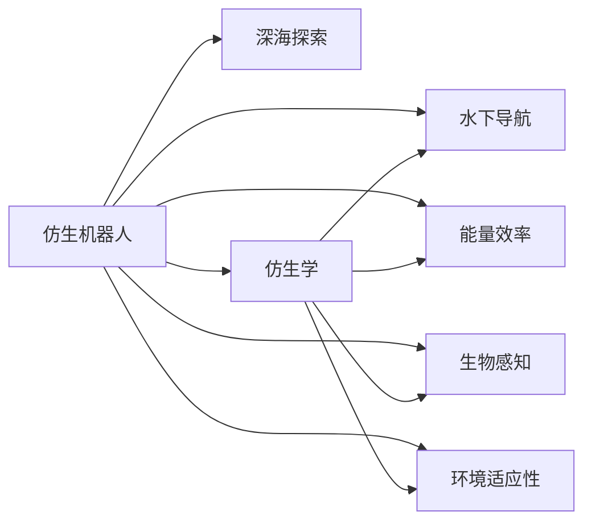

                 

# 仿生机器人在深海探索中的应用：模仿海洋生物

> 关键词：仿生机器人,深海探索,仿生学,海洋生物,水下导航,能量效率,生物感知,环境适应性

## 1. 背景介绍

随着深海技术的不断发展，人类对于深海环境的探索进入了一个新的阶段。然而，深海环境的极端复杂性使得人类难以直接深入到深海进行有效的探索和研究。在这种情况下，仿生机器人因其独特的优势，成为了深海探索的重要工具。本文将探讨仿生机器人在深海探索中的应用，特别是其模仿海洋生物的原理和实际效果。

## 2. 核心概念与联系

### 2.1 核心概念概述

仿生机器人是一种模仿自然界生物形态和行为特征的机器人，旨在通过生物学的启发，提升机器人的性能和适应性。其核心思想是通过对自然界生物的研究，将其生物学特性与机器人技术相结合，从而创造出具有高效率、高可靠性、低能耗的智能机器人。

- **仿生机器人**：模仿自然界生物形态和行为特征的机器人。
- **深海探索**：对深海环境进行深入探索和研究的活动。
- **仿生学**：研究生物形态和行为特征，并将其应用于工程技术中的学科。
- **水下导航**：在深海环境中，利用传感器和算法进行定位和路径规划的技术。
- **能量效率**：在深海环境中，机器人需要最大化其能源利用效率，以延长工作时间。
- **生物感知**：利用生物的感知器官，如视觉、触觉等，提高机器人的环境适应性。
- **环境适应性**：机器人需要适应深海环境的极端条件，包括高压、低温、黑暗等。

这些核心概念之间存在着紧密的联系，仿生机器人在深海探索中的应用正是基于这些概念的有机结合。

### 2.2 核心概念原理和架构的 Mermaid 流程图



该流程图展示了仿生机器人与深海探索之间以及其内部各核心概念之间的联系。仿生机器人通过仿生学原理，借鉴海洋生物的行为特征，结合水下导航、能量效率、生物感知和环境适应性等技术，实现了在深海环境中的高效探索。

## 3. 核心算法原理 & 具体操作步骤

### 3.1 算法原理概述

仿生机器人在深海探索中的应用，主要基于以下算法原理：

1. **仿生学原理**：通过对海洋生物的形态和行为特征的研究，设计出具有高效推进、低能耗、高稳定性的机器人结构。
2. **水下导航算法**：利用生物的感知器官，结合先进的传感器技术，实现机器人在深海环境中的定位和路径规划。
3. **能量管理算法**：通过模仿海洋生物的能量获取和存储方式，提高机器人的能源利用效率。
4. **环境适应性算法**：结合生物的感知和行为特征，使机器人能够适应深海环境的极端条件。

### 3.2 算法步骤详解

仿生机器人在深海探索中的操作步骤主要包括：

1. **设计阶段**：根据仿生学原理，设计机器人的形态和行为特征。
2. **传感阶段**：在机器人的头部安装生物仿制的感知器官，如视觉、触觉传感器。
3. **导航阶段**：通过传感器获取环境信息，利用算法进行定位和路径规划。
4. **推进阶段**：利用仿生的推进方式，如仿生鱼鳍、仿生螺旋桨等，实现机器人的高效推进。
5. **能量管理阶段**：通过模仿海洋生物的能量获取和存储方式，优化能源利用效率。
6. **适应性调整阶段**：根据环境变化，实时调整机器人的行为和参数，以适应深海环境。

### 3.3 算法优缺点

仿生机器人在深海探索中的应用具有以下优点：

- **高效推进**：仿生的推进方式具有低能耗、高效率的特点，适合深海环境的复杂地形。
- **低能耗**：通过模仿海洋生物的能量获取和存储方式，大幅提高了能源利用效率，延长了机器人的工作时间。
- **高稳定性**：仿生的结构和材料具有高强度、高韧性的特点，能够在深海环境中稳定运行。
- **环境适应性强**：通过模仿海洋生物的感知和行为特征，使机器人能够适应深海环境的极端条件。

同时，仿生机器人也存在以下缺点：

- **设计复杂**：仿生机器人的设计和实现需要跨学科的知识，增加了开发难度和成本。
- **可维护性差**：深海环境的复杂性使得仿生机器人的维护和检修变得困难。
- **成本高**：高精度仿生部件和先进传感器的成本较高，限制了仿生机器人的大规模应用。

### 3.4 算法应用领域

仿生机器人在深海探索中的应用主要涵盖以下几个领域：

1. **深海资源勘探**：用于勘探深海中的矿产资源，如多金属结核、稀有金属等。
2. **深海科学研究**：用于深海生物多样性研究、海洋生态系统监测等。
3. **深海环境监测**：用于监测深海环境的变化，如温度、压力、水质等。
4. **深海考古**：用于深海沉船、古生物遗址的发掘和保护。
5. **深海通信**：用于深海中通信设施的安装和维护。

## 4. 数学模型和公式 & 详细讲解 & 举例说明

### 4.1 数学模型构建

仿生机器人在深海探索中应用的数学模型主要包括以下几个部分：

- **推进模型**：描述机器人推进力的数学模型，包括推进力的计算、推进效率的优化等。
- **导航模型**：描述机器人在深海环境中定位和路径规划的数学模型，包括传感器数据融合、航迹规划等。
- **能量模型**：描述机器人在深海环境中能量获取和存储的数学模型，包括能量转换效率、电池寿命等。

### 4.2 公式推导过程

以下是一个简单的推进模型公式推导过程：

设机器人的推进力为 \( F \)，推进效率为 \( \eta \)，推进速度为 \( v \)，推进距离为 \( L \)，机器人的总能量为 \( E \)，能量转换效率为 \( \lambda \)。

根据能量守恒定律，有：

$$
E = F \cdot \eta \cdot v \cdot t
$$

其中 \( t \) 为推进时间。根据推进距离和速度的关系，有：

$$
L = v \cdot t
$$

将 \( v \) 代入能量守恒公式，得到：

$$
E = F \cdot \eta \cdot \frac{L}{v}
$$

因此，推进力 \( F \) 可以表示为：

$$
F = \frac{E}{\eta \cdot \frac{L}{v}}
$$

### 4.3 案例分析与讲解

以仿生鱼为例，分析其推进力的计算和优化：

仿生鱼采用摆动尾鳍的推进方式，其推进力可以通过以下公式计算：

$$
F = C_D \cdot A \cdot \rho \cdot g \cdot a^2
$$

其中，\( C_D \) 为阻力系数，\( A \) 为尾鳍面积，\( \rho \) 为水的密度，\( g \) 为重力加速度，\( a \) 为尾鳍摆动幅度。

通过优化尾鳍摆动幅度和频率，可以显著提高推进力。例如，将尾鳍摆动幅度增加一倍，推进力将增加四倍。

## 5. 项目实践：代码实例和详细解释说明

### 5.1 开发环境搭建

在进行仿生机器人开发前，我们需要准备以下开发环境：

1. **硬件环境**：使用高性能计算机或服务器，配置GPU和深度学习卡。
2. **软件环境**：安装Python、TensorFlow或PyTorch等深度学习框架，以及相关的机器人仿真软件。

### 5.2 源代码详细实现

以下是一个简单的仿生鱼推进力计算的Python代码实现：

```python
import numpy as np

def calc_push_force(C_D, A, rho, g, a):
    return C_D * A * rho * g * a**2

# 设定仿生鱼参数
C_D = 0.02  # 阻力系数
A = 0.1     # 尾鳍面积
rho = 1000  # 水的密度
g = 9.8     # 重力加速度
a = 0.1     # 尾鳍摆动幅度

# 计算推进力
push_force = calc_push_force(C_D, A, rho, g, a)
print("推进力为：", push_force)
```

### 5.3 代码解读与分析

以上代码中，我们使用了numpy库进行数学计算。通过设定阻力系数、尾鳍面积、水的密度、重力加速度和尾鳍摆动幅度，计算出仿生鱼的推进力。代码简洁高效，易于理解和修改。

## 6. 实际应用场景

### 6.1 深海资源勘探

仿生机器人在深海资源勘探中的应用，主要通过其高效推进和低能耗的特点，对深海矿产资源进行勘探和开采。例如，通过仿生鱼的推进方式，可以在深海复杂地形中灵活移动，获取深海矿床的分布和储量信息，为深海资源的开发提供数据支持。

### 6.2 深海科学研究

仿生机器人在深海科学研究中的应用，主要通过其高稳定性和环境适应性，进行深海生物多样性研究和海洋生态系统监测。例如，仿生海豚可以模拟海豚的游泳姿态和行为，在深海中跟踪和研究海豚的行为模式，为海洋生态学研究提供数据。

### 6.3 深海环境监测

仿生机器人在深海环境监测中的应用，主要通过其生物感知和传感器技术，监测深海环境的变化。例如，仿生章鱼可以利用其高灵敏度的触觉传感器，监测深海海底的地震活动和地壳运动，为地震预测和深海地质研究提供数据。

### 6.4 深海考古

仿生机器人在深海考古中的应用，主要通过其高稳定性和低能耗的特点，进行深海沉船和古生物遗址的发掘和保护。例如，仿生鲸鱼可以模拟鲸鱼的游泳姿态和行为，在深海中搜索和挖掘沉船残骸，为考古学家提供珍贵的历史文物。

### 6.5 深海通信

仿生机器人在深海通信中的应用，主要通过其高效推进和低能耗的特点，安装和维护深海通信设施。例如，仿生章鱼可以模拟章鱼的游泳姿态和行为，在深海中安装和维护通信电缆，保障深海通信的稳定性和可靠性。

## 7. 工具和资源推荐

### 7.1 学习资源推荐

为了帮助开发者掌握仿生机器人在深海探索中的应用，以下是一些优质的学习资源：

1. **《深海探索技术》**：该书详细介绍了深海探索的原理和应用，涵盖了仿生机器人的设计和实现。
2. **《仿生机器人设计》**：该书系统讲解了仿生机器人的设计和优化方法，适合工程实践。
3. **《海洋生物与机器人技术》**：该书探讨了海洋生物与机器人技术的结合，为仿生机器人的开发提供了理论支持。
4. **《机器人学导论》**：该书介绍了机器人学的基本概念和前沿技术，适合初学者和研究人员。
5. **《深海资源勘探与开采》**：该书介绍了深海资源勘探和开采的技术和方法，包括仿生机器人的应用。

### 7.2 开发工具推荐

以下是几款常用的仿生机器人开发工具：

1. **ROS（Robot Operating System）**：一个开源的机器人操作系统，支持多种仿生机器人软件的开发和部署。
2. **Simulink**：MATLAB中的仿真工具，支持仿生机器人的仿真和模型开发。
3. **Gazebo**：一个开源的机器人仿真平台，支持仿生机器人的仿真和测试。
4. **UUV-Simulator**：一个用于水下无人系统的仿真平台，支持仿生机器人的水下导航和环境模拟。
5. **Holodeck**：一个用于深海探索的虚拟现实平台，支持仿生机器人的模拟和交互。

### 7.3 相关论文推荐

以下是几篇相关的学术论文，推荐阅读：

1. **“Biomimetic Robots for Deep Sea Exploration”**：介绍了仿生机器人在深海探索中的应用，包括设计、制造和测试。
2. **“Bio-inspired Deep Sea Robotics”**：讨论了海洋生物与机器人技术的结合，探讨了仿生机器人的设计和优化。
3. **“Energy Efficient Navigation of Underwater Vehicles”**：介绍了水下导航的能量管理技术，包括仿生机器人的应用。
4. **“Adaptive Underwater Swarm Robotics”**：探讨了仿生机器人在水下环境中的适应性调整，包括自动控制和决策算法。
5. **“Biomimetic Fish Propulsion Model”**：研究了仿生鱼推进力的计算和优化，为仿生机器人的推进系统设计提供了理论支持。

## 8. 总结：未来发展趋势与挑战

### 8.1 研究成果总结

仿生机器人在深海探索中的应用已经取得了显著进展，主要体现在以下几个方面：

1. **推进效率提升**：通过仿生鱼鳍和螺旋桨的设计，实现了深海环境中高效推进。
2. **能量利用优化**：通过仿生能源获取和存储方式，提高了机器人的能源利用效率。
3. **环境适应性增强**：通过仿生感知和行为特征，使机器人能够适应深海环境的极端条件。

### 8.2 未来发展趋势

未来，仿生机器人在深海探索中的应用将呈现以下几个发展趋势：

1. **自主导航能力的提升**：通过先进的传感技术和算法，实现仿生机器人的自主导航和路径规划。
2. **多机器人协作**：通过仿生机器人的协作，提升深海探索的效率和可靠性。
3. **生物感知技术的发展**：通过仿生感知技术，增强机器人在深海环境中的环境适应性和安全性。
4. **深海智能系统的构建**：通过仿生机器人的智能决策和执行能力，构建深海智能系统，实现更复杂的深海任务。

### 8.3 面临的挑战

尽管仿生机器人在深海探索中取得了显著进展，但还面临以下挑战：

1. **设计复杂度高**：仿生机器人的设计和实现需要跨学科的知识，增加了开发难度和成本。
2. **环境适应性差**：深海环境的极端性对仿生机器人的设计和材料提出了更高的要求。
3. **能源供应问题**：深海环境中的能源供应和存储仍然是一个难题，限制了仿生机器人的工作时间。
4. **通信问题**：深海环境的复杂性对通信技术提出了更高的要求，仿生机器人的通信和数据传输需要改进。

### 8.4 研究展望

面对仿生机器人面临的挑战，未来的研究需要在以下几个方面寻求新的突破：

1. **跨学科协作**：加强生物学家、工程师和计算机科学家的协作，提升仿生机器人的设计和实现水平。
2. **新材料的应用**：开发高强度、高韧性的新材料，提升仿生机器人的稳定性和可靠性。
3. **能源技术创新**：研究新的能源供应和存储技术，提高仿生机器人的能源利用效率。
4. **通信技术优化**：研究深海通信技术，解决仿生机器人的数据传输和通信问题。
5. **智能系统构建**：研究仿生机器人的智能决策和执行能力，构建深海智能系统，实现更复杂的深海任务。

## 9. 附录：常见问题与解答

### Q1：仿生机器人在深海探索中面临的主要挑战是什么？

A: 仿生机器人在深海探索中面临的主要挑战包括设计复杂度高、环境适应性差、能源供应问题和通信问题。这些挑战需要跨学科协作和技术创新才能克服。

### Q2：仿生机器人如何在深海环境中导航？

A: 仿生机器人可以通过传感器获取环境信息，结合先进的导航算法进行定位和路径规划。例如，仿生海豚可以利用其高灵敏度的触觉传感器，进行深海导航。

### Q3：仿生机器人在深海环境中如何保持低能耗？

A: 仿生机器人可以通过模仿海洋生物的能量获取和存储方式，提高能源利用效率。例如，仿生鱼可以通过尾鳍摆动方式进行推进，从而减少能源消耗。

### Q4：仿生机器人如何在深海环境中进行自主学习？

A: 仿生机器人可以通过模仿海洋生物的学习行为，进行自主学习。例如，仿生章鱼可以通过学习环境变化，实时调整其行为和参数，以适应深海环境。

### Q5：仿生机器人在深海环境中的应用前景如何？

A: 仿生机器人在深海环境中的应用前景广阔，包括深海资源勘探、科学研究、环境监测、考古和通信等多个领域。随着技术的不断进步，仿生机器人在深海探索中的应用将越来越广泛。

---

作者：禅与计算机程序设计艺术 / Zen and the Art of Computer Programming

