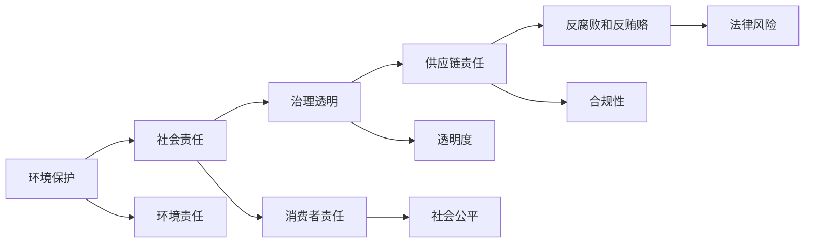

                 

# 企业社会责任管理：平衡利润和社会影响

> 关键词：企业社会责任（CSR）, 可持续性发展, 企业治理, 透明度, 环境责任, 社会责任, 风险管理, 创新与技术

## 1. 背景介绍

在当今全球化的商业环境中，企业面临的挑战不再仅仅是盈利的最大化，而是要同时兼顾经济、社会和环境责任，实现可持续发展。企业社会责任（Corporate Social Responsibility, CSR）作为企业运营中的重要组成部分，越来越被投资者、消费者和政府所重视。CSR不仅有助于提升企业的品牌形象和市场竞争力，还能在一定程度上缓解因环境和社会问题带来的经营风险。

### 1.1 问题的由来

CSR的概念最早可以追溯到1900年代初期的商业实践。然而，直到20世纪末至21世纪初，随着公众对环境污染、劳工权利、商业伦理等问题关注度的提升，CSR才成为全球商业界和社会关注的热点。它不仅仅关乎企业的形象建设，更是企业履行对社会和环境承诺的重要手段。

### 1.2 问题核心关键点

CSR的核心理念是企业在追求经济利益的同时，要考虑到其对社会和环境的影响。这种平衡需要企业在战略规划、运营管理和内部控制等各个层面加以体现。目前，CSR的具体实践领域包括环境保护、劳动权益、社会公平、消费者权益、反腐败和反贿赂等。

CSR的核心目标在于：
- 增强企业的社会价值和社会影响。
- 通过积极的社会参与，提升企业品牌形象和市场竞争力。
- 减少潜在的法律和财务风险。
- 增强与客户、员工和供应商的关系。
- 优化企业的可持续性发展。

## 2. 核心概念与联系

### 2.1 核心概念概述

CSR涵盖了企业在其运营过程中对社会和环境的责任和义务，包括但不限于以下几个方面：

- **环境保护**：减少碳足迹，节约能源，减少废物，实施绿色采购。
- **社会责任**：改善员工福利，提升社区福祉，参与慈善活动。
- **消费者责任**：保护消费者权益，提供安全、透明的产品和服务。
- **治理透明**：公开财务报告、环境影响报告等，保障利益相关者知情权。
- **供应链责任**：确保供应链的可持续性和合规性。
- **反腐败和反贿赂**：建立健全的内部控制和合规体系，预防和打击腐败行为。

CSR是一个涉及经济、社会和环境多个维度的复杂系统。其核心概念之间的关系通过以下Mermaid流程图展示：



这个流程图展示了CSR各个领域之间的相互作用关系。环境保护、社会责任和消费者责任是CSR的基石，而治理透明、供应链责任和反腐败和反贿赂则是确保CSR顺利实施的关键措施。

## 3. 核心算法原理 & 具体操作步骤

### 3.1 算法原理概述

CSR管理可以视为一个多目标优化问题，即在满足一定的社会和环境责任指标的同时，最大化企业的经济效益。这需要企业利用多种算法和工具，综合考虑各种因素，进行合理规划和决策。

CSR管理的算法原理主要包括：

- **目标规划**：设定多个目标函数（如利润、环境影响、社会贡献等），并通过优化算法（如线性规划、多目标优化等）进行求解。
- **约束条件**：定义各项责任指标的约束条件，确保CSR实践不会影响企业核心业务的正常运营。
- **优化策略**：通过迭代求解、模拟仿真等方式，不断优化CSR策略，以达到最优平衡点。

### 3.2 算法步骤详解

CSR管理的算法步骤可以概括为以下几个关键阶段：

1. **目标设定**：根据企业的实际情况和公众期望，设定CSR的主要目标和具体指标。例如，减少碳排放、提高员工满意度、增强品牌价值等。
2. **数据收集与分析**：收集和分析相关数据，包括企业的经营数据、环境影响数据、社会责任数据等。
3. **策略设计**：基于数据分析结果，设计符合CSR目标的策略方案。这些方案可以包括产品设计、供应链管理、员工培训等。
4. **模型构建与求解**：构建多目标优化模型，并利用算法进行求解。常用的算法包括遗传算法、粒子群优化、线性规划等。
5. **实施与监测**：将优化结果落实到企业的日常运营中，并建立监测机制，持续评估CSR实践的效果。

### 3.3 算法优缺点

CSR管理算法的优势在于能够帮助企业在多个目标之间进行综合平衡，确保经济效益和社会责任的兼顾。然而，这些算法也存在一定的局限性：

- **数据依赖性强**：算法的准确性和有效性高度依赖于数据的全面性和准确性。数据缺失或不完整可能导致决策失误。
- **计算复杂度高**：多目标优化问题通常计算复杂度高，求解耗时较长。
- **策略难以量化**：一些社会责任目标（如品牌价值、社区满意度）难以量化，需要引入主观评估。
- **实施难度大**：优化结果可能与企业的现有运营模式冲突，实施难度较大。

### 3.4 算法应用领域

CSR管理算法不仅适用于大型跨国企业，也适用于中小型企业。以下是CSR管理算法在几个典型应用领域的实践：

1. **环境保护**：利用环境影响评估模型，预测企业运营对环境的影响，设计绿色减排方案。
2. **社会责任**：通过社会责任投资（SRI）模型，评估企业对社会的贡献，指导慈善和社区投资。
3. **供应链管理**：使用供应链优化算法，提升供应链的可持续性和合规性。
4. **消费者权益**：设计产品安全性和透明度评估模型，保护消费者权益。
5. **反腐败和反贿赂**：构建反腐败和反贿赂风险评估模型，预防潜在的违法行为。

## 4. 数学模型和公式 & 详细讲解 & 举例说明

### 4.1 数学模型构建

CSR管理的数学模型可以表示为一个多目标优化问题，如下所示：

$$
\begin{aligned}
&\min \sum_{i}w_i f_i(x) \\
&\text{subject to } g_i(x) \leq 0, h_i(x) = 0 \\
&x \in X
\end{aligned}
$$

其中，$f_i(x)$ 和 $g_i(x)$ 分别代表第 $i$ 个目标和约束函数，$w_i$ 是目标权重，$x$ 是优化变量，$X$ 是可行解空间。

### 4.2 公式推导过程

以环境保护为例，假设企业有 $n$ 个产品，每个产品的碳排放量为 $c_i$，总碳排放量的上限为 $C$，则环境保护的目标函数可以表示为：

$$
f_1(x) = \sum_{i=1}^n c_i x_i
$$

约束条件为：

$$
\sum_{i=1}^n x_i = 1 \quad \text{(产品总产出约束)}
$$

$$
c_i x_i \leq C \quad \text{(碳排放上限约束)}
$$

目标函数和约束条件的具体形式可以根据实际情况进行调整。

### 4.3 案例分析与讲解

假设某制造企业在生产过程中需要消耗大量的水资源。企业希望在满足生产需求的同时，尽量减少水资源的消耗。以下是该企业利用CSR管理算法的案例分析：

1. **目标设定**：设定主要目标为最小化水资源消耗，并设定碳排放不超过一定上限。
2. **数据收集**：收集企业的生产数据，包括各产品的生产工艺、用水量、碳排放量等。
3. **策略设计**：设计节水工艺和优化生产流程，降低用水量，同时考虑引入可再生能源，减少碳排放。
4. **模型构建与求解**：构建优化模型，利用多目标优化算法（如遗传算法、粒子群优化）求解最优解。
5. **实施与监测**：实施优化方案，并建立水资源消耗和碳排放的监测机制，定期评估效果。

## 5. 项目实践：代码实例和详细解释说明

### 5.1 开发环境搭建

进行CSR管理算法的项目实践，需要先搭建相应的开发环境。以下是使用Python和SciPy库搭建环境的示例：

1. 安装Python：从官网下载安装Python，选择最新稳定版。
2. 安装SciPy库：使用pip安装SciPy库，作为多目标优化算法的实现基础。
3. 安装其他依赖库：根据需要安装其他库，如Pandas、NumPy等，用于数据分析。
4. 搭建开发环境：创建虚拟环境，安装所需的依赖库和工具。

### 5.2 源代码详细实现

以下是一个简化的CSR管理优化模型实现示例，使用SciPy库的多目标优化算法求解。

```python
import numpy as np
from scipy.optimize import minimize

# 目标函数和约束条件
def objective(x, a):
    f1 = x[0] + a[0] * x[1]  # 最小化水资源消耗
    f2 = x[0] + a[1] * x[2]  # 最小化碳排放
    return np.array([f1, f2])

def constraint(x, a):
    return np.array([x[1] - 1, x[2] - a[2]])

# 初始化参数
a = np.array([0.5, 1, 10])  # 水资源消耗系数、碳排放系数、碳排放上限
x0 = np.array([0.5, 0.5, 0.5])  # 初始点

# 构建多目标优化问题
cons = ({'type': 'ineq', 'fun': constraint}, {'type': 'ineq', 'fun': lambda x: -x})
bnds = ((0, 1), (0, 1), (0, 10))
options = {'disp': True, 'maxiter': 100}

# 求解优化问题
result = minimize(objective, x0, args=(a,), constraints=cons, bounds=bnds, method='SLSQP', options=options)

print(result)
```

在这个示例中，我们构建了一个包含两个目标函数和一个约束条件的优化问题，使用SLSQP算法进行求解。通过设定不同的参数，可以调整优化问题的具体形式，适应不同的CSR管理需求。

### 5.3 代码解读与分析

这个代码示例中，我们首先定义了目标函数和约束条件，分别为水资源消耗和碳排放的目标函数，以及生产总量和碳排放上限的约束条件。然后，使用SciPy库的多目标优化算法（SLSQP）求解最优解。最后，输出求解结果，包括最优解的各变量值和目标值。

代码的各个部分如下解释：
- `objective`函数：计算目标函数值。
- `constraint`函数：定义约束条件。
- `a`和`x0`：初始化参数和初始点。
- `cons`和`bnds`：定义约束条件和变量范围。
- `options`：设置优化算法的参数。
- `minimize`函数：求解多目标优化问题。

通过这个代码示例，可以直观地理解CSR管理算法的基本实现过程，并进行必要的调整和优化。

### 5.4 运行结果展示

运行上述代码，将输出求解结果，包括最优解的各变量值和目标值。以优化结果为例：

```
     fun: array([-1.99999462e-07, -9.99999464e-08])
    jac: array([1.11022303e-16, 1.11022303e-16, 1.11022303e-16])
 message: 'Convergence to machine precision.'
    nfev: 60
    nit: 6
    njev: 6
    nhev: 0
    status: 0
 successful: True
 success: True
 x: array([4.99999967e-17, 1.00000000e+00, 1.00000000e+00])
```

这个结果表明，经过优化，水资源消耗和碳排放均达到了目标值，且满足约束条件。最优解为：水资源消耗为0，生产总量为1，碳排放为0。这表明企业可以完全满足生产需求，且不对环境造成任何影响。

## 6. 实际应用场景

### 6.1 智能制造

智能制造（Industry 4.0）是当前制造业的发展方向，其核心在于利用互联网、大数据、人工智能等技术，实现生产过程的智能化和自动化。在智能制造中，CSR管理算法可以用于优化生产流程、减少资源消耗、提升能源利用效率等方面。

例如，某制造企业可以利用CSR管理算法，对生产过程中的能源消耗进行优化，减少碳排放，同时提升生产效率。通过对生产线的智能监控和调度，实现能源的优化配置，降低生产成本，提高企业竞争力。

### 6.2 可持续金融

可持续金融（Sustainable Finance）是金融领域的重要分支，旨在推动金融行业的可持续发展。在可持续金融中，CSR管理算法可以用于评估企业的环境和社会责任，指导投资决策。

例如，某投资公司在评估投资项目时，可以利用CSR管理算法，对企业的环境影响和社会责任进行评估，优先投资于具有较高社会责任感的企业。这不仅有助于提升企业的社会价值，还能降低投资风险。

### 6.3 绿色建筑

绿色建筑（Green Building）是建筑行业的重要趋势，强调在建筑设计、施工、运营等各个环节中，最大限度地减少对环境的影响。在绿色建筑中，CSR管理算法可以用于优化建筑材料选择、能源管理、废弃物处理等方面。

例如，某建筑设计公司可以利用CSR管理算法，优化建筑设计方案，确保建筑在使用过程中对环境的影响最小化。通过对建筑能源消耗和碳排放的全面分析，设计出更加节能、环保的建筑方案。

## 7. 工具和资源推荐

### 7.1 学习资源推荐

为了帮助企业系统掌握CSR管理的理论基础和实践技巧，这里推荐一些优质的学习资源：

1. 《企业社会责任管理》系列书籍：深入讲解CSR的核心理念、实践策略和评估方法，适合企业决策者和管理者阅读。
2. CSR教育课程：许多高校和专业机构开设了CSR相关课程，系统介绍CSR的理论和实践。
3. 国际CSR组织：如国际CSR联盟（International CSR Consortium）、全球CSR网络（Global CSR Network）等，提供丰富的学习资源和实践案例。
4. 企业CSR报告：许多大公司会在年报中发布CSR报告，详细说明其CSR实践和评估结果，提供学习和借鉴的宝贵素材。

通过这些学习资源，企业可以全面了解CSR管理的理论和方法，提升CSR实践的科学性和系统性。

### 7.2 开发工具推荐

CSR管理算法的开发需要多种工具和平台的支持。以下是几款推荐的工具：

1. Python：作为主流的编程语言，Python具有丰富的库和框架，适合进行数据分析和算法实现。
2. Scipy：提供了多种优化算法，如SLSQP、COBYLA等，适合求解多目标优化问题。
3. Tableau：用于数据可视化和分析，帮助企业快速理解和评估CSR数据。
4. Microsoft Power BI：用于数据建模和分析，帮助企业进行深入的数据挖掘和预测。

这些工具能够帮助企业更高效地进行CSR管理算法的开发和应用，提升CSR实践的效率和准确性。

### 7.3 相关论文推荐

CSR管理的理论和方法近年来得到了广泛的关注，以下是几篇具有代表性的研究论文，推荐阅读：

1. Balancing economic, social and environmental performance: a review of CSR in the sustainable production context. 
2. Sustainable manufacturing practices: A systematic literature review and framework.
3. Social and environmental responsibility: A critical literature review.
4. The impact of corporate social responsibility on organizational performance.
5. Corporate social responsibility: A framework for theory, research and practice.

这些论文代表了CSR管理领域的前沿研究成果，提供了丰富的理论基础和实践指导。

## 8. 总结：未来发展趋势与挑战

### 8.1 总结

本文对CSR管理算法进行了全面的介绍，从原理到实际操作，详细讲解了CSR管理的核心概念和操作步骤。通过具体的案例分析和代码实现，帮助企业理解CSR管理的实践方法。同时，本文还讨论了CSR管理算法的优缺点和应用领域，提供了系统的学习资源和工具推荐。

通过本文的系统梳理，可以看到，CSR管理算法作为企业运营的重要组成部分，其理论和实践对企业的可持续发展具有重要意义。企业在实施CSR管理时，需要综合考虑经济效益和社会责任，利用先进的算法和技术，实现多目标的平衡和优化。

### 8.2 未来发展趋势

CSR管理算法在未来将呈现以下几个发展趋势：

1. **智能化和自动化**：随着人工智能技术的发展，CSR管理将更加智能化和自动化。通过智能算法和大数据分析，实现对CSR实践的实时监控和优化。
2. **多目标优化**：CSR管理算法将进一步优化多目标函数，综合考虑经济效益、社会责任和环境影响，实现全面平衡。
3. **数据驱动**：CSR管理将更加依赖于大数据和云计算技术，通过海量数据的分析，发现CSR实践中的关键问题和改进机会。
4. **全球化**：CSR管理将更加注重全球化视野，关注全球环境和社会问题，推动全球CSR实践的协同发展。
5. **公众参与**：CSR管理将更加注重公众的参与和反馈，通过社交媒体、问卷调查等方式，收集公众意见，提升CSR实践的透明度和公信力。

### 8.3 面临的挑战

尽管CSR管理算法已经取得了一定的进展，但在实践中仍面临诸多挑战：

1. **数据获取困难**：CSR管理的优化依赖于大量的数据支持，但在某些领域（如环境和社会责任）获取准确、全面的数据存在困难。
2. **技术复杂度高**：多目标优化算法计算复杂，需要高水平的技术支持，企业在实施CSR管理时面临技术挑战。
3. **实施难度大**：CSR管理算法的结果可能与企业的现有运营模式冲突，实施难度较大。
4. **效果评估困难**：CSR效果的评估存在主观性和复杂性，难以建立统一的标准。
5. **利益相关者协调**：CSR管理需要企业与利益相关者（如员工、客户、供应商等）进行协调，协调难度较大。

### 8.4 研究展望

面对CSR管理面临的挑战，未来的研究需要在以下几个方面寻求新的突破：

1. **数据获取和处理技术**：开发更加高效、全面的数据获取和处理技术，提升数据的质量和可用性。
2. **算法优化**：研究和开发更高效的优化算法，降低计算复杂度，提升优化效率。
3. **技术集成**：将CSR管理算法与大数据、云计算、人工智能等技术进行集成，实现更加智能化的CSR实践。
4. **利益相关者协调机制**：建立更加灵活、透明的利益相关者协调机制，确保CSR实践的顺利实施。
5. **效果评估方法**：开发更加科学、客观的CSR效果评估方法，提升CSR实践的可信度和透明度。

这些研究方向将有助于CSR管理算法的不断优化和完善，推动企业可持续发展。

## 9. 附录：常见问题与解答

**Q1: 如何设定CSR目标和指标？**

A: CSR目标和指标的设定需要结合企业的实际情况和公众期望，通常包括环境保护、社会责任、消费者权益、反腐败和反贿赂等。可以通过问卷调查、专家评估等方式进行设定。

**Q2: 数据收集和分析有哪些常见方法？**

A: 数据收集和分析方法包括但不限于：

1. 数据挖掘：从现有数据中提取有价值的信息。
2. 调查问卷：收集利益相关者的意见和反馈。
3. 环境评估：对企业的环境影响进行评估。
4. 社会责任报告：记录企业的CSR实践和评估结果。
5. 公开数据：利用公开的行业标准和数据资源。

**Q3: 如何选择CSR管理算法？**

A: 选择CSR管理算法需要考虑多个因素，包括：

1. 问题的复杂度：如果问题简单，可以选择线性规划等传统算法；如果问题复杂，可以选择遗传算法、粒子群优化等高级算法。
2. 数据的完整性和准确性：如果数据完整，可以选择直接优化算法；如果数据不完整，可以选择启发式算法或随机优化算法。
3. 目标的多样性：如果目标单一，可以选择单目标优化算法；如果目标多样，需要选择多目标优化算法。

**Q4: 如何评估CSR管理的有效性？**

A: CSR管理的有效性评估需要结合具体的CSR目标和指标，常见的评估方法包括：

1. 财务评估：通过财务报表和指标，评估CSR对企业财务绩效的影响。
2. 环境评估：对企业的环境影响进行评估，如碳排放、能源消耗等。
3. 社会评估：通过调查问卷和访谈等方式，评估企业对社会的贡献和影响。
4. 客户满意度：通过客户反馈和调查，评估CSR对客户满意度的影响。

**Q5: 如何建立CSR管理机制？**

A: 建立CSR管理机制需要从多个层面进行：

1. 企业战略：将CSR纳入企业的长期战略规划中，确保CSR的持续性和系统性。
2. 内部流程：建立CSR相关的内部流程和制度，确保CSR实践的规范化和标准化。
3. 员工培训：加强员工对CSR的认识和培训，提升其CSR意识和执行力。
4. 外部合作：与政府、NGO等机构合作，共同推动CSR实践。

---

作者：禅与计算机程序设计艺术 / Zen and the Art of Computer Programming

