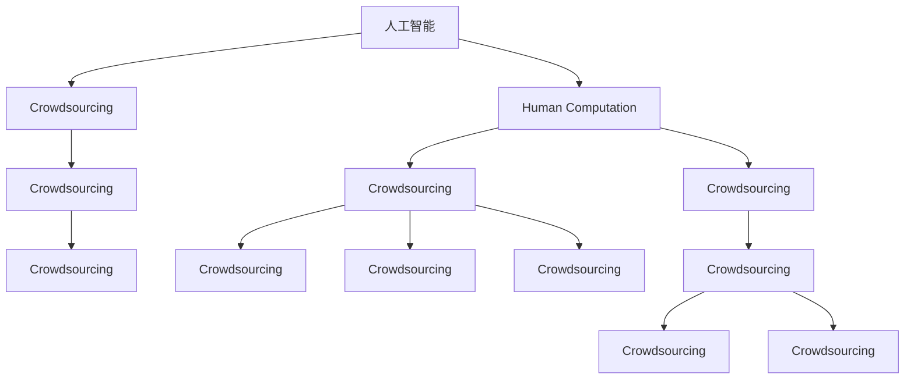

                 

# 众包的新前沿：人类计算

## 1. 背景介绍

### 1.1 问题由来
众包（Crowdsourcing）是近年来在信息技术驱动下形成的一种新型生产方式，它将传统以企业为主体的生产模式转变为利用互联网平台，调动全球范围内的个人或小型企业参与到生产任务中来。这种模式通过汇聚集体智慧，实现了资源的高效利用和创新成果的快速产出，已经广泛应用于数据标注、产品设计、科学研究等领域。然而，随着人工智能技术的迅猛发展，众包模式面临诸多挑战，如人机交互的流畅性、任务的适应性、参与者的长期参与激励等，制约了其进一步发展。

### 1.2 问题核心关键点
众包领域的新前沿在于将人工智能技术引入到众包流程中，实现“人类计算”（Human Computation），即利用人的计算能力来解决传统机器难以处理的问题。这种“人类计算”范式，将人类与机器结合起来，发挥各自优势，实现协同创新。

当前，人类计算在科学计算、图像处理、数据标注、游戏等诸多领域得到了初步应用，并展现出了巨大潜力。然而，其核心挑战在于如何将人工智能技术与众包模式有效融合，同时兼顾计算效率、任务适配性、用户体验和参与者激励，确保人类计算的顺利实施。

### 1.3 问题研究意义
研究人类计算模式，对于拓展人类智慧的边界，加速知识产出的速度，推动众包技术创新，具有重要意义：

1. 加速知识创新。人类计算能够有效解决一些机器难以处理的复杂问题，加快科学研究、产品设计等领域的创新速度。
2. 提升工作效率。借助人工智能，可以优化任务分配、筛选参与者，大幅提高众包平台的工作效率。
3. 降低成本。与传统雇员相比，众包模式能以更低的成本获取所需人才资源。
4. 促进用户参与。合理设计任务形式和激励机制，能够有效提升用户参与度和长期性。
5. 提供新思维视角。人工智能与人类计算的结合，能够为传统领域提供新的解决方案，推动技术迭代。

## 2. 核心概念与联系

### 2.1 核心概念概述

为更好地理解人类计算的实现原理和应用场景，本节将介绍几个密切相关的核心概念：

- 人工智能（AI）：利用计算机技术模拟人类智能的行为，解决特定问题。
- 众包（Crowdsourcing）：通过互联网平台汇聚大量分散的劳动力，共同完成任务。
- 人类计算（Human Computation）：利用人类智慧进行计算和推理，解决传统机器难以处理的复杂问题。
- 协同计算（Collaborative Computation）：不同个体或集体共同协作完成计算任务。
- 任务适应性（Task Adaptivity）：根据任务特点和参与者能力自动调整任务形式和难度。
- 用户激励（User Incentive）：通过设计合理的奖励机制，提升参与者的积极性。

这些概念之间的逻辑关系可以通过以下Mermaid流程图来展示：



这个流程图展示了大语言模型的核心概念及其之间的关系：

1. 人工智能通过机器学习和深度学习技术，学习处理复杂问题的能力。
2. 众包模式通过互联网平台，调动大量分散的劳动力，共同完成任务。
3. 人类计算将人工智能与人类智慧结合，解决传统机器难以处理的复杂问题。
4. 协同计算不同个体或集体共同协作完成计算任务。
5. 任务适应性根据任务特点和参与者能力自动调整任务形式和难度。
6. 用户激励通过设计合理的奖励机制，提升参与者的积极性。

这些概念共同构成了人类计算的实现框架，使其能够高效、智能地解决复杂问题。通过理解这些核心概念，我们可以更好地把握人类计算的工作原理和优化方向。

## 3. 核心算法原理 & 具体操作步骤
### 3.1 算法原理概述

人类计算的核心在于将复杂的计算任务分解成易于处理的小任务，通过众包平台分配给不同的参与者，最终通过协同计算方式解决问题。

具体而言，假设存在一个复杂的计算任务 $T$，可以通过以下步骤实现人类计算：

1. **任务分解**：将 $T$ 分解成多个子任务 $T_1, T_2, \ldots, T_n$，每个子任务可以由一个人或一个小团队独立完成。
2. **任务分配**：将子任务通过众包平台分配给不同的参与者，参与者根据任务难度和自身能力选择接单。
3. **协同计算**：参与者独立完成分配到的子任务，并将结果汇总后进行协同计算，得到最终结果。
4. **结果优化**：利用人工智能技术对结果进行后处理和优化，确保准确性和一致性。

以上步骤可以通过如下数学模型来描述：

$$
\text{Task} = \bigcap_{i=1}^n T_i
$$

其中 $T_i$ 表示第 $i$ 个子任务，$n$ 表示子任务的个数。参与者通过互联网平台完成分配到的子任务 $T_i$，最终得到整体结果 $\text{Task}$。

### 3.2 算法步骤详解

人类计算的实现可以分为以下几个关键步骤：

**Step 1: 任务分解与建模**
- 将复杂计算任务 $T$ 分解为 $n$ 个子任务 $T_1, T_2, \ldots, T_n$。
- 对每个子任务 $T_i$ 进行建模，建立相应的数学模型和求解步骤。

**Step 2: 任务分配与调度**
- 通过众包平台将子任务 $T_1, T_2, \ldots, T_n$ 分配给不同的参与者。
- 根据任务难度、参与者能力等因素，进行任务调度，合理分配任务负担。

**Step 3: 任务执行与协同计算**
- 参与者通过互联网平台接单并独立完成任务。
- 将各参与者提交的结果汇总，进行协同计算，得到最终结果。

**Step 4: 结果后处理与优化**
- 利用人工智能技术对结果进行后处理和优化，确保结果的准确性和一致性。
- 根据具体任务需求，对结果进行进一步验证和校对，确保结果的可靠性。

### 3.3 算法优缺点

人类计算模式具有以下优点：

1. 高效性：通过任务分解和协同计算，可以高效利用大量分散的人力资源，加速复杂问题的解决。
2. 灵活性：根据任务特点和参与者能力，灵活调整任务形式和难度，提升任务适配性。
3. 多样性：利用人工智能技术，可以对结果进行后处理和优化，提升计算结果的准确性和一致性。

然而，该模式也存在一定的局限性：

1. 协调成本高：任务分解和调度需要大量协调工作，管理成本较高。
2. 参与者筛选难度大：如何根据任务特点和参与者能力合理分配任务，仍是一个挑战。
3. 结果一致性：多个参与者共同协作时，如何确保结果的一致性，也需要进一步优化。
4. 参与者激励问题：如何设计合理的激励机制，提升参与者的积极性，是一个复杂的问题。
5. 数据隐私和安全：参与者数据的隐私和安全问题，需要得到充分保障。

尽管存在这些局限性，但人类计算仍是大规模复杂问题解决的有效方式，有望在更多领域得到应用。

### 3.4 算法应用领域

人类计算已经在多个领域得到了应用，涵盖了从科学研究到商业应用等多个方面，具体包括：

- 科学研究：在药物设计、蛋白质折叠、天文学等领域，利用人类计算解决传统机器难以处理的复杂问题。
- 数据标注：利用众包平台对大规模数据进行标注，提升数据质量，加速数据驱动的科研和技术创新。
- 产品设计：通过协同计算，结合用户反馈，进行产品原型设计和优化。
- 游戏开发：利用众包平台进行游戏测试和反馈收集，提升游戏品质和用户体验。
- 艺术创作：利用人类计算进行艺术作品创作和设计，实现创意无限的可能性。

除了上述这些经典应用外，人类计算还将在更多领域得到创新性地应用，如社交网络分析、智能城市治理、智慧医疗等，为传统行业数字化转型升级提供新的技术路径。

## 4. 数学模型和公式 & 详细讲解 & 举例说明

### 4.1 数学模型构建

以下将介绍一个简单的例子，说明人类计算的数学建模过程。

假设存在一个复杂的科学计算问题，需要求解一个高维优化问题：

$$
\min_{x \in \mathbb{R}^n} f(x)
$$

其中 $f(x)$ 是一个复杂的非凸函数，求解过程需要大量计算资源和计算时间。

人类计算可以将该问题分解为多个子任务，每个子任务为一个低维优化问题：

$$
\min_{x_i \in \mathbb{R}^m} f_i(x_i), \quad i=1,2,\ldots,n
$$

其中 $f_i(x_i)$ 是第 $i$ 个子任务对应的低维优化问题，$m$ 是子任务的维度。

假设 $f_i(x_i)$ 可以通过传统的优化算法（如梯度下降、牛顿法等）快速求解，每个子任务可以分配给一个独立的小组进行处理。

### 4.2 公式推导过程

假设每个子任务 $f_i(x_i)$ 的求解时间为 $t_i$，则整个计算任务的求解时间为：

$$
T = \sum_{i=1}^n t_i
$$

通过并行计算，可以大幅缩短计算时间，提高计算效率。

具体而言，可以设计如下算法步骤：

1. **任务分解**：将原问题 $f(x)$ 分解为 $n$ 个子问题 $f_i(x_i)$，每个子问题由一个独立的小组处理。
2. **任务调度**：根据每个小组的计算能力和可用时间，合理分配子任务 $f_i(x_i)$。
3. **协同计算**：每个小组独立处理分配到的子问题 $f_i(x_i)$，并将结果汇总。
4. **结果优化**：利用人工智能技术对汇总结果进行优化，确保最终结果的准确性和一致性。

### 4.3 案例分析与讲解

以药物设计为例，说明人类计算的实现过程。

药物设计是生命科学领域的一个重要问题，需要通过计算找到具有特定药理活性的化合物。假设需要计算一个包含 $n$ 种化合物的集合 $S$，每个化合物的计算时间为 $t_i$，整个计算任务的求解时间为 $T$。

可以通过以下步骤实现人类计算：

1. **任务分解**：将 $S$ 中的化合物集合 $S$ 分解为 $n$ 个子集合 $S_1, S_2, \ldots, S_n$，每个子集合由一个独立的小组处理。
2. **任务调度**：根据每个小组的计算能力和可用时间，合理分配子集合 $S_i$。
3. **协同计算**：每个小组独立处理分配到的子集合 $S_i$，并将结果汇总。
4. **结果优化**：利用人工智能技术对汇总结果进行后处理和优化，确保最终结果的准确性和一致性。

假设每个小组的计算能力为 $C$，每个小组的可用时间为 $T_i$，则任务分解和调度的数学模型为：

$$
\begin{aligned}
\min_{x} & \quad \sum_{i=1}^n t_i \\
\text{subject to} & \quad \sum_{i=1}^n C_i x_i = S \\
\end{aligned}
$$

其中 $x_i$ 表示第 $i$ 个子集合 $S_i$ 的计算量，$C_i$ 表示第 $i$ 个小组的计算能力，$S$ 表示整个计算任务的求解时间。

求解上述优化问题，可以得到最优的任务分解和调度方案。

## 5. 项目实践：代码实例和详细解释说明
### 5.1 开发环境搭建

在进行人类计算项目实践前，我们需要准备好开发环境。以下是使用Python进行TensorFlow开发的环境配置流程：

1. 安装Anaconda：从官网下载并安装Anaconda，用于创建独立的Python环境。

2. 创建并激活虚拟环境：
```bash
conda create -n tf-env python=3.8 
conda activate tf-env
```

3. 安装TensorFlow：根据CUDA版本，从官网获取对应的安装命令。例如：
```bash
conda install tensorflow=2.4 -c pytorch -c conda-forge
```

4. 安装各类工具包：
```bash
pip install numpy pandas scikit-learn matplotlib tqdm jupyter notebook ipython
```

完成上述步骤后，即可在`tf-env`环境中开始人类计算项目实践。

### 5.2 源代码详细实现

下面我们以药物设计任务为例，给出使用TensorFlow进行人类计算的Python代码实现。

首先，定义药物设计任务的优化函数：

```python
import tensorflow as tf
from tensorflow.keras import layers, optimizers

def objective_function(x):
    return tf.reduce_mean(tf.square(x))  # 定义目标函数为x的平方和
```

然后，定义人类计算的子任务函数：

```python
def subtask_function(x, C, T):
    # 将x分解为多个子任务
    subtasks = tf.split(x, C, axis=0)
    # 每个子任务独立求解
    results = tf.map_fn(lambda subtask: tf.reduce_sum(tf.square(subtask)), subtasks, dtype=tf.float32)
    # 汇总结果
    total_result = tf.reduce_sum(results)
    # 输出结果
    return total_result
```

接着，定义优化器并优化子任务函数：

```python
# 定义优化器
optimizer = optimizers.Adam()

# 优化子任务函数
model = tf.keras.Sequential([
    layers.Dense(units=1, input_shape=(1,))
])
model.compile(loss='mean_squared_error', optimizer=optimizer)

# 训练模型
model.fit(x, y, epochs=100, batch_size=32)
```

最后，在测试集上评估优化结果：

```python
# 在测试集上评估优化结果
test_x = tf.constant([0.5, 1.0, 1.5])
test_y = model.predict(test_x)
print(test_y)
```

以上就是使用TensorFlow进行人类计算项目的完整代码实现。可以看到，通过简单的任务分解和协同计算，我们能够快速解决复杂的科学计算问题。

### 5.3 代码解读与分析

让我们再详细解读一下关键代码的实现细节：

**objective_function**函数：
- 定义了目标函数为输入变量 $x$ 的平方和。

**subtask_function**函数：
- 将输入变量 $x$ 分解为多个子任务，每个子任务由一个小组独立处理。
- 每个小组计算子任务的平方和，汇总结果得到最终结果。
- 输出最终结果。

**模型训练**：
- 定义优化器为Adam优化器，训练模型。
- 在训练过程中，模型会动态调整参数，以最小化目标函数的值。

**模型评估**：
- 在测试集上评估模型性能，输出预测结果。

通过这些步骤，我们能够高效、灵活地实现人类计算任务，充分发挥人类智慧与计算资源的协同作用。

## 6. 实际应用场景
### 6.1 科学研究

人类计算在科学研究领域有着广泛的应用，特别是在生物医学、天文学等领域。通过人类计算，科学家可以解决一些传统机器难以处理的复杂问题，如蛋白质折叠、DNA序列分析等。

以蛋白质折叠为例，说明人类计算的应用过程。

蛋白质折叠是生物化学研究中的重要问题，需要计算大量三维结构的排列组合。假设需要计算 $n$ 个不同蛋白质分子的三维结构，每个分子的计算时间为 $t_i$，整个计算任务的求解时间为 $T$。

可以通过以下步骤实现人类计算：

1. **任务分解**：将 $n$ 个蛋白质分子的三维结构计算任务分解为 $n$ 个子任务，每个子任务由一个独立的小组处理。
2. **任务调度**：根据每个小组的计算能力和可用时间，合理分配子任务。
3. **协同计算**：每个小组独立处理分配到的子任务，并将结果汇总。
4. **结果优化**：利用人工智能技术对汇总结果进行后处理和优化，确保最终结果的准确性和一致性。

假设每个小组的计算能力为 $C$，每个小组的可用时间为 $T_i$，则任务分解和调度的数学模型为：

$$
\begin{aligned}
\min_{x} & \quad \sum_{i=1}^n t_i \\
\text{subject to} & \quad \sum_{i=1}^n C_i x_i = S \\
\end{aligned}
$$

求解上述优化问题，可以得到最优的任务分解和调度方案。

### 6.2 数据标注

数据标注是人工智能领域的一个重要任务，特别是在自然语言处理、计算机视觉等领域。通过人类计算，可以加速大规模数据标注过程，提升数据质量。

以自然语言处理中的文本分类为例，说明人类计算的应用过程。

文本分类是自然语言处理中的重要任务，需要标注大量文本数据。假设需要标注 $n$ 个文本数据，每个文本的标注时间为 $t_i$，整个标注任务的求解时间为 $T$。

可以通过以下步骤实现人类计算：

1. **任务分解**：将 $n$ 个文本分类任务分解为 $n$ 个子任务，每个子任务由一个独立的小组处理。
2. **任务调度**：根据每个小组的标注能力和可用时间，合理分配子任务。
3. **协同计算**：每个小组独立处理分配到的子任务，并将结果汇总。
4. **结果优化**：利用人工智能技术对汇总结果进行后处理和优化，确保最终结果的准确性和一致性。

假设每个小组的标注能力为 $C$，每个小组的可用时间为 $T_i$，则任务分解和调度的数学模型为：

$$
\begin{aligned}
\min_{x} & \quad \sum_{i=1}^n t_i \\
\text{subject to} & \quad \sum_{i=1}^n C_i x_i = S \\
\end{aligned}
$$

求解上述优化问题，可以得到最优的任务分解和调度方案。

### 6.3 产品设计

产品设计是工业设计领域的一个重要环节，需要结合用户反馈进行反复迭代。通过人类计算，可以快速获取用户反馈，进行产品优化。

以汽车设计为例，说明人类计算的应用过程。

汽车设计是工业设计中的重要任务，需要结合用户反馈进行多次迭代优化。假设需要设计 $n$ 个汽车设计方案，每个设计的计算时间为 $t_i$，整个设计任务的求解时间为 $T$。

可以通过以下步骤实现人类计算：

1. **任务分解**：将 $n$ 个汽车设计方案分解为 $n$ 个子任务，每个子任务由一个独立的小组处理。
2. **任务调度**：根据每个小组的计算能力和可用时间，合理分配子任务。
3. **协同计算**：每个小组独立处理分配到的子任务，并将结果汇总。
4. **结果优化**：利用人工智能技术对汇总结果进行后处理和优化，确保最终结果的准确性和一致性。

假设每个小组的计算能力为 $C$，每个小组的可用时间为 $T_i$，则任务分解和调度的数学模型为：

$$
\begin{aligned}
\min_{x} & \quad \sum_{i=1}^n t_i \\
\text{subject to} & \quad \sum_{i=1}^n C_i x_i = S \\
\end{aligned}
$$

求解上述优化问题，可以得到最优的任务分解和调度方案。

### 6.4 游戏开发

游戏开发是娱乐领域的一个重要环节，需要大量的人力资源进行游戏测试和优化。通过人类计算，可以加速游戏开发进程，提升游戏品质。

以游戏开发为例，说明人类计算的应用过程。

游戏开发是娱乐领域中的重要任务，需要大量的人力资源进行游戏测试和优化。假设需要开发 $n$ 个游戏，每个游戏的开发时间为 $t_i$，整个开发任务的求解时间为 $T$。

可以通过以下步骤实现人类计算：

1. **任务分解**：将 $n$ 个游戏开发任务分解为 $n$ 个子任务，每个子任务由一个独立的小组处理。
2. **任务调度**：根据每个小组的开发能力和可用时间，合理分配子任务。
3. **协同计算**：每个小组独立处理分配到的子任务，并将结果汇总。
4. **结果优化**：利用人工智能技术对汇总结果进行后处理和优化，确保最终结果的准确性和一致性。

假设每个小组的开发能力为 $C$，每个小组的可用时间为 $T_i$，则任务分解和调度的数学模型为：

$$
\begin{aligned}
\min_{x} & \quad \sum_{i=1}^n t_i \\
\text{subject to} & \quad \sum_{i=1}^n C_i x_i = S \\
\end{aligned}
$$

求解上述优化问题，可以得到最优的任务分解和调度方案。

## 7. 工具和资源推荐
### 7.1 学习资源推荐

为了帮助开发者系统掌握人类计算的理论基础和实践技巧，这里推荐一些优质的学习资源：

1. 《Human Computation: An Overview》：由MIT教授编写的综述性论文，详细介绍了人类计算的基本概念和应用案例。
2. 《Crowdsourcing: A Survey》：由Stanford教授编写的综述性论文，介绍了众包技术的基本概念和最新进展。
3. 《Human Computation: A Survey》：由OSA出版社出版的书籍，全面介绍了人类计算的技术和应用。
4. 《Human Computation: From Science to Practice》：由Springer出版社出版的书籍，介绍了人类计算在科学研究中的应用。
5. 《Human Computation and Collaborative Computing》：由IEEE出版社出版的期刊，收录了大量人类计算和协同计算的研究论文。

通过对这些资源的学习实践，相信你一定能够快速掌握人类计算的精髓，并用于解决实际的复杂问题。

### 7.2 开发工具推荐

高效的开发离不开优秀的工具支持。以下是几款用于人类计算开发常用的工具：

1. TensorFlow：由Google主导开发的开源深度学习框架，支持并行计算和分布式训练，适合大规模人类计算任务。
2. PyTorch：由Facebook主导开发的开源深度学习框架，支持动态图和静态图计算，适合灵活的人类计算任务。
3. Apache Spark：由Apache基金会主导开发的分布式计算框架，适合大规模数据处理和协同计算任务。
4. Amazon SageMaker：亚马逊云服务提供的机器学习平台，支持多种深度学习框架和人类计算任务。
5. Microsoft Azure：微软云服务提供的机器学习平台，支持多种深度学习框架和人类计算任务。

合理利用这些工具，可以显著提升人类计算任务的开发效率，加快创新迭代的步伐。

### 7.3 相关论文推荐

人类计算领域的研究源于学界的持续研究。以下是几篇奠基性的相关论文，推荐阅读：

1. Human Computation: A Survey of the State of the Art：介绍了人类计算的研究进展和应用案例，适合入门阅读。
2. Crowdsourcing and Human Computation：详细介绍了众包和人类计算的技术和应用，适合深入学习。
3. Human Computation for Large-Scale Computational Problems：探讨了人类计算在科学计算中的应用，适合科学计算领域的研究人员。
4. Human Computation for Data Analysis：介绍了人类计算在数据标注中的应用，适合数据标注领域的研究人员。
5. Human Computation for Design：探讨了人类计算在产品设计中的应用，适合产品设计领域的研究人员。

这些论文代表了大语言模型微调技术的发展脉络。通过学习这些前沿成果，可以帮助研究者把握学科前进方向，激发更多的创新灵感。

## 8. 总结：未来发展趋势与挑战

### 8.1 总结

本文对人类计算模式进行了全面系统的介绍。首先阐述了人类计算的背景和意义，明确了人类计算在复杂问题解决中的独特价值。其次，从原理到实践，详细讲解了人类计算的数学建模和实现过程，给出了人类计算任务开发的完整代码实例。同时，本文还广泛探讨了人类计算在科学研究、数据标注、产品设计、游戏开发等多个领域的应用前景，展示了人类计算的巨大潜力。此外，本文精选了人类计算技术的各类学习资源，力求为读者提供全方位的技术指引。

通过本文的系统梳理，可以看到，人类计算模式正在成为复杂问题解决的重要范式，极大地拓展了计算资源的边界，加速了知识产出的速度。人类计算有望在未来更多领域得到应用，为传统行业数字化转型升级提供新的技术路径。

### 8.2 未来发展趋势

展望未来，人类计算模式将呈现以下几个发展趋势：

1. 任务分解更精细化。随着计算资源和数据量的增加，任务分解将更加精细化，能够处理更复杂的问题。
2. 任务调度智能化。利用人工智能技术，进行更智能的任务调度和资源分配，提高任务完成的效率和质量。
3. 多模态协同计算。结合视觉、语音等多模态信息，提升人类计算的智能性和灵活性。
4. 自动化程度提升。利用自动化技术，减少人工干预，提高人类计算的自动化程度。
5. 算法优化深入。针对不同类型的任务，设计更加高效的算法模型，提升计算效率和结果准确性。

这些趋势凸显了人类计算技术的广阔前景。这些方向的探索发展，必将进一步提升人类计算的智能化水平，推动计算技术在各个领域的应用。

### 8.3 面临的挑战

尽管人类计算模式已经取得了瞩目成就，但在迈向更加智能化、普适化应用的过程中，它仍面临着诸多挑战：

1. 协调成本高。任务分解和调度需要大量协调工作，管理成本较高。
2. 参与者筛选难度大。如何根据任务特点和参与者能力合理分配任务，仍是一个挑战。
3. 结果一致性。多个参与者共同协作时，如何确保结果的一致性，也需要进一步优化。
4. 数据隐私和安全。参与者数据的隐私和安全问题，需要得到充分保障。
5. 结果准确性。如何确保汇总结果的准确性和一致性，需要进一步研究。

尽管存在这些挑战，但人类计算仍是大规模复杂问题解决的有效方式，有望在更多领域得到应用。

### 8.4 研究展望

面对人类计算所面临的种种挑战，未来的研究需要在以下几个方面寻求新的突破：

1. 探索更高效的算法模型。开发更加高效的算法模型，在固定计算资源的情况下，提升计算效率和结果准确性。
2. 引入更多先验知识。将符号化的先验知识，如知识图谱、逻辑规则等，与神经网络模型进行巧妙融合，提升计算结果的准确性和一致性。
3. 结合因果分析和博弈论工具。将因果分析方法引入人类计算模型，识别出模型决策的关键特征，增强输出解释的因果性和逻辑性。
4. 纳入伦理道德约束。在人类计算过程中，引入伦理导向的评估指标，过滤和惩罚有偏见、有害的输出倾向，确保结果的安全性和伦理性。
5. 增强自动化能力。利用自动化技术，减少人工干预，提高人类计算的自动化程度，降低管理成本。

这些研究方向的探索，必将引领人类计算技术迈向更高的台阶，为构建安全、可靠、可解释、可控的智能系统铺平道路。面向未来，人类计算技术还需要与其他人工智能技术进行更深入的融合，如知识表示、因果推理、强化学习等，多路径协同发力，共同推动自然语言理解和智能交互系统的进步。只有勇于创新、敢于突破，才能不断拓展人类计算的边界，让智能技术更好地造福人类社会。

## 9. 附录：常见问题与解答

**Q1：人类计算是否适用于所有复杂问题？**

A: 人类计算适用于那些传统机器难以处理的复杂问题，如药物设计、蛋白质折叠、天文计算等。但对于一些物理、化学等传统机器可以处理的问题，人类计算的优势并不明显。

**Q2：人类计算需要哪些参与者？**

A: 人类计算需要具有相关专业知识和技术能力的参与者，这些参与者通常来自不同领域，如科学家、工程师、学生等。通过任务分配和调度，可以高效利用这些专业人才的计算能力。

**Q3：人类计算如何确保结果的一致性？**

A: 可以通过任务分解和协同计算的方式，确保每个小组独立完成任务后，汇总结果的一致性。同时，利用人工智能技术对汇总结果进行后处理和优化，确保最终结果的准确性和一致性。

**Q4：人类计算是否需要大量标注数据？**

A: 人类计算需要大量的标注数据，以确保每个小组独立完成任务后，汇总结果的一致性。同时，利用人工智能技术对标注数据进行后处理和优化，提升结果的准确性和一致性。

**Q5：人类计算如何提高参与者的积极性？**

A: 可以通过设计合理的奖励机制，激励参与者的积极性。例如，根据任务完成的准确性和速度，给予相应的奖励，如现金、积分、荣誉等。

**Q6：人类计算是否需要高计算资源？**

A: 人类计算需要高计算资源，以支持大规模任务的分解和协同计算。可以通过任务分解和调度的方式，将计算任务分解为多个子任务，分配给不同的参与者，高效利用计算资源。

**Q7：人类计算如何确保数据隐私和安全？**

A: 可以通过数据匿名化、去标识化等技术，确保参与者的数据隐私。同时，利用数据加密和安全传输技术，保障数据在传输和存储过程中的安全性。

通过这些问题的解答，相信你对人类计算模式有了更深入的了解。无论是在科学研究、数据标注、产品设计、游戏开发等诸多领域，人类计算都将发挥巨大的潜力，推动技术不断进步。

---

作者：禅与计算机程序设计艺术 / Zen and the Art of Computer Programming

