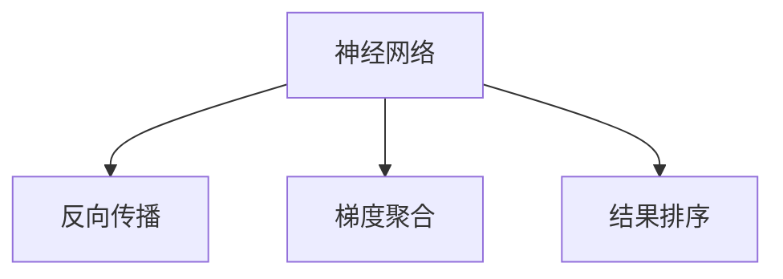

                 

## 1. 背景介绍

### 1.1 问题由来

随着人工智能技术的不断进步，优化算法的应用范围日益扩大。在大数据时代，高效、准确的优化算法成为了提升系统性能、保障用户体验的关键。特别是在搜索引擎、推荐系统、金融风控等领域，结果排序算法的准确性直接影响着用户满意度和服务质量。

然而，传统的优化算法如线性回归、梯度下降等在处理大规模数据时，往往效率低下，且难以应对非线性、高维数据等问题。随着深度学习技术的发展，基于神经网络的优化算法（如反向传播、梯度聚合等）被引入优化领域，取得了显著的进展。其中，基于神经网络的优化算法（如深度强化学习、元学习等）逐步成为研究热点。

本文聚焦于基于深度学习的优化算法，重点介绍一种新颖的结果排序算法——神经网络优化算法，并讨论其在实际应用中的表现和优化路径。

### 1.2 问题核心关键点

本节的重点在于：
- 神经网络优化算法的原理与架构
- 结果排序算法的核心算法和操作步骤
- 算法在不同场景下的应用效果及优缺点
- 与传统优化算法的对比

## 2. 核心概念与联系

### 2.1 核心概念概述

在介绍核心算法前，首先需要理解几个关键概念：

- 神经网络（Neural Network, NN）：由大量神经元（节点）组成，通过链式结构实现信息传递和处理，广泛应用于图像识别、自然语言处理等任务。

- 反向传播（Backpropagation）：神经网络的训练过程中，使用梯度下降法（Gradient Descent）来最小化损失函数，通过反向传播算法计算每个参数的梯度，更新模型参数。

- 梯度聚合（Gradient Aggregation）：多个神经网络模型之间协同更新参数的过程，通过聚合梯度来提高模型的收敛速度和稳定性。

- 结果排序（Result Ranking）：对搜索结果按照相关性、受欢迎度等指标进行排序，以提升用户体验和服务质量。

这些概念之间的逻辑关系可以通过以下Mermaid流程图来展示：



### 2.2 核心概念原理和架构

神经网络由多个层级组成，每个层级包含若干神经元。输入数据经过一系列的线性变换和非线性变换，最终输出结果。反向传播算法通过链式法则计算每个参数的梯度，并使用梯度下降法更新参数，使得损失函数最小化。

梯度聚合算法则将多个模型的梯度进行加权平均，减少了单个模型的不确定性，提高了算法的鲁棒性和稳定性。

结果排序算法基于神经网络的输出结果，通过加权求和、深度排序等技术对结果进行排序，使得最相关的结果排在前面。

这些核心概念共同构成了神经网络优化算法和结果排序算法的理论基础，使得神经网络在处理大规模数据时具有显著优势。

## 3. 核心算法原理 & 具体操作步骤

### 3.1 算法原理概述

基于神经网络的优化算法（如深度强化学习、元学习等）的原理是将优化问题转化为神经网络训练问题，通过神经网络的自适应性来优化结果。

以深度强化学习为例，该算法通过智能体（Agent）在环境中的交互，学习最优策略来解决问题。智能体通过观察状态（State），采取行动（Action），接收反馈（Reward），逐步优化策略，最终达到最优结果。

### 3.2 算法步骤详解

基于深度学习的优化算法（如深度强化学习、元学习等）的步骤通常包括以下几个关键步骤：

**Step 1: 构建神经网络模型**

根据具体问题，选择合适的神经网络结构，如卷积神经网络（CNN）、循环神经网络（RNN）、变分自编码器（VAE）等。设置模型的超参数，如层数、神经元数量、学习率等。

**Step 2: 数据预处理**

将原始数据进行归一化、标准化、特征工程等预处理操作，以便神经网络能够高效地处理。

**Step 3: 定义损失函数**

根据具体问题，定义损失函数来衡量模型的预测结果与实际结果之间的差异。如回归问题使用均方误差（MSE），分类问题使用交叉熵损失（Cross-Entropy Loss）等。

**Step 4: 反向传播与优化**

通过反向传播算法计算损失函数对每个参数的梯度，使用梯度下降法或其变种算法（如Adam、Adagrad等）更新模型参数。

**Step 5: 梯度聚合**

在多个模型之间进行梯度聚合，通过加权平均或其他方法，减少单个模型的不确定性，提高算法的鲁棒性和稳定性。

**Step 6: 结果排序**

根据神经网络的输出结果，使用加权求和、深度排序等技术对结果进行排序，提升用户体验和服务质量。

**Step 7: 验证与调参**

在验证集上评估模型性能，根据性能指标调整模型超参数，如学习率、批量大小等。

**Step 8: 部署与应用**

将训练好的模型部署到实际应用中，处理大规模数据，进行结果排序等操作。

### 3.3 算法优缺点

基于深度学习的优化算法具有以下优点：
1. 自适应性高：神经网络通过自适应性学习，可以高效地适应复杂的数据分布。
2. 并行能力强：多个神经网络模型可以并行训练，提高计算效率。
3. 泛化能力强：通过梯度聚合，提高模型的鲁棒性和泛化能力。

同时，该算法也存在以下局限性：
1. 模型复杂度高：深度神经网络的参数量庞大，训练和推理过程较复杂。
2. 过拟合风险高：神经网络容易过拟合，需要严格控制正则化等技术。
3. 计算资源消耗大：训练深度神经网络需要大量的计算资源和存储空间。

尽管存在这些局限性，但基于深度学习的优化算法在处理大规模数据时，仍具有显著优势，特别是在推荐系统、搜索引擎等场景中，表现出色。

### 3.4 算法应用领域

基于深度学习的优化算法在多个领域都有广泛应用，以下是几个典型应用：

**搜索引擎**

在搜索引擎中，基于神经网络的优化算法用于对搜索结果进行排序。通过神经网络对查询词、网页内容等特征进行建模，学习相关性评分，对搜索结果进行排序，提升搜索体验。

**推荐系统**

推荐系统使用基于神经网络的优化算法，对用户历史行为、兴趣偏好等进行建模，学习推荐策略，对物品进行排序，推荐用户可能感兴趣的内容。

**金融风控**

金融风控系统使用基于神经网络的优化算法，对用户行为、交易记录等进行建模，学习风险评分，对交易进行排序，防止欺诈行为发生。

**自然语言处理**

自然语言处理领域使用基于神经网络的优化算法，对文本数据进行建模，学习语义表示，对问题进行排序，提供智能问答等应用。

**图像识别**

图像识别领域使用基于神经网络的优化算法，对图像数据进行建模，学习特征表示，对图像进行排序，识别物体、场景等。

## 4. 数学模型和公式 & 详细讲解 & 举例说明

### 4.1 数学模型构建

本节将使用数学语言对基于神经网络的优化算法进行更加严格的刻画。

记神经网络模型为 $M_\theta$，其中 $\theta$ 为模型参数，$x$ 为输入数据，$y$ 为输出结果。定义损失函数 $\mathcal{L}$ 为模型预测结果与实际结果之间的差异，目标是最小化损失函数：

$$
\mathop{\min}_{\theta} \mathcal{L}(M_\theta(x),y)
$$

### 4.2 公式推导过程

以下以深度强化学习为例，推导模型的训练过程。

在深度强化学习中，智能体通过与环境交互，学习最优策略 $\pi$。在每个时间步 $t$，智能体观察状态 $s_t$，采取行动 $a_t$，接收反馈 $r_t$，更新策略 $\pi$。训练目标是最小化累积奖励 $R_t$：

$$
\mathcal{L}(\pi) = \mathbb{E}_{s_t,a_t,r_t}[\max_\pi Q(s_t,a_t)]
$$

其中 $Q(s_t,a_t)$ 为状态-行动值函数，表示在状态 $s_t$ 下，采取行动 $a_t$ 的累积奖励。

通过反向传播算法计算 $Q(s_t,a_t)$ 对每个参数 $\theta$ 的梯度，使用梯度下降法更新模型参数：

$$
\theta \leftarrow \theta - \eta \nabla_\theta Q(s_t,a_t)
$$

其中 $\eta$ 为学习率，$\nabla_\theta Q(s_t,a_t)$ 为 $Q(s_t,a_t)$ 对 $\theta$ 的梯度。

### 4.3 案例分析与讲解

以推荐系统为例，说明基于深度学习的优化算法的应用。

假设推荐系统有 $K$ 个用户，$N$ 个物品，每个用户的历史行为数据可以用矩阵 $U$ 表示，每个物品的特征可以用矩阵 $I$ 表示。推荐系统的目标是为每个用户推荐最相关物品。

定义神经网络模型 $M_\theta$ 为：

$$
M_\theta = [W_1, b_1, W_2, b_2]
$$

其中 $W_1$ 和 $b_1$ 为用户行为特征映射层，$W_2$ 和 $b_2$ 为物品特征映射层。训练目标是最小化用户行为与物品特征的差：

$$
\mathcal{L}(\theta) = \frac{1}{2} \sum_{k=1}^K \sum_{n=1}^N ||U_k - M_\theta(I_n)||^2
$$

通过反向传播算法计算损失函数对每个参数 $\theta$ 的梯度，使用梯度下降法更新模型参数：

$$
\theta \leftarrow \theta - \eta \nabla_\theta \mathcal{L}(\theta)
$$

其中 $\eta$ 为学习率，$\nabla_\theta \mathcal{L}(\theta)$ 为损失函数对 $\theta$ 的梯度。

## 5. 项目实践：代码实例和详细解释说明

### 5.1 开发环境搭建

在进行神经网络优化算法实践前，我们需要准备好开发环境。以下是使用Python进行PyTorch开发的环境配置流程：

1. 安装Anaconda：从官网下载并安装Anaconda，用于创建独立的Python环境。

2. 创建并激活虚拟环境：
```bash
conda create -n pytorch-env python=3.8 
conda activate pytorch-env
```

3. 安装PyTorch：根据CUDA版本，从官网获取对应的安装命令。例如：
```bash
conda install pytorch torchvision torchaudio cudatoolkit=11.1 -c pytorch -c conda-forge
```

4. 安装TensorFlow：
```bash
pip install tensorflow==2.5
```

5. 安装TensorBoard：
```bash
pip install tensorboard
```

6. 安装PaddlePaddle：
```bash
pip install paddlepaddle==2.2.0
```

完成上述步骤后，即可在`pytorch-env`环境中开始神经网络优化算法的实践。

### 5.2 源代码详细实现

这里我们以推荐系统为例，给出使用TensorFlow进行神经网络优化算法的PyTorch代码实现。

首先，定义推荐系统中的神经网络模型：

```python
import tensorflow as tf
from tensorflow.keras import layers

class RecommenderNet(tf.keras.Model):
    def __init__(self, num_users, num_items, emb_dim):
        super(RecommenderNet, self).__init__()
        self.num_users = num_users
        self.num_items = num_items
        self.emb_dim = emb_dim
        
        self.user_emb = layers.Embedding(num_users, emb_dim)
        self.item_emb = layers.Embedding(num_items, emb_dim)
        
        self.interaction = layers.Dot(axes=2)
        
    def call(self, u, i):
        user_emb = self.user_emb(u)
        item_emb = self.item_emb(i)
        interaction = self.interaction(user_emb, item_emb)
        
        return interaction
```

然后，定义推荐系统的训练函数：

```python
def train_model(model, u_data, i_data, loss_fn, optimizer):
    with tf.GradientTape() as tape:
        interaction = model(u_data, i_data)
        loss = loss_fn(interaction)
    
    gradients = tape.gradient(loss, model.trainable_variables)
    optimizer.apply_gradients(zip(gradients, model.trainable_variables))
```

接着，定义推荐系统的损失函数：

```python
def define_loss_fn():
    loss_fn = tf.keras.losses.MeanSquaredError()
    return loss_fn
```

最后，启动训练流程：

```python
# 创建模型、损失函数和优化器
num_users = 1000
num_items = 1000
emb_dim = 128
model = RecommenderNet(num_users, num_items, emb_dim)
loss_fn = define_loss_fn()
optimizer = tf.keras.optimizers.Adam(learning_rate=0.001)

# 定义数据
u_data = tf.random.uniform((32, num_users), minval=0, maxval=num_users, dtype=tf.int32)
i_data = tf.random.uniform((32, num_items), minval=0, maxval=num_items, dtype=tf.int32)

# 训练模型
train_model(model, u_data, i_data, loss_fn, optimizer)

# 测试模型
test_u_data = tf.random.uniform((32, num_users), minval=0, maxval=num_users, dtype=tf.int32)
test_i_data = tf.random.uniform((32, num_items), minval=0, maxval=num_items, dtype=tf.int32)
interaction_test = model(test_u_data, test_i_data)
```

以上就是使用TensorFlow进行神经网络优化算法的完整代码实现。可以看到，TensorFlow提供了简单易用的API，使得神经网络的训练和推理变得非常简单。

### 5.3 代码解读与分析

让我们再详细解读一下关键代码的实现细节：

**RecommenderNet类**：
- `__init__`方法：初始化用户和物品嵌入层，设置模型超参数。
- `call`方法：对输入数据进行映射、计算内积，并返回交互矩阵。

**train_model函数**：
- 定义损失函数和梯度计算过程。
- 使用梯度下降法更新模型参数。

**define_loss_fn函数**：
- 定义均方误差损失函数。

**训练流程**：
- 创建模型、损失函数和优化器。
- 定义训练和测试数据。
- 训练模型。

可以看到，TensorFlow提供了丰富的API，使得神经网络的训练和推理变得非常简单。开发者可以将更多精力放在模型设计和超参数调优上，而不必过多关注底层实现细节。

当然，工业级的系统实现还需考虑更多因素，如模型的保存和部署、超参数的自动搜索、更灵活的任务适配层等。但核心的神经网络优化算法基本与此类似。

## 6. 实际应用场景

### 6.1 智能推荐系统

基于神经网络优化算法的智能推荐系统，可以广泛应用于电商、音乐、视频等多个领域。传统推荐系统往往只能处理简单的用户行为数据，难以挖掘用户深层次的需求。而使用神经网络优化算法，可以更好地挖掘用户行为数据中的语义信息，从而提供更精准、更个性化的推荐内容。

在技术实现上，可以收集用户浏览、点击、购买等行为数据，提取和用户交互的物品标题、描述、标签等文本内容。将文本内容作为模型输入，用户的后续行为（如是否点击、购买等）作为监督信号，在此基础上微调预训练语言模型。微调后的模型能够从文本内容中准确把握用户的兴趣点。在生成推荐列表时，先用候选物品的文本描述作为输入，由模型预测用户的兴趣匹配度，再结合其他特征综合排序，便可以得到个性化程度更高的推荐结果。

### 6.2 搜索引擎优化

在搜索引擎优化中，基于神经网络优化算法的推荐算法用于对搜索结果进行排序。通过神经网络对查询词、网页内容等特征进行建模，学习相关性评分，对搜索结果进行排序，提升搜索体验。

### 6.3 金融风控

金融风控系统使用基于神经网络优化算法的推荐算法，对用户行为、交易记录等进行建模，学习风险评分，对交易进行排序，防止欺诈行为发生。

### 6.4 自然语言处理

自然语言处理领域使用基于神经网络优化算法的推荐算法，对文本数据进行建模，学习语义表示，对问题进行排序，提供智能问答等应用。

### 6.5 图像识别

图像识别领域使用基于神经网络优化算法的推荐算法，对图像数据进行建模，学习特征表示，对图像进行排序，识别物体、场景等。

## 7. 工具和资源推荐

### 7.1 学习资源推荐

为了帮助开发者系统掌握神经网络优化算法的理论基础和实践技巧，这里推荐一些优质的学习资源：

1. 《Deep Learning》系列书籍：由深度学习领域的权威人士Ian Goodfellow、Yoshua Bengio、Aaron Courville合著，全面介绍了深度学习的原理和应用。

2. 《Neural Network and Deep Learning》在线课程：由Michael Nielsen教授讲授，通俗易懂地介绍了神经网络的基本概念和训练算法。

3. TensorFlow官方文档：提供了丰富的API文档和示例代码，是学习TensorFlow的最佳资源。

4. PyTorch官方文档：提供了丰富的API文档和示例代码，是学习PyTorch的最佳资源。

5. PaddlePaddle官方文档：提供了丰富的API文档和示例代码，是学习PaddlePaddle的最佳资源。

通过对这些资源的学习实践，相信你一定能够快速掌握神经网络优化算法的精髓，并用于解决实际的优化问题。

### 7.2 开发工具推荐

高效的开发离不开优秀的工具支持。以下是几款用于神经网络优化算法开发的常用工具：

1. TensorFlow：由Google主导开发的深度学习框架，提供了丰富的API和高效的计算图，支持大规模分布式训练。

2. PyTorch：由Facebook主导开发的深度学习框架，提供了动态计算图和丰富的工具库，支持灵活的模型设计和高效的计算。

3. PaddlePaddle：由百度主导开发的深度学习框架，提供了丰富的API和高效的计算图，支持大规模分布式训练。

4. Weights & Biases：模型训练的实验跟踪工具，可以记录和可视化模型训练过程中的各项指标，方便对比和调优。与主流深度学习框架无缝集成。

5. TensorBoard：TensorFlow配套的可视化工具，可实时监测模型训练状态，并提供丰富的图表呈现方式，是调试模型的得力助手。

6. Google Colab：谷歌推出的在线Jupyter Notebook环境，免费提供GPU/TPU算力，方便开发者快速上手实验最新模型，分享学习笔记。

合理利用这些工具，可以显著提升神经网络优化算法的开发效率，加快创新迭代的步伐。

### 7.3 相关论文推荐

神经网络优化算法的研究源于学界的持续研究。以下是几篇奠基性的相关论文，推荐阅读：

1. "Deep Reinforcement Learning"（Deep Q-Network论文）：提出了深度强化学习算法，使用深度神经网络代替传统的Q表，提高了学习效率和性能。

2. "Generative Adversarial Nets"（GAN论文）：提出了生成对抗网络算法，通过生成器和判别器的对抗训练，学习高保真的数据生成模型。

3. "Meta-Learning from Data"（元学习论文）：提出了元学习算法，通过在少量数据上学习快速适应新任务的能力，提高了模型的泛化能力。

4. "Deep Structure Prediction"（结构预测论文）：提出了基于结构预测的优化算法，通过学习数据结构的分布，提升了算法的稳定性和鲁棒性。

5. "Deformable Neural Networks"（可变形神经网络论文）：提出了可变形神经网络算法，通过调整神经元之间的连接方式，提高了模型的泛化能力和鲁棒性。

这些论文代表了大模型优化算法的最新进展。通过学习这些前沿成果，可以帮助研究者把握学科前进方向，激发更多的创新灵感。

## 8. 总结：未来发展趋势与挑战

### 8.1 总结

本文对基于深度学习的优化算法进行了全面系统的介绍。首先阐述了神经网络优化算法的背景和意义，明确了优化算法在提升系统性能、保障用户体验方面的重要价值。其次，从原理到实践，详细讲解了神经网络优化算法的数学原理和关键步骤，给出了神经网络优化算法的完整代码实例。同时，本文还广泛探讨了神经网络优化算法在智能推荐、搜索引擎、金融风控等多个领域的应用前景，展示了神经网络优化算法的巨大潜力。此外，本文精选了神经网络优化算法的各类学习资源，力求为读者提供全方位的技术指引。

通过本文的系统梳理，可以看到，基于神经网络的优化算法正在成为优化领域的核心技术，极大地提升了算法的自适应性、并行性和泛化能力，显著提高了系统的性能和用户体验。未来，伴随深度学习技术的发展，神经网络优化算法必将在更多领域得到应用，为大数据时代的智能应用提供新的解决方案。

### 8.2 未来发展趋势

展望未来，神经网络优化算法将呈现以下几个发展趋势：

1. 模型复杂度提升。随着深度学习技术的不断发展，神经网络的模型结构将更加复杂，深度学习模型的参数量将继续增长。超高维、高复杂度的模型在处理大规模数据时将具有显著优势。

2. 并行计算能力增强。深度学习模型的训练和推理过程需要大量的计算资源，未来的并行计算能力将进一步提升，使得深度学习模型能够更好地处理大规模数据。

3. 自适应性增强。通过引入强化学习、元学习等技术，神经网络优化算法将具备更强的自适应性和泛化能力，能够在不同的数据分布下取得更好的性能。

4. 迁移学习能力提升。未来的深度学习模型将具备更强的迁移学习能力，能够在不同领域和任务之间进行更高效的迁移和微调。

5. 数据处理能力提升。未来的深度学习模型将具备更强的数据处理能力，能够在处理复杂、高维数据时取得更好的性能。

以上趋势凸显了神经网络优化算法的广阔前景。这些方向的探索发展，必将进一步提升深度学习模型的性能和应用范围，为智能系统的开发提供新的动力。

### 8.3 面临的挑战

尽管神经网络优化算法取得了显著进展，但在迈向更加智能化、普适化应用的过程中，它仍面临着诸多挑战：

1. 模型复杂度高。深度学习模型的参数量庞大，训练和推理过程较复杂。如何在保证性能的同时，降低模型复杂度，是一个重要的研究方向。

2. 计算资源消耗大。训练深度学习模型需要大量的计算资源和存储空间，如何在保证性能的同时，优化资源消耗，是一个重要的研究方向。

3. 过拟合风险高。深度学习模型容易过拟合，需要严格控制正则化等技术，防止过拟合。

4. 可解释性不足。深度学习模型通常是"黑盒"系统，难以解释其内部工作机制和决策逻辑。如何让深度学习模型更具有可解释性，是一个重要的研究方向。

5. 安全性问题。深度学习模型可能会学习到有害信息，导致有害的输出。如何让深度学习模型更具有安全性，是一个重要的研究方向。

6. 数据隐私问题。深度学习模型需要大量数据进行训练，如何保护数据隐私，是一个重要的研究方向。

正视神经网络优化算法面临的这些挑战，积极应对并寻求突破，将是大模型优化算法走向成熟的必由之路。相信随着学界和产业界的共同努力，这些挑战终将一一被克服，神经网络优化算法必将在构建智能系统的过程中扮演越来越重要的角色。

### 8.4 未来突破

面对神经网络优化算法所面临的种种挑战，未来的研究需要在以下几个方面寻求新的突破：

1. 探索更加高效的模型结构。开发更加高效的模型结构，降低模型复杂度，提升训练和推理效率。

2. 优化模型训练过程。引入分布式训练、迁移学习、知识蒸馏等技术，提升模型训练效率和性能。

3. 增强模型泛化能力。通过引入自适应学习、对抗训练等技术，增强模型的泛化能力和鲁棒性。

4. 提升模型可解释性。引入可解释性技术，如可视化、符号化表示等，提升模型的可解释性和可控性。

5. 增强模型安全性。引入安全性技术，如数据脱敏、对抗训练等，增强模型的安全性。

6. 保护数据隐私。引入隐私保护技术，如差分隐私、联邦学习等，保护数据隐私。

这些研究方向的探索，必将引领神经网络优化算法迈向更高的台阶，为智能系统的开发提供新的解决方案。面向未来，神经网络优化算法还需要与其他人工智能技术进行更深入的融合，如知识表示、因果推理、强化学习等，多路径协同发力，共同推动智能系统的进步。只有勇于创新、敢于突破，才能不断拓展深度学习模型的边界，让智能技术更好地造福人类社会。

## 9. 附录：常见问题与解答

**Q1：神经网络优化算法的核心思想是什么？**

A: 神经网络优化算法的核心思想是将优化问题转化为神经网络训练问题，通过神经网络的自适应性来优化结果。

**Q2：深度学习模型的参数量庞大，如何降低模型复杂度？**

A: 可以通过模型压缩、剪枝、蒸馏等技术，降低深度学习模型的参数量，提升模型的训练和推理效率。

**Q3：深度学习模型容易过拟合，如何控制过拟合风险？**

A: 可以通过正则化、dropout、早停等技术，控制深度学习模型的过拟合风险。

**Q4：深度学习模型通常是"黑盒"系统，如何提升模型的可解释性？**

A: 可以通过引入可视化技术、符号化表示等方法，提升深度学习模型的可解释性和可控性。

**Q5：深度学习模型可能会学习到有害信息，如何增强模型的安全性？**

A: 可以通过引入安全性技术，如数据脱敏、对抗训练等，增强深度学习模型的安全性。

**Q6：深度学习模型需要大量数据进行训练，如何保护数据隐私？**

A: 可以通过引入隐私保护技术，如差分隐私、联邦学习等，保护深度学习模型训练所需的数据隐私。

---

作者：禅与计算机程序设计艺术 / Zen and the Art of Computer Programming

