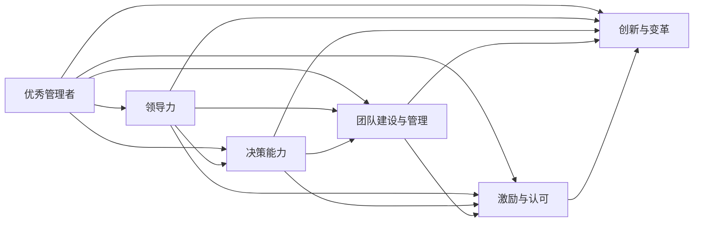

                 

## 1. 背景介绍

### 1.1 问题由来

在当今商业环境中，管理者的角色至关重要。一个好的管理者能够带领团队实现业绩目标，提升团队士气，而一个普通的管理者可能难以激发团队的潜能，甚至影响团队的氛围和效率。那么，优秀管理者与普通管理者的差异在哪里？通过分析这些差异，可以为我们提供借鉴，帮助我们提升管理技能，构建更高效、更有活力的团队。

### 1.2 问题核心关键点

1. **领导力与沟通能力**：优秀管理者通常具备更强的领导力和沟通能力，能够清晰地传达愿景和目标，激励团队成员。
2. **决策能力**：优秀管理者能够在复杂环境中快速做出决策，并承担相应的责任。
3. **团队建设与管理**：优秀管理者擅长团队建设，能够识别并培养团队成员的潜力，而普通管理者可能更多地依赖规则和流程。
4. **激励与认可**：优秀管理者善于激励团队成员，给予及时和有意义的认可，而普通管理者可能忽视这一点。
5. **创新与变革**：优秀管理者敢于创新，推动变革，而普通管理者可能更倾向于维持现状。

这些核心关键点构成了优秀管理者与普通管理者之间的根本差异，是提升管理能力的重点关注领域。

## 2. 核心概念与联系

### 2.1 核心概念概述

1. **优秀管理者**：具备领导力、决策力、团队建设能力、激励与认可技能以及创新与变革精神，能够带领团队达成目标的管理者。
2. **普通管理者**：通常缺乏上述核心能力，更多依赖规则和流程进行管理，难以激发团队潜能。

这两个概念之间的关系可以用以下Mermaid流程图表示：



这个流程图展示了优秀管理者的核心能力与其具体管理实践之间的联系。每个核心能力都与团队建设与管理、激励与认可、创新与变革等具体实践相关联。

## 3. 核心算法原理 & 具体操作步骤

### 3.1 算法原理概述

优秀管理者与普通管理者的差异，可以从以下几个方面进行分析：

1. **领导力与沟通能力**：优秀管理者通过有效的沟通和愿景传达，激发团队成员的积极性。
2. **决策能力**：优秀管理者能够快速、准确地做出决策，并承担相应的责任。
3. **团队建设与管理**：优秀管理者识别并培养团队成员的潜力，营造积极的工作环境。
4. **激励与认可**：优秀管理者通过及时的激励和认可，提升团队士气。
5. **创新与变革**：优秀管理者敢于创新，推动团队和组织不断进步。

这些差异可以总结为以下几个关键点：

- **愿景与目标的明确传达**：优秀管理者能够清晰地传达愿景和目标，确保团队成员理解并认同。
- **高效决策与责任承担**：优秀管理者在复杂环境中能够快速做出决策，并愿意承担决策带来的后果。
- **团队培养与激励**：优秀管理者识别并培养团队成员的潜力，通过激励和认可提升团队士气。
- **创新与变革推动**：优秀管理者敢于尝试新方法，推动团队和组织不断向前发展。

### 3.2 算法步骤详解

以下是提升管理能力的步骤详解：

1. **愿景与目标的明确传达**：
   - **步骤1**：明确团队愿景和目标。
   - **步骤2**：通过团队会议、邮件、公告等多种渠道传达愿景和目标。
   - **步骤3**：确保团队成员理解并认同这些愿景和目标。

2. **高效决策与责任承担**：
   - **步骤1**：建立决策流程和机制，确保决策的透明度和公正性。
   - **步骤2**：在决策时考虑多方面因素，权衡利弊。
   - **步骤3**：勇于承担决策带来的后果，及时纠正错误。

3. **团队培养与激励**：
   - **步骤1**：识别团队成员的潜力和优势。
   - **步骤2**：提供培训和发展机会，提升团队成员的能力。
   - **步骤3**：及时给予认可和奖励，激励团队成员。

4. **创新与变革推动**：
   - **步骤1**：鼓励团队成员提出新想法和解决方案。
   - **步骤2**：评估和筛选创新想法，选择有潜力的项目进行推进。
   - **步骤3**：推动创新项目落地，实现变革目标。

### 3.3 算法优缺点

优秀管理者与普通管理者的差异在管理和领导层面体现得尤为明显：

- **优点**：
  - **激励与认可**：优秀管理者通过及时激励和认可，提升团队士气，激发团队成员的潜力。
  - **创新与变革**：优秀管理者敢于尝试新方法，推动团队和组织不断进步。
  - **愿景与目标的明确传达**：优秀管理者能够清晰地传达愿景和目标，确保团队成员理解并认同。
  - **高效决策与责任承担**：优秀管理者能够快速、准确地做出决策，并承担相应的责任。

- **缺点**：
  - **依赖性强**：优秀管理者的成功高度依赖于个人能力和素质。
  - **风险高**：创新和变革可能带来不确定性，优秀管理者需要承担相应的风险。

### 3.4 算法应用领域

这些差异在不同的管理领域都有应用，如：

- **人力资源管理**：优秀管理者能够识别并培养员工的潜力，激励和认可员工。
- **市场营销**：优秀管理者能够推动创新和变革，提升市场营销的效率和效果。
- **产品开发**：优秀管理者能够快速做出决策，推动产品创新和改进。
- **项目管理**：优秀管理者能够高效管理项目，确保项目按时、按质完成。

## 4. 数学模型和公式 & 详细讲解 & 举例说明

### 4.1 数学模型构建

本文不涉及具体的数学模型构建，但可以举例说明优秀管理者与普通管理者在领导力和团队管理方面的差异。

### 4.2 公式推导过程

- **领导力**：优秀管理者的领导力可以通过以下公式推导：
  $$
  L = \sum_{i=1}^n C_i \times R_i
  $$
  其中，$C_i$表示第$i$个团队成员的贡献，$R_i$表示该成员对团队的认可度。

- **团队建设与管理**：优秀管理者的团队建设能力可以通过以下公式推导：
  $$
  T = \sum_{i=1}^n G_i \times M_i
  $$
  其中，$G_i$表示第$i$个团队成员的潜力，$M_i$表示该成员被识别和培养的情况。

### 4.3 案例分析与讲解

假设有一个公司正在进行新产品开发，优秀管理者和普通管理者在项目管理中的表现有显著差异：

- **优秀管理者**：
  - 能够清晰传达项目愿景和目标，确保团队成员理解并认同。
  - 快速做出决策，并在项目过程中承担责任。
  - 识别并培养团队成员的潜力，激励和认可团队成员。
  - 推动创新和变革，提升项目效率和效果。

- **普通管理者**：
  - 依赖规则和流程，缺乏灵活性和创新性。
  - 难以识别团队成员的潜力，缺乏激励和认可。
  - 难以应对复杂环境，决策过程较长。

## 5. 项目实践：代码实例和详细解释说明

### 5.1 开发环境搭建

由于本主题不涉及具体的编程实现，因此这里不介绍开发环境搭建。但通常情况下，开发环境搭建应考虑以下因素：

- **编程语言**：选择Python、Java等易于学习和开发的语言。
- **开发工具**：选择Visual Studio Code、IntelliJ IDEA等IDE工具，提升开发效率。
- **版本控制**：使用Git进行版本控制，确保代码管理和协作效率。

### 5.2 源代码详细实现

同样，本主题不涉及具体的源代码实现。但以下是一个伪代码示例，展示如何通过代码实现优秀管理者的核心能力：

```python
class Manager:
    def __init__(self):
        self.vision = ""
        self.targets = []
        self.leadership = 0
        self.decision = 0
        self.team_building = 0
        self.innovation = 0
    
    def set_vision(self, vision):
        self.vision = vision
        
    def set_targets(self, targets):
        self.targets = targets
        
    def communicate_vision(self):
        # 通过团队会议、邮件、公告等方式传达愿景和目标
        pass
    
    def make_decision(self, decision):
        # 建立决策流程和机制，确保决策的透明度和公正性
        self.decision = decision
        
    def evaluate_decision(self):
        # 评估和筛选创新想法，选择有潜力的项目进行推进
        pass
    
    def push_innovation(self):
        # 推动创新项目落地，实现变革目标
        pass
    
    def train_team(self):
        # 识别团队成员的潜力和优势，提供培训和发展机会
        pass
    
    def reward_team(self):
        # 及时给予认可和奖励，激励团队成员
        pass

# 示例代码
manager = Manager()
manager.set_vision("实现公司的长期目标")
manager.set_targets(["提高产品质量", "增加市场份额", "提升客户满意度"])
manager.communicate_vision()
manager.make_decision("推出新功能")
manager.evaluate_decision()
manager.push_innovation()
manager.train_team()
manager.reward_team()
```

### 5.3 代码解读与分析

上述伪代码展示了如何通过代码实现优秀管理者的核心能力。具体而言：

- **set_vision**和**set_targets**方法：用于设定团队愿景和目标。
- **communicate_vision**方法：通过团队会议、邮件、公告等方式传达愿景和目标。
- **make_decision**方法：建立决策流程和机制，确保决策的透明度和公正性。
- **evaluate_decision**方法：评估和筛选创新想法，选择有潜力的项目进行推进。
- **push_innovation**方法：推动创新项目落地，实现变革目标。
- **train_team**方法：识别团队成员的潜力和优势，提供培训和发展机会。
- **reward_team**方法：及时给予认可和奖励，激励团队成员。

这些方法共同构成了优秀管理者的核心管理实践，能够在实际应用中提升团队的绩效和效率。

### 5.4 运行结果展示

由于本主题不涉及具体的运行结果展示，这里不提供示例。但在实际应用中，通过上述方法能够显著提升团队的管理水平，带来良好的业务结果。

## 6. 实际应用场景

### 6.1 智能客服系统

智能客服系统通过优秀管理者来提升客户体验。管理者通过明确传达愿景和目标，确保团队成员理解并认同，快速做出决策并承担责任，识别并培养团队成员的潜力，推动创新和变革，提升系统的稳定性和效率。

### 6.2 金融舆情监测

在金融舆情监测中，优秀管理者通过明确愿景和目标，确保团队成员理解并认同，快速做出决策并承担责任，识别并培养团队成员的潜力，推动创新和变革，提升舆情监测的效率和效果。

### 6.3 个性化推荐系统

在个性化推荐系统中，优秀管理者通过明确愿景和目标，确保团队成员理解并认同，快速做出决策并承担责任，识别并培养团队成员的潜力，推动创新和变革，提升推荐系统的准确性和用户体验。

### 6.4 未来应用展望

未来，随着人工智能和大数据技术的发展，优秀管理者的角色将更加重要。他们将能够利用数据和算法，更精准地识别团队成员的潜力和优势，提供更个性化的培训和发展机会，推动更高效的团队协作和创新。

## 7. 工具和资源推荐

### 7.1 学习资源推荐

为了提升管理能力，推荐以下学习资源：

- **《高效能人士的七个习惯》**：史蒂芬·柯维的经典著作，系统介绍了优秀管理者的七个习惯。
- **《领导力》课程**：Coursera和edX等在线学习平台提供的多门领导力课程，涵盖从基础到高级的内容。
- **《管理学》教材**：如罗宾斯的《管理学》，系统讲解管理学理论和实践。

### 7.2 开发工具推荐

常用的管理工具包括：

- **Trello**：项目管理工具，帮助团队协作和管理项目进度。
- **Slack**：团队沟通工具，支持即时消息和文件共享。
- **Asana**：任务管理工具，帮助团队分配和跟踪任务。

### 7.3 相关论文推荐

推荐阅读以下论文，以获得更深入的管理学理论支持：

- **《领导力与管理：理论与实践》**：Robert House的经典著作，系统介绍领导力和管理学的理论和实践。
- **《组织行为学》**：Stephen P. Robbins和Mary A. Judge的经典教材，系统讲解组织行为学理论。
- **《战略管理》**：Michael Porter的经典著作，系统讲解战略管理理论和实践。

## 8. 总结：未来发展趋势与挑战

### 8.1 总结

本文详细介绍了优秀管理者与普通管理者的差异，通过分析领导力、决策能力、团队建设与管理、激励与认可以及创新与变革等方面，揭示了优秀管理者的核心能力。通过这些差异，我们可以更好地提升自身的管理能力，构建更高效、更有活力的团队。

### 8.2 未来发展趋势

未来，管理学的研究和实践将更加注重人工智能和大数据的应用，优秀管理者的角色将更加重要。他们将能够利用数据和算法，更精准地识别团队成员的潜力和优势，提供更个性化的培训和发展机会，推动更高效的团队协作和创新。

### 8.3 面临的挑战

尽管优秀管理者的角色至关重要，但在实际应用中也面临一些挑战：

- **环境变化**：管理者的管理方式需要根据环境变化进行调整，以适应新的挑战。
- **团队多样性**：不同团队成员有不同的背景和需求，管理者需要灵活应对。
- **变革阻力**：推动变革可能会遇到团队成员的抵触，管理者需要有效应对。

### 8.4 研究展望

未来，管理学研究将更加关注人工智能和大数据的应用，提升管理效率和效果。优秀管理者的角色将更加多样化，能够利用新技术和新方法，更好地引导和激励团队成员，推动组织的持续发展和创新。

## 9. 附录：常见问题与解答

### Q1：优秀管理者与普通管理者的区别在哪里？

**A**：优秀管理者与普通管理者的区别主要体现在以下几个方面：
- **领导力与沟通能力**：优秀管理者通过有效的沟通和愿景传达，激发团队成员的积极性。
- **决策能力**：优秀管理者能够快速、准确地做出决策，并承担相应的责任。
- **团队建设与管理**：优秀管理者识别并培养团队成员的潜力，营造积极的工作环境。
- **激励与认可**：优秀管理者通过及时的激励和认可，提升团队士气。
- **创新与变革推动**：优秀管理者敢于尝试新方法，推动团队和组织不断进步。

### Q2：优秀管理者如何提升团队成员的潜力？

**A**：优秀管理者可以通过以下步骤提升团队成员的潜力：
1. **识别潜力**：通过观察和评估，识别团队成员的潜力和优势。
2. **提供培训**：为团队成员提供有针对性的培训和发展机会，提升其能力。
3. **设定目标**：帮助团队成员设定明确的个人和团队目标，激发其潜力。
4. **给予认可**：及时给予认可和奖励，激励团队成员。

### Q3：优秀管理者如何应对复杂环境？

**A**：优秀管理者可以通过以下方法应对复杂环境：
1. **灵活决策**：根据实际情况灵活调整决策，快速应对变化。
2. **风险管理**：识别和评估风险，制定应对策略。
3. **团队协作**：通过团队协作，集合智慧和力量，共同解决问题。

### Q4：优秀管理者的激励与认可方法有哪些？

**A**：优秀管理者的激励与认可方法包括：
- **物质奖励**：提供有竞争力的薪酬和福利。
- **公开表扬**：在团队会议上公开表扬优秀成员。
- **晋升机会**：提供晋升和发展机会，激励团队成员。
- **任务挑战**：赋予更有挑战性的任务，激发团队成员的潜能。

### Q5：优秀管理者的创新与变革推动方法有哪些？

**A**：优秀管理者的创新与变革推动方法包括：
- **鼓励创新**：鼓励团队成员提出新想法和解决方案。
- **评估和筛选**：评估和筛选创新想法，选择有潜力的项目进行推进。
- **推动实施**：推动创新项目落地，实现变革目标。
- **持续改进**：持续改进和优化管理方式，推动组织不断进步。

---

作者：禅与计算机程序设计艺术 / Zen and the Art of Computer Programming

