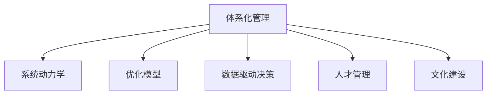

                 

## 1. 背景介绍

### 1.1 问题由来
在当下快速变化、高度复杂且竞争激烈的商业环境中，卓越的领导力已经成为了企业成功的关键因素。然而，传统的人力资源管理体系往往无法满足新时代的组织需求，导致许多企业在人才管理和组织运营上遇到瓶颈。为了应对这些挑战，体系化管理（Systems-Based Management）应运而生，它将领导力提升至战略层面，通过系统性的方法和技术手段，实现企业的持续创新和竞争优势。

### 1.2 问题核心关键点
体系化管理方法的核心在于通过数据驱动、模型化、系统化的手段，提升企业领导力的水平，实现科学决策、精准管理和高效运营。其关键点包括：
1. **数据驱动决策**：利用大数据和人工智能技术，对企业运营数据进行深度分析，辅助领导层做出科学决策。
2. **模型化管理**：采用系统动力学、优化模型等数学工具，构建组织模型，优化运营过程。
3. **体系化结构**：建立涵盖组织战略、流程设计、人力资源、文化建设等全方面的管理体系，提升企业整体效能。
4. **持续优化**：通过不断的迭代和反馈机制，确保管理系统的动态优化和自我修正。

## 2. 核心概念与联系

### 2.1 核心概念概述

为了更好地理解体系化管理，本节将介绍几个关键概念：

- **体系化管理（Systems-Based Management）**：一种基于系统科学原理，将企业管理和运营过程模型化，通过数据驱动和科学方法提升企业领导力的管理范式。

- **系统动力学（System Dynamics）**：一种研究系统动态变化规律的理论框架，通过构建因果反馈模型，预测系统行为，指导管理决策。

- **优化模型（Optimization Model）**：使用数学和统计方法，构建目标函数和约束条件，求解最优解，优化企业资源配置和运营策略。

- **数据驱动决策（Data-Driven Decision Making）**：基于数据分析和机器学习算法，从大量数据中提取有用信息，辅助领导层做出精准决策。

- **人才管理（Talent Management）**：通过科学评估和系统化的培训发展计划，最大化员工潜力，提升组织绩效。

- **文化建设（Culture Building）**：构建共享价值观和行为准则，形成强大的组织文化，提升员工凝聚力和企业执行力。

这些核心概念共同构成了体系化管理的理论基础，通过系统性地集成和应用这些方法，可以有效地提升企业领导力，实现高效、灵活、可持续的运营。

### 2.2 核心概念原理和架构的 Mermaid 流程图



这个流程图展示了大语言模型的核心概念及其之间的关系：

1. 体系化管理作为顶层概念，与系统动力学、优化模型、数据驱动决策、人才管理和文化建设等子概念相互连接，形成一个有机整体。
2. 系统动力学帮助构建组织行为模型，预测系统变化趋势。
3. 优化模型通过数学和统计方法，寻找最优资源配置方案。
4. 数据驱动决策利用数据分析和机器学习，提供科学决策支持。
5. 人才管理注重员工潜能开发，提升组织整体效能。
6. 文化建设塑造组织价值观，增强员工凝聚力和执行力。

这些概念相互支撑，共同构成了体系化管理的框架，为企业管理和运营提供了科学、系统的指导。

## 3. 核心算法原理 & 具体操作步骤

### 3.1 算法原理概述

体系化管理方法主要依赖于以下算法原理：

1. **系统动力学原理**：通过构建系统动力学模型，分析组织内部的因果关系和反馈机制，预测未来趋势，指导决策制定。

2. **优化算法原理**：使用线性规划、非线性规划、整数规划等优化算法，求解资源配置和运营策略的最优解。

3. **数据驱动原理**：通过数据分析和机器学习算法，提取有效信息，辅助领导层做出精准的决策。

4. **人才管理算法**：采用人才评估和培训发展模型，识别员工潜力，制定科学的人才培养计划。

5. **文化建设算法**：通过情感分析和社交网络分析等技术，构建组织文化模型，指导文化建设活动。

### 3.2 算法步骤详解

体系化管理的实施过程主要包括以下几个关键步骤：

**Step 1: 数据收集与预处理**
- 收集组织内部和外部的各类数据，包括财务数据、运营数据、员工数据等。
- 进行数据清洗、标准化和归一化处理，确保数据质量。

**Step 2: 模型构建与验证**
- 根据系统动力学和优化模型原理，构建组织运营模型。
- 对模型进行参数估计和验证，确保模型能够准确反映组织运行规律。

**Step 3: 数据分析与洞察**
- 使用数据分析和机器学习算法，提取组织运营中的关键洞察和趋势。
- 利用可视化工具，将洞察结果直观呈现给领导层，辅助决策。

**Step 4: 模型应用与优化**
- 将构建的模型应用于日常运营管理中，进行资源配置和策略优化。
- 定期对模型进行更新和优化，确保其动态适应组织变化。

**Step 5: 人才评估与发展**
- 采用人才评估模型，识别员工潜力和发展路径。
- 制定科学的培训和发展计划，提升员工能力和组织绩效。

**Step 6: 文化建设与强化**
- 利用情感分析和社交网络分析等技术，构建组织文化模型。
- 通过文化建设活动，强化组织价值观和行为准则，提升员工凝聚力和执行力。

### 3.3 算法优缺点

体系化管理方法具有以下优点：

1. **科学决策**：基于数据和模型的科学决策，有助于提高决策的精准性和有效性。
2. **系统化管理**：通过系统化的方法和工具，优化资源配置，提升组织效率。
3. **动态适应**：能够动态调整和优化管理模型，适应组织变化和外部环境。
4. **全面视角**：涵盖组织战略、流程设计、人力资源、文化建设等多个方面，实现全面的管理体系。

同时，该方法也存在一定的局限性：

1. **模型复杂**：构建和维护复杂的系统动力学和优化模型需要高水平的专家知识和资源投入。
2. **数据依赖**：高度依赖数据质量和管理数据的及时性，数据缺失或不准确可能导致决策偏差。
3. **成本较高**：初期实施和管理体系化管理需要较高的技术和管理成本。
4. **执行难度**：需要组织领导层和各级管理层的高度重视和支持，才能有效实施。

尽管存在这些局限性，但就目前而言，体系化管理方法仍是提升企业领导力和运营效率的有效手段。未来相关研究的重点在于如何进一步降低实施成本，提高数据质量和模型可解释性，同时兼顾技术的灵活性和可持续性。

### 3.4 算法应用领域

体系化管理方法广泛应用于各种类型的企业，特别是在大型跨国公司和复杂组织结构中，效果尤为显著。以下是几个典型应用领域：

1. **制造业**：通过优化生产流程和资源配置，提升生产效率和产品质量。
2. **金融服务**：通过风险管理和投资优化，提升金融产品的竞争力。
3. **零售行业**：通过客户行为分析和库存管理，优化供应链和客户体验。
4. **医疗健康**：通过病人流动分析和资源配置，提升医疗服务的质量和效率。
5. **教育培训**：通过学习分析和绩效评估，提升教学质量和培训效果。

除了上述领域，体系化管理方法在政府机构、非营利组织、科技创新等领域也得到了广泛应用，为企业和社会带来了显著的效益和变革。

## 4. 数学模型和公式 & 详细讲解 & 举例说明

### 4.1 数学模型构建

体系化管理方法的数学模型通常包括以下几个部分：

1. **系统动力学模型**：通过构建因果反馈回路，描述系统行为的变化规律。常用的系统动力学模型包括Stock and Flow模型和Causal Loop Diagram（因果环图）。

2. **优化模型**：使用线性规划、非线性规划等数学模型，求解资源配置和运营策略的最优解。常用的优化模型包括整数规划、混合整数线性规划等。

3. **数据分析模型**：使用统计分析和机器学习算法，提取数据中的关键洞察和趋势。常用的数据分析模型包括回归分析、聚类分析、关联规则挖掘等。

### 4.2 公式推导过程

以线性规划模型为例，其一般形式为：

$$
\min \quad \mathbf{c}^T\mathbf{x}
$$
$$
\text{s.t.} \quad \mathbf{A}\mathbf{x} = \mathbf{b}
$$
$$
\mathbf{x} \geq \mathbf{0}
$$

其中，$\mathbf{c}$ 是目标函数的系数向量，$\mathbf{x}$ 是决策变量向量，$\mathbf{A}$ 是约束条件的系数矩阵，$\mathbf{b}$ 是约束条件的常数向量。

线性规划的目标是最小化目标函数的值，同时满足一组线性约束条件。其求解过程通常采用单纯形法或内点法，通过不断迭代，逐步逼近最优解。

### 4.3 案例分析与讲解

以下是一个简单的线性规划案例：

假设一家工厂有两条生产线，生产两种产品A和B。每种产品需要不同的资源和成本。设$x_i$为产品$i$的生产数量，$c_i$为产品$i$的成本系数，$b_j$为生产第$j$种产品需要的资源量。目标是最小化总成本，同时满足资源约束和生产约束。

构建线性规划模型如下：

$$
\min \quad c_1x_1 + c_2x_2
$$
$$
\text{s.t.} \quad b_{11}x_1 + b_{12}x_2 = d_1 \\
b_{21}x_1 + b_{22}x_2 = d_2 \\
x_1 \geq 0, \quad x_2 \geq 0
$$

其中，$d_1, d_2$ 分别是两种产品的需求量。

求解该模型，可以得到最优的生产计划，从而最大化资源利用率，降低成本。

## 5. 项目实践：代码实例和详细解释说明

### 5.1 开发环境搭建

在进行体系化管理实践前，我们需要准备好开发环境。以下是使用Python进行线性规划的开发环境配置流程：

1. 安装Anaconda：从官网下载并安装Anaconda，用于创建独立的Python环境。

2. 创建并激活虚拟环境：
```bash
conda create -n linear_programming python=3.8 
conda activate linear_programming
```

3. 安装Python相关库：
```bash
conda install numpy scipy scikit-learn matplotlib sympy
```

完成上述步骤后，即可在`linear_programming`环境中开始线性规划模型的实践。

### 5.2 源代码详细实现

下面我们以一个简单的线性规划案例为例，给出使用Sympy库进行线性规划的PyTorch代码实现。

首先，定义问题的参数和约束条件：

```python
from sympy import symbols, Eq, solve, pi, Rational
from sympy.solvers.inequalities import reduce_rational_inequalities

# 定义变量
x1, x2 = symbols('x1 x2')

# 定义目标函数和约束条件
c = [1, 2]  # 目标函数的系数向量
A = [[1, 2], [3, 4]]  # 约束条件的系数矩阵
b = [5, 6]  # 约束条件的常数向量

# 构建线性规划模型
objective = c[0]*x1 + c[1]*x2
constraints = [Eq(A[0][0]*x1 + A[0][1]*x2, b[0]), Eq(A[1][0]*x1 + A[1][1]*x2, b[1])]
```

然后，求解线性规划模型：

```python
# 求解线性规划模型
from sympy.solvers.inequalities import reduce_rational_inequalities
from sympy.solvers.inequalities import linear_programming

result = linear_programming(objective, constraints)
print(result)
```

最后，输出求解结果：

```python
optimal_solution = result[0]
print(f"Optimal Solution: {optimal_solution}")
```

以上就是使用Sympy库进行线性规划的完整代码实现。可以看到，通过Sympy库，我们能够轻松构建和求解线性规划模型，得到最优解。

### 5.3 代码解读与分析

让我们再详细解读一下关键代码的实现细节：

**定义变量和参数**：
- `x1, x2 = symbols('x1 x2')`：定义决策变量。
- `c = [1, 2]`：目标函数的系数向量。
- `A = [[1, 2], [3, 4]]`：约束条件的系数矩阵。
- `b = [5, 6]`：约束条件的常数向量。

**构建线性规划模型**：
- `objective = c[0]*x1 + c[1]*x2`：目标函数。
- `constraints = [Eq(A[0][0]*x1 + A[0][1]*x2, b[0]), Eq(A[1][0]*x1 + A[1][1]*x2, b[1])]`：约束条件。

**求解线性规划模型**：
- `result = linear_programming(objective, constraints)`：使用线性规划算法求解模型。
- `optimal_solution = result[0]`：获取最优解。

可以看到，Sympy库使得构建和求解线性规划模型变得非常简单和直观。开发者可以快速搭建起基本的线性规划模型，并得到最优解。

当然，实际应用中，线性规划模型的规模和复杂度可能会更高，需要引入更高级的算法和工具，如Cplex、Gurobi等，以提高求解效率和精度。

## 6. 实际应用场景

### 6.1 供应链优化

体系化管理在供应链优化中的应用非常广泛。传统供应链管理依赖人工经验和手动调整，效率低下且容易出错。而通过体系化管理，可以构建出系统化的供应链模型，实现科学决策和动态优化。

具体而言，可以将供应链中的各环节（如采购、生产、仓储、配送等）建模，并使用线性规划等优化算法，求解最优的资源配置和运营策略。例如，可以通过优化生产计划、库存管理和物流调度，最大化供应链的整体效益。

### 6.2 金融风险管理

金融行业面临复杂多变的市场环境，风险管理尤为重要。体系化管理可以通过构建金融市场模型，预测市场波动和风险变化，制定科学的投资和风险控制策略。

例如，可以构建多资产投资组合模型，通过优化算法求解最优的投资组合，最大化收益并控制风险。同时，利用系统动力学模型，预测市场趋势和政策变化，提前制定应对策略。

### 6.3 制造业生产调度

制造业的生产调度是一个典型的优化问题。通过体系化管理，可以构建出生产调度的系统动力学模型，优化生产流程和资源配置，提高生产效率和产品质量。

例如，可以使用系统动力学模型，预测生产过程中的瓶颈和延误，调整生产计划和资源分配。同时，利用优化算法，求解最优的生产调度方案，减少资源浪费和生产成本。

### 6.4 未来应用展望

随着体系化管理技术的不断进步，其在更多领域的应用前景将更加广阔。以下列举几个未来可能的应用方向：

1. **智能制造**：通过体系化管理，实现智能制造的全面覆盖，包括设计、生产、物流等各个环节的优化。
2. **智慧城市**：构建智慧城市的系统动力学模型，优化城市资源配置和运营管理，提升城市运行效率。
3. **数字化转型**：通过体系化管理，推动企业数字化转型，提升组织运营效率和创新能力。
4. **人工智能治理**：构建人工智能伦理和安全的系统动力学模型，保障人工智能技术的公平性和安全性。
5. **环境可持续发展**：通过体系化管理，优化资源消耗和环境治理，推动可持续发展目标的实现。

这些应用方向展示了体系化管理技术的巨大潜力和广阔前景，为未来企业的智能化、数字化转型提供了新的路径。

## 7. 工具和资源推荐

### 7.1 学习资源推荐

为了帮助开发者系统掌握体系化管理理论和技术，这里推荐一些优质的学习资源：

1. **《系统动力学基础》**：讲解系统动力学基本原理和方法，适合初学者入门。
2. **《线性规划与优化》**：系统介绍线性规划理论和应用，适合进一步深入学习。
3. **Coursera系统动力学课程**：由MIT开设的系统动力学课程，包含大量实际案例，适合实践应用。
4. **Coursera线性规划课程**：由密歇根大学开设的线性规划课程，深入浅出，适合进阶学习。
5. **《系统工程与系统动力学》**：介绍系统工程和系统动力学的基础理论和应用，适合综合学习。

通过对这些资源的学习实践，相信你一定能够快速掌握体系化管理的技术和应用方法，应用于实际工作中。

### 7.2 开发工具推荐

高效的开发离不开优秀的工具支持。以下是几款用于体系化管理开发的常用工具：

1. **Python**：基于Python的开源深度学习框架，适合快速迭代研究。
2. **Sympy**：用于符号计算和数学建模的Python库，支持线性规划等优化算法。
3. **Gurobi**：商业化的优化算法库，支持复杂的线性规划和整数规划问题。
4. **Cplex**：IBM开发的优化算法库，支持线性规划和混合整数规划。
5. **Matplotlib**：用于数据可视化的Python库，适合将优化结果直观呈现。

合理利用这些工具，可以显著提升体系化管理任务的开发效率，加快创新迭代的步伐。

### 7.3 相关论文推荐

体系化管理技术的发展源于学界的持续研究。以下是几篇奠基性的相关论文，推荐阅读：

1. **《系统动力学模型与仿真》**：讲解系统动力学模型的构建与仿真，适合入门学习。
2. **《线性规划及其应用》**：介绍线性规划的基本理论和应用，适合进一步深入研究。
3. **《优化模型在供应链管理中的应用》**：探讨优化模型在供应链管理中的实际应用，适合实践应用。
4. **《智能制造与体系化管理》**：介绍智能制造和体系化管理的结合，适合深入研究。
5. **《人工智能治理与体系化管理》**：探讨人工智能伦理和安全的体系化管理方法，适合综合学习。

这些论文代表了大语言模型微调技术的发展脉络。通过学习这些前沿成果，可以帮助研究者把握学科前进方向，激发更多的创新灵感。

## 8. 总结：未来发展趋势与挑战

### 8.1 总结

本文对体系化管理方法进行了全面系统的介绍。首先阐述了体系化管理的背景和意义，明确了其对提升企业领导力和运营效率的独特价值。其次，从原理到实践，详细讲解了体系化管理的数学模型和关键步骤，给出了线性规划任务的代码实例。同时，本文还广泛探讨了体系化方法在供应链、金融、制造等多个行业领域的应用前景，展示了体系化管理技术的巨大潜力。此外，本文精选了体系化管理的各类学习资源，力求为读者提供全方位的技术指引。

通过本文的系统梳理，可以看到，体系化管理方法在提升企业领导力和运营效率方面具有重要价值，通过科学决策、系统化管理和数据驱动，实现了企业的高效运营和持续创新。未来，伴随体系化管理技术的持续演进，相信其在更多行业领域的应用将不断拓展，为企业的智能化、数字化转型提供强有力的支持。

### 8.2 未来发展趋势

展望未来，体系化管理技术将呈现以下几个发展趋势：

1. **数据驱动决策**：大数据和人工智能技术的广泛应用，将进一步提升数据驱动决策的精准性和有效性。
2. **系统化管理**：涵盖组织战略、流程设计、人力资源、文化建设等方面的全方面管理体系将更加成熟。
3. **动态优化**：通过动态反馈机制和迭代优化，提升管理系统的灵活性和适应性。
4. **跨学科融合**：与其他学科（如社会学、经济学、心理学等）的深度融合，拓展体系化管理的理论和方法。
5. **智能化升级**：引入人工智能技术，如机器学习和深度学习，进一步提升管理系统的智能化水平。

这些趋势凸显了体系化管理技术的广阔前景。这些方向的探索发展，必将进一步提升企业管理和运营效率，为企业的智能化、数字化转型提供强有力的支持。

### 8.3 面临的挑战

尽管体系化管理技术已经取得了显著成效，但在迈向更加智能化、普适化应用的过程中，仍面临诸多挑战：

1. **数据质量**：高质量数据是体系化管理的基础，但数据收集和处理成本高，且存在数据偏差。
2. **模型复杂性**：构建和维护复杂的系统动力学和优化模型需要高水平的专家知识和资源投入。
3. **实施难度**：需要组织领导层和各级管理层的高度重视和支持，才能有效实施。
4. **技术门槛**：需要掌握复杂的数学和计算方法，技术门槛较高。
5. **适用性局限**：对于某些特定行业或任务，体系化管理方法可能不适用。

尽管存在这些挑战，但就目前而言，体系化管理方法仍是提升企业领导力和运营效率的有效手段。未来相关研究的重点在于如何进一步降低实施成本，提高数据质量和模型可解释性，同时兼顾技术的灵活性和可持续性。

### 8.4 研究展望

面对体系化管理所面临的挑战，未来的研究需要在以下几个方面寻求新的突破：

1. **数据自动化采集和处理**：研究自动化的数据采集和清洗技术，降低数据收集和处理的成本。
2. **模型简化与优化**：开发更加高效、易于维护的模型构建方法，降低技术门槛。
3. **智能化决策支持**：引入人工智能技术，进一步提升决策的精准性和自动化水平。
4. **跨领域应用拓展**：拓展体系化管理方法在更多领域的应用，提升其普适性和实用性。
5. **人性化设计**：注重系统的人性化设计，提升用户体验和管理系统的可操作性。

这些研究方向的探索，必将引领体系化管理技术迈向更高的台阶，为构建智能、高效、可持续的组织管理体系提供坚实的技术保障。

## 9. 附录：常见问题与解答

**Q1：体系化管理与传统管理方法有何不同？**

A: 体系化管理将管理过程模型化，通过数据驱动和科学方法提升管理效率和决策精准性。与传统管理方法相比，体系化管理更加系统化、数据化和动态化。

**Q2：如何选择合适的线性规划模型？**

A: 根据实际问题和约束条件，选择合适的目标函数和约束条件。例如，如果目标是最大化收益，则选择利润最大化目标函数；如果约束条件包括资源限制和产能限制，则选择合适的约束条件。

**Q3：线性规划模型求解的常用算法有哪些？**

A: 线性规划模型的求解算法包括单纯形法、内点法、分支定界法等。常用的求解工具有Gurobi、Cplex、SCIP等。

**Q4：线性规划模型在实际应用中需要注意哪些问题？**

A: 线性规划模型求解过程可能遇到多种问题，如模型不稳定、求解超时等。需要选择合适的优化算法，优化模型结构，调整求解参数。

**Q5：体系化管理在实践应用中需要注意哪些问题？**

A: 体系化管理在实际应用中需要综合考虑数据质量、模型复杂性、技术门槛、实施难度等问题。需要组织领导层和各级管理层的支持和推动，才能有效实施。

---

作者：禅与计算机程序设计艺术 / Zen and the Art of Computer Programming

