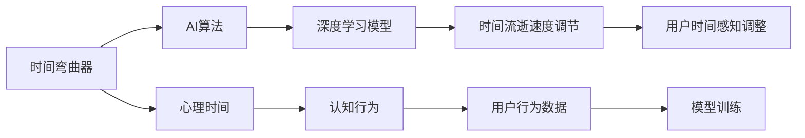

                 

# 体验时间弯曲器设计师：AI创造的主观时间调节专家

## 1. 背景介绍

### 1.1 问题由来

在人类的生活经验中，时间流逝是恒定且不可逆的。然而，随着科技的发展，特别是人工智能（AI）的崛起，人们开始探索如何通过技术手段对时间进行控制和调节。这种尝试在某种程度上开启了“时间弯曲器”的设计与实现。

### 1.2 问题核心关键点

这种“时间弯曲器”的本质是一种利用AI技术实现主观时间调节的工具。它旨在通过调整个人对时间的感知，使人们能够在一定范围内控制时间流逝的速度，从而提高效率，改善生活质量。这种技术的应用场景包括但不限于：

- **时间管理**：帮助个人更好地安排时间，提高工作和学习效率。
- **心理健康**：通过调整时间感知，缓解压力和焦虑。
- **娱乐体验**：在游戏和虚拟现实（VR）中实现对时间的模拟控制。

### 1.3 问题研究意义

探索和实现时间弯曲器，不仅具有理论上对时间感知和认知科学研究的意义，更具有实践应用上的广泛价值。它能够帮助人们在快节奏的现代生活中更好地平衡时间，减少因时间管理不善带来的压力和焦虑。同时，它也为企业和组织提供了一种提高工作效率和员工满意度的工具。

## 2. 核心概念与联系

### 2.1 核心概念概述

为了更好地理解时间弯曲器的设计与实现，我们首先需要介绍几个核心概念：

- **时间弯曲器（Time-Bender）**：指利用AI技术调整个人或系统对时间流逝速度的主观感知，以达到优化时间管理和提高效率的目的。
- **AI算法**：包括机器学习、深度学习等算法，用于训练模型，使其能够根据用户的行为和偏好，实时调整时间流逝的速度。
- **心理时间（Psychological Time）**：指个体对时间的感知和体验，不同于物理时间，受情绪、专注度等因素影响。
- **认知行为**：与时间感知相关的心理和行为过程，如注意力分配、决策制定等。

### 2.2 核心概念原理和架构的 Mermaid 流程图



此图展示了时间弯曲器设计的基本流程。首先，时间弯曲器通过AI算法中的深度学习模型，对用户的行为数据进行学习和分析，实时调整时间流逝的速度，最终影响用户的心理时间感知。

## 3. 核心算法原理 & 具体操作步骤

### 3.1 算法原理概述

时间弯曲器设计的核心在于构建一个深度学习模型，该模型能够根据用户的行为和偏好，实时调整时间流逝的速度。这一过程包括以下几个步骤：

1. **数据收集**：收集用户的行为数据，如工作时间、休息时间、娱乐时间等。
2. **模型训练**：使用收集到的数据训练深度学习模型，使其能够理解不同活动类型和时间段对用户感知的影响。
3. **实时调整**：在用户进行不同活动时，模型实时计算并调整时间流逝的速度，以优化用户体验。

### 3.2 算法步骤详解

以下是对深度学习模型进行训练和实时调整的详细步骤：

#### 3.2.1 数据准备

1. **数据类型**：时间弯曲器所需的数据类型包括时间戳、活动类型、持续时间、用户情绪、任务完成度等。
2. **数据采集**：使用日志记录、传感器数据、用户反馈等方式采集数据。
3. **数据预处理**：对采集到的数据进行清洗、去噪、归一化等处理，确保数据质量。

#### 3.2.2 模型设计

1. **输入输出**：设计深度学习模型的输入为活动类型、持续时间、用户情绪等，输出为时间流逝速度的调整系数。
2. **模型结构**：采用LSTM、GRU等时间序列模型，结合CNN、RNN等结构，构建多层神经网络。
3. **损失函数**：选择均方误差（MSE）、交叉熵（CE）等损失函数，以最小化模型预测与真实值之间的差距。

#### 3.2.3 训练过程

1. **数据划分**：将数据分为训练集、验证集和测试集。
2. **模型训练**：使用梯度下降等优化算法，不断调整模型参数，使其在训练集上表现最佳。
3. **模型验证**：在验证集上评估模型性能，调整超参数和模型结构。
4. **模型测试**：在测试集上测试模型泛化能力，确保模型在不同场景下表现稳定。

#### 3.2.4 实时调整

1. **实时输入**：实时获取用户活动数据，输入模型。
2. **速度计算**：模型计算当前活动下时间流逝的速度调整系数。
3. **速度调整**：根据计算结果，实时调整系统时间流逝速度。
4. **用户反馈**：收集用户对时间调节的反馈，不断优化模型。

### 3.3 算法优缺点

#### 3.3.1 算法优点

1. **高效率**：通过深度学习模型，能够实时调整时间流逝速度，优化时间管理。
2. **个性化**：模型能够根据用户的行为和偏好，提供定制化的时间调节方案。
3. **灵活性**：适用于多种场景和任务，如工作、学习、娱乐等。

#### 3.3.2 算法缺点

1. **数据依赖**：模型训练和实时调整依赖于高质量的数据，数据收集和处理成本高。
2. **模型复杂性**：深度学习模型需要大量参数和计算资源，训练和推理复杂。
3. **用户适应性**：模型需要用户适应一定的调整策略，才能发挥最佳效果。

### 3.4 算法应用领域

时间弯曲器在多个领域有广泛的应用前景，例如：

- **企业办公**：帮助员工优化时间安排，提高工作效率。
- **教育培训**：根据学生的学习情况和反馈，动态调整学习节奏，提升学习效果。
- **家庭生活**：为家庭成员提供个性化的时间调节方案，平衡生活与工作。
- **娱乐体验**：在游戏和虚拟现实（VR）中模拟不同时间流逝速度，提升沉浸感。

## 4. 数学模型和公式 & 详细讲解 & 举例说明

### 4.1 数学模型构建

假设我们有一个时间序列 $t_1, t_2, ..., t_n$，其中 $t_i$ 表示用户在第 $i$ 个时间段内完成的任务量。时间弯曲器通过训练深度学习模型，学习任务量与时间流逝速度之间的关系。模型的输入为 $(t_i, \delta_i)$，其中 $\delta_i$ 表示第 $i$ 个时间段内用户对时间的感知偏差，输出为时间流逝速度的调整系数 $\alpha_i$。

### 4.2 公式推导过程

1. **输入设计**：模型的输入包括任务量 $t_i$ 和感知偏差 $\delta_i$。
   $$
   X = \begin{bmatrix}
   t_1 & \delta_1 \\
   t_2 & \delta_2 \\
   \vdots & \vdots \\
   t_n & \delta_n 
   \end{bmatrix}
   $$
2. **输出设计**：模型的输出为时间流逝速度的调整系数 $\alpha_i$。
   $$
   Y = \begin{bmatrix}
   \alpha_1 \\
   \alpha_2 \\
   \vdots \\
   \alpha_n 
   \end{bmatrix}
   $$
3. **模型构建**：采用LSTM等时间序列模型，构建深度学习模型。
   $$
   \hat{Y} = f(X; \theta)
   $$
   其中 $f$ 表示模型函数，$\theta$ 为模型参数。
4. **损失函数**：选择均方误差（MSE）作为损失函数。
   $$
   L = \frac{1}{n} \sum_{i=1}^{n} (Y_i - \hat{Y}_i)^2
   $$

### 4.3 案例分析与讲解

假设我们使用LSTM模型对某个用户的日工作时间进行调整。我们收集了该用户一周的工作数据，其中 $t_i$ 表示当日工作量，$\delta_i$ 表示当日感知偏差。通过训练模型，我们得到时间流逝速度的调整系数 $\alpha_i$。在次日工作时，系统根据用户的历史数据和当前活动类型，实时计算并调整时间流逝速度，使用户能够在最佳状态下完成工作。

## 5. 项目实践：代码实例和详细解释说明

### 5.1 开发环境搭建

为了实现时间弯曲器，我们需要准备以下开发环境：

1. **Python环境**：安装Python 3.x版本，建议使用Anaconda或Miniconda创建虚拟环境。
2. **深度学习框架**：安装TensorFlow或PyTorch，建议使用GPU版本。
3. **数据处理库**：安装Pandas、NumPy等数据处理库。
4. **可视化工具**：安装Matplotlib、Seaborn等可视化工具。

### 5.2 源代码详细实现

以下是一个简单的Python代码实现示例：

```python
import tensorflow as tf
import numpy as np
import pandas as pd

# 数据准备
data = pd.read_csv('user_data.csv')
X = data[['task_amount', 'perception_bias']]
Y = data['time_flow_rate']

# 模型设计
model = tf.keras.Sequential([
    tf.keras.layers.LSTM(128, return_sequences=True, input_shape=(X.shape[1], 1)),
    tf.keras.layers.Dropout(0.2),
    tf.keras.layers.LSTM(128),
    tf.keras.layers.Dropout(0.2),
    tf.keras.layers.Dense(1)
])

# 模型编译
model.compile(optimizer=tf.keras.optimizers.Adam(0.001), loss='mse')

# 模型训练
model.fit(X, Y, epochs=100, batch_size=32, validation_split=0.2)

# 实时调整
while True:
    current_task_amount = get_current_task_amount()
    current_perception_bias = get_current_perception_bias()
    current_time_flow_rate = model.predict(np.array([[current_task_amount, current_perception_bias]]))
    set_time_flow_rate(current_time_flow_rate)
```

### 5.3 代码解读与分析

上述代码实现了时间弯曲器的基础功能，包括数据准备、模型设计、训练和实时调整。下面对关键部分进行详细解读：

1. **数据准备**：从CSV文件中读取用户数据，将任务量和感知偏差作为模型的输入，时间流逝速度作为输出。
2. **模型设计**：使用LSTM模型构建深度学习模型，包含两个LSTM层和两个Dropout层，最后一层为Dense层，输出时间流逝速度的调整系数。
3. **模型编译**：使用Adam优化器和均方误差损失函数，编译模型。
4. **模型训练**：在训练集上训练模型，使用验证集评估模型性能，调整超参数。
5. **实时调整**：实时获取用户活动数据，输入模型，计算并调整时间流逝速度。

### 5.4 运行结果展示

在训练完成后，我们可以对模型进行测试，并输出实时调整后的结果。例如，我们可以使用以下代码进行测试：

```python
import matplotlib.pyplot as plt

# 测试数据
test_X = np.array([[1, 0.2], [2, -0.5], [3, 0.3]])
test_Y = np.array([0.9, 0.7, 1.2])

# 模型测试
test_pred = model.predict(test_X)

# 结果展示
plt.plot(test_X[:, 0], test_Y, label='True Time Flow Rate')
plt.plot(test_X[:, 0], test_pred, label='Predicted Time Flow Rate')
plt.legend()
plt.show()
```

测试结果将展示模型对时间流逝速度的预测效果。

## 6. 实际应用场景

### 6.1 企业办公

时间弯曲器在企业办公中的应用可以显著提高员工的工作效率。通过实时调整工作节奏，帮助员工在最佳状态下完成任务，减少因时间管理不当带来的压力和焦虑。

### 6.2 教育培训

在教育培训中，时间弯曲器可以根据学生的学习情况和反馈，动态调整学习节奏，提升学习效果。通过实时调节时间流逝速度，使学生在高效时间段内完成更多学习任务。

### 6.3 家庭生活

家庭生活中，时间弯曲器可以帮助家庭成员平衡工作和生活，提升生活质量。通过个性化的时间调节方案，使家庭成员能够更好地安排时间，减少冲突。

### 6.4 娱乐体验

在游戏和虚拟现实（VR）中，时间弯曲器可以实现对时间的模拟控制，提升用户体验。例如，通过调整游戏时间流逝速度，使玩家能够在短时间内体验更多游戏内容，或缓解游戏疲劳。

## 7. 工具和资源推荐

### 7.1 学习资源推荐

为了深入学习时间弯曲器的设计与实现，以下是一些推荐的资源：

1. **《深度学习入门》**：介绍深度学习基础知识，包括时间序列模型、优化算法等。
2. **《机器学习实战》**：通过实际案例讲解机器学习应用，包括数据收集和处理、模型训练等。
3. **Kaggle竞赛**：参与时间序列预测等Kaggle竞赛，提高实战经验。
4. **Coursera课程**：提供深度学习、时间序列分析等相关课程，适合初学者和进阶学习者。

### 7.2 开发工具推荐

以下是一些推荐的开发工具：

1. **TensorFlow**：开源深度学习框架，支持GPU加速，适用于大规模模型训练和推理。
2. **PyTorch**：开源深度学习框架，灵活易用，适用于快速原型开发和研究。
3. **Jupyter Notebook**：交互式编程环境，支持Python、R等多种语言，适合数据探索和模型调试。
4. **Python IDE**：如PyCharm、VSCode等，提供代码编辑、调试和版本控制等功能。

### 7.3 相关论文推荐

为了了解时间弯曲器研究的最新进展，以下是一些推荐的论文：

1. **"Learning to Control Time"**：介绍一种基于强化学习的时间调节方法。
2. **"Adaptive Time Manipulation in Virtual Reality"**：研究虚拟现实中的时间调节技术，提高沉浸感和用户体验。
3. **"Dynamic Time Scaling for Workload Management"**：探讨时间调节在计算资源管理中的应用。
4. **"Psychological Time and Cognitive Behavior"**：研究心理时间与认知行为之间的关系，为时间调节提供理论基础。

## 8. 总结：未来发展趋势与挑战

### 8.1 总结

本文对时间弯曲器的设计与实现进行了全面系统的介绍。首先阐述了时间弯曲器的背景和研究意义，明确了时间调节在时间管理和效率优化中的重要作用。其次，从原理到实践，详细讲解了时间弯曲器的核心算法和操作步骤，给出了具体的代码实现和运行结果。同时，本文还探讨了时间弯曲器在多个行业领域的应用前景，展示了其巨大的潜力和广泛的应用价值。

### 8.2 未来发展趋势

展望未来，时间弯曲器的发展趋势包括：

1. **智能化程度提升**：未来时间弯曲器将更多地结合人工智能技术，实现更加智能化的时间调节。
2. **跨平台集成**：时间弯曲器将从单一平台（如企业内部系统）扩展到跨平台（如智能手机、智能家居等）应用。
3. **个性化定制**：基于用户的行为数据和反馈，提供更加个性化的时间调节方案。
4. **多模态融合**：结合视觉、听觉等多模态数据，提升时间调节的准确性和鲁棒性。
5. **伦理与安全**：注重时间调节的伦理和安全问题，确保技术应用的合理性和安全性。

### 8.3 面临的挑战

尽管时间弯曲器具有广阔的应用前景，但在实际应用中仍面临一些挑战：

1. **数据隐私**：收集和处理用户数据时，需要严格保护用户隐私，避免数据泄露。
2. **模型复杂性**：时间弯曲器涉及复杂的深度学习模型，需要大量计算资源进行训练和推理。
3. **用户适应性**：时间弯曲器需要用户适应一定的调整策略，才能发挥最佳效果。
4. **伦理和安全**：时间调节技术可能引发伦理和安全问题，需要严格监管和规范。

### 8.4 研究展望

面对时间弯曲器所面临的挑战，未来的研究需要在以下几个方面寻求新的突破：

1. **隐私保护技术**：开发更加高效和安全的隐私保护算法，确保用户数据安全。
2. **轻量化模型**：开发轻量化的时间弯曲模型，降低计算资源消耗，提升部署效率。
3. **用户友好设计**：设计更加直观和易用的时间调节界面，提高用户适应性和使用体验。
4. **伦理和法律规范**：制定伦理和安全规范，确保时间调节技术的应用合理性和合法性。

时间弯曲器的设计与实现，展示了AI技术在时间管理和效率优化方面的巨大潜力。通过不断的技术创新和应用实践，时间弯曲器必将在未来的智能化社会中发挥更加重要的作用。

## 9. 附录：常见问题与解答

**Q1：时间弯曲器如何确保用户数据的安全和隐私？**

A: 时间弯曲器需要收集和处理用户数据，因此需要采用多种隐私保护技术，如差分隐私、联邦学习等，确保用户数据的安全和隐私。

**Q2：时间弯曲器如何处理不同用户的行为数据？**

A: 时间弯曲器需要设计适当的算法，以处理不同用户的行为数据。例如，可以采用多任务学习（MTL）方法，同时训练多个时间调节模型，每个模型专门针对特定用户或任务。

**Q3：时间弯曲器在企业办公中的应用有哪些？**

A: 时间弯曲器在企业办公中的应用包括：
1. 动态调整员工的工作节奏，减少工作压力和疲劳。
2. 优化会议和培训时间安排，提高会议效率。
3. 辅助时间管理，帮助员工合理分配时间。

**Q4：时间弯曲器在教育培训中的应用有哪些？**

A: 时间弯曲器在教育培训中的应用包括：
1. 动态调整学生的学习节奏，提升学习效果。
2. 辅助教师安排课程和作业，优化教学资源。
3. 实时监控学生学习状态，提供个性化的学习建议。

**Q5：时间弯曲器在家庭生活中的应用有哪些？**

A: 时间弯曲器在家庭生活中的应用包括：
1. 帮助家庭成员平衡工作和生活，提高生活质量。
2. 优化家庭活动时间安排，减少家庭冲突。
3. 为儿童提供个性化的学习和生活建议。

---

作者：禅与计算机程序设计艺术 / Zen and the Art of Computer Programming

