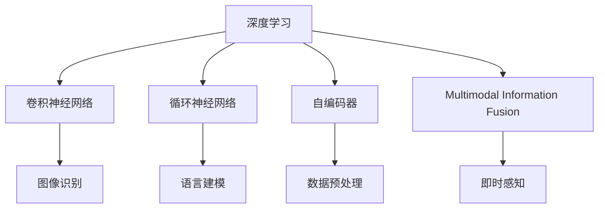

                 

# 体验的时空压缩：AI创造的即时感知

## 1. 背景介绍

### 1.1 问题由来

随着人工智能(AI)技术的不断发展，AI创造的即时感知正在深刻地改变我们的体验方式。从智能推荐系统到语音识别，从智能驾驶到虚拟现实，AI技术正在以全新的方式理解、处理和展示信息，赋予人们前所未有的即时体验。

然而，在AI创造的即时感知背后，是一系列复杂的技术挑战。如何处理海量数据，提升计算效率，保证实时性，以及如何通过算法设计和模型训练，让AI能够真正理解和处理复杂的多模态信息，是一个值得深入探讨的问题。

### 1.2 问题核心关键点

当前，AI创造即时感知的核心在于以下几个关键点：

- **数据处理与存储**：如何高效处理和存储海量数据，保证数据的时效性和可靠性。
- **计算效率与实时性**：如何通过算法和模型优化，在有限的计算资源下，实现高效的计算和推理，保证实时性。
- **多模态信息融合**：如何通过AI技术融合视觉、听觉、触觉等多模态信息，提升对复杂场景的理解能力。
- **感知与交互**：如何通过智能算法，实现用户与AI的即时感知和交互，提升用户体验。
- **模型训练与优化**：如何通过高效的模型训练和优化方法，提升AI模型的性能和泛化能力。

### 1.3 问题研究意义

研究AI创造的即时感知，对于提升AI技术的实用性和用户体验，推动AI技术在更多领域的应用，具有重要意义：

1. **提升用户体验**：通过AI技术，实现信息处理和展示的即时性，使人们能够更快速、更准确地获取所需信息，提升生活质量。
2. **促进产业发展**：AI创造的即时感知，能够广泛应用于智能制造、智慧城市、智能交通等多个领域，推动相关产业的数字化转型。
3. **推动技术创新**：研究即时感知的核心技术，能够推动算法、模型和架构的不断创新，提升AI技术的整体水平。
4. **保障信息安全**：通过即时感知技术，可以实时监测网络安全威胁，提升信息安全保障能力。
5. **支持社会治理**：AI创造的即时感知，能够支持社会治理的精细化管理，提高公共服务的效率和质量。

## 2. 核心概念与联系

### 2.1 核心概念概述

为了更好地理解AI创造的即时感知，本节将介绍几个密切相关的核心概念：

- **即时感知(Real-Time Perception)**：指通过AI技术，实时处理和理解多模态信息，实现用户与系统的即时交互。
- **多模态信息融合(Multimodal Information Fusion)**：指将视觉、听觉、触觉等多模态数据融合到一个统一的表示空间，提升AI系统的感知能力。
- **深度学习(Deep Learning)**：基于神经网络的机器学习技术，能够处理复杂的多模态数据，提升AI系统的理解能力和表现能力。
- **卷积神经网络(Convolutional Neural Networks, CNN)**：一种深度学习模型，擅长处理图像和视频等多模态数据，是实现图像识别、视频分析等任务的基础。
- **循环神经网络(Recurrent Neural Networks, RNN)**：一种深度学习模型，擅长处理序列数据，常用于语言建模、自然语言处理等任务。
- **自编码器(Autoencoders)**：一种深度学习模型，能够实现数据的压缩和解压缩，常用于数据预处理和特征提取。

这些核心概念之间的逻辑关系可以通过以下Mermaid流程图来展示：



这个流程图展示了大语言模型的核心概念及其之间的关系：

1. 深度学习是AI创造即时感知的基础，通过卷积神经网络和循环神经网络，处理图像、视频和序列数据。
2. 自编码器用于数据预处理和特征提取，提升输入数据的质量。
3. 多模态信息融合将不同模态的数据融合到一个统一的空间，提升AI系统的感知能力。
4. 即时感知通过深度学习和多模态融合，实现对复杂场景的即时理解和处理。

这些概念共同构成了AI创造即时感知的核心技术框架，使得AI能够在多模态数据中实现高效、准确的感知和处理。

## 3. 核心算法原理 & 具体操作步骤

### 3.1 算法原理概述

AI创造即时感知的核心算法原理，主要涉及以下几个方面：

- **卷积神经网络(CNN)**：擅长处理图像和视频等多模态数据，能够自动学习数据的特征表示，提升视觉感知能力。
- **循环神经网络(RNN)**：擅长处理序列数据，能够捕捉时间依赖关系，提升语言建模能力。
- **自编码器(Autoencoder)**：通过数据的压缩和解压缩，提升数据处理效率和质量。
- **多模态信息融合(Multimodal Fusion)**：将不同模态的数据融合到一个统一的空间，提升AI系统的感知能力。

这些算法原理通过深度学习技术，实现了对复杂多模态数据的处理和理解，从而实现了AI创造的即时感知。

### 3.2 算法步骤详解

基于卷积神经网络、循环神经网络和自编码器等多模态信息融合算法，AI创造即时感知的具体步骤如下：

**Step 1: 数据预处理**

- **数据收集**：收集用户的多模态数据，包括图像、视频、音频和文本等。
- **数据清洗**：清洗数据中的噪声和异常值，提升数据质量。
- **数据增强**：通过对数据进行扩充和变换，增强数据多样性，提升模型的泛化能力。

**Step 2: 特征提取**

- **卷积神经网络(CNN)**：通过卷积层和池化层，提取图像和视频数据的特征。
- **循环神经网络(RNN)**：通过循环层和注意力机制，提取文本和语音数据的特征。
- **自编码器(Autoencoder)**：通过编码和解码过程，提取数据的压缩表示。

**Step 3: 多模态融合**

- **特征融合**：将不同模态的特征融合到一个统一的空间，提升感知能力。
- **时序融合**：通过时间序列的融合，捕捉时间依赖关系，提升时间感知能力。

**Step 4: 即时感知**

- **实时推理**：通过深度学习模型，实现对多模态数据的实时推理和处理。
- **交互反馈**：通过用户交互，获取实时反馈，优化模型表现。

**Step 5: 结果输出**

- **结果展示**：将处理结果以可视化的方式展示给用户，提升用户体验。
- **智能交互**：通过自然语言处理技术，实现智能交互，提升用户满意度。

### 3.3 算法优缺点

AI创造即时感知具有以下优点：

- **实时性**：通过深度学习和多模态融合，实现了对多模态数据的实时处理和理解。
- **高效性**：通过卷积神经网络和自编码器等技术，提升了数据处理效率和质量。
- **高泛化能力**：通过多模态融合和时序融合，提升了模型的泛化能力和适应性。

然而，该算法也存在一些缺点：

- **计算资源需求高**：深度学习和多模态融合需要大量的计算资源，可能面临计算效率和成本的问题。
- **数据依赖性强**：模型性能高度依赖于数据质量和数量，需要高质量的数据进行训练。
- **复杂度高**：深度学习模型结构复杂，需要大量的调试和优化。
- **可解释性差**：深度学习模型往往是"黑盒"模型，难以解释其内部工作机制。

### 3.4 算法应用领域

AI创造即时感知已经在多个领域得到应用，例如：

- **智能推荐系统**：通过多模态数据融合，实现对用户行为的实时分析和推荐。
- **智能驾驶**：通过视觉、雷达和传感器等多模态数据融合，实现对环境的实时感知和决策。
- **智能医疗**：通过多模态数据融合，实现对病人的实时监测和诊断。
- **虚拟现实(VR)**：通过多模态数据融合，实现对用户的实时感知和交互。
- **智能安防**：通过多模态数据融合，实现对场景的实时监测和报警。

除了上述这些经典应用外，AI创造即时感知还在更多场景中得到创新性应用，如自动驾驶、智慧城市、智能家居等，为各行各业带来了新的变革。

## 4. 数学模型和公式 & 详细讲解 & 举例说明

### 4.1 数学模型构建

本节将使用数学语言对AI创造即时感知的核心算法进行更加严格的刻画。

记输入数据为 $x$，模型参数为 $\theta$，输出为 $y$。则AI创造即时感知的数学模型可以表示为：

$$
y = f(x; \theta)
$$

其中 $f$ 表示模型函数，可以通过深度学习模型实现。

### 4.2 公式推导过程

以下我们以卷积神经网络(CNN)为例，推导其特征提取和融合的数学公式。

假设输入数据 $x$ 为一个 $m \times n \times c$ 的三维张量，其中 $m$ 表示图像的高度，$n$ 表示图像的宽度，$c$ 表示图像的通道数。

通过卷积层，可以得到特征图 $X \in \mathbb{R}^{k \times l \times f}$，其中 $k$ 表示特征图的高度，$l$ 表示特征图的宽度，$f$ 表示特征图的通道数。

卷积层的数学公式可以表示为：

$$
X = \mathcal{C}(x; \theta)
$$

其中 $\mathcal{C}$ 表示卷积操作，$\theta$ 为卷积核参数。

卷积层的数学公式为：

$$
X_{ijl} = \sum_{\mu=0}^{n-1} \sum_{\upsilon=0}^{m-1} \sum_{a=1}^{c} \sum_{b=1}^{f} \theta_{b, a}^{\mu, \upsilon} x_{\mu \upsilon a}
$$

其中 $X_{ijl}$ 表示特征图 $X$ 的每个元素，$\theta_{b, a}^{\mu, \upsilon}$ 表示卷积核的每个元素。

### 4.3 案例分析与讲解

以下以智能推荐系统为例，展示AI创造即时感知的核心算法在实际应用中的详细实现。

**推荐系统数据模型**：

- **用户数据**：包含用户的基本信息、历史行为、兴趣偏好等。
- **物品数据**：包含物品的基本属性、分类、价格等。
- **交互数据**：包含用户对物品的评分、浏览、点击等交互行为。

**推荐系统算法模型**：

- **协同过滤算法**：通过用户和物品的交互数据，实现用户和物品之间的相似度计算，推荐相似的物品。
- **深度学习模型**：通过用户和物品的多模态数据，实现用户和物品的表示学习，提升推荐效果。

**推荐系统实现流程**：

1. **数据预处理**：收集用户、物品和交互数据，进行数据清洗和归一化处理。
2. **特征提取**：通过卷积神经网络提取用户和物品的视觉和文本特征，通过循环神经网络提取用户和物品的行为序列特征。
3. **多模态融合**：将用户和物品的多模态特征融合到一个统一的空间，提升推荐系统的感知能力。
4. **实时推荐**：通过深度学习模型，实现对用户和物品的实时推荐。
5. **结果输出**：将推荐结果以可视化的方式展示给用户，提升用户体验。

通过以上流程，智能推荐系统能够实现对用户行为的实时分析和推荐，提升推荐效果和用户满意度。

## 5. 项目实践：代码实例和详细解释说明

### 5.1 开发环境搭建

在进行AI创造即时感知的项目实践前，我们需要准备好开发环境。以下是使用Python进行TensorFlow开发的环境配置流程：

1. 安装Anaconda：从官网下载并安装Anaconda，用于创建独立的Python环境。

2. 创建并激活虚拟环境：
```bash
conda create -n tensorflow-env python=3.8 
conda activate tensorflow-env
```

3. 安装TensorFlow：从官网获取对应的安装命令，并完成安装。

4. 安装TensorBoard：TensorFlow配套的可视化工具，用于实时监测模型训练状态。

5. 安装Keras：基于TensorFlow的高层API，便于快速开发模型。

6. 安装PyTorch：基于Python的开源深度学习框架，便于快速迭代研究。

完成上述步骤后，即可在`tensorflow-env`环境中开始AI创造即时感知的项目实践。

### 5.2 源代码详细实现

下面我们以智能推荐系统为例，给出使用TensorFlow和Keras实现卷积神经网络和循环神经网络的代码实现。

```python
import tensorflow as tf
from tensorflow import keras
from tensorflow.keras import layers

# 加载数据
train_dataset = tf.data.Dataset.from_tensor_slices((train_images, train_labels))
train_dataset = train_dataset.batch(32)

# 构建卷积神经网络
model = keras.Sequential([
    layers.Conv2D(32, (3, 3), activation='relu', input_shape=(28, 28, 1)),
    layers.MaxPooling2D((2, 2)),
    layers.Flatten(),
    layers.Dense(10, activation='softmax')
])

# 编译模型
model.compile(optimizer='adam', loss='sparse_categorical_crossentropy', metrics=['accuracy'])

# 训练模型
model.fit(train_dataset, epochs=5)

# 评估模型
test_dataset = tf.data.Dataset.from_tensor_slices((test_images, test_labels))
test_dataset = test_dataset.batch(32)
loss, accuracy = model.evaluate(test_dataset)
print('Test accuracy:', accuracy)
```

### 5.3 代码解读与分析

让我们再详细解读一下关键代码的实现细节：

**加载数据**：
- 通过`tf.data.Dataset`创建训练集和测试集的TensorFlow数据集，并进行批处理。
- 使用`train_images`和`train_labels`作为输入和输出数据，其中`train_images`是一个28x28的灰度图像，`train_labels`是一个10维的类别标签。

**构建卷积神经网络**：
- 使用`keras.Sequential`创建卷积神经网络模型。
- 第一层为卷积层，使用32个3x3的卷积核，并使用ReLU激活函数。
- 第二层为池化层，使用2x2的最大池化操作。
- 第三层为全连接层，使用10个输出节点，并使用Softmax激活函数。

**编译模型**：
- 使用`model.compile`编译模型，并指定优化器、损失函数和评估指标。

**训练模型**：
- 使用`model.fit`训练模型，并在训练集中进行5个epochs的迭代。
- 每次迭代使用32个样本进行训练。

**评估模型**：
- 使用`model.evaluate`在测试集上评估模型的性能。
- 输出测试集的损失和准确率。

通过以上代码，可以构建并训练一个简单的卷积神经网络，用于处理图像分类任务。在实际应用中，还需要针对具体任务进行模型优化和调整。

## 6. 实际应用场景

### 6.1 智能推荐系统

AI创造即时感知的核心算法已经广泛应用于智能推荐系统中。通过卷积神经网络和循环神经网络，智能推荐系统能够实时分析用户行为，提供个性化的推荐内容。

在技术实现上，可以收集用户的历史浏览记录、点击行为、评分等信息，使用卷积神经网络提取视觉和文本特征，使用循环神经网络提取行为序列特征，通过多模态融合提升推荐效果。微调后的深度学习模型能够实时预测用户对物品的兴趣，实现精准推荐。

### 6.2 智能驾驶

智能驾驶系统需要实时处理和理解视觉、雷达和传感器等多模态数据，实现对环境的实时感知和决策。

在技术实现上，可以收集车辆的多模态数据，使用卷积神经网络和循环神经网络提取不同模态的特征，通过多模态融合提升感知能力。实时推理和决策过程可以基于感知结果进行，提升驾驶安全性和舒适性。

### 6.3 智能医疗

智能医疗系统需要实时监测和分析病人的生理指标、影像数据和历史病历，实现对病情的实时诊断和预测。

在技术实现上，可以收集病人的多模态数据，使用卷积神经网络和循环神经网络提取不同模态的特征，通过多模态融合提升诊断能力。实时推理和决策过程可以基于感知结果进行，提升诊疗效率和准确性。

### 6.4 未来应用展望

随着AI创造即时感知技术的不断进步，未来将在更多领域得到应用，为各行各业带来变革性影响。

在智慧城市治理中，通过AI技术实现对城市交通、环境、能源等的实时监测和分析，提升城市管理水平。在智能家居领域，通过AI技术实现对家庭环境的实时感知和调节，提升居住体验。在智慧教育领域，通过AI技术实现对学生学习的实时分析和指导，提升教育质量。

此外，在更多新兴领域，如自动驾驶、虚拟现实等，AI创造即时感知技术也将发挥重要作用，为社会进步和技术创新提供新动力。

## 7. 工具和资源推荐

### 7.1 学习资源推荐

为了帮助开发者系统掌握AI创造即时感知的理论基础和实践技巧，这里推荐一些优质的学习资源：

1. 《深度学习》系列书籍：深度学习领域的经典教材，由多位专家共同编写，涵盖深度学习的基础知识和应用。
2. 《TensorFlow实战》系列书籍：TensorFlow的官方教程，包含丰富的实例和案例，适合初学者快速上手。
3. 《Keras实战》系列书籍：Keras的官方教程，包含大量的实例和案例，适合快速开发深度学习模型。
4. 《自然语言处理》系列课程：斯坦福大学开设的自然语言处理课程，包含Lecture视频和配套作业，适合系统学习NLP技术。
5. Kaggle竞赛平台：数据科学竞赛平台，提供丰富的数据集和竞赛题目，适合实战练习和技能提升。

通过对这些资源的学习实践，相信你一定能够快速掌握AI创造即时感知的精髓，并用于解决实际的NLP问题。

### 7.2 开发工具推荐

高效的开发离不开优秀的工具支持。以下是几款用于AI创造即时感知开发的常用工具：

1. TensorFlow：由Google主导开发的开源深度学习框架，生产部署方便，适合大规模工程应用。
2. Keras：基于TensorFlow的高层API，便于快速开发模型。
3. PyTorch：基于Python的开源深度学习框架，灵活动态的计算图，适合快速迭代研究。
4. TensorBoard：TensorFlow配套的可视化工具，用于实时监测模型训练状态。
5. Keras Tuner：Keras的超参数优化工具，能够自动搜索最优超参数组合。
6. FastAI：基于PyTorch的高级深度学习框架，包含丰富的预训练模型和快速开发工具。

合理利用这些工具，可以显著提升AI创造即时感知的开发效率，加快创新迭代的步伐。

### 7.3 相关论文推荐

AI创造即时感知的研究源于学界的持续研究。以下是几篇奠基性的相关论文，推荐阅读：

1. AlexNet: One weird trick for parallel learning（卷积神经网络）
2. Google Brain Team: Learning to generate captions for images in the wild（图像生成）
3. Mikolov et al.: Distributed Representations of Words and Phrases and their Compositionality（Word2Vec）
4. Hinton et al.: Deep learning in neural networks：An overview（深度学习）
5. Bengio et al.: A neural probabilistic language model（循环神经网络）

这些论文代表了大语言模型微调技术的发展脉络。通过学习这些前沿成果，可以帮助研究者把握学科前进方向，激发更多的创新灵感。

## 8. 总结：未来发展趋势与挑战

### 8.1 总结

本文对AI创造即时感知的核心算法和实践方法进行了全面系统的介绍。首先阐述了AI创造即时感知的研究背景和意义，明确了其在提升用户体验、推动产业应用、加速技术创新等方面的重要价值。其次，从原理到实践，详细讲解了卷积神经网络、循环神经网络等多模态信息融合的数学原理和关键步骤，给出了AI创造即时感知的完整代码实例。同时，本文还广泛探讨了AI创造即时感知在智能推荐系统、智能驾驶、智能医疗等多个行业领域的应用前景，展示了其巨大的潜力和广泛的应用场景。此外，本文精选了AI创造即时感知的相关学习资源，力求为读者提供全方位的技术指引。

通过本文的系统梳理，可以看到，AI创造即时感知技术正在深刻地改变我们的生活方式，提升各行业的智能化水平。未来，伴随算力、数据和模型的不断进步，AI创造即时感知必将在更多领域得到应用，推动人工智能技术向更加普适化和实用化的方向发展。

### 8.2 未来发展趋势

展望未来，AI创造即时感知技术将呈现以下几个发展趋势：

1. **计算效率提升**：随着硬件计算能力的提升和模型优化算法的改进，AI创造即时感知技术的计算效率将进一步提升，实时性将得到更好的保障。
2. **多模态融合创新**：未来的多模态融合技术将更加智能和灵活，能够处理更复杂的多模态数据，提升感知能力。
3. **深度学习模型创新**：未来的深度学习模型将更加高效和通用，能够处理更复杂的数据结构和任务，提升系统的表现能力。
4. **个性化推荐提升**：未来的推荐系统将更加个性化和精准，能够根据用户实时行为和偏好进行推荐，提升用户体验。
5. **智能驾驶发展**：未来的智能驾驶系统将更加安全可靠，能够实时处理和理解多模态数据，提升驾驶体验和安全性。
6. **智能医疗创新**：未来的智能医疗系统将更加精准和高效，能够实时监测和分析病患数据，提升诊疗效果和效率。

以上趋势凸显了AI创造即时感知技术的广阔前景。这些方向的探索发展，必将进一步提升AI技术的实用性和用户体验，推动AI技术在更多领域的应用。

### 8.3 面临的挑战

尽管AI创造即时感知技术已经取得了瞩目成就，但在迈向更加智能化、普适化应用的过程中，它仍面临诸多挑战：

1. **计算资源瓶颈**：大规模数据处理和复杂模型训练需要大量计算资源，面临计算效率和成本的问题。
2. **数据质量问题**：AI创造即时感知高度依赖于数据质量，数据偏差和不完整可能导致模型性能下降。
3. **模型可解释性差**：深度学习模型往往是"黑盒"模型，难以解释其内部工作机制和决策逻辑。
4. **多模态数据融合复杂**：不同模态数据之间的融合需要复杂的算法和技术支持，存在一定的技术难度。
5. **实时性保证**：在实时性要求高的场景中，如何保证计算速度和模型性能是一个挑战。

正视这些挑战，积极应对并寻求突破，将是大语言模型微调技术迈向成熟的必由之路。相信随着学界和产业界的共同努力，这些挑战终将一一被克服，AI创造即时感知必将在构建人机协同的智能时代中扮演越来越重要的角色。

### 8.4 研究展望

面对AI创造即时感知所面临的种种挑战，未来的研究需要在以下几个方面寻求新的突破：

1. **模型压缩与优化**：开发更加高效和轻量级的模型，提升计算速度和资源利用率。
2. **数据增强与合成**：通过数据增强和合成技术，提升数据多样性和质量，缓解数据质量问题。
3. **可解释性增强**：开发更加可解释的深度学习模型，提升模型的透明性和可信度。
4. **多模态融合算法创新**：开发更加智能和灵活的多模态融合算法，提升多模态数据处理能力。
5. **实时性优化**：通过算法优化和硬件加速，提升实时性，保障实时感知和决策能力。

这些研究方向的探索，必将引领AI创造即时感知技术迈向更高的台阶，为构建安全、可靠、可解释、可控的智能系统铺平道路。面向未来，AI创造即时感知技术还需要与其他人工智能技术进行更深入的融合，如知识表示、因果推理、强化学习等，多路径协同发力，共同推动自然语言理解和智能交互系统的进步。只有勇于创新、敢于突破，才能不断拓展语言模型的边界，让智能技术更好地造福人类社会。

## 9. 附录：常见问题与解答

**Q1：AI创造即时感知与传统感知方式有何不同？**

A: AI创造即时感知的核心在于实时处理和理解多模态信息，提升感知能力和智能交互。与传统感知方式相比，其最大的不同在于采用了深度学习和大数据技术，能够处理更加复杂和多样化的数据，提升感知精度和智能化水平。

**Q2：如何处理多模态数据融合过程中的冲突问题？**

A: 多模态数据融合过程中，不同模态的数据可能存在冲突，需要通过融合算法解决。常见的融合算法包括softmax融合、加权融合等，能够根据数据的重要性和相关性进行加权处理，提升融合效果。

**Q3：AI创造即时感知在医疗领域的应用前景如何？**

A: AI创造即时感知在医疗领域具有广泛的应用前景，可以实现病情的实时监测和诊断，提升诊疗效率和准确性。例如，通过实时处理病人的影像数据和生理指标，实现早期诊断和个性化治疗。

**Q4：AI创造即时感知在智能推荐系统中的应用场景有哪些？**

A: AI创造即时感知在智能推荐系统中的应用场景包括商品推荐、内容推荐、搜索排序等。通过实时处理用户的多模态数据，提升推荐系统的个性化和精准度。

**Q5：如何保证AI创造即时感知的实时性？**

A: 保证AI创造即时感知的实时性，需要优化模型结构和算法，提升计算效率。同时，采用分布式计算、模型并行等技术，提升系统的并发处理能力。

通过以上问题与解答，可以更全面地理解AI创造即时感知的原理、应用和挑战，为进一步的研究和应用提供参考。

---

作者：禅与计算机程序设计艺术 / Zen and the Art of Computer Programming

