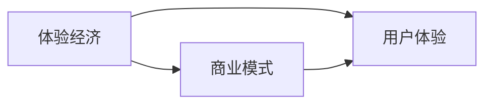

                 

# 体验经济创业：打造难忘记忆的商业模式

> 关键词：体验经济, 用户体验, 商业模式, 数字经济, 创新创业

## 1. 背景介绍

### 1.1 问题由来

随着数字化进程的不断推进，传统经济模式逐渐向体验经济转变。用户体验的好坏，成为了品牌竞争的关键因素。为了更好地把握用户体验的本质，打造难忘的客户记忆，本文将围绕体验经济展开深入探讨。

体验经济作为一种新兴的经济模式，强调通过提供优质的产品和服务，创造独特的用户体验，从而赢得消费者的青睐。相较于传统经济模式，体验经济更加注重客户参与和情感共鸣，成为新时代下的核心竞争优势。因此，研究体验经济创业，理解其商业模式，对于企业家和创业者具有重要意义。

### 1.2 问题核心关键点

本文将围绕以下关键点进行深入分析：
1. 体验经济的核心概念与理论基础。
2. 体验经济创业的核心商业模型及其实现路径。
3. 数字化背景下，体验经济创业的创新机遇与挑战。

## 2. 核心概念与联系

### 2.1 核心概念概述

为更好地理解体验经济创业，需首先了解其核心概念：

- **体验经济(BEx)**：一种以提供体验价值为核心竞争力的新型经济模式，强调通过创造独特的用户体验，满足顾客的情感和精神需求。
- **用户体验(UX)**：指用户使用产品或服务时的心理感受和行为反应，包括视觉、听觉、触觉等感官体验，以及认知、情感和行为等心理体验。
- **商业模式**：企业在特定市场环境下，为实现盈利目标而设计的产品或服务、价值主张、客户细分、渠道策略、客户关系管理等要素的有机组合。

以上概念间存在紧密联系。用户体验是体验经济的基础，商业模式则是用户体验的策略保障，两者共同作用，驱动品牌在体验经济中取得成功。

### 2.2 核心概念原理和架构的 Mermaid 流程图



以上图表展示了体验经济创业中，用户体验与商业模式的相互作用。体验经济以用户体验为核心，通过商业模式的设计和优化，最终实现用户体验价值的最大化。

## 3. 核心算法原理 & 具体操作步骤

### 3.1 算法原理概述

体验经济创业的算法原理，本质上是围绕用户体验的优化与提升。其核心在于构建一个以用户为中心的商业模式，通过技术手段和策略调整，不断优化用户体验。

具体而言，算法原理包括以下几个方面：

1. **用户画像构建**：通过对用户行为数据的收集和分析，构建详细的用户画像，理解用户的偏好和需求。
2. **用户体验设计**：基于用户画像，设计符合用户期望的体验场景，优化产品和服务的设计，提升用户的满意度和忠诚度。
3. **数据分析与反馈**：利用数据分析技术，持续收集用户反馈，通过迭代优化，不断提升用户体验。

### 3.2 算法步骤详解

以下是基于上述原理的具体操作步骤：

**Step 1: 用户画像构建**

1. 收集用户数据：利用问卷调查、网站分析、社交媒体监控等方式，收集用户的行为数据和反馈信息。
2. 数据清洗和处理：对收集到的数据进行去重、缺失值填补、异常值处理等预处理工作。
3. 画像构建：使用聚类、分类、关联规则等数据挖掘技术，构建用户画像，包括用户的人口统计信息、兴趣爱好、行为模式等。

**Step 2: 用户体验设计**

1. 用户体验模型设计：基于用户画像，设计用户体验模型，包括视觉、交互、内容等多个方面。
2. 原型设计与测试：制作初步原型，通过A/B测试等方式，不断优化用户体验设计。
3. 持续迭代优化：根据用户反馈和数据分析结果，持续迭代优化用户体验。

**Step 3: 数据分析与反馈**

1. 数据分析工具选择：选择合适的数据分析工具，如Python的Pandas、Matplotlib、Scikit-learn等，进行数据处理和分析。
2. 反馈机制设计：建立有效的用户反馈机制，包括问卷调查、用户评论、在线客服等，及时获取用户反馈。
3. 数据分析与优化：利用数据分析技术，如机器学习、深度学习等，对用户反馈进行深度分析，提取有价值的信息，指导用户体验优化。

### 3.3 算法优缺点

**优点**：
- **用户中心化**：以用户体验为核心，通过数据驱动的方式，确保产品和服务始终符合用户需求。
- **快速迭代**：通过持续的数据收集和反馈，快速迭代优化用户体验，提升用户满意度。
- **技术支持**：利用先进的数据分析技术和用户体验设计工具，提高体验优化的效率和质量。

**缺点**：
- **成本高**：用户体验优化的过程需要大量数据收集和分析，成本较高。
- **用户需求多样**：不同用户群体需求各异，统一体验设计难以满足所有用户需求。
- **技术复杂**：用户体验优化涉及数据分析、用户研究等多个领域，技术门槛较高。

### 3.4 算法应用领域

体验经济创业的算法原理，广泛应用于以下领域：

1. **电子商务**：通过用户体验优化，提升用户购物体验，增加用户粘性和复购率。
2. **旅游与酒店**：通过用户体验设计，提升服务质量和环境氛围，提升客户满意度。
3. **教育与培训**：通过个性化学习体验设计，提高学习效果和用户满意度。
4. **医疗健康**：通过优化医疗服务体验，提升患者就医体验和医疗效果。
5. **金融服务**：通过个性化服务体验设计，提升用户金融服务体验和信任度。

## 4. 数学模型和公式 & 详细讲解 & 举例说明

### 4.1 数学模型构建

体验经济创业的数学模型，主要围绕用户体验的优化与提升。以下是用户体验优化的数学模型构建：

**目标函数**：
$$
\max_{UX} \sum_{i=1}^{n} UX_i \times \omega_i
$$

其中，$UX_i$为第$i$个用户体验指标，$\omega_i$为该指标的权重。

**约束条件**：
1. 用户画像约束：$P=\{\text{人口统计信息}\}$。
2. 用户需求约束：$D=\{\text{用户需求}\}$。
3. 产品功能约束：$F=\{\text{产品功能}\}$。
4. 技术资源约束：$R=\{\text{技术资源}\}$。

### 4.2 公式推导过程

以用户画像构建为例，其数学模型推导过程如下：

**用户画像构建模型**：
$$
P=\arg\min_{P} \sum_{i=1}^{m} \lambda_i \times \text{KL}(P_i || P')
$$

其中，$P_i$为用户画像特征，$P'$为用户真实数据分布，$\lambda_i$为正则化系数，$\text{KL}$为KL散度。

利用KL散度最小化，可以计算出最优的用户画像分布$P$。

### 4.3 案例分析与讲解

以一家旅游公司的用户体验优化为例：

**Step 1: 用户画像构建**

1. 收集用户数据：通过问卷调查、在线预订记录、社交媒体等渠道，收集用户数据。
2. 数据清洗和处理：使用Python的Pandas库进行数据清洗，包括去重、缺失值填补、异常值处理等。
3. 画像构建：使用K-means聚类算法，将用户分为不同的群体，每个群体具有特定的特征。

**Step 2: 用户体验设计**

1. 用户体验模型设计：基于用户画像，设计用户体验模型，包括景点推荐、行程安排、个性化服务等。
2. 原型设计与测试：制作初步原型，通过A/B测试等方式，不断优化用户体验设计。
3. 持续迭代优化：根据用户反馈和数据分析结果，持续迭代优化用户体验。

**Step 3: 数据分析与反馈**

1. 数据分析工具选择：使用Python的Pandas、Matplotlib、Scikit-learn等工具，进行数据处理和分析。
2. 反馈机制设计：建立有效的用户反馈机制，包括问卷调查、用户评论、在线客服等，及时获取用户反馈。
3. 数据分析与优化：利用数据分析技术，如机器学习、深度学习等，对用户反馈进行深度分析，提取有价值的信息，指导用户体验优化。

## 5. 项目实践：代码实例和详细解释说明

### 5.1 开发环境搭建

在进行体验经济创业的算法实践前，我们需要准备好开发环境。以下是使用Python进行开发的环境配置流程：

1. 安装Anaconda：从官网下载并安装Anaconda，用于创建独立的Python环境。

2. 创建并激活虚拟环境：
```bash
conda create -n py36 python=3.6 
conda activate py36
```

3. 安装必要的Python库：
```bash
pip install pandas matplotlib scikit-learn seaborn
```

4. 安装Jupyter Notebook：
```bash
pip install jupyter
```

完成上述步骤后，即可在`py36`环境中进行体验经济创业的算法实践。

### 5.2 源代码详细实现

以下是使用Python进行用户体验优化的代码实现：

**用户画像构建代码**：
```python
import pandas as pd
from sklearn.cluster import KMeans

# 读取数据
data = pd.read_csv('user_data.csv')

# 数据清洗
data.dropna(inplace=True)

# 特征选择
selected_features = ['age', 'gender', 'travel_frequency']

# 数据标准化
data[selected_features] = (data[selected_features] - data[selected_features].mean()) / data[selected_features].std()

# 聚类分析
kmeans = KMeans(n_clusters=5, random_state=42)
kmeans.fit(data[selected_features])

# 输出用户画像
print(kmeans.labels_)
```

**用户体验设计代码**：
```python
import matplotlib.pyplot as plt

# 用户体验模型设计
def user_experience_design(data, kmeans):
    # 设计用户体验模型
    ux_model = data.groupby(kmeans.labels_).mean()
    
    # 绘制用户体验指标图
    fig, axs = plt.subplots(len(ux_model), 1, figsize=(10, len(ux_model) * 3))
    for i, ax in enumerate(axs):
        ax.plot(ux_model.columns, ux_model.iloc[i], marker='o')
        ax.set_title(ux_model.columns[i])
    
    plt.show()

# 调用函数
user_experience_design(data, kmeans)
```

### 5.3 代码解读与分析

**用户画像构建代码解读**：
1. 使用Pandas库读取用户数据。
2. 数据清洗，去除缺失值和异常值。
3. 特征选择，选择影响用户体验的关键特征。
4. 数据标准化，确保聚类分析的公平性。
5. 使用KMeans算法进行聚类，构建用户画像。
6. 输出用户画像标签。

**用户体验设计代码解读**：
1. 设计用户体验模型，通过聚类结果分组计算用户体验指标的平均值。
2. 使用Matplotlib库绘制用户体验指标图，直观展示各用户体验指标的变化趋势。

## 6. 实际应用场景

### 6.1 智能客服系统

体验经济创业在智能客服系统中的应用，主要体现在提升用户交互体验和满意度上。通过构建用户画像和优化用户体验，智能客服系统可以更好地理解用户需求，提供个性化、高效的服务。

具体而言，智能客服系统可以通过用户画像构建，了解用户的常见问题类型和行为模式，优化问题解答流程，提升问题解决效率。同时，通过用户体验设计，改善客服语音、文字交流的界面和交互方式，增强用户的信任感和满意度。

### 6.2 金融服务平台

金融服务平台通过用户体验优化，可以提升用户的金融服务体验和信任度。通过构建用户画像，金融平台可以更好地理解用户的风险偏好和投资需求，提供个性化的金融产品和服务。

具体而言，金融平台可以通过用户画像构建，分析用户的交易历史、风险偏好等信息，优化个性化推荐算法，提升用户体验。同时，通过用户体验设计，改善金融服务的交互界面，增强用户的安全感和信任度。

### 6.3 在线教育平台

在线教育平台通过用户体验优化，可以提升学习效果和用户满意度。通过构建用户画像，教育平台可以更好地理解用户的学习需求和行为模式，优化课程内容和教学方法。

具体而言，在线教育平台可以通过用户画像构建，分析用户的知识水平、学习习惯等信息，优化课程推荐算法，提升学习效果。同时，通过用户体验设计，改善学习平台的交互界面，增强用户的参与感和满意度。

### 6.4 未来应用展望

未来，体验经济创业将在更多领域得到应用，为传统行业带来变革性影响。

1. **智慧医疗**：通过用户体验优化，提升患者就医体验和医疗效果，推动医疗服务的智能化和便捷化。
2. **智能家居**：通过用户体验优化，提升家居产品的智能化和个性化，增强用户的居住体验。
3. **电子商务**：通过用户体验优化，提升用户的购物体验和满意度，增强用户的忠诚度。
4. **旅游与酒店**：通过用户体验优化，提升旅游和酒店的服务质量和环境氛围，增强用户的满意度和复购率。

## 7. 工具和资源推荐

### 7.1 学习资源推荐

为了帮助开发者系统掌握体验经济创业的理论基础和实践技巧，这里推荐一些优质的学习资源：

1. 《用户体验设计》系列书籍：系统介绍用户体验设计的理论基础和实践方法，涵盖用户研究、用户界面设计等多个方面。
2. Udemy《UX Design for the Absolute Beginner》课程：适合初学者，从零开始学习用户体验设计。
3. Coursera《UX Design Specialization》课程：斯坦福大学开设的系列课程，涵盖用户体验设计的多个方面，包括用户研究、交互设计等。
4. Nielsen Norman Group：用户体验设计的权威机构，提供丰富的文章、报告和工具，帮助设计师提升用户体验。
5. Smashing Magazine：提供大量用户体验设计相关的文章和资源，涵盖设计趋势、工具和技巧等。

通过对这些资源的学习实践，相信你一定能够快速掌握用户体验优化的精髓，并用于解决实际的商业问题。

### 7.2 开发工具推荐

高效的开发离不开优秀的工具支持。以下是几款用于用户体验优化的常用工具：

1. Sketch：专业的界面设计工具，支持原型设计、用户界面设计等。
2. Adobe XD：全功能用户体验设计工具，支持原型设计、交互设计等。
3. Figma：在线协作的用户体验设计工具，支持实时协作和版本管理。
4. InVision：原型设计和用户测试平台，支持高保真原型和用户反馈收集。
5. Google Analytics：用户行为分析工具，可以深入分析用户行为和体验数据。

合理利用这些工具，可以显著提升用户体验优化的效率和质量，加快创新迭代的步伐。

### 7.3 相关论文推荐

用户体验优化技术的发展，离不开学界的持续研究。以下是几篇奠基性的相关论文，推荐阅读：

1. Jeff Howe, Clive Thompson. "Why We Buy"：探讨用户体验在设计、营销和商业中的作用。
2. Norman, J. D.（1998）. "The Design of Everyday Things"：经典的用户界面设计理论书籍。
3. Mark Levy，Chris Hendrix. "Designing With the Mind in Mind"：用户体验设计的经典理论书籍。
4. Cynthia Verberg. "A Common Language for User Experience"：提出用户体验设计的语言模型，提升用户体验设计的能力。
5. Wosley, R. J., & Walker, S. K.（2007）. "The Effects of User Interface Simplicity on Usability and User Satisfaction"：研究用户界面设计对用户体验的影响。

这些论文代表了大体验经济创业领域的研究进展，帮助设计师和开发者了解用户体验优化的理论基础和方法。

## 8. 总结：未来发展趋势与挑战

### 8.1 总结

本文对体验经济创业进行了全面系统的介绍。首先，阐述了体验经济的核心概念与理论基础，明确了用户体验优化的重要性。其次，从算法原理到具体操作步骤，详细讲解了用户体验优化的数学模型和实现步骤，给出了用户体验优化的完整代码实例。同时，本文还广泛探讨了用户体验优化的实际应用场景，展示了用户体验优化的广阔前景。最后，本文精选了用户体验优化的各类学习资源，力求为读者提供全方位的技术指引。

通过本文的系统梳理，可以看到，用户体验优化在体验经济创业中具有重要的战略地位。只有不断优化用户体验，才能在激烈的市场竞争中取得成功。

### 8.2 未来发展趋势

展望未来，用户体验优化将呈现以下几个发展趋势：

1. **用户中心化**：用户体验优化将更加注重用户反馈和需求，以用户为中心，提供个性化的产品和服务。
2. **技术融合**：用户体验优化将与人工智能、大数据等先进技术深度融合，实现更智能、更高效的用户体验。
3. **个性化定制**：用户体验优化将更加注重个性化定制，根据用户的偏好和需求，提供量身定制的产品和服务。
4. **数据驱动**：用户体验优化将更加依赖数据驱动，通过数据分析和机器学习，不断优化用户体验。
5. **多渠道整合**：用户体验优化将更加注重多渠道整合，实现跨平台、跨设备的用户体验一致性。

这些趋势凸显了用户体验优化在体验经济创业中的重要地位，未来用户体验优化的实践将更加多样化和智能化。

### 8.3 面临的挑战

尽管用户体验优化在体验经济创业中具有重要意义，但仍然面临诸多挑战：

1. **数据隐私**：在用户体验优化中，需要收集和分析大量用户数据，如何保护用户隐私和数据安全，是一个重要的挑战。
2. **技术复杂**：用户体验优化涉及多个领域的技术，包括用户研究、界面设计、数据分析等，技术门槛较高。
3. **用户体验度量**：如何科学、客观地衡量用户体验，设定合理的指标，指导用户体验优化，是一个重要的挑战。
4. **用户期望管理**：用户体验优化需要管理好用户的期望，避免过度承诺和不足交付，保持用户满意度。
5. **跨文化差异**：不同文化背景的用户对用户体验的期望不同，如何在全球范围内实现一致的用户体验，是一个重要的挑战。

这些挑战需要我们不断探索和解决，才能实现更好的用户体验优化。

### 8.4 研究展望

未来，用户体验优化将在以下几个方面进行深入研究：

1. **用户行为模型**：通过深入研究用户行为数据，构建更加科学的用户行为模型，指导用户体验优化。
2. **多模态用户体验**：研究多模态用户体验的优化方法，实现视觉、听觉、触觉等感官体验的协同优化。
3. **个性化推荐系统**：研究个性化推荐系统的设计方法，提升用户体验的个性化和多样性。
4. **智能交互设计**：研究智能交互设计的方法，实现更自然、更高效的用户交互体验。
5. **跨文化用户体验**：研究跨文化用户体验的优化方法，实现全球一致的用户体验。

这些研究方向的探索，将引领用户体验优化的进一步发展，为体验经济创业带来更多创新和突破。

## 9. 附录：常见问题与解答

**Q1：用户体验优化的核心是什么？**

A: 用户体验优化的核心在于用户需求和情感的把握。通过深入了解用户的偏好、需求和情感，设计符合用户期望的产品和服务，提升用户满意度和忠诚度。

**Q2：如何科学地衡量用户体验？**

A: 科学衡量用户体验的关键在于设定合理的指标和度量方法。常用的用户体验指标包括满意度、完成率、转化率、净推荐值等。通过问卷调查、用户反馈、行为分析等方式，获取用户体验数据，进行量化评估。

**Q3：用户体验优化与用户界面设计有什么区别？**

A: 用户体验优化不仅关注用户界面的设计，还涵盖用户行为分析、用户研究等多个方面。用户界面设计是用户体验优化的重要组成部分，但用户体验优化的范围更广，涉及更多维度的用户需求和情感。

**Q4：用户体验优化的技术门槛高吗？**

A: 用户体验优化的技术门槛确实较高，涉及数据分析、用户研究、界面设计等多个领域。但随着技术的不断发展和工具的完善，用户体验优化的技术门槛正在逐渐降低，更多开发者和设计师可以轻松上手。

**Q5：用户体验优化在不同文化背景下如何应用？**

A: 不同文化背景的用户对用户体验的期望不同，需要进行跨文化研究，了解不同文化背景下的用户需求和偏好。在用户体验优化过程中，需要考虑不同文化背景下的设计差异，实现全球一致的用户体验。

总之，用户体验优化在体验经济创业中具有重要的战略地位。只有不断优化用户体验，才能在激烈的市场竞争中取得成功。未来，随着技术的不断发展和工具的完善，用户体验优化将更加多样化和智能化，为体验经济创业带来更多创新和突破。

