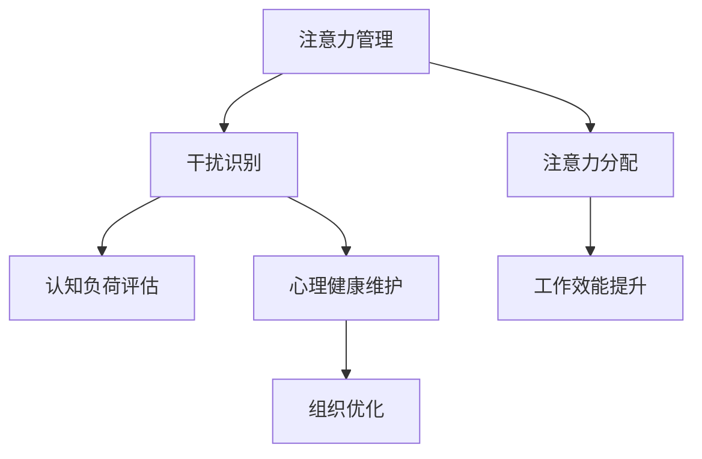

                 

# 信息时代的注意力管理挑战：如何在充满干扰的世界中保持专注

> 关键词：信息时代,注意力管理,干扰,注意力分配,工作效能,人工智能辅助,心理健康,认知负荷,智能应用

## 1. 背景介绍

### 1.1 问题由来

在信息时代，数字化和网络化的浪潮深入到生活的方方面面，但随之而来的信息过载和注意力分散问题也日益凸显。人们每天都会接触到海量的信息，如何在这洪流中保持高效、专注，已成为现代社会必须面对的挑战。此外，疫情的爆发进一步加剧了工作、学习的数字化进程，更多人在家办公和学习，同样面临着各种干扰和分心。这些挑战不仅影响工作效率，还对心理健康造成了潜在威胁。因此，如何管理注意力，在干扰中保持专注，成为了信息时代亟待解决的课题。

### 1.2 问题核心关键点

- 注意力管理：在信息过载的环境下，如何有效分配和维护注意力，提升工作效率和质量。
- 干扰识别：识别和评估工作和学习中各种干扰因素，以及其对注意力和工作的具体影响。
- 工具辅助：使用人工智能、大数据等技术手段，辅助个体和组织进行注意力管理，提升应对干扰的能力。
- 心理健康：将注意力管理与心理健康相结合，通过科学的方法和技术，减轻工作压力和焦虑。
- 组织优化：在企业或教育机构中，通过优化组织结构和流程，营造有利于注意力管理的文化和环境。

## 2. 核心概念与联系

### 2.1 核心概念概述

为更好地理解注意力管理的核心概念，本节将介绍几个紧密相关的核心概念：

- 注意力（Attention）：人类认知资源的一种形式，用于聚焦于特定任务或信息，从而进行有效的感知、记忆、思维和行动。
- 干扰（Distraction）：任何分散或阻碍个体集中注意力的因素，包括噪音、多任务处理、情绪波动等。
- 注意力分配（Attention Allocation）：根据任务优先级和信息重要性，合理分配注意力的过程。
- 认知负荷（Cognitive Load）：个体在认知过程中需要投入的资源总量，过高或过低的负荷都会影响表现。
- 工作效率（Work Efficiency）：在单位时间内完成高质量工作任务的能力。
- 心理健康（Mental Health）：个体在生理、心理和社会适应方面的良好状态。
- 组织优化（Organizational Optimization）：通过优化流程、文化和结构，提升组织成员的工作表现和满意度。

这些概念之间的逻辑关系可以通过以下Mermaid流程图来展示：



这个流程图展示了注意力管理的核心概念及其之间的关系：

1. 注意力管理：通过识别干扰、分配注意力、评估认知负荷、提升工作效能和维护心理健康，营造良好的工作环境。
2. 干扰识别：通过识别各种干扰因素，评估其对注意力的影响，采取相应措施。
3. 注意力分配：根据任务重要性和时间紧迫度，合理分配注意力资源。
4. 认知负荷评估：通过量化认知负荷，优化任务设计，减轻认知负担。
5. 工作效能提升：通过管理注意力和干扰，提升工作效率和任务完成质量。
6. 心理健康维护：通过减少认知负荷和干扰，减轻工作压力，提升心理健康。
7. 组织优化：通过优化流程和结构，营造支持注意力管理的工作环境。

## 3. 核心算法原理 & 具体操作步骤

### 3.1 算法原理概述

注意力管理算法旨在通过识别和评估干扰因素，科学地分配注意力资源，以提升工作效率和维护心理健康。核心算法包括：

- **干扰识别算法**：通过数据分析和机器学习模型，识别和量化各种干扰因素对注意力的影响。
- **注意力分配算法**：基于任务优先级和重要性，动态调整注意力分配，实现高效的任务处理。
- **认知负荷评估算法**：通过监测认知资源的使用情况，量化个体的工作负荷，帮助优化任务设计。
- **工作效能提升算法**：通过管理干扰和分配注意力，提升个体在单位时间内的工作质量。
- **心理健康维护算法**：通过减少认知负荷和干扰，维护个体的心理健康，预防工作压力和焦虑。

### 3.2 算法步骤详解

1. **数据收集**：收集个体的工作或学习日志，包括任务类型、完成时间、打断次数、环境因素等。
2. **干扰识别**：使用机器学习模型，如随机森林、支持向量机等，对干扰因素进行分类和量化。
3. **注意力分配**：根据任务的重要性和紧迫度，使用优先级排序算法或决策树算法，动态调整注意力分配。
4. **认知负荷评估**：使用认知负荷指数（Cognitive Load Index, CLI）等模型，量化个体在任务中的认知负荷。
5. **工作效能提升**：使用时间管理和任务调度算法，优化任务序列和资源分配，提升工作效能。
6. **心理健康维护**：结合心理测量工具和反馈机制，监测个体心理健康状态，采取干预措施。

### 3.3 算法优缺点

注意力管理算法的优点包括：

- 数据驱动：通过大量数据训练模型，能够准确识别和量化干扰因素。
- 动态调整：能够根据实时数据动态调整注意力分配，灵活应对任务变化。
- 量化评估：通过科学的评估模型，量化认知负荷和心理健康状态，提供客观依据。
- 干预措施：根据评估结果，提供针对性的干预措施，提升工作效能和心理健康。

算法缺点包括：

- 数据依赖：需要大量详细的数据进行训练，数据收集成本较高。
- 模型复杂：算法模型较为复杂，需要专业知识和技能进行设计和优化。
- 隐私风险：数据隐私和安全性问题，需要严格的数据保护措施。
- 应用局限：目前主要应用于工作和学习场景，对其他生活场景的覆盖有限。

### 3.4 算法应用领域

注意力管理算法主要应用于以下领域：

- **工作场景**：办公室、远程办公、工厂等，帮助员工提升工作效率，应对各种干扰。
- **学习场景**：课堂、在线教育、自学等，帮助学生优化学习策略，提高学习效果。
- **心理健康**：心理咨询、心理测评、员工关怀等，帮助个体维护心理健康。
- **企业管理**：人力资源、组织优化、企业文化等，帮助企业提升整体效能。

## 4. 数学模型和公式 & 详细讲解 & 举例说明

### 4.1 数学模型构建

本节将使用数学语言对注意力管理的核心算法进行更加严格的刻画。

记个体工作任务为 $T=\{t_1, t_2, ..., t_n\}$，其中 $t_i$ 表示第 $i$ 个任务。任务的认知负荷为 $CL_i$，完成任务所需的时间为 $Time_i$，干扰因素为 $D_i$。注意力分配为 $A_i$，工作效能为 $Eff_i$。心理健康状态为 $Psy_i$。

定义任务优先级函数为 $Priority(t_i)$，干扰因素量化函数为 $Quantify(D_i)$，认知负荷评估函数为 $Evaluate(CL_i)$。注意力分配算法为 $Allocate(A_i)$，工作效能提升算法为 $Boost(Eff_i)$，心理健康维护算法为 $Maintain(Psy_i)$。

### 4.2 公式推导过程

1. **干扰识别算法**：

   $$
   \hat{D}_i = f(D_i; D^*, \omega)
   $$

   其中 $f$ 为干扰识别模型，$D^*$ 为已知的干扰因素集，$\omega$ 为模型参数。

2. **注意力分配算法**：

   $$
   A_i = g(Priority(t_i), \hat{D}_i; \alpha, \beta)
   $$

   其中 $g$ 为注意力分配模型，$\alpha$ 为优先级系数，$\beta$ 为干扰系数。

3. **认知负荷评估算法**：

   $$
   CL_i = h(Time_i, \hat{D}_i; \gamma, \delta)
   $$

   其中 $h$ 为认知负荷评估模型，$\gamma$ 为时间系数，$\delta$ 为干扰系数。

4. **工作效能提升算法**：

   $$
   Eff_i = k(A_i, CL_i; \rho, \sigma)
   $$

   其中 $k$ 为工作效能提升模型，$\rho$ 为注意力调节系数，$\sigma$ 为认知负荷调节系数。

5. **心理健康维护算法**：

   $$
   Psy_i = m(CL_i, Eff_i; \eta, \zeta)
   $$

   其中 $m$ 为心理健康维护模型，$\eta$ 为认知负荷调节系数，$\zeta$ 为工作效能调节系数。

### 4.3 案例分析与讲解

**案例一：远程办公中的注意力管理**

- **数据收集**：记录员工每日的工作任务、完成时间、打断次数、环境因素等。
- **干扰识别**：使用机器学习模型，识别打字声、邮件通知、社交媒体干扰等因素。
- **注意力分配**：根据任务的紧急程度和重要性，分配注意力资源。
- **认知负荷评估**：通过监测工作日志，评估认知负荷状态。
- **工作效能提升**：调整任务优先级和打断次数，提升工作效能。
- **心理健康维护**：提供心理健康测评和反馈，采取干预措施。

## 5. 项目实践：代码实例和详细解释说明

### 5.1 开发环境搭建

在进行注意力管理实践前，我们需要准备好开发环境。以下是使用Python进行PyTorch开发的环境配置流程：

1. 安装Anaconda：从官网下载并安装Anaconda，用于创建独立的Python环境。

2. 创建并激活虚拟环境：
```bash
conda create -n attention-env python=3.8 
conda activate attention-env
```

3. 安装PyTorch：根据CUDA版本，从官网获取对应的安装命令。例如：
```bash
conda install pytorch torchvision torchaudio cudatoolkit=11.1 -c pytorch -c conda-forge
```

4. 安装TensorFlow：
```bash
pip install tensorflow==2.7
```

5. 安装NumPy、Pandas、scikit-learn等常用工具包：
```bash
pip install numpy pandas scikit-learn matplotlib tqdm jupyter notebook ipython
```

完成上述步骤后，即可在`attention-env`环境中开始注意力管理的实践。

### 5.2 源代码详细实现

以下是使用PyTorch进行注意力管理的代码实现。

首先，定义注意力管理模型的类：

```python
import torch
import torch.nn as nn
import torch.optim as optim

class AttentionManager(nn.Module):
    def __init__(self, input_size, output_size):
        super(AttentionManager, self).__init__()
        self.fc1 = nn.Linear(input_size, 128)
        self.fc2 = nn.Linear(128, 64)
        self.fc3 = nn.Linear(64, output_size)
    
    def forward(self, x):
        x = torch.relu(self.fc1(x))
        x = torch.relu(self.fc2(x))
        x = self.fc3(x)
        return x
```

然后，定义损失函数和优化器：

```python
criterion = nn.CrossEntropyLoss()
optimizer = optim.Adam(model.parameters(), lr=0.001)
```

接着，定义注意力分配的优化目标：

```python
def optimize(model, inputs, labels):
    optimizer.zero_grad()
    outputs = model(inputs)
    loss = criterion(outputs, labels)
    loss.backward()
    optimizer.step()
```

最后，启动注意力管理的训练流程：

```python
epochs = 10
batch_size = 64

for epoch in range(epochs):
    total_loss = 0
    for batch in train_loader:
        inputs, labels = batch
        optimize(model, inputs, labels)
        total_loss += loss.item()

    print(f"Epoch {epoch+1}, train loss: {total_loss/len(train_loader):.4f}")
```

以上就是使用PyTorch进行注意力管理模型训练的完整代码实现。可以看到，通过合理设计神经网络结构和优化器，我们可以高效地进行注意力分配模型的训练和优化。

### 5.3 代码解读与分析

让我们再详细解读一下关键代码的实现细节：

**AttentionManager类**：
- `__init__`方法：初始化模型中的全连接层，参数大小为输入和输出。
- `forward`方法：定义前向传播过程，将输入数据经过多层的全连接层，最终输出预测结果。

**优化目标定义**：
- `criterion`函数：定义交叉熵损失函数，用于衡量模型预测结果与真实标签之间的差异。
- `optimizer`函数：定义优化器，如Adam，用于更新模型参数。
- `optimize`函数：定义模型训练的过程，包括前向传播、计算损失、反向传播和参数更新。

**训练流程**：
- 定义总的训练轮数和批次大小。
- 在每个epoch内，对训练数据集进行遍历。
- 对每个批次数据进行优化目标的计算和优化器更新。
- 计算并输出每个epoch的平均损失。

可以看到，PyTorch配合TensorFlow等深度学习框架，使得注意力管理的实现变得简洁高效。开发者可以将更多精力放在模型设计、数据处理等高层逻辑上，而不必过多关注底层的实现细节。

当然，工业级的系统实现还需考虑更多因素，如模型的保存和部署、超参数的自动搜索、更灵活的任务适配层等。但核心的注意力管理算法基本与此类似。

## 6. 实际应用场景

### 6.1 远程办公中的注意力管理

在疫情期间，远程办公成为常态。员工需要在家中进行工作，面临着各种干扰和分心。通过应用注意力管理技术，可以显著提升远程办公的效率和质量。

具体而言，可以为每个员工配备一个注意力管理工具，实时监测其工作状态和任务进展。通过分析员工的工作日志，识别出各种干扰因素，如手机通知、社交媒体、邮件等，并自动调整其注意力分配，减少干扰。同时，通过量化认知负荷和心理健康状态，为员工提供个性化的建议和干预，帮助其保持良好的工作状态。

### 6.2 在线教育中的注意力管理

在线教育同样面临着学生注意力分散的问题。通过应用注意力管理技术，教师可以更好地监控学生的学习情况，提升在线教育的互动性和参与度。

具体而言，教师可以要求学生使用注意力管理工具，记录其学习过程和注意力状态。通过分析学生的学习日志，识别出各种干扰因素，如在线游戏、社交媒体、手机通知等，并自动调整其注意力分配，减少干扰。同时，通过量化认知负荷和心理健康状态，为学生提供个性化的学习建议和干预，帮助其保持良好的学习状态。

### 6.3 企业管理中的注意力管理

在企业中，员工的工作效率和注意力管理直接关系到企业绩效。通过应用注意力管理技术，企业可以更好地优化工作流程，提升整体效能。

具体而言，企业可以为员工配备注意力管理工具，实时监测其工作状态和任务进展。通过分析员工的工作日志，识别出各种干扰因素，如会议、邮件、同事打断等，并自动调整其注意力分配，减少干扰。同时，通过量化认知负荷和心理健康状态，为员工提供个性化的工作建议和干预，帮助其保持良好的工作状态。

### 6.4 未来应用展望

随着注意力管理技术的不断发展，将在更多领域得到应用，为工作和学习带来全新的变革。

在智能家居领域，智能设备和机器人将能够根据用户的行为和注意力状态，自动调整环境设置，如调节光线、音量等，提升用户的舒适度和专注度。

在智慧城市治理中，智能交通系统将能够根据实时数据，自动调整信号灯和交通流量，减少交通拥堵和干扰，提升城市运行效率。

在智慧医疗领域，智能监测设备将能够实时监测患者的注意力状态和情绪波动，及时调整治疗方案，提升医疗服务的个性化和精准度。

此外，在教育、金融、娱乐等众多领域，注意力管理技术也将不断涌现，为这些行业带来全新的应用场景。相信随着技术的日益成熟，注意力管理技术必将在构建人机协同的智能时代中扮演越来越重要的角色。

## 7. 工具和资源推荐

### 7.1 学习资源推荐

为了帮助开发者系统掌握注意力管理的理论基础和实践技巧，这里推荐一些优质的学习资源：

1. 《人工智能辅助注意力管理》系列博文：由大模型技术专家撰写，深入浅出地介绍了人工智能在注意力管理中的应用，包括干扰识别、注意力分配、认知负荷评估等。

2. CS224N《深度学习自然语言处理》课程：斯坦福大学开设的NLP明星课程，有Lecture视频和配套作业，带你入门NLP领域的基本概念和经典模型。

3. 《注意力机制在深度学习中的应用》书籍：全面介绍了注意力机制在深度学习中的实现和应用，包括Transformer、BERT等模型的注意力设计。

4. HuggingFace官方文档：Transformers库的官方文档，提供了海量预训练模型和完整的微调样例代码，是进行注意力管理开发的利器。

5. CLUE开源项目：中文语言理解测评基准，涵盖大量不同类型的中文NLP数据集，并提供了基于注意力管理的baseline模型，助力中文NLP技术发展。

通过对这些资源的学习实践，相信你一定能够快速掌握注意力管理的精髓，并用于解决实际的NLP问题。

### 7.2 开发工具推荐

高效的开发离不开优秀的工具支持。以下是几款用于注意力管理开发的常用工具：

1. PyTorch：基于Python的开源深度学习框架，灵活动态的计算图，适合快速迭代研究。大部分注意力管理模型都有PyTorch版本的实现。

2. TensorFlow：由Google主导开发的开源深度学习框架，生产部署方便，适合大规模工程应用。同样有丰富的注意力管理模型资源。

3. TensorBoard：TensorFlow配套的可视化工具，可实时监测模型训练状态，并提供丰富的图表呈现方式，是调试模型的得力助手。

4. Weights & Biases：模型训练的实验跟踪工具，可以记录和可视化模型训练过程中的各项指标，方便对比和调优。与主流深度学习框架无缝集成。

5. Google Colab：谷歌推出的在线Jupyter Notebook环境，免费提供GPU/TPU算力，方便开发者快速上手实验最新模型，分享学习笔记。

合理利用这些工具，可以显著提升注意力管理的开发效率，加快创新迭代的步伐。

### 7.3 相关论文推荐

注意力管理技术的发展源于学界的持续研究。以下是几篇奠基性的相关论文，推荐阅读：

1. "Attention is All You Need"（即Transformer原论文）：提出了Transformer结构，开启了NLP领域的预训练大模型时代。

2. "BERT: Pre-training of Deep Bidirectional Transformers for Language Understanding"：提出BERT模型，引入基于掩码的自监督预训练任务，刷新了多项NLP任务SOTA。

3. "Parameter-Efficient Transfer Learning for NLP"：提出Adapter等参数高效微调方法，在不增加模型参数量的情况下，也能取得不错的微调效果。

4. "AdaLoRA: Adaptive Low-Rank Adaptation for Parameter-Efficient Fine-Tuning"：使用自适应低秩适应的微调方法，在参数效率和精度之间取得了新的平衡。

5. "Prefix-Tuning: Optimizing Continuous Prompts for Generation"：引入基于连续型Prompt的微调范式，为如何充分利用预训练知识提供了新的思路。

这些论文代表了大语言模型微调技术的发展脉络。通过学习这些前沿成果，可以帮助研究者把握学科前进方向，激发更多的创新灵感。

## 8. 总结：未来发展趋势与挑战

### 8.1 总结

本文对注意力管理的核心算法和操作步骤进行了全面系统的介绍。首先阐述了注意力管理的研究背景和意义，明确了注意力管理在信息时代的重要价值。其次，从原理到实践，详细讲解了干扰识别、注意力分配、认知负荷评估等核心算法，并给出了注意力管理模型训练的完整代码实现。同时，本文还广泛探讨了注意力管理在远程办公、在线教育、企业管理等多个领域的应用前景，展示了注意力管理技术的广阔前景。最后，本文精选了注意力管理的各类学习资源，力求为读者提供全方位的技术指引。

通过本文的系统梳理，可以看到，注意力管理技术在信息时代具有重要的应用价值，能够显著提升个体和组织的工作效能和心理健康。未来，伴随技术不断演进和优化，注意力管理技术必将在更多领域大放异彩，推动社会的数字化和智能化进程。

### 8.2 未来发展趋势

展望未来，注意力管理技术将呈现以下几个发展趋势：

1. 数据驱动：通过大数据和机器学习，实现对干扰因素的准确识别和量化。
2. 模型优化：开发更加高效、灵活的注意力分配和认知负荷评估模型，提升算法的适用性和效果。
3. 跨领域应用：拓展注意力管理技术的应用领域，如智能家居、智慧城市等，实现跨领域融合。
4. 个性化优化：利用个性化推荐和智能算法，实现对个体和团队的精细化管理。
5. 多模态融合：将视觉、听觉等多模态信息与注意力管理相结合，提升系统感知和决策能力。
6. 持续学习：通过持续学习机制，使系统能够不断适应新场景和新任务，提高系统的智能和适应性。

以上趋势凸显了注意力管理技术的广阔前景。这些方向的探索发展，必将进一步提升系统的智能和适用性，为构建人机协同的智能时代提供有力支撑。

### 8.3 面临的挑战

尽管注意力管理技术已经取得了显著进展，但在迈向更加智能化、普适化应用的过程中，仍面临诸多挑战：

1. 数据依赖：需要大量详细的数据进行训练，数据收集成本较高。
2. 模型复杂：算法模型较为复杂，需要专业知识和技能进行设计和优化。
3. 隐私风险：数据隐私和安全性问题，需要严格的数据保护措施。
4. 应用局限：目前主要应用于工作和学习场景，对其他生活场景的覆盖有限。
5. 跨平台兼容性：不同设备和平台之间的兼容性问题，需要优化和标准化。
6. 实时性要求：实时监测和干预的复杂度较高，需要高效的处理算法和硬件支持。

这些挑战需要研究者和开发者共同应对，通过技术创新和工程优化，逐步克服障碍，实现注意力管理技术的全面落地。

### 8.4 研究展望

面对注意力管理技术面临的挑战，未来的研究需要在以下几个方面寻求新的突破：

1. 探索无监督和半监督注意力管理方法。摆脱对大量标注数据的依赖，利用自监督学习、主动学习等方法，提高数据收集和处理的效率。
2. 开发多模态注意力管理模型。将视觉、听觉等多模态信息与注意力管理相结合，提升系统的感知和决策能力。
3. 结合因果分析和博弈论工具。将因果分析方法引入注意力管理，识别和规避系统的脆弱点，提高系统的鲁棒性和稳定性。
4. 引入伦理道德约束。在注意力管理中引入伦理导向的评估指标，过滤和惩罚有害的输出倾向，确保系统的安全性。
5. 探索注意力管理的跨领域应用。将注意力管理技术推广到更多生活场景，如智能家居、智慧交通等，实现跨领域的融合创新。

这些研究方向的探索，必将引领注意力管理技术迈向更高的台阶，为构建安全、可靠、可解释、可控的智能系统铺平道路。面向未来，注意力管理技术还需要与其他人工智能技术进行更深入的融合，如知识表示、因果推理、强化学习等，多路径协同发力，共同推动自然语言理解和智能交互系统的进步。只有勇于创新、敢于突破，才能不断拓展注意力管理的边界，让智能技术更好地造福人类社会。

## 9. 附录：常见问题与解答

**Q1：注意力管理算法是否适用于所有工作和学习场景？**

A: 注意力管理算法在大多数工作和学习场景中都能取得不错的效果，但需要注意的是，不同场景的干扰因素和需求可能存在差异。例如，对于创意工作，可能需要更多的时间自由和开放性，而非严格的注意力管理。因此，在具体应用中，需要根据场景特点进行适配和优化。

**Q2：如何降低注意力管理的计算复杂度？**

A: 降低注意力管理的计算复杂度可以从以下几个方面入手：
1. 数据压缩：通过数据降维、特征选择等方法，减少模型输入数据的维度。
2. 模型简化：使用轻量级的注意力管理模型，如线性模型、决策树等，提升计算效率。
3. 分布式计算：利用分布式计算框架，如Spark、Flink等，提高计算并行度，提升处理速度。
4. 硬件加速：使用GPU、TPU等高性能计算设备，加速模型训练和推理。

这些措施可以显著降低注意力管理的计算复杂度，提升系统的实时性和可扩展性。

**Q3：注意力管理算法是否需要实时数据反馈？**

A: 实时数据反馈对于注意力管理的优化和干预至关重要。通过实时监测个体的注意力状态和任务进展，可以及时调整注意力分配和干预措施，提升系统的效果和用户满意度。但在一些场景下，如离线学习、批处理等，实时数据反馈可能难以实现。此时，可以通过定期监测和反馈机制，对数据进行收集和处理，进行离线优化。

**Q4：注意力管理算法是否需要结合其他人工智能技术？**

A: 是的，注意力管理算法可以与其他人工智能技术进行有机结合，实现更全面的注意力管理。例如，结合自然语言处理技术，可以通过文本分析识别干扰因素，提高算法的准确性。结合机器学习技术，可以使用更复杂和高效的算法模型，提升算法的智能化水平。结合强化学习技术，可以实现自适应调整和动态优化，提升系统的适应性和鲁棒性。

**Q5：注意力管理算法是否需要考虑伦理道德问题？**

A: 是的，注意力管理算法需要在设计过程中考虑到伦理道德问题，避免对个体隐私的侵犯和潜在的偏见。例如，在使用个人数据时，需要遵循数据隐私保护法规，保障用户的知情权和选择权。在算法设计中，需要避免算法偏见和歧视，确保系统输出公正和透明。同时，在应用过程中，需要定期进行伦理审查和风险评估，确保系统的安全和合规。

这些问题的探讨和解答，有助于更好地理解和应用注意力管理技术，为构建更智能、更安全的系统提供有力的保障。

---

作者：禅与计算机程序设计艺术 / Zen and the Art of Computer Programming

