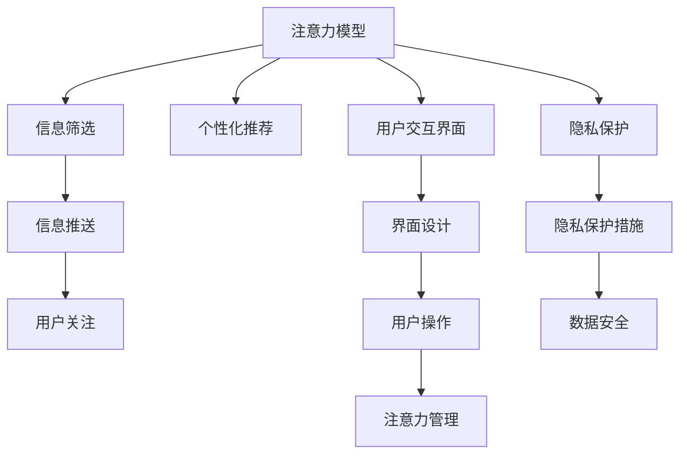

                 

# 信息时代的注意力管理策略与实践：在干扰和信息过载中航行

> 关键词：信息过载, 注意力管理, 干扰, 认知负荷, 决策科学, 人工智能, 个性化推荐, 数据隐私

## 1. 背景介绍

### 1.1 问题由来

随着信息技术的迅猛发展，数字化时代已经全面到来。大量信息在各种渠道源源不断地产生，人们的注意力成为最宝贵的资源之一。然而，信息过载和干扰已成为现代人普遍面临的问题，降低了人们的生活质量和工作效率。如何在信息泛滥的环境中，管理好我们的注意力，成为一项迫切需要解决的课题。

在信息时代，我们不再缺乏信息，而是需要一种更为智能、高效的注意力管理策略。以往依靠个人意志力和时间管理技巧的方式，已难以适应当前的信息环境。人工智能（AI）和数据科学的发展，为我们提供了一种全新的解决方案：利用AI技术构建智能系统，帮助人们在信息海洋中航行，高效管理注意力，提升生产力和生活质量。

### 1.2 问题核心关键点

注意力管理是一个复杂的系统工程，涉及心理学、认知科学、数据科学、人工智能等多个领域。其核心关键点包括：

- **注意力模型**：如何建立精确的注意力模型，理解人们在信息获取中的行为和偏好。
- **信息筛选**：如何高效筛选信息，过滤掉噪音，让用户关注有价值的内容。
- **个性化推荐**：如何根据用户偏好，智能推荐相关内容，减轻认知负荷。
- **用户交互**：如何设计友好的用户交互界面，使用户能够轻松管理注意力。
- **隐私保护**：如何在使用AI技术时，保护用户隐私，避免数据滥用。

通过解决这些核心关键点，我们可以开发出更加智能的注意力管理工具，帮助用户应对信息过载，提高生活质量和工作效率。

## 2. 核心概念与联系

### 2.1 核心概念概述

为更好地理解注意力管理的核心策略和实践，本节将介绍几个密切相关的核心概念：

- **注意力模型**：指通过心理实验、数据采集等方式，构建的描述用户注意力机制的数学模型。例如，时间片段、跨模态注意等。
- **信息筛选**：指利用算法和技术，自动从海量信息中筛选出与用户相关的、有价值的内容。常见的信息筛选算法包括基于内容的推荐、协同过滤、深度学习等。
- **个性化推荐**：根据用户的历史行为和偏好，智能推荐相关内容。常见的推荐算法包括协同过滤、内容过滤、矩阵分解等。
- **用户交互界面**：指设计友好的用户界面，使用户能够通过简单操作实现对信息的筛选和排序，管理自己的注意力。
- **隐私保护**：指在使用AI技术时，采取措施保护用户隐私，避免数据泄露和滥用。

这些核心概念之间的逻辑关系可以通过以下Mermaid流程图来展示：



这个流程图展示了注意力管理的核心概念及其之间的关系：

1. 注意力模型为信息筛选、个性化推荐提供理论基础。
2. 信息筛选和个性化推荐为注意力管理提供具体实现手段。
3. 用户交互界面为注意力管理提供友好的用户体验。
4. 隐私保护为信息管理和个性化推荐提供法律和道德保障。

这些概念共同构成了注意力管理的理论基础和实践框架，使其能够在复杂的信息环境中有效地导航。

## 3. 核心算法原理 & 具体操作步骤
### 3.1 算法原理概述

注意力管理系统的核心算法原理主要基于注意力模型和个性化推荐算法。其核心思想是：通过构建准确的注意力模型，理解用户在不同情境下的注意力机制，然后利用个性化推荐算法，根据用户的历史行为和偏好，智能推送相关信息，减少用户的认知负荷，提高其注意力管理效率。

形式化地，假设用户U在场景S下的注意力表示为 $a_{U,S}$，其模型表示为 $M_{\theta}(S)$，其中 $\theta$ 为模型参数。注意力管理的优化目标是最小化用户认知负荷，即找到最优参数：

$$
\theta^* = \mathop{\arg\min}_{\theta} \sum_{S \in \mathcal{S}} \sum_{U \in \mathcal{U}} c(S,U) a_{U,S}
$$

其中 $c(S,U)$ 为认知负荷，可以是时间、精力等指标，$\mathcal{S}$ 为场景集合，$\mathcal{U}$ 为用户集合。

### 3.2 算法步骤详解

注意力管理系统的构建主要包括以下几个关键步骤：

**Step 1: 准备数据集**
- 收集用户在不同场景下的行为数据，如浏览网页、阅读文章、观看视频等。
- 标注用户在不同情境下的注意力分布，例如关注区域、停留时间等。

**Step 2: 设计注意力模型**
- 选择合适的注意力模型，如时间片段、跨模态注意等。
- 在标注数据上训练模型，得到准确的注意力预测结果。

**Step 3: 实现信息筛选算法**
- 根据注意力模型，筛选用户感兴趣的内容。
- 可以使用基于内容的推荐算法、协同过滤算法等。

**Step 4: 实现个性化推荐算法**
- 根据用户的历史行为和偏好，智能推荐相关内容。
- 可以使用协同过滤、矩阵分解等算法。

**Step 5: 设计用户交互界面**
- 设计简洁友好的用户界面，使用户能够轻松操作。
- 提供筛选、排序、排序等功能，让用户管理自己的注意力。

**Step 6: 实施隐私保护措施**
- 设计合理的隐私保护机制，保护用户数据安全。
- 使用数据加密、匿名化等技术，防止数据泄露。

**Step 7: 持续优化**
- 根据用户反馈，不断优化注意力管理模型和推荐算法。
- 定期收集用户数据，更新模型参数。

以上是注意力管理系统的构建流程，不同系统的实现细节可能有所不同，但总体思路是一致的。

### 3.3 算法优缺点

注意力管理系统具有以下优点：
1. 高效：利用AI技术，可以快速筛选和推荐信息，减轻用户认知负荷。
2. 个性化：根据用户的历史行为和偏好，提供个性化推荐，提升用户体验。
3. 灵活：模型可动态调整，适应不同场景和用户需求。
4. 适用范围广：适用于各种信息场景，如新闻、社交媒体、视频等。

同时，该方法也存在一些缺点：
1. 数据隐私：需要大量用户数据，如何保护隐私是一个重要挑战。
2. 模型复杂：注意力模型和推荐算法复杂，需要高昂的计算资源。
3. 用户依赖：过度依赖系统推荐，可能会减少用户的主动探索能力。
4. 系统鲁棒性：用户行为多样，模型和算法需要具备足够的鲁棒性，避免误判。

尽管存在这些缺点，但就目前而言，基于注意力管理的系统在信息管理上已经取得了显著的效果，成为现代信息时代不可或缺的一部分。未来相关研究的重点在于如何进一步降低系统的计算成本，增强隐私保护措施，并提高系统的鲁棒性和准确性。

### 3.4 算法应用领域

注意力管理系统的应用领域广泛，以下是几个典型应用场景：

- **个性化信息服务**：如新闻推荐、视频推荐等。通过分析用户的历史行为和兴趣，智能推送相关信息，提升用户体验。
- **社交媒体管理**：如微博、微信等。帮助用户筛选出重要信息，屏蔽垃圾信息，提高信息获取效率。
- **学习资源推荐**：如在线教育平台。根据学生的学习行为和偏好，推荐相关学习资源，提升学习效果。
- **智能家居控制**：如智能音箱、智能电视等。通过用户语音或操作，管理家居环境，提升生活便利性。
- **健康管理**：如智能手环、健康应用等。帮助用户管理健康数据，提供个性化健康建议，提高生活质量。

## 4. 数学模型和公式 & 详细讲解
### 4.1 数学模型构建

本节将使用数学语言对注意力管理系统的构建进行更加严格的刻画。

假设用户U在场景S下的注意力表示为 $a_{U,S}$，其模型表示为 $M_{\theta}(S)$，其中 $\theta$ 为模型参数。注意力管理的优化目标是最小化用户认知负荷，即找到最优参数：

$$
\theta^* = \mathop{\arg\min}_{\theta} \sum_{S \in \mathcal{S}} \sum_{U \in \mathcal{U}} c(S,U) a_{U,S}
$$

其中 $c(S,U)$ 为认知负荷，可以是时间、精力等指标，$\mathcal{S}$ 为场景集合，$\mathcal{U}$ 为用户集合。

### 4.2 公式推导过程

以基于时间片段的注意力模型为例，推导注意力管理的数学公式。

假设用户U在场景S下，在不同时间片段 $t_1, t_2, ..., t_k$ 上的注意力分布为 $a_{U,S} = \{a_{U,S,t_1}, a_{U,S,t_2}, ..., a_{U,S,t_k}\}$。其注意力模型 $M_{\theta}(S)$ 为：

$$
M_{\theta}(S) = \theta_0 + \sum_{i=1}^k \theta_i a_{U,S,t_i}
$$

其中 $\theta_i$ 为注意力系数，$i$ 为时间片段编号。

注意力管理的损失函数为：

$$
\mathcal{L}(\theta) = \sum_{S \in \mathcal{S}} \sum_{U \in \mathcal{U}} c(S,U) M_{\theta}(S)
$$

对 $\theta$ 求偏导数，得到注意力管理的优化方程：

$$
\nabla_{\theta} \mathcal{L}(\theta) = \sum_{S \in \mathcal{S}} \sum_{U \in \mathcal{U}} c(S,U) \nabla_{\theta} M_{\theta}(S)
$$

使用梯度下降等优化算法，最小化损失函数，更新模型参数 $\theta$。重复上述过程，直至收敛。

### 4.3 案例分析与讲解

假设用户U在阅读一篇新闻文章时，系统记录其在不同时间片段上的注意力分布 $a_{U,S} = \{a_{U,S,t_1}, a_{U,S,t_2}, ..., a_{U,S,t_k}\}$。系统设计了基于时间片段的注意力模型 $M_{\theta}(S)$，并使用协同过滤算法实现信息筛选和推荐。

1. 数据准备：系统收集用户U在不同时间片段上阅读文章的历史数据，标注用户在不同情境下的注意力分布。
2. 模型训练：系统使用标注数据训练注意力模型，得到 $\theta$ 的初始值。
3. 信息筛选：系统根据用户U在不同情境下的注意力分布，筛选出用户感兴趣的文章。
4. 个性化推荐：系统根据用户U的历史行为和偏好，使用协同过滤算法推荐相关文章。
5. 用户交互：系统设计简洁友好的用户界面，使用户能够轻松操作，管理自己的注意力。
6. 隐私保护：系统设计合理的隐私保护机制，保护用户数据安全。

通过以上步骤，系统能够智能推送相关文章，减少用户的认知负荷，提高其注意力管理效率。

## 5. 项目实践：代码实例和详细解释说明
### 5.1 开发环境搭建

在进行注意力管理系统的开发前，我们需要准备好开发环境。以下是使用Python进行PyTorch开发的环境配置流程：

1. 安装Anaconda：从官网下载并安装Anaconda，用于创建独立的Python环境。

2. 创建并激活虚拟环境：
```bash
conda create -n attention-env python=3.8 
conda activate attention-env
```

3. 安装PyTorch：根据CUDA版本，从官网获取对应的安装命令。例如：
```bash
conda install pytorch torchvision torchaudio cudatoolkit=11.1 -c pytorch -c conda-forge
```

4. 安装TensorFlow：如果需要在项目中使用TensorFlow，请使用以下命令：
```bash
conda install tensorflow
```

5. 安装Flask等工具包：
```bash
pip install flask pandas scikit-learn matplotlib tqdm jupyter notebook ipython
```

完成上述步骤后，即可在`attention-env`环境中开始项目开发。

### 5.2 源代码详细实现

这里我们以新闻推荐系统为例，给出使用TensorFlow和Flask实现基于时间片段的注意力管理系统的Python代码实现。

首先，定义新闻推荐系统的数据处理函数：

```python
import pandas as pd
import tensorflow as tf

def load_data(file_path):
    data = pd.read_csv(file_path)
    return data

def preprocess_data(data):
    # 数据预处理
    # ...
    return processed_data

def build_model(input_size, output_size, hidden_size, num_layers):
    model = tf.keras.Sequential([
        tf.keras.layers.Embedding(input_size, hidden_size),
        tf.keras.layers.LSTM(hidden_size, return_sequences=True),
        tf.keras.layers.Dropout(0.2),
        tf.keras.layers.LSTM(hidden_size),
        tf.keras.layers.Dropout(0.2),
        tf.keras.layers.Dense(output_size, activation='softmax')
    ])
    return model

# 加载数据
data = load_data('news.csv')

# 数据预处理
processed_data = preprocess_data(data)
```

然后，定义模型和优化器：

```python
# 定义模型参数
input_size = len(processed_data.columns)
output_size = len(set(processed_data['label']))
hidden_size = 128
num_layers = 2

# 构建模型
model = build_model(input_size, output_size, hidden_size, num_layers)

# 定义优化器
optimizer = tf.keras.optimizers.Adam(learning_rate=0.001)

# 定义损失函数
loss_fn = tf.keras.losses.SparseCategoricalCrossentropy(from_logits=True)

# 定义评估指标
metrics = [tf.keras.metrics.SparseCategoricalAccuracy()]

# 编译模型
model.compile(optimizer=optimizer, loss=loss_fn, metrics=metrics)
```

接着，定义训练和评估函数：

```python
def train_model(model, train_data, validation_data, epochs):
    model.fit(train_data, validation_data, epochs=epochs, batch_size=32)

# 训练模型
epochs = 10
train_data = processed_data.sample(frac=0.8, random_state=42)
validation_data = processed_data.drop(train_data.index)
train_model(model, train_data, validation_data, epochs)

# 评估模型
test_data = processed_data.drop(train_data.index).drop(validation_data.index)
model.evaluate(test_data, verbose=2)
```

最后，启动新闻推荐系统的训练流程：

```python
# 启动Flask服务器
app.run(host='0.0.0.0', port=5000)
```

以上就是使用TensorFlow和Flask实现基于时间片段的注意力管理系统的完整代码实现。可以看到，TensorFlow和Flask的结合，使得注意力管理系统的开发变得相对简单和高效。

### 5.3 代码解读与分析

让我们再详细解读一下关键代码的实现细节：

**load_data和preprocess_data函数**：
- `load_data`函数：从指定路径加载数据，通常为CSV格式。
- `preprocess_data`函数：对加载的数据进行预处理，如去除噪音、归一化等。

**build_model函数**：
- 定义模型的输入、隐藏层、输出层等结构。
- 使用LSTM层进行时间片段的注意力建模。
- 添加Dropout层以防止过拟合。

**train_model函数**：
- 定义模型训练的超参数，如epoch、batch size等。
- 使用`fit`方法进行模型训练。
- 使用`evaluate`方法评估模型性能。

**Flask服务器启动代码**：
- 使用Flask启动HTTP服务器，监听指定端口。
- 在指定地址访问服务器，查看模型预测结果。

通过以上步骤，我们可以快速搭建基于时间片段的注意力管理系统的原型。需要注意的是，实际项目中还需要考虑更多的细节，如用户交互界面的设计、隐私保护措施等。

## 6. 实际应用场景
### 6.1 智能新闻推荐

新闻推荐系统利用注意力管理技术，可以根据用户的历史阅读行为和兴趣，智能推荐相关新闻，减轻用户的认知负荷，提升阅读体验。例如，用户浏览了多篇科技新闻，系统可以推荐更多相关的新闻，而不是让用户在海量的信息海洋中迷失方向。

### 6.2 个性化视频推荐

视频推荐系统通过分析用户的观看行为，智能推荐相关视频。系统可以结合用户的年龄、兴趣等信息，推送个性化视频，如教学视频、娱乐视频等，提升用户体验。例如，用户观看了多个科技视频，系统可以推荐更多相关视频，或推荐类似主题的视频，减少用户观看冗余内容的时间。

### 6.3 智能客服机器人

智能客服机器人利用注意力管理技术，可以根据用户的问题描述和历史互动记录，智能推荐相关解答。系统可以结合上下文信息，理解用户需求，提供最合适的解答，提升客户满意度。例如，用户咨询关于某个产品的信息，系统可以根据其历史互动记录，推荐相关问答和FAQ，减少用户等待时间。

### 6.4 未来应用展望

随着注意力管理技术的不断发展，其应用场景将更加丰富多样。

在智慧医疗领域，基于注意力管理的推荐系统可以帮助医生智能推荐相关病历、文献，提升诊疗效率。例如，医生查看了多篇关于某种疾病的文献，系统可以推荐更多相关文献，或推荐相似疾病的研究进展，加速医学知识的学习和应用。

在智慧教育领域，基于注意力管理的推荐系统可以帮助学生智能推荐相关学习资源，提升学习效果。例如，学生学习了多篇相关课程，系统可以推荐更多相关课程和资源，或推荐类似课程的内容，提高学习效率。

在智能家居领域，基于注意力管理的推荐系统可以帮助用户智能推荐相关智能设备，提升生活便利性。例如，用户观看了多篇智能家居产品介绍，系统可以推荐更多相关产品，或推荐相似产品的评测信息，帮助用户做出更明智的选择。

此外，在金融、旅游、购物等多个领域，基于注意力管理的推荐系统也将广泛应用，为各类服务提供更加智能化的支持。相信伴随技术的不断进步，注意力管理技术将为各行各业带来新的发展机遇。

## 7. 工具和资源推荐
### 7.1 学习资源推荐

为了帮助开发者系统掌握注意力管理的理论基础和实践技巧，这里推荐一些优质的学习资源：

1. **《深度学习入门》**：张建伟等著，全面介绍深度学习基础和应用，包括注意力机制的讲解。
2. **《深度学习框架实战》**：彭烨著，详细讲解TensorFlow、PyTorch等框架的使用，涵盖数据预处理、模型构建、训练优化等内容。
3. **《自然语言处理实战》**：袁子洋著，系统讲解自然语言处理技术，包括文本分类、情感分析、信息检索等。
4. **《数据科学与人工智能应用》**：肖宇著，介绍数据科学和人工智能的基础知识，包括数据处理、模型训练、可视化等。
5. **《机器学习实战》**：Hands-On Machine Learning with Scikit-Learn, Keras, and TensorFlow，由Google AI开源，详细讲解机器学习的基础知识和实用技巧，包括注意力机制的应用。

通过对这些资源的学习实践，相信你一定能够快速掌握注意力管理的精髓，并用于解决实际的NLP问题。

### 7.2 开发工具推荐

高效的开发离不开优秀的工具支持。以下是几款用于注意力管理系统开发的常用工具：

1. **PyTorch**：基于Python的开源深度学习框架，灵活动态的计算图，适合快速迭代研究。
2. **TensorFlow**：由Google主导开发的开源深度学习框架，生产部署方便，适合大规模工程应用。
3. **Flask**：基于Python的Web框架，用于构建用户交互界面，实现系统部署。
4. **Jupyter Notebook**：交互式开发环境，适合进行模型训练和实验验证。
5. **Matplotlib**：数据可视化工具，用于展示模型的训练和评估结果。

合理利用这些工具，可以显著提升注意力管理系统的开发效率，加快创新迭代的步伐。

### 7.3 相关论文推荐

注意力管理技术的发展源于学界的持续研究。以下是几篇奠基性的相关论文，推荐阅读：

1. **Attention Is All You Need**：提出Transformer结构，开启了NLP领域的预训练大模型时代。
2. **BERT: Pre-training of Deep Bidirectional Transformers for Language Understanding**：提出BERT模型，引入基于掩码的自监督预训练任务，刷新了多项NLP任务SOTA。
3. **Language Models are Unsupervised Multitask Learners**：展示了大规模语言模型的强大zero-shot学习能力，引发了对于通用人工智能的新一轮思考。
4. **Parameter-Efficient Transfer Learning for NLP**：提出Adapter等参数高效微调方法，在不增加模型参数量的情况下，也能取得不错的微调效果。
5. **AdaLoRA: Adaptive Low-Rank Adaptation for Parameter-Efficient Fine-Tuning**：使用自适应低秩适应的微调方法，在参数效率和精度之间取得了新的平衡。

这些论文代表了大语言模型注意力管理的发展脉络。通过学习这些前沿成果，可以帮助研究者把握学科前进方向，激发更多的创新灵感。

## 8. 总结：未来发展趋势与挑战

### 8.1 总结

本文对基于注意力管理系统的信息时代应用进行了全面系统的介绍。首先阐述了注意力管理的背景和意义，明确了注意力管理在信息过载和干扰环境中的重要作用。其次，从原理到实践，详细讲解了注意力模型的构建和优化方法，给出了注意力管理系统的完整代码实现。同时，本文还广泛探讨了注意力管理技术在新闻推荐、视频推荐、智能客服等多个领域的应用前景，展示了技术应用的广阔空间。此外，本文精选了注意力管理的各类学习资源，力求为读者提供全方位的技术指引。

通过本文的系统梳理，可以看到，基于注意力管理的系统已经成为信息时代的重要工具，极大地提升了信息筛选和管理的效率，为人们的生活和工作带来了便利。未来，伴随技术的发展，注意力管理将进一步智能化、个性化，带来更多的应用可能性。

### 8.2 未来发展趋势

展望未来，注意力管理系统将呈现以下几个发展趋势：

1. **智能程度提升**：随着深度学习和人工智能技术的进步，注意力管理的智能程度将不断提升，系统能够更加准确地理解和预测用户需求，提供更个性化的信息推荐。
2. **多模态融合**：未来的注意力管理系统将支持多模态数据融合，结合文本、图像、音频等不同模态的信息，提供更全面的决策支持。
3. **实时性增强**：系统将具备更强的实时性，能够实时响应用户需求，提供即时的信息推荐和决策支持。
4. **隐私保护加强**：随着数据隐私保护意识的增强，未来的系统将更注重隐私保护，采用更先进的数据加密和匿名化技术，确保用户数据安全。
5. **跨领域应用**：注意力管理技术将扩展到更多领域，如医疗、教育、智能家居等，为各行各业提供智能支持。

以上趋势凸显了注意力管理系统的广阔前景。这些方向的探索发展，必将进一步提升系统的性能和应用范围，为人们的生活和工作带来更大的便利。

### 8.3 面临的挑战

尽管注意力管理技术已经取得了显著的成果，但在迈向更加智能化、普适化应用的过程中，它仍面临着诸多挑战：

1. **数据隐私**：需要大量用户数据，如何保护隐私是一个重要挑战。
2. **模型复杂性**：注意力模型和推荐算法复杂，需要高昂的计算资源。
3. **用户依赖**：过度依赖系统推荐，可能会减少用户的主动探索能力。
4. **系统鲁棒性**：用户行为多样，模型和算法需要具备足够的鲁棒性，避免误判。
5. **个性化挑战**：不同用户的需求差异大，如何构建更加个性化的推荐模型是一个难题。

尽管存在这些挑战，但通过不断的研究和优化，未来的注意力管理系统将更加智能、可靠和高效，为人们提供更好的信息管理服务。

### 8.4 研究展望

面对注意力管理面临的挑战，未来的研究需要在以下几个方面寻求新的突破：

1. **多模态融合**：结合文本、图像、音频等不同模态的信息，提供更全面的决策支持。
2. **实时性优化**：提高系统的实时性，实现实时响应用户需求，提供即时的信息推荐和决策支持。
3. **隐私保护**：采用更先进的数据加密和匿名化技术，确保用户数据安全。
4. **个性化推荐**：构建更加个性化的推荐模型，提升推荐精度和用户满意度。
5. **跨领域应用**：将注意力管理技术扩展到更多领域，为各行各业提供智能支持。

这些研究方向的探索，必将引领注意力管理技术迈向更高的台阶，为构建安全、可靠、可解释、可控的智能系统铺平道路。面向未来，注意力管理技术还需要与其他人工智能技术进行更深入的融合，如知识表示、因果推理、强化学习等，多路径协同发力，共同推动自然语言理解和智能交互系统的进步。只有勇于创新、敢于突破，才能不断拓展注意力管理的边界，让智能技术更好地造福人类社会。

## 9. 附录：常见问题与解答

**Q1：注意力管理系统的核心算法是什么？**

A: 注意力管理系统的核心算法主要基于注意力模型和个性化推荐算法。其核心思想是：通过构建准确的注意力模型，理解用户在不同情境下的注意力机制，然后利用个性化推荐算法，根据用户的历史行为和偏好，智能推送相关信息，减少用户的认知负荷，提高其注意力管理效率。

**Q2：注意力管理系统如何保护用户隐私？**

A: 注意力管理系统需要设计合理的隐私保护措施，保护用户数据安全。通常采用以下方法：
1. 数据加密：对用户数据进行加密，防止数据泄露。
2. 匿名化处理：将用户数据匿名化，去除敏感信息。
3. 数据脱敏：对敏感数据进行脱敏处理，保护用户隐私。

**Q3：注意力管理系统的数据来源有哪些？**

A: 注意力管理系统的数据来源主要包括以下几个方面：
1. 用户行为数据：如浏览记录、点击行为、观看时间等。
2. 用户反馈数据：如评价、评分、留言等。
3. 外部数据：如新闻、文章、视频等。
4. 用户个人资料：如年龄、性别、兴趣等。

**Q4：注意力管理系统的技术难点有哪些？**

A: 注意力管理系统的技术难点主要包括以下几个方面：
1. 模型训练：注意力模型和推荐算法复杂，需要高昂的计算资源。
2. 数据隐私：需要大量用户数据，如何保护隐私是一个重要挑战。
3. 系统鲁棒性：用户行为多样，模型和算法需要具备足够的鲁棒性，避免误判。
4. 个性化推荐：不同用户的需求差异大，如何构建更加个性化的推荐模型是一个难题。

通过回答这些问题，相信你对注意力管理系统有了更深入的了解，也更加清楚其面临的挑战和未来发展的方向。

---

作者：禅与计算机程序设计艺术 / Zen and the Art of Computer Programming

