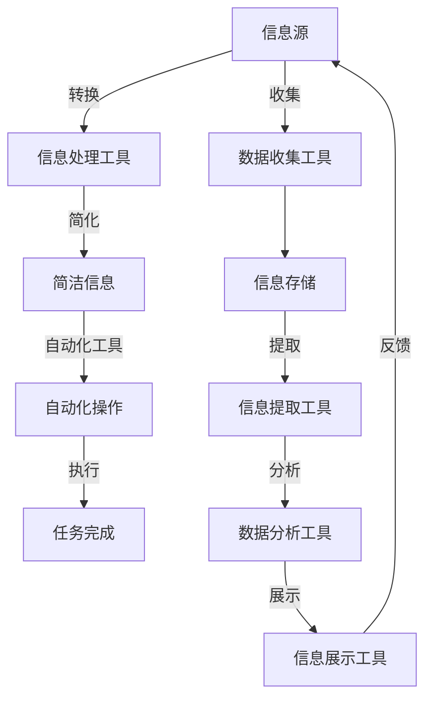

                 

# 信息简化的工具和自动化实践：利用技术简化你的生活和工作

> 关键词：信息简化,自动化,技术应用,生活和工作效率,人工智能,大数据,自动化工具,工作流优化

## 1. 背景介绍

在现代社会，信息量呈爆炸性增长，我们每天都需要面对海量的数据和任务，这不仅增加了工作的复杂性，也消耗了我们宝贵的精力和时间。信息过载不仅影响了个人的生活质量，也对企业的运营效率提出了严峻挑战。为了应对这一问题，信息简化和自动化技术应运而生，帮助我们在繁杂的信息海洋中游刃有余，高效地处理和利用信息资源，从而提高生活和工作效率。

## 2. 核心概念与联系

### 2.1 核心概念概述

- **信息简化（Information Simplification）**：指通过自动化工具和技术手段，将复杂的信息转化为简洁、易于理解和操作的形式，从而减少信息处理的时间和成本。

- **自动化（Automation）**：利用计算机技术和程序化方法，自动执行一系列繁琐、重复性的任务，减少人工干预，提升工作效率。

- **技术应用（Technology Application）**：将信息技术与实际工作场景相结合，提高问题解决效率，优化工作流程。

- **生活和工作效率（Efficiency of Life and Work）**：通过简化信息和自动化操作，提升个人和组织的生活和工作效率，实现资源的最优配置。

### 2.2 核心概念原理和架构的 Mermaid 流程图



## 3. 核心算法原理 & 具体操作步骤

### 3.1 算法原理概述

信息简化和自动化通常涉及到数据预处理、机器学习、自然语言处理(NLP)、计算机视觉等技术。其核心思想是通过自动化工具和技术，对原始信息进行分析和转换，使之成为更加简洁、易于操作的形式，进而提升信息处理效率。

具体而言，信息简化的过程可以分解为以下几个步骤：

1. **数据收集**：从各种信息源（如数据库、网络、传感器等）中收集原始数据。
2. **信息预处理**：对原始数据进行清洗、去重、格式转换等处理，使之适合后续分析。
3. **信息提取**：使用NLP技术从文本中提取关键信息，如实体识别、情感分析、主题分类等。
4. **信息分析**：利用机器学习算法对提取的信息进行分析，发现数据背后的模式和规律。
5. **信息简化**：将分析结果转化为简洁、易于理解的图形、图表或报告。
6. **信息应用**：将简化的信息应用于实际任务中，如决策支持、流程自动化、客户服务等领域。

### 3.2 算法步骤详解

#### 3.2.1 数据收集

数据收集是信息简化的第一步，也是后续处理的基础。这一步通常涉及以下技术：

- **爬虫技术**：自动从网络中抓取所需信息。
- **API接口**：通过调用外部API获取结构化数据。
- **传感器数据**：通过传感器采集实时数据。

#### 3.2.2 信息预处理

信息预处理的目标是提升数据的质量和可用性，包括：

- **数据清洗**：去除重复、错误、缺失的数据。
- **数据转换**：将数据格式转换为统一的格式。
- **数据规整**：按照一定的规则对数据进行规整，使之一致。

#### 3.2.3 信息提取

信息提取是从文本中提取关键信息的过程，常用技术包括：

- **实体识别**：识别文本中的实体（人名、地点、组织等）。
- **情感分析**：分析文本的情感倾向。
- **主题分类**：识别文本的主题。

#### 3.2.4 信息分析

信息分析是通过机器学习算法对提取的信息进行深层次的挖掘和分析，常用的算法包括：

- **分类算法**：如决策树、随机森林、SVM等。
- **聚类算法**：如K-means、层次聚类等。
- **回归算法**：如线性回归、岭回归等。

#### 3.2.5 信息简化

信息简化的目的是将分析结果转化为易于理解的形式，常用的方法包括：

- **数据可视化**：如折线图、柱状图、热力图等。
- **自然语言生成**：将数据分析结果生成简洁的报告或摘要。
- **交互式报表**：通过交互式报表，用户可以动态地查看和操作数据分析结果。

#### 3.2.6 信息应用

信息应用是将简化的信息应用于实际任务的过程，常用的技术包括：

- **决策支持**：通过数据分析结果辅助决策。
- **流程自动化**：将自动化工具应用于工作流程，减少人工干预。
- **客户服务**：通过信息分析优化客户服务流程。

### 3.3 算法优缺点

#### 3.3.1 优点

- **效率提升**：自动化工具可以高效地处理大量数据，显著提升信息处理速度。
- **成本降低**：减少了人工干预和繁琐的手工操作，降低了人力成本。
- **准确性提高**：机器学习算法可以避免人为错误，提高信息处理的准确性。
- **数据驱动**：基于数据的分析结果，可以提供更科学、合理的决策依据。

#### 3.3.2 缺点

- **数据质量依赖**：自动化工具的效果很大程度上依赖于输入数据的质量。
- **技术门槛**：需要掌握一定的技术知识，才能有效应用自动化工具。
- **模型复杂性**：复杂的模型可能导致过拟合或欠拟合，需要谨慎选择和使用。
- **隐私和安全**：处理敏感信息时，需要考虑数据隐私和安全性问题。

### 3.4 算法应用领域

信息简化和自动化技术在多个领域都有广泛应用，包括但不限于：

- **金融行业**：通过自动化工具分析交易数据，优化投资决策。
- **医疗健康**：利用数据分析结果辅助疾病诊断和治疗。
- **制造业**：通过自动化工具提高生产效率，优化供应链管理。
- **物流行业**：通过数据分析和自动化技术优化物流网络，减少成本。
- **政府服务**：通过数据驱动的决策支持系统，提升政府服务效率。

## 4. 数学模型和公式 & 详细讲解 & 举例说明

### 4.1 数学模型构建

假设有一组数据集 $D = \{(x_1, y_1), (x_2, y_2), \ldots, (x_n, y_n)\}$，其中 $x_i$ 是输入特征，$y_i$ 是输出标签。我们的目标是建立一个模型 $f(x)$，使得 $f(x_i)$ 能够预测 $y_i$。

常见的数学模型包括：

- **线性回归模型**：$y = \beta_0 + \beta_1 x_1 + \ldots + \beta_k x_k$

- **决策树模型**：$y = f(x, T)$，其中 $T$ 是决策树。

- **神经网络模型**：$f(x) = \sigma(Wx + b)$，其中 $W$ 是权重矩阵，$b$ 是偏置向量，$\sigma$ 是激活函数。

### 4.2 公式推导过程

以线性回归模型为例，其目标是最小化预测值与真实值之间的平方误差：

$$
\min_{\beta} \sum_{i=1}^n (y_i - f(x_i))^2
$$

利用梯度下降算法，可以得到 $\beta$ 的更新公式：

$$
\beta \leftarrow \beta - \eta \nabla_{\beta} \sum_{i=1}^n (y_i - f(x_i))^2
$$

其中 $\eta$ 是学习率，$\nabla_{\beta} \sum_{i=1}^n (y_i - f(x_i))^2$ 是损失函数对 $\beta$ 的梯度。

### 4.3 案例分析与讲解

#### 4.3.1 线性回归案例

假设我们有一组房价数据，目标是预测新房子的价格。我们可以使用线性回归模型，将房子的面积、房间数量等特征作为输入，预测房价。

- **数据预处理**：对数据进行清洗、去重、归一化等处理。
- **模型训练**：使用梯度下降算法训练线性回归模型。
- **模型评估**：使用交叉验证等方法评估模型性能。
- **模型应用**：将训练好的模型应用于新房子的价格预测。

#### 4.3.2 决策树案例

假设我们需要预测一个病人的疾病类型。我们可以使用决策树模型，将病人的年龄、性别、症状等特征作为输入，预测疾病类型。

- **数据预处理**：对数据进行清洗、去重、归一化等处理。
- **模型训练**：使用决策树算法训练模型。
- **模型评估**：使用准确率、召回率等指标评估模型性能。
- **模型应用**：将训练好的模型应用于新病人的疾病预测。

## 5. 项目实践：代码实例和详细解释说明

### 5.1 开发环境搭建

在进行项目实践前，我们需要准备好开发环境。以下是使用Python进行Scikit-learn开发的环境配置流程：

1. 安装Anaconda：从官网下载并安装Anaconda，用于创建独立的Python环境。

2. 创建并激活虚拟环境：
```bash
conda create -n sklearn-env python=3.8 
conda activate sklearn-env
```

3. 安装Scikit-learn：
```bash
conda install scikit-learn
```

4. 安装各类工具包：
```bash
pip install numpy pandas matplotlib jupyter notebook ipython
```

完成上述步骤后，即可在`sklearn-env`环境中开始项目实践。

### 5.2 源代码详细实现

以下是使用Scikit-learn进行线性回归的Python代码实现：

```python
import pandas as pd
from sklearn.model_selection import train_test_split
from sklearn.linear_model import LinearRegression
from sklearn.metrics import mean_squared_error

# 加载数据
data = pd.read_csv('house_prices.csv')

# 数据预处理
X = data[['area', 'rooms']]
y = data['price']
X_train, X_test, y_train, y_test = train_test_split(X, y, test_size=0.2, random_state=42)

# 模型训练
model = LinearRegression()
model.fit(X_train, y_train)

# 模型评估
y_pred = model.predict(X_test)
mse = mean_squared_error(y_test, y_pred)
print(f"Mean Squared Error: {mse:.2f}")

# 模型应用
new_house = pd.DataFrame({area: 120, rooms: 3})
predicted_price = model.predict(new_house)
print(f"Predicted Price: {predicted_price:.2f}")
```

### 5.3 代码解读与分析

让我们再详细解读一下关键代码的实现细节：

**数据加载**：
- 使用pandas库加载数据集，并进行基本预处理。

**模型训练**：
- 使用Scikit-learn库中的LinearRegression类创建线性回归模型。
- 使用train_test_split函数将数据集划分为训练集和测试集。
- 使用fit方法训练模型。

**模型评估**：
- 使用predict方法对测试集进行预测，并计算均方误差。

**模型应用**：
- 创建新的数据行，进行预测。

## 6. 实际应用场景

### 6.1 企业数据管理

企业每天产生大量的数据，包括交易数据、客户数据、运营数据等。通过信息简化和自动化技术，企业可以高效地管理这些数据，实现数据驱动的决策。

- **数据清洗**：去除重复、错误的数据，确保数据质量。
- **数据可视化**：使用可视化工具展示数据趋势，帮助管理层做出决策。
- **数据挖掘**：通过机器学习算法，挖掘数据背后的规律，优化业务流程。

### 6.2 智能客服

智能客服系统能够自动回答客户的常见问题，提升客户满意度。通过信息简化和自动化技术，智能客服系统可以更加智能地理解客户需求，提供精准的解决方案。

- **意图识别**：通过自然语言处理技术，识别客户意图。
- **上下文理解**：分析客户对话历史，理解上下文信息。
- **知识库查询**：自动查询知识库，提供最佳答案。

### 6.3 自动化运维

自动化运维系统能够自动监控和维护IT基础设施，减少人工干预，提高系统稳定性。通过信息简化和自动化技术，运维系统可以更加高效地处理告警和故障。

- **告警分析**：通过数据分析技术，分析告警数据，定位问题。
- **故障预测**：使用机器学习算法，预测系统故障，提前处理。
- **操作自动化**：自动执行运维操作，减少人工干预。

### 6.4 未来应用展望

随着技术的发展，信息简化和自动化技术将在更多领域得到应用，为个人和组织带来新的变革。

- **智能家居**：通过自动化系统，提升家居设备的智能化水平，提高生活便利性。
- **智能交通**：通过自动化技术，优化交通流量，提升交通安全和效率。
- **智能健康**：通过自动化系统，监测健康数据，提供个性化健康建议。
- **智能办公**：通过自动化工具，优化办公流程，提高工作效率。

## 7. 工具和资源推荐

### 7.1 学习资源推荐

为了帮助开发者掌握信息简化和自动化技术，这里推荐一些优质的学习资源：

1. 《Python数据科学手册》：全面介绍Python数据科学库和工具的使用方法，包括Scikit-learn、Pandas、Matplotlib等。

2. 《机器学习实战》：介绍机器学习的基本概念和算法实现，涵盖线性回归、决策树、SVM等。

3. 《自然语言处理综论》：讲解自然语言处理的基本概念和常用技术，包括词袋模型、TF-IDF等。

4. Kaggle在线学习平台：提供大量数据集和机器学习竞赛，帮助开发者实践和提升技能。

5. Google Cloud AI Hub：提供机器学习模型和工具，帮助开发者快速构建和部署AI应用。

通过对这些资源的学习实践，相信你一定能够掌握信息简化和自动化技术的精髓，并将其应用于实际问题中。

### 7.2 开发工具推荐

高效的开发离不开优秀的工具支持。以下是几款用于信息简化和自动化开发的常用工具：

1. Python：基于Python的开源编程语言，具有丰富的第三方库和工具支持。

2. Jupyter Notebook：交互式的编程环境，支持代码执行、数据可视化、报告生成等。

3. Scikit-learn：机器学习库，提供多种算法实现，包括分类、回归、聚类等。

4. Pandas：数据处理库，提供高效的数据操作和分析功能。

5. Matplotlib：数据可视化库，支持绘制各类图表。

6. TensorFlow：深度学习框架，支持神经网络模型的构建和训练。

合理利用这些工具，可以显著提升信息简化和自动化任务的开发效率，加快创新迭代的步伐。

### 7.3 相关论文推荐

信息简化和自动化技术的发展源于学界的持续研究。以下是几篇奠基性的相关论文，推荐阅读：

1. 《Simplifying Complex Information with Deep Learning》：提出使用深度学习技术简化复杂信息的方法。

2. 《Automating the Workflow: A Survey of Workflows in Machine Learning》：介绍自动化工作流程的技术和应用。

3. 《Information Simplification in Natural Language Processing》：探讨自然语言处理中的信息简化技术。

4. 《Semi-Supervised Learning with Graph Neural Networks》：介绍图神经网络在信息分析和简化的应用。

这些论文代表了大规模数据处理和自动化技术的最新进展，通过学习这些前沿成果，可以帮助研究者把握学科前进方向，激发更多的创新灵感。

## 8. 总结：未来发展趋势与挑战

### 8.1 总结

本文对信息简化和自动化技术进行了全面系统的介绍。首先阐述了信息简化和自动化技术的研究背景和意义，明确了它们在提升生活和工作效率方面的独特价值。其次，从原理到实践，详细讲解了信息简化和自动化的数学模型、算法步骤和具体操作步骤，给出了信息简化和自动化任务开发的完整代码实例。同时，本文还广泛探讨了信息简化和自动化技术在多个领域的应用前景，展示了它们在优化决策、提升效率、降低成本等方面的巨大潜力。最后，本文精选了信息简化和自动化技术的各类学习资源和开发工具，力求为读者提供全方位的技术指引。

通过本文的系统梳理，可以看到，信息简化和自动化技术正在成为提升生活和工作效率的重要手段，极大地拓展了数据分析和自动化处理的边界，为个人和组织带来了巨大的效益。未来，伴随技术的发展和应用的深化，信息简化和自动化技术必将在更广泛的领域发挥作用，推动社会和经济的进步。

### 8.2 未来发展趋势

展望未来，信息简化和自动化技术将呈现以下几个发展趋势：

1. **智能化水平提升**：随着人工智能技术的不断发展，信息简化和自动化系统将具备更强的智能处理能力，能够自动优化数据处理流程，提高效率。

2. **跨领域融合**：信息简化和自动化技术将与其他技术（如区块链、物联网、大数据等）进行更深入的融合，形成多模态信息处理系统。

3. **个性化定制**：通过大数据和机器学习技术，信息简化和自动化系统将能够实现更加个性化的定制服务，满足不同用户的需求。

4. **实时化处理**：随着实时计算和流式处理技术的发展，信息简化和自动化系统将能够实现实时数据处理和分析，提高决策速度。

5. **云平台集成**：信息简化和自动化技术将更加紧密地集成到云计算平台中，提供按需服务和弹性计算资源。

以上趋势凸显了信息简化和自动化技术的广阔前景。这些方向的探索发展，必将进一步提升信息处理效率，推动智能化时代的到来。

### 8.3 面临的挑战

尽管信息简化和自动化技术已经取得了显著进展，但在迈向更加智能化、普适化应用的过程中，仍面临诸多挑战：

1. **数据隐私和安全**：在处理敏感数据时，如何保障数据隐私和安全是一个重要问题。

2. **技术复杂性**：信息简化和自动化系统往往涉及多种技术和工具，需要开发者具备较高的技术水平。

3. **跨领域适应性**：信息简化和自动化技术在不同领域的应用效果存在差异，如何提高跨领域的适应性是一个难点。

4. **资源限制**：信息简化和自动化系统对计算资源和存储资源的需求较高，如何在资源受限的情况下实现高效处理是一个挑战。

5. **模型可解释性**：信息简化和自动化系统中的机器学习模型通常缺乏可解释性，如何提高模型的可解释性是一个研究方向。

这些挑战需要我们在技术、应用、管理等多个层面进行全面思考和应对，才能推动信息简化和自动化技术的健康发展。

### 8.4 研究展望

面对信息简化和自动化技术所面临的挑战，未来的研究需要在以下几个方面寻求新的突破：

1. **隐私保护技术**：开发更加安全可靠的数据处理和传输技术，保护用户隐私。

2. **跨领域知识图谱**：构建跨领域的知识图谱，提高信息简化和自动化系统的适应性。

3. **实时计算技术**：发展实时计算和流式处理技术，支持信息系统的实时化处理。

4. **模型可解释性**：探索可解释性较强的模型，提高信息处理系统的透明度和可信度。

5. **云计算优化**：优化云平台上的信息处理流程，提高资源利用率和系统效率。

6. **智能辅助设计**：开发智能辅助设计工具，提高信息简化和自动化系统的灵活性和可定制性。

这些研究方向将推动信息简化和自动化技术的不断进步，为构建智能、高效、安全的信息处理系统铺平道路。面向未来，我们应积极探索新技术和方法，推动信息简化和自动化技术的全面应用和发展。

## 9. 附录：常见问题与解答

**Q1：信息简化和自动化技术是否适用于所有数据类型？**

A: 信息简化和自动化技术主要适用于结构化数据和文本数据，但对于非结构化数据（如音频、视频等），需要结合其他技术进行处理。对于复杂的图像和视频数据，通常需要结合计算机视觉技术进行处理。

**Q2：如何选择合适的数据处理方法？**

A: 选择合适的数据处理方法需要考虑数据的类型、大小、分布等因素。一般来说，对于数值型数据，可以使用统计分析、回归等方法；对于文本数据，可以使用自然语言处理技术；对于图像数据，可以使用计算机视觉技术。同时，需要根据具体应用场景选择合适的方法。

**Q3：自动化工具在实际应用中需要注意哪些问题？**

A: 自动化工具在实际应用中需要注意以下问题：

- **数据质量**：自动化工具的效果很大程度上依赖于输入数据的质量，需要确保数据的准确性和完整性。
- **系统集成**：自动化工具需要与其他系统进行集成，确保数据的一致性和同步。
- **模型更新**：自动化工具中的模型需要定期更新，以适应数据分布的变化。
- **用户培训**：自动化工具需要用户进行一定的培训，掌握其使用方法和注意事项。

这些问题的解决，需要我们在设计和实现自动化工具时进行全面考虑，确保其稳定性和可靠性。

**Q4：信息简化和自动化技术在未来会有哪些新的突破？**

A: 信息简化和自动化技术在未来可能会有以下几个新的突破：

- **智能决策支持系统**：结合人工智能技术，实现更加智能的决策支持系统，提高决策的准确性和效率。
- **多模态信息融合**：实现多模态数据（如文本、图像、视频等）的综合处理和分析，提升信息处理能力。
- **自适应系统**：开发自适应的信息处理系统，能够根据环境变化自动调整处理策略。
- **个性化推荐系统**：结合用户行为数据和个性化需求，提供更加精准的推荐服务。
- **联邦学习**：通过联邦学习技术，保护数据隐私的同时，实现分布式数据处理。

这些突破将进一步提升信息处理系统的智能化水平，推动智能化时代的到来。

---

作者：禅与计算机程序设计艺术 / Zen and the Art of Computer Programming

