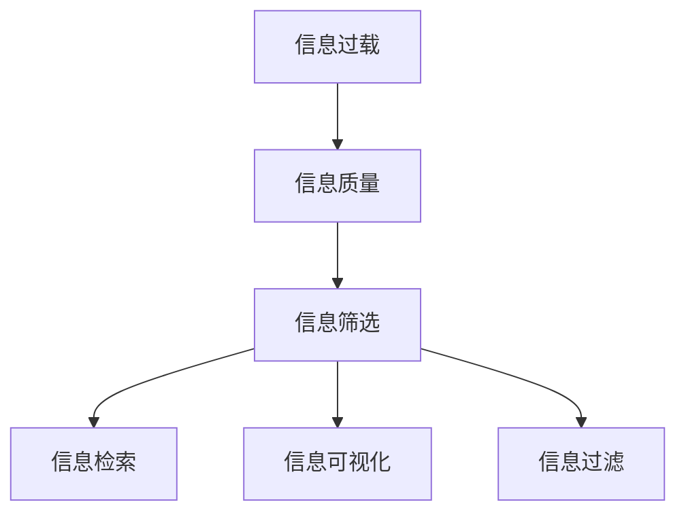

                 

# 信息过载与信息筛选策略：在信息洪流中找到有价值的信息

在当今信息爆炸的时代，我们每天都会接触到海量的信息，从新闻媒体到社交网络，从电子邮件到搜索引擎，信息的流速和规模都在飞速增长。尽管如此，我们获取信息的效率并没有随之提升，反而常常陷入信息过载的困境中。信息过载不仅浪费了我们的时间，也降低了我们的决策质量。本文旨在探讨信息过载的问题，并提出一系列实用的信息筛选策略，帮助我们在信息洪流中找到有价值的信息。

## 1. 背景介绍

### 1.1 问题由来
随着互联网的普及和数字技术的进步，信息获取的门槛变得越来越低。人们几乎可以在任何时间、任何地点获取几乎任何信息。然而，信息量的激增并没有带来信息质量的相应提升。越来越多的研究表明，人们面临着信息过载的困境，即在面对海量信息时，难以识别和筛选出真正有价值的信息。

信息过载不仅对个人造成了困扰，也对企业和组织带来了挑战。在商业决策、市场分析、知识管理等方面，信息的数量和质量都直接影响着决策的准确性和效率。因此，如何有效地筛选和利用信息，成为了一个迫切需要解决的问题。

### 1.2 问题核心关键点
信息过载的核心在于信息量的爆炸性增长和信息质量的参差不齐。尽管如此，通过有效的信息筛选策略，我们可以大幅提高信息获取和利用的效率。这些策略包括但不限于：

- 自动化信息筛选工具：利用算法和机器学习技术，对信息进行自动化的分类、聚类和筛选。
- 人工信息过滤：通过专家和用户的介入，对信息进行人工审核和筛选。
- 信息可视化：将信息以图表、地图等形式展示，帮助人们更直观地理解和筛选信息。
- 信息检索技术：通过自然语言处理和信息检索技术，提高信息检索的准确性和效率。

这些策略可以单独使用，也可以结合使用，共同提升信息筛选和利用的效率。

## 2. 核心概念与联系

### 2.1 核心概念概述

为了更好地理解信息筛选策略，我们需要了解几个核心概念：

- **信息过载**：指在单位时间内信息量远远超过人们处理能力的现象。
- **信息质量**：指信息的相关性、准确性、及时性、完整性、可信度等指标的综合评价。
- **信息筛选**：指从海量信息中筛选出有用、有价值的信息的过程。
- **信息检索**：指通过特定算法或技术，从数据库或网络中查找需要的信息。
- **信息可视化**：指将信息以直观的图表、地图等形式展示，便于理解和分析。
- **信息过滤**：指通过特定规则或算法，对信息进行过滤和筛选。

这些概念之间的逻辑关系可以通过以下Mermaid流程图来展示：



这个流程图展示了一系列关键概念之间的联系：

1. 信息过载是问题的核心，需要通过信息质量来评价。
2. 信息筛选是解决问题的关键，通过筛选出有用信息来应对过载。
3. 信息检索和信息可视化都是信息筛选的重要工具。
4. 信息过滤是一种自动化信息筛选方法，通过特定规则进行筛选。

## 3. 核心算法原理 & 具体操作步骤

### 3.1 算法原理概述

信息筛选的本质是对海量信息进行有针对性的处理，找出与用户需求或业务目标相关的内容。这一过程通常涉及自动化和人工的结合，通过机器学习、自然语言处理等技术手段，对信息进行分类、聚类、过滤等操作。

### 3.2 算法步骤详解

以下是一个基本的自动化信息筛选算法步骤：

1. **数据收集**：收集需要筛选的信息源，如新闻网站、社交媒体、邮件等。
2. **预处理**：对收集到的信息进行清洗和预处理，如去除噪声、统一格式等。
3. **特征提取**：从预处理后的信息中提取关键特征，如关键词、主题、情感等。
4. **模型训练**：使用机器学习模型对信息进行训练，如分类模型、聚类模型、推荐模型等。
5. **信息筛选**：根据训练好的模型对信息进行筛选，选择符合特定标准的内容。
6. **结果展示**：将筛选后的信息展示给用户，可以是列表、图表、文章等形式。
7. **反馈迭代**：根据用户反馈，不断优化模型，提高筛选效果。

### 3.3 算法优缺点

自动化信息筛选算法具有以下优点：

- 高效性：能够快速处理大量信息，提高筛选效率。
- 可扩展性：可以轻松集成到各种信息源和应用场景中。
- 客观性：基于数据驱动的筛选结果，较少受到主观因素影响。

然而，自动化算法也存在一些缺点：

- 数据偏差：如果训练数据存在偏差，筛选结果也可能出现偏差。
- 误判率：由于算法本身的局限性，可能会出现误判的情况。
- 复杂性：需要大量的数据和计算资源进行模型训练和优化。

### 3.4 算法应用领域

自动化信息筛选算法在多个领域中得到了广泛应用，例如：

- **新闻推荐**：基于用户的阅读历史和兴趣，推荐相关新闻文章。
- **社交媒体分析**：从社交媒体中筛选出用户关注的热门话题和趋势。
- **广告投放**：根据用户的在线行为和兴趣爱好，推荐个性化的广告内容。
- **企业知识管理**：从大量文档和报告中筛选出对决策有帮助的内容。
- **舆情监测**：从网络舆情中筛选出与企业形象和品牌相关的内容。

## 4. 数学模型和公式 & 详细讲解 & 举例说明

### 4.1 数学模型构建

信息筛选的数学模型通常包括分类模型、聚类模型、推荐模型等。这里以分类模型为例，进行详细讲解。

假设我们有一个二分类任务，即从信息源中筛选出正面或负面的内容。设 $x$ 为输入的文本，$y$ 为分类标签，模型为 $M_{\theta}$。分类模型的目标是最小化损失函数 $\mathcal{L}$，即：

$$
\mathcal{L} = \frac{1}{N}\sum_{i=1}^N L(y_i, M_{\theta}(x_i))
$$

其中 $N$ 为样本数量，$L$ 为损失函数。

### 4.2 公式推导过程

以逻辑回归模型为例，其损失函数为：

$$
L(y_i, M_{\theta}(x_i)) = \log(1 + \exp(-y_i M_{\theta}(x_i)))
$$

则分类模型的总损失函数为：

$$
\mathcal{L} = \frac{1}{N}\sum_{i=1}^N \log(1 + \exp(-y_i M_{\theta}(x_i)))
$$

通过梯度下降等优化算法，不断更新模型参数 $\theta$，最小化损失函数 $\mathcal{L}$。最终，模型参数 $\theta$ 即可用于筛选新的信息。

### 4.3 案例分析与讲解

假设我们要对一家新闻网站的政治新闻进行筛选，可以收集一组已知为正面的政治新闻和负面新闻，作为训练数据。使用逻辑回归模型对新闻文本进行训练，得到一个文本分类模型。然后将该模型应用到新的新闻文本中，预测其分类标签，从而筛选出正面或负面的内容。

## 5. 项目实践：代码实例和详细解释说明

### 5.1 开发环境搭建

进行信息筛选项目开发前，需要准备好开发环境。以下是使用Python进行PyTorch开发的环境配置流程：

1. 安装Anaconda：从官网下载并安装Anaconda，用于创建独立的Python环境。
2. 创建并激活虚拟环境：
```bash
conda create -n info-screen-env python=3.8 
conda activate info-screen-env
```

3. 安装PyTorch：根据CUDA版本，从官网获取对应的安装命令。例如：
```bash
conda install pytorch torchvision torchaudio cudatoolkit=11.1 -c pytorch -c conda-forge
```

4. 安装各类工具包：
```bash
pip install numpy pandas scikit-learn matplotlib tqdm jupyter notebook ipython
```

完成上述步骤后，即可在`info-screen-env`环境中开始项目实践。

### 5.2 源代码详细实现

以下是一个简单的信息筛选项目的实现示例，以文本分类任务为例：

```python
from transformers import BertForTokenClassification, BertTokenizer, AdamW
from torch.utils.data import DataLoader, Dataset
from sklearn.metrics import accuracy_score, precision_recall_fscore_support
from tqdm import tqdm

class NewsDataset(Dataset):
    def __init__(self, texts, labels):
        self.texts = texts
        self.labels = labels
        self.tokenizer = BertTokenizer.from_pretrained('bert-base-cased')
        
    def __len__(self):
        return len(self.texts)
    
    def __getitem__(self, idx):
        text = self.texts[idx]
        label = self.labels[idx]
        
        encoding = self.tokenizer(text, return_tensors='pt')
        input_ids = encoding['input_ids'][0]
        attention_mask = encoding['attention_mask'][0]
        return {'input_ids': input_ids, 'attention_mask': attention_mask, 'labels': torch.tensor(label, dtype=torch.long)}
        
model = BertForTokenClassification.from_pretrained('bert-base-cased', num_labels=2)
device = torch.device('cuda') if torch.cuda.is_available() else torch.device('cpu')
model.to(device)

optimizer = AdamW(model.parameters(), lr=2e-5)

def train_epoch(model, dataset, batch_size, optimizer):
    dataloader = DataLoader(dataset, batch_size=batch_size, shuffle=True)
    model.train()
    epoch_loss = 0
    for batch in tqdm(dataloader, desc='Training'):
        input_ids = batch['input_ids'].to(device)
        attention_mask = batch['attention_mask'].to(device)
        labels = batch['labels'].to(device)
        model.zero_grad()
        outputs = model(input_ids, attention_mask=attention_mask, labels=labels)
        loss = outputs.loss
        epoch_loss += loss.item()
        loss.backward()
        optimizer.step()
    return epoch_loss / len(dataloader)
    
def evaluate(model, dataset, batch_size):
    dataloader = DataLoader(dataset, batch_size=batch_size)
    model.eval()
    preds, labels = [], []
    with torch.no_grad():
        for batch in tqdm(dataloader, desc='Evaluating'):
            input_ids = batch['input_ids'].to(device)
            attention_mask = batch['attention_mask'].to(device)
            labels = batch['labels'].to(device)
            outputs = model(input_ids, attention_mask=attention_mask)
            preds.append(outputs.logits.argmax(dim=2).to('cpu').tolist())
            labels.append(labels.to('cpu').tolist())
        
    print(f'Accuracy: {accuracy_score(labels, preds)}')
    print(f'Precision: {precision_recall_fscore_support(labels, preds, average='macro')["precision"]}')
    print(f'Recall: {precision_recall_fscore_support(labels, preds, average='macro')["recall"]}')
    print(f'F1 Score: {precision_recall_fscore_support(labels, preds, average='macro')["f-score"]}')

train_dataset = NewsDataset(train_texts, train_labels)
dev_dataset = NewsDataset(dev_texts, dev_labels)
test_dataset = NewsDataset(test_texts, test_labels)

epochs = 5
batch_size = 16

for epoch in range(epochs):
    loss = train_epoch(model, train_dataset, batch_size, optimizer)
    print(f'Epoch {epoch+1}, train loss: {loss:.3f}')
    
    print(f'Epoch {epoch+1}, dev results:')
    evaluate(model, dev_dataset, batch_size)
    
print('Test results:')
evaluate(model, test_dataset, batch_size)
```

### 5.3 代码解读与分析

让我们再详细解读一下关键代码的实现细节：

**NewsDataset类**：
- `__init__`方法：初始化文本、标签、分词器等关键组件。
- `__len__`方法：返回数据集的样本数量。
- `__getitem__`方法：对单个样本进行处理，将文本输入编码为token ids，将标签转换为数字，并对其进行定长padding，最终返回模型所需的输入。

**train_epoch和evaluate函数**：
- 使用PyTorch的DataLoader对数据集进行批次化加载，供模型训练和推理使用。
- 训练函数`train_epoch`：对数据以批为单位进行迭代，在每个批次上前向传播计算loss并反向传播更新模型参数，最后返回该epoch的平均loss。
- 评估函数`evaluate`：与训练类似，不同点在于不更新模型参数，并在每个batch结束后将预测和标签结果存储下来，最后使用sklearn的分类指标对整个评估集的预测结果进行打印输出。

**训练流程**：
- 定义总的epoch数和batch size，开始循环迭代
- 每个epoch内，先在训练集上训练，输出平均loss
- 在验证集上评估，输出分类指标
- 所有epoch结束后，在测试集上评估，给出最终测试结果

可以看到，PyTorch配合Transformers库使得文本分类模型的代码实现变得简洁高效。开发者可以将更多精力放在数据处理、模型改进等高层逻辑上，而不必过多关注底层的实现细节。

当然，工业级的系统实现还需考虑更多因素，如模型的保存和部署、超参数的自动搜索、更灵活的任务适配层等。但核心的信息筛选过程基本与此类似。

## 6. 实际应用场景

### 6.1 智能客服系统

在智能客服系统中，信息筛选技术可以用于自动化筛选用户咨询，提高客服系统的响应效率和准确性。通过分析用户输入的自然语言，筛选出常见的常见问题，快速给出标准化回复。同时，对特殊或复杂问题进行人工审核，确保回复的准确性和及时性。

### 6.2 金融舆情监测

金融领域的信息筛选技术可以用于监控和分析网络舆情，筛选出与金融市场相关的信息，帮助分析师快速把握市场动态，做出更准确的投资决策。通过自然语言处理技术，将新闻、社交媒体等来源的信息进行筛选和分类，及时预警潜在的金融风险。

### 6.3 个性化推荐系统

在个性化推荐系统中，信息筛选技术可以用于用户兴趣分析，筛选出符合用户偏好的内容。通过分析用户的浏览、点击、购买等行为数据，筛选出与用户相关的内容，提高推荐系统的个性化程度。同时，利用实时数据分析，不断优化推荐策略，提升推荐效果。

### 6.4 未来应用展望

随着信息筛选技术的不断进步，其在更多领域的应用将得到扩展，为各行各业带来新的发展机遇：

- 智慧医疗：筛选出高质量的医疗信息，帮助医生快速诊断和治疗。
- 智能教育：筛选出符合学生学习风格的内容，提升教育效果。
- 智慧城市：筛选出与城市管理相关的信息，提升城市治理效率。
- 智能制造：筛选出与工业生产相关的信息，优化生产流程。

未来，信息筛选技术将进一步融入人工智能系统中，成为构建智能系统的重要工具，为人类社会的智能化发展提供有力支持。

## 7. 工具和资源推荐

### 7.1 学习资源推荐

为了帮助开发者系统掌握信息筛选技术，这里推荐一些优质的学习资源：

1. 《自然语言处理入门》书籍：详细介绍了自然语言处理的基本概念和常用技术，包括文本分类、情感分析等。
2. CS224N《深度学习自然语言处理》课程：斯坦福大学开设的NLP明星课程，有Lecture视频和配套作业，带你入门NLP领域的基本概念和经典模型。
3. HuggingFace官方文档：提供了丰富的预训练模型和样例代码，是上手实践的必备资料。
4. Kaggle竞赛平台：提供大量的NLP数据集和挑战赛，可以锻炼实际应用能力。

通过对这些资源的学习实践，相信你一定能够快速掌握信息筛选技术的精髓，并用于解决实际的NLP问题。

### 7.2 开发工具推荐

高效的开发离不开优秀的工具支持。以下是几款用于信息筛选开发的常用工具：

1. PyTorch：基于Python的开源深度学习框架，灵活动态的计算图，适合快速迭代研究。
2. TensorFlow：由Google主导开发的开源深度学习框架，生产部署方便，适合大规模工程应用。
3. Transformers库：HuggingFace开发的NLP工具库，集成了众多预训练语言模型，支持PyTorch和TensorFlow，是进行信息筛选任务开发的利器。
4. Weights & Biases：模型训练的实验跟踪工具，可以记录和可视化模型训练过程中的各项指标，方便对比和调优。
5. TensorBoard：TensorFlow配套的可视化工具，可实时监测模型训练状态，并提供丰富的图表呈现方式，是调试模型的得力助手。
6. Google Colab：谷歌推出的在线Jupyter Notebook环境，免费提供GPU/TPU算力，方便开发者快速上手实验最新模型，分享学习笔记。

合理利用这些工具，可以显著提升信息筛选任务的开发效率，加快创新迭代的步伐。

### 7.3 相关论文推荐

信息筛选技术的发展源于学界的持续研究。以下是几篇奠基性的相关论文，推荐阅读：

1. TextRank: Bringing Order into Texts（TextRank论文）：提出了一种基于图结构的文本排序算法，用于文本相似性计算和信息检索。
2. FastText: Library for fast text representation and classification（FastText论文）：提出了一种基于Word2Vec的文本表示方法，用于文本分类和信息检索。
3. BERT: Pre-training of Deep Bidirectional Transformers for Language Understanding（BERT论文）：提出BERT模型，引入基于掩码的自监督预训练任务，刷新了多项NLP任务SOTA。
4. Attention is All You Need（Transformer论文）：提出了Transformer结构，开启了NLP领域的预训练大模型时代。
5. Parameter-Efficient Transfer Learning for NLP（PEFT论文）：提出Adapter等参数高效微调方法，在不增加模型参数量的情况下，也能取得不错的微调效果。

这些论文代表了大语言模型微调技术的发展脉络。通过学习这些前沿成果，可以帮助研究者把握学科前进方向，激发更多的创新灵感。

## 8. 总结：未来发展趋势与挑战

### 8.1 总结

本文对信息筛选技术进行了全面系统的介绍。首先阐述了信息过载的问题，并提出了一系列实用的信息筛选策略，帮助我们在信息洪流中找到有价值的信息。从自动化信息筛选工具到人工信息过滤，从信息可视化到信息检索技术，通过详细介绍和分析，为开发者提供了一套完整的解决方案。

通过本文的系统梳理，可以看到，信息筛选技术正在成为NLP领域的重要范式，极大地提升了信息获取和利用的效率。未来，伴随信息技术的不断进步，信息筛选技术还将进一步优化和创新，为构建智能社会提供有力支持。

### 8.2 未来发展趋势

展望未来，信息筛选技术将呈现以下几个发展趋势：

1. 自动化水平提高。随着机器学习技术的发展，信息筛选的自动化水平将不断提升，能够处理更加复杂和多样化的数据源。
2. 数据融合增强。信息筛选技术将更多地融合多种数据源，如文本、图像、视频等，提升信息筛选的全面性和准确性。
3. 实时性增强。利用流式计算和大数据技术，信息筛选将实现实时筛选，满足动态变化的数据需求。
4. 个性化加强。根据用户行为和偏好，提供个性化信息筛选服务，提升用户体验。
5. 跨领域应用扩展。信息筛选技术将在更多领域得到应用，如金融、医疗、制造等，带来新的业务价值。

### 8.3 面临的挑战

尽管信息筛选技术已经取得了一定进展，但在迈向更加智能化、普适化应用的过程中，仍面临诸多挑战：

1. 数据质量提升。信息筛选的效果很大程度上依赖于数据质量，如何获取高质量的标注数据和训练数据，仍然是一个难题。
2. 算法复杂度降低。信息筛选算法通常较为复杂，如何降低算法复杂度，提升算法的可解释性和可部署性，是一个需要解决的问题。
3. 硬件资源优化。大规模信息筛选任务需要大量的计算资源，如何优化硬件资源，提高算法的计算效率，是一个重要的研究方向。
4. 跨领域适配。信息筛选技术在不同领域的应用中需要适配不同的数据特性，如何构建通用的信息筛选框架，是一个需要解决的问题。
5. 用户隐私保护。信息筛选技术需要处理大量用户数据，如何保护用户隐私，是一个需要解决的问题。

### 8.4 研究展望

面对信息筛选技术所面临的挑战，未来的研究需要在以下几个方面寻求新的突破：

1. 引入多模态数据。将文本、图像、视频等多种数据源进行融合，提升信息筛选的效果。
2. 优化信息表示。改进文本表示技术，提升信息检索和分类的准确性。
3. 加强实时性。利用流式计算和大数据技术，实现实时信息筛选。
4. 增强可解释性。改进算法的可解释性，提升用户对信息筛选过程的理解和信任。
5. 提高鲁棒性。增强信息筛选算法的鲁棒性，避免过拟合和模型偏倚。

这些研究方向的探索，必将引领信息筛选技术迈向更高的台阶，为构建智能系统提供更全面的支持。面向未来，信息筛选技术还需要与其他人工智能技术进行更深入的融合，如自然语言理解、知识图谱等，共同推动人工智能技术的进步。

## 9. 附录：常见问题与解答

**Q1：信息筛选算法是否适用于所有信息源？**

A: 信息筛选算法通常适用于文本、图像、视频等多种信息源。但不同类型的信息源可能需要不同的筛选方法和特征提取技术。例如，文本信息可以通过自然语言处理技术进行筛选，图像信息可以通过视觉特征提取技术进行筛选。

**Q2：如何选择合适的信息筛选算法？**

A: 选择合适的信息筛选算法需要考虑数据特性、任务需求和应用场景。一般来说，可以通过以下步骤进行选择：
1. 确定任务类型，如文本分类、情感分析、推荐等。
2. 选择对应的算法，如逻辑回归、SVM、协同过滤等。
3. 根据数据特点选择合适的特征提取技术，如TF-IDF、Word2Vec等。
4. 通过交叉验证等方法，选择最优的算法和参数组合。

**Q3：如何优化信息筛选算法的性能？**

A: 优化信息筛选算法的性能可以从以下几个方面入手：
1. 数据预处理。通过去除噪声、归一化等方法，提高数据质量。
2. 特征提取。选择更有效的特征提取技术，提高特征表示能力。
3. 算法优化。通过改进算法模型和优化算法参数，提升算法性能。
4. 模型集成。利用多种算法和模型进行集成，提高整体性能。

**Q4：信息筛选算法的可解释性如何？**

A: 信息筛选算法的可解释性通常较低，难以解释其内部工作机制和决策逻辑。但可以通过特征可视化、模型可视化等方法，增强用户对算法的理解。同时，引入因果推断和解释模型等方法，提高算法的可解释性。

**Q5：信息筛选算法在应用中需要注意哪些问题？**

A: 在应用信息筛选算法时，需要注意以下几个问题：
1. 数据隐私。保护用户数据隐私，避免数据泄露和滥用。
2. 算法鲁棒性。确保算法在面对异常数据和噪声数据时，仍能保持稳定的性能。
3. 用户反馈。通过用户反馈，不断优化算法，提高筛选效果。
4. 模型更新。定期更新模型，避免模型过时和性能下降。
5. 硬件资源。根据任务需求，选择合适的硬件资源，确保算法的运行效率。

综上所述，信息筛选技术在信息获取和利用中具有重要意义。通过自动化和人工结合的方法，我们可以更好地应对信息过载的问题，提升信息筛选的效率和准确性。未来，随着技术的不断进步，信息筛选技术将进一步优化和创新，为构建智能社会提供有力支持。

