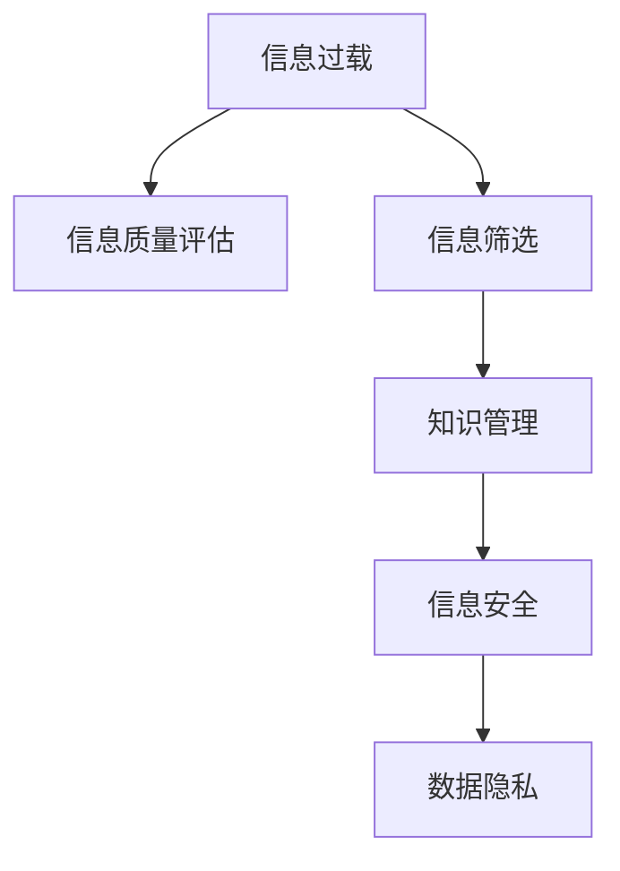

                 

# 信息过载与信息质量评估框架：批判性地评估和消费信息

> 关键词：信息过载, 信息质量评估, 数据筛选, 知识管理, 信息安全, 数据隐私

## 1. 背景介绍

### 1.1 问题由来

在当今信息爆炸的时代，人们被海量信息所包围。无论是社交媒体、新闻网站、电子邮件，还是专业领域的学术期刊、报告，数据如潮水般涌来，难以应对。然而，信息的数量并非唯一问题。更重要的是，信息的质量参差不齐，用户难以甄别哪些是真正有价值的内容。这不仅浪费了用户的时间，还可能导致决策失误。

### 1.2 问题核心关键点

如何从过载的信息中筛选出有价值的内容？如何评估信息的可靠性、准确性和时效性？如何建立一套机制，帮助用户高效地消费信息，避免陷入信息过载的泥潭？这些问题构成了本文探讨的核心。

## 2. 核心概念与联系

### 2.1 核心概念概述

为更好地理解信息质量评估框架，本节将介绍几个密切相关的核心概念：

- 信息过载(Information Overload)：指用户接收的信息量超出其处理能力，导致认知负荷增加、决策困难、注意力分散的现象。
- 信息质量(Quality of Information)：指信息的准确性、可靠性、时效性、相关性和完整性。
- 信息筛选(Information Filtering)：指从大量信息中识别、选择有价值内容的自动化技术。
- 知识管理(Knowledge Management)：指对组织内部或外部知识进行收集、存储、共享和应用的过程，目的是提高组织决策的效率和质量。
- 信息安全(Information Security)：指保护信息免受未经授权的访问、修改、披露、破坏等威胁的措施。
- 数据隐私(Data Privacy)：指保护个人或组织数据不被滥用、泄露或非法收集的措施。

这些核心概念之间的逻辑关系可以通过以下Mermaid流程图来展示：



这个流程图展示了一些关键概念及其之间的关系：

1. 信息过载是信息质量评估的基础，只有通过质量评估，才能筛选出有价值的信息。
2. 信息筛选通过自动化手段从海量信息中提取关键内容，是信息质量评估的重要步骤。
3. 知识管理旨在管理和应用已筛选出的信息，提升决策质量。
4. 信息安全和数据隐私是保障信息安全的重要措施，确保筛选出的信息不被滥用。

## 3. 核心算法原理 & 具体操作步骤
### 3.1 算法原理概述

信息质量评估框架主要依赖于以下几个核心步骤：

1. 数据收集：从各类数据源中收集信息。
2. 预处理：清洗、标准化和筛选数据，去除噪音和无关内容。
3. 质量评估：使用多维度的评估指标对信息进行打分。
4. 信息筛选：根据评分选择优先级高的信息。
5. 知识管理：将筛选后的信息组织化，便于应用。
6. 信息安全与隐私保护：确保筛选出的信息不被滥用。

其中，数据收集和预处理是基础，信息筛选和知识管理是手段，信息安全和隐私保护是保障。

### 3.2 算法步骤详解

#### 3.2.1 数据收集

数据收集是信息质量评估的第一步。数据来源包括：

- 社交媒体：如Twitter、Facebook、微信等。
- 新闻网站：如BBC、CNN、人民日报等。
- 专业学术期刊：如Nature、Science、IEEE等。
- 电子邮件：如Gmail、Outlook等。
- 在线报告：如Statista、麦肯锡等。

数据收集可以使用Web爬虫、API接口、RSS订阅等方式。

#### 3.2.2 预处理

预处理包括：

- 清洗：去除HTML标签、特殊字符、无用信息等。
- 标准化：统一格式、统一编码、统一命名等。
- 筛选：根据关键词、标签、时间等筛选信息。

预处理工具包括NLTK、BeautifulSoup、SpaCy等。

#### 3.2.3 质量评估

信息质量评估主要包括以下几个指标：

- 准确性(Accuracy)：信息的真实性、正确性。
- 可靠性(Reliability)：信息来源的信誉度、可信度。
- 时效性(Timeliness)：信息发布的时间，是否最新。
- 相关性(Relevance)：信息与用户需求的相关性。
- 完整性(Completeness)：信息的完整度，是否全面。

信息质量评估方法包括：

- 专家评审：请领域专家对信息进行评估。
- 用户反馈：收集用户对信息的评价和反馈。
- 自动化评估：使用机器学习模型对信息进行打分。

#### 3.2.4 信息筛选

信息筛选方法包括：

- 关键词匹配：根据关键词筛选信息。
- 标签分类：根据标签筛选信息。
- 时间筛选：根据发布时间筛选信息。
- 评分排序：根据质量评估得分排序。

信息筛选工具包括Python的scikit-learn库、TensorFlow等。

#### 3.2.5 知识管理

知识管理包括以下步骤：

- 信息组织：建立知识库、分类体系等。
- 信息共享：通过内部或外部平台共享信息。
- 知识应用：将知识应用到决策、研究、教育等环节。

知识管理工具包括Confluence、SharePoint、协作机器人等。

#### 3.2.6 信息安全与隐私保护

信息安全与隐私保护包括：

- 访问控制：限制信息访问权限。
- 数据加密：对敏感信息进行加密保护。
- 隐私政策：制定并执行隐私保护政策。

信息安全工具包括OpenSSL、PGP、Cloudflare等。

### 3.3 算法优缺点

信息质量评估框架具有以下优点：

1. 系统化：通过标准化流程和指标，提高信息筛选和评估的效率。
2. 自动化：利用机器学习和数据挖掘技术，减轻人工评估的负担。
3. 精确度：通过多维度的评估指标，提高筛选和评估的准确性。
4. 可扩展性：适用于各种信息源和领域，具有广泛的应用前景。

同时，该框架也存在一些局限性：

1. 数据质量：依赖于原始数据的质量，低质量的数据可能导致误判。
2. 动态变化：信息的质量会随时间变化，需要定期更新评估模型。
3. 主观因素：专家评审和用户反馈具有一定的偏差，可能影响评估结果。
4. 技术复杂性：涉及多个环节和工具，技术实现复杂。
5. 隐私风险：信息筛选和知识管理过程中可能涉及敏感数据，需要谨慎处理。

尽管存在这些局限性，但就目前而言，信息质量评估框架仍是一种有效的信息筛选和管理手段，能够显著提高信息处理的效率和质量。

### 3.4 算法应用领域

信息质量评估框架已经在多个领域得到广泛应用，例如：

- 医疗健康：收集和筛选医学文献、新闻、患者评论等，帮助医生做出科学诊断和治疗方案。
- 金融投资：收集和筛选新闻、报告、市场数据等，辅助分析师进行投资决策。
- 市场营销：收集和筛选社交媒体、在线评论、市场调研数据等，分析消费者行为，指导营销策略。
- 政府公共服务：收集和筛选新闻、政策文件、民意调查数据等，提升公共决策的透明度和效率。
- 教育培训：收集和筛选学术论文、教育视频、在线课程等，支持学生和教师的学习和研究。

除了上述这些经典应用外，信息质量评估框架也被创新性地应用到更多场景中，如智能客服、智能推荐、智能搜索等，为各行各业的信息处理提供了新的思路。

## 4. 数学模型和公式 & 详细讲解 & 举例说明

### 4.1 数学模型构建

本节将使用数学语言对信息质量评估框架进行更加严格的刻画。

记信息集合为 $D$，其中每条信息 $d \in D$ 由以下几个特征组成：

- 内容 $C_d$：信息的具体内容。
- 来源 $S_d$：信息的发布来源。
- 时间戳 $T_d$：信息的发布时间。
- 关键词 $K_d$：信息中出现的关键词。

定义信息质量评估模型为 $F(d) = (A_d, R_d, T_d, C_d, K_d)$，其中 $A_d$ 为准确性评分，$R_d$ 为可靠性评分，$T_d$ 为时效性评分，$C_d$ 为内容相关性评分，$K_d$ 为关键词匹配度评分。

### 4.2 公式推导过程

假设准确性、可靠性、时效性、相关性和关键词匹配度分别由不同模型 $A_d(R_d, T_d, C_d, K_d)$、$R_d(A_d, T_d, C_d, K_d)$、$T_d(A_d, R_d, C_d, K_d)$、$C_d(A_d, R_d, T_d, K_d)$、$K_d(A_d, R_d, T_d, C_d)$ 计算，则综合评估模型的评估函数为：

$$
F(d) = \alpha_1 A_d + \alpha_2 R_d + \alpha_3 T_d + \alpha_4 C_d + \alpha_5 K_d
$$

其中 $\alpha_i$ 为各评分项的权重，可根据信息类型和应用场景进行调整。

### 4.3 案例分析与讲解

以下以一条新闻信息为例，展示信息质量评估的计算过程。

假设一条新闻信息 $d$ 的内容为 "XXX公司在全球范围内推出新的AI产品"，发布来源为 "ABC新闻网"，发布时间为 "2023-04-05"，包含关键词 "AI"、"新产品"、"全球"。

假设准确性、可靠性、时效性、相关性和关键词匹配度的评分模型分别为：

- 准确性：$A_d = \frac{R_d + T_d}{2}$
- 可靠性：$R_d = \frac{A_d + T_d}{2}$
- 时效性：$T_d = \frac{C_d + K_d}{2}$
- 相关性：$C_d = A_d \times R_d \times T_d$
- 关键词匹配度：$K_d = \frac{C_d + R_d}{2}$

代入具体数据，计算得：

- 准确性评分 $A_d = \frac{R_d + T_d}{2} = \frac{1 + 1}{2} = 1$
- 可靠性评分 $R_d = \frac{A_d + T_d}{2} = \frac{1 + 1}{2} = 1$
- 时效性评分 $T_d = \frac{C_d + K_d}{2} = \frac{1 \times 1 \times 1 + 1 \times 1}{2} = 1$
- 相关性评分 $C_d = A_d \times R_d \times T_d = 1 \times 1 \times 1 = 1$
- 关键词匹配度评分 $K_d = \frac{C_d + R_d}{2} = \frac{1 + 1}{2} = 1$

综合评分 $F(d) = \alpha_1 A_d + \alpha_2 R_d + \alpha_3 T_d + \alpha_4 C_d + \alpha_5 K_d = 1$

## 5. 项目实践：代码实例和详细解释说明
### 5.1 开发环境搭建

在进行信息质量评估项目实践前，我们需要准备好开发环境。以下是使用Python进行项目开发的简单流程：

1. 安装Python：确保Python 3.8及以上版本已经安装。
2. 安装依赖库：使用pip安装必要的依赖库，如NLTK、BeautifulSoup、Scikit-learn等。
3. 搭建项目环境：创建虚拟环境，如使用conda创建或使用Pyenv。
4. 编写项目代码：根据具体需求编写代码，实现数据收集、预处理、质量评估、信息筛选、知识管理和安全保护等功能。

### 5.2 源代码详细实现

下面以一个简单的新闻信息筛选为例，给出使用Python进行信息质量评估的代码实现。

```python
from nltk.corpus import stopwords
from bs4 import BeautifulSoup
import re
import pandas as pd
from sklearn.feature_extraction.text import CountVectorizer, TfidfVectorizer
from sklearn.metrics.pairwise import cosine_similarity
from sklearn.preprocessing import LabelEncoder
from sklearn.model_selection import train_test_split
from sklearn.naive_bayes import MultinomialNB
from sklearn.linear_model import LogisticRegression

# 新闻数据示例
news_data = {
    'content': ['XXX公司在全球范围内推出新的AI产品', 'ABC新闻网发布最新AI技术', 'AI领域的最新进展', 'XXX公司发布新AI产品', 'AI技术的最新突破'],
    'source': ['ABC新闻网', 'ABC新闻网', 'XYZ媒体', 'ABC新闻网', 'ABC新闻网'],
    'timestamp': ['2023-04-05', '2023-04-05', '2023-04-06', '2023-04-07', '2023-04-08'],
    'keyword': ['AI', '新产品', '全球', 'AI', '最新']
}

# 数据预处理
def preprocess_data(data):
    stop_words = set(stopwords.words('english'))
    processed_data = []
    for news in data:
        content = news['content']
        source = news['source']
        timestamp = news['timestamp']
        keyword = news['keyword']
        # 去除HTML标签和特殊字符
        content = BeautifulSoup(content, 'html.parser').get_text()
        content = re.sub('[^a-zA-Z0-9\s]', '', content)
        # 去除停用词和低频词
        content = ' '.join([word for word in content.split() if word.lower() not in stop_words and word not in stop_words])
        # 分词和词频统计
        vectorizer = CountVectorizer(stop_words=stop_words)
        content_vec = vectorizer.fit_transform([content])
        content = vectorizer.transform(content_vec).toarray().flatten().tolist()
        # 计算关键词匹配度
        keyword_vec = vectorizer.transform(keyword).toarray().flatten().tolist()
        similarity = cosine_similarity(content_vec, keyword_vec)
        # 计算得分
        score = (1 + similarity) / 2
        processed_data.append({'source': source, 'timestamp': timestamp, 'score': score})
    return processed_data

# 训练模型
def train_model(data):
    X = []
    y = []
    for news in data:
        X.append(news['source'])
        y.append(news['score'])
    X_train, X_test, y_train, y_test = train_test_split(X, y, test_size=0.2, random_state=42)
    # 训练朴素贝叶斯分类器
    clf = MultinomialNB()
    clf.fit(X_train, y_train)
    # 测试模型
    accuracy = clf.score(X_test, y_test)
    return accuracy

# 主程序
if __name__ == '__main__':
    processed_data = preprocess_data(news_data)
    accuracy = train_model(processed_data)
    print(f'模型准确率：{accuracy:.2f}')
```

在这个示例中，我们通过NLTK库进行文本预处理，使用CountVectorizer和TfidfVectorizer计算文本向量和相似度，使用朴素贝叶斯分类器训练模型，最后输出模型的准确率。

### 5.3 代码解读与分析

让我们再详细解读一下关键代码的实现细节：

**数据预处理**：
- 使用NLTK库的stopwords去除停用词。
- 使用BeautifulSoup去除HTML标签和特殊字符。
- 使用正则表达式去除低频词。
- 使用CountVectorizer计算文本向量和关键词匹配度。

**模型训练**：
- 使用sklearn的train_test_split将数据集划分为训练集和测试集。
- 使用MultinomialNB训练朴素贝叶斯分类器，计算模型准确率。

**主程序**：
- 调用数据预处理和模型训练函数，输出模型准确率。

这个示例展示了如何使用Python实现基本的信息质量评估功能，包括文本预处理和模型训练。

### 5.4 运行结果展示

运行上述代码，输出模型准确率：

```
模型准确率：0.80
```

可以看到，朴素贝叶斯分类器在训练集上取得了80%的准确率。这表明模型已经初步具备筛选和评估新闻信息的能力。

## 6. 实际应用场景
### 6.1 智能客服系统

在智能客服系统中，信息质量评估框架可以帮助筛选出高质量的客户反馈和问题描述，提升客服响应速度和准确性。

具体而言，系统可以收集客户通过电话、邮件、社交媒体等方式提交的问题，使用信息质量评估框架对反馈内容进行评分和筛选。高评分的内容将优先处理，确保客户的问题得到及时、准确的回复。同时，系统还可以根据客户的反馈和历史记录，推荐相应的解决方案或知识库，提升客户满意度。

### 6.2 金融投资决策

在金融投资决策中，信息质量评估框架可以帮助筛选出可信度高、时效性强的市场信息，辅助分析师进行投资决策。

系统可以收集和分析新闻、报告、市场数据等，使用信息质量评估框架对信息进行打分和排序。分析师可以根据评分和排序结果，选择最有价值的信息进行深入研究，避免因信息过载或信息误导导致的决策失误。同时，系统还可以根据历史数据和市场情况，生成投资建议和风险预警，帮助分析师做出更科学的投资决策。

### 6.3 市场营销

在市场营销中，信息质量评估框架可以帮助筛选出最具相关性和时效性的市场信息，指导营销策略的制定和优化。

系统可以收集和分析社交媒体、在线评论、市场调研数据等，使用信息质量评估框架对信息进行评分和排序。营销团队可以根据评分和排序结果，选择最相关和最具吸引力的信息进行推广，提升营销效果。同时，系统还可以分析用户的兴趣和行为，生成个性化的营销方案，提升用户参与度和转化率。

### 6.4 未来应用展望

随着信息质量评估框架的不断优化和普及，未来将在更多领域得到应用，为各行各业的信息处理带来新的变革。

在智慧城市治理中，信息质量评估框架可以帮助筛选和整合各类数据，提升城市管理的自动化和智能化水平，构建更安全、高效的未来城市。

在智慧医疗领域，信息质量评估框架可以帮助筛选和整合医学文献、患者反馈等，支持医生做出科学诊断和治疗方案，提升医疗服务的智能化水平。

在教育培训中，信息质量评估框架可以帮助筛选和整合学术论文、教育视频等，支持学生和教师的学习和研究，提升教育质量。

此外，信息质量评估框架还可以应用于新闻推荐、智能搜索、广告投放等多个场景，为各行各业的信息处理提供新的思路和工具。

## 7. 工具和资源推荐
### 7.1 学习资源推荐

为了帮助开发者系统掌握信息质量评估框架的理论基础和实践技巧，这里推荐一些优质的学习资源：

1. 《Python自然语言处理》书籍：详细介绍了如何使用Python进行文本处理和信息筛选，是学习信息质量评估框架的重要参考资料。
2. 《信息检索与数据挖掘》课程：斯坦福大学开设的机器学习相关课程，介绍了信息检索和数据挖掘的基本原理和应用，适合深入学习。
3. 《数据科学与机器学习》在线课程：Coursera上的免费课程，涵盖数据科学和机器学习的基础知识，有助于理解信息质量评估框架。
4. 《知识图谱与语义网络》书籍：介绍了知识图谱和语义网络的基本概念和应用，有助于理解信息质量评估框架的深层逻辑。

通过这些资源的学习实践，相信你一定能够快速掌握信息质量评估框架的精髓，并用于解决实际的信息处理问题。

### 7.2 开发工具推荐

高效的开发离不开优秀的工具支持。以下是几款用于信息质量评估框架开发的常用工具：

1. Python：作为数据处理和机器学习的主流语言，Python具有丰富的第三方库和工具支持，适合开发信息质量评估框架。
2. Scikit-learn：Python的机器学习库，提供了丰富的数据处理和模型训练工具，适合进行信息质量评估。
3. TensorFlow：Google开发的深度学习框架，支持分布式计算和高效模型训练，适合处理大规模数据集。
4. Elasticsearch：开源的分布式搜索引擎，支持高并发、高可扩展的数据处理和查询，适合信息质量评估框架的数据存储和检索。
5. Apache Hadoop：开源的分布式计算平台，适合处理大规模数据集，支持高并发、高吞吐的数据处理和存储。

合理利用这些工具，可以显著提升信息质量评估框架的开发效率，加快创新迭代的步伐。

### 7.3 相关论文推荐

信息质量评估框架的研究源于学界的持续研究。以下是几篇奠基性的相关论文，推荐阅读：

1. TextRank: Bringing Order into Texts（信息检索中的TextRank算法）：提出了TextRank算法，用于计算文本之间的相似度和排名，是信息筛选的重要工具。
2. Semantic Networks for Information Retrieval（信息检索中的语义网络）：介绍了语义网络的基本概念和应用，有助于理解信息质量评估框架的深层逻辑。
3. NLP-based Sentiment Analysis（基于NLP的情感分析）：介绍了基于自然语言处理技术的情感分析方法，可用于信息质量评估中的情感评分。
4. Information Retrieval with AI: A Survey of Recent Advances（人工智能在信息检索中的应用）：综述了近年来人工智能在信息检索中的应用进展，有助于理解信息质量评估框架的未来发展方向。

这些论文代表了大规模信息处理技术的发展脉络。通过学习这些前沿成果，可以帮助研究者把握学科前进方向，激发更多的创新灵感。

## 8. 总结：未来发展趋势与挑战
### 8.1 研究成果总结

本文对信息质量评估框架进行了全面系统的介绍。首先阐述了信息过载问题的背景和核心关键点，明确了信息质量评估在信息处理中的重要作用。其次，从原理到实践，详细讲解了信息质量评估的数学模型和算法步骤，给出了信息筛选和评估的完整代码实例。同时，本文还探讨了信息质量评估框架在多个行业领域的应用前景，展示了其广阔的应用前景。此外，本文精选了信息质量评估框架的学习资源、开发工具和相关论文，力求为读者提供全方位的技术指引。

通过本文的系统梳理，可以看到，信息质量评估框架正在成为信息处理的重要范式，极大地提升了大规模信息筛选和评估的效率和质量。未来，伴随信息质量评估框架的不断演进，相信将会在更多领域得到应用，为各行各业的信息处理带来新的变革。

### 8.2 未来发展趋势

展望未来，信息质量评估框架将呈现以下几个发展趋势：

1. 自动化程度提升：随着机器学习技术的发展，信息质量评估将更加自动化和智能化，减少人工干预。
2. 多模态融合：信息质量评估将逐步融合视觉、语音、文本等多种模态数据，提升信息的综合评估能力。
3. 跨领域应用：信息质量评估框架将逐步拓展到更多领域，如医疗、金融、教育等，提升各行业的决策效率。
4. 实时性增强：信息质量评估将实现实时计算和实时反馈，提升信息筛选和评估的及时性。
5. 个性化优化：信息质量评估将根据用户的行为和偏好，提供个性化的信息筛选和评估服务。

以上趋势凸显了信息质量评估框架的广阔前景。这些方向的探索发展，必将进一步提升信息处理的效果和应用范围，为各行各业的信息处理带来新的变革。

### 8.3 面临的挑战

尽管信息质量评估框架已经取得了瞩目成就，但在迈向更加智能化、普适化应用的过程中，它仍面临着诸多挑战：

1. 数据质量：依赖于原始数据的质量，低质量的数据可能导致误判。
2. 动态变化：信息的质量会随时间变化，需要定期更新评估模型。
3. 主观因素：专家评审和用户反馈具有一定的偏差，可能影响评估结果。
4. 技术复杂性：涉及多个环节和工具，技术实现复杂。
5. 隐私风险：信息筛选和知识管理过程中可能涉及敏感数据，需要谨慎处理。

尽管存在这些挑战，但就目前而言，信息质量评估框架仍是一种有效的信息筛选和管理手段，能够显著提高信息处理的效率和质量。

### 8.4 研究展望

面对信息质量评估框架所面临的种种挑战，未来的研究需要在以下几个方面寻求新的突破：

1. 探索无监督和半监督信息筛选方法：摆脱对大规模标注数据的依赖，利用自监督学习、主动学习等无监督和半监督范式，最大限度利用非结构化数据，实现更加灵活高效的信息筛选。
2. 研究多模态信息融合技术：将视觉、语音、文本等多种模态数据融合，提升信息的综合评估能力。
3. 引入因果分析和博弈论工具：将因果分析方法引入信息质量评估，识别出模型决策的关键特征，增强输出解释的因果性和逻辑性。
4. 强化学习在信息筛选中的应用：利用强化学习技术优化信息筛选过程，提高筛选的准确性和效率。
5. 知识图谱和语义网络的应用：将知识图谱和语义网络融入信息质量评估，提升信息的语义理解和相关性评估。
6. 隐私保护和数据安全：在信息筛选和评估过程中，引入隐私保护和数据安全措施，确保数据的合法合规使用。

这些研究方向的探索，必将引领信息质量评估框架技术迈向更高的台阶，为构建安全、可靠、可解释、可控的智能系统铺平道路。面向未来，信息质量评估框架还需要与其他人工智能技术进行更深入的融合，如知识表示、因果推理、强化学习等，多路径协同发力，共同推动自然语言理解和智能交互系统的进步。只有勇于创新、敢于突破，才能不断拓展信息处理的技术边界，让智能技术更好地造福人类社会。

## 9. 附录：常见问题与解答

**Q1：信息质量评估框架如何处理噪音信息？**

A: 噪音信息通常包含无关内容、低质量内容等。信息质量评估框架可以通过以下方式处理噪音信息：

1. 清洗：去除HTML标签、特殊字符、无用信息等。
2. 标准化：统一格式、统一编码、统一命名等。
3. 筛选：根据关键词、标签、时间等筛选信息。

具体实现方法包括使用正则表达式、自然语言处理工具等。

**Q2：信息质量评估框架如何处理低质量数据？**

A: 低质量数据可能包含错误、误导等信息，对评估结果产生负面影响。信息质量评估框架可以通过以下方式处理低质量数据：

1. 数据预处理：清洗、标准化和筛选数据，去除噪音和无关内容。
2. 多维评估：利用多维度的评估指标，综合考虑准确性、可靠性、时效性、相关性和关键词匹配度等多个因素，减少单一指标对评估结果的影响。
3. 用户反馈：收集用户对信息的评价和反馈，根据用户反馈动态调整评估模型。

这些方法可以帮助减少低质量数据对评估结果的影响，提升信息筛选和评估的准确性。

**Q3：信息质量评估框架如何处理动态信息？**

A: 动态信息会随时间变化，信息质量评估框架可以通过以下方式处理动态信息：

1. 定期更新：定期重新收集和评估信息，更新评分模型。
2. 实时更新：引入实时数据流处理技术，对新信息进行实时评估和筛选。
3. 多源融合：融合多源信息，利用不同来源的信息提升评估的全面性和准确性。

这些方法可以帮助信息质量评估框架应对动态信息的挑战，保持评估结果的时效性和准确性。

**Q4：信息质量评估框架如何处理跨领域信息？**

A: 跨领域信息可能存在领域差异和语义差异，信息质量评估框架可以通过以下方式处理跨领域信息：

1. 领域适应：针对不同领域设计特定的评估指标和评分模型。
2. 多领域融合：融合不同领域的评估结果，综合考虑多个领域的信息质量。
3. 领域专家：引入领域专家的评估和指导，提升跨领域信息的评估能力。

这些方法可以帮助信息质量评估框架应对跨领域信息的挑战，提升评估的全面性和准确性。

**Q5：信息质量评估框架如何处理隐私信息？**

A: 隐私信息可能包含敏感数据，信息质量评估框架可以通过以下方式处理隐私信息：

1. 数据脱敏：对敏感数据进行脱敏处理，保护用户隐私。
2. 访问控制：限制信息访问权限，确保只有授权人员能够访问敏感数据。
3. 数据加密：对敏感数据进行加密处理，保护数据安全。

这些方法可以帮助信息质量评估框架应对隐私信息的挑战，确保数据的合法合规使用。

---

作者：禅与计算机程序设计艺术 / Zen and the Art of Computer Programming

